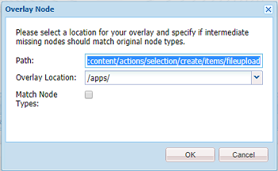

# Administrar recursos de vídeo {#manage-video-assets}

El formato de vídeo es una parte fundamental de los recursos digitales de una organización. [!DNL Adobe Experience Manager] Las ofertas maduran las ofertas y funciones para administrar todo el ciclo de vida de los recursos de vídeo después de crearlos.

Obtenga información sobre cómo administrar y editar los recursos de vídeo en [!DNL Adobe Experience Manager Assets]. Además, si tiene licencia para usar [!DNL Dynamic Media], consulte la documentación [de vídeo de](/help/assets/video.md)Dynamic Media.

## Carga y previsualización de recursos de vídeo {#upload-and-preview-video-assets}

[!DNL Adobe Experience Manager Assets] genera previsualizaciones para recursos de vídeo con la extensión MP4. Si el formato del recurso no es MP4, instale el paquete FFmpeg para generar una previsualización. FFmpeg crea representaciones de vídeo de tipo OGG y MP4. Puede realizar la previsualización de las representaciones en la interfaz de usuario de Recursos.

1. En la carpeta o subcarpetas de recursos digitales, navegue a la ubicación donde desee agregar recursos digitales.
1. Para cargar el recurso, haga clic en **[!UICONTROL Crear]** en la barra de herramientas y, a continuación, elija **[!UICONTROL Archivos]**. Como alternativa, suéltela directamente en el área de recursos. Consulte [Carga de recursos](managing-assets-touch-ui.md#uploading-assets) para obtener más información sobre la operación de carga.
1. Para previsualización de un vídeo en la vista de tarjeta, haga clic en el botón **[!UICONTROL Reproducir]** del recurso de vídeo.

   

   Puede pausar o reproducir vídeo solo en la vista de la tarjeta. Los botones [!UICONTROL Reproducir] y [!UICONTROL Pausa] no están disponibles en la vista de lista.

1. Para previsualización del vídeo en la página de detalles del recurso, haga clic en **[!UICONTROL Editar]** en la tarjeta.

   El vídeo se reproduce en el reproductor de vídeo nativo del navegador. Puede reproducir, pausar, controlar el volumen y aplicar zoom en el vídeo a pantalla completa.

   

## Configuración para cargar recursos de más de 2 GB {#configuration-to-upload-assets-that-are-larger-than-gb}

De forma predeterminada, [!DNL Assets] no permite cargar recursos que superen los 2 GB debido a un límite de tamaño de archivo. Sin embargo, puede sobrescribir este límite si ingresa a CRXDE Lite y crea un nodo en el `/apps` directorio. El nodo debe tener el mismo nombre de nodo, estructura de directorio y propiedades de nodo comparables de order.

Además de [!DNL Assets] la configuración, cambie las configuraciones siguientes para cargar recursos de gran tamaño:

* Aumente el tiempo de caducidad del token. Consulte [!UICONTROL Adobe Granite CSRF Servlet] en la consola web en `https://[aem_server]:[port]/system/console/configMgr`. Para obtener más información, consulte Protección [de](/help/sites-developing/csrf-protection.md)CSRF.
* Aumente la configuración `receiveTimeout` en Dispatcher. Para obtener más información, consulte Configuración [de Dispatcher](https://docs.adobe.com/content/help/en/experience-manager-dispatcher/using/configuring/dispatcher-configuration.html#renders-options)Experience Manager.

>[!NOTE]
>
>La interfaz de usuario [!DNL Experience Manager] Classic no tiene una restricción de tamaño de archivo de 2 GB. Además, el flujo de trabajo de extremo a extremo para vídeos de gran tamaño no es totalmente compatible.

Para configurar un límite de tamaño de archivo mayor, realice los siguientes pasos en el `/apps` directorio.

1. In [!DNL Experience Manager], click **[!UICONTROL Tools]** > **[!UICONTROL General]** > **[!UICONTROL CRXDE Lite]**.
1. En CRXDE Lite, vaya a `/libs/dam/gui/content/assets/jcr:content/actions/secondary/create/items/fileupload`. Para ver la ventana del directorio, haga clic en el botón `>>`.
1. From the toolbar, click the **[!UICONTROL Overlay Node]**. También puede seleccionar **[!UICONTROL Nodo de superposición]** en el menú contextual.
1. In the **[!UICONTROL Overlay Node]** dialog, click **[!UICONTROL OK]**.

   

1. Actualice el explorador. El nodo de superposición `/jcr_root/apps/dam/gui/content/assets/jcr:content/actions/secondary/create/items/fileupload` está seleccionado.
1. En la ficha **[!UICONTROL Propiedades]** , introduzca el valor apropiado en bytes para aumentar el límite de tamaño al tamaño deseado. Por ejemplo, para aumentar el límite de tamaño a 30 GB, escriba `{sizeLimit : "32212254720"}` value.

1. En la barra de herramientas, haga clic en **[!UICONTROL Guardar todo]**.
1. In [!DNL Experience Manager], click **[!UICONTROL Tools]** > **[!UICONTROL Operations]** > **[!UICONTROL Web Console]**.
1. En la página [!DNL Adobe Experience Manager] Web Console Bundles [!UICONTROL , en la columna Nombre de la tabla, busque y haga clic en] Adobe Granite Workflow External Process Job Handler ****.
1. On the [!UICONTROL Adobe Granite Workflow External Process Job Handler] page, set the seconds for both **[!UICONTROL Default Timeout]** and **[!UICONTROL Max Timeout]** fields to `18000` (five hours). Haga clic en **[!UICONTROL Guardar]**.
1. En [!DNL Experience Manager], haga clic en **[!UICONTROL Herramientas]** > **[!UICONTROL Flujo de trabajo]** > **[!UICONTROL Modelos]**.
1. En la página Modelos de flujo de trabajo, seleccione **[!UICONTROL Dynamic Media Codificar vídeo]** y, a continuación, haga clic en **[!UICONTROL Editar]**.
1. En la página de flujo de trabajo, haga clic con el botón doble en el componente Proceso **[!UICONTROL del servicio de vídeo de]** Dynamic Media.
1. En el cuadro de diálogo [!UICONTROL Propiedades del paso], en la pestaña **[!UICONTROL Común]**, expanda **Configuración avanzada**.
1. In the **[!UICONTROL Timeout]** field, specify a value of `18000`, then click **[!UICONTROL OK]** to return to the **[!UICONTROL Dynamic Media Encode Video]** workflow page.
1. Cerca de la parte superior de la página, debajo del título de la página [!UICONTROL Dynamic Media Encode Video] , haga clic en **[!UICONTROL Guardar]**.

## Publicación de recursos de vídeo {#publish-video-assets}

Después de la publicación, puede incluir los recursos de vídeo en una página web como URL o incrustar directamente los recursos. Para obtener más información, consulte [Publicación de recursos](/help/assets/publishing-dynamicmedia-assets.md)de medios dinámicos.

## Anotación de recursos de vídeo {#annotate-video-assets}

1. En la consola Recursos, haga clic en [!UICONTROL Editar] en la tarjeta de recursos para mostrar la página de detalles de recursos.
1. Para reproducir el vídeo, haga clic en [!UICONTROL Previsualización].
1. Para realizar anotaciones en el vídeo, haga clic en el botón **[!UICONTROL Anotar]** . Se agrega una anotación en el tiempo (fotograma) concreto del vídeo. Al realizar anotaciones, puede dibujar en el lienzo e incluir un comentario con el dibujo. Los comentarios se guardan automáticamente.

   

   Para salir del asistente para anotaciones, haga clic en **[!UICONTROL Cerrar]**.

1. Busque un punto específico en el vídeo, establezca el tiempo en segundos en el campo de **texto** y haga clic en **Saltar**. Por ejemplo, para omitir los primeros 10 segundos de vídeo, introduzca 20 en el campo de texto.

   

1. Para vista en la línea de tiempo, haga clic en una anotación. Para eliminar la anotación de la línea de tiempo, haga clic en **[!UICONTROL Eliminar]**.

   

>[!MORELIKETHIS]
>
>* [Gestión de recursos digitales en recursos de Experience Manager](/help/assets/managing-assets-touch-ui.md)
>* [Gestión de colecciones en recursos Experience Manager](/help/assets/managing-collections-touch-ui.md)

