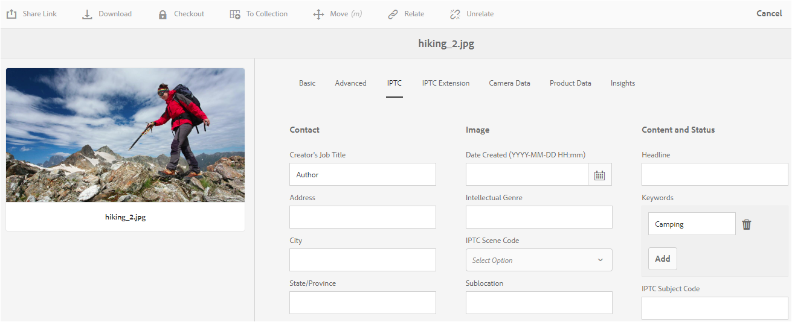

# Explicación de los conceptos de metadatos {#why-we-need-metadata}

Metadatos significa datos sobre los datos. A este respecto, los datos hacen referencia a su recurso digital, por ejemplo una imagen. Los metadatos son esenciales para una administración eficiente de los recursos.

Los metadatos son la recopilación de todos los datos disponibles para un recurso, pero no necesariamente están contenidos en esa imagen. Algunos ejemplos de metadatos son:

* Nombre del recurso.
* Hora y fecha de la última modificación.
* Tamaño del recurso tal como se almacenó en el repositorio.
* Nombre de la carpeta en la que está contenido.
* Recursos relacionados o etiquetas aplicadas.

Lo anterior son las propiedades de metadatos básicas que [!DNL Experience Manager] puede administrar para los recursos, lo que permite a los usuarios ver todos los recursos. Por ejemplo, ordenar recursos por fecha de la última modificación resulta útil cuando se intenta descubrir los recursos añadidos recientemente.

Puede agregar más datos de alto nivel a los recursos digitales, por ejemplo:

* Tipo de recurso (una imagen, un vídeo, un clip de audio o un documento).
* Propietario del recurso.
* Título del recurso.
* Descripción del recurso.
* Etiquetas asignadas a un recurso.

Más metadatos le ayudan a categorizar los recursos y resulta útil a medida que aumenta la cantidad de información digital. Es posible administrar algunos cientos de archivos basados en solo los nombres de archivo. Sin embargo, este enfoque no es escalable. Se queda corto cuando aumenta el número de personas involucradas y el número de activos gestionados.

Con la adición de metadatos, el valor de un recurso digital aumenta, ya que el recurso se convierte en,

* Más accesible: los sistemas y usuarios pueden encontrarlo fácilmente.
* Más fácil de administrar: puede encontrar recursos con el mismo conjunto de propiedades más fácilmente y aplicarles cambios.
* Completado : el recurso conlleva más información y contexto con más metadatos.

Por estos motivos, [!DNL Assets] le proporciona los medios adecuados para crear, administrar e intercambiar metadatos para sus recursos digitales.

## Tipos de metadatos {#types-of-metadata}

Los dos tipos básicos de metadatos son metadatos técnicos y metadatos descriptivos.

Los metadatos técnicos son útiles para las aplicaciones de software que se ocupan de recursos digitales y no deben mantenerse manualmente. [!DNL Experience Manager Assets] y otro software determinan automáticamente los metadatos técnicos, y los metadatos pueden cambiar cuando se modifica el recurso. Los metadatos técnicos disponibles de un recurso dependen en gran medida del tipo de archivo del recurso. Algunos ejemplos de metadatos técnicos son:

* Tamaño de un archivo.
* Dimension (altura y anchura) de una imagen.
* Velocidad de bits de un archivo de audio o vídeo.
* Resolución (nivel de detalle) de una imagen.

Los metadatos descriptivos son metadatos relacionados con el dominio de la aplicación, por ejemplo, el negocio del que proviene un recurso. Los metadatos descriptivos no se pueden determinar automáticamente. Se crea de forma manual o semiautomática. Por ejemplo, una cámara con GPS puede rastrear automáticamente la latitud y la longitud y añadir la etiqueta geográfica de la imagen.

El coste de crear manualmente información de metadatos descriptivos es alto. Por lo tanto, se establecen estándares para facilitar el intercambio de metadatos entre sistemas y organizaciones de software. [!DNL Experience Manager Assets] admite todas las normas pertinentes para la gestión de metadatos.

## Normas de codificación {#encoding-standards}

Existen varias formas de incrustar metadatos en archivos. Se admite una selección de estándares de codificación:

* XMP: utilizado por [!DNL Assets] para almacenar los metadatos extraídos dentro del repositorio.
* ID3: para archivos de audio y vídeo.
* Exif: para archivos de imagen.
* Otros/Heredados: desde [!DNL Microsoft Word], [!DNL PowerPoint], [!DNL Excel], etc.

### XMP {#xmp}

[!DNL Extensible Metadata Platform] (XMP) es un estándar abierto que utiliza  [!DNL Experience Manager Assets] para toda la administración de metadatos. El estándar ofrece una codificación de metadatos universal que se puede incrustar en todos los formatos de archivo. Adobe y otras empresas admiten XMP estándar, ya que proporciona un modelo de contenido enriquecido. Los usuarios de XMP estándar y de [!DNL Experience Manager Assets] tienen una potente plataforma en la que basarse. Para obtener más información, consulte [XMP](https://www.adobe.com/products/xmp.html).

### ID3 {#id}

Los datos almacenados en estas etiquetas ID3 se muestran al reproducir un archivo de audio digital en el equipo o en un reproductor MP3 portátil.

Las etiquetas ID3 están diseñadas para el formato de archivo MP3. Información adicional sobre formatos:

* Las etiquetas ID3 funcionan en archivos MP3 y mp3PRO.
* WAV no tiene etiquetas.
* WMA tiene etiquetas propietarias que no permiten la implementación de código abierto.
* Ogg Vorbis utiliza Comentarios Xiph incrustados en el contenedor Ogg.
* AAC utiliza un formato de etiquetado propietario.

### Exif {#exif}

El formato de archivo de imagen intercambiable (Exif) es el formato de metadatos más utilizado en la fotografía digital. Proporciona una forma de integrar un vocabulario fijo de propiedades de metadatos en muchos formatos de archivo, como JPEG, TIFF, RIFF y WAV. Exif almacena metadatos como pares de un nombre de metadatos y un valor de metadatos. Estos pares de metadatos nombre-valor también se denominan etiquetas, no confundirlos con el etiquetado de [!DNL Experience Manager]. Las cámaras digitales modernas crean metadatos Exif y el software de gráficos moderno lo admite. El formato Exif es el denominador común más bajo para la administración de metadatos, especialmente para imágenes.

Una limitación importante de Exif es que algunos formatos de archivo de imagen populares como BMP, GIF o PNG no los admiten.

Los campos de metadatos definidos por Exif suelen ser de naturaleza técnica y su uso es limitado para la administración de metadatos descriptivos. Por este motivo, [!DNL Experience Manager Assets] ofrece la asignación de propiedades Exif en [esquemas de metadatos comunes](metadata-schemas.md) y en [XMP](xmp-writeback.md).

### Otros metadatos {#other-metadata}

Otros metadatos que se pueden incrustar desde archivos son [!DNL Microsoft Word], [!DNL PowerPoint], [!DNL Excel], etc.

## Comprender los esquemas de metadatos {#metadata-schemata}

Los esquemas de metadatos son conjuntos predefinidos de definiciones de propiedades de metadatos que se pueden utilizar en varias aplicaciones. Las propiedades siempre están asociadas a un recurso, lo que significa que las propiedades son &quot;about&quot; el recurso.

También puede diseñar sus propios esquemas de metadatos si no existe ninguno que se ajuste a sus necesidades. No duplique la información existente. Dentro de una organización, la separación de esquemas facilita el uso compartido de metadatos. [!DNL Experience Manager] proporciona una lista predeterminada de los esquemas de metadatos más populares. La lista le ayuda a poner en marcha su estrategia de metadatos y a elegir rápidamente las propiedades de metadatos que necesita.

A continuación se enumeran los esquemas de metadatos admitidos.

### Metadatos estándar {#standard-metadata}

* DC - [!DNL Dublin Core] es un conjunto importante y ampliamente utilizado de metadatos.
* DICOM - Imágenes digitales y comunicaciones en medicina.
* `Iptc4xmpCore` y  `iptc4xmpExt` - International Press Communications Standard contiene muchos metadatos específicos de cada tema.
* RDF - Marco de descripción de recursos - para metadatos web semánticos genéricos.
* XMP - [!DNL Extensible Metadata Platform].
* `xmpBJ` - Entradas de trabajo básicas.

### Metadatos específicos de la aplicación {#application-specific-metadata}

Los metadatos específicos de la aplicación incluyen metadatos técnicos y descriptivos. Si utiliza estos metadatos, es posible que otras aplicaciones no puedan utilizarlos. Por ejemplo, es posible que una aplicación de renderización de imágenes diferente no pueda acceder a los metadatos [!DNL Adobe Photoshop]. Puede crear un paso de flujo de trabajo que cambie una propiedad específica de la aplicación a una propiedad estándar.

* ACDSee: metadatos administrados por el programa [!DNL ACDSee]. Consulte [www.acdsee.com/](https://www.acdsee.com/).
* Álbum - [!DNL Adobe Photoshop Album].
* CQ - Utilizado por [!DNL Experience Manager Assets].
* DAM - Utilizado por [!DNL Experience Manager Assets].
* DEX - [Optima SC Description explorer](http://www.optimasc.com/products/dex/index.html) es una colección de herramientas para la administración de metadatos y archivos para sistemas operativos Windows.
* CRS - [Adobe Photoshop Camera Raw](https://helpx.adobe.com/camera-raw/using/introduction-camera-raw.html).
* LR - [!DNL Adobe Lightroom].
* MediaPro - [iView MediaPro](https://en.wikipedia.org/wiki/Phase_One_Media_Pro).
* MicrosoftPhoto y MP - Microsoft Photo.
* PDF y PDF/X.
* Photoshop y psAux: [!DNL Adobe Photoshop].

### Metadatos de Digital Rights Management (DRM) {#digital-rights-management-metadata}

* CC - [!DNL Creative Commons].
* [!DNL XMPRights].
* ADEMÁS: [Picture Licensing Universal System](https://www.useplus.com).
* PRISM - [Requisitos de publicación para metadatos estándar del sector](https://www.idealliance.org/prism-metadata).
* PRL - lenguaje de derechos PRISM.
* PUR - Derechos de uso de PRISM.
* `xmpPlus` - Integración de PLUS con XMP.

### Metadatos específicos de la fotografía {#photography-specific-metadata}

* Exif - Información técnica de la cámara, incluida la posición GPS.
* CRS - [!DNL Camera Raw] esquema.
* `iptc4xmpCore` y `iptc4xmpExt`.
* TIFF: metadatos de imagen (no solo para imágenes TIFF).

### Metadatos específicos de impresión {#print-specific-metadata}

* PDF y PDF/X - Adobe PDF y aplicaciones de terceros.
* PRISM - [Requisitos de publicación para metadatos estándar del sector](https://www.idealliance.org/prism-metadata).
* XMP - [!DNL Extensible Metadata Platform].
* `xmpPG` - XMP metadatos para texto paginado.

### Metadatos específicos de multimedia {#multimedia-specific-metadata}

* `xmpDM` - [!DNL Dynamic Media].
* `xmpMM` - Administración de medios.

## Referencia de esquemas de metadatos {#metadata-schemata-reference}

La siguiente referencia incluye información sobre esquemas de metadatos específicos (en orden alfabético), así como una lista de propiedades y sus definiciones.

### Dublin Core {#dublin-core}

Los metadatos principales de Dublín proporcionan un conjunto estandarizado de convenciones para describir los activos y facilitar su búsqueda. En [!DNL Assets], Dublin Core describe los recursos digitales, incluidos vídeo, sonido, imágenes y documentos.

El sencillo conjunto de elementos de metadatos principales de Dublín (DCMES) contiene 15 elementos de metadatos enumerados en la siguiente tabla. Cada elemento principal de Dublín es opcional y se puede repetir. Puede añadir o eliminar la información de metadatos de Dublin Core, como lo haría con los metadatos específicos de tipo de medio.

Además del DCMES, existen otros elementos de metadatos creados por la Iniciativa Principal de Dublín. Consulte la [Iniciativa principal de Dublín](https://dublincore.org/) para obtener más información.

| Propiedad | Descripción |
| ----------- | ------------------------------------------------------------------------------------------------------------------------ |
| colaborador | La persona o empresa responsable de contribuir al contenido. |
| cobertura | Ubicación geográfica o período de tiempo que abarca el recurso. |
| creador | La persona o empresa responsable de la creación del contenido. |
| date | Fecha o período de tiempo asociado al recurso. |
| Descripción | Más información sobre el recurso. |
| format | El formato de archivo, el medio físico o las dimensiones del recurso. [!DNL Experience Manager] utiliza  `dc:format` para denotar el tipo MIME del recurso. |
| identifier | Una referencia única al recurso. |
| language | El idioma del recurso (por ejemplo, `en` para inglés). |
| publisher | La persona o empresa responsable de poner el recurso a disposición. |
| relation | Un recurso relacionado. |
| derechos | Información sobre quién tiene los derechos de este recurso. |
| source | Recurso relacionado del que se deriva el recurso. |
| subject | El tema del recurso. |
| el título | Un nombre para el recurso. |
| tipo | La naturaleza o el género del recurso. |

### IPTC {#iptc}

El Consejo Internacional de Telecomunicaciones de Prensa (IPTC, por sus siglas en inglés) es un consorcio de agencias de noticias alrededor del mundo - uno de sus objetivos es desarrollar y mantener estándares técnicos. El IPTC definió un conjunto de estándares de metadatos de fotos para imágenes que es aceptado casi universalmente entre los fotógrafos. Estas normas de metadatos formaban parte del estándar más amplio conocido como el Modelo de intercambio de información IPTC (IIM) creado en los años 90.

Aunque la información del encabezado IPTC se ha reemplazado por XMP, un esquema principal IPTC y un esquema de extensión están disponibles para XMP. En los programas de imágenes, se sincronizan las propiedades XMP e IPTC.

## Flujos de trabajo impulsados por metadatos {#metadata-driven-workflows}

La creación de flujos de trabajo impulsados por metadatos ayuda a automatizar algunos procesos, lo que mejora la eficacia. En un flujo de trabajo impulsado por metadatos, el sistema de administración del flujo de trabajo lee el flujo de trabajo y, como resultado, realiza alguna acción predefinida. Por ejemplo, algunas de las formas en que puede utilizar flujos de trabajo basados en metadatos:

* El flujo de trabajo puede comprobar si una imagen tiene un título o no. Si no es así, el sistema notifica que debe añadir un título.
* El flujo de trabajo puede comprobar si un aviso de copyright de un recurso permite la distribución o no. Por lo tanto, el sistema envía el recurso a un servidor o a otro.
* Un flujo de trabajo puede comprobar los recursos sin metadatos predefinidos obligatorios ni con metadatos *no válidos*.

## Metadatos XMP {#xmp-metadata}

XMP (Extensible Metadata Platform) es el estándar de metadatos que utiliza [!DNL Adobe Experience Manager Assets] para toda la administración de metadatos. XMP proporciona un formato estándar para la creación, el procesamiento y el intercambio de metadatos para una amplia variedad de aplicaciones.

Además de ofrecer codificación de metadatos universal que se puede incrustar en todos los formatos de archivo, XMP ofrece un [modelo de contenido](#xmp-core-concepts) enriquecido y es [compatible con Adobe](#advantages-of-xmp) y otras empresas, por lo que los usuarios de XMP en combinación con [!DNL Assets] tienen una plataforma poderosa en la que basarse.

La [especificación de XMP](https://www.adobe.com/devnet/xmp.html) está disponible en el Adobe.

### ¿Qué es XMP? {#what-is-xmp}

Adobe introdujo primero el XMP estándar como parte del producto de software de Adobe Acrobat. Desde entonces, la norma XMP ha sido ampliamente adoptada. [!DNL Assets] de forma nativa es compatible con la XMP: la plataforma de metadatos extensible encabezada por el Adobe. XMP es un estándar para procesar y almacenar metadatos estandarizados y de propiedad en recursos digitales. XMP está diseñado para ser el estándar común que permite que varias aplicaciones funcionen eficazmente con metadatos.

Los profesionales de producción, por ejemplo, utilizan la compatibilidad XMP integrada en las aplicaciones de Adobe para pasar información a través de varios formatos de archivo. [!DNL Assets] el repositorio extrae los metadatos de XMP y los utiliza para administrar el ciclo de vida del contenido y ofrece la capacidad de crear flujos de trabajo de automatización.

XMP estandariza la forma en que se definen, crean y procesan los metadatos proporcionando un modelo de datos, un modelo de almacenamiento y esquemas. Todos estos conceptos se tratan en esta sección.

Todos los metadatos heredados de EXIF, ID3 o Microsoft Office se traducen automáticamente a XMP, lo que se puede ampliar para admitir esquemas de metadatos específicos del cliente, como catálogos de productos.

Los metadatos de XMP constan de un conjunto de propiedades. Estas propiedades siempre están asociadas con un
entidad concreta denominada recurso; es decir, las propiedades son &quot;about&quot; el recurso. En el caso de XMP, el recurso siempre es el recurso.

### XMP ecosistema {#xmp-ecosystem}

XMP define un modelo de [metadatos](https://es.wikipedia.org/wiki/Metadatos) que se puede utilizar con cualquier conjunto definido de elementos de metadatos. XMP también define [esquemas](https://en.wikipedia.org/wiki/XML_schema) específicos para propiedades básicas útiles para registrar el historial de un recurso a medida que pasa por varios pasos de procesamiento, desde ser fotografiado, [escaneado](https://es.wikipedia.org/wiki/Esc%C3%A1ner_inform%C3%A1tico) o creado como texto, pasando por etapas de edición fotográfica (como [recorte](https://en.wikipedia.org/wiki/Cropping_%28image%29) o ajuste de color), hasta ensamblarse en una imagen final. XMP permite a cada programa o dispositivo de software añadir su propia información a un recurso digital, que se puede retener en el archivo digital final.

XMP se serializa y almacena con mayor frecuencia mediante un subconjunto del [W3C](https://es.wikipedia.org/wiki/World_Wide_Web_Consortium) [Resource Description Framework](https://en.wikipedia.org/wiki/Resource_Description_Framework) (RDF), que a su vez se expresa en [XML](https://en.wikipedia.org/wiki/XML).

### Ventajas de XMP {#advantages-of-xmp}

XMP tiene las siguientes ventajas sobre otros estándares y esquemas de codificación:

* Los metadatos basados en XMP son muy potentes y detallados.
* XMP permite tener varios valores para una propiedad.
* XMP tiene codificación estandarizada, lo que permite intercambiar fácilmente metadatos.
* XMP es extensible. Puede añadir información adicional a los recursos.

El XMP estándar está diseñado para ser extensible, lo que le permite añadir tipos de metadatos personalizados a los datos de XMP. EXIF, por otro lado, no tiene - tiene una lista fija de propiedades que no se pueden ampliar.

>[!NOTE]
>
>XMP generalmente no permite incrustar tipos de datos binarios. Para cargar datos binarios en XMP, por ejemplo, imágenes en miniatura, deben codificarse en un formato compatible con XML como `Base64`.

### XMP conceptos {#xmp-core-concepts}

Las secciones siguientes describen los conceptos principales de XMP, incluidos los espacios de nombres y esquemas, las propiedades y los valores, y las alternativas de idioma.

#### Espacios de nombres y esquemas {#namespaces-and-schemata}

Un esquema XMP es un conjunto de nombres de propiedades en un espacio de nombres XML común que incluye
el tipo de datos y la información descriptiva. Un esquema XMP se identifica mediante su URI de área de nombres XML. El uso de áreas de nombres evita conflictos entre propiedades en distintos esquemas que tienen el mismo nombre pero un significado diferente.

Por ejemplo, la propiedad `Creator` en dos esquemas diseñados de forma independiente puede significar la persona que creó el recurso o puede significar la aplicación que lo creó (por ejemplo, Adobe Photoshop).

#### Propiedades y valores {#properties-and-values}

XMP incluir propiedades de uno o varios esquemas. Por ejemplo, un subconjunto típico utilizado por muchas aplicaciones de Adobe puede incluir lo siguiente:

* Esquema central de Dublín: `dc:title`, `dc:creator`, `dc:subject`, `dc:format`, `dc:rights`.
* XMP esquema básico: `xmp:CreateDate`, `xmp:CreatorTool`, `xmp:ModifyDate`, `xmp:metadataDate`.
* esquema de administración de derechos de XMP: `xmpRights:WebStatement`, `xmpRights:Marked`.
* esquema XMP media management: `xmpMM:DocumentID`.

#### Alternativas lingüísticas {#language-alternatives}

XMP permite agregar una propiedad `xml:lang` a las propiedades de texto para especificar el idioma del texto.

## Trabajo con metadatos IPTC {#support-for-iptc-metadata}

Descubra cómo [!DNL Adobe Experience Manager Assets] admite los metadatos IPTC, las clasificaciones creativas y las palabras clave agregadas a los recursos a través de [!DNL Adobe Bridge] y otras aplicaciones [!DNL Adobe Creative Cloud].

[!DNL Adobe Experience Manager Assets] admite el estándar de metadatos IPTC que se utiliza ampliamente para describir los recursos. De esta manera, [!DNL Assets] mejora la aceptación de sus imágenes entre varias partes, incluidos fotógrafos, agencias creativas, bibliotecas, museos, etc.

El esquema de metadatos predeterminado para los recursos ahora incorpora los esquemas de metadatos principales de IPTC y extensión IPTC para definir propiedades de metadatos completas que permitan a los usuarios añadir datos precisos y fiables sobre las personas, las ubicaciones y los productos mostrados en una imagen. También admite fechas, nombres e identificadores relacionados con la creación de la imagen, y una forma flexible de expresar información de derechos.

La página Propiedades de los recursos ahora incluye fichas independientes para mostrar los metadatos principales de IPTC y de la extensión IPTC en campos editables.

1. En la interfaz de usuario [!DNL Assets], seleccione una imagen.
1. Haga clic en **[!UICONTROL Properties]** en la barra de herramientas.
1. Haga clic en la pestaña **[!UICONTROL IPTC]** para ver los metadatos IPTC del recurso.
1. Edite las propiedades de los metadatos IPTC según sea necesario.

   

1. Haga clic en la pestaña **[!UICONTROL IPTC Extension]** para ver los metadatos de la extensión IPTC para el recurso.
1. Edite las propiedades de los metadatos de la extensión IPTC según sea necesario.
1. Haga clic en **[!UICONTROL Guardar y cerrar]** para guardar los cambios.

### Compatibilidad con la clasificación creativa {#creative-rating-support}

Además de mostrar las clasificaciones de usuarios individuales y las clasificaciones agregadas, la página Propiedades ahora muestra las clasificaciones asignadas a los recursos a través de Adobe Bridge y otras aplicaciones creativas

Estas clasificaciones están disponibles en la sección **[!UICONTROL Clasificación creativa]** de la pestaña **[!UICONTROL Avanzado]**.

Esta clasificación es una propiedad de solo lectura e incluye entre 1 y 5. Puede buscar recursos en función de su clasificación creativa desde el panel Buscar .

Sin embargo, esta propiedad no está indexada actualmente para evitar conflictos con los cambios personalizados realizados por los usuarios.

### Compatibilidad con palabras clave {#keyword-support}

La pestaña **[!UICONTROL IPTC]** de la página [!UICONTROL Propiedades] también muestra las palabras clave agregadas a los recursos a través de Adobe Bridge y otras aplicaciones de Adobe Creative Cloud. También puede editar estas palabras clave y agregar más palabras clave desde la pestaña **[!UICONTROL IPTC]**.

