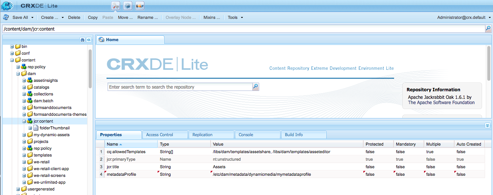

# Configuración y administración de la funcionalidad de metadatos en [!DNL Assets] {#config-metadata}

| Versión | Vínculo del artículo |
| -------- | ---------------------------- |
| AEM as a Cloud Service | [Haga clic aquí](https://experienceleague.adobe.com/docs/experience-manager-cloud-service/content/assets/manage/metadata-profiles.html?lang=en) |
| AEM 6.5 | Este artículo |

<!-- Scope of metadata articles:
* metadata.md: The scope of this article is basic metadata updates, changes, and so on, operations that end-users can do.
* metadata-concepts.md: All conceptual information. Minor instructions are OK but it is an FYI article about support and standards.
* metadata-config.md: New article. Contains all configuration and administration how-to info related to metadata of assets.
-->

[!DNL Adobe Experience Manager Assets] guarda los metadatos de cada recurso. Permite una categorización y organización más sencillas de los recursos y ayuda a las personas que buscan un recurso específico. Con la capacidad de mantener y administrar metadatos con sus recursos, puede organizar y procesar recursos automáticamente en función de sus metadatos. [!DNL Adobe Experience Manager Assets] permite que los administradores configuren y personalicen la funcionalidad de metadatos para modificar la oferta de Adobe predeterminada.

## Editar esquema de metadatos {#metadata-schema}

Para obtener más información, consulte [editar formularios de esquema de metadatos](metadata-schemas.md#edit-metadata-schema-forms).

## Registrar un área de nombres personalizada en [!DNL Experience Manager] {#registering-a-custom-namespace-within-aem}

Puede agregar sus propias áreas de nombres en [!DNL Experience Manager]. Al igual que hay áreas de nombres predefinidas como `cq`, `jcr` y `sling`, puede tener un área de nombres para los metadatos del repositorio y el procesamiento XML.

1. Acceda a la página de administración de tipo de nodo `https://[aem_server]:[port]/crx/explorer/nodetypes/index.jsp`.
1. Para obtener acceso a la página de administración del área de nombres, haga clic en **[!UICONTROL Áreas de nombres]** en la parte superior de la página.
1. Para agregar un área de nombres, haga clic en **[!UICONTROL Nuevo]** en la parte inferior de la página.
1. Especifique un espacio de nombres personalizado en la convención del espacio de nombres XML. Especifique el ID en forma de URI y un prefijo asociado para el ID. Haga clic en **[!UICONTROL Guardar]**.

## Configuración de límites para la actualización masiva de metadatos {#bulk-metadata-update-limit}

Para evitar una situación de denegación de servicio (DOS), [!DNL Enterprise Manager] limita el número de parámetros admitidos en una solicitud de Sling. Al actualizar los metadatos de muchos recursos de una sola vez, es posible que alcance el límite y los metadatos no se actualicen para más recursos. Enterprise Manager genera la siguiente advertencia en los registros:

`org.apache.sling.engine.impl.parameters.Util Too many name/value pairs, stopped processing after 10000 entries`

Para cambiar el límite, acceda a **[!UICONTROL Herramientas]** > **[!UICONTROL Operaciones]** > **[!UICONTROL Consola web]** y cambie el valor de **[!UICONTROL Parámetros máximos del POST]** en la configuración de **[!UICONTROL Apache Sling Request Parameter Handling]** OSGi.

## Perfiles de metadatos {#metadata-profiles}

Un perfil de metadatos le permite aplicar metadatos predeterminados a los recursos de una carpeta. Cree un perfil de metadatos y aplíquelo a una carpeta. Cualquier recurso que cargue posteriormente en la carpeta hereda los metadatos predeterminados configurados en el perfil de metadatos.

### Añadir un perfil de metadatos {#adding-a-metadata-profile}

1. Vaya a **[!UICONTROL Herramientas]** > **[!UICONTROL Assets]** > **[!UICONTROL Perfiles de metadatos]** y haga clic en **[!UICONTROL Crear]**.
1. Escriba un título para el perfil, por ejemplo, `Sample Metadata`, y haga clic en **[!UICONTROL Crear]**. Se muestra [!UICONTROL Editar formulario] para el perfil de metadatos.

   

1. Haga clic en un componente y configure sus propiedades en la ficha **[!UICONTROL Configuración]**. Por ejemplo, haga clic en el componente **[!UICONTROL Description]** y edite sus propiedades.

   

   Edite las siguientes propiedades para el componente **[!UICONTROL Description]**:

   * **[!UICONTROL Etiqueta de campo]**: nombre para mostrar de la propiedad de metadatos. Solo es para la referencia del usuario.

   * **[!UICONTROL Asignar a la propiedad]**: el valor de esta propiedad proporciona la ruta relativa o el nombre al nodo del recurso donde se guarda en el repositorio. El valor siempre debe comenzar con `./` porque indica que la ruta de acceso está bajo el nodo del recurso.

   

   El valor que especifique para **[!UICONTROL Asignar a la propiedad]** se almacena como propiedad en el nodo de metadatos del recurso. Por ejemplo, si especifica `./jcr:content/metadata/dc:desc` como nombre de **[!UICONTROL Asignar a la propiedad]**, [!DNL Assets] almacena el valor `dc:desc` en el nodo de metadatos del recurso. El Adobe recomienda asignar solo un campo a una propiedad determinada en el esquema de metadatos. De lo contrario, el sistema selecciona el último campo añadido asignado a la propiedad.

   * **[!UICONTROL Valor predeterminado]**: utilice esta propiedad para agregar un valor predeterminado para el componente de metadatos. Por ejemplo, si especifica &quot;Mi descripción&quot;, este valor se asigna a la propiedad `dc:desc` en el nodo de metadatos del recurso.

   

   >[!NOTE]
   >
   >Al agregar un valor predeterminado a una nueva propiedad de metadatos (que no existe en el nodo `/jcr:content/metadata`), no se muestra la propiedad y su valor en la página [!UICONTROL Propiedades] del recurso de forma predeterminada. Para ver la nueva propiedad en la página [!UICONTROL Propiedades] de los recursos, modifique el formulario de esquema correspondiente.

1. (Opcional) En la pestaña **[!UICONTROL Generar formulario]**, agregue más componentes a [!UICONTROL Editar formulario] y configure sus propiedades en la pestaña **[!UICONTROL Configuración]**. Las siguientes propiedades están disponibles en la pestaña **[!UICONTROL Generar formulario]**:

| Componente | Propiedades |
| ----------------------------- | ----------------------------------------------------------------------- |
| [!UICONTROL Encabezado de sección] | Etiqueta de campo,   descripción |
| [!UICONTROL Texto de una sola línea] | Etiqueta de campo,   Asignar a propiedad,   Valor predeterminado |
| [!UICONTROL Texto con varios valores] | Etiqueta de campo,   Asignar a propiedad,   Valor predeterminado |
| [!UICONTROL Número] | Etiqueta de campo,   Asignar a propiedad,   Valor predeterminado |
| [!UICONTROL Fecha] | Etiqueta de campo,   Asignar a propiedad,   Valor predeterminado |
| [!UICONTROL Etiquetas estándar] | Etiqueta de campo,   Asignar a propiedad,   Valor predeterminado,   Descripción |

1. Haga clic en **[!UICONTROL Listo]**. El perfil de metadatos se agrega a la lista de perfiles de la página **[!UICONTROL Perfiles de metadatos]**. 

   

### Copiar un perfil de metadatos {#copying-a-metadata-profile}

1. En la página **[!UICONTROL Perfiles de metadatos]**, seleccione un perfil de metadatos para hacer una copia del mismo.

   

1. Haga clic en **[!UICONTROL Copiar]** en la barra de herramientas.
1. En el diálogo **[!UICONTROL Copiar perfil de metadatos]**, escriba un título para la nueva copia del perfil de metadatos.
1. Haga clic en **[!UICONTROL Copiar]**. La copia del perfil de metadatos aparece en la lista de perfiles de la página **[!UICONTROL Perfiles de metadatos]**.

   

### Eliminación de un perfil de metadatos {#deleting-a-metadata-profile}

1. En la página **[!UICONTROL Perfiles de metadatos]**, seleccione un perfil para eliminar.

1. Haga clic en **[!UICONTROL Eliminar perfiles de metadatos]** en la barra de herramientas.
1. En el cuadro de diálogo, haga clic en **[!UICONTROL Eliminar]** para confirmar la operación de eliminación. El perfil de metadatos se elimina de la lista.

<!-- TBD: Revisit to find out the correct config. and update these steps. When fixed, also o
These steps have been carried forward from old AEM versions. See https://helpx.adobe.com/experience-manager/6-2/assets/using/metadata-profiles.html#ApplyingaMetadataProfiletoFolders

### Configuration to apply a metadata profile globally {#apply-a-metadata-profile-globally}

In addition to applying a profile to a folder, you can also apply one globally so that any content uploaded into [!DNL Experience Manager] assets in any folder has the selected profile applied.

You can reprocess assets in a folder that already has an existing metadata profile that you later changed. See [Reprocessing assets in a folder after you have edited its processing profile](processing-profiles.md#reprocessing-assets).

To apply a metadata profile globally, follow these steps:

* Navigate to `https://[aem_server]:[port]/mnt/overlay/dam/gui/content/assets/foldersharewizard.html/content/dam` and apply the appropriate profile and click **[!UICONTROL Save]**.

  

* In CRXDE Lite, navigate to the following node: `/content/dam/jcr:content`. Add the property `metadataProfile:/etc/dam/metadata/dynamicmedia/<name of metadata profile>` and click **[!UICONTROL Save All]**.

  
-->

## Esquema de metadatos de una carpeta {#folder-metadata-schema}

[!DNL Adobe Experience Manager Assets] le permite crear esquemas de metadatos para carpetas de recursos, que definen el diseño y los metadatos mostrados en las páginas de propiedades de la carpeta.

### Agregar un formulario de esquema de metadatos de carpeta {#add-a-folder-metadata-schema-form}

Utilice el editor de Forms del Esquema de metadatos de carpeta para crear y editar esquemas de metadatos para carpetas.

1. En la interfaz de [!DNL Experience Manager], vaya a **[!UICONTROL Herramientas]** > **[!UICONTROL Assets]** > **[!UICONTROL Esquemas de metadatos de carpeta]**.
1. En la página [!UICONTROL Forms de esquema de metadatos de carpeta], haga clic en **[!UICONTROL Crear]**.
1. Especifique un nombre para el formulario y haga clic en **[!UICONTROL Crear]**. El nuevo formulario de esquema aparece en la página [!UICONTROL Schema Forms].

### Editar formularios de esquema de metadatos de carpeta {#edit-folder-metadata-schema-forms}

Puede editar un formulario de esquema de metadatos recién agregado o existente, que incluya lo siguiente:

* Pestañas
* Elementos de formulario dentro de pestañas.

Puede asignar o configurar estos elementos de formulario a un campo dentro de un nodo de metadatos en el repositorio de CRX. Puede agregar nuevas pestañas o elementos de formulario al formulario de esquema de metadatos.

1. En la página Esquema de Forms, seleccione el formulario que creó y, a continuación, seleccione la opción **[!UICONTROL Editar]** en la barra de herramientas.
1. En la página Editor de esquemas de metadatos de carpeta, haga clic en `+` para agregar una ficha al formulario. Para cambiar el nombre de la ficha, haga clic en el nombre predeterminado y especifique el nuevo nombre en **[!UICONTROL Configuración]**.

   

   Para agregar más fichas, haga clic en `+`. Para eliminar, haga clic en `X` en una ficha.

1. En la ficha activa, agregue uno o más componentes desde la ficha **[!UICONTROL Generar formulario]**.

   

   Si crea varias pestañas, haga clic en una pestaña concreta para añadir componentes.

1. Para configurar un componente, selecciónelo y modifique sus propiedades en la ficha **[!UICONTROL Configuración]**.

   Si es necesario, elimine un componente de la ficha **[!UICONTROL Configuración]**.

   

1. Para guardar los cambios, selecciona **[!UICONTROL Guardar]** en la barra de herramientas.

#### Componentes para crear formularios {#components-to-build-forms}

La pestaña **[!UICONTROL Generar formulario]** enumera los elementos de formulario que usa en el formulario de esquema de metadatos de la carpeta. La ficha **[!UICONTROL Configuración]** muestra los atributos de cada elemento que seleccione en la ficha **[!UICONTROL Generar formulario]**. Esta es una lista de los elementos de formulario disponibles en la ficha **[!UICONTROL Generar formulario]**:

| Nombre del componente | Descripción |
|---|---|
| [!UICONTROL Encabezado de sección] | Añada un encabezado de sección para una lista de componentes comunes. |
| [!UICONTROL Texto de una sola línea] | Agregue una propiedad de texto de una sola línea. Se almacena como una cadena. |
| [!UICONTROL Texto con varios valores] | Agregue una propiedad de texto de varios valores. Se almacena como una matriz de cadenas. |
| [!UICONTROL Número] | Añada un componente de número. |
| [!UICONTROL Fecha] | Añada un componente de fecha. |
| [!UICONTROL Menú Desplegable] | Añada una lista desplegable. |
| [!UICONTROL Etiquetas estándar] | Añada una etiqueta. |
| [!UICONTROL Campo oculto] | Agregue un campo oculto. Se envía como parámetro de POST cuando se guarda el recurso. |

#### Edición de elementos de formulario {#editing-form-items}

Para editar las propiedades de los elementos del formulario, haga clic en el componente y edite todas o un subconjunto de las siguientes propiedades en la ficha **[!UICONTROL Configuración]**.

**[!UICONTROL Etiqueta de campo]**: nombre de la propiedad de metadatos que se muestra en la página de propiedades de la carpeta.

**[!UICONTROL Asignar a propiedad]**: esta propiedad especifica la ruta relativa del nodo de carpeta en el repositorio de CRX donde se guarda. Comienza con &quot;**./**&quot;, que indica que la ruta de acceso se encuentra bajo el nodo de la carpeta.

Los siguientes son los valores válidos para esta propiedad:

* `./jcr:content/metadata/dc:title`: almacena el valor en el nodo de metadatos de la carpeta como la propiedad `dc:title`.

* `./jcr:created`: muestra la propiedad JCR en el nodo de la carpeta. Si configura estas propiedades en CRXDE, Adobe recomienda marcarlas como Deshabilitar edición, ya que están protegidas. De lo contrario, se produce el error &#39; `Asset(s) failed to modify`&#39; al guardar las propiedades del recurso.

Para asegurarse de que el componente se muestra correctamente en el formulario de esquema de metadatos, no incluya un espacio en la ruta de la propiedad.

**[!UICONTROL Ruta de acceso JSON]**: utilícela para especificar la ruta de acceso del archivo JSON donde se especifican pares clave-valor para las opciones.

**[!UICONTROL Marcador de posición]**: utilice esta propiedad para especificar el texto de marcador de posición relevante con respecto a la propiedad de metadatos.

**[!UICONTROL Opciones]**: utilice esta propiedad para especificar opciones en una lista.

**[!UICONTROL Descripción]**: utilice esta propiedad para agregar una descripción breve para el componente de metadatos.

**[!UICONTROL Clase]**: clase de objeto a la que está asociada la propiedad.

### Eliminar formularios de esquema de metadatos de carpeta {#delete-folder-metadata-schema-forms}

Puede eliminar formularios de esquema de metadatos de carpeta desde la página de Forms Esquema de metadatos de carpeta. Para eliminar un formulario, selecciónelo y haga clic en la opción Eliminar de la barra de herramientas.

### Asignar un esquema de metadatos de carpeta {#assign-a-folder-metadata-schema}

Puede asignar un esquema de metadatos de carpeta a una carpeta desde la página de Forms Esquema de metadatos de carpeta o al crear una carpeta.

Si configura un esquema de metadatos para una carpeta, la ruta al formulario de esquema se almacenará en la propiedad `folderMetadataSchema` del nodo de carpeta en `./jcr:content`.

#### Asignar a un esquema desde la página Esquema de metadatos de carpeta {#assign-to-a-schema-from-the-folder-metadata-schema-page}

1. En la interfaz de [!DNL Experience Manager], vaya a **[!UICONTROL Herramientas]** > **[!UICONTROL Assets]** > **[!UICONTROL Esquemas de metadatos de carpeta]**.
1. En la página Forms del esquema de metadatos de carpeta, seleccione el formulario de esquema que desee aplicar a una carpeta.
1. En la barra de herramientas, haga clic en **[!UICONTROL Aplicar a las carpetas]**.

1. Seleccione la carpeta en la que desea aplicar el esquema y haga clic en **[!UICONTROL Aplicar]**. Si ya se ha aplicado un esquema de metadatos en la carpeta, un mensaje de advertencia le informa de que está a punto de sobrescribir el esquema de metadatos existente. Haga clic en **[!UICONTROL Sobrescribir]**.
1. Abra las propiedades de metadatos de la carpeta a la que aplicó el esquema de metadatos.

   

   Para ver los campos de metadatos de la carpeta, haga clic en la ficha **[!UICONTROL Metadatos de carpeta]**.

   

#### Asignar un esquema al crear una carpeta {#assign-a-schema-when-creating-a-folder}

Puede asignar un esquema de metadatos de carpeta al crear una carpeta. Si existe al menos un esquema de metadatos de carpeta en el sistema, se mostrará una lista adicional en el cuadro de diálogo **[!UICONTROL Crear carpeta]**. Puede seleccionar el esquema deseado. De forma predeterminada, no se selecciona ningún esquema.

1. En la interfaz de usuario [!DNL Experience Manager Assets], haga clic en **[!UICONTROL Crear]** en la barra de herramientas.
1. Especifique un título y un nombre para la carpeta.
1. En la lista Esquema de metadatos de carpeta, seleccione el esquema deseado. A continuación, haga clic en **[!UICONTROL Crear]**.

   

1. Abra las propiedades de metadatos de la carpeta a la que aplicó el esquema de metadatos.
1. Para ver los campos de metadatos de la carpeta, haga clic en la ficha **[!UICONTROL Metadatos de carpeta]**.

### Usar el esquema de metadatos de carpeta {#use-the-folder-metadata-schema}

Abra las propiedades de una carpeta configurada con un esquema de metadatos de carpeta. Se muestra la ficha **[!UICONTROL Metadatos de carpeta]** en la página de la carpeta [!UICONTROL Propiedades]. Para ver el formulario de esquema de metadatos de la carpeta, seleccione esta pestaña.

Escriba valores de metadatos en los distintos campos y haga clic en **[!UICONTROL Guardar]** para almacenar los valores. Los valores especificados se almacenan en el nodo folder del repositorio de CRX.

## Sugerencias y limitaciones {#best-practices-limitations}

* Para importar metadatos en áreas de nombres personalizadas, primero registre las áreas de nombres.
* El Selector de propiedades muestra las propiedades que se utilizan en los editores de esquemas y formularios de búsqueda. El Selector de propiedades no elige propiedades de metadatos de un recurso.
* Es posible que tenga perfiles de metadatos preexistentes desde antes de actualizar a [!DNL Experience Manager] 6.5. Después de la actualización, si aplica ese perfil en la carpeta [!UICONTROL Propiedades] de la pestaña [!UICONTROL Perfiles de metadatos], los campos del formulario de metadatos no se mostrarán. Sin embargo, si aplica un perfil de metadatos recién creado, los campos de formulario se muestran pero no están disponibles según lo esperado. No se pierde la funcionalidad, pero si desea ver los campos de formulario (no disponibles), edite y guarde los perfiles de metadatos existentes.

>[!MORELIKETHIS]
>
>* [Conceptos y comprensión de metadatos](metadata-concepts.md).
>* [Editar propiedades de metadatos de varias colecciones](manage-collections.md#editing-collection-metadata-in-bulk).
>* [Importar y exportar metadatos en Experience Manager Assets](https://experienceleague.adobe.com/docs/experience-manager-learn/assets/metadata/metadata-import-export.html).
>* [Perfiles para procesar metadatos, imágenes y vídeos](processing-profiles.md).
>* [Prácticas recomendadas para organizar los recursos digitales a fin de que utilicen perfiles de procesamiento](/help/assets/organize-assets.md).
>* XMP [reescritura de la](/help/assets/xmp-writeback.md).
