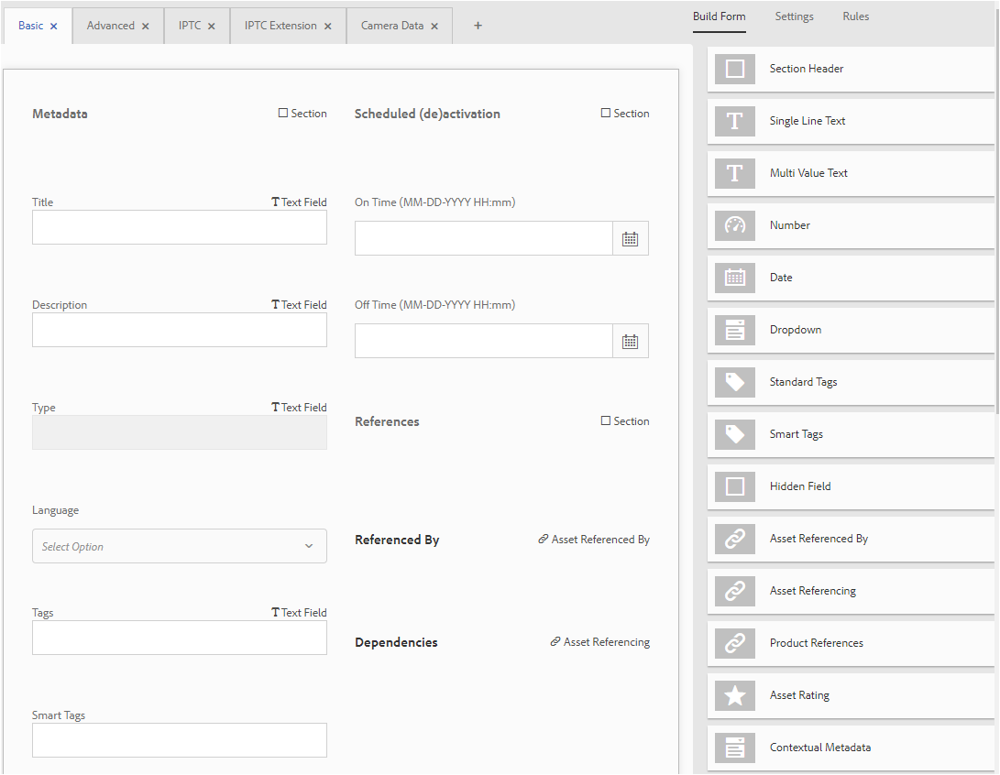

# Esquemas de metadatos {#metadata-schemas}

En Recursos Adobe Experience Manager (AEM), un esquema de metadatos define la presentación de la página de propiedades y las propiedades de metadatos que se muestran para los recursos que utilizan el esquema en cuestión. Las propiedades de metadatos incluyen título, descripción, tipos MIME, etiquetas, etc.

Puede utilizar el editor de formularios de esquemas de metadatos para modificar esquemas existentes o agregar esquemas de metadatos personalizados.

1. Para ver la página de propiedades de un recurso, toque o haga clic en el icono **[!UICONTROL Ver propiedades]** de Acciones rápidas en el mosaico del recurso en la vista de tarjeta.

   

   Como alternativa, seleccione el recurso en la interfaz de usuario y toque o haga clic en el icono **[!UICONTROL Propiedades]** de la barra de herramientas.

   

1. Edite varias propiedades de metadatos en las distintas fichas. Sin embargo, no puede modificar el tipo de recurso en la página de propiedades.

   

   Para modificar el tipo MIME de un recurso, utilice un formulario de esquema de metadatos personalizado o modifique un formulario existente. Consulte [Editar formularios](/help/assets/metadata-schemas.md#edit-metadata-schema-forms) de esquema de metadatos para obtener más información. Si modifica el esquema de metadatos de un tipo MIME determinado, se modificará el diseño de página de propiedades de los recursos con el tipo MIME actual y todos los subtipos de recursos. Por ejemplo, la modificación de un esquema jpeg en `default/image` solo modifica el diseño de metadatos (propiedades de recurso) de los recursos con tipo MIME `image/jpeg`. Sin embargo, si edita el esquema predeterminado, los cambios modifican el diseño de metadatos de todos los tipos de recursos.

1. Para ver una lista de formularios/plantillas, haga clic en el logotipo de AEM y, a continuación, vaya a **[!UICONTROL Herramientas]** > **[!UICONTROL Recursos]** > Esquemas **[!UICONTROL de metadatos]**.

   

   AEM proporciona las siguientes plantillas listas para usar:

   * **predeterminado**: Formulario de esquema de metadatos base para recursos.
   Los siguientes formularios secundarios heredan las propiedades del formulario predeterminado:
i. **imagen**: Formulario de esquema para recursos con el tipo MIME &quot;image&quot;, por ejemplo `image/jpeg`, `image/png`, etc.
El formulario &quot;imagen&quot; tiene las siguientes plantillas de formulario secundarias:a. **jpeg**: Formulario de esquema para recursos con subtipo `jpeg`.
b. **tiff**: Formulario de esquema para los recursos con subtipo `tiff`.

   ii. **aplicación**: Formulario de esquema para recursos con tipo MIME `application`, por ejemplo `application/pdf`, `application/zip`, etc.
a. **pdf**: Formulario de esquema para recursos con subtipo `pdf`.

   iii. **video**: Formulario de esquema para recursos con tipo MIME `video`, como `video/avi`, `video/mp4`, etc.

   * **colección**: Formulario de esquema para colecciones.
   * **** contentfragment: Formulario de esquema para fragmentos de contenido.
   * **formularios**: Este formulario de esquema está relacionado con los formularios [de](/help/forms/home.md)Adobe Experience Manager.

>[!NOTE]
>
>Para ver los formularios secundarios de un formulario de esquema, toque o haga clic en el nombre del formulario de esquema.

## Adición de un formulario de esquema de metadatos {#add-a-metadata-schema-form}

1. Para agregar una plantilla personalizada a la lista, haga clic en **[!UICONTROL Crear]** desde la barra de herramientas.

   >[!NOTE]
   >
   >Las plantillas sin editar tienen un icono de candado delante de ellas. Si personaliza cualquiera de las plantillas, desaparece el icono de bloqueo antes de que desaparezca la plantilla.

1. En el cuadro de diálogo, introduzca el título del formulario Esquema y, a continuación, haga clic en **[!UICONTROL Crear]** para completar el proceso de creación del formulario.

   

## Editar formularios de esquema de metadatos {#edit-metadata-schema-forms}

Puede editar un formulario de esquema de metadatos recién agregado o existente. El formulario de esquema de metadatos incluye lo siguiente:

* Pestañas
* Elementos de formulario dentro de las fichas.

Puede asignar/configurar estos elementos de formulario a un campo dentro de un nodo de metadatos en el repositorio de CRX.

Puede agregar nuevas fichas o elementos de formulario al formulario de esquema de metadatos. Las fichas y los elementos de formulario derivados del elemento principal están en estado bloqueado. No se pueden alterar a nivel secundario.

1. En la página Formularios de esquema, active la casilla de verificación situada antes de un formulario y, a continuación, haga clic en el icono Editar de la barra de herramientas.

   

1. En la página Editor **[!UICONTROL de esquemas de]** metadatos, personalice la página de propiedades del recurso arrastrando uno o varios componentes de la lista de tipos de componentes de la ficha **[!UICONTROL Generar formulario]** a la ficha **[!UICONTROL Básico]** .

   

1. Para configurar un componente, selecciónelo y modifique sus propiedades en la ficha **Configuración** .

### Componentes de la ficha Formulario de compilación {#components-within-the-build-form-tab}

La ficha **[!UICONTROL Generar formulario]** muestra los elementos de formulario que se utilizan en el formulario de esquema. La ficha **[!UICONTROL Configuración]** proporciona los atributos de cada elemento seleccionado en la ficha **[!UICONTROL Generar formulario]** . En la tabla siguiente se muestran los elementos de formulario disponibles en la ficha **[!UICONTROL Generar formulario]** :

| Nombre del componente | Descripción |
|---|---|
| [!UICONTROL Sección de encabezado] | Agregue un encabezado de sección para ver una lista de componentes comunes. |
| [!UICONTROL Texto de una sola línea] | Agregue una propiedad de texto de una sola línea. Se almacena como una cadena. |
| [!UICONTROL Texto con varios valores] | Agregue una propiedad de texto con varios valores. Se almacena como una matriz de cadenas. |
| [!UICONTROL Número] | Agregue un componente numérico. |
| [!UICONTROL Fecha] | Agregue un componente de fecha. |
| [!UICONTROL Lista desplegable] | Agregue una lista desplegable. |
| [!UICONTROL Etiquetas estándar] | Añadir una etiqueta. |
| [!UICONTROL Etiquetas inteligentes] | Agregue a las capacidades de búsqueda para aumentar las funciones agregando automáticamente etiquetas de metadatos. |
| [!UICONTROL Campo oculto] | Agregue un campo oculto. Se envía como parámetro POST cuando se guarda el recurso. |
| [!UICONTROL Recurso al que se hace referencia en] | Agregue este componente para ver la lista de recursos a los que hace referencia el recurso. |
| [!UICONTROL Referencia de recursos] | Agregar para mostrar una lista de recursos que hacen referencia al recurso. |
| [!UICONTROL Referencias de productos] | Agregar para mostrar la lista de productos vinculados con el recurso. |
| [!UICONTROL Clasificación del recurso] | Agregar para mostrar las opciones para clasificar el recurso. |
| [!UICONTROL Metadatos de contexto] | Agregar para controlar la visualización de otras fichas de metadatos en la página de propiedades de los recursos. |

#### Edición del componente de metadatos {#edit-the-metadata-component}

Para editar las propiedades de un componente de metadatos en el formulario, haga clic en el componente y edite todas o un subconjunto de las siguientes propiedades en la ficha **[!UICONTROL Configuración]** .

**Etiqueta** de campo: Nombre de la propiedad de metadatos que se muestra en la página de propiedades del recurso.

**Asignar a propiedad**: Esta propiedad especifica la ruta/nombre relativos al nodo del recurso donde se guarda en el repositorio de CRX. Comienza con `./` porque indica que la ruta está debajo del nodo del recurso.

Los siguientes son los valores válidos para esta propiedad:

Los siguientes son los valores válidos para esta propiedad:

* `./jcr:content/metadata/dc:title`:: Almacena el valor en el nodo de metadatos del recurso como propiedad `dc:title`.

* `./jcr:created`:: Muestra la propiedad JCR en el nodo del recurso. Si configura estas propiedades en propiedades de vista, le recomendamos que las marque como Deshabilitar edición, ya que están protegidas. De lo contrario, los [!UICONTROL recursos con error no pueden modificar] los resultados al guardar las propiedades del recurso.

Para asegurarse de que el componente se muestra correctamente en el formulario de esquema de metadatos, la ruta de la propiedad no debe incluir espacios.

**Marcador de posición**: Utilice esta propiedad para especificar el texto del marcador de posición correspondiente a la propiedad metadata.
**Requerido**: Utilice esta propiedad para marcar una propiedad de metadatos como obligatoria en la página de propiedades.
**Deshabilitar Editar**: Utilice esta propiedad para que una propiedad de metadatos no se pueda editar en la página de propiedades.
**Mostrar campo vacío en solo**lectura: Marque esta propiedad para mostrar una propiedad de metadatos en la página de propiedades aunque no tenga ningún valor. De forma predeterminada, cuando una propiedad de metadatos no tiene ningún valor, no se muestra en la página de propiedades.
**Mostrar lista ordenada**: Utilice esta propiedad para mostrar una lista ordenada de opciones **Opciones**: Utilice esta propiedad para especificar opciones en una lista **Descripción** : Utilice esta propiedad para agregar una breve descripción para el componente de metadatos.
**Clase**: Clase de objeto con la que está asociada la propiedad.
**Eliminar**: Haga clic en este icono para eliminar un componente del formulario de esquema.

>[!NOTE]
>
>El componente Campo oculto no incluye estos atributos. En su lugar, incluye propiedades, como los atributos Nombre, Valor, Etiqueta de campo y Descripción. Los valores del componente Campo oculto se envían como parámetro POST cada vez que se guarda el recurso. No se guarda como metadatos para el recurso.

Si selecciona la opción **[!UICONTROL Obligatorio]** , puede buscar recursos que no tengan metadatos obligatorios. En el panel **[!UICONTROL Filtros]** , expanda el predicado Validación **[!UICONTROL de]** metadatos y seleccione la opción **[!UICONTROL No válido]** . Los resultados de la búsqueda muestran los recursos que carecen de metadatos obligatorios configurados a través del formulario de esquema.

Si agrega el componente Metadatos contextuales a cualquier ficha de cualquier formulario de esquema, el componente aparece como una lista en la página de propiedades de los recursos a los que se aplica el esquema concreto. La lista incluye todas las demás fichas excepto la ficha a la que se ha aplicado el componente Metadatos contextuales. Actualmente, esta función proporciona una funcionalidad básica para controlar la visualización de metadatos en función del contexto.

Para incluir cualquier ficha en la página de propiedades, además de la ficha donde se aplica el componente Metadatos contextuales, seleccione la ficha en la lista. La ficha se agrega a la página de propiedades.

### Especificar propiedades en el archivo JSON {#specify-properties-in-json-file}

En lugar de especificar propiedades para las opciones de la ficha **[!UICONTROL Configuración]** , puede definir las opciones de un archivo JSON especificando los pares de clave-valor correspondientes. Especifique la ruta del archivo JSON en el campo Ruta **[!UICONTROL de]** JSON.

#### Agregar o eliminar una ficha del formulario de esquema {#adding-deleting-a-tab-in-the-schema-form}

El editor de esquemas permite agregar o eliminar una ficha. El formulario de esquema predeterminado incluye las fichas **[!UICONTROL Básico]**, **[!UICONTROL Avanzado]** , **[!UICONTROL IPTC]** y Extensión **[!UICONTROL IPTC]** de forma predeterminada.

Haga clic en `+` para agregar una nueva ficha a un formulario de esquema. De forma predeterminada, la nueva ficha tiene el nombre `Unnamed-1`. Puede modificar el nombre desde la ficha **[!UICONTROL Configuración]** .

Haga clic en `X` para eliminar una ficha.

## Eliminar formularios de esquema de metadatos {#delete-metadata-schema-forms}

AEM solo permite eliminar formularios de esquema personalizados. No permite eliminar los formularios o plantillas de esquema predeterminados. Sin embargo, puede eliminar cualquier cambio personalizado en estos formularios.

Para eliminar un formulario, selecciónelo y haga clic en el icono Eliminar.

<!-- -->
>[!NOTE]
>
>Después de eliminar los cambios personalizados a un formulario predeterminado, el icono de bloqueo vuelve a aparecer antes en la interfaz del esquema de metadatos para indicar que el formulario ha vuelto a su estado predeterminado.

>[!NOTE]
>
>No puede eliminar los formularios de esquema de metadatos predeterminados en Recursos AEM.

## Formularios de esquema para tipos MIME {#schema-forms-for-mime-types}

Recursos AEM proporciona formularios predeterminados para varios tipos MIME de forma predeterminada. Sin embargo, puede agregar formularios personalizados para recursos de varios tipos MIME.

### Agregar nuevos formularios para tipos MIME {#add-new-forms-for-mime-types}

Cree un nuevo formulario bajo el tipo de formulario correspondiente. Por ejemplo, para agregar una nueva plantilla para el subtipo **imagen/png** , cree el formulario en los formularios de &quot;imagen&quot;. El título del formulario de esquema es el nombre del subtipo. En este caso, el título es &quot;png.**&quot;**

#### Usar una plantilla de esquema existente para varios tipos MIME {#use-an-existing-schema-template-for-various-mime-types}

Puede utilizar una plantilla existente para otro tipo MIME. Por ejemplo, utilice el `image/jpeg` formulario para recursos de tipo MIME `image/png`.

En este caso, cree un nuevo nodo en `/etc/dam/metadataeditor/mimetypemappings` el repositorio de CRX. Especifique un nombre para el nodo y defina las siguientes propiedades:

| Nombre | Descripción | Tipo | Value |
|---|---|---|---|
| `exposedmimetype` |  Nombre del formulario existente que se va a asignar | `String` | `image/jpeg` |
| `mimetypes` | Lista de tipos MIME que utilizan el formulario definido en el `exposedmimetype` atributo | `String` | `image/png` |

AEM Assets asigna los siguientes tipos MIME y formularios de esquema:

| Formulario de esquema | Tipos MIME |
|---|---|
| image/jpeg | image/pjpeg |
| image/tiff | image/x-tiff |
| application/pdf | application/postscript |
| application/x-ImageSet | Multipart/Related; type=application/x-ImageSet |
| application/x-SpinSet | Multipart/Related; type=application/x-SpinSet |
| application/x-MixedMediaSet | Multipart/Related; type=application/x-MixedMediaSet |
| video/quicktime | video/x-quicktime |
| video/mpeg4 | video/mp4 |
| video/avi | video/avi, video/msvideo, video/x-msvideo |
| video/wmv | video/x-ms-wmv |
| video/flv | video/x-flv |

## Conceder acceso a esquemas de metadatos {#grant-access-to-metadata-schemas}

La función Esquema de metadatos solo está disponible para administradores. Sin embargo, los administradores pueden proporcionar acceso a los no administradores modificando algunos permisos. Los usuarios que no sean administradores deben tener permisos de creación, modificación y eliminación en la `/conf` carpeta.

## Aplicación de metadatos específicos de carpetas {#apply-folder-specific-metadata}

Recursos AEM permite definir una variante de un esquema de metadatos y aplicarla a una carpeta específica.

Por ejemplo, puede definir una variante del esquema de metadatos predeterminado y aplicarla a una carpeta. Al aplicar el esquema modificado, se anula el esquema de metadatos predeterminado original que se aplica a los recursos de la carpeta.

Solo los recursos cargados en la carpeta a la que se aplica este esquema se ajustarán a los metadatos modificados definidos en el esquema de metadatos de la variante.

Los recursos de otras carpetas en las que se aplica el esquema original siguen ajustándose a los metadatos definidos en el esquema original.

La herencia de metadatos por recursos se basa en el esquema aplicado a la carpeta de primer nivel de la jerarquía. En otras palabras, si una carpeta no contiene subcarpetas, los recursos de la carpeta heredarán los metadatos del esquema aplicado a la carpeta.

Si la carpeta tiene una subcarpeta, los recursos de la subcarpeta heredarán los metadatos del esquema aplicado en el nivel de subcarpeta si se aplica un esquema diferente en el nivel de subcarpeta. Sin embargo, si no se aplica ningún esquema o el mismo esquema en el nivel de subcarpeta, los recursos de subcarpeta heredarán los metadatos del esquema aplicado en el nivel de carpeta principal.

1. Haga clic en el logotipo de AEM y, a continuación, vaya a **[!UICONTROL Herramientas]** > **[!UICONTROL Recursos]** > Esquemas **[!UICONTROL de metadatos]**. Se muestra la página Formularios **[!UICONTROL de esquema de]** metadatos.
1. Seleccione la casilla de verificación situada antes de un formulario, por ejemplo el formulario de metadatos predeterminado, y toque o haga clic en el icono de copia y guárdelo como un formulario personalizado. Especifique un nombre personalizado para el formulario, por ejemplo `my_default`. También puede crear un formulario personalizado.
   

1. En la página Formularios **[!UICONTROL de esquema de]** metadatos, seleccione el `my_default` formulario y, a continuación, haga clic en el icono **[!UICONTROL Editar]** .

   

1. En la página Editor **[!UICONTROL de esquemas de]** metadatos, agregue un campo de texto al formulario de esquema. Por ejemplo, agregue un campo con la etiqueta **[!UICONTROL Categoría]**.

   

1. Haga clic en **[!UICONTROL Guardar.]** El formulario modificado aparece en la página Formularios **[!UICONTROL de esquema de]** metadatos.
1. Toque o haga clic en **[!UICONTROL Aplicar a carpetas]** en la barra de herramientas para aplicar los metadatos personalizados a una carpeta.

   

1. Seleccione la carpeta en la que desea aplicar el esquema modificado y toque o haga clic en **[!UICONTROL Aplicar]**.

   

1. Si la carpeta tiene el otro esquema de metadatos aplicado, aparece un mensaje en el que se advierte que está a punto de sobrescribir el esquema de metadatos existente. Haga clic en **Sobrescribir**.
1. Haga clic en **Aceptar** para cerrar el mensaje de éxito.
1. Vaya a la carpeta en la que ha aplicado el esquema de metadatos modificado.

## Definir metadatos obligatorios {#define-mandatory-metadata}

Puede definir campos obligatorios en un nivel de carpeta, que se aplican a los recursos que se cargan en la carpeta. Si carga recursos con metadatos que faltan para los campos obligatorios definidos anteriormente, aparecerá una indicación visual de los metadatos que faltan en los recursos de la vista de tarjeta.

>[!NOTE]
>
>Un campo de metadatos puede definirse como obligatorio en función del valor de otro campo. En la vista Tarjetas, AEM no muestra el mensaje de advertencia sobre los metadatos que faltan en estos campos obligatorios de metadatos.

1. Haga clic en el logotipo de AEM y, a continuación, vaya a **[!UICONTROL Herramientas]** > **[!UICONTROL Recursos]** > Esquemas **[!UICONTROL de metadatos]**. Se muestra la página Formularios **[!UICONTROL de esquema de]** metadatos.
1. Guarde el formulario de metadatos predeterminado como un formulario personalizado. Por ejemplo, guárdelo como `my_default`.

   

1. Edite el formulario personalizado. Agregue un campo obligatorio. Por ejemplo, agregue un campo **[!UICONTROL Categoría]** y convierta el campo en obligatorio.

   

1. Haga clic en **[!UICONTROL Guardar.]** El formulario modificado aparece en la página Formularios **[!UICONTROL de esquema de]** metadatos. Seleccione el formulario y, a continuación, toque o haga clic en **[!UICONTROL Aplicar a carpetas]** en la barra de herramientas para aplicar los metadatos personalizados a una carpeta.

   

1. Vaya a la carpeta y cargue algunos recursos con metadatos que faltan en el campo obligatorio que ha agregado al formulario personalizado. En la vista de tarjeta del recurso se muestra un mensaje para los metadatos que faltan para el campo obligatorio.

   

1. (Opcional) Acceso `https://[server]:[port]/system/console/components/`. Configure y active `com.day.cq.dam.core.impl.MissingMetadataNotificationJob` el componente que está deshabilitado de forma predeterminada. Defina una frecuencia con la que AEM compruebe la validez de los metadatos en los recursos.

   Esta configuración agrega una propiedad `hasValidMetadata` a `jcr:content` los recursos. Con esta propiedad, AEM puede filtrar los resultados en una búsqueda.

   >[!NOTE]
   >
   >Si se agrega un recurso después de la comprobación programada, el recurso no se marca con `hasValidMetadata` hasta la siguiente comprobación programada. Los recursos no aparecen en los resultados de búsqueda intermedios.

   >[!CAUTION]
   >
   >Las comprobaciones de validación de metadatos requieren muchos recursos y pueden afectar al rendimiento del sistema. Programe las comprobaciones en consecuencia. Si el servidor no puede hacer frente a la carga, intente deshabilitar este trabajo.
