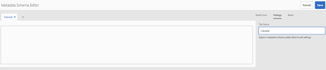

# Esquemas de metadatos {#metadata-schemas}

Las organizaciones cuentan con un modelo de metadatos que mejora la detección, el uso, la interoperabilidad de los recursos, etc. La aplicación correcta de metadatos es sacrosanta para mantener los procesos y flujos de trabajo basados en metadatos. Para cumplir con los estándares y estrategias de metadatos de toda la organización, puede utilizar esquemas de metadatos que ayudan a los usuarios de DAM a alinearse. [!DNL Adobe Experience Manager] permite crear, mantener y aplicar esquemas de metadatos con métodos sencillos y flexibles.

En [!DNL Adobe Experience Manager Assets], los esquemas contienen campos específicos para la información específica que se debe rellenar. También contiene información de diseño para mostrar los campos de metadatos de forma sencilla. Las propiedades de metadatos incluyen título, descripción, tipos MIME, etiquetas y mucho más. Puede utilizar el editor [!UICONTROL Esquema de metadatos Forms] para modificar los esquemas existentes o agregar esquemas de metadatos personalizados.

Para vista y edición de la página de propiedades de un recurso, siga estos pasos:

1. Haga clic en la opción **[!UICONTROL Propiedades de la Vista]** desde las acciones rápidas en el mosaico del recurso en la vista de la tarjeta. Como alternativa, seleccione un recurso y haga clic en **[!UICONTROL Propiedades]**  en la barra de herramientas.

1. Puede editar las distintas propiedades de metadatos editables en las fichas disponibles. Sin embargo, no puede modificar el recurso [!UICONTROL Tipo] en la ficha [!UICONTROL Básico] de la página de propiedades.

   

*Figura: Ficha Básico de  [!UICONTROL Propiedades] de recurso.*

Para modificar el tipo MIME de un recurso, utilice un formulario de esquema de metadatos personalizado o modifique un formulario existente. Consulte [Editar Esquema de metadatos Forms](/help/assets/metadata-schemas.md#edit-metadata-schema-forms) para obtener más información. Si modifica el esquema de metadatos de un tipo MIME, se modifica la presentación de las propiedades de la página de los recursos y todos los subtipos. Por ejemplo, la modificación de un esquema jpeg en `default/image` sólo modifica el diseño de metadatos (propiedades del recurso) de los recursos con tipo MIME `image/jpeg`. Sin embargo, si edita el esquema predeterminado, los cambios modifican la presentación de los metadatos de todos los tipos de recursos.

## Formularios de Esquema de metadatos {#default-metadata-schema-forms}

Para realizar la vista de una lista de formularios o plantillas, en la interfaz [!DNL Experience Manager] vaya a **[!UICONTROL Herramientas]** > **[!UICONTROL Recursos]** > **[!UICONTROL Esquemas de metadatos]**.

[!DNL Experience Manager] proporciona las siguientes plantillas de formulario de Esquema de metadatos.

| Plantillas |  | Descripción |
|---|---|---|
| [!UICONTROL predeterminada] |  | Formulario de esquema de metadatos base para los recursos. |
|  | Los siguientes formularios secundarios heredan las propiedades del formulario [!UICONTROL predeterminado]: |  |
|  | <ul><li>[!UICONTROL dm_video]</li></ul> | Formulario de esquema para vídeos de Dynamic Media. |
|  | <ul><li>[!UICONTROL image]</li></ul> | Formulario de esquema para imágenes con el tipo MIME como `image/jpeg` y `image/png`.   La   forma de imagen tiene las siguientes plantillas de formulario secundarias: <ul><li> [!UICONTROL jpeg]: Formulario de esquema para recursos con subtipo  [!UICONTROL jpeg].</li> <li>[!UICONTROL tiff]: Formulario de esquema para los recursos con subtipo TIFF.</li></ul> |
|  | <ul><li>[!UICONTROL aplicación]</li></ul> | Formulario de esquema para recursos con tipo MIME como `application/pdf` y `application/zip`.  [!UICONTROL pdf]: Formulario de esquema para recursos con subtipo PDF. |
|  | <ul><li>[!UICONTROL vídeo]</li></ul> | Formulario de esquema para recursos de vídeo con tipo MIME como `video/avi` y `video/mp4`. |
| [!UICONTROL colección] |  | Formulario de esquema para colecciones. |
| [!UICONTROL contentfragment] |  | [Formulario de esquema para fragmentos](/help/sites-developing/customizing-content-fragments.md) de contenido. |
| [!UICONTROL formularios] |  | Este formulario de esquema está relacionado con [Adobe Experience Manager Forms](/help/forms/home.md). |
| [!UICONTROL ugc_contentfragment] |  | Formulario de esquema para elementos de contenido generados por el usuario y recursos integrados en el Experience Manager desde los medios sociales. |

>[!NOTE]
>
>Para vista de los formularios secundarios de un formulario de esquema, haga clic en el nombre del formulario de esquema.

## Añadir un formulario de esquema de metadatos {#add-a-metadata-schema-form}

Para agregar un formulario de esquema de metadatos, siga estos pasos:

1. Para agregar una plantilla personalizada a la lista, haga clic en **[!UICONTROL Crear]** desde la barra de herramientas.

   >[!NOTE]
   >
   >Se muestra un símbolo de bloqueo con las plantillas sin editar. Si personaliza una plantilla, no está bloqueada .

1. En el cuadro de diálogo, proporcione el título del formulario de esquema y haga clic en **[!UICONTROL Crear]** para completar el proceso de creación del formulario.

## Editar formularios de esquema de metadatos {#edit-metadata-schema-forms}

Puede editar un formulario de esquema de metadatos recién agregado o existente. El formulario de esquema de metadatos incluye fichas y elementos de formulario en fichas. Puede asignar/configurar estos elementos de formulario a un campo dentro de un nodo de metadatos en el repositorio de CRX. Puede agregar fichas o elementos de formulario al formulario de esquema de metadatos. Las fichas y los elementos de formulario derivados del elemento principal están en estado bloqueado. No se pueden alterar a nivel secundario.

1. En la página [!UICONTROL Forms] Esquema de metadatos, seleccione un formulario y haga clic en **[!UICONTROL Editar]** en la barra de herramientas.

1. En la página **[!UICONTROL Editor de formularios de Esquema de metadatos]**, personalice el formulario de metadatos. Arrastre los componentes necesarios desde la ficha **[!UICONTROL Generar formulario]** a una de las fichas.

   

   *Figura: Una página  [!UICONTROL del editor de formularios de Esquema de metadatos con ] fichas disponibles.*

1. Para configurar un componente, selecciónelo y modifique sus propiedades en la ficha **[!UICONTROL Configuración]**.

### Componentes dentro de la ficha [!UICONTROL Formulario de compilación] {#components-within-the-build-form-tab}

La ficha **[!UICONTROL Generar formulario]** lista elementos de formulario que se utilizan en el formulario de esquema. La ficha **[!UICONTROL Configuración]** proporciona los atributos de cada elemento seleccionado en la ficha **[!UICONTROL Generar formulario]**. La siguiente tabla lista los elementos de formulario disponibles en la ficha **[!UICONTROL Formulario de compilación]**:

| Nombre del componente | Descripción |
| -------------------------------- | ----------------------------------------------------------------------------------- |
| [!UICONTROL Sección de encabezado] | Añada un encabezado de sección para una lista de componentes comunes. |
| [!UICONTROL Texto de una sola línea] | Añada una propiedad de texto de una sola línea. Se almacena como una cadena. |
| [!UICONTROL Texto con varios valores] | Añada una propiedad de texto con varios valores. Se almacena como una matriz de cadenas. |
| [!UICONTROL Número] | Añada un componente numérico. |
| [!UICONTROL Fecha] | Añada un componente de fecha. |
| [!UICONTROL Lista desplegable] | Añada una lista desplegable. |
| [!UICONTROL Etiquetas estándar] | Añadir una etiqueta. |
| [!UICONTROL Etiquetas inteligentes] | Añada para aumentar las capacidades de búsqueda agregando automáticamente etiquetas de metadatos. |
| [!UICONTROL Campo oculto] | Añada un campo oculto. Se envía como parámetro de POST cuando se guarda el recurso. |
| [!UICONTROL Recurso al que se hace referencia en] | Añada este componente a la lista de vista de los recursos a los que hace referencia el recurso. |
| [!UICONTROL Referencia de recursos] | Añada para mostrar una lista de recursos que hagan referencia al recurso. |
| [!UICONTROL Referencias de productos] | Añada para mostrar la lista de los productos vinculados con el recurso. |
| [!UICONTROL Clasificación del recurso] | Añada a las opciones de visualización para clasificar el recurso. |
| [!UICONTROL Metadatos de contexto] | Añada para controlar la visualización de otras fichas de metadatos en la página de propiedades de los recursos. |

#### Editar el componente de metadatos {#edit-the-metadata-component}

Para editar las propiedades de un componente de metadatos en el formulario, haga clic en el componente para editar todas o un subconjunto de las siguientes propiedades en la ficha **[!UICONTROL Configuración]**.

**Etiqueta** de campo: Nombre de la propiedad de metadatos que se muestra en la página de propiedades del recurso.

**Asignar a propiedad**: Esta propiedad especifica la ruta relativa o el nombre del nodo de recurso donde se guarda en el repositorio de CRX. Inicio con `./` para indicar que la ruta está bajo el nodo del recurso.

Los siguientes son los valores válidos para esta propiedad:

* `./jcr:content/metadata/dc:title`: Almacena el valor en el nodo de metadatos del recurso como propiedad `dc:title`.

* `./jcr:created`:: Almacena la fecha y hora de creación de un recurso. Es una propiedad protegida. Si configura estas propiedades, Adobe recomienda marcarlas como Deshabilitar edición.

Para asegurarse de que el componente se muestra correctamente en el formulario de esquema de metadatos, la ruta de la propiedad no debe incluir espacios.

* **Marcador de posición**: Utilice esta propiedad para especificar el texto del marcador de posición correspondiente a la propiedad metadata.
* **Requerido**: Utilice esta propiedad para marcar una propiedad de metadatos como obligatoria en la página de propiedades.
* **Deshabilitar Editar**: Utilice esta propiedad para no permitir modificaciones en una propiedad de la página de propiedades.
* **Mostrar campo vacío en solo** lectura: Marque esta propiedad para mostrar una propiedad de metadatos en la página de propiedades aunque no tenga ningún valor. De forma predeterminada, cuando una propiedad de metadatos no tiene ningún valor, no se muestra en la página de propiedades.
* **Mostrar lista ordenada**: Utilice esta propiedad para mostrar una lista ordenada de opciones.
* **Opciones**: Utilice esta propiedad para especificar opciones en una lista.
* **Descripción** : Utilice esta propiedad para agregar una breve descripción para el componente de metadatos.
* **Clase**: Clase de objeto con la que está asociada la propiedad.
* **Eliminar**: Haga clic en   Eliminar para eliminar un componente del formulario de esquema.

>[!NOTE]
>
>El componente [!UICONTROL Campo oculto] no incluye estos atributos. En su lugar, incluye propiedades, como los atributos Nombre, Valor, Etiqueta de campo y Descripción. Los valores del componente Campo oculto se envían como parámetro de POST cada vez que se guarda el recurso. No se guarda como metadatos para el recurso.

Si selecciona la opción **[!UICONTROL Obligatorio]**, puede buscar recursos que no tengan metadatos obligatorios. En el panel **[!UICONTROL Filtros]**, expanda el predicado **[!UICONTROL Validación de metadatos]** y seleccione la opción **[!UICONTROL No válido]**. Los resultados de la búsqueda muestran los recursos que carecen de metadatos obligatorios configurados a través del formulario de esquema.

Si agrega el componente Metadatos contextuales a cualquier ficha de cualquier formulario de esquema, el componente aparece como una lista en la página de propiedades de los recursos a los que se aplica el esquema concreto. La lista incluye todas las demás fichas excepto la ficha a la que se ha aplicado el componente Metadatos contextuales. Actualmente, esta función proporciona una funcionalidad básica para controlar la visualización de metadatos en función del contexto.

Para mostrar cualquier ficha de la página de propiedades además de la ficha donde se aplica el componente Metadatos contextuales, seleccione la ficha en la lista. La ficha se agrega a la página de propiedades.

*Figura: Metadatos contextuales de la página de propiedades de recursos.*

### Especificar propiedades en el archivo JSON {#specify-properties-in-json-file}

En lugar de especificar propiedades para las opciones de la pestaña **[!UICONTROL Configuración]**, puede definir las opciones de un archivo JSON especificando los pares de clave-valor correspondientes. Especifique la ruta del archivo JSON en el campo **[!UICONTROL Ruta de JSON]**.

#### Añadir o eliminar una ficha del formulario de esquema {#adding-deleting-a-tab-in-the-schema-form}

El editor de esquemas permite agregar o eliminar una pestaña. El formulario de esquema predeterminado incluye las fichas **[!UICONTROL Basic]**, **[!UICONTROL Advanced]**, **[!UICONTROL IPTC]** y **[!UICONTROL IPTC Extension]**.

Haga clic en `+` para agregar una ficha a un formulario de esquema. De forma predeterminada, la nueva ficha tiene el nombre `Unnamed-1`. Puede modificar el nombre desde la ficha **[!UICONTROL Configuración]**. Haga clic en `X` para eliminar una ficha.

## Metadatos en cascada {#cascading-metadata}

Al capturar la información de metadatos de un recurso, los usuarios proporcionan información en los distintos campos disponibles. Puede mostrar campos de metadatos específicos o valores de campo que dependen de las opciones seleccionadas en los demás campos. Esta visualización condicional de metadatos se denomina metadatos en cascada. En otras palabras, puede crear una dependencia entre un valor o campo de metadatos concreto y uno o más campos y/o sus valores.

Utilice esquemas de metadatos para definir reglas para mostrar metadatos en cascada. Por ejemplo, si el esquema de metadatos incluye un campo de tipo de recurso, puede definir un conjunto pertinente de campos para mostrar en función del tipo de recurso seleccionado por el usuario.

>[!CAUTION]
>
>Los metadatos en cascada no son compatibles con los fragmentos de contenido.

A continuación se indican algunos casos de uso para los que puede definir metadatos en cascada:

* Cuando se requiera la ubicación del usuario, se mostrarán los nombres de ciudades relevantes en función de la elección de país y estado del usuario.
* Cargue nombres de marcas pertinentes en una lista en función de la elección de categoría del producto por parte del usuario.
* Alternar la visibilidad de un campo concreto en función del valor especificado en otro campo. Por ejemplo, muestre campos de dirección de envío separados si el usuario desea que el envío se envíe en una dirección diferente.
* Designar un campo como obligatorio según el valor especificado en otro campo.
* Cambiar las opciones mostradas para un campo concreto en función del valor especificado en otro campo.
* Establezca el valor de metadatos predeterminado en un campo concreto en función del valor especificado en otro campo.

### Configurar metadatos en cascada en [!DNL Experience Manager] {#configure-cascading-metadata-in-aem}

Imagine un escenario en el que desee mostrar metadatos en cascada en función del tipo de recurso seleccionado. Algunos ejemplos

* Para un vídeo, muestre los campos aplicables como formato, códec, duración, etc.
* Para un documento de Word o PDF, muestre campos como, por ejemplo, recuento de páginas, autor, etc.

Independientemente del tipo de recurso elegido, muestre la información de copyright como campo requerido.

1. En la interfaz [!DNL Experience Manager], vaya a **[!UICONTROL Herramientas]** > **[!UICONTROL Recursos]** > **[!UICONTROL Esquemas de metadatos]**.
1. En la página **[!UICONTROL Esquema Forms]**, seleccione un formulario de esquema y haga clic en **[!UICONTROL Editar]** en la barra de herramientas para editar el esquema.

   

1. (Opcional) En el editor de esquemas de metadatos, cree un nuevo campo para condicionalizar. Especifique un nombre y una ruta de propiedad en la ficha **[!UICONTROL Configuración]**.

   Para crear una nueva ficha, haga clic en `+` para agregar una ficha y, a continuación, agregue un campo de metadatos.

   

1. Añada un campo desplegable para el tipo de recurso. Especifique un nombre y una ruta de propiedad en la ficha **[!UICONTROL Configuración]**. Añada una descripción opcional.

   

1. Los pares de clave-valor son las opciones proporcionadas a un usuario del formulario. Puede proporcionar los pares clave-valor manualmente o desde un archivo JSON.

   * Para especificar los valores manualmente, seleccione **[!UICONTROL Añadir manualmente]** y haga clic en **[!UICONTROL Añadir opción]** y especifique el texto y el valor de la opción. Por ejemplo, especifique los tipos de recursos de vídeo, PDF, Word e imagen.

   * Para recuperar los valores de un archivo JSON de forma dinámica, seleccione **[!UICONTROL Añadir mediante ruta JSON]** y proporcione la ruta del archivo JSON. [!DNL Experience Manager] Obtiene los pares clave-valor en tiempo real cuando se presenta el formulario al usuario.

   Ambas opciones son mutuamente excluyentes. No puede importar las opciones de un archivo JSON y editarlas manualmente.

   

   >[!NOTE]
   >
   >Al agregar un archivo JSON, los pares clave-valor no se muestran en el editor de esquema de metadatos, sino que están disponibles en el formulario publicado.

   >[!NOTE]
   >
   >Al agregar opciones, si hace clic en el campo Desplegable, la interfaz se distorsiona y la opción de eliminación de las opciones deja de funcionar. No haga clic en el menú desplegable hasta que guarde los cambios. Si tiene este problema, guarde el esquema y ábralo de nuevo para continuar con la edición.

1. (Opcional) Añada los demás campos obligatorios. Por ejemplo, formato, códec y duración para el vídeo de tipo de recurso.

   Del mismo modo, agregue campos dependientes para otros tipos de recursos. Por ejemplo, agregue campos de recuento de páginas y autor para recursos de documento, como archivos PDF y Word.

   

1. Para crear una dependencia entre el campo de tipo de recurso y otros campos, elija el campo dependiente y abra la ficha **[!UICONTROL Reglas]**.

   

1. En **[!UICONTROL Requisito]**, elija la opción **[!UICONTROL Requerido, según la nueva regla]**.
1. Haga clic en **[!UICONTROL Añadir regla]** y elija el campo **[!UICONTROL Tipo de recurso]** para crear una dependencia. También elija el valor del campo en el que desea crear la dependencia. En este caso, seleccione **[!UICONTROL Vídeo]**. Haga clic en **[!UICONTROL Listo]** para guardar los cambios.

   

   >[!NOTE]
   >
   >La lista desplegable con valores predefinidos manualmente se puede utilizar con las reglas. Los menús desplegables con una ruta JSON configurada no se pueden utilizar con reglas que utilicen valores predefinidos para aplicar condiciones. Si los valores se cargan desde JSON en tiempo de ejecución, no es posible aplicar una regla predefinida.

1. En **[!UICONTROL Visibilidad]**, seleccione la opción **[!UICONTROL Visible, según la nueva regla]**.

1. Haga clic en **[!UICONTROL Añadir regla]** y elija el campo **[!UICONTROL Tipo de recurso]** para crear una dependencia. También elija el valor del campo en el que desea crear la dependencia. En este caso, seleccione **[!UICONTROL Vídeo]**. Haga clic en **[!UICONTROL Listo]** para guardar los cambios.

   

   >[!NOTE]
   >
   >Al hacer clic en un espacio en blanco (o en cualquier lugar que no sea el valor) se restablecen los valores. Si sucede, vuelva a seleccionar los valores.

   >[!NOTE]
   >
   >Puede aplicar condiciones de **[!UICONTROL requisito]** y **[!UICONTROL visibilidad]** independientes entre sí.

1. Del mismo modo, cree una dependencia entre el valor Vídeo en el campo Tipo de recurso y otros campos, como Códec y Duración.
1. Repita los pasos para crear dependencia entre los recursos de documento (PDF y Word) en el campo [!UICONTROL Tipo de recurso] y campos como [!UICONTROL Recuento de páginas] y [!UICONTROL Autor].
1. Haga clic en **[!UICONTROL Guardar.]** Aplique el esquema de metadatos a una carpeta.

1. Vaya a la carpeta a la que ha aplicado el Esquema Metadatos y abra la página de propiedades de un recurso. Según lo que elija en el campo Tipo de recurso, se muestran los campos de metadatos correspondientes en cascada.

   

   *Figura: Metadatos en cascada para un vídeo.*

   

   *Figura: Metadatos en cascada para un documento.*

## Eliminar formularios de esquema de metadatos {#delete-metadata-schema-forms}

[!DNL Experience Manager] permite eliminar únicamente formularios esquema personalizados. No permite eliminar los formularios o las plantillas de esquema predeterminados. Sin embargo, puede eliminar cualquier cambio personalizado en estos formularios.

Para eliminar un formulario, selecciónelo y haga clic en Eliminar.

>[!NOTE]
>
>* Después de eliminar los cambios personalizados en un formulario predeterminado, el bloqueo  vuelve a aparecer antes del formulario. Indica que el formulario se vuelve a su estado predeterminado.
>* No se pueden eliminar los formularios de esquema de metadatos predeterminados en [!DNL Assets].

## Formularios de esquema para tipos MIME {#schema-forms-for-mime-types}

[!DNL Experience Manager] proporciona formularios predeterminados para varios tipos MIME de forma predeterminada. Sin embargo, puede agregar formularios personalizados para recursos de varios tipos MIME.

### Añadir nuevos formularios para tipos MIME {#add-new-forms-for-mime-types}

Cree un formulario bajo el tipo de formulario correspondiente. Por ejemplo, para agregar una plantilla para el subtipo `image/png`, cree el formulario en los formularios de &quot;imagen&quot;. El título del formulario de esquema es el nombre del subtipo. En este caso, el título es `png`.

#### Usar una plantilla de esquema existente para varios tipos MIME {#use-an-existing-schema-template-for-various-mime-types}

Puede utilizar una plantilla existente para otro tipo MIME. Por ejemplo, utilice el formulario `image/jpeg` para los recursos de tipo MIME `image/png`.

En este caso, cree un nodo en `/etc/dam/metadataeditor/mimetypemappings` en el repositorio de CRX. Especifique un nombre para el nodo y defina las siguientes propiedades:

| Nombre | Descripción | Tipo | Value |
|------|-------------|------|-------|
| `exposedmimetype` | Nombre del formulario existente que se va a asignar | `String` | `image/jpeg` |
| `mimetypes` | Lista de tipos MIME que utilizan el formulario definido en el atributo `exposedmimetype` | `String` | `image/png` |

[!DNL Assets] asigna los siguientes tipos MIME y formularios de esquema:

| Formulario de esquema | Tipos MIME |
| --------------------------- | --------------------------------------------------- |
| image/jpeg | image/pjpeg |
| image/tiff | image/x-tiff |
| application/pdf | application/postscript |
| application/x-ImageSet | Multipart/Related; type=application/x-ImageSet |
| application/x-SpinSet | Multipart/Related; type=application/x-SpinSet |
| application/x-MixedMediaSet | Multipart/Related; type=application/x-MixedMediaSet |
| video/quicktime | video/x-quicktime |
| video/mpeg4 | video/mp4 |
| video/avi | video/avi, video/msvideo, video/x-msvideo |
| video/wmv | video/x-ms-wmv |
| video/flv | video/x-flv |

## Conceder acceso a esquemas de metadatos {#grant-access-to-metadata-schemas}

La función Esquema de metadatos solo está disponible para los administradores. Sin embargo, los administradores pueden proporcionar acceso a los no administradores modificando algunos permisos. Proporcione a los usuarios que no sean administradores permisos para crear, modificar y eliminar en la carpeta `/conf`.

## Aplicar metadatos específicos de carpetas {#apply-folder-specific-metadata}

[!DNL Assets] permite definir una variante de un esquema de metadatos y aplicarla a una carpeta específica.

Por ejemplo, puede definir una variante del esquema de metadatos predeterminado y aplicarla a una carpeta. Al aplicar el esquema modificado, se anula el esquema de metadatos predeterminado original que se aplica a los recursos de la carpeta.

Solo los recursos cargados en la carpeta a la que se aplica este esquema se ajustan a los metadatos modificados definidos en el esquema de metadatos de la variante. [!DNL Assets] en otras carpetas en las que se aplica el esquema original, siga ajustándose a los metadatos definidos en el esquema original.

La herencia de metadatos por recursos se basa en el esquema que se aplica a la carpeta de primer nivel de la jerarquía. Es decir, si una carpeta no contiene subcarpetas, los recursos de la carpeta heredarán los metadatos del esquema aplicado a la carpeta.

Puede aplicar un esquema diferente en la subcarpeta. Los recursos de una subcarpeta heredan el esquema de metadatos de la subcarpeta inmediata. Si no se aplica ningún esquema o el mismo esquema en el nivel de subcarpeta, los recursos heredarán el esquema de la carpeta principal.

1. En la interfaz [!DNL Experience Manager], vaya a **[!UICONTROL Herramientas]** > **[!UICONTROL Recursos]** > **[!UICONTROL Esquemas de metadatos]**. Se muestra la página **[!UICONTROL Formularios de esquema de metadatos]**.
1. Seleccione la casilla de verificación situada antes de un formulario, por ejemplo el formulario de metadatos predeterminado, haga clic en **[!UICONTROL Copiar]** y guárdelo como un formulario personalizado. Especifique un nombre personalizado para el formulario, por ejemplo `my_default`. También puede crear un formulario personalizado.

1. En la página **[!UICONTROL Forms]** Esquema de metadatos, seleccione el formulario `my_default` y haga clic en **[!UICONTROL Editar]**.

1. En la página **[!UICONTROL Editor de Esquemas de metadatos]**, agregue un campo de texto al formulario de esquema. Por ejemplo, agregue un campo con la etiqueta **[!UICONTROL Categoría]**.

   

   *Figura: Campo de texto agregado al editor de formularios de esquema de metadatos.*

1. Haga clic en **[!UICONTROL Guardar.]** El formulario modificado aparece en la página **[!UICONTROL Forms]** de Esquema de metadatos.
1. Haga clic en **[!UICONTROL Aplicar a carpetas]** en la barra de herramientas para aplicar los metadatos personalizados a una carpeta.

1. Seleccione la carpeta en la que desea aplicar el esquema modificado y, a continuación, haga clic en **[!UICONTROL Aplicar]**.

   

1. Si la carpeta tiene el otro esquema de metadatos aplicado, aparecerá un mensaje en el que se advierte que está a punto de sobrescribir el esquema de metadatos existente. Haga clic en **Sobrescribir**.
1. Haga clic en **Aceptar** para cerrar el mensaje de éxito.
1. Vaya a la carpeta en la que ha aplicado el esquema de metadatos modificado.

## Definir metadatos obligatorios {#define-mandatory-metadata}

Puede definir campos obligatorios en un nivel de carpeta, que se aplican a los recursos que se cargan en la carpeta. Si carga recursos con metadatos que faltan para los campos obligatorios definidos anteriormente, aparecerá una indicación visual de los metadatos que faltan en los recursos de la vista de tarjetas.

>[!NOTE]
>
>Un campo de metadatos puede definirse como obligatorio en función del valor de otro campo. En la vista de la tarjeta, [!DNL Experience Manager] no muestra el mensaje de advertencia sobre los metadatos que faltan para dichos campos obligatorios de metadatos.

1. En la interfaz [!DNL Experience Manager], vaya a **[!UICONTROL Herramientas]** > **[!UICONTROL Recursos]** > **[!UICONTROL Esquemas de metadatos]**. Se muestra la página **[!UICONTROL Formularios de esquema de metadatos]**.
1. Guarde el formulario de metadatos predeterminado como un formulario personalizado. Por ejemplo, guárdela como `my_default`.

1. Edite el formulario personalizado. Añada un campo obligatorio. Por ejemplo, agregue un campo **[!UICONTROL Categoría]** y haga obligatorio el campo.

   

   *Figura: Campo obligatorio en el editor de formularios de esquema de metadatos.*

1. Haga clic en **[!UICONTROL Guardar.]** El formulario modificado aparece en la página **[!UICONTROL Forms]** de Esquema de metadatos. Seleccione el formulario y, a continuación, haga clic en **[!UICONTROL Aplicar a carpetas]** en la barra de herramientas para aplicar los metadatos personalizados a una carpeta.

1. Vaya a la carpeta y cargue algunos recursos con metadatos que faltan en el campo obligatorio que ha agregado al formulario personalizado. Se muestra un mensaje para los metadatos que faltan en el campo obligatorio en la vista de tarjeta del recurso.

   

1. (Opcional) Acceso `https://[aem_server]:[port]/system/console/components/`. Configure y active el componente `com.day.cq.dam.core.impl.MissingMetadataNotificationJob` que está deshabilitado de forma predeterminada. Configure una frecuencia en la que [!DNL Experience Manager] compruebe la validez de los metadatos en los recursos. Esta configuración agrega una propiedad `hasValidMetadata` a `jcr:content` de los recursos. [!DNL Experience Manager] utiliza esta propiedad para filtrar los recursos no válidos en un resultado de búsqueda. Si agrega un recurso después de una comprobación, el recurso no se marca con `hasValidMetadata` hasta la siguiente comprobación programada. Por lo tanto, los recursos no aparecen en los filtros de búsqueda para buscar metadatos no válidos hasta después de la siguiente comprobación programada.

   >[!CAUTION]
   >
   >Las comprobaciones de validación de metadatos requieren muchos recursos y pueden afectar al rendimiento del sistema. Programe las comprobaciones en consecuencia. Si el servidor no puede hacer frente a la carga, intente deshabilitar este trabajo.

<!-- TBD: Add this method to find invalid metadata in the metadata.md article later when it is published as a top-level metadata article.
-->
