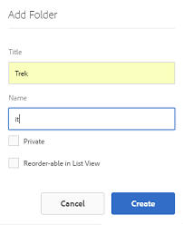

# Preparación de recursos para su traducción {#preparing-assets-for-translation}

Recursos multilingües significa recursos con binarios, metadatos y etiquetas en varios idiomas. Generalmente, los binarios, metadatos y etiquetas de recursos existen en un idioma, que luego se traducen a otros idiomas para su uso en proyectos multilingües.

En Recursos Adobe Experience Manager (AEM), los recursos multilingües se incluyen en las carpetas, donde cada carpeta contiene los recursos en un idioma diferente.

Cada carpeta de idioma se denomina copia de idioma. La carpeta raíz de una copia de idioma, conocida como raíz de idioma, identifica el idioma del contenido en la copia de idioma. Por ejemplo, */content/dam/it* es la raíz en italiano de la copia en idioma italiano. Las copias de idioma deben utilizar una raíz [de idioma](preparing-assets-for-translation.md#creating-a-language-root) correctamente configurada para que el idioma correcto se dirija al realizar las traducciones de recursos de origen.

La copia de idioma para la que se agregaron recursos originalmente es el maestro de idioma. El maestro de idiomas es la fuente que se traduce a otros idiomas. Una jerarquía de carpetas de ejemplo incluye varias raíces de idioma:

```
 /content
  /- dam
   |- en
   |- fr
   |- de
   |- es
   |- it
   |- ja
   |- zh
```

Realice los siguientes pasos para preparar los recursos para la traducción:

1. Cree la raíz del idioma del maestro de idioma. Por ejemplo, la raíz de idioma de la copia en inglés en la jerarquía de carpetas de ejemplo es `/content/dam/en`. Asegúrese de que la raíz del idioma está configurada correctamente según la información de [Crear una raíz](preparing-assets-for-translation.md#creating-a-language-root)de idioma.

1. Agregue recursos al maestro de idioma.
1. Cree la raíz de idioma de cada idioma de destino para el que necesite una copia de idioma.

## Crear una raíz de idioma {#creating-a-language-root}

Para crear la raíz de idioma, cree una carpeta y utilice un código de idioma ISO como valor para la propiedad Name. Después de crear la raíz del idioma, puede crear una copia del idioma en cualquier nivel dentro de la raíz del idioma.

Por ejemplo, la página raíz de la copia en idioma italiano de la jerarquía de muestra tiene `it` como propiedad Name. La propiedad Name se utiliza como nombre del nodo de recursos en el repositorio y, por lo tanto, determina la ruta de los recursos. (`https://[aem_server]:[port]/assets.html/content/dam/it/`).

1. En la consola Recursos, toque o haga clic en **[!UICONTROL Crear]** y elija **[!UICONTROL Carpeta]** en el menú.

   

1. En el campo **[!UICONTROL Nombre]** , escriba el código de país en el formato de `<language-code>`.

   

1. Haga clic o pulse **[!UICONTROL Crear]**. La raíz del idioma se crea en la consola Recursos.

## Ver las raíces del idioma {#viewing-language-roots}

La interfaz de AEM proporciona un panel **[!UICONTROL Referencias]** que muestra una lista de las raíces de idioma que se han creado en Recursos AEM.

1. En la consola Recursos, seleccione el maestro de idioma para el que desea crear copias de idioma.
1. Toque o haga clic en el icono de GlobalNav y elija **[!UICONTROL Referencias]** para abrir el panel [!UICONTROL Referencia] .

   

1. En el panel Referencias, toque o haga clic en **[!UICONTROL Copias]** de idioma. El panel [!UICONTROL Copias] de idioma muestra las copias de idioma de los recursos.

   
