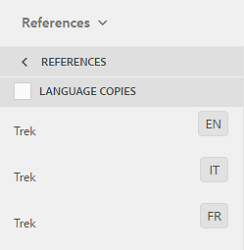

# Preparación de recursos para su traducción {#preparing-assets-for-translation}

Recursos multilingües: recursos con binarios, metadatos y etiquetas en varios idiomas. Por lo general, los binarios, los metadatos y las etiquetas de los recursos existen en un idioma y se traducen a otros idiomas para su uso en proyectos multilingües.

Entrada [!DNL Adobe Experience Manager Assets], los recursos multilingües se incluyen en las carpetas, donde cada carpeta contiene los recursos en un idioma diferente.

Cada carpeta de idioma se denomina copia de idioma. La carpeta raíz de una copia de idioma, conocida como raíz de idioma, identifica el idioma del contenido en la copia de idioma. Por ejemplo, */content/dam/it* es la raíz en italiano de la copia en italiano. Las copias de idioma deben utilizar un [raíz de idioma configurada correctamente](preparing-assets-for-translation.md#creating-a-language-root) para que el idioma correcto se dirija cuando se realicen traducciones de recursos de origen.

La copia de idioma para la que agregó los recursos originalmente es el idioma principal. El idioma principal es la fuente que se traduce a otros idiomas. Una jerarquía de carpetas de ejemplo incluye varias raíces de idioma:

```shell
/content
    /- dam
        |- en
        |- fr
        |- de
        |- es
        |- it
        |- ja
        |- zh
```

Realice los siguientes pasos para preparar los recursos para la traducción:

1. Cree la raíz de idioma del idioma principal. Por ejemplo, la raíz de idioma de la copia en inglés en la jerarquía de carpetas de ejemplo es `/content/dam/en`. Asegúrese de que la raíz del idioma esté configurada correctamente según la información de [Crear una raíz de idioma](preparing-assets-for-translation.md#creating-a-language-root).

1. Agregue recursos al idioma principal.
1. Cree la raíz de idioma de cada idioma de destino para el que necesite una copia de idioma.

## Crear una raíz de idioma {#creating-a-language-root}

Para crear la raíz de idioma, cree una carpeta y utilice un código de idioma ISO como valor para la propiedad Nombre. Después de crear la raíz del idioma, puede crear una copia de idioma en cualquier nivel dentro de la raíz del idioma.

Por ejemplo, la página raíz de la copia en italiano de la jerarquía de muestra tiene lo siguiente `it` como la propiedad Name. La propiedad Name se utiliza como nombre del nodo de recursos en el repositorio y, por lo tanto, determina la ruta de los recursos. (`https://[aem_server]:[port]/assets.html/content/dam/it/`).

1. Desde el [!DNL Assets] consola, haga clic en **[!UICONTROL Crear]** y elija **[!UICONTROL Carpeta]** en el menú.

   

1. En el **[!UICONTROL Nombre]** campo escriba el código de país con el formato de `<language-code>`.

   

1. Haga clic en **[!UICONTROL Crear]**. La raíz de idioma se crea en la variable [!DNL Assets] consola.

## Ver raíces de idioma {#viewing-language-roots}

[!DNL Experience Manager] La interfaz de proporciona un **[!UICONTROL Referencias]** panel que muestra una lista de las raíces de idioma que se han creado en [!DNL Assets].

1. En el [!DNL Assets] , seleccione el idioma principal para el que desea crear copias de idioma.
1. En el carril izquierdo, seleccione **[!UICONTROL Referencias]** para abrir el [!UICONTROL Referencia] panel.

   

1. En el panel Referencias, haga clic en **[!UICONTROL Copias de idioma]**. El [!UICONTROL Copias de idioma] el panel muestra las copias de idioma de los recursos.

   
