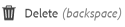

# Carpeta privada en [!DNL Adobe Experience Manager Assets] {#private-folder}

| Versión | Vínculo del artículo |
| -------- | ---------------------------- |
| AEM as a Cloud Service | [Haga clic aquí](https://experienceleague.adobe.com/docs/experience-manager-cloud-service/content/assets/manage/private-folder.html?lang=en) |
| AEM 6.5 | Este artículo |

Puede crear una carpeta privada en el [!DNL Adobe Experience Manager Assets] interfaz de usuario de disponible exclusivamente para usted. Puede compartir esta carpeta privada con otros usuarios y asignarles varios privilegios. En función del nivel de privilegio que asigne, los usuarios pueden realizar varias tareas en la carpeta, por ejemplo, ver los recursos de la carpeta o editarlos.

>[!NOTE]
>
>La carpeta privada tiene al menos un miembro con la función Propietario.

## Creación y uso compartido de carpetas privadas {#create-share-private-folder}

Para crear y compartir una carpeta privada:

1. En el [!DNL Assets] consola, haga clic en **[!UICONTROL Crear]** en la barra de herramientas y elija **[!UICONTROL Carpeta]** en el menú.

   

1. En el **[!UICONTROL Crear carpeta]** , introduzca un título y un nombre (opcional) para la carpeta y seleccione **[!UICONTROL Privado]** opción.

1. Haga clic en **[!UICONTROL Crear]**. Se crea una carpeta privada.

   

1. Para compartir la carpeta con otros usuarios y asignarles privilegios, seleccione la carpeta y haga clic en **[!UICONTROL Propiedades]** en la barra de herramientas.

   

   >[!NOTE]
   >
   >La carpeta no será visible para ningún otro usuario hasta que la comparta.

1. En el **[!UICONTROL Propiedades de carpeta]** , seleccione un usuario de la página **[!UICONTROL Añadir usuario]** , asigne una función al usuario de la carpeta privada y haga clic en **[!UICONTROL Añadir]**.

   

   >[!NOTE]
   >
   >Puede asignar varias funciones, como `Editor`, `Owner`, o `Viewer` al usuario con el que comparte la carpeta. Si asigna un `Owner` función para el usuario, el usuario tiene `Editor` privilegios en la carpeta. Además, el usuario puede compartir la carpeta con otros. Si asigna un `Editor` El usuario puede editar los recursos de su carpeta privada. Si asigna una función de visualizador, el usuario solo puede ver los recursos de la carpeta privada.

   >[!NOTE]
   >
   >La carpeta privada tiene al menos un miembro con `Owner` función. Por lo tanto, el administrador no puede quitar todos los miembros propietarios de una carpeta privada. Sin embargo, para eliminar los propietarios existentes (y el propio administrador) de la carpeta privada, el administrador debe agregar otro usuario como propietario.

1. Haga clic en **[!UICONTROL Guardar]**. Según la función que asigne, al usuario se le asigna un conjunto de privilegios en la carpeta privada cuando inicia sesión en [!DNL Assets].
1. Clic **[!UICONTROL Ok]** para cerrar el mensaje de confirmación.
1. El usuario con el que comparte la carpeta recibe una notificación de uso compartido. Iniciar sesión en [!DNL Assets] con las credenciales del usuario para ver la notificación.

   

1. Clic [!UICONTROL Notificaciones] para abrir una lista de notificaciones.

   

1. Haga clic en la entrada de la carpeta privada compartida por el administrador para abrir la carpeta.

>[!NOTE]
>
>Para crear una carpeta privada, necesita Leer y modificar [permisos de control de acceso](/help/sites-administering/security.md#permissions-in-aem) en la carpeta principal en la que desea crear una carpeta privada. Si no es administrador, estos permisos no están habilitados de forma predeterminada en `/content/dam`. En este caso, obtenga primero estos permisos para su ID de usuario o grupo antes de intentar crear carpetas privadas.

## Eliminación de carpeta privada {#delete-private-folder}

Puede eliminar una carpeta seleccionando la carpeta y [!UICONTROL Eliminar] en el menú superior o utilizando la tecla Retroceso en el teclado.

>[!CAUTION]
>
>Si elimina una carpeta privada de CRXDE Lite, los grupos de usuarios redundantes quedan en el repositorio.

>[!NOTE]
>
>Si elimina una carpeta mediante el método anterior de la interfaz de usuario, también se eliminarán los grupos de usuarios asociados.
>
>Sin embargo, los grupos de usuarios redundantes, no utilizados y autogenerados se pueden eliminar del repositorio mediante `clean` en JMX en la instancia de autor (`http://[server]:[port]/system/console/jmx/com.day.cq.dam.core.impl.team%3Atype%3DClean+redundant+groups+for+Assets`).
