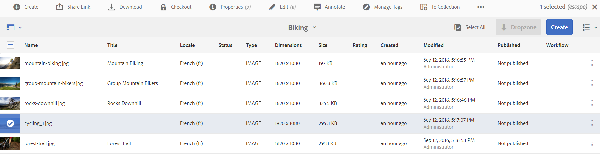
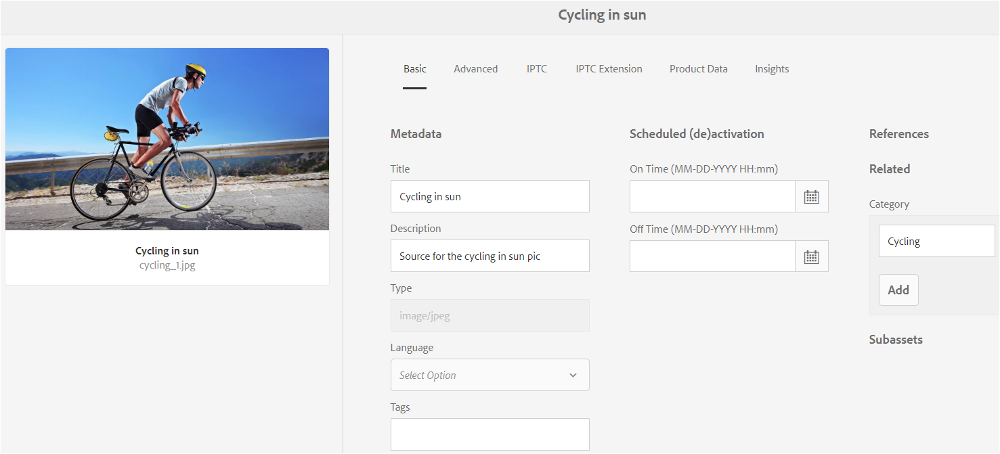

# Activos relacionados {#related-assets}

[!DNL Adobe Experience Manager Assets] permite relacionar recursos manualmente en función de las necesidades de la organización mediante la función de recursos relacionada. Por ejemplo, puede relacionar un archivo de licencia con un recurso o una imagen/vídeo en un tema similar. Puede relacionar recursos que comparten ciertos atributos comunes. También puede utilizar la función para crear relaciones de origen/derivadas entre recursos. Por ejemplo, si tiene un archivo PDF generado a partir de un archivo INDD, puede relacionar el archivo PDF con su archivo INDD de origen.

Con esta función, tiene la flexibilidad de compartir un archivo PDF o un archivo JPG de baja resolución con proveedores o agencias y hacer que el archivo INDD de alta resolución esté disponible únicamente si se solicita.

>[!NOTE]
>
>Solo los usuarios con permisos de edición de recursos pueden relacionar y desrelacionar los recursos.

## Relacionar recursos {#relating-assets}

1. En la interfaz [!DNL Experience Manager], abra la página **[!UICONTROL Propiedades]** de un recurso que desee relacionar.

   

   *Figura:  [!DNL Assets]  Página Propiedades para relacionar recursos.*

   También puede seleccionar el recurso en la vista de lista.

   

   También puede seleccionar el recurso de una colección.

   

1. Para relacionar otro recurso con el recurso seleccionado, haga clic en **[!UICONTROL Relate]**  en la barra de herramientas.
1. Realice una de las acciones siguientes:

   * Para relacionar el archivo de origen del recurso, seleccione **[!UICONTROL Source]** en la lista.
   * Para relacionar un archivo derivado, seleccione **[!UICONTROL Derived]** de la lista.
   * Para crear una relación bidireccional entre los recursos, seleccione **[!UICONTROL Others]** en la lista.

1. En la pantalla **[!UICONTROL Seleccionar recurso]**, vaya a la ubicación del recurso que desea relacionar y selecciónelo.

   

1. Haga clic en **[!UICONTROL Confirm]**.
1. Haga clic en **[!UICONTROL OK]** para cerrar el cuadro de diálogo. Según su elección de relación en el paso 3, el recurso relacionado se enumera en una categoría adecuada en la sección **[!UICONTROL Relacionado]**. Por ejemplo, si el recurso que ha relacionado es el archivo de origen del recurso actual, aparece en **[!UICONTROL Source]**.

   

1. Para desrelacionar un recurso, haga clic en **[!UICONTROL Desrelacionar]**  en la barra de herramientas.

1. Seleccione los recursos que desea desrelacionar del cuadro de diálogo **[!UICONTROL Quitar relaciones]** y haga clic en **[!UICONTROL Desrelacionar]**.

   

1. Haga clic en **[!UICONTROL OK]** para cerrar el cuadro de diálogo. Los recursos para los que ha eliminado relaciones se eliminan de la lista de recursos relacionados en la sección **[!UICONTROL Relacionados]**.

## Traducir recursos relacionados {#translating-related-assets}

La creación de relaciones de origen/derivadas entre recursos mediante la función de recursos relacionada también resulta útil en los flujos de trabajo de traducción. Cuando se ejecuta un flujo de trabajo de traducción en un recurso derivado, [!DNL Experience Manager Assets] recupera automáticamente cualquier recurso al que haga referencia el archivo de origen y lo incluye para su traducción. De este modo, el recurso al que hace referencia el recurso de origen se traduce junto con el origen y los recursos derivados. Por ejemplo, imaginemos un escenario en el que la copia en inglés incluye un recurso derivado y su archivo de origen, como se muestra a continuación.

Si el archivo de origen está relacionado con otro recurso, [!DNL Experience Manager Assets] recupera el recurso al que se hace referencia y lo incluye para su traducción.

*Figura: Recurso de origen de los recursos relacionados que se van a incluir para su traducción.*

1. Traduzca los recursos de la carpeta de origen a un idioma de destino siguiendo los pasos en [Crear un nuevo proyecto de traducción](translation-projects.md#create-a-new-translation-project). Por ejemplo, en este caso, traduzca los recursos al francés.

1. En la página [!UICONTROL Proyectos], abra la carpeta de traducción.

1. Haga clic en el mosaico del proyecto para abrir la página de detalles.

   

1. Haga clic en los puntos suspensivos situados debajo de la tarjeta Trabajo de traducción para ver el estado de la traducción.

   

1. Seleccione el recurso y, a continuación, haga clic en **[!UICONTROL Mostrar en recursos]** en la barra de herramientas para ver el estado de traducción del recurso.

   

1. Para comprobar si los recursos relacionados con el origen se han traducido, haga clic en el recurso de origen.

1. Seleccione el recurso relacionado con el origen y haga clic en **[!UICONTROL Mostrar en recursos]**. Se muestra el recurso relacionado traducido.
