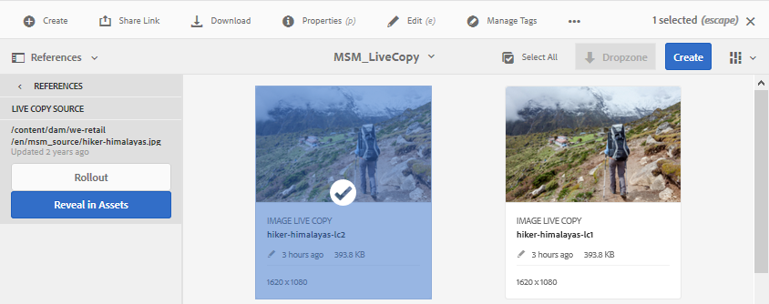
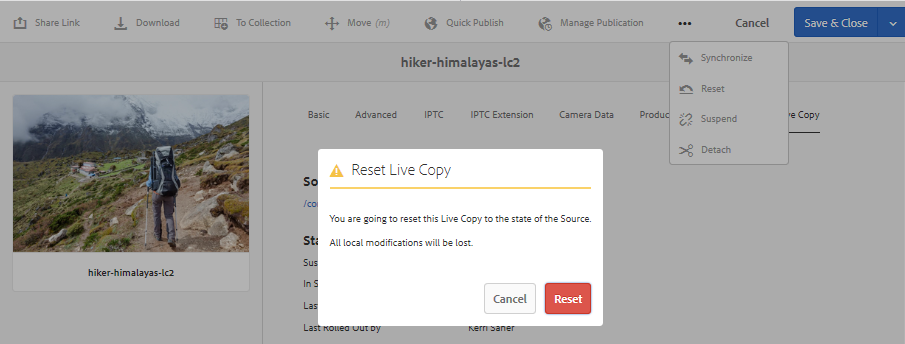

# Reutilización de recursos con MSM para recursos {#reuse-assets-using-msm-for-assets}

La funcionalidad Multi Site Manager (MSM) de Adobe Experience Manager (AEM) permite a los usuarios reutilizar el contenido que se crea una vez y se reutiliza en varias ubicaciones web. Lo mismo está disponible para recursos digitales que la funcionalidad MSM para recursos. Con MSM para recursos, puede:

* Cree recursos una vez y, a continuación, haga copias de estos recursos para reutilizarlos en otras áreas del sitio.
* Mantenga varias copias en sincronización y actualice la copia maestra original una vez para insertar los cambios en las copias secundarias.
* Realice cambios locales suspendiendo temporal o permanentemente la vinculación entre los recursos principales y secundarios.

## Requisitos previos {#configprereq}

Para utilizar MSM para recursos, instale al menos Service Pack 1. Para obtener más información, consulte [las notas](/help/release-notes/sp-release-notes.md)de la versión.

## Comprender los beneficios y los conceptos {#concepts}

### Cómo funciona y los beneficios {#how-it-works-and-the-benefits}

Para comprender los escenarios de uso para reutilizar el mismo contenido (texto y recursos) en varias ubicaciones web, consulte [posibles escenarios](/help/sites-administering/msm.md)de MSM. AEM mantiene un vínculo entre el recurso original y sus copias vinculadas, denominadas Live Copy (LC). La vinculación mantenida permite que los cambios centralizados se inserten en muchas copias en vivo. Esto permite actualizaciones más rápidas mientras se eliminan las limitaciones de la administración de copias duplicadas. La propagación de los cambios no tiene errores y está centralizada. La funcionalidad permite disponer de espacio para las actualizaciones que están limitadas a las copias en directo seleccionadas. Los usuarios pueden desasociar la vinculación, es decir, la herencia de salto, y realizar cambios locales que no se sobrescriban la próxima vez que se actualice la copia maestra y se implementen los cambios. La desvinculación se puede realizar para unos pocos campos de metadatos seleccionados o para un recurso completo. Permite flexibilidad para actualizar localmente los recursos que se heredaron originalmente de una copia maestra.

MSM mantiene una relación activa entre el recurso de origen y sus copias activas para que:

* Los cambios en los recursos de origen se aplican (se despliegan) también a las copias en vivo, es decir, las copias en vivo se sincronizan con el origen.
* Puede actualizar las copias activas suspendiendo la relación activa o eliminando la herencia de algunos campos limitados. Las modificaciones al origen ya no se aplican a la Live Copy.

### Glosario de términos de MSM para recursos {#glossary}

**Fuente:** Recursos o carpetas originales. Copia maestra de la que se derivan las copias en vivo.

**Live Copy:** Copia de los recursos o carpetas de origen que están en sincronización con su origen. Las Live Copies pueden ser una fuente de más Live Copies. Consulte cómo crear LC.

**Herencia:** Vínculo/referencia entre un recurso/carpeta de Live Copy y su origen que el sistema utiliza para recordar dónde enviar las actualizaciones. La herencia existe en un nivel granular para los campos de metadatos. La herencia se puede eliminar para los campos de metadatos selectivos, al tiempo que se conserva la relación activa entre el origen y su Live Copy.

**Despliegue:** Acción que impulsa las modificaciones realizadas en el flujo de salida de origen a sus copias en vivo. Es posible actualizar una o varias copias en directo de una sola vez mediante la acción de implementación. Consulte despliegue.

**Configuración de despliegue:** Reglas que determinan qué propiedades se sincronizan, cómo y cuándo. Estas configuraciones se aplican al crear copias en directo; se puede editar más tarde; y un elemento secundario puede heredar la configuración de implementación de su recurso principal. Para MSM para recursos, utilice únicamente la configuración de implementación estándar. Las demás configuraciones de implementación no están disponibles para MSM para Recursos.

**Sincronizar:** Otra acción, además de la implementación, que trae paridad entre la fuente y su Live Copy, enviando las actualizaciones de la fuente a las Live Copies. Se inicia una sincronización para una copia en vivo concreta y la acción extrae los cambios del origen. Con esta acción, solo es posible actualizar una de las copias activas. Consulte Sincronizar acción.

**Suspender:** Elimine temporalmente la relación activa entre una Live Copy y su recurso o carpeta de origen. Puede reanudar la relación. Consulte acción de suspensión.

**Reanudar:** Reanude la relación activa para que una Live Copy vuelva a empezar a recibir las actualizaciones del origen. Consulte la acción de reanudación.

**Restablecer:** La acción Restaurar hace que la Live Copy vuelva a ser una réplica del origen sobrescribiendo los cambios locales. También elimina las cancelaciones de herencia y restablece la herencia en todos los campos de metadatos. Para realizar modificaciones locales en el futuro, debe cancelar de nuevo la herencia de campos específicos. Consulte las modificaciones locales a la LC.

**Desasociar:** Elimine irrevocablemente la relación activa de una carpeta o recurso de Live Copy. Después de realizar la acción de separar, las copias en vivo nunca pueden recibir actualizaciones del origen y deja de ser una Live Copy. Consulte Eliminar relación.

## Creación de una Live Copy de un recurso {#createlc}

Para crear una Live Copy desde uno o varios recursos o carpetas de origen, siga uno de estos procedimientos:

* Método 1: Seleccione los recursos de origen y haga clic en **[!UICONTROL Crear > Live Copy]** en la barra de herramientas de la parte superior.
* Método 2: En la interfaz de usuario de AEM, haga clic en **[!UICONTROL Crear > Live Copy]** desde la esquina superior derecha de la interfaz.

Puede crear copias activas de un recurso o de una carpeta a la vez. Puede crear copias en vivo que se deriven de un recurso o de una carpeta que sea una copia en vivo. Los fragmentos de contenido (CF) no son compatibles con el caso de uso. Al intentar crear sus copias en vivo, los CF se copian como están sin ninguna relación. Los CF copiados son una instantánea a tiempo y no se actualizan cuando se actualizan los CF originales.

Para crear copias en vivo con el primer método, siga estos pasos:

1. Seleccione los recursos o carpetas de origen. En la barra de herramientas, haga clic en **[!UICONTROL Crear > Live Copy]**.

   

   *Figura: Creación de una Live Copy desde la interfaz de AEM*

1. Seleccione una carpeta de destino. Haga clic en **[!UICONTROL Siguiente]**. 
1. Proporcione el título y el nombre. Los recursos no tienen elementos secundarios. Al crear una Live Copy de carpetas, puede optar por incluir o excluir elementos secundarios.
1. Seleccione una configuración de despliegue. Haga clic en **[!UICONTROL Crear]**.

Para crear copias en vivo con el segundo método, siga estos pasos:

1. En la interfaz de AEM, en la esquina superior derecha, haga clic en **[!UICONTROL Crear > Live Copy]**.

   

   *Figura: Creación de una Live Copy desde la interfaz de AEM*

1. Seleccione el recurso o la carpeta de origen. Haga clic en **[!UICONTROL Siguiente]**. 
1. Seleccione la carpeta de destino. Haga clic en **[!UICONTROL Siguiente]**. 
1. Proporcione el título y el nombre. Los recursos no tienen elementos secundarios. Al crear una Live Copy de carpetas, puede optar por incluir o excluir elementos secundarios.
1. Seleccione una configuración de despliegue. Haga clic en **[!UICONTROL Crear]**.

>[!NOTE]
>
>Cuando se mueve un origen o una Live Copy, las relaciones se conservan. Cuando se elimina una Live Copy, se eliminan las relaciones.

## Ver varias propiedades y estados de la copia original y en vivo {#properties}

Puede ver la información y los estados relacionados con los MSM de la Live Copy, como la relación, la sincronización, los lanzamientos, etc., desde las distintas áreas de la interfaz de usuario de AEM.

Los dos métodos siguientes funcionan para los recursos y las carpetas:

* Seleccione un recurso de Live Copy y busque la información en su página Propiedades.
* Seleccione la carpeta de origen y busque la información detallada de cada Live Copy desde la consola de Live Copy.

>[!TIP]
>
>Para comprobar el estado de unas pocas copias en vivo independientes, utilice el primer método que se muestra en la página Propiedades. Para comprobar los estados de muchas Live Copies, utilice el segundo método, es decir, consulte la página **[!UICONTROL Estado de relación]**.

### Información y estado de una Live Copy {#statuslcasset}

Para comprobar la información y los estados de un recurso de Live Copy o una carpeta, siga estos pasos.

1. Seleccione un recurso de Live Copy o una carpeta. Click **[!UICONTROL Properties]** from the toolbar. Como alternativa, utilice la combinación de teclas `p`.
1. Click **[!UICONTROL Live Copy]**. Puede comprobar la ruta del origen, el estado de la suspensión, el estado de la sincronización, la fecha de la última implementación y el usuario que realizó la última implementación.

   

   *Figura: Información y estados de Live Copy*

1. Puede habilitar o deshabilitar si los recursos secundarios toman en préstamo la configuración de Live Copy.

1. Puede elegir la opción para que la Live Copy herede la configuración de implementación del elemento principal o cambie la configuración.

### Información y estados de todas las copias activas de una carpeta {#statuslcfolder}

AEM proporciona una consola para comprobar las estatuas de todas las copias activas de una carpeta de origen. Esta consola muestra el estado de todos los recursos secundarios.

1. Seleccione una carpeta de origen. Click **[!UICONTROL Properties]** from the toolbar. Como alternativa, utilice la combinación de teclas `p`.
1. Haga clic en **[!UICONTROL Origen de Live Copy]**. Para abrir la consola, haga clic en **[!UICONTROL Descripción general de Live Copy]**. Este tablero proporciona un estado de nivel superior de todos los recursos secundarios.

   

   *Figura: Ver estados de las copias en vivo en la consola de Live Copy del origen*

1. Para ver la información detallada sobre cada recurso en la carpeta Live Copy, seleccione un recurso y haga clic en **[!UICONTROL Estado de relación]** en la barra de herramientas.

   

   Información detallada y estado de un recurso secundario de Live Copy en una carpeta

>[!TIP]
>
>Puede ver rápidamente los estados de las copias en vivo de otras carpetas sin tener que examinar demasiado. Simplemente cambie la carpeta en la lista emergente de la parte superior central de la interfaz de **[!UICONTROL Live Copy Overview]** .

### Acciones rápidas del carril Referencias para el origen {#refrailsource}

Para un recurso o una carpeta de origen, puede ver la siguiente información y realizar las siguientes acciones directamente desde el carril Referencias:

* Consulte las rutas de las copias en vivo.
* Abra o revele una copia concreta en directo en la interfaz de usuario de AEM.
* Sincronice las actualizaciones con una Live Copy específica.
* Suspenda la relación o cambie la configuración de implementación para una Live Copy específica.
* Acceda a la consola de información general de Live Copy.

Select the source asset or folder, open the left rail, and click **[!UICONTROL References]**. También puede seleccionar un recurso o una carpeta y utilizar la combinación de teclas `Alt + 4`. 

*Figura: Acciones e información disponibles en el carril Referencias del origen seleccionado*

Para una Live Copy específica, haga clic en **[!UICONTROL Editar Live Copy]** para suspender la relación o cambiar la configuración de la implementación.

*Figura: Suspender la relación o cambiar la configuración de implementación de una Live Copy específica*

### Acciones rápidas del carril Referencias para la Live Copy {#refraillc}

Para una carpeta o un recurso de Live Copy, puede ver la siguiente información y realizar las siguientes acciones directamente desde el carril Referencias:

* Consulte la ruta de su origen.
* Abra o revele una copia concreta en directo en la interfaz de usuario de AEM.
* Despliegue las actualizaciones.

Seleccione una carpeta o un recurso de Live Copy, abra el carril izquierdo y haga clic en **[!UICONTROL Referencias]**. También puede seleccionar un recurso o una carpeta y utilizar la combinación de teclas `Alt + 4`. 

*Figura: Acciones disponibles en el carril Referencias para la Live Copy seleccionada*

## Propagación de modificaciones de copias de origen a Live Copy {#rolloutsync}

Una vez modificado un origen, los cambios se pueden propagar a las copias en vivo mediante una acción de sincronización o de implementación. Para comprender la diferencia entre ambas acciones, consulte el [glosario](#glossary).

### Acción de despliegue {#rollout}

Puede iniciar una acción de despliegue desde el recurso de origen y actualizar todas o algunas copias activas seleccionadas.

1. Seleccione un recurso de Live Copy o una carpeta. Click **[!UICONTROL Properties]** from the toolbar. Como alternativa, utilice la combinación de teclas `p`.
1. Haga clic en **[!UICONTROL Origen de Live Copy]**. Haga clic en **[!UICONTROL Despliegue]** en la barra de herramientas de la parte superior.
1. Seleccione las copias activas que desee actualizar. Haga clic en **[!UICONTROL Despliegue]**. Para desplegar las actualizaciones realizadas en los recursos secundarios, seleccione Origen de **[!UICONTROL despliegue y Todos los elementos secundarios]**.

   

   *Figura: Despliegue las modificaciones del origen en unas pocas o todas las Live Copies*

>[!NOTE]
>
>Las modificaciones realizadas en un recurso de origen solo se implementan en las copias en vivo directamente relacionadas. Si una Live Copy se deriva de otra Live Copy, las modificaciones no se implementan en la Live Copy derivada.

Como alternativa, puede iniciar una acción de despliegue desde el carril Referencias después de seleccionar una Live Copy específica. Para obtener más información, consulte Acciones [rápidas desde el carril Referencias para la Live Copy](#refraillc). En este método de implementación, solo se actualizan la Live Copy seleccionada y, opcionalmente, sus elementos secundarios.

*Figura: Despliegue las modificaciones del origen en la Live Copy seleccionada*

### Acerca de la acción de sincronización {#aboutsync}

Una acción de sincronización extrae las modificaciones de un origen únicamente a la Live Copy seleccionada. La acción de sincronización respeta y mantiene las modificaciones locales realizadas tras cancelar la herencia. Las modificaciones locales no se sobrescriben y la herencia cancelada no se restablece. Puede iniciar una acción de sincronización de tres formas.

| Dónde se encuentra la interfaz de AEM | Cuándo y por qué usar | Cómo usar |
|---|---|---|
| [!UICONTROL Barra de referencias] | Sincronice rápidamente cuando ya haya seleccionado el origen. | Consulte Acciones [rápidas desde el carril Referencias para ver el origen](#refrailsource) |
| Barra de herramientas de la página [!UICONTROL Propiedades] | Inicie una sincronización cuando ya tenga abiertas las propiedades de Live Copy. | Consulte [Sincronización de una Live Copy](#synclc) |
| [!UICONTROL Consola de información general] de Live Copy | Sincronice rápidamente varios recursos (no necesariamente todos) cuando la carpeta de origen está seleccionada o la consola de [!UICONTROL Live Copy Overview] ya está abierta. La acción de sincronización se inicia para un recurso a la vez, pero es una forma más rápida de sincronizar varios recursos de una sola vez. | Consulte [Acciones en muchos recursos de una carpeta de Live Copy](#bulkactions) |

### Sincronizar una Live Copy {#synclc}

Para iniciar una acción de sincronización, abra la página **[!UICONTROL Propiedades]** de una Live Copy, haga clic en **[!UICONTROL Live Copy]** y, a continuación, seleccione la acción que desee en la barra de herramientas.

Para ver los estados y la información relacionados con una acción de sincronización, consulte [Información y estado de una Live Copy](#statuslcasset) e [Información y estados de todas las Live Copy de una carpeta](#statuslcfolder).

*Figura: La acción Sincronizar extrae los cambios realizados en el origen*

>[!NOTE]
>
>Si la relación está suspendida, la acción de sincronización no está disponible en la barra de herramientas. Aunque la acción de sincronización está disponible en el carril Referencias, las modificaciones no se propagan incluso si la implementación se ha realizado correctamente.

## Suspender y reanudar la relación {#suspendresume}

Puede suspender temporalmente la relación para evitar que una Live Copy reciba las modificaciones realizadas en el recurso o la carpeta de origen. La relación también se puede reanudar para que Live Copy empiece a recibir las modificaciones del origen.

Para suspender o reanudar, abra la página **[!UICONTROL Propiedades]** de una Live Copy, haga clic en **[!UICONTROL Live Copy]** y seleccione la acción que desee en la barra de herramientas.

También puede suspender o reanudar rápidamente las relaciones de varios recursos en una carpeta de Live Copy desde la consola **[!UICONTROL Información general de Live Copy]**. Consulte [Realizar acciones en varios recursos de las carpetas de Live Copy](#bulkactions).

## Realizar modificaciones locales en una Live Copy {#localmods}

Una Live Copy es una réplica del origen original cuando se crea. Los valores de metadatos de una Live Copy se heredan del origen. Los campos de metadatos mantienen la herencia de forma individual con los campos respectivos del recurso de origen.

Sin embargo, tiene la flexibilidad de realizar modificaciones locales en una Live Copy para cambiar algunas propiedades seleccionadas. Para realizar modificaciones locales, cancele la herencia de la propiedad deseada. Cuando se cancela la herencia de uno o varios campos de metadatos, se conserva la relación activa del recurso y la herencia de los demás campos de metadatos. Cualquier sincronización o implementación no sobrescribe las modificaciones locales. Para ello, abra la página **[!UICONTROL Propiedades]** de un recurso de Live Copy y haga clic en el icono **[!UICONTROL Cancelar herencia]** situado junto a un campo de metadatos.

Puede deshacer todas las modificaciones locales y revertir el recurso al estado de su origen. La acción Restablecer anula de forma irrevocable e instantánea todas las modificaciones locales y restablece la herencia en todos los campos de metadatos. Para revertir, en la página **[!UICONTROL Propiedades]** de un recurso de Live Copy, haga clic en **[!UICONTROL Restablecer]** en la barra de herramientas.

*Figura: La acción Restablecer sobrescribe las ediciones locales y trae la Live Copy en parte con su origen*

## Eliminar la relación en directo {#detach}

Puede eliminar completamente la relación entre un origen y una Live Copy mediante la acción Desasociar. La Live Copy se convierte en un recurso o una carpeta independiente después de desconectarla. Se muestra como un nuevo recurso en la interfaz de AEM, inmediatamente después de la desconexión. Para separar una Live Copy de su origen, siga estos pasos.

1. Seleccione una carpeta o un recurso de Live Copy. Click **[!UICONTROL Properties]** from the toolbar. Como alternativa, utilice la combinación de teclas `p`.

1. Click **[!UICONTROL Live Copy]**. Haga clic en **[!UICONTROL Desasociar]** en la barra de herramientas. Haga clic en **[!UICONTROL Separar]** en el cuadro de diálogo presentado.

   

   *Figura: La acción Separar elimina completamente la relación entre la copia original y la Live Copy*

   >[!CAUTION]
   >
   >La relación se elimina inmediatamente cuando se hace clic en **[!UICONTROL Separar]** en el cuadro de diálogo. No se puede deshacer haciendo clic en **[!UICONTROL Cancelar]** en la página Propiedades.

Alternatively, you can quickly detach multiple assets in a live copy folder from the **[!UICONTROL Live Copy Overview]** console. Consulte [Realizar acciones en varios recursos de las carpetas de Live Copy](#bulkactions).

## Realizar acciones en varios recursos de una carpeta de Live Copy {#bulkactions}

Si tiene varios recursos en una carpeta de Live Copy, iniciar acciones en cada recurso puede resultar tedioso. Puede iniciar rápidamente las acciones básicas en muchos recursos desde la consola de Live Copy. Los métodos anteriores siguen funcionando para activos individuales.

1. Seleccione una carpeta de origen. Click **[!UICONTROL Properties]** from the toolbar. Como alternativa, utilice la combinación de teclas `p`.
1. Haga clic en **[!UICONTROL Origen de Live Copy]**. Para abrir la consola, haga clic en **[!UICONTROL Descripción general de Live Copy]**.
1. En este tablero, seleccione un recurso de Live Copy de una carpeta de Live Copy. Haga clic en las acciones que desee en la barra de herramientas. Las acciones disponibles son **[!UICONTROL Sincronizar]**, **[!UICONTROL Restablecer]**, **[!UICONTROL Suspender]** y **[!UICONTROL Desconectar]**. Puede iniciar rápidamente estas acciones en cualquier recurso en cualquier número de carpetas de Live Copy que estén en una relación activa con la carpeta de origen seleccionada.

   

   *Figura: Actualice fácilmente muchos recursos en carpetas de Live Copy desde la consola Información general de Live Copy*

## Ampliar MSM para recursos {#extendapi}

AEM le permite ampliar la funcionalidad mediante las API de Java de MSM. Para Recursos, la extensión funciona igual que con MSM para el sitio. Para obtener más información, consulte [Ampliación del MSM](/help/sites-developing/extending-msm.md) y lo siguiente para obtener información sobre tareas específicas:

* [Información general sobre las API](/help/sites-developing/extending-msm.md#overview-of-the-java-api)
* [Crear una nueva acción de sincronización](/help/sites-developing/extending-msm.md#creating-a-new-synchronization-action)
* [Crear una nueva configuración de implementación](/help/sites-developing/extending-msm.md#creating-a-new-rollout-configuration)
* [Crear y utilizar una clase LiveActionFactory sencilla](/help/sites-developing/extending-msm.md#creating-and-using-a-simple-liveactionfactory-class)

>[!NOTE]
>
>* El modelo en MSM para el sitio se denomina fuente Live Copy en MSM para los recursos.
>* La eliminación del paso de capítulos en el asistente para crear sitios no se admite en MSM para recursos.
>* La configuración de bloqueos MSM en propiedades de página (IU táctil) no es compatible con MSM para recursos.

## Impacto de las tareas de gestión de activos en las copias en vivo {#manageassets}

Las copias en vivo y los orígenes son recursos o carpetas que se pueden administrar, en cierta medida, como recursos digitales. Algunas tareas de gestión de recursos en AEM tienen un impacto específico en las copias en directo.

* Al copiar una Live Copy, se crea un recurso de Live Copy con el mismo origen que la primera Live Copy.
* Al mover un origen o su Live Copy, se mantiene la relación activa.
* La acción Editar no funciona para los recursos de Live Copy. Si la fuente de una Live Copy es una Live Copy en sí misma, la acción de edición no funciona para ella.
* La acción de desprotección no está disponible para los recursos de Live Copy.
* Para la carpeta de origen, está disponible la opción de crear tareas de revisión.
* Al ver el listado de recursos en la vista de lista y de columna, un recurso de Live Copy o una carpeta muestran la &quot;Live Copy&quot; en su contra. Esto le ayuda a identificar fácilmente las copias en vivo en una carpeta.

## Comparar MSM para recursos y sitios {#comparison}

En más escenarios, MSM para recursos coincide con el comportamiento de la funcionalidad MSM para sitios. Algunas de las diferencias clave a tener en cuenta son:

* El modelo en MSM para el sitio se denomina fuente Live Copy en MSM para los recursos.
* En Sitios, puede comparar un modelo y su Live Copy, pero en Recursos no es posible comparar un origen con su Live Copy.
* No puede editar una Live Copy en Recursos.
* Los sitios suelen tener hijos, pero los recursos no. La opción para incluir o excluir elementos secundarios no está presente al crear copias en vivo de recursos individuales.
* La eliminación del paso de capítulos en el asistente para crear sitios no se admite en MSM para recursos.
* La configuración de bloqueos MSM en propiedades de página (IU táctil) no es compatible con MSM para recursos.
* Para MSM para recursos, utilice únicamente la configuración de implementación **[!UICONTROL estándar]**. Las demás configuraciones de implementación no están disponibles para MSM para Recursos.

## Best practices {#bestpractices}

Algunas prácticas recomendadas para MSM son:

* Planifique las relaciones principales-secundarias de los recursos y los flujos de contenido antes de iniciar la implementación.

## Limitaciones y problemas conocidos de MSM para recursos {#limitations}

A continuación se muestra una limitación de MSM para Recursos.

* Los fragmentos de contenido (CF) no son compatibles con el caso de uso. Al intentar crear sus copias en vivo, los CF se copian como están sin ninguna relación. Los CF copiados son una instantánea a tiempo y no se actualizan cuando se actualizan los CF originales.
