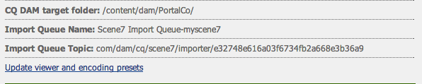

# El vídeo {#video}

Assets permite gestionar recursos de vídeo de forma centralizada, donde puede cargar vídeos directamente en Recursos para codificarlos automáticamente en Dynamic Media Classic (Scene7) y acceder a vídeos de Dynamic Media Classic directamente desde Recursos para la creación de páginas.

La integración de vídeo de Dynamic Media Classic amplía el alcance del vídeo optimizado a todas las pantallas (detección de ancho de banda y dispositivo automático).

* The **[!UICONTROL Scene7 Video]** component automatically performs device and bandwidth detection to play the right format and right quality video across desktop, tablets and mobile.
* Assets: puede incluir conjuntos de vídeos adaptables en lugar de solo recursos de vídeo únicos. Un conjunto de vídeos adaptables es un contenedor para todas las representaciones de vídeo necesarias para reproducir vídeo sin problemas en varias pantallas. Un conjunto de vídeos adaptable agrupa versiones del mismo vídeo codificadas con diferentes velocidades de bits y formatos, como 400 kbps, 800 kbps y 1000 kbps. Un conjunto de vídeos adaptables, junto con el componente de vídeo de S7, se utiliza para trasmitir vídeo adaptable en varias pantallas, incluidos equipos de escritorio, iOS, Android, Blackberry y dispositivos móviles de Windows. Consulte [Documentación de Scene7 sobre los conjuntos de vídeos adaptables](https://help.adobe.com/en_US/scene7/using/WS53492AE1-6029-45d8-BF80-F4B5CF33EB08.html) para obtener más información.

## Acerca de FFMPEG y Dynamic Media Classic {#about-ffmpeg-and-scene}

El proceso de codificación de vídeo predeterminado se basa en el uso de la integración basada en FFMPEG con los perfiles de vídeo. Por lo tanto, el flujo de trabajo de ingestión de DAM incorporado contiene los dos pasos siguientes del flujo de trabajo basado en ffmpeg:

* Miniaturas de FFMPEG
* Codificación de FFMPEG

Tenga en cuenta que al habilitar y configurar la integración de Dynamic Media Classic no se eliminan ni se desactivan automáticamente estos dos pasos del flujo de trabajo de inserción de DAM. Si ya utiliza codificación de vídeo basada en FFMPEG en AEM, es probable que tenga FFMPEG instalado en sus entornos de creación. En este caso, un nuevo vídeo ingestado mediante DAM se codificaría dos veces: una vez desde el codificador FFMPEG y otra desde la integración de Dynamic Media Classic.

Si tiene configurada la codificación de vídeo basada en FFMPEG en AEM y FFMPEG instalado, Adobe recomienda eliminar los dos flujos de trabajo de FFMPEG de los flujos de trabajo de ingesta de DAM.

## Formatos admitidos {#supported-formats}

Los formatos siguientes se admiten para el componente de vídeo de Scene7:

* F4V H.264
* MP4 H.264

## Decidir dónde cargar el vídeo {#deciding-where-to-upload-your-video}

Decidir dónde cargar los recursos de vídeo depende de las acciones siguientes:

* ¿Necesita un flujo de trabajo para el recurso de vídeo?
* ¿Necesita un control de versión para el recurso de vídeo?

Si la respuesta es “sí” a una o ambas preguntas, cargue el vídeo directamente en Adobe DAM. Si la respuesta es &quot;no&quot; a ambas preguntas, cargue el vídeo directamente en Dynamic Media Classic. El flujo de trabajo de cada escenario se describe en la sección siguiente.

### If you are uploading your video directly to Adobe DAM {#if-you-are-uploading-your-video-directly-to-adobe-dam}

Si necesita un flujo de trabajo o una versión para sus recursos, primero debe cargar a Adobe DAM. El flujo de trabajo siguiente es el recomendado:

1. Cargue el recurso de vídeo en Adobe DAM y codifique y publique automáticamente en Dynamic Media Classic.
1. En AEM, acceda a los recursos de vídeo de WCM en la pestaña **[!UICONTROL Películas]** del buscador de contenido.
1. Author with **[!UICONTROL Scene7 Video]** or **[!UICONTROL Foundation Video]** component.

### Si está cargando el vídeo en Scene7 {#if-you-are-uploading-your-video-to-scene}

Si no necesita un flujo de trabajo ni crear versiones de los recursos, debe cargarlos en Scene7. El flujo de trabajo siguiente es el recomendado:

1. In Dynamic Media Classic, [set up a scheduled FTP uploading and encoding to Scene7 (system automated)](https://help.adobe.com/en_US/scene7/using/WS70B173EC-4CAD-4b4c-BF9C-43A11F3A5950.html).
1. En AEM, acceda a los recursos de vídeo de WCM en la pestaña **[!UICONTROL Scene7]** del buscador de contenido.
1. Author with the **[!UICONTROL Scene7 Video]** component.

## Configuración de la integración con vídeo de Scene7 {#configuring-integration-with-scene-video}

Para configurar los ajustes preestablecidos universales:

1. En **[!UICONTROL Servicios de nube]**, vaya a la configuración de **[!UICONTROL Scene7]** y haga clic en **[!UICONTROL Editar]**.
1. Seleccione la pestaña **[!UICONTROL Vídeo]**.

   

   >[!NOTE]
   >
   >La pestaña **[!UICONTROL Vídeo]** no aparece si la página no tiene una configuración de nube.

1. Seleccione el perfil de codificación de vídeo adaptable, un perfil de codificación de vídeo único listo para usar o un perfil de codificación de vídeo personalizado.

   >[!NOTE]
   >
   >For more information about what the video presets mean, see the [Dynamic Media Classic documentation](https://help.adobe.com/en_US/scene7/using/WSE86ACF2B-BD50-4c48-A1D7-9CD4405B62D0.html).
   >
   >Adobe recomienda que seleccione ambos conjuntos de vídeos adaptables al configurar los ajustes preestablecidos universales o que seleccione la opción **[!UICONTROL Codificación de vídeo adaptable]**.

1. Los perfiles de codificación seleccionados se aplican automáticamente a todos los vídeos cargados en la carpeta de destino de CQ DAM que ha configurado para esta configuración de nube de Scene7. Puede establecer diversas configuraciones de nube de Scene7 con diferentes carpetas de destino para aplicar distintos perfiles de codificación según sea necesario.

## Actualizar los ajustes preestablecidos del visor y de codificación {#updating-viewer-and-encoding-presets}

Si necesita actualizar los ajustes preestablecidos del visor y de codificación para vídeo en AEM porque los ajustes preestablecidos se han actualizado en Scene7, vaya a la configuración de Scene7 en la configuración de nube y haga clic en **[!UICONTROL Actualizar los ajustes preestablecidos del visor y de codificación]**.

## Uploading your master video to Scene7 from Adobe DAM {#uploading-your-master-video}

1. Vaya a la carpeta de destino de CQ DAM en que ha establecido la configuración de nube con perfiles de codificación de Scene7.
1. Haga clic en **[!UICONTROL Cargar]** para cargar el vídeo maestro. Video uploading and encoding is complete after the DAM Update Asset workflow is complete and **[!UICONTROL Publish to Scene7]** has a checkmark.

   >[!NOTE]
   >
   >Puede que pase un tiempo hasta que las miniaturas de vídeo se generen.

   Al arrastrar el vídeo maestro de DAM al componente de vídeo, se accede a *todas* las representaciones proxy codificadas de Scene7 para realizar la presentación.

## Componente de vídeo base frente al componente de vídeo de Scene7 {#foundation-video-component-versus-scene-video-component}

Al utilizar AEM, se accede al componente de vídeo disponible en Sites y al componente de vídeo de Scene7. Dichos componentes no son intercambiables.

El componente de vídeo de Scene7 solo funciona para los vídeos de Scene7. El componente base funciona con los vídeos almacenados de AEM (con FFMPEG) y con los vídeos de Scene7.

En la matriz siguiente se explica cuándo debe utilizar el componente:

>[!NOTE]
>
>El componente de vídeo de S7, listo para usar, utiliza el perfil de vídeo universal. Sin embargo, puede obtener el reproductor de vídeo basado en HTML5 para que lo utilice AEM siguiendo uno de estos procedimientos en Scene7: copie el código incrustado del reproductor de vídeo HTML5 incorporado y colóquelo en la página de AEM.

## Componente de vídeo de AEM {#aem-video-component}

Incluso si se recomienda utilizar el componente de vídeo de Scene7 para ver los vídeos de Scene7, en esta sección se describe cómo utilizar los vídeos de Scene7 con el componente de vídeo base de AEM, a fin de que todo esté completo.

### Comparación del vídeo de AEM y el de Scene7 {#aem-video-and-scene-video-comparison}

En la tabla siguiente se proporciona una comparación de alto nivel de capacidades admitidas entre el componente de vídeo base de AEM y el componente de vídeo de Scene7:

|  | Vídeo base de AEM | Vídeo de Scene7 |
|---|---|---|
| Enfoque | Primer enfoque de HTML5. Flash solo se utiliza para la alternativa no HTML5. | Flash en la mayoría de los equipos de escritorio. HTML5 se utiliza para móviles y tabletas. |
| Entrega | Progresivo | Transmisión adaptable |
| Seguimiento | Sí | Sí |
| Capacidad de ampliación | Sí | Sí (con el SDK del visor de Scene7) |
| Vídeo móvil | Sí | Sí |

### Configuración {#setting-up}

#### Creación de perfiles de vídeo {#creating-video-profiles}

Las distintas codificaciones de vídeo se crean de acuerdo con los ajustes preestablecidos de codificación de S7 seleccionados en la configuración de nube de S7. Para que el componente de vídeo base los utilice, se debe crear un perfil de vídeo para cada ajuste preestablecido de codificación de S7 seleccionado. Esto permite que el componente de vídeo seleccione las representaciones de DAM según corresponda.

>[!NOTE]
>
>Los perfiles de vídeo nuevos, así como los cambios que se realicen en ellos, deben activarse para publicarse.

1. En AEM, toque **[!UICONTROL Tools > Configuration Console**.
1. In the **[!UICONTROL Configuration Console]** navigate to **[!UICONTROL Tools > DAM > Video Profiles]** in the navigation tree.
1. Crear un nuevo perfil de vídeo de S7. **[!UICONTROL En el]** Nuevo... , seleccione **[!UICONTROL Crear página]** y, a continuación, la plantilla de perfil de vídeo de Scene7. Asigne un nombre a la página nueva del perfil de vídeo y haga clic en **[!UICONTROL Crear]**.

   

1. Edite el nuevo perfil de vídeo. Seleccione primero la configuración de nube. A continuación, seleccione el mismo ajuste preestablecido de codificación que el que se ha seleccionado en la configuración de nube.

   

   | Propiedad | Descripción |
   |---|---|
   | Configuración de nube de Scene7 | La configuración de nube que se va a utilizar para los ajustes preestablecidos de codificación. |
   | Ajuste preestablecido de codificación de Scene7 | El ajuste preestablecido de codificación con el que se asignará este perfil de vídeo. |
   | Tipo de vídeo HTML5 | Esta propiedad permite establecer el valor de la propiedad type del elemento de origen de vídeo HTML5. Los ajustes preestablecidos de codificación de S7 no proporcionan esta información, pero es necesaria para procesar correctamente los vídeos mediante el elemento de vídeo HTML5. Se proporciona una lista de los formatos comunes, pero se pueden sobrescribir por otros formatos. |

   Repita este paso para todos los ajustes preestablecidos de codificación seleccionados en la configuración de nube que desea utilizar en el componente de vídeo.

#### Configuring design {#configuring-design}

The **[!UICONTROL Foundation Video]** component must know about what video profiles to use in order to build the video sources list. Debe abrir el cuadro de diálogo de diseño de componentes de vídeo y configurar el diseño de componentes para utilizar los nuevos perfiles de vídeo.

>[!NOTE]
>
>If you use the **[!UICONTROL Foundation Video]** component on a mobile page, you might need to repeat these steps on the design of the mobile page.

>[!NOTE]
>
>Los cambios realizados en el diseño requieren la activación del diseño para que surtan efecto en la publicación.

1. Open the **[!UICONTROL Foundation Video]** component&#39;s design dialog box and change to the **[!UICONTROL Profiles]** tab. A continuación, elimine los perfiles predeterminados y agregue los nuevos perfiles de vídeo S7. El orden de la lista de perfiles en el cuadro de diálogo de diseño define el orden del elemento de orígenes de vídeo al realizar el procesamiento.
1. Para los exploradores que no admiten HTML5, el componente de vídeo permite configurar una reserva Flash. Open the video components design dialog box and change to the **[!UICONTROL Flash]** tab. Configure los ajustes de Flash Player y asigne un perfil de reserva para el reproductor Flash.

#### Lista de comprobación {#checklist}

1. Cree una configuración de nube de S7. Asegúrese de que los ajustes preestablecidos de codificación de vídeo se hayan establecido y de que el importador se esté ejecutando.
1. Cree un perfil de vídeo de S7 para cada ajuste preestablecido de codificación de vídeo seleccionado en la configuración de nube.
1. Los perfiles de vídeo deben estar activados.
1. Configure the design of the **[!UICONTROL oundation Video]** component on your page.
1. Active el diseño cuando haya terminado con los cambios de diseño.

