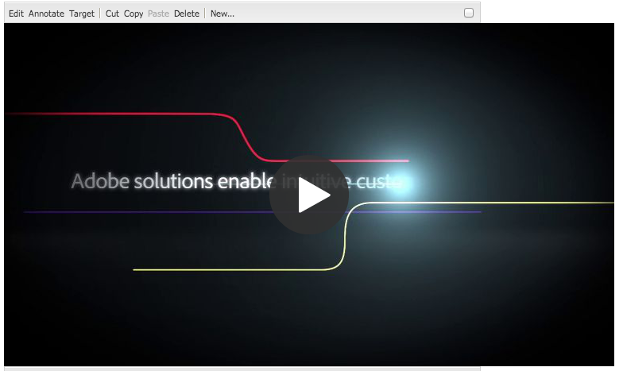

# Añadir funciones de Dynamic Media Classic a las páginas {#adding-scene-features-to-your-page}

[Adobe Dynamic Media Classic](https://experienceleague.adobe.com/docs/dynamic-media-classic/using/home.html?lang=es) es una solución hospedada para administrar, mejorar, publicar y entregar recursos de medios enriquecidos en pantallas e impresoras web, móviles, de correo electrónico y conectadas a Internet.

Puede ver los recursos del Experience Manager publicados en Dynamic Media Classic en varios visores:

* Zoom
* Flotante
* Vídeo
* Plantilla de imagen
* Imagen

Puede publicar recursos digitales directamente desde Experience Manager a Dynamic Media Classic y puede publicar recursos digitales desde Dynamic Media Classic a Experience Manager.

En este documento se describe cómo publicar recursos digitales de Experience Manager en Dynamic Media Classic y a la inversa. Los espectadores también se describen en detalle. Para obtener información sobre la configuración de Experience Manager para Dynamic Media Classic, consulte [Integrar Dynamic Media Classic con Experience Manager](/help/sites-administering/scene7.md).

Consulte también [Agregar mapas de imagen](image-maps.md).

Para obtener más información sobre el uso de componentes de vídeo con Experience Manager, consulte [Vídeo](video.md).

>[!NOTE]
>
>Si los recursos de Dynamic Media Classic no se muestran correctamente, asegúrese de que Dynamic Media esté [deshabilitado](config-dynamic.md#disabling-dynamic-media) y actualice la página.

## Publicar manualmente en Dynamic Media Classic desde recursos {#manually-publishing-to-scene-from-assets}

Puede publicar recursos digitales en Dynamic Media Classic de la siguiente manera:

* [En la interfaz de usuario clásica de desde la consola de Assets](/help/sites-classic-ui-authoring/manage-assets-classic-s7.md#publishing-from-the-assets-console)
* [En la interfaz de usuario clásica de un recurso](/help/sites-classic-ui-authoring/manage-assets-classic-s7.md#publishing-from-an-asset)
* [En la interfaz de usuario clásica desde fuera de la carpeta CQ Target](/help/sites-classic-ui-authoring/manage-assets-classic-s7.md#publishing-assets-from-outside-the-cq-target-folder)

>[!NOTE]
>
>Experience Manager publica en Dynamic Media Classic de forma asíncrona. Después de seleccionar **[!UICONTROL Publish]**, el recurso tarda varios segundos en publicarse en Dynamic Media Classic.
>

## Componentes de Dynamic Media Classic {#scene-components}

Los siguientes componentes de Dynamic Media Classic están disponibles en Experience Manager:

* Zoom
* Flotante (Zoom)
* Plantilla de imagen
* Imagen
* Vídeo

>[!NOTE]
>
>Estos componentes no están disponibles de manera predeterminada y deben seleccionarse en el modo **[!UICONTROL Diseño]** antes de usar.

Una vez que estén disponibles en el modo **[!UICONTROL Diseño]**, podrá agregar los componentes a su página como cualquier otro componente de Experience Manager. Las Assets que aún no se hayan publicado en Dynamic Media Classic se publican en Dynamic Media Classic si se encuentran en una carpeta sincronizada o en una página, o con una configuración de nube de Dynamic Media Classic.

>[!NOTE]
>
>Si está creando y desarrollando visores personalizados y está utilizando el buscador de contenido, debe agregar explícitamente el parámetro `allowfullscreen`.

### Aviso de fin de vida útil para el visualizador de Flashes {#flash-viewers-end-of-life-notice}

A partir del 31 de enero de 2017, Adobe Dynamic Media Classic dejará de ser compatible con la plataforma de visor de Flash.

### Añadir un componente Dynamic Media Classic (Scene7) a una página {#adding-a-scene-component-to-a-page}

Añadir un componente de Dynamic Media Classic (Scene7) a una página es lo mismo que añadir un componente a cualquier página. Los componentes de Dynamic Media Classic se describen en detalle en las secciones siguientes.

**Para agregar un componente de Dynamic Media Classic (Scene7) a una página:**

1. En Experience Manager, abra la página donde desee agregar el componente **[!UICONTROL Dynamic Media Classic (Scene7)]**.

1. Si no hay componentes de Dynamic Media Classic disponibles, seleccione el modo **[!UICONTROL Diseño]**, seleccione cualquier componente con un borde azul, seleccione el icono **[!UICONTROL Principal]** y, a continuación, el icono **[!UICONTROL Configuración]**. En **[!UICONTROL Parsys (Diseño)]**, seleccione todos los componentes de Dynamic Media Classic para que estén disponibles y seleccione **[!UICONTROL Aceptar]**.

   

1. Seleccione **[!UICONTROL Editar]** para poder volver al modo **[!UICONTROL Editar]**.

1. Arrastre un componente del grupo Dynamic Media Classic de la barra de tareas a la página en la ubicación deseada.

1. Seleccione el icono **[!UICONTROL Configuración]** para poder abrir el componente.

1. Edite el componente según sea necesario y seleccione **[!UICONTROL Aceptar]** para guardar los cambios.
1. Arrastre la imagen o el vídeo desde el explorador de contenido al componente Dynamic Media Classic que ha agregado a la página.

   >[!NOTE]
   >
   >Solo en la IU táctil, debe arrastrar y soltar la imagen o el vídeo en el componente de Dynamic Media Classic que colocó en la página. No se admite la selección y edición del componente de Dynamic Media Classic y, a continuación, la selección del recurso.

### Añadir una experiencia de visualización interactiva en un sitio adaptable {#adding-interactive-viewing-experiences-to-a-responsive-website}

El diseño interactivo para sus recursos significa que el recurso se adapta según dónde se muestre. Con un diseño interactivo, los mismos recursos se pueden visualizar de forma eficaz en varios dispositivos.

Ver también [Diseño interactivo para páginas web](/help/sites-developing/responsive.md).

**Para agregar una experiencia de visualización interactiva a un sitio adaptable:**

1. Inicie sesión en el Experience Manager y asegúrese de que ha [configurado Cloud Service de Adobe Dynamic Media Classic](/help/sites-administering/scene7.md#configuring-scene-integration) y de que los componentes de Dynamic Media Classic están disponibles.

   >[!NOTE]
   >
   >Si los componentes de Dynamic Media Classic no están disponibles, asegúrese de [habilitarlos mediante el modo de diseño](/help/sites-authoring/default-components-designmode.md).

1. En un sitio web con los componentes **[!UICONTROL Dynamic Media Classic]** habilitados, arrastre un componente **[!UICONTROL Image]** a la página.
1. Seleccione el componente y seleccione el icono de configuración.
1. En la ficha **[!UICONTROL Configuración de Dynamic Media Classic]**, ajuste los puntos de interrupción.

   

1. Confirme que los visores cambian de tamaño de forma interactiva y que todas las interacciones están optimizadas para equipos de escritorio, tabletas y móviles.

### Configuración común a todos los componentes de Dynamic Media Classic {#settings-common-to-all-scene-components}

Aunque las opciones de configuración varían, los siguientes elementos son comunes a todos los componentes de [!UICONTROL Dynamic Media Classic]:

* **[!UICONTROL Referencia de archivo]**: busque un archivo al que desee hacer referencia. La referencia de archivo muestra la dirección URL del recurso y no necesariamente la dirección URL completa de Dynamic Media Classic, incluidos los comandos y parámetros de URL. No puede agregar comandos y parámetros de URL de Dynamic Media Classic en este campo. En su lugar, se agregan a través de la funcionalidad correspondiente en el componente.
* **[!UICONTROL Anchura]** - Le permite establecer la anchura.
* **[!UICONTROL Altura]**: le permite establecer la altura.

Estas opciones de configuración se establecen abriendo (haciendo doble clic) en un componente de Dynamic Media Classic, por ejemplo, al abrir un componente **[!UICONTROL Zoom]**:

### Zoom {#zoom}

El componente Zoom de HTML5 muestra una imagen más grande al pulsar el botón **[!UICONTROL +]**.

El recurso tiene herramientas de zoom en la parte inferior. Seleccione **[!UICONTROL +]** si desea ampliar; seleccione **[!UICONTROL -]** si desea reducir. Al tocar **[!UICONTROL x]** o la flecha de zoom restablecida, la imagen recuperará el tamaño original con el que se importó. Seleccione las flechas diagonales para que aparezca en pantalla completa. Seleccione **[!UICONTROL Editar]** para poder configurar el componente. Con este componente, puede configurar [opciones comunes a todos los [!UICONTROL componentes de Dynamic Media Classic]](#settings-common-to-all-scene-components).

### Flotante {#flyout}

En el componente del HTML 5 **[!UICONTROL Flyout]**, el recurso se muestra como una pantalla dividida; dejó el recurso en el tamaño especificado; a la derecha se muestra la parte de zoom. Seleccione **[!UICONTROL Editar]** para poder configurar el componente. Con este componente, puede configurar [opciones comunes a todos los componentes de Dynamic Media Classic](#settings-common-to-all-scene-components).

>[!NOTE]
>
>Si el componente **[!UICONTROL Flotante]** usa un tamaño personalizado, se usa ese tamaño personalizado y la configuración adaptable del componente está deshabilitada.
>
>Si el componente **[!UICONTROL Flotante]** usa el tamaño predeterminado, tal como se establece en **[!UICONTROL Vista de diseño]**, se usará el tamaño predeterminado y el componente se expandirá para dar cabida al tamaño del diseño de página con la configuración adaptable del componente habilitada. Hay una limitación en la configuración interactiva del componente. Cuando use el componente **[!UICONTROL Flotante]** con configuración adaptable, no lo use con ampliación de página completa. De lo contrario, **[!UICONTROL Flyout]** se extiende más allá del borde derecho de la página.

### Imagen {#image}

El componente Dynamic Media Classic **[!UICONTROL Image]** le permite agregar funcionalidad Dynamic Media Classic a sus imágenes, como modificadores de Dynamic Media Classic, ajustes preestablecidos de imagen o visor, y enfoque. El componente **[!UICONTROL Image]** de Dynamic Media Classic es similar a otros componentes de imagen en Experience Manager con funcionalidad especial de Dynamic Media Classic. En este ejemplo, la imagen tiene el modificador de URL Dynamic Media Classic, `&op_invert=1` aplicado.

**[!UICONTROL Título, texto alternativo]**: en la ficha **[!UICONTROL Avanzado]**, agregue un título a la imagen y texto alternativo para los usuarios que tienen los gráficos desactivados.

**[!UICONTROL URL, Abrir en]**: puede configurar un recurso desde para abrir un vínculo. Establezca la **[!UICONTROL URL]** y en **[!UICONTROL Abrir en]** indique si desea que se abra en la misma ventana o en una nueva.

**[!UICONTROL Ajuste preestablecido de visor]**: seleccione un ajuste preestablecido de visor existente en el menú desplegable. Si el ajuste preestablecido de visualizador que busca no está visible, debe hacerlo visible. Consulte [Administrar ajustes preestablecidos de visor](/help/assets/managing-viewer-presets.md). No puede seleccionar un ajuste preestablecido de visualizador si utiliza un ajuste preestablecido de imagen y a la inversa.

**[!UICONTROL Configuración de Dynamic Media Classic]**: seleccione la configuración de Dynamic Media Classic que desee utilizar para recuperar los ajustes preestablecidos de imagen activos de SPS.

**[!UICONTROL Ajuste preestablecido de imagen]**: seleccione un ajuste preestablecido de imagen existente en el menú desplegable. Si el ajuste preestablecido de imagen que está buscando no está visible, debe hacerlo visible. Consulte [Administrar ajustes preestablecidos de imagen](/help/assets/managing-image-presets.md). No puede seleccionar un ajuste preestablecido de visualizador si utiliza un ajuste preestablecido de imagen y a la inversa.

**[!UICONTROL Formato de salida]** - Seleccione el formato de salida de la imagen, por ejemplo, jpeg. Según el formato de salida seleccionado, hay opciones de configuración adicionales. Consulte [Prácticas recomendadas de ajustes preestablecidos de imagen](/help/assets/managing-image-presets.md#image-preset-options).

**[!UICONTROL Enfoque]** - Seleccione cómo desea enfocar la imagen. El enfoque se explica en detalle en [Prácticas recomendadas de ajustes preestablecidos de imagen](/help/assets/managing-image-presets.md#image-preset-options) y [Prácticas recomendadas de enfoque](/help/assets/assets/sharpening_images.pdf).

**[!UICONTROL Modificadores de URL]**: puede cambiar los efectos de imagen si proporciona comandos de imagen de Dynamic Media Classic adicionales. Estos comandos se describen en [Ajustes preestablecidos de imagen](/help/assets/managing-image-presets.md) y en [Referencia de comando](https://experienceleague.adobe.com/docs/dynamic-media-developer-resources/image-serving-api/image-serving-api/http-protocol-reference/command-reference/c-command-reference.html?lang=es).

**[!UICONTROL Puntos de interrupción]**: si el sitio web responde, desea ajustar los puntos de interrupción. Los puntos de interrupción deben estar separados por comas ( , ).

### Plantilla de imagen {#image-template}

[Las plantillas de imagen de Dynamic Media Classic](https://experienceleague.adobe.com/docs/dynamic-media-classic/using/template-basics/quick-start-template-basics.html?lang=es) son contenido de Photoshop con capas que se importó a Dynamic Media Classic, donde el contenido y las propiedades se parametrizaron para mejorar la variabilidad. El componente **[!UICONTROL Image template]** permite importar imágenes y cambiar el texto dinámicamente en el Experience Manager. Además, puede configurar el componente **[!UICONTROL Plantilla de imagen]** para que utilice valores del contexto del cliente, de modo que cada usuario experimente la imagen de forma personalizada.

Seleccione **[!UICONTROL Editar]** si desea configurar el componente. Puede configurar [opciones comunes a todos los componentes de Dynamic Media Classic](#settings-common-to-all-scene-components) y otras opciones que se describen en esta sección.

**[!UICONTROL Referencia de archivo, anchura y altura]**: consulte la configuración común a todos los componentes de ScDynamic Media Classicene7.

>[!NOTE]
>
>Los comandos y parámetros de URL de Dynamic Media Classic no se pueden agregar directamente a la URL de referencia de archivos. Solo se pueden definir en la interfaz de usuario del componente en el panel **[!UICONTROL Parámetro]**.

**[!UICONTROL Título, texto alternativo]**: en la ficha Plantilla de imagen de Dynamic Media Classic, agregue un título a la imagen y texto alternativo para los usuarios que tengan los gráficos desactivados.

**[!UICONTROL URL, Abrir en]**: puede configurar un recurso desde para abrir un vínculo. Configure la dirección URL y, en Abrir en, indique si desea que se abra en la misma ventana o en una nueva.

**[!UICONTROL Panel de parámetros]**: al importar una imagen, los parámetros se rellenan previamente con información de la imagen. Si no hay contenido que se pueda cambiar dinámicamente, esta ventana está vacía.

#### Cambiar texto dinámicamente {#changing-text-dynamically}

Para cambiar el texto dinámicamente, escribe nuevo texto en los campos y selecciona **[!UICONTROL Aceptar]**. En este ejemplo, el **[!UICONTROL Precio]** cuesta ahora 50 dólares y el envío 99 centavos.

El texto de la imagen cambia. Para restablecer el texto al valor original, pulsa **[!UICONTROL Restablecer]** junto al campo.

#### Cambiar texto para reflejar el valor de un valor de contexto de cliente {#changing-text-to-reflect-the-value-of-a-client-context-value}

Para vincular un campo a un valor de contexto de cliente, seleccione **[!UICONTROL Seleccionar]** para abrir el menú cliente-contexto, seleccione el contexto de cliente y seleccione **[!UICONTROL Aceptar]**. En este ejemplo, el nombre cambia en función de la vinculación del nombre con el nombre con formato del perfil.

El texto refleja el nombre del usuario que ha iniciado sesión actualmente. Para restablecer el texto al valor original, haz clic en **[!UICONTROL Restablecer]** junto al campo.

#### Hacer de la plantilla de imagen de Dynamic Media Classic un vínculo {#making-the-scene-image-template-a-link}

1. En la página con el componente **[!UICONTROL Plantilla de imagen]** de Dynamic Media Classic, seleccione **[!UICONTROL Editar]**.
1. En el campo **[!UICONTROL URL]**, introduzca la URL a la que se dirigirán los usuarios cuando se pulse la imagen. En el campo **[!UICONTROL Abrir en]**, seleccione si desea que se abra el destino (una nueva ventana o la misma ventana).

   

1. Seleccione **[!UICONTROL Aceptar]**.

### Componente de vídeo {#video-component}

El componente **[!UICONTROL Vídeo]** de Dynamic Media Classic (disponible en la sección Dynamic Media Classic de la barra de tareas) usa la detección de dispositivo y ancho de banda para proporcionar el vídeo adecuado a cada pantalla. Este componente es un reproductor de vídeo HTML5; es un visualizador único que se puede utilizar en canales múltiples.

Se puede utilizar para conjuntos de vídeos adaptables, un solo vídeo MP4 o un solo vídeo F4V.

Consulte [Vídeo](s7-video.md) para obtener más información sobre cómo funcionan los vídeos con la integración de Dynamic Media Classic. Además, vea [el componente de vídeo de Dynamic Media Classic frente al componente de vídeo de Foundation](s7-video.md).

### Limitaciones conocidas del componente de vídeo {#known-limitations-for-the-video-component}

Adobe DAM y WCM muestra si se ha cargado un vídeo de origen principal. No muestran estos recursos proxy:

* Representaciones codificadas en Dynamic Media Classic
* Conjuntos de vídeos adaptables de Dynamic Media Classic

Al utilizar un conjunto de vídeos adaptable con el componente de vídeo de Dynamic Media Classic, debe cambiar el tamaño del componente para que se ajuste a las dimensiones del vídeo.

## Explorador de contenido de Dynamic Media Classic {#scene-content-browser}

El explorador de contenido Dynamic Media Classic le permite ver contenido de Dynamic Media Classic directamente en Experience Manager. Para acceder al navegador de contenido, en el **[!UICONTROL Buscador de contenido]**, selecciona **[!UICONTROL Dynamic Media Classic]** en la interfaz de usuario táctil o el icono **[!UICONTROL S7]** en la interfaz de usuario clásica. La funcionalidad es idéntica entre ambas interfaces de usuario.

Si tiene varias configuraciones, Experience Manager muestra de forma predeterminada la [configuración predeterminada](/help/sites-administering/scene7.md#configuring-a-default-configuration). Puede seleccionar diferentes configuraciones directamente en el explorador de contenido de Dynamic Media Classic, en el menú desplegable.

>[!NOTE]
>
>* Assets en la carpeta bajo demanda no aparece en el explorador de contenido de Dynamic Media Classic.
>* Cuando [Vista previa segura está habilitada](/help/sites-administering/scene7.md#configuring-the-state-published-unpublished-of-assets-pushed-to-scene), los recursos publicados y no publicados en Dynamic Media Classic no aparecen en el explorador de contenido de Dynamic Media Classic.
>* Si no ves **[!UICONTROL Dynamic Media Classic]** o el icono **[!UICONTROL S7]** como opción en el navegador de contenido, debes [configurar Dynamic Media Classic para que funcione con el Experience Manager](/help/sites-administering/scene7.md).
>* Para el vídeo, el explorador de contenido de Dynamic Media Classic admite:
>
>   * Conjuntos de vídeos adaptables: contenedor de todas las representaciones de vídeo necesarias para una reproducción perfecta en varias pantallas
>   * Vídeo MP4 único
>   * Vídeo F4V único

### Examen de contenido en la interfaz de usuario táctil optimizada {#browsing-content-in-the-touch-optimized-ui}

Puede acceder al navegador de contenido desde la interfaz de usuario táctil o clásica. Actualmente, la función táctil optimizada tiene la siguiente limitación:

* No se admiten los recursos FXG y de Flash de Dynamic Media Classic.

Examine los recursos de Dynamic Media Classic seleccionando **[!UICONTROL Dynamic Media Classic]** en el tercer menú desplegable. Dynamic Media Classic no aparece en la lista si no ha configurado la integración de Dynamic Media Classic/Experience Manager.

>[!NOTE]
>
>* El explorador de contenido de Dynamic Media Classic carga unos 100 recursos y los ordena por nombre.
>* Si tiene un servidor de vista previa segura configurado, el explorador utiliza ese servidor de vista previa para procesar miniaturas y recursos.
>

Además, puede examinar la información de resolución, el tamaño, los días transcurridos desde la modificación y el nombre del archivo pasando el ratón por encima del recurso en el explorador.

* En el caso de las plantillas y los conjuntos de vídeos adaptables, no se genera información de tamaño para las miniaturas.
* Para conjuntos de vídeos adaptables, no se genera ninguna resolución para las miniaturas.

### Busque recursos de Dynamic Media Classic con el explorador de contenido {#searching-for-scene-assets-with-the-content-browser}

La búsqueda de recursos en Dynamic Media Classic es similar a la búsqueda de recursos en Experience Manager Assets. Sin embargo, cuando realiza una búsqueda, está viendo una vista remota de los recursos en el sistema de Dynamic Media Classic, en lugar de importarlos directamente a Experience Manager.

Puede utilizar la IU clásica o la UI táctil optimizada para ver y buscar recursos. Según la interfaz, la forma de buscar es ligeramente diferente.

Al buscar en cualquiera de las interfaces de usuario, puede filtrar por los siguientes criterios (que se muestran aquí en la interfaz de usuario táctil optimizada):

**[!UICONTROL Escribir palabras clave]**: puede buscar recursos por nombre. Al buscar, las palabras clave introducidas corresponden al nombre de archivo inicial. Por ejemplo, si escribe la palabra &quot;nadar&quot;, buscará cualquier nombre de archivo de recursos que comience con esas letras en ese orden. Asegúrese de pulsar Intro después de escribir el término para encontrar el recurso.

**[!UICONTROL Carpeta/ruta]**: el nombre de la carpeta vista se basa en la configuración seleccionada. Para explorar los niveles inferiores, pulse el icono Carpeta y seleccione una subcarpeta. A continuación, pulse la marca de verificación para seleccionarla.

Si introduce una palabra clave y selecciona una carpeta, Experience Manager busca en ella y en las subcarpetas. Sin embargo, si no introduce ninguna palabra clave al buscar, al seleccionar la carpeta solo se muestran los recursos de esa carpeta y no se incluye ninguna subcarpeta.

De forma predeterminada, Experience Manager busca en la carpeta seleccionada y en todas las subcarpetas.

**[!UICONTROL Tipo de recurso]**: seleccione **[!UICONTROL Dynamic Media Classic]** para examinar el contenido de Dynamic Media Classic. Esta opción solo está disponible si se ha configurado Dynamic Media Classic.

**[!UICONTROL Configuración]**: si tiene más de una configuración de Dynamic Media Classic definida en [!UICONTROL Cloud Service], puede seleccionarla aquí. Como resultado, la carpeta cambia según la configuración que haya elegido.

**[!UICONTROL Tipo de recurso]**: en el explorador Dynamic Media Classic, puede filtrar los resultados para incluir cualquiera de los siguientes elementos: imágenes, plantillas, vídeos y conjuntos de vídeos adaptables. Si no selecciona ningún tipo de recurso, el Experience Manager busca, de forma predeterminada, en todos los tipos de recursos.

>[!NOTE]
>
>* En la IU clásica, también puedes buscar **Flash** y **FXG**. No se admite el filtrado para estos tipos en la IU táctil optimizada.
>
>* Al buscar vídeo, busca en una sola representación. Los resultados devuelven la representación original (sólo &ast;.mp4) y la codificada.
>* Al buscar en un conjunto de vídeos adaptable, está buscando en la carpeta y en todas las subcarpetas, pero solo si ha añadido una palabra clave a la búsqueda. Si no ha añadido una palabra clave, Experience Manager no busca en las subcarpetas.
>

**[!UICONTROL Estado de Publish]** - Puede filtrar recursos según el estado de la publicación: **[!UICONTROL No publicado]** o **[!UICONTROL Publicado]**. Si no selecciona ningún **[!UICONTROL estado de Publish]**, el Experience Manager buscará de forma predeterminada en todos los estados de publicación.

