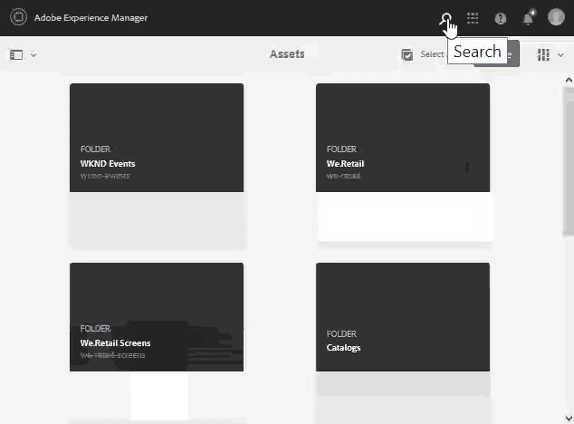

# Buscar recursos en [!DNL Adobe Experience Manager] {#search-assets-in-aem}

[!DNL Adobe Experience Manager Assets] proporciona métodos de detección de recursos sólidos que le ayudan a lograr una mayor velocidad de contenido. Sus equipos pueden reducir el tiempo de salida al mercado con una experiencia de búsqueda inteligente y sin fisuras mediante la funcionalidad lista para usar y los métodos personalizados. La búsqueda de recursos es fundamental para el uso de un sistema de gestión de activos digitales, ya sea para su uso ulterior por parte de los creativos, para una gestión sólida de los recursos por parte de los usuarios y especialistas en marketing del negocio o para la administración por parte de los administradores de DAM. Las búsquedas simples, avanzadas y personalizadas que puede realizar mediante la interfaz de usuario [!DNL Assets] u otras aplicaciones y superficies ayudan a cumplir estos casos de uso.

[!DNL Experience Manager Assets] admite los siguientes casos de uso y este artículo describe el uso, los conceptos, las configuraciones, las limitaciones y la resolución de problemas de estos casos de uso.

| Buscar recursos | Configuración y administración | Trabajar con resultados de búsqueda |
|---|---|---|
| [Búsquedas básicas](#searchbasics) | [Índice de búsqueda](#searchindex) | [Ordenar resultados](#sort) |
| [Comprender la IU de búsqueda](#searchui) | [Búsqueda visual o de similitudes](#configvisualsearch) | [Comprobar propiedades y metadatos de un recurso](#checkinfo) |
| [Sugerencias de búsqueda](#searchsuggestions) | [Metadatos obligatorios](#mandatorymetadata) | [Descargar](#download) |
| [Comprender los resultados y el comportamiento de la búsqueda](#searchbehavior) | [Modificar facetas de búsqueda](#searchfacets) | [Actualizaciones masivas de metadatos](#metadataupdates) |
| [Buscar clasificación y aumentar](#searchrank) | [Extracción de texto](#extracttextupload) | [Colecciones inteligentes](#collections) |
| [Búsqueda avanzada: filtrado y ámbito de búsqueda](#scope) | [Predicados personalizados](#custompredicates) | [Comprender y solucionar problemas relacionados con los resultados inesperados](#unexpectedresults) |
| [Buscar desde otras soluciones y aplicaciones](#beyondomnisearch):<ul><li>[Adobe Asset Link](#aal)</li><li>[Brand Portal](#brandportal)</li><li>[Aplicación de escritorio de Experience Manager](#desktopapp)</li><li>[Imágenes de Adobe Stock](#adobestock)</li><li>[Recursos de Dynamic Media](#dynamicmedia)</li></ul> |  |  |
| [Selector de recursos](#assetpicker) |  |  |
|  Limitaciones y  [sugerencias](#tips) |  |  |
| [Ejemplos ilustrados](#samples) |  |  |

Busque recursos utilizando el campo Omniture en la parte superior de la interfaz Web [!DNL Experience Manager]. Vaya a **[!UICONTROL Recursos]** > **[!UICONTROL Archivos]** en [!DNL Experience Manager], haga clic en  en la barra superior, introduzca la palabra clave de búsqueda y seleccione `Return`. Alternativamente, utilice el método abreviado de palabra clave `/` (barra diagonal) para abrir el campo Omnisearch. `Location:Assets` está preseleccionado para limitar las búsquedas a los recursos DAM. [!DNL Experience Manager] proporciona sugerencias a medida que el inicio escribe una palabra clave de búsqueda.

Utilice el panel **[!UICONTROL Filtros]** para buscar recursos, carpetas, etiquetas y metadatos. Puede filtrar los resultados de la búsqueda en función de las distintas opciones (predicados), como el tipo de archivo, el tamaño del archivo, la fecha de la última modificación, el estado del recurso, los datos de perspectivas y las licencias de Adobe Stock. Puede personalizar el panel Filtros y agregar o eliminar predicados de búsqueda mediante [facetas de búsqueda](/help/assets/search-facets.md). El filtro [!UICONTROL Tipo de archivo] del panel [!UICONTROL Filtros] tiene casillas de verificación de varios estados. Por lo tanto, a menos que seleccione todos los predicados anidados (o formatos), las casillas de verificación de primer nivel se marcan parcialmente.

[!DNL Experience Manager] la función de búsqueda admite la búsqueda de colecciones y la búsqueda de recursos dentro de una colección. Consulte [colecciones de búsqueda](/help/assets/manage-collections.md).

## Comprender la interfaz de búsqueda {#searchui}

Familiarícese con la interfaz de búsqueda y las acciones disponibles.

*Figura: Comprender la interfaz de resultados  [!DNL Experience Manager Assets] de búsqueda.*

**A.** Guarde la búsqueda como una colección inteligente. **B.** Filtros o predicados para reducir los resultados de búsqueda. **C.** Mostrar archivos, carpetas o ambos. **D.** Haga clic en Filtros para abrir o cerrar el carril izquierdo. **E.** La ubicación de búsqueda es DAM. **F. Campo** Omnisearch con palabra clave de búsqueda proporcionada por el usuario. **G.** Seleccione los resultados de búsqueda cargados. **H.** Número de resultados de búsqueda mostrados del total de resultados de búsqueda. **I.** Cierre la búsqueda. **J.** Cambie entre la vista de la tarjeta y la vista de la lista.

### Facetas de búsqueda dinámica {#dynamicfacets}

Puede descubrir los recursos deseados más rápido desde la página de resultados de búsqueda utilizando el número de resultados de búsqueda esperados que se ha actualizado dinámicamente en las facetas de búsqueda. El número esperado de recursos se actualiza incluso antes de aplicar el filtro de búsqueda. Ver el recuento esperado con el filtro le ayuda a navegar por los resultados de búsqueda de manera rápida y eficiente.

*Figura: Ver el número aproximado de recursos sin filtrar los resultados de búsqueda en las facetas de búsqueda.*

## Comprender los resultados y el comportamiento de la búsqueda {#searchbehavior}

### Términos y resultados de búsqueda básicos {#searchbasics}

Puede ejecutar búsquedas de palabras clave desde el campo OmniSearch. La búsqueda de palabras clave no distingue entre mayúsculas y minúsculas y es una búsqueda de texto completo (en los campos de metadatos populares). Si se utiliza más de una palabra clave, `AND` es el operador predeterminado entre las palabras clave.

Los resultados se ordenan por relevancia, empezando por las coincidencias más cercanas. Para varias palabras clave, los resultados más relevantes son los recursos que contienen ambos términos en sus metadatos. Dentro de los metadatos, las palabras clave que aparecen como etiquetas inteligentes se clasifican más que las palabras clave que aparecen en otros campos de metadatos. [!DNL Experience Manager] permite dar un mayor peso a un término de búsqueda particular. Además, es posible [aumentar la clasificación](#searchrank) de algunos recursos de destino para términos de búsqueda específicos.

Para encontrar rápidamente los recursos relevantes, la interfaz enriquecida proporciona mecanismos de filtrado, clasificación y selección. Puede filtrar los resultados en función de varios criterios y ver el número de recursos buscados para varios filtros. De lo contrario, puede volver a ejecutar la búsqueda cambiando la consulta en el campo Omniture Search. Al cambiar los términos o filtros de búsqueda, los demás filtros permanecen aplicados para preservar el contexto de búsqueda.

Cuando los resultados son muchos recursos, [!DNL Experience Manager] muestra los primeros 100 en la vista de tarjeta y los 200 en la vista de lista. A medida que los usuarios se desplazan, se cargan más recursos. Esto sirve para mejorar el rendimiento. Vea una demostración en vídeo del [número de recursos mostrados](https://www.youtube.com/watch?v=LcrGPDLDf4o).

A veces, puede ver algunos recursos inesperados en los resultados de búsqueda. Para obtener más información, consulte [resultados inesperados](#troubleshoot-unexpected-search-results-and-issues).

[!DNL Experience Manager] Puede buscar muchos formatos de archivo y los filtros de búsqueda se pueden personalizar para adaptarlos a sus necesidades comerciales. Póngase en contacto con el administrador para saber qué opciones de búsqueda están disponibles para el repositorio de DAM y qué restricciones tiene su cuenta.

### Resultados con y sin etiquetas inteligentes mejoradas {#withsmarttags}

De forma predeterminada, la búsqueda [!DNL Experience Manager] combina los términos de búsqueda con una cláusula AND. Por ejemplo: considere la búsqueda de palabras clave mujer en ejecución. De forma predeterminada, en los resultados de la búsqueda solo aparecen los recursos con palabras clave principales y las palabras clave en ejecución en los metadatos. El mismo comportamiento se mantiene cuando se utilizan caracteres especiales (puntos, subrayados o guiones) con las palabras clave. Las siguientes consultas de búsqueda devuelven los mismos resultados:

* `woman running`
* `woman.running`
* `woman-running`

Sin embargo, la consulta `woman -running` devuelve recursos sin `running` en sus metadatos.
El uso de etiquetas inteligentes agrega una cláusula `OR` adicional para encontrar cualquiera de los términos de búsqueda como las etiquetas inteligentes aplicadas. Un recurso etiquetado con `woman` o `running` mediante etiquetas inteligentes también aparece en una consulta de búsqueda de este tipo. Los resultados de la búsqueda son una combinación de:

* Recursos con palabras clave `woman` y `running` en los metadatos (comportamiento predeterminado).

* Recursos etiquetados de forma inteligente con cualquiera de las palabras clave (comportamiento de etiquetas inteligentes).

### Buscar sugerencias mientras escribe {#searchsuggestions}

Cuando inicio escribir palabras clave, [!DNL Experience Manager] sugiere las posibles palabras clave o frases de búsqueda. Las sugerencias se basan en los metadatos de los recursos existentes. [!DNL Experience Manager] indexa todos los campos de metadatos para facilitar la búsqueda. Para proporcionar sugerencias de búsqueda, el sistema utiliza los valores de los siguientes campos de metadatos. Para proporcionar sugerencias de búsqueda, considere rellenar los campos siguientes con palabras clave apropiadas:

* Etiquetas de recursos. (se asigna a `jcr:content/metadata/cq:tags`)
* Título del recurso. (se asigna a `jcr:content/metadata/dc:title`)
* Descripción del recurso. (se asigna a `jcr:content/metadata/dc:description`)
* Título en el repositorio de JCR. El valor puede asignarse al título del recurso. (se asigna a `jcr:content/jcr:title`)
* Descripción en el repositorio de JCR. El valor puede asignarse a la descripción del recurso. (se asigna a `jcr:content/jcr:description`)

Para recibir sugerencias para más de una palabra clave de búsqueda, siga escribiendo todas las palabras clave sin seleccionar ninguna sugerencia para una sola palabra clave.

*Figura: Escriba varias palabras clave para las sugerencias de vista que se ajustan a todas ellas.*

### Clasificación de búsqueda y aumento {#searchrank}

Los resultados de búsqueda que coinciden con todos los términos de búsqueda en los campos de metadatos se muestran primero, seguidos de los resultados de búsqueda que coinciden con cualquiera de los términos de búsqueda en las etiquetas inteligentes. En el ejemplo anterior, el orden aproximado de visualización de los resultados de búsqueda es:

1. Coincide con `woman running` en los distintos campos de metadatos.
1. Coincide con `woman running` en las etiquetas inteligentes.
1. Coincide con `woman` o con `running` en las etiquetas inteligentes.

Puede mejorar la relevancia de las palabras clave para los recursos en particular a fin de mejorar las búsquedas basadas en las palabras clave. En otras palabras, las imágenes para las que promociona palabras clave específicas aparecen en la parte superior de los resultados de búsqueda cuando realiza una búsqueda en base a estas palabras clave.

1. En la interfaz de usuario [!DNL Assets], abra la página de propiedades del recurso. Haga clic en **[!UICONTROL Avanzadas]** y haga clic en **[!UICONTROL Añadir]** en **[!UICONTROL Elevar para palabras clave de búsqueda]**.
1. En el cuadro **[!UICONTROL Promocionar búsqueda]**, especifique una palabra clave para la que desee impulsar la búsqueda de la imagen y haga clic en **[!UICONTROL Añadir]**. Puede especificar varias palabras clave de la misma manera.
1. Haga clic en **[!UICONTROL Guardar y cerrar]**. El recurso que promocionó para esta palabra clave aparece entre los principales resultados de búsqueda.

Esto se puede utilizar en su beneficio al aumentar la clasificación de algunos recursos en los resultados de búsqueda de la palabra clave de objetivo. Consulte el siguiente vídeo de ejemplo. Para obtener información detallada, consulte [buscar en [!DNL Experience Manager]](https://experienceleague.adobe.com/docs/experience-manager-learn/assets/search-and-discovery/search-boost.html).

>[!VIDEO](https://video.tv.adobe.com/v/16766/?quality=6)

*Vídeo: Comprender cómo se clasifican los resultados de búsqueda y cómo se puede influir en la clasificación.*

## Búsqueda avanzada {#scope}

[!DNL Experience Manager] proporciona varios métodos, como filtros que se aplican a los recursos buscados, para ayudarle a localizar los recursos deseados con mayor rapidez. A continuación se describen algunos de los métodos más utilizados. A continuación se comparten algunos [ejemplos ilustrados](#samples).

**Buscar archivos o carpetas**: En los resultados de la búsqueda, consulte archivos, carpetas o ambos. En el panel **[!UICONTROL Filtros]**, puede seleccionar la opción adecuada. Consulte [interfaz de búsqueda](#searchui).

**Buscar recursos dentro de una carpeta**: Puede limitar la búsqueda a una carpeta específica. En el panel **[!UICONTROL Filtros]**, agregue la ruta de una carpeta. Solo puede seleccionar una carpeta a la vez.

*Figura: Para limitar los resultados de la búsqueda a una carpeta, agregue una ruta de carpeta en el panel Filtros.*

### Buscar imágenes similares {#visualsearch}

Para buscar imágenes que sean visualmente similares a una imagen seleccionada por el usuario, haga clic en la opción **[!UICONTROL Buscar similares]** en la vista de tarjeta de una imagen o en la barra de herramientas. [!DNL Experience Manager] muestra las imágenes con etiquetas inteligentes del repositorio de DAM similares a una imagen seleccionada por el usuario. Consulte [cómo configurar la búsqueda por similitudes](#configvisualsearch).

*Figura: Busque imágenes similares con la opción de la vista de tarjeta.*

### Imágenes de Adobe Stock {#adobestock}

Desde la interfaz de usuario [!DNL Experience Manager], los usuarios pueden buscar [recursos de Adobe Stock](/help/assets/aem-assets-adobe-stock.md) y obtener licencias para los recursos necesarios. Añada `Location: Adobe Stock` en la barra de Omniture Search. También puede utilizar el panel Filtros para buscar todos los recursos con licencia o sin licencia o un recurso específico con el número de archivo de Adobe Stock.

### Recursos de Dynamic Media {#dmassets}

Puede filtrar imágenes de Dynamic Media seleccionando **[!UICONTROL Dynamic Media]** > **[!UICONTROL Conjuntos]** en el panel **[!UICONTROL Filtros]**. Filtra y muestra recursos como conjuntos de imágenes, carruseles, conjuntos de medios mixtos y conjuntos de giros.

### Buscar utilizando valores específicos en los campos de metadatos {#gqlsearch}

Puede buscar recursos en función de los valores exactos de campos de metadatos específicos como, por ejemplo, título, descripción y autor. La función de búsqueda de texto completo de GQL captura solo los recursos cuyo valor de metadatos coincida exactamente con la consulta de búsqueda. Los nombres de las propiedades (por ejemplo, autor, título, etc.) y los valores distinguen entre mayúsculas y minúsculas.

| Campo de metadatos | Valor y uso de faceta |
| ----------------------------------------- | ------------------------------------- |
| Título | title:John |
| Creador | creador:John |
| Lugar de residencia | ubicación:NA |
| Descripción | description:&quot;Imagen de muestra&quot; |
| Herramienta Creador | creatortool:&quot;Adobe Photoshop CC 2020&quot; |
| Propietario del copyright | copyrightowner:&quot;Adobe Systems&quot; |
| Colaborador | colaborador:John |
| Condiciones de uso | usageterms:&quot;CopyRights Reserved&quot; |
| Creado | creado:AAAA-MM-DDTHH |
| Caduca la fecha | expira:AAAA-MM-DDTHH |
| A tiempo | ontime:AAAA-MM-DDTHH |
| Tiempo de inactividad | offtime:AAAA-MM-DDTHH |
| Intervalo de tiempo (caduca dateontime, offtime) | campo faceta: límite inferior..upperbound |
| Ruta | /content/dam/&lt;nombre de carpeta> |
| Título del PDF | pdftitle:&quot;Documento de Adobe&quot; |
| Asunto | asunto: &quot;Formación&quot; |
| Etiquetas | etiquetas: &quot;Ubicación y viaje&quot; |
| Tipo | type:&quot;image\png&quot; |
| Anchura de la imagen | anchura:límite inferior..upperbound |
| Altura de la imagen | altura:límite inferior..upperbound |
| Person | persona:John |

Las propiedades `path`, `limit`, `size` y `orderby` no se pueden combinar con el operador `OR` con ninguna otra propiedad.

La palabra clave para una propiedad generada por el usuario es su etiqueta de campo en el editor de propiedades en minúsculas, con espacios eliminados.

Estos son algunos ejemplos de formatos de búsqueda para consultas complejas:

* Para mostrar todos los recursos con varios campos de facetas (por ejemplo: title=John Doe y la herramienta de creación = Adobe Photoshop): `title:"John Doe" creatortool:Adobe*`
* Para mostrar todos los recursos cuando el valor de facetas no es una sola palabra sino una frase (por ejemplo: title=Scott Reynolds): `title:"Scott Reynolds"`
* Para mostrar recursos con varios valores de una sola propiedad (por ejemplo: title=Scott Reynolds o John Doe): `title:"Scott Reynolds" OR "John Doe"`
* Para mostrar recursos con valores de propiedad que empiecen por una cadena específica (por ejemplo: el título es Scott Reynolds): `title:Scott*`
* Para mostrar recursos con valores de propiedad que finalizan con una cadena específica (por ejemplo: el título es Scott Reynolds): `title:*Reynolds`
* Para mostrar recursos con un valor de propiedad que contenga una cadena específica (por ejemplo: título = Sala de reuniones de Basilea): `title:*Meeting*`
* Para mostrar los recursos que contienen una cadena concreta y tienen un valor de propiedad específico (por ejemplo: buscar Adobe de cadena en recursos con título=John Doe): `*Adobe* title:"John Doe"`

## Buscar recursos de otras [!DNL Experience Manager] ofertas o interfaces {#beyondomnisearch}

[!DNL Adobe Experience Manager] conecta el repositorio de DAM con otras  [!DNL Experience Manager] soluciones para proporcionar un acceso más rápido a los recursos digitales y optimizar los flujos de trabajo creativos. Cualquier detección de recursos inicio con la exploración o búsqueda. El comportamiento de la búsqueda sigue siendo en gran medida el mismo en las distintas superficies y soluciones. Algunos métodos de búsqueda cambian a medida que la audiencia de destinatario, los casos de uso y la interfaz de usuario varían según las soluciones [!DNL Experience Manager]. Los métodos específicos están documentados para las soluciones individuales en los vínculos siguientes. Los consejos y comportamientos universalmente aplicables están documentados en este artículo.

### Buscar recursos desde el panel Vínculo de recursos de Adobe {#aal}

Al utilizar Adobe Asset Link, los profesionales creativos ahora pueden acceder al contenido almacenado en [!DNL Experience Manager Assets] sin tener que abandonar las aplicaciones de Adobe Creative Cloud admitidas. Los creativos pueden examinar, buscar, desproteger y proteger recursos sin problemas mediante el panel integrado en la aplicación de [!DNL Adobe Creative Cloud apps]: [!DNL Adobe Photoshop], [!DNL Adobe Illustrator] y [!DNL Adobe InDesign]. El vínculo de recursos también permite a los usuarios buscar resultados visualmente similares. Los resultados de la visualización de la búsqueda visual se basan en algoritmos de aprendizaje automático de Adobe Sensei y ayudan a los usuarios a encontrar imágenes estéticas similares. Consulte [búsqueda y exploración de recursos](https://helpx.adobe.com/enterprise/using/manage-assets-using-adobe-asset-link.html#UseAdobeAssetLink) mediante Adobe Asset Link.

### Buscar recursos en la aplicación de escritorio [!DNL Experience Manager] {#desktopapp}

Los profesionales creativos utilizan la aplicación de escritorio para que la [!DNL Experience Manager Assets] sea fácil de buscar y esté disponible en su escritorio local (Win o Mac). Los elementos creativos pueden revelar fácilmente los recursos deseados en Mac Finder o el Explorador de Windows, abrirlos en aplicaciones de escritorio y cambiarlos localmente; los cambios se guardan de nuevo en [!DNL Experience Manager] con una nueva versión creada en el repositorio. La aplicación admite búsquedas básicas mediante una o más palabras clave, `*` y `?` comodines y operador `AND`. Consulte [exploración, búsqueda y previsualización de recursos](https://experienceleague.adobe.com/docs/experience-manager-desktop-app/using/using.html#browse-search-preview-assets) en la aplicación de escritorio.

### Buscar recursos en [!DNL Brand Portal] {#brandportal}

Los usuarios de la línea de negocios y los especialistas en marketing utilizan Brand Portal para compartir de forma eficaz y segura los recursos digitales aprobados con sus equipos, socios y distribuidores internos ampliados. Consulte [Buscar recursos en Brand Portal](https://experienceleague.adobe.com/docs/experience-manager-brand-portal/using/search-capabilities/brand-portal-searching.html).

### Buscar [!DNL Adobe Stock] imágenes {#adobestock-1}

Desde la interfaz de usuario [!DNL Experience Manager], los usuarios pueden buscar recursos de Adobe Stock y obtener licencias para los recursos necesarios. Añada `Location: Adobe Stock` en el campo Omnisearch. También puede utilizar el panel **[!UICONTROL Filtros]** para buscar todos los recursos con licencia o sin licencia o un recurso específico con el número de archivo de Adobe Stock. Consulte [administración de imágenes de Adobe Stock en Experience Manager](/help/assets/aem-assets-adobe-stock.md#usemanage).

### Buscar recursos de Dynamic Media {#dynamicmedia}

Puede filtrar imágenes de Dynamic Media seleccionando **[!UICONTROL Dynamic Media]** > **[!UICONTROL Conjuntos]** en el panel **[!UICONTROL Filtros]**. Filtra y muestra recursos como conjuntos de imágenes, carruseles, conjuntos de medios mixtos y conjuntos de giros. Durante la creación de páginas web, los autores pueden buscar conjuntos desde el Buscador de contenido. Los filtros para conjuntos están disponibles en un menú emergente.

### Buscar recursos en Content Finder al crear páginas Web {#contentfinder}

Los autores pueden utilizar Content Finder para buscar en el repositorio de DAM los recursos relevantes y utilizar los recursos en las páginas web que crean. Los autores también pueden utilizar la funcionalidad Recursos conectados para buscar recursos disponibles en una implementación remota [!DNL Experience Manager]. Los autores pueden utilizar estos recursos en páginas web en una implementación local [!DNL Experience Manager]. Consulte [uso de recursos remotos](/help/assets/use-assets-across-connected-assets-instances.md#use-remote-assets).

### Buscar colecciones {#collections}

[!DNL Experience Manager] la función de búsqueda admite la búsqueda de colecciones y la búsqueda de recursos dentro de una colección. Consulte [colecciones de búsqueda](/help/assets/manage-collections.md).

## Selector de recursos {#assetpicker}

>[!NOTE]
>
>El selector de recursos se llamaba [selector de recursos](https://helpx.adobe.com/experience-manager/6-2/assets/using/asset-picker.html) en versiones anteriores de [!DNL Adobe Experience Manager].

El selector de recursos le permite examinar, buscar y filtrar recursos DAM de forma especial. Puede iniciar el selector de recursos en la instancia [!DNL Experience Manager] mediante `https://[aem-server]:[port]/aem/assetpicker.html`. Esta URL abre el selector de recursos en modo de exploración. Utilice los parámetros de solicitud admitidos como sufijo, como `mode` (selección única o múltiple) o `viewmode` con `assettype` (imagen, vídeo, texto) y `mimetype`. Estos parámetros establecen el contexto del selector de recursos para una instancia de búsqueda en particular y permanecen intactos durante toda la selección. También puede recuperar los metadatos de los recursos seleccionados mediante esta funcionalidad.

El selector de recursos utiliza el mensaje HTML5 `Window.postMessage` para enviar datos del recurso seleccionado al destinatario. Funciona solamente en el modo de exploración y sólo con la página de resultados de Omniture Search.

Pase los siguientes parámetros de solicitud en una URL para iniciar el selector de recursos en un contexto concreto:

| Nombre | Valores | Ejemplo | Función |
|---|---|---|---|
| sufijo de recurso (B) | Ruta de la carpeta como sufijo del recurso en la dirección URL:[https://localhost:4502/aem/assetpicker.html/&lt;ruta_de_carpeta>](https://localhost:4502/aem/assetpicker.html) | Para iniciar el selector de recursos con una carpeta concreta seleccionada, por ejemplo con la carpeta `/content/dam/we-retail/en/activities` seleccionada, la dirección URL debe tener el formato: [https://localhost:4502/aem/assetpicker.html/content/dam/we-retail/en/activities?assettype=images](https://localhost:4502/aem/assetpicker.html/content/dam/we-retail/en/activities?assettype=images) | Si necesita que se seleccione una carpeta determinada cuando se inicie el selector de recursos, pasarla como sufijo de recurso. |
| modo | único, múltiple | <ul><li>[https://localhost:4502/aem/assetpicker.html?mode=single](https://localhost:4502/aem/assetpicker.html?mode=single)</li><li>[https://localhost:4502/aem/assetpicker.html?mode=multiple](https://localhost:4502/aem/assetpicker.html?mode=multiple)</li></ul> | En varios modos, puede seleccionar varios recursos simultáneamente mediante el selector de recursos. |
| el cuadro de diálogo | true, false | [https://localhost:4502/aem/assetpicker.html?dialog=true](https://localhost:4502/aem/assetpicker.html?dialog=true) | Utilice estos parámetros para abrir el selector de recursos como cuadro de diálogo Granito. Esta opción solo se aplica cuando se inicia el selector de recursos mediante Campo de ruta de granito y se configura como URL de pickerSrc. |
| raíz | &lt;folder_path> | [https://localhost:4502/aem/assetpicker.html?assettype=images&amp;root=/content/dam/we-retail/en/activities](https://localhost:4502/aem/assetpicker.html?assettype=images&amp;root=/content/dam/we-retail/en/activities) | Utilice esta opción para especificar la carpeta raíz del selector de recursos. En este caso, el selector de recursos permite seleccionar solo recursos secundarios (directos/indirectos) en la carpeta raíz. |
| viewmode | búsqueda |  | Para iniciar el selector de recursos en modo de búsqueda, con los parámetros assettype y mimetype. |
| assettype | imágenes, documentos, multimedia, archivos | <ul><li>[https://localhost:4502/aem/assetpicker.html?viewmode=search&amp;assettype=images](https://localhost:4502/aem/assetpicker.html?viewmode=search&amp;assettype=images)</li><li>[https://localhost:4502/aem/assetpicker.html?viewmode=search&amp;assettype=documents](https://localhost:4502/aem/assetpicker.html?assettype=documents)</li><li>[https://localhost:4502/aem/assetpicker.html?viewmode=search&amp;assettype=multimedia](https://localhost:4502/aem/assetpicker.html?viewmode=search&amp;assettype=multimedia)</li><li>[https://localhost:4502/aem/assetpicker.html?viewmode=search&amp;assettype=archives](https://localhost:4502/aem/assetpicker.html?viewmode=search&amp;assettype=archives)</li></ul> | Utilice esta opción para filtrar los tipos de recursos en función del valor pasado. |
| mimetype | mimetype(s) (`/jcr:content/metadata/dc:format`) de un recurso (también se admite el comodín) | <ul><li>[https://localhost:4502/aem/assetpicker.html?viewmode=search&amp;mimetype=image/png](https://localhost:4502/aem/assetpicker.html?viewmode=search&amp;mimetype=image/png)</li><li>[https://localhost:4502/aem/assetpicker.html?viewmode=search&amp;mimetype=*png](https://localhost:4502/aem/assetpicker.html?viewmode=search&amp;mimetype=*png)</li><li>[https://localhost:4502/aem/assetpicker.html?viewmode=search&amp;mimetype=*presentation](https://localhost:4502/aem/assetpicker.html?viewmode=search&amp;mimetype=*presentation)</li><li>[https://localhost:4502/aem/assetpicker.html?viewmode=search&amp;mimetype=*presentation&amp;mimetype=*png](https://localhost:4502/aem/assetpicker.html?viewmode=search&amp;mimetype=*presentation&amp;mimetype=*png)</li></ul> | Utilícelo para filtrar recursos en función de tipos MIME |

Para acceder a la interfaz del selector de recursos, vaya a `https://[aem_server]:[port]/aem/assetpicker`. Vaya a la carpeta que desee y seleccione uno o varios recursos. También puede buscar el recurso deseado en el cuadro Omniture, aplicar el filtro según sea necesario y luego seleccionarlo.

*Figura: Busque y seleccione un recurso en el selector de recursos.*

## Restricciones     {#limitations}

La capacidad de búsqueda en [!DNL Experience Manager Assets] tiene las siguientes limitaciones:

* No introduzca un espacio de interlineado en la consulta de búsqueda; de lo contrario, la búsqueda no funcionará.
* [!DNL Experience Manager] puede seguir mostrando el término de búsqueda después de seleccionar las propiedades de un recurso en los resultados de búsqueda y luego cancelar la búsqueda.  <!-- (CQ-4273540) -->
* Al buscar carpetas o archivos y carpetas, los resultados de la búsqueda no se pueden ordenar según ningún parámetro.
* Si selecciona `Return` sin escribir en la barra de Omniture, [!DNL Experience Manager] devuelve una lista de sólo archivos y no carpetas. Si busca carpetas específicamente sin usar una palabra clave, [!DNL Experience Manager] no devuelve ningún resultado.

La búsqueda visual o la búsqueda por similitudes tienen las siguientes limitaciones:

* La búsqueda visual funciona mejor con repositorios más grandes. Aunque no se requiere un número mínimo de imágenes para obtener buenos resultados, la calidad de las coincidencias con unas pocas imágenes puede no ser tan buena como las coincidencias de un repositorio grande.
* No puede cambiar el modelo o el tren [!DNL Experience Manager] para encontrar imágenes similares. Por ejemplo, la adición o eliminación de etiquetas inteligentes a algunos recursos no cambia el modelo. Los recursos se excluyen de los resultados de búsqueda visualmente similares.

La funcionalidad de búsqueda puede tener limitaciones de rendimiento en los siguientes escenarios:

* La vista de tarjetas tiene un tiempo de carga más rápido que la vista de listas para mostrar los resultados de la búsqueda.

## Sugerencias de búsqueda {#tips}

* Cuando supervise el estado de revisión de los recursos, utilice la opción adecuada para encontrar los recursos aprobados o los que están pendientes de aprobación.
* Use el predicado de perspectivas para buscar recursos admitidos en función de las estadísticas de uso obtenidas de varias aplicaciones de Creative. Los datos de uso se agrupan en Puntuación de uso, Impresiones, Clics y canales de medios, donde los recursos aparecen como categorías.
* Utilice la casilla de verificación **[!UICONTROL Seleccionar todo]** para seleccionar los recursos buscados. [!DNL Experience Manager] inicialmente muestra 100 recursos en la vista de tarjetas y 200 en la vista de listas. Se cargan más recursos a medida que se desplazan los resultados de la búsqueda. Puede seleccionar más recursos que los recursos cargados. El recuento de los recursos seleccionados se muestra en la esquina superior derecha de la página de resultados de la búsqueda. Puede operar en la selección, por ejemplo, descargar los recursos seleccionados, actualizar las propiedades de metadatos de forma masiva para los recursos seleccionados o agregar los recursos seleccionados a una colección. Cuando se seleccionan más recursos de los que se muestran, se aplica una acción a todos los recursos seleccionados o aparece un cuadro de diálogo con el número de recursos en los que se aplica. Para aplicar una acción a los recursos que no se han cargado, asegúrese de que todos los recursos están explícitamente seleccionados.
* Para buscar recursos que no contengan los metadatos obligatorios, consulte [metadatos obligatorios](#mandatorymetadata).
* La búsqueda utiliza todos los campos de metadatos. Una búsqueda genérica, como la búsqueda de 12, generalmente devuelve muchos resultados. Para obtener mejores resultados, utilice comillas de doble (no simples) o asegúrese de que el número esté contiguo a una palabra sin carácter especial (por ejemplo, `shoe12`).
* La búsqueda de texto completo admite operadores como `-` y `^`. Para buscar estas letras como literales de cadena, encierre la expresión de búsqueda entre comillas de doble. Por ejemplo, utilice `"Notebook - Beauty"` en lugar de `Notebook - Beauty`.
* Si los resultados de búsqueda son demasiados, limite el [ámbito de búsqueda](#scope) a cero en los recursos deseados. Funciona mejor cuando tiene alguna idea de cómo buscar mejor los recursos deseados, por ejemplo, un tipo de archivo específico, una ubicación específica, metadatos específicos, etc.

* **Etiquetado**: Las etiquetas le ayudan a categorizar los recursos que se pueden explorar y buscar de forma más eficaz. El etiquetado ayuda a propagar la taxonomía adecuada a otros usuarios y flujos de trabajo. [!DNL Experience Manager] oferta métodos para etiquetar automáticamente los recursos mediante Adobe Sensei, que  servicios inteligentes artificialmente que mejoran el etiquetado de los recursos con uso y formación. Cuando se buscan recursos, las etiquetas inteligentes se incluyen si la función está activada en la cuenta. Funciona junto con la funcionalidad de búsqueda integrada. Consulte [comportamiento de búsqueda](#searchbehavior). Para optimizar el orden en que se muestran los resultados de búsqueda, puede [aumentar la clasificación de búsqueda](#searchrank) de unos pocos recursos seleccionados.

* **Indexación**: En los resultados de búsqueda solo se devuelven los metadatos y recursos indexados. Para obtener una mejor cobertura y rendimiento, asegúrese de que la indexación sea correcta y siga las optimizaciones. Consulte [indexación](#searchindex).

* Para excluir recursos específicos de los resultados de búsqueda, utilice la propiedad `excludedPath` en el índice de Lucene.

## Algunos ejemplos que ilustran la búsqueda {#samples}

Utilice las comillas de doble alrededor de las palabras clave para buscar recursos que contengan la frase exacta en el orden exacto especificado por el usuario.

*Figura: Comportamiento de búsqueda con y sin comillas.*

**Buscar con comodín** asterisco: Para ampliar la búsqueda, utilice un asterisco antes o después de la palabra de búsqueda para que coincida con cualquier número de caracteres. Por ejemplo, al buscar una ejecución sin un asterisco, no se devuelven recursos que contengan ninguna variación de la palabra (incluidos los metadatos). Un asterisco sustituye a cualquier número de caracteres. Por ejemplo,

* `run` devuelve recursos con la palabra clave de ejecución exacta
* `run*` devuelve recursos con ejecución, ejecución, ejecución, etc.
* `*run` devuelve outrun, reejecutar, etc.
* `*run*` devuelve todas las combinaciones posibles.

*Figura: Ilustración del uso de caracteres comodín de asterisco en la búsqueda de recursos mediante un ejemplo.*

**Buscar con comodín** de signo de interrogación: Para ampliar la búsqueda, utilice uno o varios &#39;?&#39; caracteres para que coincidan con el número exacto de caracteres. Por ejemplo, en la siguiente ilustración,

* `run???` La consulta no coincide con ningún recurso.

* `run????` La consulta coincide con la palabra  `running` con cuatro caracteres después  `run`.

* `??run` La consulta coincide con la palabra  `rerun` con dos caracteres anteriores  `run`.

*Figura: Ilustración del uso del comodín del signo de interrogación en la búsqueda de recursos mediante un ejemplo.*

**Excluir una palabra clave**: Utilice dash para buscar recursos que no contengan una palabra clave. Por ejemplo, la consulta `running -shoe` devuelve recursos que contienen `running`, pero no `shoe`. De manera similar, la consulta `camp -night` devuelve recursos que contienen `camp` pero no `night`. La consulta `camp-night` devuelve recursos que contienen `camp` y `night`.

*Figura: Uso del guión para buscar recursos que no contengan una palabra clave excluida.*

## Tareas de configuración y administración relacionadas con la funcionalidad de búsqueda {#configadmin}

### Configuraciones de índice de búsqueda {#searchindex}

La detección de recursos depende de la indexación del contenido de DAM, incluidos los metadatos. La detección de recursos más rápida y precisa depende de la indexación optimizada y de las configuraciones adecuadas. Consulte [índice de búsqueda](/help/assets/performance-tuning-guidelines.md#search-indexes), [consultas de roble e indexación](/help/sites-deploying/queries-and-indexing.md) y [prácticas recomendadas](/help/sites-deploying/best-practices-for-queries-and-indexing.md).

Para excluir recursos específicos de los resultados de búsqueda, utilice la propiedad `excludedPath` en el índice de Lucene.

### Búsqueda visual o de similitudes {#configvisualsearch}

La búsqueda visual utiliza etiquetado inteligente y requiere [!DNL Experience Manager] 6.5.2.0 o posterior. Después de configurar la funcionalidad de etiquetado inteligente, siga estos pasos:

1. En [!DNL Experience Manager] CRXDE, en el nodo `/oak:index/lucene`, agregue las siguientes propiedades y valores y guarde los cambios.

   * `costPerEntry` propiedad de tipo  `Double` con el valor  `10`.
   * `costPerExecution` propiedad de tipo  `Double` con el valor  `2`.
   * `refresh` propiedad de tipo  `Boolean` con el valor  `true`.

   Esta configuración permite realizar búsquedas desde el índice apropiado.

1. Para crear un índice de Lucene, en CRXDE, en `/oak:index/damAssetLucene/indexRules/dam:Asset/properties`, cree un nodo denominado `imageFeatures` de tipo `nt-unstructured`. En el nodo `imageFeatures`,

   * Añada la propiedad `name` del tipo `String` con el valor `jcr:content/metadata/imageFeatures/haystack0`.
   * Añada la propiedad `nodeScopeIndex` del tipo `Boolean` con el valor `true`.
   * Añada la propiedad `propertyIndex` del tipo `Boolean` con el valor `true`.
   * Añada la propiedad `useInSimilarity` del tipo `Boolean` con el valor `true`.

   Guarde los cambios.

1. Acceda a `/oak:index/damAssetLucene/indexRules/dam:Asset/properties/predictedTags` y agregue la propiedad `similarityTags` de tipo `Boolean` con el valor `true`.
1. Aplique etiquetas inteligentes a los recursos del repositorio [!DNL Experience Manager].
1. En CRXDE, en el nodo `/oak-index/damAssetLucene`, establezca la propiedad `reindex` en `true`. Guarde los cambios.
1. (Opcional) Si tiene un formulario de búsqueda personalizado, copie el nodo `/libs/settings/dam/search/facets/assets/jcr%3Acontent/items/similaritysearch` en `/conf/global/settings/dam/search/facets/assets/jcr:content/items`. Guarde los cambios.

Para obtener información relacionada, consulte [comprensión de las etiquetas inteligentes en Experience Manager](https://experienceleague.adobe.com/docs/experience-manager-learn/assets/metadata/image-smart-tags.html) y [cómo administrar las etiquetas inteligentes](/help/assets/enhanced-smart-tags.md).

>[!CAUTION]
>
>Si la indexación de Lucene se realiza a partir de [!DNL Adobe Experience Manager], la búsqueda basada en etiquetas inteligentes no funciona de la manera esperada.

### Metadatos obligatorios {#mandatorymetadata}

Los usuarios comerciales, administradores o bibliotecarios de DAM pueden definir algunos metadatos como metadatos obligatorios que son indispensables para que funcionen los procesos empresariales. Por varios motivos, es posible que algunos recursos no tengan estos metadatos, como recursos heredados o recursos migrados de forma masiva. Los recursos con metadatos que faltan o no son válidos se detectan y generan informes en función de la propiedad de metadatos indizados. Para configurarlo, consulte [metadatos obligatorios](/help/assets/metadata-schemas.md#define-mandatory-metadata).

### Modificar facetas de búsqueda {#searchfacets}

Para mejorar la velocidad de descubrimiento, [!DNL Experience Manager Assets] oferta las facetas de búsqueda mediante las cuales puede filtrar los resultados de búsqueda. El panel Filtros incluye algunas facetas estándar de forma predeterminada. Los administradores pueden personalizar el panel Filtros para modificar las facetas predeterminadas mediante los predicados integrados. [!DNL Experience Manager] proporciona una buena colección de predicados integrados y un editor para personalizar las facetas. Consulte [facetas de búsqueda](/help/assets/search-facets.md).

### Extraer texto al cargar recursos {#extracttextupload}

Puede configurar [!DNL Experience Manager] para extraer el texto de los recursos cuando los usuarios cargan recursos, como archivos PSD o PDF. [!DNL Experience Manager] indexa el texto extraído y ayuda a los usuarios a buscar estos recursos en función del texto extraído. Consulte [carga de recursos](/help/assets/manage-assets.md#uploading-assets).

Si la extracción de texto consume demasiados recursos para la implementación, considere [desactivar la extracción de texto](https://helpx.adobe.com/experience-manager/kb/Disable-binary-text-extraction-to-optimize-Lucene-indexing-AEM.html).

### Predicados personalizados para filtrar los resultados de búsqueda {#custompredicates}

Los predicados se utilizan para crear facetas. Los administradores pueden personalizar las facetas de búsqueda en el panel Filtros mediante predicados preconfigurados. Estos predicados se pueden personalizar mediante superposiciones. Consulte [creación de predicados personalizados](/help/assets/searchx.md).

Puede buscar recursos digitales en función de una o varias de las siguientes propiedades. Los filtros que se aplican a algunas de estas propiedades están disponibles de forma predeterminada y otros filtros se pueden crear personalizados para aplicarlos a otras propiedades.

| Campo de búsqueda | Valores de propiedades de búsqueda |
|-----------------|----------------------------------------------------------------------------------------------------------------------------------------|
| Tipos MIME | Imágenes, Documentos, Multimedia, Archivos u Otros. |
| Última modificación | Hora, día, semana, mes o año. |
| Tamaño del archivo | Pequeño, Medio o Grande. |
| Estado de publicación | Publicado o sin publicar. |
| Estado aprobado | Aprobado o Rechazado. |
| Orientación | Horizontal, Vertical o Cuadrado. |
| Estilo | Color o Blanco y negro. |
| Altura del vídeo | Especificado como valor mínimo y máximo. El valor se almacena únicamente en los metadatos de las representaciones de vídeo. |
| Anchura del vídeo | Especificado como valor mínimo y máximo. El valor se almacena únicamente en los metadatos de las representaciones de vídeo. |
| Formato de vídeo | DVI, Flash, MPEG4, MPEG, OGG Theora, QuickTime, Windows Media. El valor se almacena en los metadatos del vídeo de origen y en cualquier representación. |
| Códec de vídeo | x264. El valor se almacena únicamente en los metadatos de las representaciones de vídeo. |
| Velocidad de bits de vídeo | Especificado como valor mínimo y máximo. El valor se almacena únicamente en los metadatos de las representaciones de vídeo. |
| Códec de audio | Libvorbis, Lame MP3, AAC Encoding. El valor se almacena únicamente en los metadatos de las representaciones de vídeo. |
| Velocidad de bits de audio | Especificado como valor mínimo y máximo. El valor se almacena únicamente en los metadatos de las representaciones de vídeo. |

## Trabajar con resultados de búsqueda de recursos {#aftersearch}

Puede hacer lo siguiente con los recursos que ha buscado en [!DNL Experience Manager]:

* Propiedades de metadatos de vista y otra información.
* Descargue uno o varios recursos.
* Utilice las acciones de escritorio para abrir estos recursos en la aplicación de escritorio.
* Cree colecciones inteligentes.

### Ordenar resultados de búsqueda {#sort}

Ordene los resultados de la búsqueda para descubrir los recursos necesarios con mayor rapidez. Puede ordenar los resultados de la búsqueda únicamente cuando selecciona **[[!UICONTROL Archivos]](#searchui)** en el panel **[!UICONTROL Filtros]**. [!DNL Assets] utiliza la ordenación del lado del servidor para ordenar rápidamente todos los recursos (aunque sean muchos) de una carpeta o los resultados de una consulta de búsqueda. La ordenación del lado del servidor proporciona resultados más rápidos y precisos que la ordenación del lado del cliente.

Puede ordenar los resultados de la búsqueda del mismo modo que puede ordenar los recursos en cualquier carpeta. La ordenación funciona en estas columnas: nombre, título, estado, Dimension, tamaño, clasificación, uso, (fecha) de creación, (fecha) de modificación, (fecha) de publicación, flujo de trabajo y desprotección.

Para ver las limitaciones de la funcionalidad de ordenación, consulte [limitaciones](#limitations).

### Comprobar información detallada de un recurso {#checkinfo}

Puede comprobar la información detallada de los recursos buscados desde la página de resultados de la búsqueda.

Para ver todos los metadatos de un recurso, selecciónelo y haga clic en **[!UICONTROL propiedades]** en la barra de herramientas.

Para comprobar los comentarios de un recurso o del historial de versiones de un recurso, haga clic en el recurso y abrirá una vista previa de gran tamaño. Abra la cronología en el carril izquierdo y seleccione **[!UICONTROL Comentarios]** o **[!UICONTROL Versiones]**. También puede ordenar la actividad de la cronología como comentarios o versiones en orden cronológico.

*Figura: Ordene las entradas de línea de tiempo para un recurso de búsqueda.*

### Descargar recursos buscados {#download}

Puede descargar los recursos buscados y sus representaciones del mismo modo que descarga los recursos normales de las carpetas. Seleccione uno o varios recursos en los resultados de búsqueda y haga clic en **[!UICONTROL Descargar]** en la barra de herramientas.

### Propiedades de metadatos de actualización masiva {#metadataupdates}

Es posible realizar actualizaciones masivas en los campos de metadatos comunes de varios recursos. En los resultados de la búsqueda, seleccione uno o varios recursos. Haga clic en **[!UICONTROL Propiedades]** en la barra de herramientas y actualice los metadatos según sea necesario. Haga clic en **[!UICONTROL Guardar y cerrar]** cuando termine. Los metadatos existentes anteriormente en los campos actualizados se sobrescriben.

Para los recursos disponibles en una sola carpeta o colección, es más fácil [actualizar los metadatos de forma masiva](/help/assets/metadata.md) sin utilizar la funcionalidad de búsqueda. Para los recursos que están disponibles en varias carpetas o que cumplen un criterio común, es más rápido actualizar los metadatos de forma masiva mediante la búsqueda.

### Colecciones inteligentes {#smart-collections}

Una colección es un conjunto ordenado de recursos que puede incluir recursos de distintas ubicaciones porque las colecciones solo contienen referencias a estos recursos. Las colecciones son de los dos tipos siguientes:

* Una lista de referencia estática de recursos, carpetas y otras colecciones.
* Lista dinámica (colección inteligente) que rellena los recursos de la colección en función de criterios de búsqueda.

Puede crear colecciones inteligentes basadas en los criterios de búsqueda. En el panel **[!UICONTROL Filtros]**, seleccione **[!UICONTROL Archivos]** y haga clic en **[!UICONTROL Guardar colección inteligente]**. Consulte [Gestión de colecciones](/help/assets/manage-collections.md).

## Resultados y problemas de búsqueda inesperados {#unexpectedresults}

| Error, problemas, síntomas | Motivo posible | Posible solución o comprensión del problema |
|---|---|---|
| Resultados incorrectos al buscar recursos con metadatos que faltan. | Al buscar recursos que no tienen los metadatos obligatorios, [!DNL Experience Manager] puede mostrar algunos recursos que tienen metadatos válidos. Los resultados se basan en la propiedad de metadatos indexados. | Una vez actualizados los metadatos, es necesario volver a indexarlos para reflejar el estado correcto de los metadatos de los recursos. Consulte [metadatos obligatorios](metadata-schemas.md#define-mandatory-metadata). |
| Demasiados resultados de búsqueda. | Parámetro de búsqueda amplia. | Considere limitar el [ámbito de búsqueda](#scope). El uso de etiquetas inteligentes puede proporcionarle más resultados de búsqueda de los esperados. Consulte [comportamiento de búsqueda con etiquetas inteligentes](#withsmarttags). |
| Resultados de búsqueda no relacionados o parcialmente relacionados. | El comportamiento de búsqueda cambia con el etiquetado inteligente. | Comprender [cómo cambia la búsqueda después del etiquetado inteligente](#withsmarttags). |
| No hay sugerencias de autocompletar para los recursos. | Los recursos recién cargados no se han indizado todavía. Los metadatos no están disponibles de inmediato como sugerencias cuando se inicio escribir una palabra clave de búsqueda en la barra de Omniture. | [!DNL Assets] espera hasta la expiración de un período de tiempo de espera (una hora de forma predeterminada) antes de ejecutar un trabajo en segundo plano para indexar los metadatos de todos los recursos cargados o actualizados recientemente y, a continuación, agrega los metadatos a la lista de sugerencias. |
| No hay resultados de la búsqueda. | <ul><li>Los recursos que coinciden con la consulta no existen. </li><li> Se agregó espacio en blanco antes de la consulta de búsqueda. </li><li> El campo de metadatos no admitido contiene la palabra clave que buscó.</li><li> Búsqueda realizada durante el tiempo de inactividad de un recurso. </li></ul> | <ul><li>Buscar usando una palabra clave diferente. También puede utilizar el etiquetado inteligente o la búsqueda por similitudes para mejorar los resultados de la búsqueda. </li><li>[Limitaciones](#limitations) conocidas.</li><li>No se tienen en cuenta todos los campos de metadatos para las búsquedas. Consulte [ámbito](#scope).</li><li>Busque más tarde o modifique los recursos necesarios a tiempo y sin conexión.</li></ul> |
| El filtro de búsqueda o un predicado no está disponible. | <ul><li>El filtro de búsqueda no está configurado.</li><li>No está disponible para su inicio de sesión.</li><li>(Menos probable) Las opciones de búsqueda no están personalizadas en la implementación que esté utilizando.</li></ul> | <ul><li>Póngase en contacto con el administrador para comprobar si las personalizaciones de búsqueda están disponibles o no.</li><li>Póngase en contacto con el administrador para comprobar si su cuenta tiene los privilegios y permisos necesarios para utilizar la personalización.</li><li>Póngase en contacto con el administrador y compruebe las personalizaciones disponibles para la implementación [!DNL Assets] que está utilizando.</li></ul> |
| Al buscar imágenes visualmente similares, falta una imagen esperada. | <ul><li>La imagen no está disponible en [!DNL Experience Manager].</li><li>La imagen no está indizada. Normalmente, cuando se carga recientemente.</li><li>La imagen no está etiquetada de forma inteligente.</li></ul> | <ul><li>Añada la imagen a [!DNL Assets].</li><li>Póngase en contacto con el administrador para volver a indexar el repositorio. Además, asegúrese de que está utilizando el índice adecuado.</li><li>Póngase en contacto con el administrador para etiquetar los recursos relevantes de forma inteligente.</li></ul> |
| Al buscar imágenes visualmente similares, se muestra una imagen irrelevante. | Comportamiento de búsqueda visual. | [!DNL Experience Manager] muestra tantos recursos potencialmente relevantes como sea posible. Las imágenes menos relevantes, si las hay, se agregan a los resultados pero con una clasificación de búsqueda más baja. La calidad de las coincidencias y la relevancia de los recursos buscados disminuyen a medida que se desplaza hacia abajo por los resultados de la búsqueda. |
| Al seleccionar y operar en los resultados de búsqueda, no se realizan operaciones con todos los recursos buscados. | La opción [!UICONTROL Seleccionar todo] sólo selecciona los primeros 100 resultados de búsqueda en la vista de tarjetas y los primeros 200 resultados de búsqueda en la vista de listas. |  |

>[!MORELIKETHIS]
>
>* [[!DNL Experience Manager] guía de implementación de búsqueda](https://experienceleague.adobe.com/docs/experience-manager-learn/sites/developing/search-tutorial-develop.html)
>* [Configuración avanzada para aumentar los resultados de búsqueda](https://experienceleague.adobe.com/docs/experience-manager-learn/assets/search-and-discovery/search-boost.html)
>* [Configurar la búsqueda de traducción inteligente](https://experienceleague.adobe.com/docs/experience-manager-learn/assets/translation/smart-translation-search-technical-video-setup.html)

