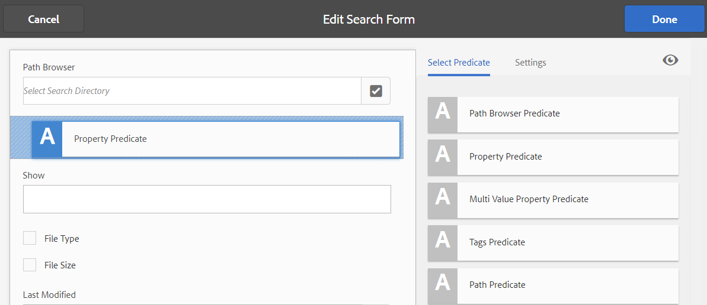

# Facetas de búsqueda {#search-facets}

Una implementación empresarial de [!DNL Adobe Experience Manager Assets] tiene la capacidad de almacenar muchos recursos. A veces, encontrar el recurso adecuado puede ser complicado y llevar mucho tiempo si solo utiliza las capacidades genéricas de búsqueda de [!DNL Experience Manager].

Utilice las facetas de búsqueda en el panel Filtros para añadir más granularidad a la experiencia de búsqueda y hacer que la funcionalidad de búsqueda sea más eficiente y versátil. Las facetas de búsqueda añaden varias dimensiones (predicados) que permiten realizar búsquedas más intrincadas. El panel Filtros incluye algunas facetas estándar. También puede agregar facetas de búsqueda personalizadas.

En resumen, las facetas de búsqueda permiten buscar recursos de varias formas en lugar de en un único orden taxonómico predeterminado. Puede explorar en profundidad hasta el nivel de detalle deseado para realizar una búsqueda más centrada.

Por ejemplo, si busca una imagen, puede elegir si desea un mapa de bits o una imagen vectorial. Puede reducir aún más el alcance de la búsqueda especificando el tipo MIME de la imagen. Del mismo modo, al buscar documentos, puede especificar el formato, por ejemplo PDF o MS Word.

## Agregar un predicado {#adding-a-predicate}

Las facetas de búsqueda que aparecen en el panel Filtros se definen en el formulario de búsqueda subyacente mediante predicados. Para mostrar más o diferentes facetas, agregue predicados al formulario predeterminado o utilice un formulario personalizado que incluya facetas de su elección.

Para las búsquedas de texto completo, agregue el predicado [!UICONTROL Texto completo] al formulario. Utilice el predicado Propiedad para buscar recursos que coincidan con una sola propiedad especificada. Utilice el predicado Opciones para buscar recursos que coincidan con uno o varios valores de una propiedad concreta. Agregue el predicado Intervalo de fechas para buscar recursos creados dentro de un intervalo de fechas especificado.

1. Haga clic en el logotipo [!DNL Experience Manager] y, a continuación, vaya a **[!UICONTROL Tools]** > **[!UICONTROL General]** > **[!UICONTROL Search Forms]**.
1. En la página Buscar en Forms, seleccione **[!UICONTROL Carril de búsqueda de administración de recursos]** y haga clic en **[!UICONTROL Editar]** .

   

   >[!NOTE]
   >
   >Para utilizar la funcionalidad de búsqueda de carpetas desde el **Carril de búsqueda de administración de recursos** preconfigurado desde una versión anterior, siga estos pasos:
   >
   >1. Vaya a `/conf/global/settings/dam/search/facets/assets/jcr:content/items` en CRXDE.
   >1. Elimine el nodo **type**.
   >1. Desde la ruta `/libs/settings/dam/search/facets/assets/jcr:content/items`, copie los nodos `asset`, `directory`, `typeor`, `excludepaths` y `searchtype` en la ruta mencionada en el paso 1.
   >1. Guarde los cambios.


1. En la página [!UICONTROL Editar búsqueda de Forms], arrastre un predicado desde la pestaña **[!UICONTROL Seleccionar predicado]** hasta el panel principal. Por ejemplo, arrastre **[!UICONTROL Predicado de propiedad]**.

   

   *Figura: Seleccione y mueva un predicado para personalizar los filtros de búsqueda.*

1. En la pestaña [!UICONTROL Settings], introduzca una etiqueta de campo, un texto de marcador de posición y una descripción para el predicado. Especifique un nombre válido para la propiedad de metadatos que desea asociar al predicado. La etiqueta de encabezado de la pestaña [!UICONTROL Settings] identifica el tipo del predicado seleccionado.

1. En el campo **[!UICONTROL Nombre de propiedad]**, indique un nombre válido para la propiedad de metadatos que desea asociar al predicado. Es el nombre sobre el cual se realiza la búsqueda. Por ejemplo, escriba `jcr:content/metadata/dc:description` o `./jcr:content/metadata/dc:description`.

   También puede seleccionar un nodo existente en el cuadro de diálogo de selección.

   

   Asociar una propiedad de metadatos con un predicado en el campo Nombre de propiedad

1. Haga clic en **[!UICONTROL Preview]**  para generar una previsualización del panel Filtros tal como aparece después de agregar el predicado.
1. Revise el diseño del predicado en el modo de vista previa.

   

   Vista previa del formulario de búsqueda antes de enviar los cambios

1. Para cerrar la vista previa, haga clic en **[!UICONTROL Close]**  en la esquina superior derecha de la vista previa.
1. Haga clic en **[!UICONTROL Listo]** para guardar la configuración.
1. Vaya al panel Buscar en la interfaz de usuario [!DNL Assets] . El predicado Propiedad se agrega al panel.
1. Escriba una descripción para el recurso que se buscará en el cuadro de texto. Por ejemplo, escriba `Adobe`. Cuando realice una búsqueda, los recursos con una descripción que coincida con `Adobe` se enumerarán en los resultados de la búsqueda.

## Agregar un predicado de opciones {#adding-an-options-predicate}

El predicado Opciones permite agregar varias opciones de búsqueda en el panel Filtros . Puede seleccionar una o varias de estas opciones en el panel Filtros para buscar recursos. Por ejemplo, para buscar recursos en función del tipo de archivo, configure las opciones, como Imágenes, Multimedia, Documentos y Archivos, en el formulario de búsqueda. Después de configurar estas opciones, la búsqueda se realiza en recursos de tipo GIF, JPEG, PNG, etc., al seleccionar la opción Imágenes en el panel Filtros .

Para asignar las opciones a la propiedad correspondiente, cree una estructura de nodos para las opciones y proporcione la ruta del nodo principal en la propiedad Nombre de propiedad del predicado Opciones. El nodo principal debe ser de tipo `sling`: `OrderedFolder`. Las opciones deben ser de tipo `nt:unstructured`. Los nodos de opción deben tener configuradas las propiedades `jcr:title` y `value`.

La propiedad `jcr:title` es un nombre descriptivo para la opción que se muestra en el panel Filtros. El campo `value` se utiliza en la consulta para coincidir con la propiedad especificada.

Cuando selecciona una opción, la búsqueda se realiza en función de la propiedad `value` del nodo de opciones y sus nodos secundarios, si los hay. Se atraviesa todo el árbol bajo el nodo de opciones y la propiedad `value` de cada nodo secundario se combina utilizando una operación OR para formar la consulta de búsqueda.

Por ejemplo, si selecciona “Imágenes” para los tipos de archivo, la consulta de búsqueda de los recursos se genera combinando la propiedad `value` mediante una operación O. Por ejemplo, la búsqueda de imágenes se genera combinando los resultados coincidentes para *image/jpeg*, *image/gif*, *image/png*, *image/pjpeg*, e *image/tiff* `jcr:content/metadata/dc:format` para la propiedad mediante una operación OR.


La propiedad Value de un tipo de archivo, tal como se ve en CRXDE, se utiliza para que funcionen las consultas de búsqueda

En lugar de crear manualmente una estructura de nodos para las opciones del repositorio CRXDE, puede definir las opciones de un archivo JSON especificando los pares de clave-valor correspondientes. Especifique la ruta del archivo JSON en el campo **[!UICONTROL Nombre de propiedad]**. Por ejemplo, puede definir los pares clave-valor `image/bmp`, `image/gif`, `image/jpeg` y `image/png`, y especificar sus valores como se muestra en el siguiente archivo JSON de muestra. En el campo **[!UICONTROL Nombre de propiedad]**, puede especificar la ruta CRXDE para este archivo.

```json
{
    "options" :
 [
          {"value" : "image/bmp","text" : "BMP"},
          {"value" : "image/gif","text" : "GIF"},
          {"value" : "image/jpeg","text" : "JPEG"},
          {"value" : "image/png","text" : "PNG"}
 ]
}
```

Si desea utilizar un nodo existente, especifíquelo mediante el cuadro de diálogo de selección.

>[!NOTE]
>
>El predicado Opciones es un envoltorio personalizado que incluye predicados de propiedades para demostrar el comportamiento descrito. Actualmente, no hay ningún extremo de REST disponible para admitir la funcionalidad de forma nativa.

1. Haga clic en el logotipo [!DNL Experience Manager] y, a continuación, vaya a **[!UICONTROL Tools]** > **[!UICONTROL General]** > **[!UICONTROL Search Forms]**.
1. En la página **[!UICONTROL Buscar en Forms]**, seleccione **[!UICONTROL Carril de búsqueda de administración de recursos]** y haga clic en **[!UICONTROL Editar]**.
1. En la página **[!UICONTROL Editar formulario de búsqueda]**, arrastre **[!UICONTROL Predicado de opciones]** desde la pestaña **[!UICONTROL Seleccionar predicado]** al panel principal.
1. En la pestaña **[!UICONTROL Configuración]**, indique una etiqueta y un nombre para la propiedad. Por ejemplo, para buscar recursos en función de su formato, especifique un nombre práctico para la etiqueta, por ejemplo, **[!UICONTROL Tipo de archivo]**. Indique la propiedad en función de la cual se realizará la búsqueda en el campo de propiedad, por ejemplo `jcr:content/metadata/dc:format.`
1. Realice una de las acciones siguientes:

   * En el campo **[!UICONTROL Nombre de propiedad]**, mencione la ruta del archivo JSON donde define los nodos para las opciones y especifique los pares de clave-valor correspondientes.
   * Haga clic en el símbolo `+` situado junto al campo Opciones para especificar el texto de visualización y el valor de las opciones que desea proporcionar en el panel Filtros. Para añadir otra opción, haga clic en el símbolo `+` y repita el paso.

1. Compruebe que la opción **[!UICONTROL Selección única]** se borra para que el usuario pueda seleccionar varias opciones a la vez para diferentes tipos de archivos (por ejemplo, imágenes, documentos, multimedia y archivos). Si elige **[!UICONTROL Selección única]**, el usuario solo puede seleccionar una opción para diferentes tipos de archivo a la vez.

   

   Los campos disponibles en el predicado Opciones

1. En el campo **[!UICONTROL Description]**, introduzca una descripción opcional y haga clic en **[!UICONTROL Listo]**.
1. Vaya al panel Buscar . El predicado Opciones se agrega al panel **Buscar**. Las opciones de **[!UICONTROL Tipo de archivo]** se muestran como casillas de verificación.

## Agregar un predicado de propiedad de varios valores {#adding-a-multi-value-property-predicate}

El predicado Propiedad de varios valores permite buscar recursos en busca de varios valores. Imagine un escenario en el que tiene imágenes de varios productos en [!DNL Assets] y los metadatos de cada imagen incluyen un número de SKU asociado al producto. Puede utilizar este predicado para buscar imágenes de producto basadas en varios números de SKU.

1. Haga clic en el logotipo [!DNL Experience Manager] y, a continuación, vaya a **[!UICONTROL Tools]** > **[!UICONTROL General]** > **[!UICONTROL Search Forms]**.
1. En la página Buscar en Forms, seleccione **[!UICONTROL Carril de búsqueda de administración de recursos]** y haga clic en **[!UICONTROL Editar]** .
1. En la página Editar formulario de búsqueda, arrastre un **[!UICONTROL predicado de propiedades de varios valores]** desde la pestaña **[!UICONTROL Seleccionar predicado]** hasta el panel principal.
1. En la pestaña **[!UICONTROL Settings]**, introduzca una etiqueta y un texto de marcador de posición para el predicado. Especifique el nombre de la propiedad en función del cual se realizará la búsqueda en el campo de propiedad, por ejemplo `jcr:content/metadata/dc:value`. También puede utilizar el cuadro de diálogo de selección para seleccionar un nodo.
1. Asegúrese de que la opción **[!UICONTROL Compatibilidad con delimitadores]** está seleccionada. En el campo **[!UICONTROL Delimitadores de entrada]**, especifique delimitadores para separar valores individuales. De forma predeterminada, se especifica una coma como delimitador. Puede especificar un delimitador diferente.
1. En el campo **Description**, introduzca una descripción opcional y haga clic en **[!UICONTROL Listo]**.
1. Vaya al panel Filtros de la interfaz de usuario [!DNL Assets] . El predicado **[!UICONTROL Propiedad de varios valores]** se agrega al panel.
1. Especifique varios valores en el campo Multi Value separados por los delimitadores y realice la búsqueda. El predicado busca una coincidencia de texto exacta para los valores especificados.

## Agregar un predicado Etiquetas {#adding-a-tags-predicate}

El predicado de etiquetas permite realizar búsquedas de recursos basadas en etiquetas. De forma predeterminada, [!DNL Assets] busca en los recursos una o más etiquetas que coincidan en función de las etiquetas que especifique. En otras palabras, la consulta de búsqueda realiza una operación OR utilizando las etiquetas especificadas. Sin embargo, puede utilizar la opción que coincida con todas las etiquetas para buscar recursos que incluyan todas las etiquetas que especifique.

1. Haga clic en el logotipo [!DNL Experience Manager] y, a continuación, vaya a **[!UICONTROL Tools]** > **[!UICONTROL General]** > **[!UICONTROL Search Forms]**.
1. En la página Buscar en Forms, seleccione **[!UICONTROL Carril de búsqueda de administración de recursos]** y haga clic en **[!UICONTROL Editar]** .
1. En la página Editar formulario de búsqueda , arrastre **[!UICONTROL Predicado de etiquetas]** desde la ficha Seleccionar predicado hasta el panel principal.
1. En la ficha Configuración , introduzca un texto de marcador de posición para el predicado. Especifique el nombre de la propiedad en función del cual se realizará la búsqueda en el campo de propiedad, por ejemplo *jcr:content/metadata/cq:tags*. Como alternativa, puede seleccionar un nodo en CRXDE desde el cuadro de diálogo de selección.
1. Configure la propiedad Ruta de acceso de las etiquetas raíz de este predicado para rellenar varias etiquetas en la lista Etiquetas.
1. Seleccione la opción **[!UICONTROL Mostrar todas las etiquetas]** para buscar recursos que incluyan todas las etiquetas que especifique.

1. En el campo **[!UICONTROL Description]**, introduzca una descripción opcional y haga clic en **[!UICONTROL Listo]**.
1. Vaya al panel Buscar . El predicado **[!UICONTROL Tags]** se agrega al panel Buscar.
1. Especifique las etiquetas en función de las cuales desee buscar recursos o seleccionar en la lista de sugerencias.

1. Seleccione **[!UICONTROL Coincidir con todo]** para buscar coincidencias que incluyan todas las etiquetas que especifique.

## Añadir otros predicados {#adding-other-predicates}

De forma similar a como se agrega un predicado Propiedad o un predicado Opciones, se pueden agregar los siguientes predicados adicionales al panel Buscar:

| Nombre del predicado | Descripción | Propiedades |
|---|---|---|
| [!UICONTROL Texto completo] | El predicado de búsqueda realiza una búsqueda de texto completo en todo un nodo de recursos. Se asigna con el operador jcr:contains . Puede especificar una ruta relativa si desea realizar una búsqueda de texto completo en una parte específica del nodo de recursos. | <ul><li>Etiqueta</li><li>Marcador de posición</li><li>Nombre de la propiedad </li><li>Descripción</li></ul> |
| [!UICONTROL Navegador de rutas] | Buscar predicado para buscar recursos en carpetas y subcarpetas en una ruta raíz preconfigurada | <ul><li>Marcador de posición</li><li>Ruta raíz</li><li>Descripción</li></ul> |
| [!UICONTROL Ruta] | Utilícelo para filtrar los resultados según la ubicación. Puede especificar diferentes rutas como opciones. | <ul><li>Etiqueta</li><li>Ruta</li><li>Descripción</li></ul> |
| [!UICONTROL Estado de publicación] | Buscar predicado para buscar recursos en función de su estado de publicación | <ul><li>Etiqueta</li><li>Nombre de la propiedad </li><li>Descripción</li></ul> |
| [!UICONTROL Fecha relativa] | El predicado de búsqueda busca recursos en función de la fecha relativa de su creación. Por ejemplo, puede configurar opciones como, por ejemplo, hace 2 meses, hace 3 semanas, etc. | <ul><li>Etiqueta</li><li>Nombre de la propiedad </li><li>Fecha relativa</li></ul> |
| [!UICONTROL Intervalo] | El predicado de búsqueda busca recursos que se encuentran dentro de un intervalo especificado. En el panel Buscar, puede especificar valores mínimos y máximos para el intervalo. | <ul><li>Etiqueta</li><li>Nombre de la propiedad </li><li>Descripción</li></ul> |
| [!UICONTROL Intervalo de fechas] | El predicado de búsqueda busca recursos creados dentro de un intervalo especificado para una propiedad de fecha. En el panel Buscar, puede especificar las fechas de inicio y finalización mediante selectores de fechas. | <ul><li>Etiqueta</li><li>Marcador de posición</li><li>Nombre de la propiedad </li><li>Texto de rango (de)</li><li>Texto de intervalo (hasta)</li><li>Descripción</li></ul> |
| [!UICONTROL Fecha] | Busque en el predicado una búsqueda de recursos basada en el control deslizante en función de una propiedad de fecha. | <ul><li>Etiqueta</li><li>Nombre de la propiedad </li><li>Descripción</li></ul> |
| [!UICONTROL Tamaño del archivo] | El predicado de búsqueda busca recursos en función de su tamaño. Se trata de un predicado basado en Silder donde se seleccionan las opciones de control deslizante de un nodo configurable. Las opciones predeterminadas se definen en /libs/dam/options/predicates/filesize en el repositorio CRXDE. El tamaño del archivo se proporciona en bytes. | <ul><li>Etiqueta</li><li>Nombre de la propiedad </li><li>Ruta</li><li>Descripción</li></ul> |
| [!UICONTROL Última modificación del recurso] | Buscar predicado para buscar recursos modificados recientemente | <ul><li>Nombre de la propiedad </li><li>Valor de propiedad</li><li>Descripción</li></ul> |
| [!UICONTROL Estado de publicación] | Buscar en el predicado para buscar recursos en función de su estado de publicación | <ul><li>Etiqueta</li><li>Nombre de la propiedad </li><li>Descripción</li></ul> |
| [!UICONTROL Clasificación] | Predicado de búsqueda para buscar recursos en función de su clasificación promedio | <ul><li>Etiqueta</li><li>Nombre de la propiedad </li><li>Ruta de la opción</li><li>Descripción</li></ul> |
| [!UICONTROL Estado de caducidad] | Buscar en el predicado para buscar recursos en función de su estado de caducidad | <ul><li>Etiqueta</li><li>Nombre de la propiedad </li><li>Descripción</li></ul> |
| [!UICONTROL Oculto] | Predicado de búsqueda que define una propiedad de campo oculto para buscar recursos | <ul><li>Nombre de la propiedad </li><li>Valor de propiedad</li><li>Descripción</li></ul> |

## Restaurar las facetas de búsqueda predeterminadas {#restoring-default-search-facets}

De forma predeterminada, aparece un icono de bloqueo  antes de **[!UICONTROL Assets Admin Search Rail]** en la página **[!UICONTROL Search Forms]**. El icono Bloquear con una opción de la página Buscar en Forms indica que la configuración predeterminada está intacta y no está personalizada. El icono  desaparece si agrega facetas de búsqueda al formulario indicando que se ha modificado el formulario predeterminado.


Para restaurar la faceta de búsqueda predeterminada, realice estos pasos:

1. Seleccione **[!UICONTROL Carril de búsqueda de administración de recursos]** en la página **[!UICONTROL Buscar en Forms]**.
1. Haga clic en **[!UICONTROL Delete]**  en la barra de herramientas.
1. En el cuadro de diálogo de confirmación, haga clic en **[!UICONTROL Eliminar]** para eliminar los cambios personalizados.

   Después de eliminar los cambios personalizados en las facetas de búsqueda, el icono de bloqueo  vuelve a aparecer antes de **[!UICONTROL Assets Admin Search Rail]** en la página **[!UICONTROL Buscar en Forms]**.

## Permisos de usuario {#user-permissions}

Si no se le ha asignado una función de administrador, aquí tiene una lista de permisos que necesita para realizar acciones de edición, eliminación y vista previa que involucran facetas de búsqueda.

| Acción | Permisos |
| ------------------- | ---------------------------------------------------------------- |
| [!UICONTROL Editar] | Permisos de lectura y escritura en el nodo `/apps` en CRXDE |
| [!UICONTROL Eliminar] | Permisos de lectura, escritura y eliminación en el nodo `/apps` de CRXDE |
| [!UICONTROL Vista previa] | Permisos de lectura, escritura y eliminación en el nodo `/var/dam/content` de CRXDE. Además, permisos de lectura y escritura en el nodo `/apps`. |

>[!MORELIKETHIS]
>
>* [Ampliar la capacidad de búsqueda de recursos](searchx.md)
>* [Buscar recursos](search-assets.md)

