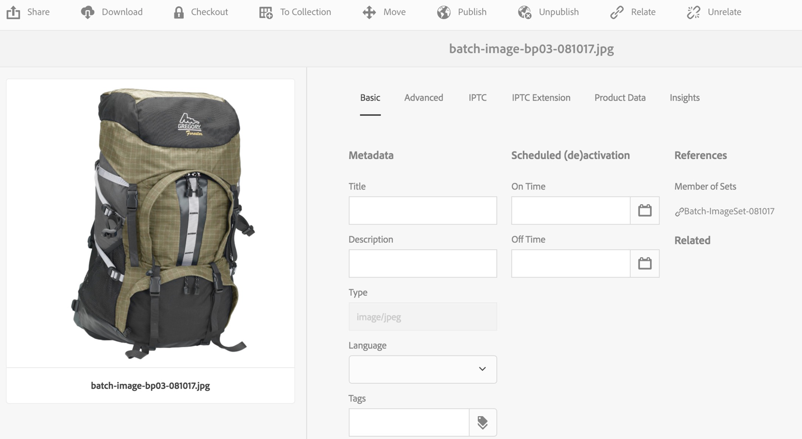

# Conjuntos de giros{#spin-sets}

Un conjunto de giros simula el acto real de girar un objeto para examinarlo. Los conjuntos de giros permiten ver los elementos desde cualquier ángulo, obteniendo los detalles visuales clave desde cualquier ángulo.

Un conjunto de giros simula una experiencia de visualización de 360°. Dynamic Media ofrece conjuntos de giros de un solo eje en los que los espectadores pueden rotar un elemento. Además, los usuarios pueden aplicar zoom &quot;de forma libre&quot; y recorrer cualquiera de las vistas con unos pocos clics sencillos del ratón. De este modo, los usuarios pueden examinar un elemento más de cerca desde un punto de vista particular.

Los conjuntos de giros se designan mediante un banner con la palabra **[!UICONTROL SPINSET]**. Además, si se publica el conjunto de giros, la fecha de publicación, indicada por la variable **[!UICONTROL World]** se encuentra en el banner junto con la fecha de la última modificación, indicada por la variable **[!UICONTROL Lápiz]** se muestra.

>[!NOTE]
>
>Para obtener información sobre la interfaz de usuario de Assets, consulte [Administrar recursos](/help/assets/manage-assets.md).

Cuando crea un conjunto de giros, Adobe recomienda la siguiente práctica recomendada y aplica el siguiente límite:

| Tipo de límite | Práctica recomendada | Límite impuesto |
| --- | --- | --- |
| Número máximo de filas/columnas por conjunto 2D | 12 a 18 imágenes por conjunto | 1000 |

Consulte también [Limitaciones de Dynamic Media](/help/assets/limitations.md).

## Inicio rápido: Conjuntos de giros {#quick-start-spin-sets}

Para poner en marcha rápidamente los conjuntos de giros, siga estos pasos:

1. [Cargar las imágenes para varias vistas](#uploading-assets-for-spin-sets).

   Como mínimo, necesitará entre 8 y 12 tomas de un elemento para un conjunto de giros unidimensional y entre 16 y 24 para un conjunto de giros bidimensional. Las tomas deben realizarse a intervalos regulares para dar la impresión de que el objeto está girando y siendo volteado. Por ejemplo, si un conjunto de giros unidimensional incluye 12 tomas, gire el elemento 30° (360/12) para cada toma.

   Consulte [Dynamic Media: formatos de imagen de trama compatibles](/help/assets/assets-formats.md#supported-raster-image-formats-dynamic-media) para obtener una lista de los formatos admitidos por los conjuntos de giros.

1. [Crear un conjunto de giros](#creating-spin-sets).

   Para crear un conjunto de giros, seleccione **[!UICONTROL Crear > Conjunto de giros]** y asigne un nombre al conjunto, elija los recursos y elija el orden en que aparecen las imágenes.

   Consulte [Trabajar con selectores](/help/assets/working-with-selectors.md).

   >[!NOTE]
   >
   >También puede crear conjuntos de giros automáticamente mediante los [ajustes preestablecidos de conjuntos de lotes](/help/assets/config-dms7.md#creating-batch-set-presets-to-auto-generate-image-sets-and-spin-sets). **Importante:** IPS (Image Production System) crea los conjuntos de lotes como parte de la ingesta de recursos y solo están disponibles en el modo Dynamic Media - Scene7.

1. Configuración [Ajustes preestablecidos del visualizador de conjuntos de giros](/help/assets/managing-viewer-presets.md), según sea necesario.

   Los administradores pueden crear o modificar ajustes preestablecidos de visualizador de conjuntos de giros. Para ver el conjunto de giros con un ajuste preestablecido de visualizador, seleccione el conjunto de giros y, en el menú desplegable del carril izquierdo, seleccione **Visualizadores**.

   Consulte **[!UICONTROL Herramientas]** > **[!UICONTROL Recursos]** > **[!UICONTROL Ajustes preestablecidos de visor]** si desea crear o editar ajustes preestablecidos de visor.

   Consulte [Añadir y editar ajustes preestablecidos de visor](/help/assets/managing-viewer-presets.md).

1. [Ver un conjunto de giros](#viewing-spin-sets).

   Puede ver y acceder a los conjuntos creados mediante ajustes preestablecidos de conjuntos de lotes de tres formas diferentes. (Conjuntos creados mediante ajustes preestablecidos de conjuntos de lotes, *not* en la interfaz de usuario).

1. [Vista previa de un conjunto de giros](/help/assets/previewing-assets.md).

   Seleccione el conjunto de giros y podrá previsualizarlo. Rotar el conjunto de giros. Puede elegir diferentes visualizadores del **[!UICONTROL Visualizadores]** , disponible en el menú desplegable del carril izquierdo.

1. [Publicar un conjunto de giros](/help/assets/publishing-dynamicmedia-assets.md).

   Al publicar un conjunto de giros, se activa la dirección URL y la cadena Incrustar. Además, debe [publicar el ajuste preestablecido de visor](/help/assets/managing-viewer-presets.md).

1. [Vincular URL a la aplicación web](/help/assets/linking-urls-to-yourwebapplication.md) o [Incrustar el visualizador de imágenes o vídeos](/help/assets/embed-code.md).

   Adobe Experience Manager Assets crea llamadas URL para conjuntos de giros y las activa después de publicar los conjuntos de giros. Puede copiar estas direcciones URL cuando obtiene una vista previa de los recursos. También puede incrustarlos en el sitio web.

   Seleccione el conjunto de giros y, a continuación, en el menú desplegable del carril izquierdo, seleccione **[!UICONTROL Visualizadores]**.

   Consulte [Vinculación de un conjunto de giros a una página web](/help/assets/linking-urls-to-yourwebapplication.md) y [Incrustar el visualizador de imágenes o vídeos](/help/assets/embed-code.md).

Si es necesario, puede [editar un conjunto de giros](#editing-spin-sets). Además, puede ver y modificar [Propiedades del conjunto de giros](/help/assets/manage-assets.md#editing-properties).

## Carga de recursos para un conjunto de giros {#uploading-assets-for-spin-sets}

Como mínimo, necesitará entre 8 y 12 tomas de un elemento para un conjunto de giros unidimensional y entre 16 y 24 para un conjunto de giros bidimensional. Las tomas deben realizarse a intervalos regulares para dar la impresión de que el objeto está girando y siendo volteado. Por ejemplo, si un conjunto de giros unidimensional incluye 12 tomas, gire el elemento 30° (360/12) para cada toma.

Puede cargar imágenes para los conjuntos de giros del mismo modo que lo haría [cargar cualquier otro recurso en Experience Manager Assets](/help/assets/manage-assets.md).

Consulte [Dynamic Media: formatos de imagen de trama compatibles](/help/assets/assets-formats.md#supported-raster-image-formats-dynamic-media) para obtener una lista de los formatos admitidos por los conjuntos de giros.

### Pautas para capturar imágenes para el conjunto de giros {#guidelines-for-shooting-spin-set-images}

A continuación se indican algunas prácticas recomendadas en relación con las imágenes de conjuntos de giros. En general, cuantas más imágenes haya en un conjunto de giros, mejor será el efecto giratorio de la imagen. Sin embargo, al incluir muchas imágenes en el conjunto, también aumenta el tiempo que tardan las imágenes en cargarse. Experience Manager recomienda estas directrices para la toma de imágenes para su uso en Conjuntos de giros:

* Como mínimo, utilice entre 8 y 12 imágenes en un conjunto de giros unidimensional y entre 16 y 24 imágenes en un conjunto de giros bidimensional. Se necesita un mínimo de 8 imágenes para poder girar 360°. Los conjuntos de giros unidimensionales son más comunes, ya que la creación de conjuntos de giros bidimensionales requiere mucho trabajo.
* Utilizar un formato sin pérdidas; Se recomiendan el TIFF y PNG.
* Enmascara todas las imágenes para que el elemento aparezca sobre un fondo blanco puro u otro de alto contraste. De forma opcional, agregue sombras.
* Asegúrese de que los detalles del producto estén bien iluminados y enfocados.
* Toma imágenes de giro para ropa de moda con un maniquí o modelo. A menudo el maniquí está enmascarado (usando un maniquí de vidrio) o un maniquí estilizado/forma de vestir se muestra en la imagen. Puede crear un conjunto de giros en modelo definiendo el número de ángulos. Marque cada ángulo con cinta en el suelo para que pueda guiar al modelo para que se desplace y mire en la dirección de cada toma.

## Crear un conjunto de giros {#creating-spin-sets}

En esta sección se describe cómo crear un conjunto de giros en el Experience Manager.

>[!NOTE]
>
>También puede crear conjuntos de giros automáticamente mediante los [ajustes preestablecidos de conjuntos de lotes](/help/assets/config-dms7.md#creating-batch-set-presets-to-auto-generate-image-sets-and-spin-sets). **Importante:** IPS (Image Production System) crea los conjuntos de lotes como parte de la ingesta de recursos y solo están disponibles en el modo Dynamic Media - Scene7.
>
>Consulte &quot;Creación de ajustes preestablecidos de conjuntos de lotes para generar automáticamente conjuntos de imágenes y conjuntos de giros&quot; en [Configuración de Dynamic Media: modo Scene7](/help/assets/config-dms7.md#creating-batch-set-presets-to-auto-generate-image-sets-and-spin-sets).

>[!NOTE]
>
>Orden en el que aparecen las imágenes en un conjunto de giros. Asegúrese de ordenarlas para que el giro sea una vista suave de 360°.

Cuando crea un conjunto de giros, Adobe recomienda la siguiente práctica recomendada y aplica el siguiente límite:

| Tipo de límite | Práctica recomendada | Limitado |
| --- | --- | --- |
| Número máximo de filas/columnas por conjunto 2D | 12 a 18 imágenes por conjunto | 1000 |

Consulte también [Limitaciones de Dynamic Media](/help/assets/limitations.md).

**Para crear un conjunto de giros:**

1. En Assets, desplácese hasta donde desee crear un conjunto de giros, seleccione **[!UICONTROL Crear]** y seleccione **[!UICONTROL Conjunto de giros]**. También puede crear el conjunto desde una carpeta que contenga los recursos. Aparece el Editor de conjuntos de giros.

   

1. En el Editor de conjuntos de giros, en la sección **[!UICONTROL Título]** , introduzca un nombre para el conjunto de giros. El nombre aparece en el banner del conjunto de giros. De forma opcional, introduzca una descripción.

   

   >[!NOTE]
   >
   >Al crear el conjunto de giros, puede cambiar la miniatura del conjunto de giros o permitir que el Experience Manager seleccione la miniatura automáticamente en función de los recursos del conjunto de giros. Para seleccionar una miniatura, seleccione **[!UICONTROL Cambiar miniatura]** y seleccione cualquier imagen (puede navegar también a otras carpetas para buscar imágenes). Si ha seleccionado una miniatura y, a continuación, decide que desea que el Experience Manager genere una a partir del conjunto de giros, seleccione **[!UICONTROL Cambiar a la miniatura automática]**.

1. Realice una de las siguientes acciones:

   * Cerca de la esquina superior izquierda de la página Editor de conjuntos de giros, seleccione **[!UICONTROL Agregar recurso]**.

   * Cerca de la mitad de la página Editor de conjuntos de giros, seleccione **[!UICONTROL Toque para abrir el Selector de recursos]**.
   Pulse para seleccionar los recursos que desea incluir en el conjunto de giros. Los recursos seleccionados tienen un icono de marca de verificación sobre ellos. Cuando haya terminado, cerca de la esquina superior derecha de la página, seleccione **[!UICONTROL Select]**.

   Con el Selector de recursos, puede buscar recursos escribiendo una palabra clave y pulsando **[!UICONTROL Retorno]**. También puede aplicar filtros para restringir los resultados de búsqueda. Puede filtrar por ruta, colección, tipo de archivo y etiqueta. Seleccione el filtro y, a continuación, el **[!UICONTROL Filtro]** en la barra de herramientas. Para cambiar la vista, pulse el icono Ver y seleccione **[!UICONTROL Vista de columna]**, **[!UICONTROL Vista de tarjeta]** o **[!UICONTROL Vista de lista]**.

   Consulte [Trabajar con selectores](/help/assets/working-with-selectors.md).

   

1. Cuando se añaden recursos al conjunto, estos se añaden automáticamente en orden alfanumérico. Después de agregarlos, puede reordenar u ordenar los recursos manualmente.

   Si es necesario, arrastre el icono Reordenar de un recurso a la derecha del nombre del archivo del recurso para reordenar las imágenes hacia arriba o hacia abajo en la lista de conjunto.

   .

   Reordenar el fotograma 11 del conjunto de giros arrastrándolo a una nueva ubicación.

1. (Opcional) Realice cualquiera de las siguientes acciones:

   * Para eliminar una imagen, seleccione la imagen y seleccione **[!UICONTROL Eliminar recurso]**.

   * Para aplicar un ajuste preestablecido, cerca de la esquina superior derecha de la página, seleccione **[!UICONTROL Ajuste preestablecido]** y, a continuación, seleccione un ajuste preestablecido para aplicarlo a todos los recursos a la vez.

1. Seleccione **[!UICONTROL Guardar]**. El conjunto de giros recién creado aparece en la carpeta en la que lo creó.

## Ver un conjunto de giros {#viewing-spin-sets}

Puede crear conjuntos de giros en la interfaz de usuario o automáticamente utilizando [ajustes preestablecidos de conjuntos de lotes](/help/assets/config-dms7.md#creating-batch-set-presets-to-auto-generate-image-sets-and-spin-sets). Sin embargo, los conjuntos creados con ajustes preestablecidos de conjuntos de lotes, *not* aparece en la interfaz de usuario. Puede acceder a los conjuntos creados mediante ajustes preestablecidos de conjuntos de lotes de tres formas diferentes. (Estos métodos están disponibles aunque haya creado los conjuntos de giros en la interfaz de usuario).

>[!NOTE]
>
>También puede ver conjuntos mediante la interfaz de usuario, tal como se describe en [Editar conjuntos de giros](#editing-spin-sets).

**Para ver un conjunto de giros:**

1. Al abrir las propiedades de un recurso individual. Las propiedades indican los conjuntos de los que es miembro el recurso seleccionado (en **[!UICONTROL Miembro de conjuntos]**). Seleccione el nombre del conjunto para que pueda ver el conjunto completo.

   

1. Desde una imagen de miembro de cualquier conjunto. Seleccione el **[!UICONTROL Conjuntos]** para mostrar los conjuntos de los que es miembro el recurso.

   

1. Desde la búsqueda, puede seleccionar **[!UICONTROL Filtros]**, luego expandir **[!UICONTROL Dynamic Media]** y seleccionar **[!UICONTROL Conjuntos]**.

   La búsqueda devuelve conjuntos coincidentes creados manualmente en la interfaz de usuario o creados automáticamente mediante ajustes preestablecidos de conjuntos de lotes. Para conjuntos automatizados, la consulta de búsqueda se realiza mediante `Starts with` criterios de búsqueda diferentes de la búsqueda de Experience Manager basada en el uso de `Contains` criterios de búsqueda. Configuración del filtro en **[!UICONTROL Conjuntos]** es la única forma de buscar conjuntos automatizados.

   

## Editar un conjunto de giros {#editing-spin-sets}

Puede realizar varias tareas de edición en los conjuntos de giros, como las siguientes:

* Agregue imágenes al conjunto de giros.
* Reordenar imágenes en el conjunto de giros.
* Eliminar recursos del conjunto de giros.
* Aplicar ajustes preestablecidos de visor.
* Elimine el conjunto de giros.

**Para editar un conjunto de giros:**

1. Realice una de las siguientes acciones:

   * Pase el ratón sobre un recurso de conjunto de giros y, a continuación, seleccione **[!UICONTROL Editar]** (icono de lápiz).
   * Pase el ratón sobre un recurso de conjunto de giros, seleccione **[!UICONTROL Select]** (icono de marca de verificación) y, a continuación, seleccione **[!UICONTROL Editar]** en la barra de herramientas.

   * Seleccione en un recurso de conjunto de giros y, a continuación, seleccione **[!UICONTROL Editar]** (icono de lápiz) en la barra de herramientas.

1. Para editar el conjunto de giros, realice una de las acciones siguientes:

   * Para reordenar las imágenes, arrastre una imagen a una nueva ubicación (seleccione el icono de reordenar para mover elementos).
   * Para ordenar los elementos en orden ascendente o descendente, seleccione el encabezado de la columna.
   * Para agregar un recurso o actualizar un recurso existente, seleccione **[!UICONTROL Agregar recurso]**. Vaya a un recurso, selecciónelo y, a continuación, seleccione **[!UICONTROL Select]** cerca de la esquina superior derecha.
Si elimina la imagen que usa el Experience Manager para la miniatura reemplazándola por otra imagen, el recurso original seguirá apareciendo.
   * Para eliminar un recurso, selecciónelo y seleccione **[!UICONTROL Eliminar recurso]**.
   * Para aplicar un ajuste preestablecido, seleccione el icono Ajuste preestablecido y elija un ajuste preestablecido.
   * Para eliminar un conjunto de giros completo, vaya al conjunto de giros, selecciónelo y seleccione **[!UICONTROL Eliminar]**

   >[!NOTE]
   >
   >Para editar las imágenes de un conjunto de giros, vaya al conjunto y seleccione **[!UICONTROL Definir miembros]** en el carril izquierdo y, a continuación, seleccione el icono Lápiz en un recurso individual para abrir la ventana de edición.

1. Select **[!UICONTROL Guardar]** cuando haya terminado de editar.

## Vista previa de un conjunto de giros {#previewing-spin-sets}

Consulte [Vista previa de recursos](/help/assets/previewing-assets.md).

## Publicar un conjunto de giros {#publishing-spin-sets}

Consulte [Publicar recursos](/help/assets/publishing-dynamicmedia-assets.md).
