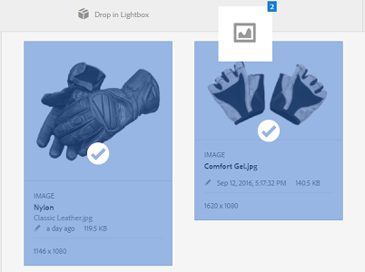

# Lightbox {#lightbox}

Lightbox es un tipo especial de colección que facilita el acceso a los recursos. Puede acceder rápidamente a Lightbox para agregar o eliminar recursos. Sirve como su galería de imágenes personal.

Si es un usuario de Recursos Adobe Experience Manager (AEM), Lightbox se crea automáticamente la primera vez que inicia sesión en la aplicación. Es exclusivo para su inicio de sesión. Otros usuarios no pueden acceder a su Lightbox.

## Adición de recursos a la caja de iluminación {#adding-assets-to-lightbox}

1. En la interfaz de usuario de Recursos, seleccione los recursos que desea agregar a Lightbox.
1. Arrastre los recursos a la zona **[!UICONTROL Colocar en Lightbox]** . Se libera cuando la zona de colocación se active y su etiqueta cambie a **[!UICONTROL Colocar en Agregar]**.

   

1. En el cuadro de diálogo, toque o haga clic en **[!UICONTROL Agregar]** y, a continuación, ciérrelo para completar el proceso. Los recursos seleccionados se agregan a Lightbox.
1. Para ver Lightbox, vaya a la consola Colecciones.
1. Toque o haga clic en **[!UICONTROL Lightbox]** para ver los recursos que contiene.

   >[!NOTE]
   >
   >Aunque Lightbox se parece a una colección, no puede realizar todas las acciones que normalmente realiza en las colecciones. Por ejemplo, no puede eliminar, compartir ni ver la configuración de un Lightbox. Además, no puede agregarla a otras colecciones. Sin embargo, puede editar los recursos dentro de una caja de iluminación.

## Quitar recursos de Lightbox {#removing-assets-from-lightbox}

1. Vaya a la consola Colecciones, toque o haga clic en Lightbox para ver sus recursos.
1. Seleccione los recursos que desee eliminar.
1. En la barra de herramientas, toque o haga clic en **[!UICONTROL Eliminar]**.
1. En el cuadro de diálogo, toque o haga clic en **[!UICONTROL Eliminar]** para confirmar la acción de eliminación. Los recursos se eliminan de Lightbox.
