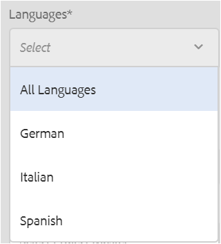
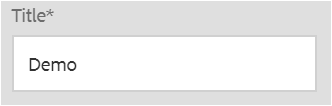

# Crear proyectos de traducción {#creating-translation-projects}

Para crear una copia de idioma, déclencheur uno de los siguientes flujos de trabajo de copia de idioma disponibles en el carril Referencias de la interfaz de usuario [!DNL Experience Manager].

* **Crear y traducir**: En este flujo de trabajo, los recursos que se van a traducir se copian en la raíz de idioma del idioma al que se desea traducir. Además, según las opciones que elija, se creará un proyecto de traducción para los recursos en la consola Proyectos. Según la configuración, el proyecto de traducción puede iniciarse manualmente o puede ejecutarse automáticamente en cuanto se cree el proyecto de traducción.

* **Actualizar copias** de idioma: Ejecute este flujo de trabajo para traducir un grupo adicional de recursos e incluirlo en una copia de idioma para una configuración regional concreta. En este caso, los recursos traducidos se agregan a la carpeta de destinatario que ya contiene recursos traducidos anteriormente.

>[!PREREQUISITES]
>
>* Los usuarios que crean proyectos de traducción son miembros del grupo `projects-administrators`.
>* El proveedor de servicio de traducción admite la traducción de binarios.

## Crear y traducir flujo de trabajo {#create-and-translate-workflow}

El flujo de trabajo de creación y traducción se utiliza para generar copias de idiomas para un idioma determinado por primera vez. El flujo de trabajo ofrece las siguientes opciones:

* Crear solo una estructura.
* Crear un nuevo proyecto de traducción.
* Añadir a un proyecto de traducción existente.

### Crear solo una estructura {#create-structure-only}

Utilice la opción **[!UICONTROL Crear solo estructura]** para diseñar una jerarquía de carpetas de destino dentro de la raíz del idioma de destino para que coincida con la jerarquía de la carpeta de origen dentro de la raíz del idioma de origen. En este caso, los recursos de origen se copian en la carpeta de destino. Sin embargo, no se genera ningún proyecto de traducción.

1. En la interfaz [!DNL Assets], seleccione la carpeta de origen para la que desea crear una estructura en la raíz del lenguaje de destinatario.

1. Abra el panel **[!UICONTROL Referencias]** y haga clic en **[!UICONTROL Copias de idioma]** en **[!UICONTROL Copias]**.

   

1. Haga clic en **[!UICONTROL Crear y traducir]**. En la lista **[!UICONTROL Idiomas de Destinatario]**, seleccione el idioma para el que desea crear una estructura de carpetas.

1. En la lista **[!UICONTROL Proyecto]**, seleccione **[!UICONTROL Crear estructura únicamente]**.

1. Haga clic en **[!UICONTROL Crear]**. La nueva estructura del idioma de destinatario se muestra en **[!UICONTROL Copias de idioma]**.

   

1. Haga clic en la estructura de la lista y, a continuación, haga clic en **[!UICONTROL Mostrar en recursos]** para desplazarse a la estructura de carpetas dentro del idioma del destinatario.

   

### Crear un nuevo proyecto de traducción {#create-a-new-translation-project}

Si utiliza esta opción, los recursos que se van a traducir se copian en la raíz del idioma en el que desea traducir. Según las opciones que elija, se creará un proyecto de traducción para los recursos en la consola Proyectos. Según la configuración, el proyecto de traducción se puede iniciar manualmente o automáticamente en cuanto se cree el proyecto de traducción.

1. En la interfaz de usuario [!DNL Assets], seleccione la carpeta de origen para la que desea crear una copia de idioma.
1. Abra el panel **[!UICONTROL Referencias]** y haga clic en **[!UICONTROL Copias de idioma]** en **[!UICONTROL Copias]**.

   

1. Haga clic en **[!UICONTROL Crear y traducir]** en la parte inferior.

1. En la lista **[!UICONTROL Idiomas de destino]**, seleccione los idiomas para los que desea crear una estructura de carpetas.

   

1. En la lista **[!UICONTROL Proyecto]**, seleccione **[!UICONTROL Crear un nuevo proyecto de traducción]**.

   

1. En el campo **[!UICONTROL Título del proyecto]**, introduzca un título.

   

1. Haga clic en **[!UICONTROL Crear]**. [!DNL Assets] de la carpeta de origen se copian en las carpetas de destinatario para las configuraciones regionales seleccionadas en el paso 4.

   

1. Para desplazarse a la carpeta, seleccione la copia de idioma y haga clic en **[!UICONTROL Mostrar en recursos]**.

   

1. Vaya a la consola Proyectos. La carpeta de traducción se copia en la consola Proyectos.

   

1. Abra la carpeta para vista del proyecto de traducción.

   

1. Haga clic en el proyecto para abrir la página de detalles.

   

1. Para vista del estado del trabajo de traducción, haga clic en los puntos suspensivos en la parte inferior del mosaico **[!UICONTROL Trabajo de traducción]**.

   

   Para obtener más información sobre los estados de los trabajos, consulte [Monitoreo del estado de un trabajo de traducción](/help/sites-administering/tc-manage.md#monitoring-the-status-of-a-translation-job).

1. Vaya a la interfaz de usuario [!DNL Assets] y abra la página [!UICONTROL Propiedades] de cada uno de los recursos traducidos para vista de los metadatos traducidos.

   

   *Figura: Metadatos traducidos en la página de propiedades del recurso.*

   >[!NOTE]
   >
   >Esta función está disponible para recursos y carpetas. Cuando se selecciona un recurso en lugar de una carpeta, se copia toda la jerarquía de carpetas hasta la raíz del idioma para crear una copia de idioma para el recurso.

### Añadir a un proyecto de traducción existente {#add-to-existing-translation-project}

Si utiliza esta opción, el flujo de trabajo de traducción se ejecuta para los recursos que agregue a la carpeta de origen después de ejecutar un flujo de trabajo de traducción anterior. Solo los recursos recién añadidos se copian en la carpeta de destinatario que contiene los recursos traducidos anteriormente. En este caso no se crea ningún proyecto de traducción nuevo.

1. En la interfaz de usuario [!DNL Assets], navegue a la carpeta de origen que contenga recursos sin traducir.
1. Seleccione un recurso que desee traducir y abra el **[!UICONTROL panel Referencias]**. La sección **[!UICONTROL Textos en idiomas]** muestra el número de traducciones disponibles en ese momento.
1. Haga clic en **[!UICONTROL Copias de idioma]** en **[!UICONTROL Copias]**. Se muestra una lista de las traducciones disponibles.
1. Haga clic en **[!UICONTROL Crear y traducir]** en la parte inferior.

1. En la lista **[!UICONTROL Idiomas de destino]**, seleccione los idiomas para los que desea crear una estructura de carpetas.

1. En la lista **[!UICONTROL Proyecto]**, seleccione **[!UICONTROL Agregar a proyecto de traducción]** existente para ejecutar el flujo de trabajo de traducción en la carpeta.

   >[!NOTE]
   >
   >Si elige la opción **[!UICONTROL Añadir a proyecto de traducción existente]**, el proyecto de traducción se agrega a un proyecto preexistente sólo si la configuración del proyecto coincide exactamente con la configuración del proyecto preexistente. De lo contrario, se crea un nuevo proyecto.

1. En la lista **[!UICONTROL Proyecto de traducción existente]**, seleccione un proyecto para agregar el recurso a la traducción.

1. Haga clic en **[!UICONTROL Crear]**. Los recursos que se van a traducir se agregan a la carpeta de destino. La carpeta actualizada se muestra en la sección **[!UICONTROL Textos en idiomas]**.

   

1. Vaya a la consola Proyectos y abra el proyecto de traducción existente que ha agregado.
1. Haga clic en la vista del proyecto de traducción en la página de detalles del proyecto.

   

1. Haga clic en los puntos suspensivos en la parte inferior del mosaico **Trabajo de traducción** para vista de los recursos en el flujo de trabajo de traducción. En la lista de trabajos de traducción también se muestran las entradas para los metadatos y las etiquetas de los recursos. Estas entradas indican que los metadatos y las etiquetas de los recursos también se traducen.

   >[!NOTE]
   >
   >Si elimina la entrada de etiquetas o metadatos, no se traducirá ninguna etiqueta o metadatos para ninguno de los recursos.

   >[!NOTE]
   >
   >Si el recurso que agrega al trabajo de traducción incluye subrecursos, selecciónelos y elimínelos para que la traducción continúe sin problemas.

1. Para inicio de la traducción de los recursos, haga clic en la flecha del mosaico **[!UICONTROL Trabajo de traducción]** y seleccione **[!UICONTROL Inicio]** en la lista.

   

   Un mensaje notifica el inicio del trabajo de traducción.

1. Para vista del estado del trabajo de traducción, haga clic en los puntos suspensivos en la parte inferior del mosaico **[!UICONTROL Trabajo de traducción]**.

   

   Para obtener más información, consulte [Monitoreo del estado de un trabajo de traducción](/help/sites-administering/tc-manage.md#monitoring-the-status-of-a-translation-job).

1. Una vez finalizada la traducción, el estado cambia a Listo para revisar. Vaya a la interfaz de usuario [!DNL Assets] y abra la página Propiedades de cada uno de los recursos traducidos para vista de los metadatos traducidos.

## Actualizar copias de idioma {#update-language-copies}

Ejecute este flujo de trabajo para traducir cualquier conjunto adicional de recursos e incluirlo en una copia de idioma para una configuración regional concreta. En este caso, los recursos traducidos se agregan a la carpeta de destinatario que ya contiene recursos traducidos anteriormente. Según la elección de opciones, se crea un proyecto de traducción o se actualiza un proyecto de traducción existente para los nuevos recursos. El flujo de trabajo Actualizar copias de idioma incluye las siguientes opciones:

* Crear un nuevo proyecto de traducción
* Añadir a un proyecto de traducción existente

### Crear un nuevo proyecto de traducción {#create-a-new-translation-project-1}

Si utiliza esta opción, se crea un proyecto de traducción para el conjunto de recursos para los que desea actualizar una copia de idioma.

1. En la interfaz de usuario [!DNL Assets], seleccione la carpeta de origen donde agregó un recurso.
1. Abra el panel **[!UICONTROL Referencias]** y haga clic en **[!UICONTROL Copias de idioma]** en **[!UICONTROL Copias]** para mostrar la lista de las copias de idioma.
1. Seleccione la casilla de verificación antes de **[!UICONTROL Textos en idiomas]** y, a continuación, seleccione la carpeta de destino correspondiente a la configuración regional adecuada.

   

1. Haga clic en **[!UICONTROL Actualizar copias de idioma]** en la parte inferior.

1. En la lista **[!UICONTROL Project]**, elija **[!UICONTROL Crear un nuevo proyecto de traducción]**.

1. En el campo **[!UICONTROL Título del proyecto]**, introduzca un título.

1. Haga clic en **[!UICONTROL Inicio]**.
1. Vaya a la consola Proyectos. La carpeta de traducción se copia en la consola Proyectos.

   

1. Abra la carpeta para vista del proyecto de traducción.

   

1. Haga clic en el proyecto para abrir la página de detalles.

   

1. Para inicio de la traducción de los recursos, haga clic en la flecha del mosaico **[!UICONTROL Trabajo de traducción]** y seleccione **[!UICONTROL Inicio]** en la lista.

   

   Un mensaje notifica el inicio del trabajo de traducción.

1. Para vista del estado del trabajo de traducción, haga clic en los puntos suspensivos en la parte inferior del mosaico **[!UICONTROL Trabajo de traducción]**.

   

   Para obtener más información sobre los estados de los trabajos, consulte [Monitoreo del estado de un trabajo de traducción](../sites-administering/tc-manage.md#monitoring-the-status-of-a-translation-job).

1. Vaya a la interfaz de usuario [!DNL Assets] y abra la página Propiedades de cada uno de los recursos traducidos para vista de los metadatos traducidos.

### Añadir a un proyecto de traducción existente {#add-to-existing-translation-project-1}

Si utiliza esta opción, el conjunto de recursos se agrega a un proyecto de traducción existente para actualizar la copia de idioma de la configuración regional que elija.

1. En la interfaz de usuario [!DNL Assets], seleccione la carpeta de origen donde agregó una carpeta de recursos.
1. Abra el **[!UICONTROL panel Referencias]** y haga clic en **[!UICONTROL Copias de idioma]** en **[!UICONTROL Copias]** para mostrar la lista de las copias de idioma.

   

1. Seleccione la casilla de verificación que se encuentra delante de **[!UICONTROL Textos en idiomas]**, de esta forma, selecciona los textos disponibles en diferentes idiomas. Anule la selección de otros textos excepto el texto (textos) en el idioma correspondiente a las configuraciones regionales a las que desea traducir.

   

1. Haga clic en **[!UICONTROL Actualizar copias de idioma]** en la parte inferior.

1. En la lista **[!UICONTROL Project]**, elija **[!UICONTROL Añadir a proyecto de traducción existente]**.

   

1. En la lista **[!UICONTROL Proyecto de traducción existente]**, seleccione un proyecto para agregar el recurso a la traducción.

1. Haga clic en **[!UICONTROL Inicio]**.
1. Consulte los pasos 9 a 14 de [Añadir al proyecto de traducción existente](translation-projects.md#add-to-existing-translation-project) para completar el resto del procedimiento.

## Crear copias temporales de idioma {#creating-temporary-language-copies}

Cuando se ejecuta un flujo de trabajo de traducción para actualizar una copia de idioma con versiones editadas de los recursos originales, la copia de idioma existente se conserva hasta que se aprueban los recursos traducidos. [!DNL Adobe Experience Manager Assets] almacena los recursos recién traducidos en una ubicación temporal y actualiza la copia de idioma existente después de aprobar explícitamente los recursos. Si rechaza los recursos, la copia de idioma permanece sin cambios.

1. Haga clic en la carpeta raíz de origen en **[!UICONTROL Copias de idioma]** para la que ya creó una copia de idioma y, a continuación, haga clic en **[!UICONTROL Mostrar en recursos]** para abrir la carpeta en [!DNL Experience Manager Assets].

   

1. En la interfaz [!DNL Assets], seleccione un recurso que ya haya traducido y haga clic en **[!UICONTROL Editar]** en la barra de herramientas para abrir el recurso en modo de edición.
1. Edite el recurso y guarde los cambios.
1. Realice los pasos 2 a 14 del procedimiento [Añadir al proyecto de traducción existente](#add-to-existing-translation-project) para actualizar la copia del idioma.
1. Haga clic en las elipsis en la parte inferior del mosaico **[!UICONTROL Trabajo de traducción]**. Desde la lista de recursos en la página **[!UICONTROL Trabajo de traducción]**, puede realizar una vista clara de la ubicación temporal en la que se almacena la versión traducida del recurso.

   

1. Seleccione la casilla de verificación situada junto a **[!UICONTROL Título]**.
1. En la barra de herramientas, haga clic en **[!UICONTROL Aceptar traducción]**  y, a continuación, haga clic en **[!UICONTROL Aceptar]** en el cuadro de diálogo para sobrescribir el recurso traducido en la carpeta destinatario con la versión traducida del recurso editado.

   >[!NOTE]
   >
   >Para habilitar el flujo de trabajo de traducción para actualizar los recursos de destino, acepte tanto el recurso como los metadatos.

   Haga clic en **[!UICONTROL Rechazar traducción]**  para conservar la versión traducida originalmente del recurso en la raíz de configuración regional de destinatario y rechazar la versión editada.

1. Para realizar la vista de los metadatos traducidos, vaya a la consola [!DNL Assets] y abra la página [!UICONTROL Propiedades] de cada uno de los recursos traducidos.

## Sugerencias y limitaciones {#tips-limitations}

* Si se inicia un flujo de trabajo de traducción para recursos complejos, como archivos PDF y [!DNL Adobe InDesign], sus subrecursos o representaciones (si los hay) no se envían para su traducción.
* Si utiliza la traducción automática, los binarios de recursos no se traducen.
