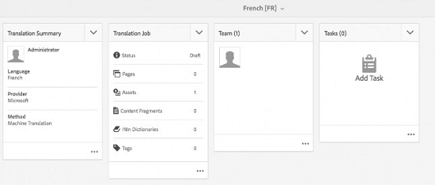

# Creación de proyectos de traducción {#creating-translation-projects}

Para crear una copia de idioma, active uno de los siguientes flujos de trabajo de copia de idioma disponibles en el carril Referencias de la interfaz de usuario de AEM.

* **Crear y traducir**:En este flujo de trabajo, los recursos que se van a traducir se copian en la raíz de idioma del idioma al que se desea traducir. Además, según las opciones que elija, se creará un proyecto de traducción para los recursos en la consola Proyectos. Según la configuración, el proyecto de traducción puede iniciarse manualmente o puede ejecutarse automáticamente en cuanto se cree el proyecto de traducción.

* **Actualizar copias** de idioma: Ejecute este flujo de trabajo para traducir un grupo adicional de recursos e incluirlo en una copia de idioma para una configuración regional concreta. En este caso, los recursos traducidos se agregan a la carpeta de destino que ya contiene recursos traducidos anteriormente.

>[!NOTE]
>
>Los binarios de recursos solo se traducen si el proveedor de servicios de traducción admite la traducción de binarios.

>[!NOTE]
>
>Si se inicia un flujo de trabajo de traducción para recursos complejos, como archivos PDF e InDesign, sus subrecursos o representaciones (si existen) no se envían para su traducción.

## Crear y traducir flujos de trabajo {#create-and-translate-workflow}

El flujo de trabajo de creación y traducción se utiliza para generar copias de idiomas para un idioma determinado por primera vez. El flujo de trabajo ofrece las siguientes opciones:

* Crear solo una estructura
* Crear un nuevo proyecto de traducción
* Añadir a un proyecto de traducción existente

### Crear solo una estructura {#create-structure-only}

Utilice la opción **[!UICONTROL Crear sólo]** estructura para crear una jerarquía de carpetas de destino dentro de la raíz del idioma de destino para que coincida con la jerarquía de la carpeta de origen dentro de la raíz del idioma de origen. En este caso, los recursos de origen se copian en la carpeta de destino. Sin embargo, no se genera ningún proyecto de traducción.

1. En la interfaz de usuario de Recursos, seleccione la carpeta de origen para la que desea crear una estructura en la raíz del idioma de destino.
1. Abra el panel **[!UICONTROL Referencias]** y toque o haga clic en **[!UICONTROL Copias]** de idioma en **[!UICONTROL Copias]**.

   

1. Toque o haga clic en **[!UICONTROL Crear y traducir]** en la parte inferior.

   

1. En la lista Idiomas **[!UICONTROL de]** destino, seleccione el idioma para el que desea crear una estructura de carpetas.

   

1. En la lista **[!UICONTROL Proyecto]** , elija **[!UICONTROL Crear estructura únicamente]**.

   

1. Click/tap **[!UICONTROL Create]**. La nueva estructura del idioma de destino se muestra en Copias **[!UICONTROL de idioma]**.

   

1. Toque o haga clic en la estructura de la lista y, a continuación, toque o haga clic en **[!UICONTROL Mostrar en recursos]** para desplazarse a la estructura de carpetas dentro del idioma de destino.

   

### Crear un nuevo proyecto de traducción {#create-a-new-translation-project}

Si utiliza esta opción, los recursos que se van a traducir se copian en la raíz del idioma en el que desea traducir. Según las opciones que elija, se creará un proyecto de traducción para los recursos en la consola Proyectos. Según la configuración, el proyecto de traducción se puede iniciar manualmente o automáticamente en cuanto se cree el proyecto de traducción.

1. En la interfaz de usuario de Recursos, seleccione la carpeta de origen para la que desea crear una copia de idioma.
1. Abra el panel **[!UICONTROL Referencias]** y toque o haga clic en **[!UICONTROL Copias]** de idioma en **[!UICONTROL Copias]**.

   

1. Toque o haga clic en **[!UICONTROL Crear y traducir]** en la parte inferior.

   

1. En la lista Idiomas **[!UICONTROL de]** destino, seleccione los idiomas para los que desea crear una estructura de carpetas.

   

1. En la lista **[!UICONTROL Proyecto]** , seleccione **[!UICONTROL Crear un nuevo proyecto]** de traducción.

   

1. En el campo Título **[!UICONTROL del]** proyecto, introduzca un título para el proyecto.

   

1. Click/tap **[!UICONTROL Create]**. Los recursos de la carpeta de origen se copian en las carpetas de destino para las configuraciones regionales seleccionadas en el paso 4.

   

1. Para desplazarse a la carpeta, seleccione la copia de idioma y haga clic en **[!UICONTROL Mostrar en recursos]**.

   

1. Vaya a la consola Proyectos. La carpeta de traducción se copia en la consola Proyectos.

   

1. Abra la carpeta para ver el proyecto de traducción.

   

1. Toque o haga clic en el proyecto para abrir la página de detalles.

   

1. Para ver el estado del trabajo de traducción, haga clic en los puntos suspensivos en la parte inferior del mosaico Trabajo **[!UICONTROL de]** traducción.

   

   Para obtener más información sobre los estados de los trabajos, consulte [Supervisión del estado de un trabajo](/help/sites-administering/tc-manage.md#monitoring-the-status-of-a-translation-job)de traducción.

1. Vaya a la interfaz de usuario de Recursos y abra la página Propiedades de cada uno de los recursos traducidos para ver los metadatos traducidos.

   

   >[!NOTE]
   >
   >Esta función está disponible para recursos y carpetas. Cuando se selecciona un recurso en lugar de una carpeta, se copia toda la jerarquía de carpetas hasta la raíz del idioma para crear una copia de idioma para el recurso.

### Añadir a un proyecto de traducción existente {#add-to-existing-translation-project}

Si utiliza esta opción, el flujo de trabajo de traducción se ejecuta para los recursos que agregue a la carpeta de origen después de ejecutar un flujo de trabajo de traducción anterior. Solo los recursos recién añadidos se copian en la carpeta de destino que contiene recursos traducidos anteriormente. En este caso no se crea ningún proyecto de traducción nuevo.

1. En la interfaz de usuario de Recursos, navegue a la carpeta de origen que contenga recursos sin traducir.
1. Seleccione un recurso que desee traducir y abra el panel **** Referencia. La sección Copias **[!UICONTROL de]** idioma muestra el número de copias de traducción disponibles en ese momento.
1. Toque o haga clic en **[!UICONTROL Copias]** de idioma en **[!UICONTROL Copias]**. Se muestra una lista de las copias de traducción disponibles.
1. Toque o haga clic en **[!UICONTROL Crear y traducir]** en la parte inferior.

   

1. En la lista Idiomas **[!UICONTROL de]** destino, seleccione los idiomas para los que desea crear una estructura de carpetas.

   

1. En la lista **[!UICONTROL Proyecto]** , seleccione **[!UICONTROL Agregar a proyecto]** de traducción existente para ejecutar el flujo de trabajo de traducción en la carpeta.

   

   >[!NOTE]
   >
   >Si selecciona la opción **[!UICONTROL Agregar a proyecto]** de traducción existente, el proyecto de traducción se agrega a un proyecto preexistente solo si la configuración del proyecto coincide exactamente con la del proyecto preexistente. De lo contrario, se crea un nuevo proyecto.

1. En la lista de proyectos **[!UICONTROL de traducción]** existentes, seleccione un proyecto para agregar el recurso para la traducción.

   

1. Click/tap **[!UICONTROL Create]**. Los recursos que se van a traducir se agregan a la carpeta de destino. La carpeta actualizada se muestra en la sección Copias **[!UICONTROL de]** idioma.

   

1. Vaya a la consola Proyectos y abra el proyecto de traducción existente que ha agregado.
1. Toque o haga clic en el proyecto de traducción para ver la página de detalles del proyecto.

   

1. Click/tap the ellipsis at the bottom of the **Translation Job** tile to view the assets in the translation workflow. En la lista de trabajos de traducción también se muestran las entradas para los metadatos y las etiquetas de los recursos. Estas entradas indican que los metadatos y las etiquetas de los recursos también se traducen.

   >[!NOTE]
   >
   >Si elimina la entrada de etiquetas o metadatos, no se traducirá ninguna etiqueta o metadatos para ninguno de los recursos.

   >[!NOTE]
   >
   >Si utiliza Traducción automática, los binarios de recursos no se traducen.

   >[!NOTE]
   >
   >Si el recurso que agrega al trabajo de traducción incluye subrecursos, selecciónelos y elimínelos para que la traducción continúe sin problemas.

1. Para iniciar la traducción de los recursos, toque o haga clic en la flecha del mosaico Trabajo **[!UICONTROL de]** traducción y seleccione **[!UICONTROL Iniciar]** en la lista.

   

   Un mensaje notifica el inicio del trabajo de traducción.

   

1. Para ver el estado del trabajo de traducción, toque o haga clic en los puntos suspensivos en la parte inferior del mosaico Trabajo **[!UICONTROL de]** traducción.

   

   Para obtener más información, consulte [Supervisión del estado de un trabajo](/help/sites-administering/tc-manage.md#monitoring-the-status-of-a-translation-job)de traducción.

1. Una vez finalizada la traducción, el estado cambia a Listo para revisar. Vaya a la interfaz de usuario de Recursos y abra la página Propiedades de cada uno de los recursos traducidos para ver los metadatos traducidos.

## Actualizar copias de idioma {#update-language-copies}

Ejecute este flujo de trabajo para traducir cualquier conjunto adicional de recursos e incluirlo en una copia de idioma para una configuración regional concreta. En este caso, los recursos traducidos se agregan a la carpeta de destino que ya contiene recursos traducidos anteriormente. Según la elección de opciones, se crea un proyecto de traducción o se actualiza un proyecto de traducción existente para los nuevos recursos. El flujo de trabajo Actualizar copias de idioma incluye las siguientes opciones:

* Crear un nuevo proyecto de traducción
* Añadir a un proyecto de traducción existente

### Crear un nuevo proyecto de traducción {#create-a-new-translation-project-1}

Si utiliza esta opción, se crea un proyecto de traducción para el conjunto de recursos para los que desea actualizar una copia de idioma.

1. En la interfaz de usuario de Recursos, seleccione la carpeta de origen en la que ha agregado un recurso.
1. Abra el panel **[!UICONTROL Referencias]** y toque o haga clic en Copias **[!UICONTROL de]** idioma en **[!UICONTROL Copias]** para mostrar la lista de copias de idioma.
1. Seleccione la casilla de verificación antes de **[!UICONTROL Copias]** de idioma y, a continuación, seleccione la carpeta de destino correspondiente a la configuración regional adecuada.

   

1. Toque o haga clic en **[!UICONTROL Actualizar copias]** de idioma en la parte inferior.

   

1. En la lista **[!UICONTROL Proyecto]** , elija **[!UICONTROL Crear un nuevo proyecto]** de traducción.

   

1. En el campo Título **[!UICONTROL del]** proyecto, introduzca un título para el proyecto.

   

1. Toque o haga clic en **[!UICONTROL Iniciar]**.
1. Vaya a la consola Proyectos. La carpeta de traducción se copia en la consola Proyectos.

   

1. Abra la carpeta para ver el proyecto de traducción.

   

1. Toque o haga clic en el proyecto para abrir la página de detalles.

   

1. Para iniciar la traducción de los recursos, haga clic en la flecha del mosaico Trabajo **[!UICONTROL de]** traducción y seleccione **[!UICONTROL Iniciar]** en la lista.

   

   Un mensaje notifica el inicio del trabajo de traducción.

   

1. Para ver el estado del trabajo de traducción, toque o haga clic en los puntos suspensivos en la parte inferior del mosaico Trabajo **[!UICONTROL de]** traducción.

   

   Para obtener más información sobre los estados de los trabajos, consulte [Supervisión del estado de un trabajo](../sites-administering/tc-manage.md#monitoring-the-status-of-a-translation-job)de traducción.

1. Vaya a la interfaz de usuario de Recursos y abra la página Propiedades de cada uno de los recursos traducidos para ver los metadatos traducidos.

### Añadir a un proyecto de traducción existente {#add-to-existing-translation-project-1}

Si utiliza esta opción, el conjunto de recursos se agrega a un proyecto de traducción existente para actualizar la copia de idioma de la configuración regional que elija.

1. En la interfaz de usuario de Recursos, seleccione la carpeta de origen en la que ha agregado una carpeta de recursos.
1. Abra el panel **** Referencias y toque o haga clic en Copias **[!UICONTROL de]** idioma en **[!UICONTROL Copias]** para mostrar la lista de copias de idioma.

   

1. Seleccione la casilla de verificación antes de **[!UICONTROL Copias]** de idioma, que selecciona todas las copias de idioma. Anule la selección de otras copias excepto la copia del idioma (copias) correspondiente a las configuraciones regionales a las que desea traducir.

   

1. Toque o haga clic en **[!UICONTROL Actualizar copias]** de idioma en la parte inferior.

   

1. En la lista **[!UICONTROL Proyecto]** , elija **[!UICONTROL Agregar a proyecto]** de traducción existente.

   

1. En la lista de proyectos **[!UICONTROL de traducción]** existentes, seleccione un proyecto para agregar el recurso para la traducción.

   

1. Toque o haga clic en **[!UICONTROL Iniciar]**.
1. Consulte los pasos 9 a 14 de [Agregar al proyecto](translation-projects.md#add-to-existing-translation-project) de traducción existente para completar el resto del procedimiento.

## Crear copias temporales de idioma {#creating-temporary-language-copies}

Cuando se ejecuta un flujo de trabajo de traducción para actualizar una copia de idioma con versiones editadas de los recursos originales, la copia de idioma existente se conserva hasta que se aprueban los recursos traducidos. AEM Assets almacena los recursos recién traducidos en una ubicación temporal y actualiza la copia de idioma existente después de aprobar explícitamente los recursos. Si rechaza los recursos, la copia de idioma permanece sin cambios.

1. Toque o haga clic en la carpeta raíz de origen en Copias **[!UICONTROL de]** idioma para la que ya ha creado una copia de idioma y, a continuación, toque o haga clic en **[!UICONTROL Mostrar en recursos]** para abrir la carpeta en Recursos AEM.

   

1. En la interfaz de usuario de Recursos, seleccione un recurso que ya haya traducido y toque o haga clic en el icono **[!UICONTROL Editar]** de la barra de herramientas para abrir el recurso en modo de edición.
1. Edite el recurso y guarde los cambios.
1. Realice los pasos 2 a 14 del procedimiento [Agregar al proyecto](#add-to-existing-translation-project) de traducción existente para actualizar la copia del idioma.
1. Toque o haga clic en los puntos suspensivos en la parte inferior del mosaico Trabajo **[!UICONTROL de]** traducción. En la lista de recursos de la página Trabajo **[!UICONTROL de]** traducción, puede ver claramente la ubicación temporal en la que se almacena la versión traducida del recurso.

   

1. Seleccione la casilla de verificación situada junto a **[!UICONTROL Título]**.
1. En la barra de herramientas, toque o haga clic en **[!UICONTROL Aceptar traducción]** y, a continuación, toque o haga clic en **[!UICONTROL Aceptar]** en el cuadro de diálogo para sobrescribir el recurso traducido en la carpeta de destino con la versión traducida del recurso editado.

   

   >[!NOTE]
   >
   >Para habilitar el flujo de trabajo de traducción para actualizar los recursos de destino, acepte tanto el recurso como los metadatos.

   Toque o haga clic en **[!UICONTROL Rechazar traducción]** para conservar la versión traducida originalmente del recurso en la raíz de configuración regional de destino y rechazar la versión editada.

   

1. Vaya a la consola Recursos y abra la página Propiedades de cada uno de los recursos traducidos para ver los metadatos traducidos.

Para obtener sugerencias sobre la traducción eficiente de metadatos para recursos, consulte [5 pasos para la traducción eficaz de metadatos](https://blogs.adobe.com/experiencedelivers/experience-management/translate_aemassets_metadata/).
