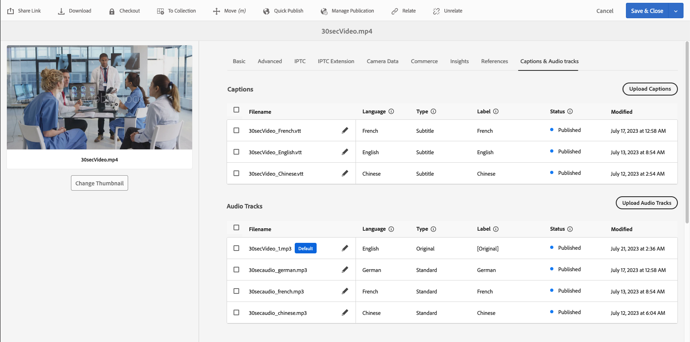
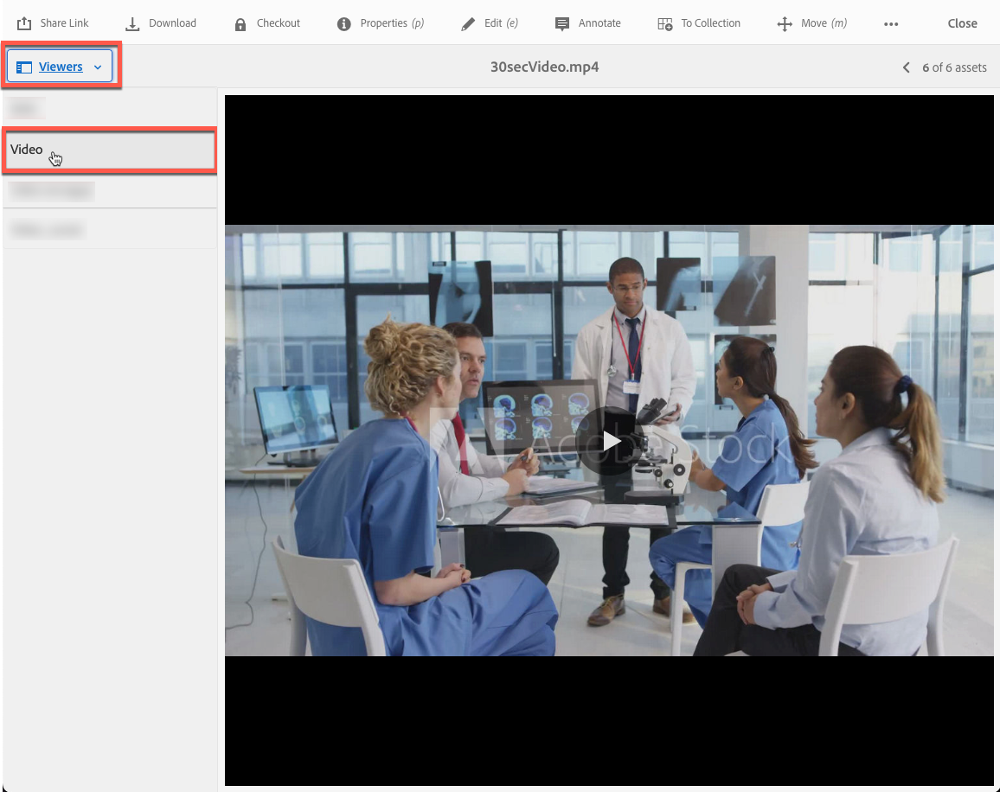

# Vídeo en Dynamic Media {#video}

En esta sección se describe el trabajo con vídeo en Dynamic Media.

## Inicio rápido: vídeos {#quick-start-videos}

La siguiente descripción paso a paso del flujo de trabajo se ha diseñado para ayudarle a ponerse en marcha rápidamente con los conjuntos de vídeos adaptables en Dynamic Media. Después de cada paso, hay referencias cruzadas a encabezados de temas donde puede encontrar más información.

>[!IMPORTANT]
>
>Antes de trabajar con vídeo en Dynamic Media, asegúrese de que su administrador de Adobe Experience Manager ya haya habilitado y configurado los Cloud Service de Dynamic Media en modo Dynamic Media - Scene7 o Dynamic Media - Hybrid.
>
>* Consulte [Configuración de Cloud Service de Dynamic Media](/help/assets/config-dms7.md#configuring-dynamic-media-cloud-services) en Configuración de Dynamic Media - Modo Scene7 y [Solución de problemas de Dynamic Media - Modo Scene7](/help/assets/troubleshoot-dms7.md).
>
>* Consulte [Configuración de Cloud Service de Dynamic Media](/help/assets/config-dynamic.md#configuring-dynamic-media-cloud-services) en Configuración de Dynamic Media - Modo híbrido.
>
>Problema actual de reproducción de vídeo conocido en Dynamic Media *solo en el Experience Manager 6.5.9.0*:
>
>* Si se actualiza un vídeo publicado, debe publicarse de nuevo para reflejar los cambios en la entrega.
>

1. **Cargue sus vídeos de Dynamic Media** haciendo lo siguiente:

   * Cree su propio perfil de codificación de vídeo. O bien, puede usar el perfil predefinido _Codificación de vídeo adaptable_ que se incluye con Dynamic Media.

      * [Crear un perfil de codificación de vídeo](/help/assets/video-profiles.md#creating-a-video-encoding-profile-for-adaptive-streaming).
      * Más información sobre [Prácticas recomendadas para la codificación de vídeo](#best-practices-for-encoding-videos).

   * Asocie el perfil de procesamiento de vídeo a una o varias carpetas en las que va a cargar los vídeos de origen principales.

      * [Aplicar un perfil de vídeo a las carpetas](/help/assets/video-profiles.md#applying-a-video-profile-to-folders).
      * Más información sobre [Prácticas recomendadas para organizar los recursos digitales con el fin de usar perfiles de procesamiento](/help/assets/organize-assets.md).
      * Más información sobre [Organizar recursos digitales](/help/assets/organize-assets.md).

   * Cargue los vídeos de origen principales en las carpetas. Al añadir vídeos a la carpeta, se codifican según el perfil de procesamiento de vídeo que haya asignado a la carpeta.

      * Dynamic Media admite principalmente vídeos de formato corto con una duración máxima de 30 minutos y una resolución mínima superior a 25 x 25.
      * Puede cargar archivos de vídeo de hasta 15 GB cada uno.
      * [Cargue sus vídeos](/help/assets/managing-video-assets.md#upload-and-preview-video-assets).
      * Más información sobre [Formatos de archivo de entrada compatibles](/help/assets/assets-formats.md#supported-multimedia-formats).

   * Supervise el progreso de la codificación de vídeo [1} desde la vista de recursos o de flujo de trabajo.](#monitoring-video-encoding-and-youtube-publishing-progress)

1. **Administre sus vídeos de Dynamic Media** mediante cualquiera de las acciones siguientes:

   * Organizar, examinar y buscar recursos de vídeo

      * [Organizar recursos digitales](/help/assets/organize-assets.md)
Obtenga más información acerca de las [prácticas recomendadas para organizar los recursos digitales con el fin de usar perfiles de procesamiento](organize-assets.md)

      * [Buscar recursos de vídeo](search-assets.md#custompredicates) o [Buscar recursos](/help/assets/search-assets.md)

   * Previsualización y publicación de recursos de vídeo

      * Vea el vídeo de origen y las representaciones codificadas del vídeo junto con sus miniaturas asociadas:
        [Previsualizar vídeos](managing-video-assets.md#upload-and-preview-video-assets) o [Previsualizar recursos](previewing-assets.md)
        [Ver representaciones de vídeo](video-renditions.md)
        [Administrar representaciones de vídeo](manage-assets.md#managing-renditions)

      * [Administrar ajustes preestablecidos de visor](managing-viewer-presets.md)
      * [Recursos de Publish](publishing-dynamicmedia-assets.md)

   * Trabajo con metadatos de vídeo

      * Vea las propiedades de una representación de vídeo codificada, como velocidad de fotogramas, velocidad de bits de audio y vídeo y códec:
        [Ver propiedades de representación de vídeo](video-renditions.md)

      * Edite las propiedades del vídeo, como el título, la descripción y las etiquetas, y campos de metadatos personalizados:
        [Editar propiedades de vídeo](manage-assets.md#editing-properties)

      * [Administración de metadatos para recursos digitales](metadata.md)
      * [Esquemas de metadatos](metadata-schemas.md)

   * Revise, apruebe y anote vídeos, y mantenga un control total de las versiones

      * [Anotar vídeos](managing-video-assets.md#annotate-video-assets) o [Anotar recursos](manage-assets.md#annotating)

      * [Crear una versión](manage-assets.md#asset-versioning)
      * [Aplicar flujos de trabajo a recursos](assets-workflow.md) o ver [Iniciar un flujo de trabajo en un recurso](manage-assets.md#starting-a-workflow-on-an-asset)

      * [Revisar recursos de carpeta](bulk-approval.md)
      * [Proyectos](../sites-authoring/projects.md)

1. **Publish sus vídeos de Dynamic Media** mediante una de las acciones siguientes:

   * Si utiliza Adobe Experience Manager como sistema de administración de contenido web, puede agregar vídeos directamente a las páginas web.

      * [Agregar vídeos a sus páginas web](adding-dynamic-media-assets-to-pages.md).

   * Si utiliza un sistema de administración de contenido web de terceros, puede vincular o incrustar vídeos a sus páginas web.

      * Integrar vídeo con URL:
        [Vincular URL a su aplicación web](linking-urls-to-yourwebapplication.md).

      * Integración de vídeo mediante código incrustado en una página web:
        [Incrustar el visor de vídeo en una página web](embed-code.md).

   * [Generar informes de vídeo](#viewing-video-reports).

   * [Agregar subtítulos al vídeo](#adding-captions-to-video).

## Trabajo con vídeo en Dynamic Media {#working-with-video-in-dynamic-media}

El vídeo en Dynamic Media es una solución completa que facilita la publicación de vídeos adaptables de alta calidad para su transmisión por streaming en varias pantallas, incluidas las de escritorio, las de iOS, las de Android™, las de BlackBerry® y las de dispositivos móviles con Windows. Un conjunto de vídeos adaptable agrupa versiones del mismo vídeo que se codifican a diferentes velocidades de bits y formatos, como 400 kbps, 800 kbps y 1000 kbps. El equipo de escritorio o dispositivo móvil detecta el ancho de banda disponible.

Por ejemplo, en un dispositivo móvil iOS, detecta un ancho de banda como 3G, 4G o Wi-Fi. A continuación, selecciona automáticamente el vídeo codificado correcto entre las distintas velocidades de bits de vídeo dentro del conjunto de vídeos adaptables. El vídeo se transmite a equipos de escritorio, dispositivos móviles o tabletas.

Además, la calidad de vídeo cambia automáticamente si las condiciones de red cambian en el escritorio o en el dispositivo móvil. Además, si un cliente entra en modo de pantalla completa en un equipo de escritorio, el conjunto de vídeos adaptable responde con una mejor resolución, lo que mejora la experiencia de visualización del cliente. El uso de conjuntos de vídeos adaptables proporciona la mejor reproducción posible para los clientes que reproducen vídeo de Dynamic Media en varias pantallas y dispositivos.

La lógica que utiliza un reproductor de vídeo para determinar qué vídeo codificado se reproducirá o seleccionará durante la reproducción se basa en el siguiente algoritmo:

1. El reproductor de vídeo carga el fragmento de vídeo inicial en función de la velocidad de bits más cercana al valor establecido para &quot;velocidad de bits inicial&quot; en el propio reproductor.
1. El reproductor de vídeo cambia según los cambios en la velocidad del ancho de banda según los siguientes criterios:

   1. El reproductor elige el flujo de ancho de banda más alto por debajo o igual al ancho de banda estimado.
   1. El reproductor considera solo el 80% del ancho de banda disponible. Sin embargo, si está subiendo, es más conservador en solo el 70% para evitar la sobreestimación y volver inmediatamente.

Para obtener información técnica detallada sobre el algoritmo, consulte [https://android.googlesource.com/platform/frameworks/av/+/master/media/libstagefright/httplive/LiveSession.cpp](https://android.googlesource.com/platform/frameworks/av/+/master/media/libstagefright/httplive/LiveSession.cpp)

Para administrar un solo vídeo y conjuntos de vídeos adaptables, se admite lo siguiente:

* Carga de vídeo desde numerosos formatos de vídeo y audio compatibles y codificación de vídeo al formato MP4 H.264 para su reproducción en varias pantallas. Puede utilizar ajustes preestablecidos de vídeo adaptables predefinidos, ajustes preestablecidos de codificación de vídeo únicos o personalizar su propia codificación para controlar la calidad y el tamaño del vídeo.

   * Cuando se genera un conjunto de vídeos adaptable, incluye vídeos MP4.
   * **Nota**: Los vídeos principal/de origen no se agregan a un conjunto de vídeos adaptable.

* Subtítulos de vídeo en todos los visores de vídeo de HTML5.
* Organice, examine y busque vídeos con compatibilidad total con metadatos para una administración eficaz de los recursos de vídeo.
* Ofrezca conjuntos de vídeos adaptables a la web y a equipos de escritorio y dispositivos móviles, incluidos iPhone, iPad, Android™, BlackBerry® y Windows Phone.

La transmisión de vídeo adaptable es compatible con varias plataformas de iOS. Consulte la [Guía de referencia de visores de Dynamic Media](https://experienceleague.adobe.com/docs/dynamic-media-developer-resources/library/viewers-aem-assets-dmc/video/c-html5-video-reference.html#video).

Dynamic Media admite la reproducción de vídeo móvil para vídeo MP4 H.264. <!-- LINK IS 404 WITH NO SUITABLE REPLACEMENT You can find BlackBerry&reg; devices that support this video format at the following: [Supported video formats on BlackBerry&reg;](https://support.blackberry.com/kb/articleDetail?ArticleNumber=000005482). -->

Puede encontrar dispositivos Windows compatibles con este formato de vídeo en: [Códecs multimedia compatibles con Windows Phone 8](https://learn.microsoft.com/en-us/windows/uwp/audio-video-camera/supported-codecs)

* Reproduzca el vídeo con los ajustes preestablecidos del visualizador de vídeo de Dynamic Media, incluidos los siguientes:

   * Visores de vídeo únicos.
   * Visores de medios mixtos que combinan contenido de vídeo e imagen.

* Configure reproductores de vídeo para satisfacer sus necesidades de marca.
* Integre vídeo en su sitio web, sitio móvil o aplicación móvil con una URL simple o código incrustado.

<!-- See [Dynamic video playback](https://s7d9.scene7.com/s7/uvideo.jsp?asset=GeoRetail/Mop_AVS&config=GeoRetail/Universal_Video1&stageSize=640,480) sample. -->

Consulte también [Visualizadores para Experience Manager Assets y Dynamic Media Classic](https://experienceleague.adobe.com/docs/dynamic-media-developer-resources/library/viewers-aem-assets-dmc/c-html5-s7-aem-asset-viewers.html#viewers-aem-assets-dmc) y [Visualizadores solo para recursos de Experience Manager](https://experienceleague.adobe.com/docs/dynamic-media-developer-resources/library/viewers-for-aem-assets-only/c-html5-aem-asset-viewers.html#viewers-for-aem-assets-only).

## Práctica recomendada: Uso del visualizador de vídeo HTML5 {#best-practice-using-the-html-video-viewer}

Los ajustes preestablecidos del visualizador de vídeo Dynamic Media HTML5 son reproductores de vídeo sólidos. Puede utilizarlas para evitar muchos problemas comunes asociados con la reproducción de vídeo de HTML5. Además, se han corregido problemas asociados con los dispositivos móviles, como la falta de entrega de flujo de bits adaptable y el limitado alcance del explorador de escritorio.

En el lado del diseño del reproductor, puede diseñar la funcionalidad del reproductor de vídeo con herramientas de desarrollo web estándar. Por ejemplo, puede diseñar los botones, los controles y el fondo de imagen de póster personalizado con HTML5 y CSS para ayudarle a llegar a sus clientes con un aspecto personalizado.

En la parte de reproducción del visor, detecta automáticamente la capacidad de vídeo del explorador. A continuación, sirve el vídeo mediante HLS (flujo en directo HTTP) o DASH (flujo adaptable dinámico a través de HTTP) , también conocido como flujo de velocidad de bits adaptable. O bien, si estos métodos de envío no están presentes, se utiliza HTML 5 progressive en su lugar.

Al combinar en un solo reproductor lo siguiente:

* La capacidad de diseñar los componentes de reproducción mediante HTML5 y CSS
* Tener reproducción incrustada
* Utilice flujo continuo adaptable y progresivo según la capacidad del explorador

Amplía el alcance del contenido multimedia enriquecido tanto para usuarios de equipos de escritorio como de dispositivos móviles y garantiza una experiencia de vídeo optimizada.

Ver también [Acerca de los visores de HTML 5](https://experienceleague.adobe.com/docs/dynamic-media-developer-resources/library/viewers-for-aem-assets-only/c-html5-aem-asset-viewers.html#viewers-for-aem-assets-only).

### Reproducción de vídeo en equipos de escritorio y dispositivos móviles mediante el visualizador de vídeo HTML5 {#playback-of-video-on-desktop-computers-and-mobile-devices-using-the-html-video-viewer}

En el caso de la transmisión de vídeo adaptable de escritorio y móvil, los vídeos utilizados para la conmutación de velocidad de bits se basan en todos los vídeos MP4 del conjunto de vídeos adaptable.

La reproducción de vídeo se produce mediante DASH o HLS o descarga de vídeo progresivo. En versiones anteriores de Experience Manager, como 6.0, 6.1 y 6.2, los vídeos se transmitían por HTTP.

En Experience Manager 6.3 y versiones posteriores, los vídeos se transmiten ahora por HTTPS (es decir, DASH o HLS) porque la URL del servicio de puerta de enlace DM siempre utiliza HTTPS. Este comportamiento predeterminado no afecta a los clientes. Es decir, la transmisión de vídeo siempre se produce a través de HTTPS a menos que el explorador no la admita. (Consulte la tabla siguiente). Por lo tanto,

* Si tiene un sitio web HTTPS con flujo de vídeo HTTPS, el flujo está bien.
* Si tiene un sitio web HTTP con flujo de vídeo HTTPS, el flujo está bien y no hay problemas de contenido mixto desde el explorador web.

DASH es el estándar internacional y HLS es un estándar de Apple. Ambos se utilizan para la transmisión de vídeo adaptable. Además, ambas tecnologías ajustan automáticamente la reproducción según la capacidad del ancho de banda de la red. También permite al cliente &quot;buscar&quot; cualquier punto del vídeo sin necesidad de esperar a que se descargue el resto del vídeo.

El vídeo progresivo se proporciona descargando y almacenando el vídeo localmente en el sistema de escritorio o el dispositivo móvil de un usuario.

En la tabla siguiente se describe el dispositivo, el navegador y el método de reproducción de vídeos en equipos de escritorio y dispositivos móviles mediante el Visor de vídeo de Dynamic Media.

<table>
 <tbody>
  <tr>
   <td><strong>Dispositivo</strong></td>
   <td><strong>Explorador</strong></td>
   <td><strong>Modo de reproducción de vídeo</strong></td>
  </tr>
  <tr>
   <td>Escritorio</td>
   <td>Internet Explorer 9 y 10</td>
   <td>Descarga progresiva.</td>
  </tr>
  <tr>
   <td>Escritorio</td>
   <td>Internet Explorer 11+</td>
   <td>En Windows 8 y Windows 10: forzar el uso de HTTPS siempre que se solicite DASH* o HLS. Limitación conocida: HTTP en DASH* o HLS no funciona en esta combinación de explorador/sistema operativo <br /> <br /> En Windows 7: descarga progresiva. Utiliza la lógica estándar para seleccionar el protocolo HTTP frente al protocolo HTTPS.</td>
  </tr>
  <tr>
   <td>Escritorio</td>
   <td>Firefox 23-44</td>
   <td>Descarga progresiva.</td>
  </tr>
  <tr>
   <td>Escritorio</td>
   <td>Firefox 45 o posterior</td>
   <td>Velocidad de bits adaptable DASH* o HLS.</td>
  </tr>
  <tr>
   <td>Escritorio</td>
   <td>Chrome</td>
   <td>Velocidad de bits adaptable DASH* o HLS.</td>
  </tr>
  <tr>
   <td>Escritorio</td>
   <td>Safari (Mac)</td>
   <td>Flujo de velocidad de bits adaptable HLS.</td>
  </tr>
  <tr>
   <td>Mobile</td>
   <td>Chrome (Android™ 6 o anterior)</td>
   <td>Descarga progresiva.</td>
  </tr>
  <tr>
   <td>Mobile</td>
   <td>Chrome (Android™ 7 o posterior)</td>
   <td>Velocidad de bits adaptable DASH* o HLS.</td>
  </tr>
  <tr>
   <td>Mobile</td>
   <td>Android™ (explorador predeterminado)</td>
   <td>Descarga progresiva.</td>
  </tr>
  <tr>
   <td>Mobile</td>
   <td>Safari (iOS)</td>
   <td>Flujo de velocidad de bits adaptable HLS.</td>
  </tr>
  <tr>
   <td>Mobile</td>
   <td>Chrome (iOS)</td>
   <td>Flujo de velocidad de bits adaptable HLS.</td>
  </tr>
  <tr>
   <td>Mobile</td>
   <td>BlackBerry®</td>
   <td>Velocidad de bits adaptable DASH* o HLS./td&gt;
  </tr>
 </tbody>
</table>

>[!IMPORTANT]
>
>*Para usar DASH para tus videos, primero debes habilitarlo en tu cuenta con el Soporte técnico de Adobe. Ver [Habilitar DASH en tu cuenta de Dynamic Media](#enable-dash).

## Arquitectura de la solución de vídeo de Dynamic Media {#architecture-of-dynamic-media-video-solution}

El siguiente gráfico muestra el flujo de trabajo general de creación de vídeos que se cargan y codifican mediante DMGateway (en modo híbrido de Dynamic Media) y que se ponen a disposición del público.


## Arquitectura de publicación híbrida para vídeos {#hybrid-publishing-architecture-for-videos}


## Prácticas recomendadas para codificar vídeos {#best-practices-for-encoding-videos}

El flujo de trabajo **Dynamic Media Encode Video** codifica el vídeo si ha activado Dynamic Media y ha configurado los servicios de nube de vídeo. Este flujo de trabajo captura el historial de procesos de flujo de trabajo y la información de errores. Si ha habilitado Dynamic Media y ha configurado los servicios de nube de vídeo, el flujo de trabajo **[!UICONTROL Dynamic Media Encode Video]** surte efecto automáticamente al cargar un vídeo. (Si no usa Dynamic Media, el flujo de trabajo **[!UICONTROL Recurso de actualización DAM]** surte efecto).

<!-- DEAD The following are best-practice tips for encoding source video files.

For advice about video encoding, see [Video Encoding Basics](https://www.adobe.com/go/learn_s7_encoding_en).

* [Streaming 101: The Basics — Codecs, Bandwidth, Data Rate, and Resolution](https://www.adobe.com/go/learn_s7_streaming101_en). -->

### Archivos de vídeo de Source {#source-video-files}

Cuando codifique un archivo de vídeo, utilice un archivo de vídeo de origen de la máxima calidad posible. Evite utilizar archivos de vídeo codificados anteriormente porque estos archivos ya están comprimidos y una codificación posterior crea un vídeo de calidad inferior.

* Dynamic Media admite principalmente vídeos de formato corto con una duración máxima de 30 minutos y una resolución mínima superior a 25 x 25.
* Puede cargar archivos de vídeo de origen principales de hasta 15 GB cada uno.

En la tabla siguiente se describe el tamaño recomendado, la relación de aspecto y la velocidad de bits mínima que deben tener los archivos de vídeo de origen antes de codificarlos:

| Tamaño | Proporción de aspecto | Velocidad de bits mínima |
|--- |--- |--- |
| 1024 X 768 | 4:3 | 4500 Kbps para la mayoría de los vídeos. |
| 1280 X 720 | 16:9 | 3000 - 6000 kbps, dependiendo de la cantidad de movimiento en el vídeo. |
| 1920 X 1080 | 16:9 | 6.000 a 8.000 kbps, en función de la cantidad de movimiento del vídeo. |

### Obtener los metadatos de un archivo {#obtaining-a-file-s-metadata}

Puede obtener los metadatos de un archivo visualizando sus metadatos mediante una herramienta de edición de vídeo o utilizando una aplicación diseñada para obtener metadatos. A continuación se indican instrucciones para utilizar MediaInfo, una aplicación de terceros, para obtener los metadatos de un archivo de vídeo:

1. Ir a [Descarga de MediaInfo](https://mediaarea.net/en/MediaInfo/Download).
1. Seleccione y descargue el instalador para la versión GUI y siga las instrucciones de instalación.
1. Después de la instalación, haga clic con el botón derecho en el archivo de vídeo (solo Windows) y seleccione MediaInfo o abra MediaInfo y arrastre el archivo de vídeo a la aplicación. Verá todos los metadatos asociados con el archivo de vídeo, incluidos el ancho, el alto y los fps.

### Proporción de aspecto {#aspect-ratio}

Cuando elija o cree un ajuste preestablecido de codificación de vídeo para el archivo de vídeo de origen principal, asegúrese de que el ajuste preestablecido tenga la misma proporción de aspecto que el archivo de vídeo de origen principal. La relación de aspecto es la relación entre la anchura y la altura del vídeo.

Para determinar la proporción de aspecto de un archivo de vídeo, obtenga los metadatos del archivo y anote la anchura y altura del archivo (consulte Obtención de metadatos de un archivo más arriba). A continuación, utilice esta fórmula para determinar la relación de aspecto:

anchura/altura = proporción de aspecto

En la tabla siguiente se describe cómo se traducen los resultados de la fórmula en opciones de relación de aspecto comunes:

| Resultado de fórmula | Proporción de aspecto |
|--- |--- |
| 1,33 | 4:3 |
| 0,75 | 3:4 |
| 1,78 | 16:9 |
| 0,56 | 09:16 |

Por ejemplo, un vídeo de 1440 anchura x 1080 altura tiene una relación de aspecto de 1440/1080 o 1,33. En este caso, elija un ajuste preestablecido de codificación de vídeo con una relación de aspecto de 4:3 para codificar el archivo de vídeo.

### Velocidad de bits {#bitrate}

La velocidad de bits es la cantidad de datos codificados para formar un segundo de reproducción de vídeo. La velocidad de bits se mide en kilobits por segundo (Kbps).

>[!NOTE]
>
>Como todos los códecs utilizan compresión con pérdida, la velocidad de bits es el factor más importante en la calidad del vídeo. Con la compresión con pérdida, cuanto más comprime un archivo de vídeo, más se degrada la calidad. Por este motivo, si todas las demás características son iguales (resolución, velocidad de fotogramas y códec), cuanto menor sea la velocidad de bits, menor será la calidad del archivo comprimido.

Al seleccionar una codificación de velocidad de bits, puede elegir entre dos tipos:

* **[!UICONTROL Codificación de velocidad de bits constante]** (CBR): durante la codificación CBR, la velocidad de bits o el número de bits por segundo se mantiene igual durante todo el proceso de codificación. La codificación CBR conserva la velocidad de datos establecida en su configuración durante todo el vídeo. Además, la codificación CBR no optimiza los archivos multimedia para la calidad, pero ahorra espacio de almacenamiento.
Utilice CBR si el vídeo contiene un nivel de movimiento similar en todo el vídeo. CBR se utiliza comúnmente para el contenido de vídeo de streaming. Consulte también [Usar parámetros personalizados de codificación de vídeo](/help/assets/video-profiles.md#using-custom-added-video-encoding-parameters).

* **[!UICONTROL Codificación de velocidad de bits variable]** (VBR): la codificación VBR ajusta la velocidad de datos hacia abajo y hasta el límite superior establecido, según los datos requeridos por el compresor. Esta funcionalidad significa que durante un proceso de codificación VBR la velocidad de bits del archivo multimedia aumenta o disminuye dinámicamente según las necesidades de velocidad de bits de los archivos multimedia.
VBR tarda más en codificarse, pero produce los resultados más favorables; la calidad del archivo multimedia es superior. VBR se utiliza comúnmente para la entrega progresiva de contenido de vídeo http.

¿Cuándo se utiliza VBR o CRB?
Al seleccionar VBR en comparación con CBR, casi siempre se recomienda utilizar VBR para los archivos multimedia. VBR proporciona archivos de mayor calidad a velocidades de bits competitivas. Cuando utilice VBR, asegúrese de utilizar con codificación de dos pasos y establezca la velocidad de bits máxima en 1,5 veces la velocidad de bits de vídeo de destino.

Al elegir un ajuste preestablecido de codificación de vídeo, recuerde la velocidad de conexión del usuario final de destino. Elija un ajuste preestablecido con una velocidad de datos del 80 % de esa velocidad. Por ejemplo, si la velocidad de conexión del usuario final de destino es de 1000 Kbps, el mejor ajuste preestablecido es uno con una velocidad de datos de vídeo de 800 Kbps.

En esta tabla se describe la velocidad de datos de las velocidades de conexión típicas.

| Velocidad (Kbps) | Tipo de conexión |
|--- |--- |
| 256 | Conexión de acceso telefónico. |
| 800 | Conexión móvil típica. Para esta conexión, establezca como objetivo una velocidad de datos en el rango de 400 a un máximo de 800 para experiencias 3G. |
| 2000 | Conexión de escritorio de banda ancha típica. Para esta conexión, establezca como objetivo una velocidad de datos en el rango de 800-2000 Kbps, con un promedio de la mayoría de los objetivos de 1200-1500 Kbps. |
| 5000 | Conexión típica de banda ancha alta. No se recomienda la codificación en este rango superior porque la mayoría de los consumidores no pueden acceder a la entrega de vídeo a esta velocidad. |

### Resolución {#resolution}

**Resolución** describe la altura y anchura de un archivo de vídeo en píxeles. La mayor parte del vídeo de origen se almacena en alta resolución (por ejemplo, 1920 x 1080). Para fines de streaming, el vídeo de origen se comprime con una resolución más pequeña (640 x 480 o menor).

La resolución y la velocidad de datos son dos factores integrados que determinan la calidad del vídeo. Para mantener la misma calidad de vídeo, cuanto mayor sea el número de píxeles de un archivo de vídeo (mayor será la resolución), mayor deberá ser la velocidad de datos. Por ejemplo, considere el número de píxeles por fotograma en una resolución de 320 x 240 y un archivo de vídeo de resolución de 640 x 480:

| Resolución | Píxeles por cuadro |
|--- |--- |
| 320 x 240 | 76.800 |
| 640 x 480 | 307.200 |

El archivo de 640 x 480 tiene cuatro veces más píxeles por fotograma. Para lograr la misma velocidad de datos para estas dos resoluciones de ejemplo, se aplica cuatro veces la compresión al archivo de 640 x 480, lo que puede reducir la calidad del vídeo. Por lo tanto, una velocidad de datos de vídeo de 250 Kbps produce una visualización de alta calidad con una resolución de 320 x 240, pero no con una resolución de 640 x 480.

En general, cuanto mayor sea la velocidad de datos que utilice, mejor será el aspecto del vídeo y, cuanto mayor sea la resolución que utilice, mayor será la velocidad de datos que deberá mantener la calidad de visualización (en comparación con resoluciones más bajas).

Como la resolución y la velocidad de datos están vinculadas, tiene dos opciones al codificar vídeo:

* Elija una velocidad de datos y, a continuación, codifique con la resolución más alta que se vea bien en la velocidad de datos elegida.
* Elija una resolución y codifique a la velocidad de datos necesaria para conseguir vídeo de alta calidad con la resolución que elija.

Cuando elija (o cree) un ajuste preestablecido de codificación de vídeo para el archivo de vídeo de origen principal, utilice esta tabla para seleccionar la resolución correcta:

| Resolución | Altura (píxeles) | Tamaño de pantalla |
|--- |--- |--- |
| 240p | 240 | Pantalla pequeña |
| 300p | 300 | Pantalla pequeña normalmente para dispositivos móviles |
| 360p | 360 | Pantalla pequeña |
| 480p | 480 | pantalla de Medium |
| 720p | 720 | Pantalla grande |
| 1080p | 1080 | Pantalla grande de alta definición |

### Fps (fotogramas por segundo) {#fps-frames-per-second}

En Estados Unidos y Japón, la mayoría de los vídeos se graban a 29,97 fotogramas por segundo (fps); en Europa, la mayoría de los vídeos se graban a 25 fps. La película se filma a 24 fps.

Elija un ajuste preestablecido de codificación de vídeo que coincida con la velocidad de fps del archivo de vídeo de origen principal. Por ejemplo, si el vídeo de origen principal es de 25 fps, elija un ajuste preestablecido de codificación con 25 fps. De forma predeterminada, toda la codificación personalizada utiliza el fps del archivo de vídeo de origen principal. Por este motivo, no es necesario especificar explícitamente la configuración de fps al crear un ajuste preestablecido de codificación de vídeo.

### Dimensiones de codificación de vídeo {#video-encoding-dimensions}

Para obtener resultados óptimos, seleccione dimensiones de codificación de modo que el vídeo de origen sea un múltiplo completo de todos los vídeos codificados.

Para calcular esta proporción, se divide el ancho de origen por el ancho codificado para obtener la proporción de ancho. A continuación, se divide la altura de origen por la altura codificada para obtener la relación de altura.

Si la proporción resultante es un entero, significa que el vídeo se escala de forma óptima. Si la proporción resultante no es un entero, afecta a la calidad del vídeo al dejar artefactos de píxeles sobrantes en la pantalla. Este efecto es más evidente cuando el vídeo tiene texto.

Por ejemplo, supongamos que el vídeo de origen es de 1920 x 1080. En la tabla siguiente, los tres vídeos codificados proporcionan la configuración de codificación óptima para utilizar.

| Tipo de vídeo | Anchura x altura | Proporción de anchura | Proporción de altura |
|--- |--- |--- |--- |
| Origen | 1920 x 1080 | 1 | 1 |
| Codificado | 960 x 540 | 2 | 2 |
| Codificado | 640 x 360 | 3 | 3 |
| Codificado | 480 x 270 | 4 | 4 |

### Formato de archivo de vídeo codificado {#encoded-video-file-format}

Dynamic Media recomienda utilizar ajustes preestablecidos de codificación de vídeo MP4 H.264. Como los archivos MP4 utilizan el códec de vídeo H.264, proporciona vídeo de alta calidad pero en un tamaño de archivo comprimido.

### Habilite la compatibilidad con DASH, subtítulos múltiples y pistas de audio en su cuenta de Dynamic Media {#enable-dash}

**Acerca de habilitar DASH en tu cuenta**
DASH (Digital Adaptive Streaming over HTTP) es el estándar internacional para streaming de video y es ampliamente adoptado en diferentes visores de video. Cuando DASH está habilitado en su cuenta, tiene la opción de elegir entre DASH o HLS para flujo de vídeo adaptable. O bien, puede optar por ambos con el cambio automático entre reproductores cuando **[!UICONTROL auto]** está seleccionado como el tipo de reproducción en el ajuste preestablecido del visor.

Algunas ventajas clave de habilitar DASH en su cuenta son las siguientes:

* Empaquete el vídeo de flujo DASH para la transmisión de velocidad de bits adaptable. Este método aumenta la eficacia del envío. El streaming adaptable garantiza la mejor experiencia de visualización para sus clientes.
* El streaming optimizado para el navegador con reproductores Dynamic Media cambia entre el streaming HLS y DASH para garantizar la mejor calidad de servicio. El reproductor de vídeo cambia automáticamente a HLS cuando se utiliza un explorador Safari.
* Puede configurar su método de flujo preferido (HLS o DASH) editando el ajuste preestablecido del visualizador de vídeo.
* La codificación de vídeo optimizada garantiza que no se utilice almacenamiento adicional al habilitar la capacidad DASH. Se crea un único conjunto de codificaciones de vídeo para HLS y DASH para optimizar los costes de almacenamiento de vídeo.
* Ayuda a que la entrega de vídeo sea más accesible para los clientes.
* Obtenga también la URL de flujo continuo mediante API.

Para habilitar DASH en su cuenta de, se requieren dos pasos:

* Configuración de Dynamic Media para utilizar DASH, que puede realizar fácilmente.
* Configuración de Experience Manager 6.5 para utilizar DASH, que se realiza mediante un caso de Asistencia al cliente de Adobe que crea y envía.

**Acerca de habilitar la compatibilidad con múltiples subtítulos y pistas de audio en tu cuenta**

Al mismo tiempo que crea un caso de Soporte de Adobe para tener DASH habilitado en su cuenta, también se beneficia de tener múltiples subtítulos y soporte de pista de audio habilitado automáticamente. Después de la activación, todos los vídeos posteriores que cargue se procesarán con una nueva arquitectura de back-end que incluya compatibilidad para agregar varios subtítulos y pistas de audio a los vídeos.

>[!IMPORTANT]
>
>Cualquier vídeo que hayas subido *antes de* y que habilites la compatibilidad con múltiples subtítulos y pistas de audio en tu cuenta de Dynamic Media, [debe volver a procesarse](/help/assets/processing-profiles.md#reprocessing-assets). Este paso de reprocesamiento de vídeo es necesario para que tengan disponibles múltiples subtítulos y pistas de audio. Las direcciones URL del vídeo siguen funcionando y reproduciéndose como de costumbre, después del reprocesamiento.

**Para habilitar la compatibilidad con DASH, subtítulos múltiples y pistas de audio múltiples en tu cuenta de Dynamic Media:**

<!-- 1. **Configure Dynamic Media for DASH** - In Dynamic Media on Experience Manager 6.5, navigate to [https://localhost:4502/system/console/configMgr](https://localhost:4502/system/console/configMgr).

1. Search for **AEM Assets Dynamic Media Video Advanced Streaming** feature flag.
1. To enable (turn on) DASH, select the checkbox. -->
1. Comience por **configurar Dynamic Media para DASH** - Desde el Experience Manager, vaya a **[!UICONTROL Herramientas]** > **[!UICONTROL Operaciones]** > **[!UICONTROL Consola web]**.

1. Desde la página **[!UICONTROL Configuración de la consola web de Adobe Experience Manager]**, desplácese hasta el nombre *Marca de característica de transmisión avanzada de vídeo de AEM Assets Dynamic Media*.

1. A la izquierda del nombre, seleccione la casilla de verificación para activar DASH.

1. Seleccione **[!UICONTROL Guardar]**.

1. Ahora [use el Admin Console para iniciar la creación de un nuevo caso de soporte](https://helpx.adobe.com/es/enterprise/using/support-for-experience-cloud.html).
1. Para crear un caso de soporte, siga las instrucciones y asegúrese de proporcionar la siguiente información:

   * Nombre del contacto principal, correo electrónico, teléfono.
   * Nombre de su cuenta de Dynamic Media.
   * Especifique que desea que DASH, la compatibilidad con varios subtítulos y pistas de audio múltiples estén habilitados en su cuenta de Dynamic Media, en Experience Manager 6.5.

1. La Asistencia al cliente de Adobe le agrega a la Lista de espera de clientes en función del orden en que se envían las solicitudes.
1. Cuando el Adobe está listo para administrar su solicitud, el Servicio de atención al cliente se pone en contacto con usted para coordinar y establecer una fecha objetivo para la activación.
1. Se le notificará una vez que el Servicio de atención al cliente lo haya completado.
1. Ahora puede realizar una de las siguientes acciones:

   * Cree su [ajuste preestablecido de visor de vídeo](/help/assets/managing-viewer-presets.md#creating-a-new-viewer-preset) como de costumbre.
   * [Agregue varios subtítulos y pistas de audio](#add-msma) al vídeo.

## Ver informes de vídeo {#viewing-video-reports}

>[!NOTE]
>
>Los informes de vídeo solo están disponibles cuando se ejecuta Dynamic Media en modo híbrido.

Los informes de vídeo muestran varias métricas agregadas a lo largo de un tiempo especificado para ayudarle a supervisar que los vídeos individuales y agregados de *publicados* funcionan según lo esperado. Los siguientes datos de métricas principales se agregan para todos los vídeos publicados en todo el sitio web:

* Inicios de vídeo
* Tasa de finalización
* Promedio de tiempo en vídeo
* Tiempo total en vídeo
* Vídeos por visita

También se muestra una tabla con todos los *vídeos publicados* para que puedas rastrear los vídeos más vistos en tu sitio web en función del total de inicios de vídeo.

Al seleccionar un nombre de vídeo en la lista, se muestra el informe de retención de audiencia (menú desplegable) del vídeo en forma de gráfico de líneas. El gráfico muestra el número de vistas durante un momento determinado de la reproducción de vídeo. Cuando reproduce el vídeo, la barra vertical rastrea en sincronización con el indicador de tiempo del reproductor. Las caídas en los datos del gráfico de líneas indican dónde cae la audiencia debido al desinterés.

Si el vídeo se ha codificado fuera de Adobe Experience Manager Dynamic Media, el gráfico de retención de audiencia (menú desplegable) y los datos del porcentaje de reproducción de la tabla no están disponibles.

Consulte también [Configuración de Cloud Service de Dynamic Media](/help/assets/config-dynamic.md).

>[!NOTE]
>
>Los datos de seguimiento y creación de informes se basan exclusivamente en el uso del reproductor de vídeo propio de Dynamic Media y del ajuste preestablecido del reproductor de vídeo asociado. Como tal, no puede rastrear vídeos reproducidos mediante otros reproductores de vídeo ni informar sobre ellos.

De forma predeterminada, la primera vez que se acceden a Informes de vídeo, el informe muestra los datos de vídeo a partir del primer día del mes en curso y termina con la fecha del mes actual. Sin embargo, puede anular el intervalo de fechas predeterminado especificando su propio intervalo de fechas. La próxima vez que acceda a Informes de vídeo, se utilizará el intervalo de fechas especificado.

Para que los informes de vídeo funcionen correctamente, se crea automáticamente una ID de grupo de informes al configurar los Cloud Service de Dynamic Media. Al mismo tiempo, el ID del grupo de informes se inserta en el servidor de Publish para que esté disponible para la función Copiar URL al obtener una vista previa de los recursos. Sin embargo, esta funcionalidad requiere que el servidor de Publish ya esté configurado. Si el servidor de Publish no está configurado, aún puede publicar para ver el informe de vídeo. Sin embargo, debe volver a la configuración de Dynamic Media Cloud y seleccionar **[!UICONTROL Aceptar]**.

**Para ver informes de vídeo:**

1. En la esquina superior izquierda de Experience Manager, seleccione el logotipo del Experience Manager y, a continuación, en el carril izquierdo, seleccione **[!UICONTROL Herramientas]** (icono de martillo) > **[!UICONTROL Assets]** > **[!UICONTROL Informes de vídeo]**.
1. En la página Informes de vídeo, realice una de las siguientes acciones:

   * Cerca de la esquina superior derecha, selecciona el icono **Actualizar informe de vídeo**.
Utilice Actualizar solo si la fecha de finalización del informe es el día actual. Al hacerlo, se asegura de ver el seguimiento de vídeo que se ha producido desde la última vez que se ejecutó el informe.

   * Cerca de la esquina superior derecha, seleccione el icono **Selector de fecha**.
Especifique el intervalo de fechas inicial y final para el que desea obtener datos de vídeo y, a continuación, seleccione **[!UICONTROL Ejecutar informe]**.

   El cuadro de grupo Métricas principales identifica varias mediciones agregadas de todos los *vídeos publicados* en el sitio.

1. En la tabla que muestra los vídeos más publicados, seleccione un nombre de vídeo para reproducir el vídeo y también consulte el informe de retención de audiencia (lista desplegable) del vídeo.

### Vea informes de vídeo basados en un visor de vídeo que ha creado mediante el SDK de visualizador de Dynamic Media HTML5 {#viewing-video-reports-based-on-a-video-viewer-that-you-created-using-the-scene-hmtl-viewer-sdk}

Si utiliza un visualizador de vídeo incorporado que proporciona Dynamic Media, o si ha creado un ajuste preestablecido de visualizador personalizado basado en un visualizador de vídeo incorporado, no se requieren pasos adicionales para ver informes de vídeo. Sin embargo, si ha creado su propio visor de vídeo basado en la API del SDK de HTML5 Viewer, siga estos pasos para asegurarse de que su visor de vídeo envía eventos de seguimiento a los informes de vídeo de Dynamic Media.

Use la [Guía de referencia de visores de Dynamic Media de Adobe](https://experienceleague.adobe.com/docs/dynamic-media-developer-resources.html) y la [API de SDK de visores de HTML5](https://s7d1.scene7.com/s7sdk/3.10/docs/jsdoc/index.html) para crear sus propios visores de vídeo.

**Para ver informes de vídeo basados en un visor de vídeo que creó mediante el SDK de visor de Dynamic Media HTML5:**

1. Vaya a cualquier recurso de vídeo publicado.
1. Junto a la esquina superior izquierda de la página del recurso, en la lista desplegable, seleccione **[!UICONTROL Visualizadores]**.
1. Seleccione cualquier ajuste preestablecido del visualizador de vídeo y copie el código incrustado.
1. En el código incrustado de, busque la línea con lo siguiente:

   `videoViewer.setParam("config2", "<value>");`

   El parámetro `config2` habilita el seguimiento en visualizadores de HTML5. También es un ajuste preestablecido específico de la empresa que contiene la información de configuración de los informes de vídeo y de las configuraciones de Adobe Analytics específicas del cliente.

   El valor correcto del parámetro config2 se encuentra tanto en el **[!UICONTROL Código incrustado]** como en la función de copia **[!UICONTROL URL]**. En la dirección URL del comando Copiar **[!UICONTROL URL]**, el parámetro que se busca es `&config2=<value>` El valor es casi siempre `companypreset`, pero en algunos casos también puede ser `companypreset-1`, `companypreset-2`, etc.

1. En el código personalizado del visor de vídeo, agregue AppMeasurementBridge .jsp a la página del visor haciendo lo siguiente:

   * Primero, determine si necesita el parámetro `&preset`.

     Si el parámetro `config2` es `companypreset`, usted hace *no* necesita `&preset=parameter`.

     Si `config2` es cualquier otra cosa, establezca el mismo parámetro preestablecido que el parámetro `config2`. Por ejemplo, si `config2=companypreset-2`, agregue `&param2=companypreset-2` a la dirección URL AppMeasurementBridge.jsp.

   * A continuación, agregue el script AppMeasurementBridge.jsp:

     `<script language="javascript" type="text/javascript" src="https://s7d1.scene7.com/s7viewers/AppMeasurementBridge.jsp?company=robindallas&preset=companypreset-2"></script>`

1. Cree el componente TrackingManager haciendo lo siguiente:

   * Después de llamar a `s7sdk.Util.init();`, cree una instancia de TrackingManager para realizar el seguimiento de eventos agregando lo siguiente:

     `var trackingManager = new s7sdk.TrackingManager();`

   * Para conectar componentes a TrackingManager, haga lo siguiente:

     En el controlador de eventos `s7sdk.Event.SDK_READY`, adjunte el componente que desee rastrear a TrackingManager.

     Por ejemplo, si el componente es `videoPlayer`, agregue

     `trackingManager.attach(videoPlayer);`

     para adjuntar el componente al trackingManager. Para rastrear varios visualizadores en una página, utilice varios componentes del administrador de seguimiento.

   * Cree el objeto AppMeasurementBridge agregando lo siguiente:

     ```
     var appMeasurementBridge = new AppMeasurementBridge(); appMeasurementBridge.setVideoPlayer(videoPlayer);
     ```

   * Añada la función de seguimiento añadiendo lo siguiente:

     ```
     trackingManager.setCallback(appMeasurementBridge.track, 
      appMeasurementBridge);
     ```

   El objeto appMeasurementBridge tiene una función de seguimiento integrada. Sin embargo, puede proporcionar los suyos propios para admitir varios sistemas de seguimiento u otras funciones.

<!--    For more information, see *Using the TrackingManager Component* in the *Scene7 HTML5 Viewer SDK User Guide* available for download from [Adobe Developer Connection](https://help.adobe.com/en_US/scene7/using/WSef8d5860223939e2-43dedf7012b792fc1d5-8000.html). -->


## Acerca de la compatibilidad con varios subtítulos y pistas de audio para vídeos en Dynamic Media{#about-msma}

Con la capacidad de varios subtítulos y pistas de audio de Dynamic Media, puede añadir fácilmente varios subtítulos y pistas de audio a un vídeo principal. Esta posibilidad significa que los vídeos son accesibles para todo el público global. Puede personalizar un solo vídeo principal publicado para un público global en varios idiomas y seguir las directrices de accesibilidad para diferentes regiones geográficas. Los autores también pueden administrar los subtítulos y las pistas de audio desde una sola pestaña en la interfaz de usuario.



Algunos de los casos de uso que se deben tener en cuenta para agregar varios subtítulos y pistas de audio al vídeo principal son los siguientes:

| Tipo | Caso de uso |
|--- |--- |
| **Subtítulos** | Compatibilidad con varios idiomas |
|  | Texto descriptivo para accesibilidad |
| **Pistas de audio** | Compatibilidad con varios idiomas |
|  | Pistas de comentarios |
|  | Audio descriptivo |

Todos los [formatos de vídeo admitidos en Dynamic Media](/help/assets/assets-formats.md) y todos los visores de vídeo de Dynamic Media, excepto el visor de *Video_360* de Dynamic Media, son compatibles para su uso con varios subtítulos y pistas de audio.

La capacidad de seguimiento de audio y subtítulos múltiples está disponible para su cuenta de Dynamic Media mediante una opción de función que debe habilitar (activar) la Asistencia al cliente de Adobe.

### Añada varias pistas de subtítulos y audio al vídeo {#add-msma}

Antes de agregar varias pistas de subtítulos y audio al vídeo, asegúrese de que ya dispone de lo siguiente:

* Dynamic Media AEM se configura en un entorno de.
* Se ha aplicado un perfil de [Dynamic Media Video a la carpeta donde se han ingerido sus vídeos](/help/assets/video-profiles.md#applying-a-video-profile-to-folders).
* [Se han habilitado varios subtítulos y pistas de audio en tu cuenta de Dynamic Media](#enable-dash).

Los subtítulos y subtítulos añadidos son compatibles con los formatos WebVTT y VTT de Adobe. Además, los archivos de pista de audio añadidos son compatibles con el formato MP3.

>[!IMPORTANT]
>
>Cualquier vídeo que hayas subido *antes de* y que habilites la compatibilidad con múltiples subtítulos y pistas de audio en tu cuenta de Dynamic Media, [debe volver a procesarse](/help/assets/processing-profiles.md#reprocessing-assets). Este paso de reprocesamiento de vídeo es necesario para que tengan disponibles múltiples subtítulos y pistas de audio. Las direcciones URL del vídeo siguen funcionando y reproduciéndose como de costumbre, después del reprocesamiento.

**Para agregar varios subtítulos y pistas de audio al vídeo:**

1. [Cargue el vídeo principal en una carpeta](/help/assets/managing-video-assets.md#upload-and-preview-video-assets) que ya tenga un perfil de vídeo asignado.
1. Desplácese hasta el recurso de vídeo cargado al que desee agregar varias pistas de subtítulos y audio.
1. En el modo de selección de recursos, ya sea en la vista de lista o en la vista de tarjeta, seleccione el recurso de vídeo.
1. En la barra de herramientas, seleccione el icono Propiedades (un círculo con una &quot;i&quot;).
   *Recurso de vídeo seleccionado en la vista de tarjeta.*
1. En la página Propiedades del vídeo, seleccione la ficha **[!UICONTROL Subtítulos y pistas de audio]**.

   >[!TIP]
   >Si no ve la ficha **[!UICONTROL Subtítulos y pistas de audio]**, significa una de estas dos cosas:
   >
   >* La carpeta en la que reside el vídeo seleccionado no tiene asignado un perfil de vídeo. En cuyo caso, consulte [Aplicar un perfil de vídeo a la carpeta](/help/assets/video-profiles.md#applying-video-profiles-to-specific-folders).
   >* O bien, Dynamic Media debe volver a procesar el vídeo. En cuyo caso, consulte [Volver a procesar recursos en una carpeta](/help/assets/processing-profiles.md#reprocessing-assets).
   >
   >Cuando haya completado cualquiera de las tareas anteriores, vuelva a estos pasos.

   *Ficha Subtítulos y pistas de audio en la página Propiedades del vídeo.*

1. (Opcional) Para agregar uno o más archivos de subtítulos a un vídeo, haga lo siguiente:
   * Seleccionar **[!UICONTROL subtítulos]**.
   * Desplácese hasta uno o varios archivos .vtt (pistas de texto de vídeo) y selecciónelos y ábralos.
   * Para que los subtítulos estén visibles en el reproductor multimedia, *debe* agregar los detalles necesarios (metadatos) sobre *cada* archivo de subtítulos que subió. Seleccione el icono de lápiz a la derecha del nombre de un archivo de rótulo. En el cuadro de diálogo **Editar pie de ilustración**, escriba los siguientes detalles necesarios sobre el archivo y, a continuación, seleccione **[!UICONTROL Guardar]**. Repita este proceso para cada archivo de rótulo que haya cargado:

     | Metadatos de rótulo | Descripción |
     |--- |--- |
     | Nombre de archivo | El nombre de archivo predeterminado se deriva del nombre de archivo original. El nombre de archivo solo se puede cambiar durante la carga y no se puede cambiar más adelante. Los requisitos de caracteres de nombre de archivo son los mismos que para AEM Assets.<br>No se puede usar el mismo nombre de archivo para archivos de subtítulos y de pistas de audio adicionales. |
     | Idioma | Seleccione el idioma del pie de ilustración. |
     | Tipo | Seleccione el tipo de rótulo que está utilizando.<br>**Subtítulo**: el texto del título que se muestra con el vídeo que traduce o transcribe el cuadro de diálogo.<br>**Pie de ilustración**: el texto del pie de ilustración también incluye ruidos de fondo, diferenciación del orador y otra información relevante, junto con la traducción o transcripción del cuadro de diálogo, lo que hace que el contenido sea más accesible para las personas sordas o con dificultades auditivas. |
     | Etiqueta | El texto que se muestra para el nombre del pie de ilustración en la lista emergente **[!UICONTROL Seleccionar audio o subtítulo]** del reproductor multimedia. La etiqueta es lo que ve un cliente y que corresponde a un subtítulo o pista de rótulo. Por ejemplo, `English (CC)`. |

     Si es necesario, puede cambiar o editar los metadatos de los subtítulos más adelante. Cuando se publica el vídeo, estos detalles se reflejan en las direcciones URL públicas de los vídeos publicados.

1. (Opcional) Para agregar una o más pistas de audio a un vídeo, haga lo siguiente:
   * Seleccione **[!UICONTROL Cargar pistas de audio]**.
   * Desplácese hasta uno o varios archivos .mp3, ábralos y selecciónelos.
   * Para que las pistas de audio estén visibles en la lista emergente **[!UICONTROL Seleccionar audio o subtítulo]** del reproductor multimedia, *debe* agregar los detalles necesarios sobre *cada* archivo de pista de audio que agregó. Seleccione el icono de lápiz a la derecha del nombre de un archivo de pista de audio. En el cuadro de diálogo **Editar pista de audio**, escriba los siguientes detalles necesarios y, a continuación, seleccione **[!UICONTROL Guardar]**. Repita este proceso para cada archivo de pista de audio que haya cargado.

     | Metadatos de pista de audio | Descripción |
     |--- |--- |
     | Nombre de archivo | El nombre de archivo predeterminado se deriva del nombre de archivo original. El nombre de archivo solo se puede cambiar durante la carga y no se puede cambiar más adelante. Los requisitos de caracteres de nombre de archivo son los mismos que para AEM Assets.<br>No se puede usar el mismo nombre de archivo para archivos de pista de audio o de rótulo adicionales. |
     | Idioma | Seleccione el idioma de la pista de audio. |
     | Tipo | Seleccione el tipo de pista de audio que está utilizando.<br>**Original**: la pista de audio adjuntada originalmente al vídeo y representada como `[Original]` en la etiqueta con el idioma `English` seleccionado de forma predeterminada. Aunque **[!UICONTROL Label]** y **[!UICONTROL Language]** se pueden cambiar en el cuadro de diálogo **[!UICONTROL Editar pista de audio]**, el valor predeterminado son los valores originales si se vuelve a procesar el vídeo principal.<br>**Estándar**: pista de audio de complemento para un idioma distinto del original.<br>**Descripción del audio**: pista de audio que también incluye una narración descriptiva de gestos y acciones no verbales en el vídeo, lo que hace que el contenido sea más accesible para las personas con problemas de visión. |
     | Etiqueta | El texto que se muestra como nombre de la pista de audio en la lista emergente **[!UICONTROL Seleccionar audio o subtítulo]** del reproductor multimedia. La etiqueta es lo que ve un cliente y que corresponde a una pista de audio. Por ejemplo, `English [Original]`. La etiqueta de audio adjunto a un vídeo está establecida en `[Original]` de forma predeterminada. |

     Si es necesario, puede cambiar o editar los metadatos de la pista de audio más adelante. Cuando se publica el vídeo, estos detalles se reflejan en las direcciones URL públicas de los vídeos publicados.

1. En la esquina superior derecha de la página, en la lista desplegable **[!UICONTROL Guardar y cerrar]**, selecciona **[!UICONTROL Guardar]**. Los archivos se cargan y comienza el procesamiento de metadatos, tal como se ve en la columna **Estado** de la interfaz.

   >[!NOTE]
   >
   >En función de la configuración de almacenamiento en caché de la instancia, el procesamiento de metadatos puede tardar varios minutos en reflejarse en la vista previa y en las direcciones URL publicadas.

1. (Opcional) Si seleccionaste **[!UICONTROL Guardar y cerrar]** en el paso anterior, en lugar de seleccionar **[!UICONTROL Guardar]**, aún puedes ver el estado de procesamiento de los archivos cargados. Ver [Ver el estado del ciclo de vida de los archivos de subtítulos y pistas de audio cargados](#lifecycle-status-video).
1. (Opcional) Previsualice el vídeo antes de publicarlo para garantizar que los subtítulos y el audio funcionan según lo esperado. Ver [Vista previa de un vídeo con varios subtítulos y pistas de audio](#preview-video-audio-subtitle)
1. Publish el vídeo. Consulte [recursos de Publish](publishing-dynamicmedia-assets.md).

#### Agregar archivos de rótulo y de pista de audio a un vídeo ya publicado

Cuando se cargan archivos de subtítulos adicionales o archivos de pista de audio a un vídeo que ya se ha publicado, significa que esos archivos tendrán un estado de `Processed` después de prepararse y después de la carga. En ese punto, puede obtener una vista previa del vídeo en Dynamic Media para ver o escuchar los archivos recién cargados.

Sin embargo, tras la vista previa, debe *publicar* el vídeo de nuevo para que también se publiquen los archivos de subtítulos o pistas de audio que acaba de agregar. Después de la publicación, los subtítulos o el audio estarán disponibles con la URL pública de Dynamic Media.

>[!NOTE]
>
>En función de la configuración de almacenamiento en caché de la instancia, las actualizaciones de metadatos pueden tardar varios minutos en reflejarse en la vista previa y en las direcciones URL publicadas.

En el caso de que haya configurado Dynamic Media para la publicación inmediata, la carga de archivos de audio o subtítulos adicionales déclencheur inmediatamente la publicación del vídeo tras la carga de archivos de audio o subtítulos.

>[!CAUTION]
>
>Cuando subes archivos de subtítulos o archivos de audio a un vídeo que se ha publicado o cancelado la publicación, los archivos se eliminarán si [*vuelve a procesar*](/help/assets/processing-profiles.md#reprocessing-assets) el vídeo. Solo el audio original del vídeo permanece intacto. En estos casos, debe volver a cargar los archivos de rótulo y de pista de audio en el vídeo.

#### Añada varios subtítulos a un vídeo que tenga una URL existente con el modificador caption

Dynamic Media admite la adición de un solo pie de ilustración con vídeo mediante un modificador de URL. Ver [Agregar subtítulos al vídeo](#adding-captions-to-video).

Los cambios de varios subtítulos tienen prioridad sobre los subtítulos añadidos mediante un modificador URL para los vídeos publicados.

**Para agregar varios subtítulos a un vídeo que ya tiene una dirección URL con el modificador de subtítulos:**

1. Cargue el archivo de rótulo que ya se haya añadido como modificador al vídeo para que pueda administrar el archivo explícitamente.
1. Cargue los archivos de subtítulos adicionales que sean necesarios.
1. Publish el vídeo como de costumbre.
La URL existente con el modificador caption ahora puede cargar varios subtítulos.

### Ver el estado del ciclo de vida de los archivos de subtítulos y pistas de audio cargados{#lifecycle-status-video}

Puede observar el estado del ciclo de vida de cualquier subtítulo o archivo de pista de audio cargado en el vídeo principal desde la ficha **Subtítulos y pistas de audio** de **Propiedades**.

**Para ver el estado del ciclo de vida de un vídeo:**

1. Vaya al recurso de vídeo cuyo estado de ciclo vital desee ver.
1. En el modo de selección de recursos, ya sea en la vista de lista o en la vista de tarjeta, seleccione el recurso de vídeo.
1. En la barra de herramientas, seleccione el icono Propiedades (un círculo con una &quot;i&quot;).
1. En la página Propiedades, seleccione la ficha **[!UICONTROL Subtítulos y pistas de audio]**. En la columna Estado, observe el estado de cada título o archivo de audio.

| Pie de ilustración o estado de pista de audio | Descripción |
| --- | --- |
| Procesamiento | Cuando se añade y se guarda un nuevo pie de ilustración o archivo de pista de audio, pasa al estado &quot;Procesando&quot;. Dynamic Media procesa el archivo adjuntando el manifiesto de flujo continuo al vídeo principal. |
| Procesado | Una vez completado el procesamiento, el título o el archivo de pista de audio, o la pista de audio original asociada con el vídeo principal, aparece en estado &quot;Procesado&quot;. Puede obtener una vista previa de los archivos de subtítulos y pistas de audio que aparecen como &quot;Procesado&quot; *antes de* publicar el vídeo en directo. |
| Publicado | El estado &quot;Publicado&quot; representa un estado similar al estado &quot;Publicado&quot; de un vídeo principal. Assets se publican cuando se publica el vídeo principal y están disponibles en la URL pública de Dynamic Media. |
| Error | El estado &quot;failed&quot; significa que no se ha completado el procesamiento de un subtítulo o archivo de pista de audio. Elimine el pie de ilustración o el archivo de pista de audio y vuelva a cargarlo. |
| Una página sin publicar   | Cuando se cancela la publicación explícita de un vídeo principal publicado, también se cancela la publicación de cualquier subtítulo o archivo de pista de audio que haya agregado al vídeo. |

*Estado del ciclo vital de cada subtítulo y archivo de pista de audio cargados.*

### Establecer el audio predeterminado para un vídeo que tiene varias pistas de audio

De forma predeterminada, el audio original de un vídeo se establece como el audio predeterminado que se va a reproducir.

Sin embargo, cualquier archivo de pista de audio cargado puede establecerse como audio predeterminado para que se reproduzca después de cargar un vídeo en el visualizador. En la interfaz de usuario Propiedades, en la ficha **Subtítulos y pistas de audio**, la etiqueta `Default` se aplica a la derecha del archivo de pista de audio para la reproducción de vídeo.

>[!NOTE]
>
>La reproducción del audio predeterminado también puede depender de lo que se establezca en los siguientes exploradores:
>
>* Chrome: se reproduce el audio por defecto definido en el vídeo.
>* Safari: si el idioma por defecto está definido en Safari, el audio se reproduce con el idioma por defecto definido, si está disponible con el manifiesto del vídeo. De lo contrario, se reproduce el audio predeterminado que se establece como parte de las propiedades de un vídeo.

**Para establecer el audio predeterminado de un vídeo que tiene varias pistas de audio:**

1. Vaya al recurso de vídeo cuya pista de audio predeterminada desee establecer.
1. En el modo de selección de recursos, ya sea en la vista de lista o en la vista de tarjeta, seleccione el recurso de vídeo.
1. En la barra de herramientas, seleccione el icono Propiedades (un círculo con una &quot;i&quot;).
1. En la página Propiedades, seleccione la ficha **[!UICONTROL Subtítulos y pistas de audio]**.
1. Bajo el encabezado **Pistas de audio**, seleccione el archivo de pista de audio que desee establecer como predeterminado para el vídeo.
1. Seleccione **[!UICONTROL Establecer como predeterminado]**.
En el cuadro de diálogo **Establecer como predeterminado**, seleccione **[!UICONTROL Reemplazar]**.

   *Estableciendo la pista de audio predeterminada para un vídeo.*

1. En la esquina superior derecha, seleccione **[!UICONTROL Guardar y cerrar]**.
1. Publish el vídeo. Consulte [recursos de Publish](publishing-dynamicmedia-assets.md).

### Vista previa de un vídeo con varios subtítulos y pistas de audio{#preview-video-audio-subtitle}

Después de cargar los archivos de subtítulos y de pistas de audio en un vídeo y procesarlos, puede utilizar el visualizador de vídeo de Dynamic Media (u otros tipos de visualizador, si lo desea) para previsualizar todas las pistas. La vista previa permite ver el aspecto y el sonido que tiene el vídeo para los clientes y garantiza que se comporte según lo esperado.

Cuando esté satisfecho con el vídeo, puede [publicarlo](publishing-dynamicmedia-assets.md) mediante cualquiera de los métodos siguientes.

Ver [Incrustar el visor de vídeo o de imágenes en una página web](/help/assets/embed-code.md).
Ver [URL de vínculo a su aplicación web](/help/assets/linking-urls-to-yourwebapplication.md). El método de vinculación basado en URL no es posible si el contenido interactivo tiene vínculos con direcciones URL relativas, especialmente vínculos a páginas de Experience Manager Sites.
Consulte [Agregar Dynamic Media Assets a las páginas](/help/assets/adding-dynamic-media-assets-to-pages.md).

>[!NOTE]
>
>La pestaña de previsualización predeterminada del Experience Manager no muestra varias pistas de subtítulos y audio. El motivo es que esas pistas están asociadas a Dynamic Media y solo se pueden ver con la previsualización del visualizador de Dynamic Media.

**Para obtener una vista previa de un vídeo que tiene varios subtítulos y pistas de audio:**

1. En **[!UICONTROL Assets]**, desplácese a un vídeo existente en el que haya agregado varios subtítulos y pistas de audio.
1. Haga clic en el recurso de vídeo para poder abrirlo en el modo de vista previa.
1. En la página de vista previa, cerca de la esquina superior izquierda de la página, selecciona la lista desplegable y luego selecciona **[!UICONTROL Visualizadores]**.

   

1. En la lista Visualizadores, seleccione el visualizador que desee utilizar para la vista previa del vídeo. A modo de ejemplo, la siguiente captura de pantalla muestra el visor **[!UICONTROL Video]** que se está seleccionando.

   

1. Cerca de la esquina inferior derecha, a la izquierda del icono de volumen, seleccione el icono de burbuja de voz y, a continuación, seleccione el audio o el pie de ilustración que desee oír, o ver o ambos. Si lo desea, en Subtítulos, puede seleccionar **[!UICONTROL Desactivado]** para no mostrar ningún subtítulo.

   *Simulación de un usuario que selecciona el audio y el pie de ilustración para la reproducción de vídeo.*

1. Para comenzar la reproducción, selecciona el botón **[!UICONTROL Reproducir]** del vídeo.
Observe los botones **[!UICONTROL URL]** e **[!UICONTROL Incrustar]** en la esquina inferior izquierda. Use estos botones para [vincular la URL del vídeo a su aplicación web](/help/assets/linking-urls-to-yourwebapplication.md) o para [incrustar el vídeo en una página web](/help/assets/embed-code.md), respectivamente.
1. Cerca de la esquina superior derecha de la página de vista previa, seleccione **[!UICONTROL Cerrar]**.

### Eliminar archivos de subtítulos o pistas de audio de un vídeo

Puede eliminar archivos de subtítulos o pistas de audio de un vídeo. La eliminación de archivos de subtítulos o pistas de audio publicados se refleja automáticamente en la dirección URL publicada del vídeo.

La pista de audio original extraída de un vídeo principal no se puede eliminar.

**Para eliminar archivos de subtítulos o pistas de audio de un vídeo:**

1. Vaya al recurso de vídeo cuya pista de audio predeterminada desee establecer.
1. En el modo de selección de recursos, ya sea en la vista de lista o en la vista de tarjeta, seleccione el recurso de vídeo.
1. En la barra de herramientas, seleccione el icono Propiedades (un círculo con una &quot;i&quot;).
1. En la página Propiedades, seleccione la ficha **[!UICONTROL Subtítulos y pistas de audio]**.
1. Realice una de las siguientes acciones:

   * Subtítulos: bajo el encabezado **Subtítulos**, seleccione uno o más archivos de subtítulos que desee eliminar del vídeo y, a continuación, seleccione **[!UICONTROL Eliminar]**.
   * Pistas de audio: en el encabezado **Pistas de audio**, seleccione uno o más archivos de pista de audio que desee eliminar del vídeo y, a continuación, seleccione **[!UICONTROL Eliminar]**.

1. En el cuadro de diálogo Eliminar, seleccione **[!UICONTROL Aceptar]**.
1. Publish el vídeo.

### Descargar archivos de subtítulos o pistas de audio cargados en un vídeo

Puede descargar uno o varios archivos de subtítulos o de pistas de audio que haya cargado para utilizarlos con un vídeo. Tiene la opción de descargar todos los archivos seleccionados como un archivo .zip o crear una carpeta de descarga independiente para cada archivo.

No se puede descargar la pista de audio original extraída de un archivo principal.

**Para descargar archivos de subtítulos o pistas de audio de un vídeo:**

1. Vaya al recurso de vídeo cuya pista de audio predeterminada desee establecer.
1. En el modo de selección de recursos, ya sea en la vista de lista o en la vista de tarjeta, seleccione el recurso de vídeo.
1. En la barra de herramientas, seleccione el icono Propiedades (un círculo con una &quot;i&quot;).
1. En la página Propiedades, seleccione la ficha **[!UICONTROL Subtítulos y pistas de audio]**.
1. Realice una de las siguientes acciones:

   * Subtítulos: bajo el encabezado **Subtítulos**, seleccione uno o más archivos de subtítulos que desee descargar del vídeo y, a continuación, seleccione **[!UICONTROL Descargar]**.
   * Pistas de audio: en el encabezado **Pistas de audio**, seleccione uno o más archivos de pista de audio que desee descargar del vídeo y, a continuación, seleccione **[!UICONTROL Descargar]**.

1. En el cuadro de diálogo Descargar, defina las siguientes opciones:

   | Opción | Descripción |
   |--- |--- |
   | Guardar como | Utilice el nombre de archivo predeterminado especificado en el campo de texto Guardar como o especifique su propio nombre. |
   | Cree una carpeta independiente para cada recurso | Cree una carpeta para cada archivo de rótulo o de pista de audio que haya seleccionado para la descarga. |
   | Correo electrónico | Utilice su programa de correo electrónico predeterminado para enviar el archivo .zip a una dirección de correo electrónico especificada. |
   | Recursos | Especifica el número de archivos que está descargando y el tamaño total combinado de todos los archivos seleccionados. Al anular la selección de esta opción, se atenúa (desactiva) el botón **[!UICONTROL Descargar]**, lo que impide que se descargue ningún archivo. |

1. Seleccione **[!UICONTROL Descargar]**.
1. Publish el vídeo. Consulte [recursos de Publish](publishing-dynamicmedia-assets.md).


## Adición de subtítulos a un vídeo {#adding-captions-to-video}

>[!IMPORTANT]
>
>El Adobe recomienda que [habilites la función de múltiples subtítulos y pistas de audio](#enable-dash) en tu cuenta de Dynamic Media. Al hacerlo, puede aprovechar la arquitectura de back-end de Dynamic Media más reciente y un flujo de trabajo simplificado para agregar subtítulos, subtítulos y pistas de audio a los vídeos.

Puede ampliar el alcance de sus vídeos a los mercados globales añadiendo subtítulos a vídeos únicos o a conjuntos de vídeos adaptables. Al añadir subtítulos opcionales, evitará la necesidad de doblar el audio o la necesidad de utilizar hablantes nativos para volver a grabar el audio para cada idioma diferente. El vídeo se reproduce en el idioma en que se grabó. Los subtítulos en idiomas extranjeros aparecen para que las personas de diferentes idiomas puedan entender la parte de audio.

Los subtítulos opcionales también permiten una mayor accesibilidad para las personas sordas o con dificultades auditivas.

>[!NOTE]
>
>El reproductor de vídeo que utilice debe admitir la visualización de subtítulos.

Vea también [Accesibilidad en Dynamic Media](/help/assets/accessibility-dm.md).

Dynamic Media convierte los archivos de rótulo al formato JSON (JavaScript Object Notation). Esta conversión significa que puede incrustar el texto JSON en una página web como una transcripción oculta pero completa del vídeo. Los motores de búsqueda pueden rastrear e indexar el contenido para que los vídeos sean más fáciles de descubrir y dar a los clientes detalles adicionales sobre el contenido del vídeo.

Consulte [Proporcionar contenido estático (que no es de imagen)](https://experienceleague.adobe.com/docs/dynamic-media-developer-resources/image-serving-api/image-serving-api/c-serving-static-nonimage-contents.html#image-serving-api) en la *Ayuda de la API de servicio y procesamiento de imágenes de Dynamic Media* para obtener más información sobre el uso de la función JSON en una dirección URL.

**Para agregar subtítulos a un vídeo:**

1. Utilice una aplicación o un servicio de terceros para crear el archivo de rótulo de vídeo.

   Asegúrese de que el archivo que crea sigue el estándar WebVTT (Web Video Text Tracks). La extensión del nombre del archivo de subtítulos es .vtt. Puede obtener más información sobre el estándar de subtítulos WebVTT.

   Ver [WebVTT: el formato de seguimiento de texto de vídeo web](https://w3c.github.io/webvtt/).

   Hay muchos sitios web que ofrecen herramientas y servicios gratuitos y de primera calidad que puede utilizar para crear archivos de subtítulos/subtítulos WebVTT fuera de Dynamic Media. <!-- THE FOLLOWING LINK IS NO LONGER LIVE. CHECKED DECEMBER 13, 2023 For example, to create a simple video caption file with no styling, you can use the following free online caption authoring and editing tool: -->

   <!--[WebVTT Caption Maker](https://testdrive-archive.azurewebsites.net/Graphics/CaptionMaker/Default.html)

   For best results, use the tool in Internet Explorer 9 or above, Google Chrome, or Safari.

   In the tool, in the **[!UICONTROL Enter URL of video file]** field, paste the copied URL of your video file and then click **[!UICONTROL Load]**. See [Obtain a URL for an Asset](/help/assets/linking-urls-to-yourwebapplication.md#obtaining-a-url-for-an-asset) to get the URL to the video file itself which you can then paste into the **[!UICONTROL Enter URL of video file field]**. Internet Explorer, Chrome, or Safari can then natively play back the video. -->

   Siga las instrucciones en pantalla de un sitio para crear y guardar el archivo WebVTT. Cuando haya terminado, copie el contenido del archivo de rótulo y péguelo en un editor de texto sin formato y guárdelo con la extensión de nombre de archivo `.vtt`.

   >[!NOTE]
   >
   >Para conseguir la compatibilidad global con subtítulos de vídeo en varios idiomas, el estándar WebVTT requiere que cree archivos .vtt independientes y que realice llamadas a cada idioma que desee admitir.

   Por lo general, debe asignar al archivo VTT de rótulo el mismo nombre que al archivo de vídeo y anexarlo a la configuración regional del idioma, como -EN, -FR o -DE. Al hacerlo, puede ayudarle con la automatización de la generación de las direcciones URL de vídeo mediante el sistema de administración de contenido web existente.

1. En Experience Manager, cargue el archivo de subtítulos WebVTT en DAM.
1. Vaya al recurso de vídeo *publicado* que desee asociar con el archivo de rótulo que ha cargado.

   Recuerde que las direcciones URL solo están disponibles para copiarse *después* de *publicar* los recursos por primera vez.

   Consulte [recursos de Publish](/help/assets/publishing-dynamicmedia-assets.md).

1. Realice una de las siguientes acciones:

   * Para obtener una experiencia de visor de vídeo emergente, seleccione **[!UICONTROL URL]**. En el cuadro de diálogo URL, seleccione y copie la URL en el Portapapeles y, a continuación, pegue la URL en un editor de texto simple. Anexe la URL copiada del vídeo con la siguiente sintaxis:

     `&caption=<server_path>/is/content/<path_to_caption.vtt_file,1>`

     Observe `,1` al final de la ruta de acceso del título. Inmediatamente después de la extensión de nombre de archivo `.vtt` en la ruta, opcionalmente puede habilitar (activar) o deshabilitar (desactivar) el botón de subtítulos opcionales en la barra del reproductor de vídeo estableciendo en `,1` o `,0`, respectivamente.

   * Para obtener una experiencia de visor de vídeo integrada, seleccione **[!UICONTROL Código incrustado]**. En el cuadro de diálogo Código incrustado, seleccione, copie el código incrustado en el Portapapeles y, a continuación, pegue el código en un editor de texto simple. Anexe el código incrustado copiado con la siguiente sintaxis:

     `videoViewer.setParam("caption","<path_to_caption.vtt_file,1>");`

     Observe `,1` al final de la ruta de acceso del título. Inmediatamente después de la extensión de nombre de archivo `.vtt` en la ruta, opcionalmente puede habilitar (activar) o deshabilitar (desactivar) el botón de subtítulos opcionales en la barra del reproductor de vídeo estableciendo en `,1` o `,0`, respectivamente.

## Añadir marcadores de capítulo al vídeo {#adding-chapter-markers-to-video}

Puede facilitar la visualización y navegación de los vídeos de formato largo añadiendo marcadores de capítulo a vídeos únicos o a conjuntos de vídeos adaptables. Cuando un usuario reproduce el vídeo, puede hacer clic en los marcadores de capítulo de la cronología del vídeo (también conocida como selección manual de vídeo) para desplazarse fácilmente a su punto de interés. O bien, pueden ir inmediatamente a nuevo contenido, demostraciones y tutoriales.

>[!NOTE]
>
>El reproductor de vídeo utilizado debe admitir el uso de marcadores de capítulo. Los reproductores de vídeo de Dynamic Media admiten marcadores de capítulo, pero es posible que el uso de reproductores de vídeo de terceros no los admita.

Si lo desea, puede crear y personalizar su propio visor de vídeo personalizado con capítulos en lugar de utilizar un ajuste preestablecido de visualizador de vídeo. Para obtener instrucciones sobre cómo crear su propio visor de HTML5 con navegación por capítulos, en la API del SDK del visor de Adobe HTML5, haga referencia al encabezado &quot;Personalización del comportamiento mediante modificadores&quot; en las clases `s7sdk.video.VideoPlayer` y `s7sdk.video.VideoScrubber`. Consulte la documentación de la [API del SDK de visor de HTML5](https://s7d1.scene7.com/s7sdk/3.10/docs/jsdoc/index.html).

<!-- If desired, you can create and brand your own custom video viewer with chapters instead of using a video viewer preset. For instructions on creating your own HTML5 viewer with chapter navigation, in the Adobe Scene7 Viewer SDK for HTML5 guide, reference the heading "Customizing Behavior Using Modifiers" under the classes `s7sdk.video.VideoPlayer` and `s7sdk.video.VideoScrubber`. The Adobe Scene7 Viewer SDK is available as a download from [Adobe Developer Connection](https://help.adobe.com/en_US/scene7/using/WSef8d5860223939e2-43dedf7012b792fc1d5-8000.html). -->

Puede crear una lista de capítulos para el vídeo de la misma manera que crea subtítulos. Es decir, se crea un archivo WebVTT. Sin embargo, tenga en cuenta que este archivo debe ser independiente de cualquier archivo de subtítulos WebVTT que también esté utilizando; no puede combinar subtítulos y capítulos en un archivo WebVTT.

Puede utilizar el siguiente ejemplo como ejemplo del formato que utiliza para crear un archivo WebVTT con navegación por capítulos:

### Archivo WebVTT con navegación por capítulos de vídeo {#webvtt-file-with-video-chapter-navigation}

```xml
WEBVTT
Chapter 1
00:00.000 --> 01:04.364
The bicycle store behind it all.
Chapter 2
01:04.364 --> 02:00.944
Creative Cloud.
Chapter 3
02:00.944 --> 03:02.937
Ease of management for a working solution.
Chapter 4
03:02.937 --> 03:35.000
Cost-efficient access to rapidly evolving technology.
```

En el ejemplo anterior, `Chapter 1` es el identificador de referencia y es opcional. La hora de referencia de `00:00:000 --> 01:04:364` especifica la hora de inicio y finalización del capítulo, en formato `00:00:000`. Los tres últimos dígitos son milisegundos y pueden dejarse como `000`, si se prefiere. El título de capítulo de `The bicycle store behind it all` es la descripción real del contenido del capítulo. El identificador de referencia, el tiempo de referencia inicial y el título del capítulo aparecen en una ventana emergente del reproductor de vídeo cuando un usuario pasa el puntero del ratón sobre un punto de referencia visual en la cronología del vídeo.

Como está utilizando un visor de vídeo HTML5, asegúrese de que el archivo de capítulo que cree sigue el estándar WebVTT (Web Video Text Tracks). La extensión del nombre de archivo del capítulo es `.vtt`. Puede obtener más información sobre el estándar de subtítulos WebVTT.

Ver [WebVTT: el formato de seguimiento de texto de vídeo web](https://w3c.github.io/webvtt/)

**Para agregar la navegación del capítulo de vídeo:**

1. Guarde el archivo `.vtt` con la codificación UTF8 para evitar problemas con la representación de caracteres en el texto del título del capítulo.

   Por lo general, desea asignar al archivo VTT del capítulo el mismo nombre que al archivo de vídeo y anexarlo con capítulos. Al hacerlo, puede ayudarle con la automatización de la generación de las direcciones URL de vídeo mediante el sistema de administración de contenido web existente.
1. En Experience Manager, cargue el archivo de capítulo WebVTT.

   Ver [Cargando Assets](/help/assets/manage-assets.md#uploading-assets).

1. Realice una de las siguientes acciones:

   <table>
     <tbody>
      <tr>
       <td>Para obtener una experiencia de visor de vídeo emergente</td>
       <td>
       <ol>
       <li>Vaya al <i>recurso de vídeo </i>publicado que desee asociar con el archivo de capítulo que ha cargado. Recuerde que las direcciones URL solo están disponibles para copiarse <i>después</i> de <i>publicar</i> los recursos por primera vez. Ver <a href="/help/assets/publishing-dynamicmedia-assets.md">Publicación de Assets.</a></li>
       <li>En el menú desplegable, haga clic en <strong>Visualizadores</strong>.</li>
       <li>En el carril izquierdo, haga clic en el nombre del ajuste preestablecido de visualizador de vídeo. Se abrirá una vista previa del vídeo en una página independiente.</li>
       <li>En el carril izquierdo, al final, haga clic en <strong>URL</strong>.</li>
       <li>En el cuadro de diálogo URL, seleccione y copie la URL en el Portapapeles, después pegue la URL en un editor de texto simple.</li>
       <li>Anexe la URL copiada del vídeo con la siguiente sintaxis para que pueda asociarla con la URL copiada al archivo de capítulo:<br /> <br /> <code>&navigation=<<i>full_copied_URL_path_to_chapter_file</i>.vtt></code><br /> </li>
       </ol> </td>
      </tr>
      <tr>
       <td>Para una experiencia de visor de vídeo incrustado<br /> </td>
       <td>
       <ol>
       <li>Vaya al <i>recurso de vídeo </i>publicado que desee asociar con el archivo de capítulo que ha cargado. Recuerde que las direcciones URL solo están disponibles para copiarse <i>después</i> de <i>publicar</i> los recursos por primera vez. Ver <a href="/help/assets/publishing-dynamicmedia-assets.md">Publicación de Assets.</a></li>
       <li>En el menú desplegable, haga clic en <strong>Visualizadores</strong>.</li>
       <li>En el carril izquierdo, haga clic en el nombre del ajuste preestablecido de visualizador de vídeo. Se abrirá una vista previa del vídeo en una página independiente.</li>
       <li>En el carril izquierdo, en la parte inferior, haga clic en <strong>Incrustar</strong>.</li>
       <li>En el cuadro de diálogo Código incrustado, seleccione, copie todo el código en el Portapapeles y péguelo en un editor de texto simple.</li>
       <li>Anexe el código incrustado del vídeo con la siguiente sintaxis para que pueda asociarlo a la dirección URL copiada del archivo de capítulo:<br /> <br /> <code>videoViewer.setParam("navigation","&lt;<i>full_copied_URL_path_to_chapter_file</i>.vtt&gt;"</code></li>
       </ol> </td>
      </tr>
     </tbody>
   </table>

## Acerca de las miniaturas de vídeo en Dynamic Media: modo Scene7 {#about-video-thumbnails-in-dynamic-media-scene-mode}

Una miniatura de vídeo es una versión de tamaño reducido de un fotograma de vídeo o un recurso de imagen que representa el vídeo para el cliente. La miniatura sirve para animar a un cliente a seleccionar el vídeo.

Todos los vídeos del Experience Manager deben tener una miniatura asociada; no puede eliminar una miniatura sin reemplazarla. De forma predeterminada, al cargar un vídeo en el Experience Manager, se utiliza el primer fotograma como miniatura. Sin embargo, puede personalizar la miniatura con fines de personalización de marca o búsqueda visual, por ejemplo. Al personalizar una miniatura de vídeo, puede reproducir el vídeo y pausar el fotograma que desee utilizar. O bien, puede seleccionar un recurso de imagen que ya ha cargado y *publicado* en su administrador de recursos digitales.

Una imagen en miniatura de vídeo personalizada que seleccione de un vídeo no se extrae y guarda en DAM como un recurso independiente y distinto. Sin embargo, una miniatura de vídeo personalizada que seleccione de un recurso de imagen existente se guarda en el JCR. La ruta del recurso seleccionado se almacena en el nodo del recurso de vídeo como en la siguiente ruta de ejemplo:

`/content/dam/*<folder_name*>/<*video_name*>/jcr:content/manualThumbnail`

La capacidad de personalizar una miniatura de vídeo solo está disponible después de haber aplicado un perfil de vídeo a la carpeta en la que se encuentra el vídeo.

Vea también [Acerca de las miniaturas de vídeo en Dynamic Media - Modo híbrido](#about-video-thumbnails-in-dynamic-media-hybrid-mode).

### Añadir una miniatura de vídeo personalizada {#adding-a-custom-video-thumbnail}

Estos pasos solo se aplican a Dynamic Media que se ejecuta en el modo &quot;Dynamicmedia_Scene7&quot;.

**Para agregar una miniatura de vídeo personalizada:**

1. Asegúrese de haber realizado ya lo siguiente:

   * Se ha creado una carpeta para los recursos de vídeo.
   * [Aplicar un perfil de vídeo a la carpeta](/help/assets/video-profiles.md#applying-a-video-profile-to-folders).

   * [Cargó sus vídeos en la carpeta](/help/assets/managing-video-assets.md#upload-and-preview-video-assets).

1. Vaya a un recurso de vídeo cargado cuya imagen en miniatura desee cambiar.
1. En el modo de selección de recursos desde **[!UICONTROL Vista de lista]** o **[!UICONTROL Vista de tarjeta]**, seleccione el recurso de vídeo.
1. En la barra de herramientas, seleccione el icono **[!UICONTROL Propiedades]** (un círculo con una &quot;i&quot;).
1. En la página Propiedades del vídeo, seleccione **[!UICONTROL Cambiar miniatura]**.
1. En la página Cambiar miniatura, realice una de las acciones siguientes:

   * Para utilizar un fotograma del vídeo como nueva miniatura:

      * En la barra de herramientas, seleccione **[!UICONTROL Seleccionar fotograma del vídeo]**.
      * Seleccione el botón Reproducir y, a continuación, el botón Pausa del fotograma que desea capturar como nueva miniatura del vídeo.

   * Para utilizar un recurso de imagen como nueva miniatura:

      * En la barra de herramientas, seleccione **[!UICONTROL Seleccionar miniatura de Assets]**.
      * Seleccionar **[!UICONTROL Seleccionar miniatura]**.
      * Vaya a un recurso de imagen previamente cargado y publicado que desee utilizar. El recurso cambia de tamaño automáticamente para servir como imagen en miniatura del vídeo.
      * Seleccione el recurso de imagen y luego seleccione **[!UICONTROL Seleccionar]**.

1. En la página Cambiar miniatura, seleccione **[!UICONTROL Guardar cambio]**.
1. En la página Propiedades del vídeo, en la esquina superior derecha, selecciona **[!UICONTROL Guardar y cerrar]**.

## Acerca de las miniaturas de vídeo en Dynamic Media: modo híbrido {#about-video-thumbnails-in-dynamic-media-hybrid-mode}

Puede elegir entre una de las diez imágenes en miniatura generadas automáticamente por Dynamic Media para añadirlas a su vídeo. El reproductor de vídeo muestra la miniatura seleccionada cuando se utiliza un recurso de vídeo con el componente Dynamic Media en el entorno de creación de Experience Manager Sites, Experience Manager Mobile o Experience Manager Screens. La miniatura sirve como una imagen estática que representa mejor el contenido de todo el vídeo y anima a los usuarios a hacer clic en el botón Reproducir.

En función del tiempo total del vídeo, Dynamic Media captura diez imágenes en miniatura (predeterminadas). Las imágenes se capturan al 1%, 11%, 21%, 31%, 41%, 51%, 61%, 71%, 81% y 91% en el vídeo. Las diez miniaturas persisten, lo que significa que si decide elegir una miniatura diferente más adelante, no necesita volver a generar la serie. Puede previsualizar las diez imágenes en miniatura y, a continuación, seleccionar la que desee utilizar con el vídeo. Si desea cambiar al valor predeterminado, puede utilizar el CRXDE Lite para configurar el intervalo de tiempo durante el cual se generan las imágenes en miniatura. Por ejemplo, si solo desea generar una serie de cuatro imágenes en miniatura de vídeo espaciadas uniformemente, puede configurar el intervalo de tiempo en 24 %, 49 %, 74 % y 99 %.

Lo ideal es añadir una miniatura de vídeo en cualquier momento después de cargarlo, pero antes de publicarlo en el sitio web.

Si lo prefiere, puede elegir cargar una miniatura personalizada para representar el vídeo en lugar de utilizar una miniatura generada por Dynamic Media. Por ejemplo, puede crear una imagen en miniatura personalizada que tenga el título del vídeo, una imagen de apertura llamativa o una imagen específica capturada del vídeo. La imagen en miniatura de vídeo personalizada que cargue debe tener una resolución máxima de 1280 x 720 píxeles (anchura mínima de 640 píxeles) y no debe superar los 2 MB.

Consulte también [Acerca de las miniaturas de vídeo en Dynamic Media - Modo Scene7](/help/assets/video.md#about-video-thumbnails-in-dynamic-media-scene-mode).

### Añadir una miniatura de vídeo {#adding-a-video-thumbnail}

Estos pasos solo se aplican a Dynamic Media que se ejecuta en modo híbrido.

**Para agregar una miniatura de vídeo:**

1. Vaya a un recurso de vídeo cargado en el que desee agregar una miniatura de vídeo.
1. En el modo de selección de recursos, ya sea en la vista de lista o en la vista de tarjeta, seleccione el recurso de vídeo.
1. En la barra de herramientas, seleccione el icono **[!UICONTROL Ver propiedades]** (un círculo con una &quot;i&quot;).
1. En la página Propiedades del vídeo, seleccione **[!UICONTROL Cambiar miniatura]**.
1. En la página Cambiar miniatura, en la barra de herramientas, seleccione **[!UICONTROL Seleccionar fotograma]**.

   Dynamic Media genera una serie de imágenes en miniatura a partir del vídeo, en función del intervalo de tiempo predeterminado o del intervalo de tiempo que haya personalizado.

1. Previsualice las imágenes en miniatura generadas y, a continuación, seleccione la que desee añadir al vídeo.
1. Seleccione **[!UICONTROL Guardar cambio]**.

   La imagen en miniatura del vídeo se actualiza para utilizar la miniatura seleccionada. Si posteriormente decide cambiar la imagen en miniatura, puede volver a la página **[!UICONTROL Cambiar miniatura]** y seleccionar una nueva.

   Si ha configurado nuevos intervalos de tiempo predeterminados o ha cargado un nuevo vídeo para reemplazar el vídeo existente, pida a Dynamic Media que vuelva a generar las miniaturas.

   Consulte [Configurar el intervalo de tiempo predeterminado para generar las miniaturas de vídeo](#configuring-the-default-time-interval-that-video-thumbnails-are-generated).

#### Configure el intervalo de tiempo predeterminado en el que se generan las miniaturas de vídeo {#configuring-the-default-time-interval-that-video-thumbnails-are-generated}

Al configurar y guardar el nuevo intervalo de tiempo predeterminado, el cambio se aplica automáticamente solo a los vídeos que cargue en el futuro. No aplica automáticamente el nuevo valor predeterminado a los vídeos que ha cargado anteriormente. Para los vídeos existentes, debe regenerar las miniaturas.

Ver [Agregar una miniatura de vídeo](#adding-a-video-thumbnail).

**Para configurar el intervalo de tiempo predeterminado en el que se generan las miniaturas de vídeo:**

1. En Experience Manager, seleccione **[!UICONTROL Herramientas]** > **[!UICONTROL General]** > **[!UICONTROL CRXDE Lite]**.

1. En la página CRXDE Lite, en el panel Directorio de la izquierda, navegue hasta `o etc/dam/imageserver/configuration/jcr:content/settings.`

   si el panel directorio no está visible, seleccione el icono >> a la izquierda de la pestaña Inicio.

1. En el panel inferior derecho, en la pestaña Propiedades, seleccione `thumbnailtime`.
1. En el cuadro de diálogo **[!UICONTROL Editar tiempo de miniatura]**, utilice los campos de texto para introducir valores de intervalo como porcentajes.

   * Seleccione el icono del signo más (+) si desea agregar uno o más campos de valor de intervalo. Si es necesario, desplácese hasta la parte inferior del cuadro de diálogo para ver el icono.
   * Seleccione el icono de signo menos (-) a la derecha de un campo de valor de intervalo si desea eliminarlo de la lista.
   * Seleccione el icono de flecha arriba y el icono de flecha abajo si desea reordenar los valores del intervalo.

1. Seleccione **[!UICONTROL Aceptar]** y vuelva a la pestaña Propiedades.
1. Cerca de la esquina superior izquierda de la página CRXDE Lite, seleccione **[!UICONTROL Guardar todo]** y, a continuación, haga clic en el icono Volver a inicio situado en la esquina superior izquierda para volver a Experience Manager.

   Ver [Agregar una miniatura de vídeo](#adding-a-video-thumbnail).

### Añadir una miniatura de vídeo personalizada {#adding-a-custom-video-thumbnail-1}

Estos pasos solo se aplican a Dynamic Media que se ejecuta en modo híbrido.

**Para agregar una miniatura de vídeo personalizada:**

1. Vaya a un recurso de vídeo cargado al que desee agregar una miniatura de vídeo personalizada.
1. En el modo de selección de recursos, ya sea en la vista de lista o en la vista de tarjeta, seleccione el recurso de vídeo.
1. En la barra de herramientas, seleccione el icono **[!UICONTROL Ver propiedades]** (un círculo con una &quot;i&quot;).
1. En la página Propiedades del vídeo, seleccione **[!UICONTROL Cambiar miniatura]**.
1. En la página Cambiar miniatura, en la barra de herramientas, seleccione **[!UICONTROL Cargar nueva miniatura]**.
1. Vaya a la imagen en miniatura que desee usar, selecciónela y, a continuación, seleccione **[!UICONTROL Abrir]** para comenzar a cargar la imagen en el Experience Manager. Después de la carga, asegúrese de publicar la imagen.
1. Después de cargar y publicar correctamente la imagen, en la página Cambiar miniatura, seleccione **[!UICONTROL Guardar cambios]**.

   La miniatura personalizada se añadirá al vídeo.

## Cambio de la URL de Dynamic Media para los recursos de Dynamic Media {#manifest-urls}

Los vídeos procesados en Dynamic Media se pueden utilizar mediante visores predeterminados y también accediendo directamente a las direcciones URL del manifiesto y reproduciéndolas a través de sus propios visores personalizados. A continuación se muestra la API para recuperar las URL de manifiesto de un vídeo.

### Acerca de la API de getVideoManifestURI

La API `getVideoManifestURI`se expone a través de c`q-scene7-api:com.day.cq.dam.scene7.api` y se puede usar para generar las siguientes direcciones URL de manifiesto:

```java
/**   
* Returns the manifest url for videos 
* @param resource video resource 
* @param manifestType type of video streaming manifest being requested 
* @param onlyIfPublished return a manifest only if the video is published 
* @return the manifest url for videos 
* 
* @throws Exception 
*/
@Nullable 
String getVideoManifestURI(Resource resource, ManifestType manifestType, boolean onlyIfPublished) throws Exception;
```

#### Parámetros de API getVideoManifestURI

Esta API emplea los tres parámetros siguientes:

| Parámetro | Descripción |
| --- | --- |
| `resource` | El recurso correspondiente al vídeo que Dynamic Media ha introducido. |
| `manifestType` | Puede ser `ManifestType.DASH` o `ManifestType.HLS` |
| `onlyIfPublished` | Se establece en true en caso de que el URI de manifiesto se genere solo si está publicado y disponible en el nivel de envío. |

Para recuperar las URL de manifiesto de los vídeos mediante el método anterior, añada un [perfil de codificación de vídeo](/help/assets/video-profiles.md#creating-a-video-encoding-profile-for-adaptive-streaming) a una carpeta &quot;cargar vídeos&quot;. Dynamic Media procesa estos vídeos en función de las codificaciones encontradas en el archivo de codificación de vídeo asignado a la carpeta. Ahora puede invocar la API anterior para recuperar las URL de manifiesto para los vídeos cargados.

### Escenarios de error

La API devuelve un valor nulo si hay errores. Las excepciones se registran en los registros de errores del Experience Manager. Todos estos errores registrados comienzan con `Could not generate Video Manifest URI`. Los siguientes escenarios pueden provocar estos errores:

* Se registra un(a) `IllegalArgumentException` para cualquiera de los siguientes elementos:

   * El parámetro `resource` pasado es nulo.
   * El parámetro `resource` pasado no es un vídeo.
   * El parámetro `manifestType` pasado es nulo.
   * El parámetro `onlyIfPublished` se pasó como true, pero el vídeo no se publicó.
   * El vídeo no se ha ingerido utilizando un conjunto de vídeos adaptable de Dynamic Media.

* `IOException` se registra cuando hay un problema al conectarse a Dynamic Media.
* `UnsupportedOperationException` se registra cuando se pasa un parámetro `manifestType` que es `ManifestType.DASH`, mientras que el vídeo no se ha procesado con el formato DASH.

A continuación se muestra un ejemplo de la API anterior que utiliza servlets escritos en la especificación *HTTPWhiteBoard*. Seleccione cada pestaña para la sintaxis del código.

>[!BEGINTABS]

>[!TAB Agregar dependencia en pom.xml]

+++**Agregar dependencia en pom.xml**

```java
dependency> 
     <groupId>com.day.cq.dam</groupId> 
     <artifactId>cq-scene7-api</artifactId> 
     <version>5.12.64</version> 
     <scope>provided</scope> 
</dependency> 
```

+++

>[!TAB Servlet de ejemplo]

+++**Servlet de ejemplo**

```java
@Component
        service = Servlet.class 
) 
@HttpWhiteboardServletPattern(value = ManifestServlet.SERVLET_PATTERN) 
@HttpWhiteboardContextSelect(value = Constants.SERVLET_CONTEXT_SELECTOR) 
public class ManifestServlet extends HttpServlet { 

   private static final Logger LOGGER = LoggerFactory.getLogger(ManifestServlet.class); 

   private final ObjectMapper objectMapper; 

    @Reference 
    private Scene7Service scene7Service; 

   public static final String SERVLET_PATTERN = Constants.VIDEO_API_PREFIX + "/manifestUrl"; 

   public ManifestServlet() {
         this.objectMapper = new ObjectMapper(); 
         objectMapper.setSerializationInclusion(JsonInclude.Include.NON_NULL); 
   }

   @Override 

   protected void doGet(HttpServletRequest request, HttpServletResponse response) throws IOException {
        final ResourceResolver resolver = getResourceResolver(request); 
        String assetPath = request.getParameter("assetPath"); 
        String manifest = request.getParameter("manifestType"); 
        String onlyIfPublished = request.getParameter("onlyIfPublished"); 
        Resource resource = resolver.getResource(assetPath); 
        response.setCharacterEncoding(StandardCharsets.UTF_8.toString()); 
        response.setContentType("application/json"); 
        if(resource == null) { 
            LOGGER.info("could not retrieve the resource from JCR"); 
            error("could not retrieve the resource from JCR", response); 
            return; 
        }

        String manifestUri = null; 

        try{ 
            ManifestType manifestType =  ManifestType.DASH; 
            if(manifest != null) { 
                manifestType = ManifestType.valueOf(manifest); 
            } 
            manifestUri = scene7Service.getVideoManifestURI(resource, manifestType, onlyIfPublished != null); 
            objectMapper.writeValue(response.getWriter(), new ManifestUrl(manifestUri)); 
            response.setContentType("application/json"); 
        } catch (Exception e) { 
            LOGGER.error(e.getMessage(), e); 
            error(String.format("Unable to get the manifest url for %s. %s", assetPath, e.getMessage()), response); 
        } 
    } 

    private ResourceResolver getResourceResolver(HttpServletRequest request) { 
        Object rr = request.getAttribute(AuthenticationSupport.REQUEST_ATTRIBUTE_RESOLVER); 
        if (!(rr instanceof ResourceResolver)) { 
            throw new IllegalStateException( 
                    "The request does not seem to have been created via Apache Sling's authentication mechanism."); 
        } else { 
            return (ResourceResolver) rr; 
        } 
    } 

    private void error(String errorMessage, HttpServletResponse response) throws IOException { 
        ManifestUrl errorManifest = new ManifestUrl(null); 
        errorManifest.setErrorMessage(errorMessage); 
        response.setStatus(HttpServletResponse.SC_INTERNAL_SERVER_ERROR); 
        objectMapper.writeValue(response.getWriter(), errorManifest); 
    } 
} 
```

+++

>[!TAB Clase de respuesta para el servlet]

+++**Clase de respuesta para el servlet**

```java
public class ManifestUrl extends VideoResponse { 
     String manifestUrl; 
     public ManifestUrl(String manifestUrl) { 
         this.manifestUrl = manifestUrl; 
     } 
     public String getManifestUrl() { 
         return manifestUrl; 
     } 
} 

public abstract class VideoResponse { 
     String errorString; 

     public String getErrorString() { 
         return errorString; 
     } 

     public void setErrorMessage(String errorString) { 
         this.errorString = errorString; 
     } 
} 
```

+++

>[!TAB Archivo de constantes al que se hace referencia en el servlet]

+++**Archivo de constantes al que se hace referencia en el servlet**

```java
public final class Constants { 

     private Constants() { 
     } 

     public static final String VIDEO_API_PREFIX = "/dynamicmedia/video"; 
     public static final String SERVLET_CONTEXT_SELECTOR = "(" + HttpWhiteboardConstants.HTTP_WHITEBOARD_CONTEXT_NAME + "=" + 
             DMSampleApiHttpContext.CONTEXT_NAME + ")"; 

 } 
```

+++

>[!TAB ServletContext]

+++**ServletContext**

Monte el servlet anterior mediante `servletContext`. El siguiente es un ejemplo de `servletContext`.

```java
public class DMSampleApiHttpContext extends ServletContextHelper { 

 public static final String CONTEXT_NAME = "com.adobe.dmSample"; 
 public static final String CONTEXT_PATH = "/dmSample"; 

 private final MimeTypeService mimeTypeService; 

 private final AuthenticationSupport authenticationSupport; 

 /** 
  * Constructs a new context that will use the given dependencies. 
  * 
  * @param mimeTypeService Used when providing mime type of requests. 
  * @param authenticationSupport Used to authenticate requests with sling. 
  */ 
 @Activate 
 public DMSampleApiHttpContext(@Reference final MimeTypeService mimeTypeService, 
                               @Reference final AuthenticationSupport authenticationSupport) { 
     this.mimeTypeService = mimeTypeService; 
     this.authenticationSupport = authenticationSupport; 
 } 

 // ---------- HttpContext interface ---------------------------------------- 
 /** 
  * Returns the MIME type as resolved by the <code>MimeTypeService</code> or 
  * <code>null</code> if the service is not available. 
  */ 
 @Override 
 public String getMimeType(String name) { 
     MimeTypeService mtservice = mimeTypeService; 
     if (mtservice != null) { 
         return mtservice.getMimeType(name); 
     } 
     return null; 
 } 

 /** 
  * Returns the real context path that is used to mount this context. 
  * @param req servlet request 
  * @return the context path 
  */ 
 public static String getRealContextPath(HttpServletRequest req) { 
     final String path = req.getContextPath(); 
     if (path.equals(CONTEXT_PATH)) { 
         return ""; 
     } 
     return path.substring(CONTEXT_PATH.length()); 
 } 

 /** 
  * Returns a request wrapper that transforms the context path back to the original one 
  * @param req request 
  * @return the request wrapper 
  */ 
 public static HttpServletRequest createContextPathAdapterRequest(HttpServletRequest req) { 
     return new HttpServletRequestWrapper(req) { 

         @Override 
         public String getContextPath() { 
             return getRealContextPath((HttpServletRequest) getRequest()); 
         } 

     }; 

 } 

 /** 
  * Always returns <code>null</code> because resources are all provided 
  * through individual endpoint implementations. 
  */ 
 @Override 
 public URL getResource(String name) { 
     return null; 
 } 

 /** 
  * Tries to authenticate the request using the 
  * <code>SlingAuthenticator</code>. If the authenticator or the Repository 
  * is missing this method returns <code>false</code> and sends a 503/SERVICE 
  * UNAVAILABLE status back to the client. 
  */ 
 @Override 
 public boolean handleSecurity(HttpServletRequest request, 
                               HttpServletResponse response) throws IOException { 

     final AuthenticationSupport authenticator = this.authenticationSupport; 
     if (authenticator != null) { 
         return authenticator.handleSecurity(createContextPathAdapterRequest(request), response); 
     } 

     // send 503/SERVICE UNAVAILABLE, flush to ensure delivery 
     response.sendError(HttpServletResponse.SC_SERVICE_UNAVAILABLE, 
             "AuthenticationSupport service missing. Cannot authenticate request."); 
     response.flushBuffer(); 

     // terminate this request now 
     return false; 
 } 
}
```

+++

>[!ENDTABS]

### Usar el servlet de ejemplo

El servlet se invoca realizando una operación `GET` en `/dmSample/dynamicmedia/video/manifestUrl`. Se pasan los siguientes parámetros de consulta:

| Parámetro de consulta | Descripción |
| --- | --- |
| `assetPath` | Obligatorio. Ruta de acceso al vídeo para el que se genera `manifestUrl`. |
| `manifestType` | Opcional. El parámetro puede ser DASH o HLS. Si no se pasa, el valor predeterminado es GUIÓN. |
| `onlyIfPublished` | Opcional. Si se pasa, `manifestUrl` se devuelve solamente si se publica el vídeo. |

En este ejemplo, supongamos la siguiente configuración:

* La empresa es `samplecompany`.
* La instancia de creación es `http://sample-aem-author.com`.
* La carpeta `/content/dam/video-example` tiene aplicado un perfil de codificación de vídeo.
* El vídeo `scenery.mp4` se ha subido a la carpeta `/content/dam/video-example`.

Puede invocar el servlet de las siguientes maneras:

| Tipo | Descripción |
| :--- | --- |
| HLS | `http://sample-aem-author.com/dmSample/dynamicmedia/video/manifestUrl?manifestType=HLS&assetPath=/content/dam/video-example/scenery.mp4`<br><br>En caso de que la entrega DASH esté habilitada:<br>`{"manifestUrl":"https://s7d1.scene7.com/is/content/samplecompany/scenery-AVS.m3u8?packagedStreaming=true"}`<br><br>En caso de que la entrega DASH esté deshabilitada:<br>`{"manifestUrl":"https://s7d1.scene7.com/is/content/samplecompany/scenery-AVS.m3u8"}` |
| GUIÓN | `http://sample-aem-author.com/dmSample/dynamicmedia/video/manifestUrl?manifestType=DASH&assetPath=/content/dam/video-example/scenery.mp4`<br><br>En caso de que la entrega DASH esté habilitada:<br>`{"manifestUrl":"https://s7d1.scene7.com/is/content/samplecompany/scenery-AVS.mpd"}`<br><br>En caso de que la entrega DASH esté deshabilitada:<br>`{}` |
| Error: la ruta del recurso es incorrecta | `http://sample-aem-author.com/dmSample/dynamicmedia/video/manifestUrl?manifestType=DASH&assetPath=/content/dam/video-example/scennnnnnery.mp4`<br><br>`{"errorString":"could not retrieve the resource from JCR"}` |


