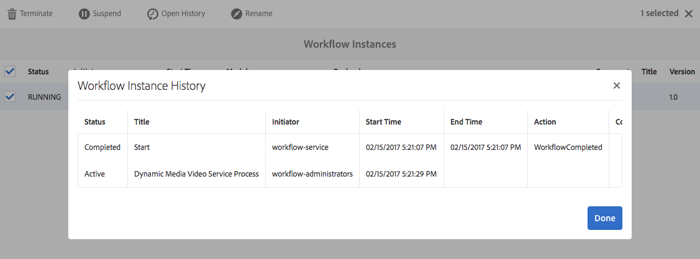
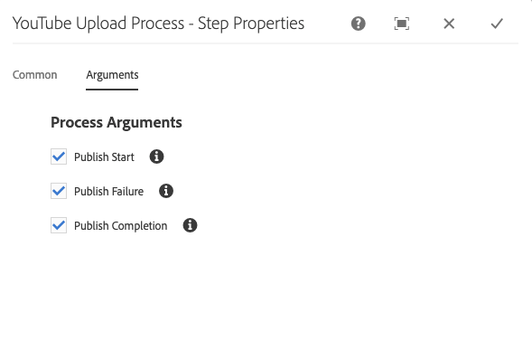

# Vídeo en Dynamic Media {#video}

En esta sección se describe cómo trabajar con vídeo en Dynamic Media.

## Inicio rápido: Videos {#quick-start-videos}

La siguiente descripción paso a paso del flujo de trabajo se ha diseñado para ayudarle en el uso inicial de conjuntos de vídeos adaptables en Dynamic Media. Después de cada paso hay referencias cruzadas a los encabezados de temas donde puede encontrar más información.

>[!NOTE]
>
>Antes de trabajar con vídeo en Dynamic Media, asegúrese de que el administrador de AEM ya ha activado y configurado los Cloud Services de Dynamic Media en el modo Dynamic Media (Scene7) o Dynamic Media (Dynamic Media) en el modo híbrido.
>
>* Consulte [Configuración de Cloud Services de Dynamic Media](/help/assets/config-dms7.md#configuring-dynamic-media-cloud-services) en Configuración de Dynamic Media - modo Scene7 y [Resolución de problemas de Dynamic Media - modo Scene7.](/help/assets/troubleshoot-dms7.md)
   >
   >
* Consulte [Configuración de Cloud Services de Dynamic Media](/help/assets/config-dynamic.md#configuring-dynamic-media-cloud-services) en Configuración de Dynamic Media - Modo híbrido.

>


1. **Cargue** los vídeos de Dynamic Media de la siguiente manera:

   * Cree su propio perfil de codificación de vídeo. O bien, puede utilizar el perfil predefinido _Codificación de vídeo adaptable_ que se incluye con Dynamic Media.

      * [Creación de un perfil](/help/assets/video-profiles.md#creating-a-video-encoding-profile-for-adaptive-streaming) de codificación de vídeo.
      * Obtenga más información sobre [Prácticas recomendadas para la codificación de vídeo](#best-practices-for-encoding-videos).
   * Asocie el perfil de procesamiento de vídeo a una o varias carpetas en las que va a cargar los vídeos de origen principales.

      * [Aplicación de un perfil de vídeo a las carpetas](/help/assets/video-profiles.md#applying-a-video-profile-to-folders).
      * Obtenga más información sobre [Prácticas recomendadas para organizar los recursos digitales con el fin de utilizar perfiles de procesamiento](/help/assets/organize-assets.md).
      * Obtenga más información sobre [Organización de recursos digitales](/help/assets/organize-assets.md).
   * Cargue los vídeos de origen principales en las carpetas. Puede cargar archivos de vídeo de hasta 15 GB cada uno. Al agregar vídeos a la carpeta, se codifican según el perfil de procesamiento de vídeo asignado a la carpeta.

      * [Cargue los vídeos](/help/assets/managing-video-assets.md#upload-and-preview-video-assets).
      * Obtenga más información sobre [Formatos de archivo de entrada admitidos](/help/assets/assets-formats.md#supported-multimedia-formats).
   * Monitoree cómo [avanza la codificación de vídeo](#monitoring-video-encoding-and-youtube-publishing-progress) desde la vista de recursos o flujos de trabajo.


1. **Administre** los vídeos de Dynamic Media realizando una de las acciones siguientes:

   * Organización, exploración y búsqueda de recursos de vídeo

      * [Organización de ](/help/assets/organize-assets.md)
recursos digitalesObtenga más información sobre las  [prácticas recomendadas para organizar los recursos digitales con el fin de utilizar perfiles de procesamiento](organize-assets.md)

      * [Búsqueda ](search-assets.md#custompredicates) de recursos de vídeo o  [Búsqueda de recursos](/help/assets/search-assets.md)
   * Previsualización y publicación de recursos de vídeo

      * Vista del vídeo de origen y las representaciones codificadas del vídeo junto con sus miniaturas asociadas:
         [Vista previa ](managing-video-assets.md#upload-and-preview-video-assets) de vídeos o  [Vista previa de recursos](previewing-assets.md)
         [Visualización de representaciones de vídeo](video-renditions.md)
         [Administración de representaciones de vídeo](manage-assets.md#managing-renditions)

      * [Gestión de ajustes preestablecidos de visor](managing-viewer-presets.md)
      * [Publicación de recursos](publishing-dynamicmedia-assets.md)
   * Trabajo con metadatos de vídeo

      * Vista las propiedades de una representación de vídeo codificada, como la velocidad de fotogramas, la velocidad de bits de audio y vídeo y el códec:
         [Visualización de las propiedades de representación de vídeo](video-renditions.md)

      * Edite las propiedades del vídeo, como el título, la descripción y las etiquetas, en los campos de metadatos personalizados:
         [Edición de propiedades de vídeo](manage-assets.md#editing-properties)

      * [Gestión de metadatos para recursos digitales](metadata.md)
      * [Esquemas de metadatos](metadata-schemas.md)
   * Revisar, aprobar y anotar vídeos y mantener el control de versión completo

      * [Anotación de ](managing-video-assets.md#annotate-video-assets) vídeos o  [anotación de recursos](manage-assets.md#annotating)

      * [Creación de una versión](manage-assets.md#asset-versioning)
      * [Aplicación de flujos de trabajo a ](assets-workflow.md) recursos o consulte  [Inicio de un flujo de trabajo en un recurso](manage-assets.md#starting-a-workflow-on-an-asset)

      * [Revisar recursos de carpetas](bulk-approval.md)
      * [Proyectos](../sites-authoring/projects.md)


1. **Publique** los vídeos de Dynamic Media siguiendo uno de estos procedimientos:

   * Si utiliza Adobe Experience Manager como sistema de gestoras de contenido web, puede agregar vídeos directamente a sus páginas web.

      * [Añadir vídeos a las páginas](adding-dynamic-media-assets-to-pages.md) web.
   * Si utiliza un sistema de gestor de contenido web de terceros, puede vincular o incrustar vídeos en sus páginas web.

      * Integrar vídeo mediante URL:
         [Vincular URL en la aplicación web](linking-urls-to-yourwebapplication.md).

      * Integrar vídeo mediante código incrustado en una página web:
         [Incrustación del visor de vídeo en una página](embed-code.md) web.
   * [Publicación de vídeos en YouTube](#publishing-videos-to-youtube).
   * [Generación de informes](#viewing-video-reports) de vídeo.

   * [Añadir subtítulos en vídeo](#adding-captions-to-video).


## Uso de vídeo en Dynamic Media {#working-with-video-in-dynamic-media}

Vídeo en Dynamic Media es una solución integral que facilita la publicación de vídeos adaptables de alta calidad para flujo continuo en varias pantallas, incluidos equipos de escritorio, iOS, Android, Blackberry y dispositivos móviles Windows. Un conjunto de vídeos adaptable agrupa versiones del mismo vídeo codificadas con diferentes velocidades de bits y formatos, como 400 kbps, 800 kbps y 1000 kbps. El equipo de escritorio o dispositivo móvil detecta el ancho de banda disponible.

Por ejemplo, en un dispositivo móvil iOS, detecta un ancho de banda como 3G, 4G o Wi-Fi. A continuación, selecciona automáticamente el vídeo codificado correcto entre las distintas velocidades de bits de vídeo dentro del conjunto de vídeos adaptable. El vídeo se transmite a equipos de escritorio, dispositivos móviles o tablets.

Además, la calidad de vídeo se cambia de forma dinámica automáticamente si las condiciones de red cambian en el escritorio o en el dispositivo móvil. Además, si un cliente entra en el modo de pantalla completa en un equipo de escritorio, el conjunto de vídeos adaptable responde con una mejor resolución, lo que mejora la experiencia de visualización del cliente. El uso de conjuntos de vídeos adaptables le ofrece la mejor reproducción posible para los clientes que reproducen vídeos de Dynamic Media en varias pantallas y dispositivos.

La lógica que utiliza un reproductor de vídeo para determinar qué vídeo codificado se debe reproducir o seleccionar durante la reproducción se basa en el siguiente algoritmo:

1. El reproductor de vídeo carga el fragmento de vídeo inicial en función de la velocidad de bits más cercana al valor definido para la &quot;velocidad de bits inicial&quot; en el propio reproductor.
1. El reproductor de vídeo cambia en función de los cambios en la velocidad de ancho de banda mediante los siguientes criterios:

   1. El reproductor elige el flujo de ancho de banda más alto por debajo o por debajo del ancho de banda estimado.
   1. El reproductor considera solamente el 80% del ancho de banda disponible. Sin embargo, si se está apagando, es más conservador en sólo el 70% para evitar la sobreestimación y volver inmediatamente a la situación.

Para obtener información técnica detallada sobre el algoritmo, consulte [https://android.googlesource.com/platform/frameworks/av/+/master/media/libstagefright/httplive/LiveSession.cpp](https://android.googlesource.com/platform/frameworks/av/+/master/media/libstagefright/httplive/LiveSession.cpp)

Para administrar un solo vídeo y conjuntos de vídeos adaptables, se admite lo siguiente:

* Carga de vídeo desde numerosos formatos de vídeo y audio admitidos y codificación de vídeo al formato MP4 H.264 para su reproducción en varias pantallas. Puede utilizar ajustes preestablecidos de vídeo adaptables predefinidos, ajustes preestablecidos de codificación de vídeo único o personalizar su propia codificación para controlar la calidad y el tamaño del vídeo.

   * Cuando se genera un conjunto de vídeos adaptables, incluye vídeos MP4.
   * **Nota**: Los vídeos principales/originales no se agregan a un conjunto de vídeos adaptable.

* Subtítulos de vídeo en todos los visores de vídeo HTML5.
* Organice, explore y busque vídeos con compatibilidad total con metadatos para una administración eficaz de los recursos de vídeo.
* Distribuya conjuntos de vídeos adaptables en la Web, así como en equipos de escritorio y dispositivos móviles, incluidos iPhone, iPad, Android, Blackberry y Windows Phone.

El flujo de vídeo adaptable es compatible con diversas plataformas de iOS. Consulte [Guía de referencia de visores de medios dinámicos](https://experienceleague.adobe.com/docs/dynamic-media-developer-resources/library/viewers-aem-assets-dmc/video/c-html5-video-reference.html#video).

Dynamic Media admite la reproducción de vídeo móvil para vídeo MP4 H.264. Puede encontrar los dispositivos Blackberry compatibles con este formato de vídeo en: [Formatos de vídeo admitidos en Blackberry](https://support.blackberry.com/kb/articleDetail?ArticleNumber=000005482).

Puede encontrar los dispositivos Windows compatibles con este formato de vídeo en los siguientes: [Formatos de vídeo compatibles con Windows Phone](https://msdn.microsoft.com/library/windows/apps/ff462087%28v=vs.105%29.aspx)

* Reproducción de vídeo con ajustes preestablecidos de visor de vídeo de Dynamic Media, incluidos los siguientes:

   * Visores de vídeos únicos.
   * Visores de medios mixtos que combinan contenido de vídeo y de imagen.

* Configure los reproductores de vídeo para que satisfagan sus necesidades de marca.
* Integre vídeo en el sitio web, el sitio móvil o la aplicación móvil con una dirección URL o código incrustado sencillos.

Consulte [Reproducción de vídeo dinámico](https://s7d9.scene7.com/s7/uvideo.jsp?asset=GeoRetail/Mop_AVS&amp;config=GeoRetail/Universal_Video1&amp;stageSize=640,480) ejemplo.

Consulte también [Visores para AEM Assets y Dynamic Media Classic](https://experienceleague.adobe.com/docs/dynamic-media-developer-resources/library/viewers-aem-assets-dmc/c-html5-s7-aem-asset-viewers.html#viewers-aem-assets-dmc) y [Visores solo para recursos AEM](https://experienceleague.adobe.com/docs/dynamic-media-developer-resources/library/viewers-for-aem-assets-only/c-html5-aem-asset-viewers.html#viewers-for-aem-assets-only).

## Práctica recomendada: Uso del visor de vídeo HTML5 {#best-practice-using-the-html-video-viewer}

Los ajustes preestablecidos del visor de vídeo HTML5 de Dynamic Media son reproductores de vídeo sólidos. Puede utilizarlos para evitar muchos problemas comunes asociados con la reproducción de vídeo HTML5 y problemas relacionados con los dispositivos móviles, como la falta de envío de flujo adaptable y el alcance limitado del navegador de escritorio.

En el lado de diseño del reproductor, puede diseñar toda la funcionalidad del reproductor de vídeo mediante herramientas de desarrollo web estándar. Por ejemplo, puede diseñar los botones, los controles y el fondo de imagen de póster personalizado con HTML5 y CSS para ayudarle a llegar a sus clientes con un aspecto personalizado.

En el lado de reproducción del visor, detecta automáticamente la capacidad de vídeo del navegador. A continuación, se muestra el vídeo mediante HLS (HTTP Live Streaming), también conocido como flujo de vídeo adaptable. O bien, si estos métodos de envío no están presentes, se utiliza HTML5 progresivo en su lugar.

Al combinar en un solo reproductor la capacidad de diseñar los componentes de reproducción mediante HTML5 y CSS, tener una reproducción incrustada y utilizar flujo adaptable y progresivo en función de la capacidad del navegador, se amplía el alcance del contenido de medios enriquecidos a los usuarios de escritorio y móviles y se garantiza una experiencia de vídeo optimizada.

Consulte también [Acerca de los visores HTML5](https://experienceleague.adobe.com/docs/dynamic-media-developer-resources/library/viewers-for-aem-assets-only/c-html5-aem-asset-viewers.html#viewers-for-aem-assets-only).

### Reproducción de vídeo en equipos de escritorio y dispositivos móviles mediante el visor de vídeo HTML5 {#playback-of-video-on-desktop-computers-and-mobile-devices-using-the-html-video-viewer}

Para el flujo continuo de vídeo adaptable móvil y de escritorio, los vídeos utilizados para el cambio de velocidad de bits se basan en todos los vídeos MP4 del conjunto de vídeos adaptable.

La reproducción de vídeo se produce mediante descarga de vídeo progresiva o HLS. En versiones anteriores de AEM, como 6.0, 6.1 y 6.2, los vídeos se transmitían por HTTP.

Sin embargo, en AEM 6.3 y en adelante, los vídeos ahora se transmiten a través de HTTPS (es decir, HLS) porque la URL del servicio de puerta de enlace DM siempre utiliza HTTPS también. Tenga en cuenta que este comportamiento predeterminado no afecta al cliente. Es decir, el flujo de vídeo siempre se producirá a través de HTTPS, a menos que el explorador no lo admita. (véase la siguiente tabla). Por tanto,

* Si tiene un sitio web HTTPS con flujo de vídeo HTTPS, la transmisión está bien.
* Si tiene un sitio web HTTP con flujo de vídeo HTTPS, la transmisión de flujo continuo es correcta y no hay problemas de contenido mixto en el navegador web.

HLS es un estándar de Apple para el flujo de vídeo adaptable que ajusta automáticamente la reproducción en función de la capacidad de ancho de banda de la red. También permite al cliente &quot;buscar&quot; en cualquier punto del vídeo sin necesidad de esperar a que se descargue el resto del vídeo.

El vídeo progresivo se entrega descargando y almacenando el vídeo localmente en el sistema de escritorio o dispositivo móvil del usuario.

En la tabla siguiente se describe el dispositivo, el navegador y el método de reproducción de vídeos en equipos de escritorio y dispositivos móviles mediante el visor de vídeo de Dynamic Media.

<table>
 <tbody>
  <tr>
   <td><strong>Dispositivo</strong></td>
   <td><strong>Explorador</strong></td>
   <td><strong>Modo de reproducción de vídeo</strong></td>
  </tr>
  <tr>
   <td>Escritorio</td>
   <td>Internet Explorer 9 y 10</td>
   <td>Descarga progresiva.</td>
  </tr>
  <tr>
   <td>Escritorio</td>
   <td>Internet Explorer 11+</td>
   <td>En Windows 8 y Windows 10: forzar el uso de HTTPS siempre que se solicite HLS. Limitación conocida: HTTP en HLS no funciona en esta combinación de explorador y sistema operativo<br /> <br /> En Windows 7 - Descarga progresiva. Utiliza lógica estándar para seleccionar protocolo HTTP frente a HTTPS.</td>
  </tr>
  <tr>
   <td>Escritorio</td>
   <td>Firefox 23-44</td>
   <td>Descarga progresiva.</td>
  </tr>
  <tr>
   <td>Escritorio</td>
   <td>Firefox 45 o posterior</td>
   <td>HLS</td>
  </tr>
  <tr>
   <td>Escritorio</td>
   <td>Chrome</td>
   <td>HLS</td>
  </tr>
  <tr>
   <td>Escritorio</td>
   <td>Safari (Mac)</td>
   <td>HLS</td>
  </tr>
  <tr>
   <td>Móvil</td>
   <td>Chrome (Android 6 o anterior)</td>
   <td>Descarga progresiva.</td>
  </tr>
  <tr>
   <td>Móvil</td>
   <td>Chrome (Android 7 o posterior)</td>
   <td>HLS</td>
  </tr>
  <tr>
   <td>Móvil</td>
   <td>Android (navegador predeterminado)</td>
   <td>Descarga progresiva.</td>
  </tr>
  <tr>
   <td>Móvil</td>
   <td>Safari (iOS)</td>
   <td>HLS</td>
  </tr>
  <tr>
   <td>Móvil</td>
   <td>Chrome (iOS)</td>
   <td>HLS</td>
  </tr>
  <tr>
   <td>Móvil</td>
   <td>BlackBerry</td>
   <td>HLS</td>
  </tr>
 </tbody>
</table>

## Arquitectura de la solución de vídeo de Dynamic Media {#architecture-of-dynamic-media-video-solution}

El siguiente gráfico muestra el flujo de trabajo general de creación de vídeos que se cargan y codifican mediante DMGgateway (en modo híbrido de Dynamic Media) y están disponibles para el consumo público.


## Arquitectura de publicación híbrida para vídeos {#hybrid-publishing-architecture-for-videos}


## Prácticas recomendadas para la codificación de vídeos {#best-practices-for-encoding-videos}

El flujo de trabajo de **codificación de vídeo de Dynamic Media** codifica el vídeo si ha activado Dynamic Media y ha configurado los servicios de nube de vídeo. Este flujo de trabajo captura el historial de procesos de flujo de trabajo y la información de errores. Consulte [Supervisión de la codificación de vídeo y progreso de publicación en YouTube](#monitoring-video-encoding-and-youtube-publishing-progress). Si ha activado los Dynamic Media y ha configurado los servicios de la nube de vídeo, el flujo de trabajo de **[!UICONTROL codificación de vídeo de Dynamic Media]** surte efecto automáticamente al cargar un vídeo. (Si no utiliza medios dinámicos, el flujo de trabajo de **[!UICONTROL recursos de actualización de DAM]** tiene efecto).

A continuación se ofrecen sugerencias recomendadas para codificar archivos de vídeo de origen.

Para obtener consejos sobre la codificación de vídeo, consulte los siguientes temas:

* [Flujo 101: Conceptos básicos: Códecs, Ancho de banda, Velocidad de datos y Resolución](https://www.adobe.com/go/learn_s7_streaming101_en).
* [Conceptos básicos](https://www.adobe.com/go/learn_s7_encoding_en) de codificación de vídeo.

### Archivos de vídeo de origen {#source-video-files}

Cuando codifique un archivo de vídeo, utilice un archivo de vídeo de origen de la máxima calidad posible. Evite utilizar archivos de vídeo codificados previamente porque estos archivos ya están comprimidos y una codificación adicional creará un vídeo de calidad inferior.

En la tabla siguiente se describe el tamaño recomendado, la proporción de aspecto y la velocidad de bits mínima que deben tener los archivos de vídeo de origen antes de codificarlos:

| Tamaño | Proporción de aspecto | Velocidad de bits mínima |
|--- |--- |--- |
| 1024 X 768 | 4:3 | 4500 kbps para la mayoría de los vídeos. |
| 1280 X 720 | 16:9 | 3000 - 6000 kbps, dependiendo de la cantidad de movimiento en el video. |
| 1920 X 1080 | 16:9 | 6000 - 8000 kbps, dependiendo de la cantidad de movimiento del vídeo. |

### Obtención de los metadatos de un archivo {#obtaining-a-file-s-metadata}

Puede obtener los metadatos de un archivo visualizando sus metadatos con una herramienta de edición de vídeo o con una aplicación diseñada para obtener metadatos. A continuación se indican las instrucciones para utilizar MediaInfo, una aplicación de terceros, para obtener los metadatos de un archivo de vídeo:

1. Vaya a esta página web: [https://mediainfo.sourceforge.net/en/Download](https://mediainfo.sourceforge.net/en/Download).
1. Seleccione y descargue el instalador para la versión de la interfaz gráfica de usuario y siga las instrucciones de instalación.
1. Después de la instalación, haga clic con el botón derecho en el archivo de vídeo (solo Windows) y seleccione MediaInfo, o bien abra MediaInfo y arrastre el archivo de vídeo a la aplicación. Verá todos los metadatos asociados al archivo de vídeo, incluidos su ancho, altura y fps.

### Proporción de aspecto {#aspect-ratio}

Cuando elija o cree un ajuste preestablecido de codificación de vídeo para el archivo de vídeo de origen principal, asegúrese de que el ajuste preestablecido tenga la misma proporción de aspecto que el archivo de vídeo de origen principal. La proporción de aspecto es la proporción entre la anchura y la altura del vídeo.

Para determinar la proporción de aspecto de un archivo de vídeo, obtenga los metadatos del archivo y tenga en cuenta la anchura y la altura del archivo (consulte Obtención de los metadatos de un archivo más arriba). A continuación, utilice esta fórmula para determinar la proporción de aspecto:

anchura/altura = proporción de aspecto

En la tabla siguiente se describe cómo los resultados de la fórmula se traducen en opciones comunes de relación de aspecto:

| Resultado de la fórmula | Proporción de aspecto |
|--- |--- |
| 1,33 | 4:3 |
| 0,75 | 3:4 |
| 1,78 | 16:9 |
| 0,56 | 9:16 |

Por ejemplo, un vídeo con una anchura de 1440 x una altura de 1080 tiene una proporción de aspecto de 1440/1080 o 1,33. En este caso, elija un ajuste preestablecido de codificación de vídeo con una proporción de aspecto de 4:3 para codificar el archivo de vídeo.

### Velocidad de bits {#bitrate}

La velocidad de bits es la cantidad de datos codificados para configurar un solo segundo de reproducción de vídeo. La velocidad de bits se mide en kilobits por segundo (kbps).

>[!NOTE]
>
>Dado que todos los códecs utilizan compresión con pérdida, la velocidad de bits es el factor más importante en la calidad del vídeo. Con compresión con pérdida, cuanto más comprima un archivo de vídeo, más degradará la calidad. Por este motivo, si todas las demás características son iguales (resolución, velocidad de fotogramas y códec), cuanto menor sea la velocidad de bits, menor será la calidad del archivo comprimido.

Al seleccionar una codificación de velocidad de bits, puede elegir dos tipos:

* **[!UICONTROL Codificación]**  de velocidad de bits constante (CBR): durante la codificación CBR, la velocidad de bits o el número de bits por segundo se mantiene igual durante todo el proceso de codificación. La codificación CBR mantiene la velocidad de datos establecida en su configuración durante todo el vídeo. Además, la codificación CBR no optimiza los archivos multimedia para garantizar la calidad, pero sí lo hace en el espacio de almacenamiento.
Utilice CBR si el vídeo contiene un nivel de movimiento similar en todo el vídeo. CBR se utiliza generalmente para transmitir contenido de vídeo. Consulte también [Uso de parámetros de codificación de vídeo personalizados](/help/assets/video-profiles.md#using-custom-added-video-encoding-parameters).

* **[!UICONTROL Codificación]**  de velocidad de bits variable (VBR): la codificación VBR ajusta la velocidad de datos hacia abajo y hasta el límite superior establecido, según los datos requeridos por el compresor. Esto significa que durante un proceso de codificación VBR, la velocidad de bits del archivo multimedia aumenta o disminuye dinámicamente según las necesidades de velocidad de bits de los archivos multimedia.
El VBR tarda más en codificarse, pero produce los resultados más favorables; la calidad del archivo multimedia es superior. VBR se utiliza generalmente para el envío progresivo http de contenido de vídeo.

¿Cuándo debe usar VBR frente a CRB?
Cuando se trata de seleccionar VBR frente a CBR, casi siempre se recomienda utilizar VBR para los archivos de medios. VBR proporciona archivos de mayor calidad a velocidades de bits competitivas. Cuando utilice VBR, asegúrese de utilizar con codificación de dos pasadas y establezca la velocidad de bits máxima en 1,5 veces la velocidad de bits de vídeo de destinatario.

Al elegir un ajuste preestablecido de codificación de vídeo, tenga en cuenta la velocidad de conexión del usuario final del destinatario. Elija un ajuste preestablecido con una velocidad de datos que sea el 80 % de esa velocidad. Por ejemplo, si la velocidad de conexión del usuario final de destinatario es de 1000 kbps, el mejor ajuste preestablecido es uno con una velocidad de datos de vídeo de 800 kbps.

En esta tabla se describe la velocidad de datos de las velocidades de conexión típicas.

| Velocidad (kbps) | Tipo de conexión |
|--- |--- |
| 256 | Conexión de acceso telefónico. |
| 800 | Conexión móvil típica. Para esta conexión, destinatario una velocidad de datos en el rango de 400 a un máximo de 800 para experiencias 3G. |
| 2000 | Conexión de escritorio de banda ancha típica. Para esta conexión, destinatario una velocidad de datos en el rango de 800 a 2000 kbps, con un promedio de la mayoría de destinatarios de 1200 a 1500 kbps. |
| 5000 | Conexión típica de banda ancha alta. No se recomienda codificar en este rango superior porque el envío de vídeo a esta velocidad no está disponible para la mayoría de los consumidores. |

### Resolución {#resolution}

**Resolución **describe la altura y anchura de un archivo de vídeo en píxeles. La mayoría de los vídeos de origen se almacenan con una alta resolución (por ejemplo, 1920 x 1080). Para transmitir, el vídeo de origen se comprime a una resolución más pequeña (640 x 480 o más pequeña).

La resolución y la velocidad de datos son dos factores integrados que determinan la calidad del vídeo. Para mantener la misma calidad de vídeo, cuanto mayor sea el número de píxeles de un archivo de vídeo (cuanto mayor sea la resolución), mayor será la velocidad de datos. Por ejemplo, observe el número de píxeles por fotograma en una resolución de 320 x 240 y un archivo de vídeo de resolución de 640 x 480:

| Resolución | Píxeles por fotograma |
|--- |--- |
| 320 x 240 | 76.800 |
| 640 x 480 | 307.200 |

El archivo de 640 x 480 tiene cuatro veces más píxeles por fotograma. Para lograr la misma velocidad de datos para estas dos resoluciones de ejemplo, se aplica cuatro veces la compresión al archivo de 640 x 480, lo que puede reducir la calidad del vídeo. Por lo tanto, una velocidad de datos de vídeo de 250 Kbps produce una visualización de alta calidad con una resolución de 320 x 240, pero no con una resolución de 640 x 480.

En general, cuanto mayor sea la velocidad de datos que utilice, mejor será el aspecto del vídeo y mayor será la resolución que utilice, mayor será la velocidad de datos necesaria para mantener la calidad de visualización (en comparación con resoluciones más bajas).

Como la resolución y la velocidad de datos están vinculadas, tiene dos opciones al codificar vídeo:

* Elija una velocidad de datos y, a continuación, codifique la resolución más alta que se muestre correctamente a la velocidad de datos elegida.
* Elija una resolución y, a continuación, codifique a la velocidad de datos necesaria para conseguir vídeo de alta calidad con la resolución elegida.

Al elegir (o crear) un ajuste preestablecido de codificación de vídeo para el archivo de vídeo de origen principal, utilice esta tabla para destinatario de la resolución correcta:

| Resolución | Altura (píxeles) | Tamaño de la pantalla |
|--- |--- |--- |
| 240p | 240 | Pantalla pequeña |
| 300p | 300 | Pantalla pequeña habitual para dispositivos móviles |
| 360p | 360 | Pantalla pequeña |
| 480p | 480 | Pantalla media |
| 720p | 720 | Pantalla grande |
| 1080p | 1080 | Pantalla grande de alta definición |

### Fps (fotogramas por segundo) {#fps-frames-per-second}

En Estados Unidos y Japón, la mayoría de los vídeos se graban a 29,97 fotogramas por segundo (fps); en Europa, la mayoría de los vídeos se graban a 25 fps. La película se graba a 24 fps.

Elija un ajuste preestablecido de codificación de vídeo que coincida con la velocidad de fps del archivo de vídeo de origen principal. Por ejemplo, si el vídeo de origen principal es de 25 fps, elija un ajuste preestablecido de codificación con 25 fps. De forma predeterminada, toda la codificación personalizada utiliza el fps del archivo de vídeo de origen principal. Por este motivo, no es necesario especificar explícitamente la configuración de fps al crear un ajuste preestablecido de codificación de vídeo.

### Dimensiones de codificación de vídeo {#video-encoding-dimensions}

Para obtener resultados óptimos, seleccione dimensiones de codificación de modo que el vídeo de origen sea un múltiplo entero de todos los vídeos codificados.

Para calcular esta proporción, divida el ancho de origen por el ancho codificado para obtener la proporción de ancho. A continuación, se divide la altura de origen por la altura codificada para obtener la proporción de altura.

Si la proporción resultante es un número entero, significa que el vídeo se escala de forma óptima. Si la proporción resultante no es un número entero, afecta a la calidad del vídeo dejando artefactos de píxeles sobrantes en la pantalla. Este efecto es más evidente cuando el vídeo tiene texto.

Como ejemplo, supongamos que el vídeo de origen es de 1920 x 1080. En la tabla siguiente, los tres vídeos codificados proporcionan la configuración de codificación óptima que se debe utilizar.

| Tipo de vídeo | Anchura x Altura | Proporción de anchura | Proporción de altura |
|--- |--- |--- |--- |
| Origen | 1920x1080 | 1 | 1 |
| Codificado | 960 x 540 | 2 | 2 |
| Codificado | 640 x 360 | 3 | 1 |
| Codificado | 480 x 270 | 4 | 4 |

### Formato de archivo de vídeo codificado {#encoded-video-file-format}

Dynamic Media recomienda el uso de ajustes preestablecidos de codificación de vídeo MP4 H.264. Dado que los archivos MP4 utilizan el códec de vídeo H.264, proporcionan vídeo de alta calidad pero con un tamaño de archivo comprimido.

## Publicación de vídeos en YouTube {#publishing-videos-to-youtube}

Puede publicar recursos de vídeo in situ AEM directamente en un canal de YouTube que haya creado anteriormente.

Para publicar recursos de vídeo en YouTube, configure AEM Assets con etiquetas. Estas etiquetas se asocian a un canal de YouTube. Si la etiqueta de un recurso de vídeo coincide con la etiqueta de un canal de YouTube, el vídeo se publica en YouTube. La publicación en YouTube se produce junto con una publicación normal del vídeo siempre que se utilice una etiqueta asociada.

YouTube realiza su propia codificación. De este modo, el archivo de vídeo original que se cargó en AEM se publica en YouTube en lugar de en cualquier representación de vídeo que haya creado la codificación de Dynamic Media. Aunque no es necesario procesar vídeos con Dynamic Media, se espera que lo hagan en caso de que se necesite un ajuste preestablecido de visor para la reproducción.

Al omitir el perfil de procesamiento de vídeo y publicar directamente en YouTube, solo significa que el recurso de vídeo de AEM recurso puede no obtener una miniatura visible. También significa que si se ejecuta en los modos de ejecución dynamicmedia o dynamicmedia_scene7, los vídeos que no estén codificados no funcionarán con ninguno de los tipos de recursos de Dynamic Media.

La publicación de recursos de vídeo en servidores de YouTube implica completar las siguientes tareas para garantizar una autenticación segura de servidor a servidor con YouTube:

1. [Configuración de la configuración de Google Cloud](#configuring-google-cloud-settings)
1. [Creación de un canal de YouTube](#creating-a-youtube-channel)
1. [Añadir etiquetas para publicación](#adding-tags-for-publishing)
1. [Activación del agente de replicación de publicaciones de YouTube](#enabling-the-youtube-publish-replication-agent)
1. [Configuración de YouTube en AEM](#setting-up-youtube-in-aem)
1. [(Opcional) Automatización de la configuración de las propiedades de YouTube predeterminadas para los vídeos cargados](#optional-automating-the-setting-of-default-youtube-properties-for-your-uploaded-videos)
1. [Publicación de vídeos en el canal de YouTube](#publishing-videos-to-your-youtube-channel)
1. [(Opcional) Verificación del vídeo publicado en YouTube](/help/assets/video.md#optional-verifying-the-published-video-on-youtube)
1. [Vinculación de direcciones URL de YouTube a la Aplicación web](#linking-youtube-urls-to-your-web-application)

También puede [cancelar la publicación de vídeos para eliminarlos de YouTube](#unpublishing-videos-to-remove-them-from-youtube).

### Configuración de la configuración de Google Cloud {#configuring-google-cloud-settings}

Para publicar en YouTube, necesita una cuenta de Google. Si tiene una cuenta GMAIL, ya tiene una cuenta de Google; si no tiene una cuenta de Google, puede crear una fácilmente. Necesita la cuenta porque necesita credenciales para publicar recursos de vídeo en YouTube. Si ya ha creado una cuenta, omita esta tarea y continúe directamente con [Creación de un canal de YouTube](#creating-a-youtube-channel).

La cuenta utilizada con Google Cloud y la cuenta de Google utilizada para YouTube no tienen por qué ser iguales.

Tenga en cuenta que Google realiza cambios periódicamente en su interfaz de usuario. Por lo tanto, los pasos para publicar videos en YouTube pueden variar ligeramente con respecto a lo que se documenta a continuación. Esta advertencia también se aplica a YouTube cuando se intenta comprobar si los vídeos se han cargado en él.

>[!NOTE]
>
>Los siguientes pasos eran precisos en el momento de escribir este artículo. Sin embargo, Google actualiza periódicamente sus sitios web sin previo aviso. Como tales, estos pasos pueden ser ligeramente diferentes.

Para configurar Google Cloud:

1. Cree una nueva cuenta de Google.
   [https://accounts.google.com/SignUp?service=mail](https://accounts.google.com/SignUp?service=mail)

   Si ya tiene una cuenta de Google, vaya al paso siguiente.

1. Vaya a [https://cloud.google.com/](https://cloud.google.com/).
1. En la página de Google Cloud, cerca de la esquina superior derecha, haga clic en **[!UICONTROL Consola.]**

   Si es necesario, es posible que deba **[!UICONTROL Iniciar sesión]** con las credenciales de su cuenta de Google para ver la opción **[!UICONTROL Consola]**.

1. En la página Panel, a la derecha de **[!UICONTROL Plataforma de Google Cloud]**, haga clic en la lista desplegable Proyecto para abrir el cuadro de diálogo Seleccionar un proyecto.
1. En el cuadro de diálogo Seleccionar un proyecto, toque **[!UICONTROL Nuevo proyecto.]**

   

1. En el cuadro de diálogo Nuevo proyecto, en el campo Nombre del proyecto, escriba el nombre del nuevo proyecto.

   Tenga en cuenta que el ID del proyecto se basa en el nombre del proyecto. Como tal, elija cuidadosamente el nombre del proyecto; no se puede cambiar una vez creado. Además, tendrá que introducir de nuevo el mismo ID de proyecto cuando configure YouTube en AEM más adelante; puede que quieras escribirlo.

1. Haga clic en **[!UICONTROL Crear.]**

1. Realice una de las siguientes acciones:

   * En el Panel del proyecto, en la tarjeta Introducción, toque **[!UICONTROL Explorar y habilitar las API.]**
   * En el Panel del proyecto, en la tarjeta API, toque **[!UICONTROL Información general de Ir a API.]**

   

1. Cerca de la parte superior de la página API y servicios, toque **[!UICONTROL Habilitar API y servicios.]**
1. En la página Biblioteca de API, en la parte izquierda, en **[!UICONTROL Categoría]**, toque **[!UICONTROL YouTube.]** En la parte derecha de la página, toque la API de datos de  **[!UICONTROL YouTube.]**
1. En la página de la API de datos de YouTube v3, toque **[!UICONTROL Habilitar.]**

   

1. Para utilizar la API, es posible que necesite credenciales. Si es necesario, haga clic en **[!UICONTROL Crear credenciales.]**

   

1. En la página **[!UICONTROL Añada las credenciales a su proyecto]**, paso 1, haga lo siguiente:

   * Desde **[!UICONTROL ¿Qué API está utilizando?]** lista desplegable, seleccione API de datos de  **[!UICONTROL YouTube v3.]**

   * Desde **[!UICONTROL Dónde va a llamar a la API?]** lista desplegable, seleccione Servidor  **[!UICONTROL Web (por ejemplo, node.js, Tomcat)]**

   * Desde **[!UICONTROL ¿A qué datos accederá?]** lista desplegable, toque Datos  **[!UICONTROL de usuario.]**

   

1. Puntee **[!UICONTROL ¿Qué credenciales necesito?]**
1. En la página **[!UICONTROL Agregar credenciales al proyecto]**, paso 2, en el encabezado **[!UICONTROL Crear un ID de cliente de OAuth 2.0]**, introduzca un nombre único (si lo desea) en el campo Nombre. También puede utilizar el nombre predeterminado especificado por Google.
1. En el encabezado **[!UICONTROL orígenes autorizados de JavaScript]**, en el campo de texto, introduzca la siguiente ruta, sustituyendo su propio dominio y número de puerto en la ruta, luego presione **[!UICONTROL Intro]** para agregar la ruta a la lista:

   `https://<servername.domain>:<port_number>`

   Por ejemplo, `https://1a2b3c.mycompany.com:4321`

   **Nota**: El ejemplo de ruta de acceso anterior está dirigido únicamente a fines ilustrativos.

   

1. En el encabezado **[!UICONTROL URI de redireccionamiento autorizado]**, en el campo de texto, introduzca la siguiente ruta, sustituyendo su propio dominio y número de puerto en la ruta, luego presione **[!UICONTROL Intro]** para agregar la ruta a la lista:

   `https://<servername.domain>:<port_number>/etc/cloudservices/youtube.youtubecredentialcallback.json`

   Por ejemplo, `https://1a2b3c.mycompany.com:4321/etc/cloudservices/youtube.youtubecredentialcallback.json`

   **Nota**: El ejemplo de ruta de acceso anterior está dirigido únicamente a fines ilustrativos.

1. Haga clic en **[!UICONTROL Crear ID de cliente de OAuth.]**
1. En la página **[!UICONTROL Agregar credenciales a su proyecto]**, paso 3, en el encabezado **[!UICONTROL Configurar la pantalla de consentimiento de OAuth 2.0]**, seleccione la dirección de correo electrónico de Gmail que está utilizando actualmente.

   

1. En el encabezado **[!UICONTROL Nombre del producto mostrado a los usuarios]**, en el campo de texto, escriba lo que desea mostrar en la pantalla de consentimiento.

   La pantalla de consentimiento se muestra al administrador de AEM cuando se autentica en YouTube; AEM contactará YouTube para obtener permiso.

1. Haga clic en **[!UICONTROL Continuar.]**
1. En la página Agregar credenciales a su proyecto, paso 4, bajo el encabezado **[!UICONTROL Descargar credenciales]**, pulse **[!UICONTROL Descargar.]**

   

1. Guarde el archivo `client_id.json`.

   Necesitará este archivo json descargado cuando configure YouTube en Adobe Experience Manager más adelante.

1. Haga clic en **[!UICONTROL Listo.]**

   Cierre la sesión de su cuenta de Google. Ahora creará un canal de YouTube.

### Creación de un canal de YouTube {#creating-a-youtube-channel}

La publicación de vídeos en YouTube requiere que tenga uno o más canales. Si ya ha creado un canal de YouTube, puede omitir esta tarea e ir a [Añadir etiquetas para publicar](/help/assets/video.md#adding-tags-for-publishing).

>[!CAUTION]
>
>Asegúrese de que ya ha configurado uno o varios canales en YouTube *antes de que* agregue canales en Configuración de YouTube en AEM (consulte [Configuración de YouTube en AEM](#setting-up-youtube-in-aem) más adelante). Si no lo hace, no recibirá ninguna advertencia de que no hay canales existentes. Sin embargo, la autenticación de Google sigue teniendo lugar cuando se agrega un canal, pero no hay una opción para elegir el canal que se envía el vídeo.

Para crear un canal de YouTube:

1. Vaya a [https://www.youtube.com](https://www.youtube.com/) e inicie sesión con sus credenciales de cuenta de Google.
1. En la esquina superior derecha de la página de YouTube, haga clic en la imagen del perfil (también puede aparecer como una letra dentro de un círculo de color sólido) y, a continuación, haga clic en **[!UICONTROL Configuración de YouTube]** (icono de engranaje redondo).
1. En la página Información general, bajo el encabezado Funciones adicionales, haga clic en **[!UICONTROL Ver todos mis canales o crear un nuevo canal.]**
1. En la página Canales, haga clic en **[!UICONTROL Crear un nuevo canal.]**
1. En la página Cuenta de marca, en el campo Nombre de cuenta de marca, escriba un nombre comercial o cualquier otro nombre de canal que elija donde desee publicar los recursos de vídeo y, a continuación, haga clic en **[!UICONTROL Crear.]**

   Recuerde el nombre que ingresa aquí porque deberá introducirlo nuevamente cuando configure YouTube en AEM.

1. (Opcional) Si es necesario, agregue más canales.

   Ahora agregará etiquetas para la publicación.

### Añadir etiquetas para publicar {#adding-tags-for-publishing}

Para publicar vídeos en YouTube, AEM asocia etiquetas a uno o varios canales de YouTube. Para agregar etiquetas para publicación, consulte [Administración de etiquetas](/help/sites-administering/tags.md).

O bien, si tiene intención de utilizar las etiquetas predeterminadas en AEM, puede omitir esta tarea e ir a [Habilitar el agente de replicación de YouTube Publish](#enabling-the-youtube-publish-replication-agent).

### Activación del agente de replicación de Publish de YouTube {#enabling-the-youtube-publish-replication-agent}

Después de habilitar el agente de replicación de YouTube Publish, si desea probar la conexión con la cuenta de Google Cloud, toque **[!UICONTROL Conexión de prueba.]** La ficha del navegador muestra los resultados de la conexión. Si ha agregado Canales de YouTube, se mostrará un listado de estos como parte de la prueba.

1. En la esquina superior izquierda de AEM, haga clic en el logotipo de AEM y, a continuación, en el carril izquierdo, seleccione **[!UICONTROL Herramientas]** > **[!UICONTROL Implementación]** > **[!UICONTROL Replicación]** > **[!UICONTROL Agentes en Author.]**
1. En la página Agentes del autor, haga clic en **[!UICONTROL YouTube Publish (youtube).]**
1. En la barra de herramientas, a la derecha de Configuración, haga clic en **[!UICONTROL Editar.]**
1. Seleccione la casilla **[!UICONTROL Habilitado]** para activar el agente de replicación.
1. Haga clic en **[!UICONTROL Aceptar.]**

   Ahora configurarás YouTube en AEM.

### Configuración de YouTube en AEM {#setting-up-youtube-in-aem}

A partir de AEM 6.4, se introdujo un nuevo método de interfaz de usuario táctil para configurar la publicación de YouTube en AEM. En función de la instancia instalada de AEM que esté utilizando, realice una de las siguientes acciones:

* Para configurar YouTube en AEM en versiones anteriores a la 6.4, consulte [Configuración de YouTube en AEM en versiones anteriores a la 6.4](/help/assets/video.md#setting-up-youtube-in-aem-before).
* Para configurar YouTube en AEM 6.4 o posterior, consulte [Configuración de YouTube en AEM 6.4 y posterior](#setting-up-youtube-in-aem-and-later).

#### Configuración de YouTube en AEM 6.4 y posterior {#setting-up-youtube-in-aem-and-later}

1. Asegúrese de iniciar sesión en su instancia de Dynamic Media como administrador.
1. En la esquina superior izquierda de AEM, pulse el logotipo de AEM y, a continuación, en el carril izquierdo, pulse **[!UICONTROL Herramientas]**(icono de martillo) > **[!UICONTROL Cloud Services]** > **[!UICONTROL Configuración de publicación de YouTube.]**
1. Toque **[!UICONTROL global]** (no lo seleccione).

1. Cerca de la esquina superior derecha de la página global, toque **[!UICONTROL Crear.]**
1. En la página Crear configuración de YouTube, en Configuración de plataforma de Google Cloud, en el campo **[!UICONTROL Nombre de aplicación]**, introduzca el ID de proyecto de Google.

   Especificó el ID de proyecto cuando configuró la configuración de Google Cloud por primera vez.
Deje abierta la página Crear configuración de YouTube; volverás a ella en un momento.

   

1. Con un editor de texto sin formato, abra el archivo JSON que descargó y guardó anteriormente en la tarea [Configuración de Google Cloud](/help/assets/video.md#configuring-google-cloud-settings).
1. Seleccione y copie todo el texto JSON.
1. Vuelva al cuadro de diálogo Configuración de cuenta de YouTube. En el campo **[!UICONTROL Configuración JSON]**, pegue el texto JSON.
1. Cerca de la esquina superior derecha de la página, toque **[!UICONTROL Guardar.]**

   Ahora configurará canales de YouTube en AEM.

1. Toque **[!UICONTROL Añadir Canal.]**
1. En el campo Nombre del Canal, escriba el nombre del canal que creó en la tarea **[!UICONTROL Añadiendo uno o más canales a YouTube]** anteriormente.

   Si lo desea, puede agregar una descripción.

1. Toque **[!UICONTROL Añadir.]**
1. Se muestra la autenticación de YouTube/Google. Si aún no ha iniciado sesión en la cuenta de Google Cloud, omita este paso.

   * Escriba el nombre de usuario y la contraseña de Google asociados con el ID del proyecto de Google y el texto JSON anterior.
   * Según el número de canales que tenga su cuenta, verá dos o más elementos. Seleccione un canal. No seleccione la dirección de correo electrónico; no es un canal.
   * En la página siguiente, toque **[!UICONTROL Aceptar]** para permitir el acceso a este canal.

1. Toque **[!UICONTROL Permitir.]**

   Ahora configurará las etiquetas para la publicación.

1. **[!UICONTROL Configuración de etiquetas para publicación]** : en la página Cloud Services > YouTube, toque el icono del lápiz para editar la lista de las etiquetas que desee utilizar.
1. Toque el icono de lista desplegable (intercalación vertical) para mostrar la lista de las etiquetas disponibles en AEM.
1. Toque una o varias etiquetas para agregarlas.

   Para eliminar una etiqueta que haya agregado, seleccione la etiqueta y toque **[!UICONTROL X.]**

1. Cuando termine de agregar las etiquetas que desee, toque **[!UICONTROL Guardar.]**

   Ahora publica vídeos en su canal de YouTube.

#### Configuración de YouTube en AEM antes de 6.4 {#setting-up-youtube-in-aem-before}

1. Asegúrese de iniciar sesión en su instancia de Dynamic Media como administrador.

1. En la esquina superior izquierda de AEM, pulse el logotipo de AEM y, a continuación, en el carril izquierdo, pulse **[!UICONTROL Herramientas]** (icono de martillo) > **[!UICONTROL Implementación]** > **[!UICONTROL Cloud Services.]**
1. Bajo el encabezado Servicios de terceros, en YouTube, toque **[!UICONTROL Configurar ahora.]**
1. En el cuadro de diálogo Crear configuración, introduzca un título (obligatorio) y un nombre (opcional) en los campos correspondientes.
1. Toque **[!UICONTROL Crear.]**
1. En el cuadro de diálogo Configuración de cuenta de YouTube, en el campo **[!UICONTROL Nombre de la aplicación]**, introduzca el ID del proyecto de Google.

   Especificó el ID de proyecto cuando [configuró la configuración de Google Cloud](/help/assets/video.md#configuring-google-cloud-settings) anteriormente.
Deje abierto el cuadro de diálogo Configuración de cuenta de YouTube; volverás a ella en un momento.

1. Con un editor de texto sin formato, abra el archivo JSON que descargó y guardó anteriormente en la tarea Configuración de Google Cloud.
1. Seleccione y copie todo el texto JSON.
1. Vuelva al cuadro de diálogo Configuración de cuenta de YouTube. En el campo **[!UICONTROL Configuración JSON]**, pegue el texto JSON.
1. Toque **[!UICONTROL Aceptar.]**

   Ahora configurará canales de YouTube en AEM.

1. A la derecha de **[!UICONTROL Canales disponibles]**, pulse **+** (icono del signo “más”).
1. En el cuadro de diálogo Configuración de canal de YouTube, en el apartado Título, escriba el nombre del canal que creó en la tarea **[!UICONTROL Agregar uno o más canales a YouTube]** anteriormente.

   Si lo desea, puede agregar una descripción.

1. Toque **[!UICONTROL Aceptar.]**
1. Se muestra la autenticación de YouTube/Google. Si aún no ha iniciado sesión en la cuenta de Google Cloud, omita este paso.

   * Escriba el nombre de usuario y la contraseña de Google asociados con el ID del proyecto de Google y el texto JSON anterior.
   * Según el número de canales que tenga su cuenta, verá dos o más elementos. Seleccione un canal. No seleccione la dirección de correo electrónico; no es un canal.
   * En la página siguiente, toque **[!UICONTROL Aceptar]** para permitir el acceso a este canal.

1. Toque **[!UICONTROL Permitir.]**

   Ahora configurará las etiquetas para la publicación.

1. **[!UICONTROL Configuración de etiquetas para publicación]** : en la página Cloud Services > YouTube, toque el icono del lápiz para editar la lista de las etiquetas que desee utilizar.
1. Toque el icono de lista desplegable (intercalación vertical) para mostrar la lista de las etiquetas disponibles en AEM.
1. Toque una o varias etiquetas para agregarlas.

   Para eliminar una etiqueta que haya agregado, selecciónela y toque **X**.

1. Cuando termine de agregar las etiquetas que desee, toque **[!UICONTROL Aceptar.]**

   Ahora publica vídeos en su canal de YouTube.

### (Opcional) Automatización de la configuración de las propiedades de YouTube predeterminadas para los vídeos cargados {#optional-automating-the-setting-of-default-youtube-properties-for-your-uploaded-videos}

Opcionalmente, puede automatizar la configuración de las propiedades de YouTube al cargar los vídeos. Esto se logra creando un perfil de procesamiento de metadatos en AEM.

Para crear el perfil de procesamiento de metadatos, en primer lugar copiará valores de los campos **[!UICONTROL Etiqueta de campo]**, **[!UICONTROL Asignar a propiedad]** y **[!UICONTROL Opciones]**, todos se encuentran en Esquemas de metadatos para vídeo. A continuación, creará su perfil de procesamiento de metadatos de vídeo de YouTube agregándole esos valores.

Para automatizar la configuración de las propiedades de YouTube predeterminadas para los vídeos cargados:

1. En la esquina superior izquierda de AEM, haga clic en el logotipo de AEM y, a continuación, en el carril izquierdo, haga clic en **[!UICONTROL Herramientas]** (icono de martillo) > **[!UICONTROL Assets]** > Esquemas **[!UICONTROL de metadatos.]**
1. Haga clic en **[!UICONTROL predeterminado.]** (No agregue una marca de verificación al cuadro de selección a la izquierda de &quot;predeterminado&quot;).
1. En la página **[!UICONTROL predeterminada]**, marque la casilla a la izquierda del **[!UICONTROL vídeo]** y luego haga clic en **[!UICONTROL Editar.]**
1. En la página Editor de Esquemas de metadatos, haga clic en la ficha **[!UICONTROL Avanzado]**.
1. Bajo el encabezado Publicación de YouTube, haga clic en **[!UICONTROL Categoría de YouTube.]**
1. En la parte derecha de la página, en la ficha **[!UICONTROL Configuración]**, haga lo siguiente:

   * En el campo de texto **[!UICONTROL Asignar a propiedad]**, seleccione y copie el valor.
Pegue el valor copiado en el editor de texto abierto. Necesitará este valor más adelante cuando cree el perfil de procesamiento de metadatos. Deje abierto el editor de texto.

   * En **[!UICONTROL Opciones]**, seleccione y copie el valor predeterminado que desee utilizar (como Personas y blogs o Ciencia y tecnología).
Pegue el valor copiado en el editor de texto abierto. Necesitará este valor más adelante cuando cree el perfil de procesamiento de metadatos. Deje abierto el editor de texto.

1. Bajo el encabezado Publicación de YouTube, haga clic en **[!UICONTROL Privacidad de YouTube.]**
1. En la parte derecha de la página, en la ficha **[!UICONTROL Configuración]**, haga lo siguiente:

   * En el campo de texto **[!UICONTROL Asignar a propiedad]**, seleccione y copie el valor.
Pegue el valor copiado en el editor de texto abierto. Necesitará este valor más adelante cuando cree el perfil de procesamiento de metadatos. Deje abierto el editor de texto.

   * En **[!UICONTROL Opciones]**, seleccione y copie el valor predeterminado que desee utilizar. Observe que las opciones están agrupadas en pares de dos. El campo inferior del par es el valor predeterminado que desea copiar, como público, no enumerado o privado.
Pegue el valor copiado en el editor de texto abierto. Necesitará este valor más adelante cuando cree el perfil de procesamiento de metadatos. Deje abierto el editor de texto.

1. Cerca de la esquina superior derecha de la página Editor de Esquemas de metadatos, haga clic en **[!UICONTROL Cancelar.]**
1. En la esquina superior izquierda de AEM, pulse el logotipo de AEM y, a continuación, en el carril izquierdo, haga clic en **[!UICONTROL Herramientas]** (icono de martillo) > **[!UICONTROL Assets]** > **[!UICONTROL Perfiles de metadatos.]**

1. En la página Perfiles de metadatos, cerca de la esquina superior derecha de la página, haga clic en **[!UICONTROL Crear.]**
1. En el cuadro de diálogo Agregar perfil de metadatos, en el campo de texto **[!UICONTROL Título del perfil]**, escriba el nombre `YouTube Video` y haga clic en **[!UICONTROL Crear.]**
1. En la página Editor de Perfiles de metadatos, haga clic en la ficha **[!UICONTROL Avanzar]**.
1. Añada los valores de publicación de YouTube copiados en el perfil haciendo lo siguiente:

   * En la parte derecha de la página, haga clic en la ficha **[!UICONTROL Generar formulario]**.
   * (Opcional) Arrastre el componente etiquetado **[!UICONTROL Encabezado de sección]** a la izquierda y suéltelo en el área del formulario.
   * (Opcional) Haga clic en **[!UICONTROL Etiqueta de campo]** para seleccionar el componente.
   * (Opcional) En la parte derecha de la página, en la ficha Configuración, en el campo de texto Etiqueta de campo, escriba `YouTube Publishing`.
   * Haga clic en la ficha **[!UICONTROL Generar formulario]**, luego arrastre el componente etiquetado **[!UICONTROL Texto de varios valores]** y suéltelo debajo del encabezado **[!UICONTROL Publicación de YouTube]** que acaba de crear.

   * Haga clic en **[!UICONTROL Etiqueta de campo]** para seleccionar el componente.
   * En la parte derecha de la página, en la ficha Configuración, pegue los valores de Publicación de YouTube (valor Etiqueta de campo y Asignar a valor de propiedad) que ha copiado anteriormente en sus respectivos campos del formulario. Pegue el valor Opciones en el campo Valor predeterminado.

1. Añada los valores de privacidad de YouTube copiados en el perfil haciendo lo siguiente:

   * En la parte derecha de la página, haga clic en la ficha **[!UICONTROL Generar formulario]**.
   * (Opcional) Arrastre el componente etiquetado **[!UICONTROL Encabezado de sección]** a la izquierda y suéltelo en el área del formulario.
   * (Opcional) Haga clic en **[!UICONTROL Etiqueta de campo]** para seleccionar el componente.
   * (Opcional) En la parte derecha de la página, en la ficha Configuración, en el campo de texto Etiqueta de campo, escriba `YouTube Privacy`.
   * Haga clic en la ficha **[!UICONTROL Generar formulario]**, luego arrastre el componente etiquetado **[!UICONTROL Texto de varios valores]** y suéltelo debajo del encabezado **[!UICONTROL Privacidad de YouTube]** que acaba de crear.

   * Haga clic en **[!UICONTROL Etiqueta de campo]** para seleccionar el componente.
   * En la parte derecha de la página, en la ficha Configuración, pegue los valores de Publicación de YouTube (valor Etiqueta de campo y Asignar a valor de propiedad) que ha copiado anteriormente en sus respectivos campos del formulario. Pegue el valor Opciones en el campo Valor predeterminado.

1. Junto a la esquina superior derecha de la página, haga clic en **[!UICONTROL Guardar.]**
1. Aplique el perfil de metadatos Publicación de YouTube a las carpetas en las que va a cargar los vídeos. Tendrá que establecer tanto el Perfil de metadatos como el Perfil de vídeo.

   Consulte [Perfiles de metadatos](/help/assets/metadata-config.md#metadata-profiles) y [Perfiles de vídeo](/help/assets/video-profiles.md).

### Publicación de vídeos en su canal de YouTube {#publishing-videos-to-your-youtube-channel}

Ahora asocia las etiquetas que agregó anteriormente a los recursos de vídeo. Este proceso permite AEM los recursos que se van a publicar en el canal de YouTube.

>[!NOTE]
>
>Cuando se ejecuta en el modo Dynamic Media: Scene7, tenga en cuenta que la publicación inmediata no se publica automáticamente en YouTube. Cuando se configura el modo Dynamic Media - Scene7, hay dos opciones de publicación entre las que elegir: **[!UICONTROL Inmediatamente]** o **[!UICONTROL Tras la Activación.]**
>
>**[!UICONTROL Publicar]** inmediatamente significa que el recurso cargado (una vez sincronizado con IPS) se publica automáticamente en el sistema de envío. Aunque esto es cierto para los medios dinámicos, no es cierto para YouTube. Para publicar en YouTube, debe publicar mediante AEM Author.

>[!NOTE]
>
>Para publicar contenido de YouTube, AEM utiliza el flujo de trabajo **[!UICONTROL Publicar en YouTube]**, que permite supervisar el progreso y la vista de cualquier información de error.
>
>Consulte [Supervisión de la codificación de vídeo y progreso de publicación en YouTube](#monitoring-video-encoding-and-youtube-publishing-progress).
>
>Para obtener información más detallada sobre el progreso, puede supervisar el registro de YouTube en replicación. Sin embargo, tenga en cuenta que dicha supervisión requiere acceso de administrador.

Para publicar vídeos en su canal de YouTube:

1. En AEM, vaya a un recurso de vídeo que desee publicar en su canal de YouTube.
1. Seleccione el recurso de vídeo (el conjunto de vídeos adaptables).
1. En la barra de herramientas, haga clic en **[!UICONTROL Propiedades.]**
1. En la ficha Básico, bajo el encabezado Metadatos, haga clic en **[!UICONTROL Abrir cuadro de diálogo de selección]** a la derecha del campo Etiquetas.
1. En la página Seleccionar etiquetas, vaya a las etiquetas que desee utilizar y, a continuación, seleccione una o varias etiquetas.

   Recuerde que las etiquetas deben estar asociadas al canal de YouTube.

1. En la esquina superior derecha de la página, haga clic en **[!UICONTROL Seleccionar.]**
1. En la esquina superior derecha de la página de propiedades del vídeo, haga clic en **[!UICONTROL Guardar y cerrar.]**
1. En la barra de herramientas, haga clic en **[!UICONTROL Publicación rápida.]**

   Consulte también [Uso de Administración de publicaciones con AEM Sites](https://docs.adobe.com/content/help/en/experience-manager-learn/sites/page-authoring/publication-management-feature-video-use.html).

   Opcionalmente, puede comprobar el vídeo publicado en su canal de YouTube.

### (Opcional) Verificación del vídeo publicado en YouTube {#optional-verifying-the-published-video-on-youtube}

De forma opcional, puede supervisar el progreso de la publicación de YouTube (o cancelar la publicación).

Consulte [Supervisión de la codificación de vídeo y progreso de publicación en YouTube](#monitoring-video-encoding-and-youtube-publishing-progress).

Los tiempos de publicación pueden variar considerablemente según los numerosos factores que incluyen el formato del vídeo de origen principal, el tamaño del archivo y el tráfico de carga. El proceso de publicación puede tardar entre unos minutos y varias horas. Además, tenga en cuenta que los formatos de resolución más alta se procesan mucho más lentamente. Por ejemplo, 720p y 1080p tardan mucho más en aparecer que 480p.

Después de ocho horas si todavía ve un mensaje de estado que dice **[!UICONTROL Cargado (procesando, espere)]**, intente eliminar el video de nuestro sitio y cargarlo de nuevo.

### Vinculación de direcciones URL de YouTube a su Aplicación web {#linking-youtube-urls-to-your-web-application}

Puede obtener una cadena URL de YouTube generada por Dynamic Media después de publicar el vídeo. Al copiar la URL de YouTube, ésta se coloca en el portapapeles para que pueda pegarla según sea necesario en las páginas del sitio web o la aplicación.

>[!NOTE]
>
>La URL de YouTube no está disponible para copiarse hasta que haya publicado el recurso de vídeo en YouTube.

Para vincular direcciones URL de YouTube a la aplicación web:

1. Vaya al recurso de vídeo *YouTube publicado* cuya URL desee copiar y selecciónela.

   Recuerde que las direcciones URL de YouTube solo están disponibles para copiar *después de* que haya *publicado por primera vez* los recursos de vídeo en YouTube.

1. En la barra de herramientas, haga clic en **[!UICONTROL Propiedades.]**
1. Haga clic en la ficha **[!UICONTROL Avanzado]**.
1. En el encabezado Publicación de YouTube, en la Lista URL de YouTube, seleccione y copie el texto de la URL en el navegador web para realizar la previsualización del recurso o para añadirlo a la página de contenido web.

### Cancelación de la publicación de vídeos para eliminarlos de YouTube {#unpublishing-videos-to-remove-them-from-youtube}

Al cancelar la publicación de un recurso de vídeo en AEM, el vídeo se elimina de YouTube.

>[!CAUTION]
>
>Si elimina un vídeo directamente desde YouTube, AEM no lo sabe y sigue comportándose como si el vídeo se siguiera publicando en YouTube. Cancele siempre la publicación de un recurso de vídeo de YouTube mediante AEM.

>[!NOTE]
>
>Para eliminar contenido de YouTube, AEM utiliza el flujo de trabajo **[!UICONTROL Cancelar la publicación de YouTube]**, que permite supervisar el progreso y la vista de cualquier información de error.
>
>Consulte [Supervisión de la codificación de vídeo y progreso de publicación en YouTube](#monitoring-video-encoding-and-youtube-publishing-progress).

Para cancelar la publicación de vídeos para eliminarlos de YouTube:

1. Vaya a los recursos de vídeo que desea cancelar la publicación desde el canal de YouTube.
1. En un modo de selección de recursos, seleccione uno o varios recursos de vídeo publicados.
1. En la barra de herramientas, haga clic en **[!UICONTROL Administrar publicación.]** Es posible que deba tocar el icono de tres puntos (. . .) en la barra de herramientas para ver **[!UICONTROL Administrar publicación.]**
1. En la página Administrar publicación, toque **[!UICONTROL Cancelar publicación.]**
1. En la esquina superior derecha de la página, toque **[!UICONTROL Siguiente.]**
1. En la esquina superior derecha de la página, toque **[!UICONTROL Cancelar publicación.]**

## Monitoreo del progreso de la codificación de vídeo y la publicación en YouTube {#monitoring-video-encoding-and-youtube-publishing-progress}

Al cargar un nuevo vídeo en una carpeta que tenga aplicada la codificación de vídeo o publicar el vídeo en YouTube, puede supervisar el progreso (o fracaso) de la publicación de vídeo/codificación de vídeo de varias formas. El progreso real de publicación de YouTube solo está disponible a través de los registros, pero si falla o tiene éxito se enumera de maneras adicionales descritas en el siguiente procedimiento. Además, puede recibir notificaciones por correo electrónico cuando el flujo de trabajo de publicación o la codificación de vídeo de YouTube se completa o se interrumpe.

### Monitoreo del progreso {#monitoring-progress}

Para supervisar el progreso (incluida la codificación fallida/publicación en YouTube):

1. Progreso de la codificación de vídeo de vista en la carpeta de recursos:

   * En la vista de tarjetas, el progreso de la codificación de vídeo se muestra en el recurso por porcentaje. Si hay un error, esta información también se muestra en el recurso.

   

   * En la vista de lista, el progreso de la codificación de vídeo se muestra en la columna **[!UICONTROL Estado de procesamiento]**. Si hay un error, este mensaje se muestra en la misma columna.

   

   Esta columna no se muestra de forma predeterminada. Para habilitar la columna, seleccione **[!UICONTROL Ver configuración]** en el menú desplegable de vistas, agregue la columna **[!UICONTROL Estado de procesamiento]** y pulse o haga clic en **[!UICONTROL Actualizar.]**

   

1. Progreso de la vista en los detalles del recurso. Cuando toque o haga clic en un recurso, abra el menú desplegable y seleccione **[!UICONTROL Línea de tiempo.]** Para reducirlo a actividades de flujo de trabajo como la codificación o la publicación en YouTube, seleccione  **[!UICONTROL Flujos de trabajo.]**

   

   En la línea de tiempo se muestra cualquier información de flujo de trabajo, como la codificación. Para la publicación en YouTube, la línea de tiempo del flujo de trabajo también incluye el nombre del canal de YouTube y la URL del vídeo de YouTube. Además, verá cualquier notificación de error en la línea de tiempo del flujo de trabajo una vez finalizada la publicación.

   >[!NOTE]
   >
   >Podría tomar mucho tiempo que los mensajes de error/error finalmente se registren debido a varias configuraciones de flujo de trabajo en **[!UICONTROL reintentos]**, **[!UICONTROL retraso de reintentos]** y **[!UICONTROL tiempo de espera]** de [https://localhost:4502/system/console/configMgr](https://localhost:4502/system/console/configMgr), por ejemplo:
   >
   >    * Configuración de cola de trabajos de Apache Sling
   >    * Controlador de trabajos de proceso externo de flujo de trabajo de granito de Adobe
   >    * Cola de tiempo de espera de flujo de trabajo de granito

   >
   >Puede ajustar las propiedades de **[!UICONTROL reintentos]**, **[!UICONTROL reintentos de demora]** y **[!UICONTROL tiempo de espera]** en estas configuraciones.

1. Para los flujos de trabajo en curso, consulte Instancias de flujo de trabajo disponibles en **[!UICONTROL Herramientas]** > **[!UICONTROL Flujo de trabajo]** > **[!UICONTROL Instancias.]**

   >[!NOTE]
   >
   >Es posible que necesite derechos administrativos para acceder al menú **[!UICONTROL Herramientas]**.

   

   Seleccione la instancia y toque o haga clic en **[!UICONTROL Abrir historial.]**

   

   En el área Instancias de flujo de trabajo, también puede suspender, finalizar o cambiar el nombre de los flujos de trabajo. Consulte [Administración de flujos de trabajo](/help/sites-administering/workflows-administering.md) para obtener más información.

1. Para los trabajos con errores, consulte Errores de flujo de trabajo disponibles en **[!UICONTROL Herramientas]** > **[!UICONTROL Flujo de trabajo]** > **[!UICONTROL Errores.]** El **[!UICONTROL error de flujo de trabajo]** muestra todas las actividades de flujo de trabajo con errores.

   >[!NOTE]
   >
   >Es posible que necesite derechos administrativos para acceder al menú **[!UICONTROL Herramientas]**.

   

   >[!NOTE]
   >
   >Podría llevar bastante tiempo que el mensaje de error finalmente se registre debido a varias configuraciones de flujo de trabajo en **[!UICONTROL reintentos]**, **[!UICONTROL retrasos de reintentos]** y **[!UICONTROL tiempo de espera]** de [https://localhost:4502/system/console/configMgr](https://localhost:4502/system/console/configMgr), por ejemplo:
   >
   >
   >
   >    * Configuración de cola de trabajos de Apache Sling
   >    * Controlador de trabajos de proceso externo de flujo de trabajo de granito de Adobe
   >    * Cola de tiempo de espera de flujo de trabajo de granito

   >
   >
   >Puede ajustar las propiedades de **[!UICONTROL reintentos]**, **[!UICONTROL reintentos de demora]** y **[!UICONTROL tiempo de espera]** en estas configuraciones.

1. Para ver los flujos de trabajo completados, consulte Archivo de flujo de trabajo, disponible en **[!UICONTROL Herramientas]** > **[!UICONTROL Flujo de trabajo]** > **[!UICONTROL Archivar.]** El **[!UICONTROL archivo de flujo de trabajo]** enumera todas las actividades de flujo de trabajo completadas.

   >[!NOTE]
   >
   >Es posible que necesite derechos administrativos para acceder al menú **[!UICONTROL Herramientas]**.

   

1. Puede recibir notificaciones por correo electrónico sobre los trabajos de flujo de trabajo anulados o fallidos. Un administrador puede configurar estas notificaciones por correo electrónico. Consulte [Configuración de las notificaciones por correo electrónico](#configuring-e-mail-notifications).

#### Configuración de las notificaciones por correo electrónico {#configuring-e-mail-notifications}

>[!NOTE]
>
>Es posible que necesite derechos administrativos para acceder al menú **[!UICONTROL Herramientas]**.

La configuración de la notificación depende de si desea recibir notificaciones para trabajos de codificación o de publicación en YouTube:

* Para los trabajos de codificación, puede acceder a la página de configuración de todas las notificaciones por correo electrónico AEM flujo de trabajo en **[!UICONTROL Herramientas]** > **[!UICONTROL Operaciones]** > **[!UICONTROL Consola Web]** y buscando **[!UICONTROL Servicio de notificación por correo electrónico de flujo de trabajo de CQ diario.]** Consulte  [Configuración de notificaciones por correo electrónico en AEM](/help/sites-administering/notification.md). Puede seleccionar o borrar las casillas de verificación para **[!UICONTROL Notificar al anular]** o **[!UICONTROL Notificar al completar]** según corresponda.

* Para los trabajos de publicación de YouTube, haga lo siguiente:

1. En AEM, toque **[!UICONTROL Herramientas]** > **[!UICONTROL Flujo de trabajo]** > **[!UICONTROL Modelos.]**
1. En la página Modelos de flujo de trabajo, seleccione **[!UICONTROL Publicar en YouTube]** y, a continuación, toque **[!UICONTROL Editar]** en la barra de herramientas.
1. Cerca de la esquina superior derecha de la página de flujo de trabajo Publicar en YouTube, toque **[!UICONTROL Editar.]**
1. Pase el puntero del ratón sobre el componente Carga de YouTube y, a continuación, toque una vez para mostrar la barra de herramientas en línea.

   

1. En la barra de herramientas en línea, toque el icono Configuración (llave inglesa). Haga clic en la ficha **[!UICONTROL Argumentos]**.

   

1. En el cuadro de diálogo Proceso de carga de YouTube - Propiedades del paso, toque la ficha **[!UICONTROL Argumentos]**.

   

1. Puede seleccionar o borrar las siguientes casillas de verificación:

   * Inicio de publicación
   * Error durante la publicación
   * Finalización de publicación: incluye información sobre canales y direcciones URL

   Al desactivar una casilla de verificación, no recibirá la notificación de correo electrónico especificada del flujo de trabajo de publicación de YouTube.

   >[!NOTE]
   >
   >Estos correos electrónicos son específicos de YouTube y se suman a las notificaciones de correo electrónico genéricas del flujo de trabajo. Como resultado, puede recibir dos conjuntos de notificaciones por correo electrónico: la notificación genérica disponible en el **[!UICONTROL Servicio de notificación por correo electrónico de flujo de trabajo de CQ]** y una específica de YouTube según la configuración.

1. Cuando haya terminado, toque el icono **[!UICONTROL Listo]** (marca de verificación) cerca de la esquina superior derecha del cuadro de diálogo.
1. En la página de flujo de trabajo Publicar en YouTube, cerca de la esquina superior derecha, toque **[!UICONTROL Sincronizar.]**

## Visualización de informes de video {#viewing-video-reports}

>[!NOTE]
>
>Los informes de vídeo solo están disponibles cuando se ejecuta el modo Dynamic Media - Híbrido.

Los informes de vídeo muestran varias métricas acumuladas durante un período de tiempo determinado para ayudarle a supervisar que *los vídeos acumulados e individuales publicados funcionan según lo esperado. Los siguientes datos de métricas principales se agregan para todos los vídeos publicados en todo el sitio web:

* Inicios de vídeo
* Tasa de finalización
* Tiempo promedio en el video
* Tiempo total en vídeo
* Videos por visita

También se muestra una tabla de todos los *vídeos publicados* para que pueda rastrear los vídeos más vistos del sitio web en función del total de inicios de vídeo.

Al tocar un nombre de vídeo en la lista, se muestra el informe de retención de audiencias (desplegable) del vídeo en forma de gráfico de líneas. El gráfico muestra el número de vistas para un momento determinado durante la reproducción del vídeo. Al reproducir el vídeo, la barra vertical realiza un seguimiento en sincronización con el indicador de tiempo del reproductor. Las caídas de los datos del gráfico de líneas indican dónde se produce la audiencia por desinterés.

Si el vídeo se codificó fuera de Adobe Experience Manager Dynamic Media, el gráfico de retención de audiencias (desplegable) y los datos de porcentaje de reproducción de la tabla no están disponibles.

Consulte también [Configuración de Cloud Services de Dynamic Media](/help/assets/config-dynamic.md).

>[!NOTE]
>
>El seguimiento y los datos de sistema de informes se basan exclusivamente en el uso del propio reproductor de vídeo de Dynamic Media y el ajuste preestablecido del reproductor de vídeo asociado. Por lo tanto, no puede rastrear e informar sobre los vídeos que se reproducen a través de otros reproductores de vídeo.

De forma predeterminada, la primera vez que se ingresa a Informes de video, el informe muestra los datos de video comenzando en el primer mes actual y finalizando con la fecha del mes actual. Sin embargo, puede anular el intervalo de fechas predeterminado especificando su propio intervalo de fechas. La próxima vez que ingrese Informes de video, se utilizará el intervalo de fechas especificado.

Para que los informes de vídeo funcionen correctamente, se crea automáticamente una ID de grupo de informes cuando se configuran Cloud Services de medios dinámicos. Al mismo tiempo, la ID del grupo de informes se transfiere al servidor de publicación para que esté disponible para la función Copiar URL al realizar la previsualización de recursos. Sin embargo, esto requiere que el servidor de publicación ya esté configurado. Si el servidor de publicación no está configurado, aún puede publicar para ver el informe de vídeo. Sin embargo, deberá volver a la configuración de Dynamic Media Cloud y tocar **[!UICONTROL Aceptar.]**

Para vista de informes de vídeo:

1. En la esquina superior izquierda de AEM, pulse el logotipo de AEM y, a continuación, en el carril izquierdo, pulse **[!UICONTROL Herramientas]** (icono de martillo) > **[!UICONTROL Assets]** > **[!UICONTROL Informes de vídeo.]**
1. En la página Informes de vídeo, realice una de las acciones siguientes:

   * Cerca de la esquina superior derecha, toque el icono **Actualizar informe de vídeo **1.
Sólo necesita utilizar Actualizar si la fecha de finalización del informe es el día actual. Esto garantiza que vea el seguimiento de videos que se ha producido desde la última vez que ejecutó el informe.

   * Cerca de la esquina superior derecha, toque el icono **Selector de fecha ****.
Especifique el intervalo de fechas de inicio y finalización para el que desea datos de vídeo y, a continuación, toque **[!UICONTROL Ejecutar informe.]**

   El cuadro de grupo Métricas principales identifica varias medidas acumuladas para todos los *videos publicados en el sitio.

1. En la tabla que lista los principales vídeos publicados, toque un nombre de vídeo para reproducir el vídeo y también vea el informe desplegable de retención de audiencias del vídeo.

### Visualización de informes de vídeo basados en un visor de vídeo creado con el SDK de visor de Scene7 HMTL5 {#viewing-video-reports-based-on-a-video-viewer-that-you-created-using-the-scene-hmtl-viewer-sdk}

Si está utilizando un visor de vídeo incorporado proporcionado por Dynamic Media o si ha creado un ajuste preestablecido de visor personalizado basado en un visor de vídeo incorporado, no se requieren pasos adicionales para la vista de informes de vídeo. Sin embargo, si ha creado su propio visor de vídeo basado en el SDK de visor HTML5 de Scene7, siga estos pasos para asegurarse de que el visor de vídeo envía eventos de seguimiento a los informes de vídeo de Dynamic Media.

Utilice la referencia de visores de medios dinámicos y el SDK de visores HTML5 de Scene7 para crear sus propios visores de vídeo.

Consulte [Guía de referencia de visores de medios dinámicos](https://experienceleague.adobe.com/docs/dynamic-media-developer-resources/library/home.html).

<!-- Download the Scene7 HTML Viewer SDK from Adobe Developer Connection.

See [Adobe Developer Connection](https://help.adobe.com/en_US/scene7/using/WSef8d5860223939e2-43dedf7012b792fc1d5-8000.html). -->

Para vista de informes de vídeo basados en un visor de vídeo creado con el SDK de visor HTML5 de Scene7:

1. Navegue a cualquier recurso de vídeo publicado.
1. Junto a la esquina superior izquierda de la página del recurso, en la lista desplegable, seleccione **[!UICONTROL Visualizadores.]**
1. Seleccione cualquier ajuste preestablecido de visor de vídeo y copie el código incrustado.
1. En el código incrustado, busque la línea con lo siguiente:

   `videoViewer.setParam("config2", "<value>");`

   El parámetro `config2` habilita el seguimiento en los visores HTML5. También es un ajuste preestablecido específico para la compañía que contiene la información de configuración para el Sistema de informes de vídeo y para las configuraciones de Adobe Analytics específicas del cliente.

   El valor correcto del parámetro config2 se encuentra tanto en la función **Embed Code **como en la función copy **URL **1. En la URL desde el comando copy **URL **, el parámetro que se busca es `&config2=<value>` . El valor es casi siempre `companypreset`, pero en algunos casos también puede ser `companypreset-1`, `companypreset-2`, etc.

1. En el código del visor de vídeo personalizado, agregue AppMeasurementBridge.jsp a la página del visor haciendo lo siguiente:

   * Primero, determine si necesita el parámetro `&preset`.
Si el parámetro `config2` es `companypreset`, *no necesita `&preset=parameter`.
Si `config2` es cualquier otra cosa, establezca el parámetro preestablecido igual que el parámetro `config2`. Por ejemplo, si `config2=companypreset-2`, agregue `&param2=companypreset-2` a la dirección URL de AppMeasurementBridge.jsp.

   * A continuación, agregue la secuencia de comandos AppMeasurementBridge.jsp:
      `<script language="javascript" type="text/javascript" src="https://s7d1.scene7.com/s7viewers/AppMeasurementBridge.jsp?company=robindallas&preset=companypreset-2"></script>`

1. Cree el componente TrackingManager haciendo lo siguiente:

   * Después de llamar a `s7sdk.Utils.init();`, cree una instancia de TrackingManager para rastrear eventos agregando lo siguiente:
      `var trackingManager = new s7sdk.TrackingManager();`

   * Conecte los componentes a TrackingManager haciendo lo siguiente:
En el controlador de evento `s7sdk.Event.SDK_READY`, adjunte el componente que desee rastrear al TrackingManager.
Por ejemplo, si el componente es `videoPlayer`, agregue
      `trackingManager.attach(videoPlayer);`
para asociar el componente al trackingManager. Para realizar el seguimiento de varios visores en una página, utilice varios componentes del administrador de seguimiento.

   * Cree el objeto AppMeasurementBridge agregando lo siguiente:

      ```
      var appMeasurementBridge = new AppMeasurementBridge(); appMeasurementBridge.setVideoPlayer(videoPlayer);
      ```

   * Añada la función de seguimiento agregando lo siguiente:

      ```
      trackingManager.setCallback(appMeasurementBridge.track,
       appMeasurementBridge);
      ```
   El objeto appMeasurementBridge tiene una función de seguimiento integrada. Sin embargo, puede proporcionar su propio equipo para admitir varios sistemas de seguimiento u otra funcionalidad.

   Para obtener más información, consulte *Uso del componente TrackingManager* en la *Guía del usuario del SDK del visor HTML5 de Scene7* disponible para su descarga en [Adobe Developer Connection](https://help.adobe.com/en_US/scene7/using/WSef8d5860223939e2-43dedf7012b792fc1d5-8000.html).

## Añadir subtítulos a vídeo {#adding-captions-to-video}

Puede ampliar el alcance de los vídeos a mercados globales agregando subtítulos a vídeos únicos o a conjuntos de vídeos adaptables. Al agregar subtítulos, evita la necesidad de duplicar el audio o la necesidad de utilizar hablantes nativos para volver a grabar el audio en cada idioma diferente. El vídeo se reproduce en el idioma en que se grabó. Aparecen subtítulos en idiomas extranjeros para que las personas de idiomas diferentes puedan entender la parte de audio.

El subtítulo también permite una buena accesibilidad mediante subtítulos opcionales para personas sordas o con dificultades auditivas.

>[!NOTE]
>
>El reproductor de vídeo que utilice debe admitir la visualización de rótulos.

Dynamic Media tiene la capacidad de convertir archivos de subtítulos al formato JSON (JavaScript Object Notation). Esta conversión significa que puede incrustar el texto JSON en una página web como una transcripción oculta pero completa del vídeo. Los motores de búsqueda pueden rastrear e indexar el contenido para que los vídeos se puedan descubrir más fácilmente y proporcionar a los clientes detalles adicionales sobre el contenido del vídeo.

Consulte [Servicio de contenido estático (no de imagen)](https://docs.adobe.com/content/help/en/dynamic-media-developer-resources/image-serving-api/image-serving-api/c-serving-static-nonimage-contents.html) en la *Ayuda de la API de servicio de imágenes de Scene7* para obtener más información sobre el uso de la función JSON en una dirección URL.

Para agregar subtítulos o subtítulos a un vídeo:

1. Utilice una aplicación o servicio de terceros para crear el archivo de subtítulos o subtítulos de vídeo.

   Asegúrese de que el archivo que crea sigue el estándar WebVTT (Web Video Text Tracks). La extensión de nombre de archivo de subtítulos es .vtt. Puede obtener más información sobre el estándar de subtítulos WebVTT.

   Consulte [WebVTT: Formato de seguimiento de texto de vídeo web](https://dev.w3.org/html5/webvtt/).

   Existen herramientas y servicios gratuitos y Premium que puede utilizar para crear archivos de subtítulos o subtítulos fuera de Dynamic Media. Por ejemplo, para crear un archivo de subtítulos de vídeo sencillo sin estilo, puede utilizar la siguiente herramienta gratuita de edición y creación de subtítulos en línea:

   [WebVTT Caption Maker](https://testdrive-archive.azurewebsites.net/Graphics/CaptionMaker/Default.html)

   Para obtener los mejores resultados, utilice la herramienta en Internet Explorer 9 o posterior, Google Chrome o Safari.

   En la herramienta, en el campo **[!UICONTROL Introduzca la dirección URL del archivo de vídeo]**, pegue la dirección URL copiada del archivo de vídeo y haga clic en **[!UICONTROL Cargar]**. Consulte [Obtención de una URL para un recurso](/help/assets/linking-urls-to-yourwebapplication.md#obtaining-a-url-for-an-asset) para obtener la URL del propio archivo de vídeo, que puede pegar en el campo **[!UICONTROL Introducir URL del archivo de vídeo.]** Internet Explorer, Chrome o Safari pueden reproducir el vídeo de forma predeterminada.

   Siga las instrucciones en pantalla del sitio para crear y guardar el archivo WebVTT. Cuando haya terminado, copie el contenido del archivo de subtítulos y péguelo en un editor de texto sin formato y guárdelo con la extensión de nombre de archivo .vtt.

   >[!NOTE]
   >
   >Para obtener compatibilidad global con subtítulos de vídeo en varios idiomas, el estándar WebVTT requiere que cree llamadas y archivos .vtt independientes para cada idioma que desee admitir.

   Generalmente, desea asignar al archivo de subtítulos VTT el mismo nombre que el archivo de vídeo y anexarlo a la configuración regional del idioma, como -EN, -FR o -DE, etc. Al hacerlo, puede ayudarle a automatizar la generación de las direcciones URL de vídeo mediante el sistema de gestoras de contenido web existente.

1. En AEM, cargue el archivo de subtítulos WebVTT en DAM.
1. Vaya al recurso de vídeo *publicado* que desea asociar al archivo de subtítulos que ha cargado.

   Recuerde que las direcciones URL solo están disponibles para copiarse *después* de *publicar* los recursos por primera vez.

   Consulte [Publishing Assets.](/help/assets/publishing-dynamicmedia-assets.md)

1. Realice una de las acciones siguientes:

   * Para obtener una experiencia con el visor de vídeo emergente, toque **[!UICONTROL URL.]** En el cuadro de diálogo URL, seleccione y copie la URL en el portapapeles y, a continuación, pase la URL a un editor de texto sencillo. Añada la URL copiada del vídeo con la siguiente sintaxis:

      `&caption=<server_path>/is/content/<path_to_caption.vtt_file,1>`

      Observe `,1` al final de la ruta de subtítulos. Inmediatamente después de la extensión de nombre de archivo .vtt en la ruta, tiene la opción de habilitar (activar) o deshabilitar (desactivar) el botón de subtítulos opcionales en la barra del reproductor de vídeo configurándolo en `,1` o `,0`, respectivamente.

   * Para una experiencia con el visor de vídeo incorporado, toque **[!UICONTROL Código incrustado.]** En el cuadro de diálogo Código incrustado, seleccione y copie el código incrustado en el portapapeles y, a continuación, pegue el código en un editor de texto sencillo. Añada el código incrustado copiado con la siguiente sintaxis:

      `videoViewer.setParam("caption","<path_to_caption.vtt_file,1>");`

      Observe `,1` al final de la ruta de subtítulos. Inmediatamente después de la extensión de nombre de archivo .vtt en la ruta, tiene la opción de habilitar (activar) o deshabilitar (desactivar) el botón de subtítulos opcionales en la barra del reproductor de vídeo configurándolo en `,1` o `,0`, respectivamente.

## Añadir marcadores de capítulo a vídeo {#adding-chapter-markers-to-video}

Puede facilitar la visualización y navegación de los vídeos de formato largo agregando marcadores de capítulo a vídeos únicos o a conjuntos de vídeos adaptables. Cuando un usuario reproduce el vídeo, puede hacer clic en los marcadores de capítulo en la línea de tiempo del vídeo (también conocida como la barra de desplazamiento del vídeo) para desplazarse fácilmente a su punto de interés o para acceder inmediatamente a nuevo contenido, demostraciones, tutoriales, etc.

>[!NOTE]
>
>El reproductor de vídeo que se utilice debe admitir el uso de marcadores de capítulo. Los reproductores de vídeo de Dynamic Media admiten marcadores de capítulo, pero puede que no sea así el uso de reproductores de vídeo de terceros.

Si lo desea, puede crear y personalizar su propio visor de vídeo con capítulos en lugar de utilizar un ajuste preestablecido de visor de vídeo. Para obtener instrucciones sobre cómo crear su propio visor HTML5 con navegación por capítulos, en la guía SDK de visor de Adobe Scene7 para HTML5, haga referencia al encabezado &quot;Personalización del comportamiento mediante modificadores&quot; en las clases `s7sdk.video.VideoPlayer` y `s7sdk.video.VideoScrubber`. El SDK de visor de Adobe Scene7 está disponible como descarga de [Adobe Developer Connection](https://help.adobe.com/en_US/scene7/using/WSef8d5860223939e2-43dedf7012b792fc1d5-8000.html).

Puede crear una lista de capítulo para el vídeo de la misma manera que crea rótulos. Es decir, se crea un archivo WebVTT. Tenga en cuenta, sin embargo, que este archivo debe ser independiente de cualquier archivo de subtítulos WebVTT que también esté utilizando; no puede combinar rótulos y capítulos en un archivo WebVTT.

Puede utilizar la siguiente muestra como ejemplo del formato que utiliza para crear un archivo WebVTT con navegación por capítulos:

### Archivo WebVTT con navegación por capítulos de vídeo {#webvtt-file-with-video-chapter-navigation}

```xml
WEBVTT
Chapter 1
00:00.000 --> 01:04.364
The bicycle store behind it all.
Chapter 2
01:04.364 --> 02:00.944
Creative Cloud.
Chapter 3
02:00.944 --> 03:02.937
Ease of management for a working solution.
Chapter 4
03:02.937 --> 03:35.000
Cost-efficient access to rapidly evolving technology.
```

En el ejemplo anterior, `Chapter 1` es el identificador de señal y es opcional. El tiempo de señal `00:00:000 --> 01:04:364` especifica la hora de inicio y la hora de finalización del capítulo, en formato `00:00:000`. Los tres últimos dígitos son milisegundos y se pueden dejar como `000`, si se prefiere. El título del capítulo de `The bicycle store behind it all` es la descripción real del contenido del capítulo. El identificador de señal, el tiempo de señal de inicio y el título del capítulo aparecen en una ventana emergente del reproductor de vídeo cuando un usuario sitúa el puntero del ratón sobre un punto de referencia visual en la línea de tiempo del vídeo.

Dado que utiliza un visor de vídeo HTML5, asegúrese de que el archivo de capítulo que crea sigue el estándar WebVTT (Web Video Text Tracks). La extensión de nombre de archivo del capítulo es .vtt. Puede obtener más información sobre el estándar de subtítulos WebVTT.

Consulte [WebVTT: Formato de seguimiento de texto de vídeo web](https://dev.w3.org/html5/webvtt/)

**Para agregar marcadores de capítulo al vídeo:**

1. Guarde el archivo .vtt en codificación UTF8 para evitar problemas con la representación de caracteres en el texto del título del capítulo.

   Generalmente, desea asignar al archivo de capítulos VTT el mismo nombre que al archivo de vídeo y anexarlo con capítulos. Al hacerlo, puede ayudarle a automatizar la generación de las direcciones URL de vídeo mediante el sistema de gestoras de contenido web existente.
1. En AEM, cargue el archivo de capítulos WebVTT.

   Consulte [Carga de recursos](/help/assets/manage-assets.md#uploading-assets).

1. Realice una de las acciones siguientes:

   <table>
     <tbody>
      <tr>
       <td>Para una experiencia de visor de vídeo emergente</td>
       <td>
       <ol>
       <li>Vaya al <i>recurso de vídeo publicado </i>que desea asociar con el archivo de capítulo que ha cargado. Recuerde que las direcciones URL solo están disponibles para copiarse <i>después</i> de <i>publicar</i> los recursos por primera vez. Consulte <a href="/help/assets/publishing-dynamicmedia-assets.md">Publishing Assets.</a></li>
       <li>En el menú desplegable, toque o haga clic en <strong>Visores</strong>.</li>
       <li>En el carril izquierdo, toque o haga clic en el nombre del ajuste preestablecido del visor de vídeo. Una previsualización del vídeo se abre en una página independiente.</li>
       <li>En el carril izquierdo, en la parte inferior, haga clic en <strong>URL</strong>.</li>
       <li>En el cuadro de diálogo URL, seleccione y copie la URL en el portapapeles y, a continuación, pase la URL a un editor de texto sencillo.</li>
       <li>Anexe la dirección URL copiada del vídeo con la siguiente sintaxis para asociarla con la dirección URL copiada al archivo de capítulos:<br /> <br /> <code>&navigation=<<i>full_copied_URL_path_to_chapter_file</i>.vtt></code><br /> </li>
       </ol> </td>
      </tr>
      <tr>
       <td>Para una experiencia de visor de vídeo incorporado<br /> </td>
       <td>
       <ol>
       <li>Vaya al <i>recurso de vídeo publicado </i>que desea asociar con el archivo de capítulo que ha cargado. Recuerde que las direcciones URL solo están disponibles para copiarse <i>después</i> de <i>publicar</i> los recursos por primera vez. Consulte <a href="/help/assets/publishing-dynamicmedia-assets.md">Publishing Assets.</a></li>
       <li>En el menú desplegable, toque o haga clic en <strong>Visores</strong>.</li>
       <li>En el carril izquierdo, toque o haga clic en el nombre del ajuste preestablecido del visor de vídeo. Una previsualización del vídeo se abre en una página independiente.</li>
       <li>En el carril izquierdo, en la parte inferior, haga clic en <strong>Incrustar</strong>.</li>
       <li>En el cuadro de diálogo Código incrustado, seleccione y copie todo el código en el portapapeles y péguelo en un editor de texto sencillo.</li>
       <li>Añada el código incrustado del vídeo con la siguiente sintaxis para asociarlo a la URL copiada en el archivo de capítulos:<br /> <br /> <code>videoViewer.setParam("navigation","&lt;<i>full_copied_URL_path_to_chapter_file</i>.vtt&gt;"</code></li>
       </ol> </td>
      </tr>
     </tbody>
   </table>

## Acerca de las miniaturas de vídeo en Dynamic Media: modo Scene7 {#about-video-thumbnails-in-dynamic-media-scene-mode}

Una miniatura de vídeo es una versión de tamaño reducido de un fotograma de vídeo o un recurso de imagen que representa el vídeo para el cliente. La miniatura debe servir para animar a un cliente a hacer clic en el vídeo.

Todos los vídeos de AEM deben tener una miniatura asociada; no puede eliminar una miniatura sin reemplazarla. De forma predeterminada, cuando se carga un vídeo en AEM, el primer fotograma se utiliza como miniatura. Sin embargo, puede personalizar la miniatura para fines de marca o búsqueda visual, por ejemplo. Al personalizar una miniatura de vídeo, puede reproducir el vídeo y pausar el fotograma que desee utilizar, o bien puede seleccionar un recurso de imagen que ya haya cargado y *publicado* en el administrador de recursos digitales.

Tenga en cuenta que una imagen en miniatura de vídeo personalizada que seleccione de un vídeo no se extrae ni se guarda en DAM como un recurso independiente y distinto. Sin embargo, una miniatura de vídeo personalizada que se seleccione de un recurso de imagen existente se guarda en el JCR. La ruta del recurso seleccionado se almacena en el nodo del recurso de vídeo como en la siguiente ruta de ejemplo:

`/content/dam/*<folder_name*>/<*video_name*>/jcr:content/manualThumbnail`

La posibilidad de personalizar una miniatura de vídeo solo está disponible después de haber aplicado un perfil de vídeo a la carpeta en la que se encuentra el vídeo.

Consulte también [Acerca de las miniaturas de vídeo en Dynamic Media: modo híbrido](#about-video-thumbnails-in-dynamic-media-hybrid-mode).

### Añadir una miniatura de vídeo personalizada {#adding-a-custom-video-thumbnail}

Estos pasos solo se aplican a los medios dinámicos que se ejecutan en el modo &quot;Dynamicmedia_Scene7&quot;.

T **para agregar una miniatura de vídeo personalizada**,

1. Asegúrese de que ya ha hecho lo siguiente:

   * Se ha creado una carpeta para los recursos de vídeo.
   * [Se ha aplicado un perfil de vídeo a la carpeta](/help/assets/video-profiles.md#applying-a-video-profile-to-folders).

   * [Se han cargado los vídeos en la carpeta](/help/assets/managing-video-assets.md#upload-and-preview-video-assets).

1. Desplácese a un recurso de vídeo cargado cuya imagen en miniatura desee cambiar.
1. En el modo de selección de recursos desde **[!UICONTROL Vista de Lista]** o **[!UICONTROL Vista de tarjeta]**, toque el recurso de vídeo.
1. En la barra de herramientas, toque el icono **[!UICONTROL Propiedades]** (un círculo con una &quot;i&quot;).
1. En la página Propiedades del vídeo, toque **[!UICONTROL Cambiar miniatura.]**
1. En la página Cambiar miniatura, realice una de las siguientes acciones:

   * Para utilizar un fotograma del vídeo como la nueva miniatura:

      * En la barra de herramientas, toque **[!UICONTROL Seleccionar fotograma del vídeo.]**
      * Toque el botón Reproducir y, a continuación, toque el botón Pausa del fotograma que desee capturar como la nueva miniatura del vídeo.
   * Para utilizar un recurso de imagen como nueva miniatura:

      * En la barra de herramientas, toque **[!UICONTROL Seleccionar miniatura de recursos.]**
      * Toque **[!UICONTROL Seleccionar miniatura.]**
      * Vaya a un recurso de imagen cargado y publicado anteriormente que desee utilizar. Tenga en cuenta que el recurso cambiará de tamaño automáticamente para que sirva de imagen en miniatura para el vídeo.
      * Seleccione el recurso de imagen y, a continuación, toque **[!UICONTROL Seleccionar.]**


1. En la página Cambiar miniatura, toque **[!UICONTROL Guardar cambio.]**
1. En la página Propiedades del vídeo, en la esquina superior derecha, toque **[!UICONTROL Guardar y cerrar.]**

## Acerca de las miniaturas de vídeo en Dynamic Media: modo híbrido {#about-video-thumbnails-in-dynamic-media-hybrid-mode}

Puede elegir entre una de las diez imágenes en miniatura generadas automáticamente por Dynamic Media para añadirlas al vídeo. El reproductor de vídeo muestra la miniatura seleccionada cuando se utiliza un recurso de vídeo con el componente Dynamic Media en el entorno de creación de AEM Sites, AEM Mobile o AEM Screens. La miniatura sirve como imagen estática que representa mejor el contenido de todo el vídeo y anima a los usuarios a hacer clic en el botón Reproducir.

Según el tiempo total del vídeo, Dynamic Media captura diez imágenes en miniatura (predeterminadas) al 1 %, 11 %, 21 %, 31 %, 41 %, 51 %, 61 %, 71 %, 81 % y 91 % en el vídeo. Las diez miniaturas persisten, lo que significa que si decide elegir una miniatura diferente más adelante, no necesita volver a generar la serie. Puede previsualización las diez imágenes en miniatura y, a continuación, seleccionar la que desee utilizar con el vídeo. Si desea cambiar a predeterminado, puede utilizar CRXDE Lite para configurar el intervalo de tiempo en el que se generan las imágenes en miniatura. Por ejemplo, si solo desea generar una serie de cuatro imágenes en miniatura separadas uniformemente a partir del vídeo, puede configurar el tiempo de intervalo en 24%, 49%, 74% y 99%.

Lo ideal es añadir una miniatura de vídeo en cualquier momento después de cargar el vídeo, pero antes de publicarlo en el sitio web.

Si lo prefiere, puede elegir cargar una miniatura personalizada para representar el vídeo en lugar de usar una miniatura generada por Dynamic Media. Por ejemplo, puede crear una imagen en miniatura personalizada que tenga el título del vídeo, una imagen de apertura llamativa o una imagen muy específica capturada en el vídeo. La imagen en miniatura de vídeo personalizada que cargue debe tener una resolución máxima de 1280 x 720 píxeles (anchura mínima de 640 píxeles) y no debe superar los 2 MB.

Consulte también [Acerca de las miniaturas de vídeo en Dynamic Media: modo Scene7](/help/assets/video.md#about-video-thumbnails-in-dynamic-media-scene-mode).

### Añadir una miniatura de vídeo {#adding-a-video-thumbnail}

Estos pasos solo se aplican a Dynamic Media que se ejecuta en modo híbrido.

T **para agregar una miniatura de vídeo**,

1. Vaya a un recurso de vídeo cargado que desee agregar a una miniatura de vídeo.
1. En el modo de selección de recursos, ya sea desde la Vista de Lista o desde la Vista de tarjetas, toque el recurso de vídeo.
1. En la barra de herramientas, toque el icono **[!UICONTROL Propiedades de la Vista]** (un círculo con una &quot;i&quot;).
1. En la página Propiedades del vídeo, toque **[!UICONTROL Cambiar miniatura.]**
1. En la página Cambiar miniatura, en la barra de herramientas, toque **[!UICONTROL Seleccionar marco.]**

   Dynamic Media genera una serie de imágenes en miniatura a partir del vídeo, en función del intervalo de tiempo predeterminado o del intervalo de tiempo personalizado.

1. Previsualización las imágenes en miniatura generadas y, a continuación, seleccione la que desee agregar al vídeo.
1. Toque **[!UICONTROL Guardar cambio.]**

   La imagen en miniatura del vídeo se actualiza para utilizar la miniatura seleccionada. Si posteriormente decide cambiar la imagen en miniatura, puede volver a la página **[!UICONTROL Cambiar miniatura]** y seleccionar una nueva.

   Si ha configurado nuevos intervalos de tiempo predeterminados o ha cargado un nuevo vídeo para reemplazar el vídeo existente, deberá hacer que Dynamic Media vuelva a generar las miniaturas.

   Consulte [Configuración del intervalo de tiempo predeterminado en el que se generan las miniaturas de vídeo](#configuring-the-default-time-interval-that-video-thumbnails-are-generated).

#### Configuración del intervalo de tiempo predeterminado para que se generen miniaturas de vídeo {#configuring-the-default-time-interval-that-video-thumbnails-are-generated}

Al configurar y guardar el nuevo intervalo de tiempo predeterminado, el cambio se aplica automáticamente solo a los vídeos que cargue en el futuro. No aplica automáticamente el nuevo valor predeterminado a los vídeos que haya cargado anteriormente. Para los vídeos existentes, debe volver a generar las miniaturas.

Consulte [Añadir una miniatura de vídeo](#adding-a-video-thumbnail).

**Para configurar el intervalo de tiempo predeterminado en el que se generan las miniaturas de vídeo,**

1. En AEM, pulse **[!UICONTROL Herramientas]** > **[!UICONTROL General]** > **[!UICONTROL CRXDE Lite.]**

1. En la página CRXDE Lite, en el panel de directorio de la izquierda, navegue a `o etc/dam/imageserver/configuration/jcr:content/settings.`

   si el panel de directorio no está visible, es posible que tenga que tocar el icono >> a la izquierda de la ficha Inicio.

1. En el panel inferior derecho, en la ficha Propiedades, toque el doble `thumbnailtime`.
1. En el cuadro de diálogo Editar tiempo de miniaturas, utilice los campos de texto para introducir valores de intervalo como porcentajes.

   * Toque el icono del signo más (+) para agregar uno o más campos de valor de intervalo. Es posible que deba desplazarse hasta la parte inferior del cuadro de diálogo para ver el icono.
   * Toque el icono del signo menos (-) a la derecha de un campo de valor de intervalo para eliminarlo de la lista.
   * Toque el icono de flecha arriba y el icono de flecha abajo para reordenar los valores de intervalo.

1. Toque **[!UICONTROL Aceptar]** para volver a la ficha Propiedades.
1. Cerca de la esquina superior izquierda de la página CRXDE Lite, toque **[!UICONTROL Guardar todo]** y luego toque el icono de página de inicio posterior en la esquina superior izquierda para volver a AEM.

   Consulte [Añadir una miniatura de vídeo.](#adding-a-video-thumbnail)

### Añadir una miniatura de vídeo personalizada {#adding-a-custom-video-thumbnail-1}

Estos pasos solo se aplican a Dynamic Media que se ejecuta en modo híbrido.

T **para agregar una miniatura de vídeo personalizada**,

1. Vaya a un recurso de vídeo cargado que desee agregar a una miniatura de vídeo personalizada.
1. En el modo de selección de recursos, ya sea desde la Vista de Lista o desde la Vista de tarjetas, toque el recurso de vídeo.
1. En la barra de herramientas, toque el icono **[!UICONTROL Propiedades de la Vista]** (un círculo con una &quot;i&quot;).
1. En la página Propiedades del vídeo, toque **[!UICONTROL Cambiar miniatura.]**
1. En la página Cambiar miniatura, en la barra de herramientas, toque **[!UICONTROL Cargar nueva miniatura.]**
1. Vaya a la imagen en miniatura que desee utilizar, selecciónela y, a continuación, toque **[!UICONTROL Abrir]** para empezar a cargar la imagen en AEM. Después de la carga, asegúrese de publicar la imagen.
1. Después de cargar y publicar correctamente la imagen, en la página Cambiar miniatura, toque **[!UICONTROL Guardar cambios.]**

   La miniatura personalizada se agrega al vídeo.

