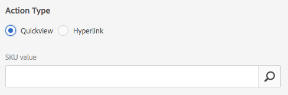
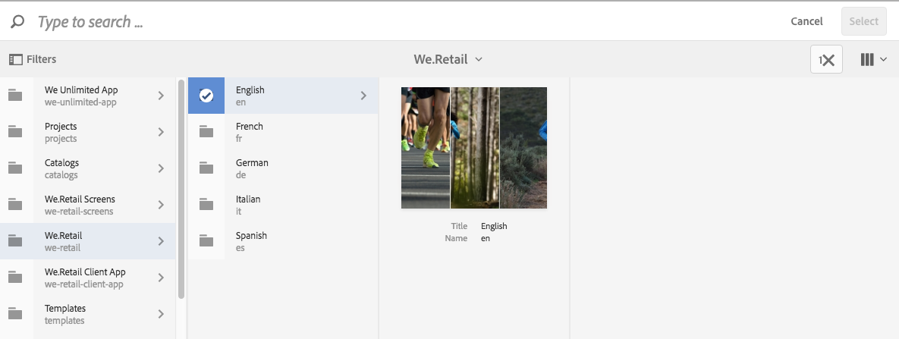

# Trabajar con selectores {#working-with-selectors}

Al trabajar con una imagen interactiva, un vídeo interactivo o un titular de carrusel, se seleccionan los recursos y los sitios y productos para las zonas interactivas y los mapas de imágenes a los que se va a vincular. Al trabajar con conjuntos de imágenes, conjuntos de giros y conjuntos multimedia, también puede seleccionar recursos con el Selector de recursos.

En este tema se explica cómo utilizar los selectores de producto, sitio y recurso, incluida la capacidad de examinar, filtrar y ordenar dentro de los selectores.

Puede acceder a los selectores al crear conjuntos de carrusel, agregar zonas interactivas y mapas de imágenes, crear imágenes y vídeos interactivos.

Por ejemplo, en este titular de carrusel, utilice el selector de productos si está vinculando un punto interactivo o un mapa de imagen a una página de vista rápida. Utilice el selector de sitio si está vinculando un punto interactivo o un mapa de imagen a un hipervínculo; utilice el selector de recursos cuando esté creando una diapositiva.

Cuando selecciona (en lugar de introducir manualmente) a dónde se dirigen los puntos interactivos o los mapas de imagen, está utilizando el selector. El selector de sitio solo funciona si es cliente de Sites Experience Manager. El selector de productos también requiere Experience Manager Commerce.

## Uso del selector de productos {#selecting-products}

Utilice el selector de productos para elegir un producto cuando desee que un punto interactivo o un mapa de imagen proporcionen una vista rápida a un producto específico de su catálogo de productos.

1. Vaya al conjunto de carrusel, la imagen interactiva o el vídeo interactivo y seleccione la pestaña **[!UICONTROL Actions]** (solo disponible si ha definido un punto interactivo o un mapa de imagen).

   El selector de producto se encuentra en el área **[!UICONTROL Tipo de acción]**.

   

1. Seleccione el icono **[!UICONTROL Selector de producto]** (lupa) y vaya a un producto del catálogo.

   

   Filtre por palabra clave o etiqueta tocando **[!UICONTROL Filtro]** e introduciendo palabras clave, o seleccionando etiquetas, o ambas.

   

   Para cambiar el lugar donde el Experience Manager busca los datos del producto, pulse **[!UICONTROL Examinar]** y vaya a otra carpeta.

   

   Seleccione **[!UICONTROL Ordenar]** por para cambiar si el Experience Manager ordena de más reciente a más antiguo o de más antiguo a más reciente.

   

   Seleccione **[!UICONTROL Ver como]** para cambiar la forma en que ve los productos: **[!UICONTROL Vista de lista]** o **[!UICONTROL Vista de tarjeta]**.

   

1. Una vez seleccionado el producto, el campo se rellena con la miniatura y el nombre del producto.

   

1. En el modo **[!UICONTROL Preview]**, puede seleccionar el punto interactivo o el mapa de imagen y ver el aspecto que tendrá la vista rápida.

   

## Uso del selector de sitios {#selecting-sites}

Utilice el selector del sitio para elegir una página web cuando desee que un punto interactivo o un mapa de imagen se vincule a una página web que se administra dentro de Sitios Experience Manager.

1. Vaya al conjunto de carrusel, la imagen interactiva o el vídeo interactivo y seleccione la pestaña **[!UICONTROL Actions]** (solo disponible si ha definido un punto interactivo o un mapa de imagen).

   El Selector de sitio se encuentra en el área **[!UICONTROL Tipo de acción]**.

   

1. Seleccione el icono **[!UICONTROL Selector de sitio]** (carpeta con lupa) y navegue a una página de los sitios Experience Manager a los que desee vincular el punto interactivo o el mapa de imagen.

   

1. Una vez seleccionado el sitio, el campo se rellena con la ruta.

   

1. En el modo **[!UICONTROL Vista previa]** si selecciona el punto interactivo o el mapa de imagen, puede navegar a la página del sitio Experience Manager que especificó.

## Uso del selector de recursos {#selecting-assets}

Utilice este selector para elegir imágenes que se utilizarán en un titular de carrusel, un vídeo interactivo, conjuntos de imágenes, conjuntos de medios mixtos y conjuntos de giros. En el vídeo interactivo, el selector de recursos está disponible cuando selecciona **[!UICONTROL Seleccionar recursos]** en la pestaña **[!UICONTROL Contenido]**. En Conjuntos de carrusel, el selector de recursos está disponible al crear una diapositiva. En Conjuntos de imágenes, Conjuntos de medios mixtos y Conjuntos de giros, el selector de recursos está disponible al crear un conjunto de imágenes, un conjunto de medios mixtos o un conjunto de giros, respectivamente.

Consulte también [Selector de recursos](search-assets.md#assetpicker) para obtener más información.

1. Vaya al conjunto de carrusel y cree una diapositiva. O bien, vaya al Vídeo interactivo, vaya a la pestaña **[!UICONTROL Contenido]** y seleccione recursos. O bien, cree un conjunto de medios mixtos, un conjunto de imágenes o un conjunto de giros.
1. Seleccione el icono **[!UICONTROL Selector de recursos]** (carpeta con lupa) y vaya a un recurso.

   

   Filtre por palabra clave o etiqueta tocando **[!UICONTROL Filtro]** e introduciendo palabras clave, o agregando criterios, o ambos.

   

   Cambie el lugar donde el Experience Manager navega por los recursos navegando a otra carpeta en el campo **[!UICONTROL Path]**.

   Seleccione **[!UICONTROL Collection]** para buscar solo recursos dentro de las colecciones.

   

   Seleccione **[!UICONTROL Ver como]** para cambiar la forma en que ve los productos: **[!UICONTROL Vista de lista]**, **[!UICONTROL Vista de columna]** o **[!UICONTROL Vista de tarjeta]**.

   

1. Para seleccionar el recurso, pulse la marca de verificación. Se muestra el recurso.

   
