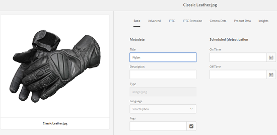
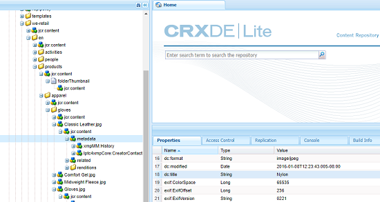
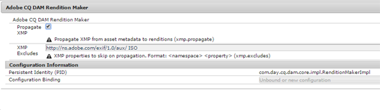
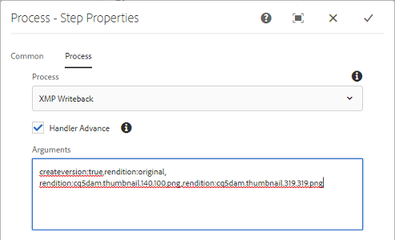
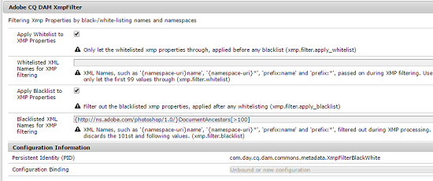

# Reescritura XMP en representaciones {#xmp-writeback-to-renditions}

| Versión | Vínculo del artículo |
| -------- | ---------------------------- |
| AEM as a Cloud Service | [Haga clic aquí](https://experienceleague.adobe.com/es/docs/experience-manager-cloud-service/content/assets/admin/xmp-metadata) |
| AEM 6.5 | Este artículo |

Esta característica de reescritura de XMP en [!DNL Adobe Experience Manager Assets] replica los cambios de metadatos en las representaciones del recurso original. Al cambiar los metadatos de un recurso desde Assets o al cargar el recurso, los cambios se almacenan inicialmente en el nodo de metadatos de la jerarquía de recursos.

La función de reescritura de XMP permite propagar los cambios de metadatos a todas las representaciones del recurso o a algunas específicas. La característica sólo devuelve las propiedades de metadatos que utilizan áreas de nombres registradas, es decir, se devuelve una propiedad denominada `dc:title` pero no una propiedad denominada `mytitle`.

Imagine un escenario en el que modifica la propiedad [!UICONTROL Title] del recurso con título `Classic Leather` a `Nylon`.

En este caso, [!DNL Experience Manager Assets] guarda los cambios realizados en la propiedad **[!UICONTROL Title]** en el parámetro `dc:title` para los metadatos de recursos almacenados en la jerarquía de recursos.

Sin embargo, [!DNL Experience Manager Assets] no propaga automáticamente ningún cambio de metadatos a las representaciones de un recurso. Consulte [cómo habilitar la reescritura en XMP](#enable-xmp-writeback).

## Habilitar reescritura de XMP {#enable-xmp-writeback}

Para permitir que los cambios de metadatos se propaguen a las representaciones del recurso al cargarlo, modifique la configuración de **[!UICONTROL Adobe CQ DAM Rendition Maker]** en el Administrador de configuración.

1. Para abrir el Administrador de configuración, acceda a `https://[aem_server]:[port]/system/console/configMgr`.
1. Abra la configuración de **[!UICONTROL Adobe CQ DAM Rendition Maker]**.
1. Seleccione la opción **[!UICONTROL Propagate XMP]** y, a continuación, guarde los cambios.

   

## Habilitar la reescritura en XMP para representaciones específicas {#enabling-xmp-writeback-for-specific-renditions}

Para permitir que la función de reescritura de XMP propague los cambios de metadatos a ciertas representaciones, especifique estas representaciones en el paso del flujo de trabajo Proceso de reescritura de XMP del flujo de trabajo [!UICONTROL DAM Metadata WriteBack]. De forma predeterminada, este paso se configura con la representación original.

Siga estos pasos para que la función de reescritura de XMP propague metadatos a las miniaturas de representación 140.100.png y 319.319.png.

1. En la interfaz de Experience Manager, vaya a **[!UICONTROL Herramientas]** > **[!UICONTROL Flujo de trabajo]** > **[!UICONTROL Modelos]**.
1. En la página Modelos, abra el modelo de flujo de trabajo **[!UICONTROL DAM Metadata Writeback]**.
1. En la página de **[!UICONTROL propiedades de escritura de metadatos DAM]**, abra el paso **[!UICONTROL Proceso de escritura XMP]**.
1. En el cuadro de diálogo [!UICONTROL Propiedades del paso], haga clic en la ficha **[!UICONTROL Proceso]**.
1. En el cuadro **Argumentos**, agregue `rendition:cq5dam.thumbnail.140.100.png,rendition:cq5dam.thumbnail.319.319.png` y haga clic en **[!UICONTROL Aceptar]**.

   

1. Guarde los cambios.
1. To regenerate the pyramid TIFF renditions for [!DNL Dynamic Media] images with the new attributes, add the **[!UICONTROL Dynamic Media Process Image Assets]** step to the [!UICONTROL DAM Metadata Writeback] workflow.

   Las representaciones PTIFF solo se crean y almacenan localmente en una implementación híbrida de Dynamic Media.

1. Save the workflow.

The metadata changes are propagated to the renditions thumbnail.140.100.png and thumbnail.319.319.png of the asset, and not the others.

>[!NOTE]
>
>For the supported platforms, see [XMP metadata write-back prerequisites](/help/sites-deploying/technical-requirements.md#requirements-for-aem-assets-xmp-metadata-write-back).

## Filtering XMP metadata {#filtering-xmp-metadata}

[!DNL Experience Manager Assets] supports both blocked list and allowed list filtering of properties/nodes for XMP metadata that is read from asset binaries and stored in JCR when assets are ingested.

Filtering using a blocked list lets you import all XMP metadata properties except the properties that are specified for exclusion. However, for asset types such as INDD files that have huge amounts of XMP metadata (for example, 1000 nodes with 10,000 properties), the names of nodes to be filtered are not always known in advance. If filtering using a blocked list allows a large number of assets with numerous XMP metadata to be imported, the [!DNL Experience Manager] deployment can encounter stability issues, for example, clogged observation queues.

Filtering of XMP metadata via allowed list resolves this issue by letting you define the XMP properties to be imported. This way, any other or unknown XMP properties are ignored. For backward compatibility, you can add some of these properties to the filter that uses a blocked list.

>[!NOTE]
>
>Filtering works only for the properties derived from XMP sources in asset binaries. For the properties derived from non-XMP sources, such as EXIF and IPTC formats, the filtering does not work. For example, the date of asset creation is stored in property named `CreateDate` in EXIF TIFF. Experience Manager stores this value in a metadata field named `exif:DateTimeOriginal`. As the source is a non-XMP source, filtering does not work on this property.

1. To open Configuration Manager, access `https://[aem_server]:[port]/system/console/configMgr`.
1. Open the **[!UICONTROL Adobe CQ DAM XmpFilter]** configuration.
1. To apply filtering by way of an allowed list, select **[!UICONTROL Apply Allowlist to XMP Properties]**, and specify the properties to be imported in the **[!UICONTROL Allowed XML Names for XMP filtering]** box.

   

1. To filter out blocked XMP properties after applying filtering through the allowed list, specify those in the **[!UICONTROL Blocked XML Names for XMP filtering]** box.

   >[!NOTE]
   >
   >The **[!UICONTROL Apply Blocklist to XMP Properties]** option is selected by default. In other words, filtering using a blocked list is enabled by default. To disable such filtering, cancel the selection of the **[!UICONTROL Apply Blocklist to XMP Properties]** option.

1. Guarde los cambios.
