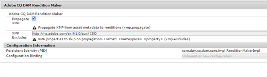

# Reescritura XMP en representaciones {#xmp-writeback-to-renditions}

Esta función de reescritura XMP en Recursos Adobe Experience Manager (AEM) replica los cambios de metadatos de recursos en las representaciones del recurso.

Al cambiar los metadatos de un recurso desde Recursos AEM o al cargar el recurso, los cambios se almacenan inicialmente en el nodo de recurso en Crx-De.

La función de reescritura XMP propaga los cambios de metadatos en todas las representaciones del recurso o en determinadas representaciones.

Considere un escenario en el que modifique la propiedad Title del recurso `Classic Leather` al que se le ha asignado `Nylon`.

En este caso, Recursos AEM guarda los cambios en la propiedad **Title** en el parámetro `dc:title` de los metadatos del recurso almacenados en la jerarquía de recursos.

Sin embargo, Recursos AEM no propaga automáticamente ningún cambio de metadatos en las representaciones de un recurso.

La función de reescritura XMP le permite propagar los cambios de metadatos en todas las representaciones del recurso o en determinadas representaciones. Sin embargo, los cambios no se almacenan en el nodo de metadatos de la jerarquía de recursos. En su lugar, esta función incrusta los cambios en los archivos binarios para las representaciones.

## Activación de la reescritura XMP {#enabling-xmp-writeback}

Para permitir que los cambios de metadatos se propaguen a las representaciones del recurso al cargarlo, modifique la configuración de **Adobe CQ DAM Rendition Maker** en Configuration Manager.

1. Para abrir Configuration Manager, acceda a `https://[aem_server]:[port]/system/console/configMgr`.
1. Abra la configuración de **Adobe CQ DAM Rendition Maker** .
1. Seleccione la opción **Propagar XMP** y, a continuación, guarde los cambios.

   

## Activación de la reescritura XMP para representaciones específicas {#enabling-xmp-writeback-for-specific-renditions}

Para permitir que la función de reescritura XMP propague los cambios de metadatos para seleccionar las representaciones, especifique estas representaciones en el paso de flujo de trabajo del proceso de reescritura XMP del flujo de trabajo de escritura de metadatos DAM. De forma predeterminada, este paso se configura con la representación original.

Para que la función de reescritura XMP propague metadatos a las miniaturas de representación 140.100.png y 319.319.png, lleve a cabo estos pasos.

1. Toque o haga clic en el logotipo de AEM y, a continuación, vaya a **Herramientas** > **Flujo de trabajo** > **Modelos**.
1. En la página Modelos, abra el modelo de flujo de trabajo de reescritura de metadatos **DAM** .
1. En la página de propiedades de escritura **de metadatos** DAM, abra el paso Proceso **de escritura** XMP.
1. En el cuadro de diálogo Propiedades del paso, toque o haga clic en la ficha **Proceso** .
1. En el cuadro **Argumentos** , agregue `rendition:cq5dam.thumbnail.140.100.png,rendition:cq5dam.thumbnail.319.319.png`y toque o haga clic en **Aceptar**.

   

1. Guarde los cambios.
1. Para volver a generar las representaciones TIF piramidales para imágenes de Dynamic Media con los nuevos atributos, agregue el paso Recursos **de imagen de proceso de medios** dinámicos al flujo de trabajo de reescritura de metadatos DAM.

   Las representaciones PTIFF solo se crean y almacenan localmente en una implementación híbrida de Dynamic Media.

1. Guarde el flujo de trabajo.

Los cambios en los metadatos se propagan a las representaciones thumbnail.140.100.png y thumbnail.319.319.png del recurso, y no a los demás.

>[!NOTE]
>
>Para los problemas de escritura XMP en Linux de 64 bits, consulte [Cómo habilitar la escritura de retorno XMP en RedHat Linux](https://helpx.adobe.com/experience-manager/kb/enable-xmp-write-back-64-bit-redhat.html)de 64 bits.
>
>Para obtener más información sobre las plataformas admitidas, consulte Requisitos previos para la devolución de [metadatos XMP](/help/sites-deploying/technical-requirements.md#requirements-for-aem-assets-xmp-metadata-write-back).

## Filtrado de metadatos XMP {#filtering-xmp-metadata}

Recursos AEM admite el filtrado de propiedades/nodos de listas negras y listas blancas para los metadatos XMP que se leen de los binarios de recursos y se almacenan en JCR cuando se ingestan recursos.

El filtrado de listas negras permite importar todas las propiedades de metadatos XMP, excepto las propiedades especificadas para la exclusión. Sin embargo, para tipos de recursos como archivos INDD que tienen grandes cantidades de metadatos XMP (por ejemplo, 1000 nodos con 10.000 propiedades), los nombres de los nodos que se van a filtrar no siempre se conocen por adelantado. Si el filtrado de listas negras permite importar un gran número de recursos con numerosos metadatos XMP, la instancia/clúster de AEM puede encontrar problemas de estabilidad, por ejemplo, colas de observación obstruidas.

El filtrado de la lista blanca de metadatos XMP resuelve este problema permitiéndole definir las propiedades XMP que se van a importar. De este modo, se omiten otras propiedades XMP desconocidas. Puede agregar algunas de estas propiedades al filtro de lista negra para obtener compatibilidad con versiones anteriores.

>[!NOTE]
>
>El filtrado solo funciona para las propiedades derivadas de orígenes XMP en los binarios de recursos. Para las propiedades derivadas de orígenes no XMP, como los formatos EXIF e IPTC, el filtrado no funciona. Por ejemplo, la fecha de creación de recursos se almacena en la propiedad denominada `CreateDate` en TIFF EXIF. AEM registra este valor en el campo de metadatos denominado `exif:DateTimeOriginal`. Como el origen es un origen que no es XMP, el filtrado no funciona en esta propiedad.

1. Para abrir Configuration Manager, acceda a `https://[aem_server]:[port]/system/console/configMgr`.
1. Abra la configuración de **Adobe CQ DAM XmpFilter** .
1. Para aplicar el filtrado de listas blancas, seleccione **Aplicar lista blanca a las propiedades** XMP y especifique las propiedades que desea importar en el cuadro de filtrado **Nombres XML** admitidos para XMP.

   

1. Para filtrar las propiedades XMP bloqueadas después de aplicar el filtro de la lista blanca, especifíquelas en el cuadro de filtrado **Nombres XML** bloqueados para XMP.

   >[!NOTE]
   >
   >La opción **Aplicar lista negra a propiedades** XMP está seleccionada de forma predeterminada. En otras palabras, el filtrado de listas negras está habilitado de forma predeterminada. Para desactivar el filtrado de listas negras, desactive la opción **Aplicar lista negra a propiedades** XMP.

1. Guarde los cambios.
