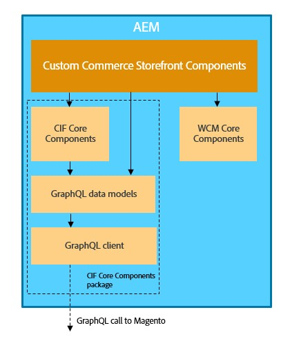

# AEM Integración de y Adobe Commerce (Magento) con Commerce integration framework {#aem-commerce-framework}

El Experience Manager y Adobe Commerce se integran perfectamente con el Commerce integration framework CIF (). CIF AEM Adobe Commerce La permite a los usuarios acceder directamente a la instancia de commerce y comunicarse con ella mediante el [API de GraphQL](https://devdocs.magento.com/guides/v2.4/graphql/).

>[!NOTE]
>
>La versión mínima de la API de GraphQL admitida es 2.3.5. Algunas funciones solo son compatibles con las versiones más recientes o solo con la edición de Adobe Commerce.

## Información general sobre la arquitectura {#overview}

La arquitectura general es la siguiente:

CIF Dentro de, hay compatibilidad con patrones de comunicación del lado del servidor y del lado del cliente.
Las llamadas del lado del servidor de API se implementan mediante el complemento integrado genérico [cliente de GraphQL](https://github.com/adobe/commerce-cif-graphql-client) en combinación con un [conjunto de modelos de datos generados](https://github.com/adobe/commerce-cif-magento-graphql) para el esquema de commerce GraphQL. Además, se puede utilizar cualquier consulta o mutación de GraphQL en formato GQL.

Para los componentes del lado del cliente, que se generan mediante [React](https://reactjs.org/), se utiliza el cliente [Apollo](https://www.apollographql.com/docs/react/).

## AEM CIF Arquitectura de componentes principales de {#cif-core-components}

[AEM CIF Componentes principales de](https://github.com/adobe/aem-core-cif-components) siga patrones de diseño y prácticas recomendadas muy similares a los de la [AEM Componentes principales de WCM](https://github.com/adobe/aem-core-wcm-components).

La lógica empresarial y la comunicación back-end con Adobe Commerce AEM CIF para los componentes principales de la se implementan en los modelos Sling. En caso de que sea necesario personalizar esta lógica para cumplir los requisitos específicos del proyecto, se puede utilizar el patrón de delegación para modelos Sling.

>[!TIP]
>
>La página [Personalización de los componentes principales del CIF de AEM](../customizing/customize-cif-components.md) tiene un ejemplo detallado y una práctica recomendada sobre cómo personalizar los componentes principales del CIF.

AEM CIF Dentro de los proyectos, los componentes principales de la y los componentes de proyecto personalizados pueden recuperar fácilmente el cliente configurado para una tienda de Adobe Commerce AEM asociado a una página mediante la configuración según el contexto de Sling.
