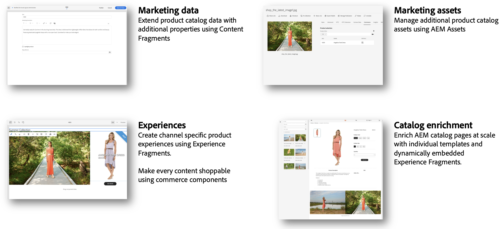

# Content and Commerce {#content-commerce}

Con Content y Commerce de Adobe Experience Manager, las marcas pueden escalar e innovar con mayor rapidez para diferenciar las experiencias comerciales y captar un gasto en línea acelerado. AEM Content and Commerce combina las experiencias inmersivas, omnicanal y personalizadas en Experience Manager con cualquier cantidad de soluciones de comercio para aportar experiencias diferenciadas a todas las partes del recorrido de compras, reducir el tiempo de obtención de valor e impulsar una mayor conversión.

## Cómo Content and Commerce ayudan a los clientes a tener éxito

Con expectativas crecientes de los clientes en cuanto a experiencias de comercio en línea, las marcas se ven presionadas para ofrecer experiencias diferenciadas y más contenido con mayor rapidez. Sin embargo, la implementación de una plataforma de administración de contenido a menudo requiere fuertes inversiones en tiempo y presupuesto para desarrollar elementos fundamentales, tales como componentes personalizados y herramientas de creación, y acumula costes en mantenimiento y actualizaciones. Experience Manager Sites ofrece Content and Commerce como módulo complementario para Experience Manager que proporciona componentes principales de comercio listos para usar, herramientas de creación y una tienda de referencia para acelerar el lanzamiento, permitir una colaboración fluida entre equipos e impulsar la conversión.

Las marcas pueden integrar Experience Manager con Adobe Commerce, parte de Adobe Experience Cloud, así como con cualquier motor de comercio que elijan. Con Experience Manager Content and Commerce, las marcas pueden hacer lo siguiente:

* Escalar e innovar más rápidamente
* Personalizar experiencias para impulsar la conversión
* Crear una vez y publicar en todas partes
* Enriquecer y diferenciar experiencias para los clientes
* Optimizar la creación con acceso a datos de Commerce

## Introducción a AEM Commerce Integration Framework (CIF) {#cif-intro}

Estos proyectos tienen que hacer frente a la complejidad de integrar una solución de comercio. Una solución de comercio puede ser cualquier cosa, desde una solución comercial como Adobe Commerce a un conjunto de servicios de comercio personalizados. La integración depende en gran medida del ecosistema y de los casos de uso. Suele afectar a varios lugares y toma diferentes formas:

* Integración de un ecosistema complejo y dinámico (por ejemplo, catálogos de productos)
* El negocio necesita administrar el contenido del producto con su propio ciclo de vida de una manera eficiente y omnicanal
* Creación de recorridos de compra, complejos y personalizados, para varios destinatarios
* Capacidad de adaptarse e innovar rápidamente en el back-end y front-end
* Ejecutar una infraestructura E2E escalable y estable que esté preparada para rendir al máximo (venta flash, Black Friday, etc.). Esto incluye la búsqueda unificada y la administración de la caché.

Esta complejidad abre la puerta a posibles fallos, un incremento del coste total de propiedad (TCO), retrasos y menor realización de valor. Estas razones han llevado al desarrollo de Commerce Integration Framework (CIF), que es un complemento de Experience Manager. CIF amplía Experience Manager con capacidades comerciales y estandariza la integración con un motor de comercio. El resultado es una solución estable, escalable y preparada para el futuro con un menor coste total de propiedad (TCO). Desbloquea la innovación técnica y empresarial con herramientas ágiles y funciones integradas para crear experiencias comerciales atractivas.

## CIF apoya con éxito a sus clientes desde 2013

Con más de 200 clientes, CIF se ha consolidado como un ingrediente exitoso para un proyecto de Content and Commerce con éxito. Esto aporta valor a la TI y a las empresas hoy y en el futuro. CIF Los proyectos recientes de clientes describen a los clientes como &quot;un gran acelerador y un gran ahorro de tiempo con mucho valor&quot;.

## Beneficios del CIF {#cif-benefits}

CIF proporciona componentes básicos predeterminados que reducen la necesidad de usar un código personalizado, lo que acelera el tiempo de salida al mercado de las marcas. Todos los componentes principales están integrados de forma predeterminada con la capa de datos del lado del cliente de Adobe para integrar los perfiles de los clientes, como el perfil unificado. Este perfil captura en detalle el comportamiento de un visitante, que puede utilizarse para predecir y personalizar el recorrido del cliente en tiempo real.

El complemento CIF introduce el contexto del producto en Experience Manager y proporciona herramientas de creación, como una consola de producto y selectores de producto/categoría, que permiten al experto en marketing crear y ofrecer experiencias de compra en Experience Manager sin depender del desarrollador. Las ventajas incluyen las siguientes:

### Experiencias

Las potentes herramientas del CIF en AEM permiten a los creadores de contenido crear rápidamente experiencias de comercio ricas y personalizadas de una manera escalable y sin depender del envío para aprovechar las oportunidades del negocio.

### Tiempo de creación de valor (TTV)

Acelera el desarrollo de proyectos con [AEM Componentes principales](https://www.aemcomponents.dev/), [AEM Tienda de referencia de Venia en](https://github.com/adobe/aem-cif-guides-venia), [AEM Tipo de archivo del proyecto](https://experienceleague.adobe.com/docs/experience-manager-core-components/using/developing/archetype/overview.html?lang=es)y patrones de integración para PWA (contenido sin encabezado y Commerce).

CIF está pensado para la innovación continua con un complemento siempre actualizado, que permite al cliente acceder a funciones nuevas y mejoradas.

### Integraciones

Conecte el ecosistema (por ejemplo, la solución de comercio) con Experience Cloud mediante [Adobe I/O Runtime](https://www.adobe.io/apis/experienceplatform/runtime.html), un PaaS sin servidor basado en microservicios y la [Implementación de referencia de CIF](https://github.com/adobe/commerce-cif-graphql-integration-reference).

## Patrones comprobados y prácticas recomendadas

CIF admite clientes con patrones de integración estandarizados basados en prácticas recomendadas. Esto ayuda a los clientes a tener éxito hoy y tener la flexibilidad para crecer con el cliente y adaptarse a los requisitos futuros:

* Elimina los desafíos típicos relacionados con las integraciones de catálogos de productos que pueden producirse. Por ejemplo:
   * Problemas de rendimiento con mayor volumen o complejidad del catálogo
   * No tener acceso a los datos clasificados
   * Necesidad de experiencias y datos de productos en tiempo real
* La creciente madurez digital hace necesaria la administración de la experiencia. CIF incluye capacidades de administración de experiencia de producto que se pueden incorporar gradualmente sin necesidad de un esfuerzo adicional en TI.
* Listo para el omnicanal: CIF admite una variedad de tecnologías de puntos de contacto (del lado del servidor, híbridas, del lado del cliente) con patrones, aceleradores y componentes principales.
