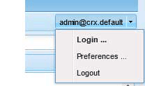

# Creación de un Simulador Para Pruebas SCF {#create-an-scf-sandbox}

A partir de AEM 6.1 Communities, la forma más fácil de crear rápidamente un simulador para pruebas es crear un sitio de comunidad. See [Getting Started with AEM Communities](getting-started.md).

Otra herramienta útil para desarrolladores es la guía [Componentes de la](components-guide.md)comunidad, que permite la exploración y la creación rápida de prototipos de componentes y características de Communities.

El ejercicio de crear un sitio web puede ser útil para comprender la estructura de un sitio web de AEM que puede incluir funciones de Comunidades, al tiempo que proporciona páginas sencillas en las que explorar la posibilidad de trabajar con el marco de componentes [sociales (SCF)](scf.md).

Este tutorial está dirigido principalmente a desarrolladores nuevos de AEM interesados en utilizar componentes SCF. Recorre la creación de un sitio de Simulador para pruebas SCF, similar al tutorial sobre [Cómo crear un sitio](../../help/sites-developing/website.md) web de Internet con todas las funciones, que se centra en las estructuras del sitio, como navegación, logotipo, búsqueda, barra de herramientas y listas de páginas secundarias.

El desarrollo tiene lugar en una instancia de autor, mientras que la mejor manera de experimentar con el sitio es en una instancia de publicación.

Los pasos de este tutorial son:

* [Configuración de la estructura del sitio web](setup-website.md)
* [Aplicación inicial de Simulador para pruebas](initial-app.md)
* [Contenido inicial del Simulador para pruebas](initial-content.md)
* [Desarrollar aplicación de Simulador para pruebas](develop-app.md)
* [Agregar Clientlibs](add-clientlibs.md)
* [Desarrollar contenido de Simulador para pruebas](develop-content.md)

>[!CAUTION]
>
>Este tutorial no crea un sitio de comunidad con la funcionalidad creada mediante la consola [Sitios de](sites-console.md)comunidades. Por ejemplo, este tutorial no describe cómo configurar el inicio de sesión, el registro automático, el inicio de sesión [en](social-login.md)redes sociales, los mensajes, los perfiles, etc.
>
>Si se prefiere un sitio de comunidad simple, siga el tutorial [Crear una página](create-sample-page.md) de muestra.

## Requisitos previos {#prerequisites}

En este tutorial se asume que tiene instalado un autor de AEM y una instancia de publicación de AEM que tiene la [última versión](deploy-communities.md#latest-releases) de Communities.

A continuación se proporcionan algunos vínculos útiles para los desarrolladores que no usan la plataforma AEM:

* [Introducción](../../help/sites-deploying/deploy.md#getting-started): para implementar instancias de AEM

   * [Conceptos básicos](../../help/sites-developing/the-basics.md): para desarrolladores de sitios web y funciones
   * [Primeros pasos para autores](../../help/sites-authoring/first-steps.md): para crear contenido de página

## Uso del entorno de desarrollo CRXDE Lite {#using-crxde-lite-development-environment}

Los desarrolladores de AEM invierten gran parte de su tiempo en el entorno de desarrollo de [CRXDE Lite](../../help/sites-developing/developing-with-crxde-lite.md) en una instancia de creación. CRXDE Lite proporciona un acceso menos restringido al repositorio de CRX. Las herramientas de IU clásicas y las consolas de IU táctiles proporcionan un acceso más estructurado a partes específicas del repositorio de CRX.

Después de iniciar sesión con privilegios administrativos, hay varias formas de acceder a CRXDE Lite:

1. En la navegación global, seleccione **[!UICONTROL Herramientas de navegación > CRXDE Lite]**.

   

2. En la página [de bienvenida de la IU](http://localhost:4502/welcome.html)clásica, desplácese hacia abajo y haga clic en **[!UICONTROL CRXDE Lite]** en el panel derecho.

   

3. Navegue directamente a `CRXDE Lite`: `<server>:<port>/crx/de`

   Por ejemplo, en una instancia de autor local: [http://localhost:4502/crx/de](http://localhost:4502/crx/de)

Para trabajar con CRXDE Lite, debe iniciar sesión con privilegios de desarrollador o administrador. Para la instancia localhost predeterminada, puede iniciar sesión con

* `username: admin`
* `password: admin`

**Tenga en cuenta** que este inicio de sesión se agotará y tendrá que volver a iniciar sesión periódicamente mediante la extracción en el extremo derecho de la barra de herramientas de CRXDe Lite.

Si no ha iniciado sesión, no podrá navegar por el repositorio de JCR ni realizar ninguna operación de edición o almacenamiento.

***Cuando esté en duda, vuelva a iniciar sesión.***

