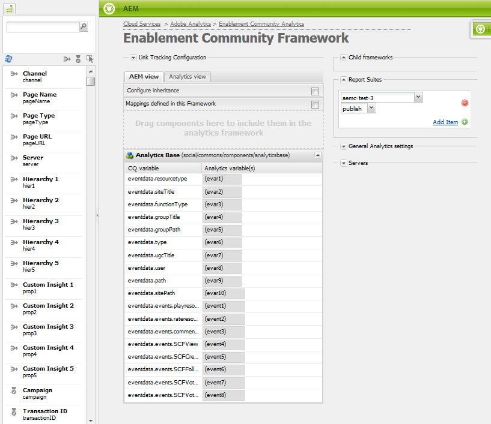

# Configuración de Analytics para funciones de Communities {#analytics-configuration-for-communities-features}

## Información general {#overview}

Adobe Analytics y Adobe Experience Manager (AEM) son soluciones de Adobe Marketing Cloud.

Adobe Analytics se puede configurar para AEM Communities de modo que, cuando un miembro interactúe con las funciones de Communities admitidas, los eventos se envíen a Adobe Analytics desde el que se generan los informes.

Por ejemplo, cuando un miembro de un sitio de la comunidad de habilitación ve un recurso de vídeo asignado a él, el reproductor de recursos envía eventos a Analytics, incluidos datos de Video Heartbeat. Desde el sitio de la comunidad, los administradores pueden ver varios informes sobre la reproducción del vídeo.

Además, se necesita análisis para:

* En el entorno de publicación:

   * Creación de informes sobre las [tendencias](/help/communities/trends.md) de la comunidad
   * Permitir a los visitantes del sitio clasificar por &quot;más visitados&quot;, &quot;más activos&quot;, &quot;más &quot;me gusta&quot;
   * Ver recuentos en listas UGC

* En el entorno de creación:

   * Visualización de los datos de participación en la [consola de administración de miembros](/help/communities/members.md) (vistas, anuncios, seguidores, &quot;Me gusta&quot;)
   * Resumen de tendencias, latido de vídeo y dispositivo de vídeo para habilitar recursos [informes](/help/communities/reports.md)

Las funciones de comunidades compatibles son:

* [Recursos de habilitación](/help/communities/resources.md)
* [Foro](/help/communities/forum.md)
* [P y R](/help/communities/working-with-qna.md)
* [Blog](/help/communities/blog-feature.md)
* [Biblioteca de archivos](/help/communities/file-library.md)
* [Calendario](/help/communities/calendar.md)

En esta sección de la documentación se describe cómo conectar un grupo de informes de Analytics a las funciones de Communities. Los pasos básicos son:

1. [Replicar la ](#replicate-the-crypto-key) clave criptográfica para garantizar que el cifrado/descifrado se produce correctamente en todas las instancias AEM
1. Preparar un grupo de informes [de Adobe Analytics](#adobe-analytics-report-suite-for-video-reporting)
1. Crear un [servicio en la nube](#aem-analytics-cloud-service-configuration) y un [marco](#aem-analytics-framework-configuration) de AEM Analytics

1. [Habilitar ](#enable-analytics-for-a-community-site) Analytics para un sitio de comunidad
1. [****](#verify-analytics-to-aem-variable-mapping) VerifyAnalytics para AEM asignación de variables
1. Identifique [publicador principal](#primary-publisher)
1. [](#publish-community-site-and-analytics-cloud-service) Publicar el sitio de la comunidad
1. Configure la [importación de datos de informes](#obtaining-reports-from-analytics) desde Adobe Analytics al sitio de la comunidad

## Requisitos previos {#prerequisites}

Para configurar las funciones de Analytics para Communities, es necesario que trabaje con el representante de cuentas para configurar una cuenta de Adobe Analytics y el [grupo de informes](#adobe-analytics-report-suite-for-video-reporting). Una vez establecida, debe estar disponible la siguiente información:

* **Nombre de la empresa**

   Empresa asociada a la cuenta de Adobe Analytics.

* **Nombre de usuario**

   El nombre de usuario de inicio de sesión del usuario autorizado para administrar la cuenta de Analytics
(debe incluir privilegios de acceso a servicios web).

* **Contraseña**

   La contraseña de inicio de sesión del usuario autorizado.

* **Centro de datos de Analytics**

   Dirección URL del centro de datos de Analytics para la cuenta.

* **Grupo de informes**

   Nombre del grupo de informes de Analytics que se va a usar.

## Grupo de informes de Adobe Analytics para informes de vídeo {#adobe-analytics-report-suite-for-video-reporting}

Con el [Administrador del grupo de informes](https://docs.adobe.com/content/help/en/analytics/admin/manage-report-suites/new-report-suite/new-report-suite.html) de Adobe Marketing Cloud, los grupos de informes de Analytics se pueden configurar de modo que un sitio de la comunidad se pueda habilitar para proporcionar informes sobre las funciones de Communities.

Al iniciar sesión en [Adobe Experience Cloud](https://docs.adobe.com/content/help/en/analytics/analyze/analysis-workspace/home.html) con [Nombre de la empresa y Nombre de usuario](/help/communities/analytics.md#prerequisites), es posible configurar un grupo de informes nuevo o existente para que tenga:

* [11 Variables de conversión](https://docs.adobe.com/content/help/en/analytics/admin/admin-tools/conversion-variables/conversion-var-admin.html)  (eVars)

   * **`evar1`** mediante  **`evar11`** activado

   * Puede cambiar el propósito (cambiar el nombre) de las eVars existentes o crear nuevas que usar para las funciones de Communities

* [7 Eventos de éxito](https://docs.adobe.com/content/help/en/analytics/admin/admin-tools/success-events/success-event.html)  (eventos)

   * **`event1`** mediante  **`event7`** activado

   * tipo **`Counter`**

      * not **`Counter (no subrelations)`**
   * Puede cambiar el propósito de los eventos existentes (cambiar su nombre) o crear otros nuevos para utilizarlos en las funciones de Communities


* [Administración de vídeo](https://docs.adobe.com/content/help/en/media-analytics/using/media-overview.html)

   * Consola de informes de vídeo

      * Habilitar `Video Core`
      * Seleccione Guardar
   * Consola de medición de Video Core

      * Seleccione `Use Solution Variables`
      * Seleccione Guardar


Si utiliza un **nuevo grupo de informes**, tenga en cuenta que un nuevo grupo de informes solo puede tener 4 evars y 6 variables de eventos, mientras que para las comunidades se necesitan 11 evars y 7 variables de eventos.

Si se utiliza un **grupo de informes existente**, puede ser necesario [modificar la asignación de variables](#modifying-analytics-variable-mapping) antes de activar el marco de trabajo de Analytics para un sitio de comunidad.

Póngase en contacto con el representante de cuentas para conocer las variables dedicadas a Communities.

>[!CAUTION]
>
>**Si utiliza un grupo de informes existente que ya utilice variables dentro de**
>
>* **`evar1`** hasta **`evar11`**
   >
   >
* **`event1`** hasta **`event7`**
>
>
**A continuación, antes de que se publique el sitio de la comunidad,**  es importante restaurar la asignación preexistente moviendo las variables de AEM que se asignaron automáticamente a variables de Analytics cuando Analytics estaba habilitado para un sitio de la comunidad.
>
>Para restaurar la asignación preexistente y mover variables de AEM a otras variables de Analytics, consulte la sección sobre [Modificación de la asignación de variables de Analytics](#modifying-analytics-variable-mapping).
>
>Si no lo hace, puede producirse una pérdida de datos irrecuperable.

### Video Heartbeat Analytics {#video-heartbeat-analytics}

Cuando Video Heartbeat Analytics tiene licencia, se asigna un `Marketing Cloud Org Id`.

Para habilitar los informes de Video Heartbeat después de [configurar el grupo de informes de Analytics para los informes de vídeo](#adobe-analytics-report-suite-for-video-reporting):

* Crear un [servicio en la nube de Analytics](#aem-analytics-cloud-service-configuration)
* Habilitar [Analytics para un sitio de la comunidad](#enable-analytics-for-a-community-site)
* Asociar el `Marketing Cloud Org Id` con el sitio de la comunidad

El `Marketing Cloud Org Id` se puede introducir en el momento de la [creación del sitio de la comunidad](/help/communities/sites-console.md#enablement) o posterior modificando [las](/help/communities/sites-console.md#modifying-site-properties) propiedades del sitio de la comunidad. [](#aem-analytics-cloud-service-configuration)


Cuando Video Heartbeat Analytics está habilitado, el código JavaScript (JS) del reproductor de vídeo crea una instancia del código de la biblioteca de Video Heartbeat (también en JS), que gestiona toda la lógica para enviar actualizaciones de estado de vídeo a los servidores de seguimiento de vídeo de Analytics cada 10 segundos (no configurable) y, finalmente, envía un informe acumulativo de la sesión de vídeo a los servidores principales de Analytics.

Si no está habilitado, nunca se crea una instancia del código de Video Heartbeat y solo el seguimiento de progreso y de posición de reanudación del vídeo se mantiene en SRP para los informes.

## Configuración del servicio de Analytics Cloud de AEM {#aem-analytics-cloud-service-configuration}

Para crear una nueva integración de Analytics que integre Adobe Analytics con el sitio de la comunidad AEM, utilice la IU estándar en la instancia de autor:

* Desde la navegación global: **[!UICONTROL Herramientas]** > **[!UICONTROL Implementación]** > **[!UICONTROL Cloud Services]**
* Desplácese hacia abajo hasta **[!UICONTROL Adobe Analytics]**
* Seleccione **[!UICONTROL Configurar ahora]** o **[!UICONTROL Mostrar configuraciones]**


### Crear cuadro de diálogo de configuración {#create-configuration-dialog}

* Seleccione el icono `[+]` junto a **[!UICONTROL Configuraciones disponibles]** para crear una nueva configuración

En el cuadro de diálogo Crear configuración , los valores que se introducen identifican la configuración.


* **Título**

   (Obligatorio) Un título de visualización para la configuración.
Por ejemplo, introduzca *Enablement Community Analytics*

* **Nombre**

   (Opcional) Si no se especifica, el nombre pasará de forma predeterminada a un nombre de nodo válido derivado del título.
Por ejemplo, introduzca *communities*

* **Plantilla**

   Seleccione `Adobe Analytics Configuration`

* Seleccione **Crear**

   * Inicia la página de configuración y abre el cuadro de diálogo `Analytics Settings`

### Diálogo Configuración de Analytics {#analytics-settings-dialog}

La creación inicial de una nueva configuración de Analytics hace que se muestre la configuración y un nuevo cuadro de diálogo para introducir la configuración de Analytics. Este cuadro de diálogo requiere la [información de cuenta de requisito previo](#prerequisites) obtenida del representante de la cuenta.


* **Empresa**

   Empresa asociada a la cuenta de Adobe Analytics.

* **Nombre de usuario**

   El nombre de usuario de inicio de sesión del usuario autorizado para administrar la cuenta de Analytics.

* **Contraseña**

   La contraseña de inicio de sesión del usuario autorizado.

* **Centro de datos**

   Seleccione el centro de datos de Analytics que aloja el grupo de informes.

* **No añadir etiqueta de seguimiento a la página**

   Deje como predeterminado (sin seleccionar).

* **Utilizar AppMeasurement**

   Deje como predeterminado (sin seleccionar).

* **No importar las impresiones de la página cada noche (Author)**

   Deje como predeterminado (sin seleccionar).

* **No importar las impresiones de la página cada noche (Publish)**

   Deje como predeterminado (sin seleccionar).

Para guardar la configuración:

* Seleccione **Conectar con Analytics**

   * Si no se realiza correctamente,

      * Las entradas de verificación no contienen espacios iniciales.
      * Pruebe con otro centro de datos.

* Seleccione **OK**.

   

### Crear módulo {#create-framework}

Después de configurar correctamente la conexión básica a Adobe Analytics, es necesario crear o editar un marco para el sitio de la comunidad. El propósito del marco es asignar variables de características (AEM) de Communities a variables de Analytics (grupo de informes).

* Seleccione el icono `[+]` junto a **[!UICONTROL Marcos disponibles]** para crear un nuevo marco

   

* **Título**

   (Obligatorio) Un título que se muestra para el marco
Por ejemplo, introduzca *Enablement Community Framework*.

* **Nombre**

   (Opcional) Si no se especifica, el nombre pasará de forma predeterminada a un nombre de nodo válido derivado del título.
Por ejemplo, introduzca *communities*.

* *Plantilla*

   Seleccione `Adobe Analytics Framework`.

* Seleccione **Crear**.

Al crear el marco de trabajo de Analytics se abre el marco de trabajo para la configuración.

## Configuración de AEM Analytics Framework {#aem-analytics-framework-configuration}

El propósito del marco es asignar variables de AEM a variables de Analytics (eVars y eventos). Las variables de Analytics disponibles para asignación [se definen en el grupo de informes](#adobe-analytics-report-suite-for-video-reporting).


### Seleccionar grupo de informes {#select-report-suite}

Seleccione el grupo de informes que se ha configurado para los informes de vídeo.

Si un grupo de informes aún no se ha creado o no está configurado correctamente, consulte la sección anterior:
[Grupo de informes de Adobe Analytics para informes de vídeo](#adobe-analytics-report-suite-for-video-reporting)

La barra de tareas no es necesaria y se puede minimizar para que no obstaculice el acceso a la configuración de los grupos de informes.

#### Cuadro de diálogo Grupos de informes antes y después de seleccionar &quot;Agregar elemento&quot; {#report-suites-dialog-before-and-after-selecting-add-item}


1. Seleccione **Agregar elemento +**.

   Aparecen dos cuadros desplegables.

1. Elija un `Report suite.`

   Los grupos de informes asociados con la cuenta de empresa están disponibles para su selección.

1. Seleccione **Yes** en el cuadro de diálogo que se abre:

   ```
   Load default server settings?
    Do you want to load the default server settings and overwrite current values in the Server section?
   ```

1. Elija un `Run Mode`.

1. Seleccione **Publicar**.


El servicio de nube y el marco de trabajo de Analytics ya están completos. Las asignaciones se definirán una vez que se haya creado un sitio de la comunidad con este servicio de Analytics habilitado.

## Habilitar Analytics para un sitio de comunidad {#enable-analytics-for-a-community-site}

### Habilitar para nuevo sitio de comunidad {#enable-for-new-community-site}

Para agregar el servicio en la nube de Analytics mientras [crea un nuevo sitio de la comunidad](/help/communities/sites-console.md):

* En el paso 3, en la pestaña [ANALYTICS](/help/communities/sites-console.md#analytics):
   * Seleccione la casilla de verificación **Habilitar Analytics**.
   * Seleccione el marco en el cuadro desplegable.

* De forma opcional, vuelva a la configuración del marco de Analytics para ajustar las asignaciones de variables.

### Habilitar para sitio de comunidad existente {#enable-for-existing-community-site}

Para agregar el servicio en la nube de Analytics a un [sitio de la comunidad existente](/help/communities/sites-console.md#modifying-site-properties):

* Vaya a la consola **Communities > Sites** .
* Seleccione el icono Editar sitio del sitio de la comunidad.
* Seleccione CONFIGURACIÓN.
* En la sección Analytics :
   * Seleccione la casilla de verificación **Habilitar Analytics**.
   * Elija el marco en el cuadro desplegable.

* De forma opcional, vuelva a la configuración del marco de Analytics para ajustar las asignaciones de variables.

### Habilitar para sitios personalizados {#enable-for-customized-sites}

Para que el seguimiento y la importación de Analytics funcionen correctamente en un sitio de comunidad, debe estar presente un elemento de página con la clase `scf-js-site-title` y los atributos href. Solo debe existir uno de estos elementos en la página, como hace en un script `sitepage.hbs` no modificado para un sitio de la comunidad. El valor de `siteUrl` se extrae y se envía a Adobe Analytics como *ruta del sitio*.

```xml
# present in default sitepage.hbs
# only one scf-js-site-title class should be included
# this example sets it to be hidden as it serves no visual purpose
<div
    class="navbar-brand scf-js-site-title"
    href="{{siteUrl}}.html"
    style="visibility: hidden;"
>
</div>
```

Para un **sitio de comunidad personalizado** que superponga el script `sitepage.hbs`, asegúrese de que el elemento esté presente. La variable `siteUrl` se establecerá cuando se represente en el servidor antes de servir al cliente.

Para un **sitio de AEM genérico** que incluye componentes de Communities, pero que no se crea con el [asistente de creación de sitios](/help/communities/sites-console.md), es necesario agregar el elemento . El valor de href debe ser la ruta al sitio. Por ejemplo, si la ruta del sitio es `/content/my/company/en`, utilice:

```xml
<div
    class="navbar-brand scf-js-site-title"
    href="/content/my/company/en.html"
    style="visibility: hidden;"
>
</div>
```

## Funciones de Analytics for Communities {#analytics-for-communities-features}

Analytics se utiliza automáticamente para varias funciones de Communities.

La [configuración OSGi](/help/sites-deploying/configuring-osgi.md) del entorno de creación, `AEM Communities Analytics Component Configuration`, proporciona una lista de los componentes instrumentados para Analytics. La asignación automática de variables viene determinada por los componentes enumerados.

Si se crean nuevos componentes personalizados instrumentados para Analytics, estos se deben agregar a esta lista de componentes configurados.

### Configuración de componentes {#component-configuration}


>[!NOTE]
>
>Los componentes del diario se utilizan para implementar la función de blog.

### Se asignó Analytics a variables de AEM {#mapped-analytics-to-aem-variables}

Una vez que el sitio de la comunidad se guarde con Analytics habilitado y el marco de configuración de la nube seleccionado, las variables AEM se asignarán automáticamente a las eVars y los eventos de Analytics que comiencen por evar1 y event1, respectivamente, y que aumentarán en 1.

Si se usa un grupo de informes existente que asignó cualquiera de las variables de evar1 a evar11 y event1 a event7, será necesario [volver a asignar las variables AEM](#modifying-analytics-variable-mapping) y restaurar la asignación original.

A continuación se muestra un ejemplo de asignaciones predeterminadas después de seguir el [tutorial de introducción](/help/communities/getting-started-enablement.md):



#### Mapa de eVars enviadas con cada evento {#map-of-evars-sent-with-each-event}

<table>
 <tbody>
  <tr>
   <td><strong> </strong></td>
   <td><strong>Habilitación<br /> Tipo de recurso<br /></strong></td>
   <td><strong>Título del sitio<br /></strong></td>
   <td><strong>Tipo de función<br /></strong></td>
   <td><strong>Título de grupo<br /></strong></td>
   <td><strong>Ruta del grupo<br /></strong></td>
   <td><strong>Tipo UGC<br /></strong></td>
   <td><strong>UGC<br /> Título</strong></td>
   <td><strong>Usuario<br /> (Miembro)</strong></td>
   <td><strong>Ruta UGC<br /></strong></td>
   <td><strong>Ruta del sitio<br /></strong></td>
  </tr>
  <tr>
   <td><strong> </strong></td>
   <td><strong>eVar1</strong></td>
   <td><strong>eVar2</strong></td>
   <td><strong>eVar3</strong></td>
   <td><strong>eVar4</strong></td>
   <td><strong>eVar5</strong></td>
   <td><strong>eVar6</strong></td>
   <td><strong>eVar7</strong></td>
   <td><strong>eVar8</strong></td>
   <td><strong>eVar9</strong></td>
   <td><strong>eVar10</strong></td>
  </tr>
  <tr>
   <td><strong>event1<br /> Reproducción de recursos</strong></td>
   <td><em>(una)</em></td>
   <td><em>-</em></td>
   <td><em>-</em></td>
   <td><em>-</em></td>
   <td><em>-</em></td>
   <td><em>-</em></td>
   <td><em>-</em></td>
   <td><em>-</em></td>
   <td><em>i)</em></td>
   <td><em>-</em></td>
  </tr>
  <tr>
   <td><strong>event2<br /> SCFView</strong></td>
   <td><em>(una)</em></td>
   <td><em>b)</em></td>
   <td><em>c)</em></td>
   <td><em>(d)</em></td>
   <td><em>(e)</em></td>
   <td><em>(f)</em></td>
   <td><em>(g)</em></td>
   <td><em>(h)</em></td>
   <td><em>i)</em></td>
   <td><em>j)</em></td>
  </tr>
  <tr>
   <td><strong>event3<br /> SCFCreate (Post)</strong></td>
   <td><em>-</em></td>
   <td><em>b)</em></td>
   <td><em>c)</em></td>
   <td><em>d)</em></td>
   <td><em>e)</em></td>
   <td><em>f)</em></td>
   <td><em>g)</em></td>
   <td><em>h)</em></td>
   <td><em>i)</em></td>
   <td><em>j)</em></td>
  </tr>
  <tr>
   <td><strong>event4<br /> SCFFollow</strong></td>
   <td><em>-</em></td>
   <td><em>b)</em></td>
   <td><em>c)</em></td>
   <td><em>d)</em></td>
   <td><em>e)</em></td>
   <td><em>f)</em></td>
   <td><em>g)</em></td>
   <td><em>h)</em></td>
   <td><em>i)</em></td>
   <td><em>j)</em></td>
  </tr>
  <tr>
   <td><strong>event5<br /> SCFVoteUp</strong></td>
   <td><em>-</em></td>
   <td><em>b)</em></td>
   <td><em>c)</em></td>
   <td><em>d)</em></td>
   <td><em>e)</em></td>
   <td><em>f)</em></td>
   <td><em>g)</em></td>
   <td><em>h)</em></td>
   <td><em>i)</em></td>
   <td><em>j)</em></td>
  </tr>
  <tr>
   <td><strong>event6<br /> SCFVoteDown</strong></td>
   <td><em>-</em></td>
   <td><em>b)</em></td>
   <td><em>c)</em></td>
   <td><em>d)</em></td>
   <td><em>e)</em></td>
   <td><em>f)</em></td>
   <td><em>g)</em></td>
   <td><em>h)</em></td>
   <td><em>i)</em></td>
   <td><em>j)</em></td>
  </tr>
  <tr>
   <td><strong>event7<br /> SCFRate</strong></td>
   <td><em>-</em></td>
   <td><em>b)</em></td>
   <td><em>c)</em></td>
   <td><em>d)</em></td>
   <td><em>e)</em></td>
   <td><em>f)</em></td>
   <td><em>g)</em></td>
   <td><em>h)</em></td>
   <td><em>i)</em></td>
   <td><em>j)</em></td>
  </tr>
 </tbody>
</table>

**Ejemplos de valores de eVar :**

* *[Tipo](https://www.iana.org/assignments/media-types)* MIME: video/mp4
* *[título](/help/communities/sites-console.md#step13asitetemplate)* del sitio de la comunidad: Comunidades de Geometrixx
* *[nombre](/help/communities/functions.md)* de función de comunidad: Foro
* *[nombre](/help/communities/creating-groups.md#creating-a-new-group)* del grupo de la comunidad: Senderismo
* *ruta al contenido* del grupo de la comunidad:  `/content/sites/<site name>/en/groups/hiking`
* *[Tipo de recurso del componente UGC](/help/communities/essentials.md)*:  `social/forum/components/hbs/topic`
* *Título* del componente UGC: Senderismo Temas
* *login (authorizableId)*:  `aaron.mcdonald@mailinator.com`
* *Ruta SRP a UGC*:  `/content/usergenerated/asi/.../forum/jmtz-topic3`
o 
*ruta del componente a seguir*:  `/content/sites/<site name>/en/jcr:content/content/primary/forum`

* *ruta al contenido* del sitio de la comunidad:  `/content/sites/<site name>/en`

### Modificación de la asignación de variables de Analytics {#modifying-analytics-variable-mapping}

La asignación de eVars y eventos de Analytics a variables de AEM es visible desde la configuración de la infraestructura después de habilitar Analytics para un sitio de la comunidad.

Una vez que Analytics se haya habilitado y antes de que se publique el sitio de la comunidad, la asignación se puede modificar en el marco arrastrando la evar o evento de Analytics deseado desde el carril izquierdo y soltándolo en la fila correspondiente de la tabla de asignación.

Para evitar asignaciones duplicadas, asegúrese de eliminar la evar o evento de Analytics reemplazada de la fila pasando el ratón por encima de ella y seleccionando la &quot;X&quot; que aparece a la derecha del elemento de la variable de Analytics.

Si las eVars y los eventos de Communities sobrescriben las asignaciones que existían previamente en el grupo de informes, asigne las variables AEM para las funciones de Communities a otras eVars o eventos de Analytics y restaure las asignaciones originales.

>[!CAUTION]
>
>Es importante volver a asignar antes de que el sitio de la comunidad esté [publicado](#publishing-the-community-site) con Analytics habilitado; de lo contrario, existe el riesgo de que se pierdan datos.

#### Ejemplo de paso 1: Arrastrar la evar14 de Analytics a la tabla de asignación {#example-step-dragging-analytics-evar-into-mapping-table}


#### Ejemplo de paso 2: Seleccionar &#39;x&#39; para quitar evar11 reemplazado {#example-step-selecting-x-to-remove-replaced-evar}


#### Ejemplo de paso 3: AEM var eventdata.siteId reasignado a Analytics evar14 {#example-step-aem-var-eventdata-siteid-remapped-to-analytics-evar}


## Publicación del sitio de la comunidad {#publishing-the-community-site}

### Verificar la asignación de Analytics a AEM variable {#verify-analytics-to-aem-variable-mapping}

Es aconsejable verificar la asignación de variables antes de publicar el sitio de la comunidad, que también publica el marco y el servicio en la nube de Analytics.

Consulte las secciones:

* [Analytics asignado a variables AEM](#mapped-analytics-to-aem-variables)
* [Modificación de la asignación de variables de Analytics](#modifying-analytics-variable-mapping)

>[!CAUTION]
>
>**Si utiliza un grupo de informes existente que ya utilice variables dentro de**
>
>* **`evar1`** hasta **`evar11`**
   >
   >
* **`event1`** hasta **`event7`**
>
>
**A continuación, antes de publicar el sitio de la comunidad,**  es importante restaurar la asignación preexistente y mover las variables de AEM de Communities que se asignaron automáticamente (cuando Analytics estaba habilitado para el sitio de la comunidad) a otras variables de Analytics. Esta reasignación debe ser coherente en todos los componentes de Communities.
>
>Si no lo hace, puede producirse una pérdida de datos irrecuperable.

### Editor principal {#primary-publisher}

Cuando la implementación elegida es un [conjunto de servidores de publicación](/help/communities/topologies.md#tarmk-publish-farm), se debe identificar una instancia de publicación AEM como el editor principal para sondear Adobe Analytics para que los datos del informe escriban en [SRP](/help/communities/working-with-srp.md).

De forma predeterminada, la configuración de OSGi `AEM Communities Publisher Configuration` identifica su instancia de publicación como el editor principal, de modo que todas las instancias de publicación de un conjunto de servidores de publicación se autoidentificarían como el principal.

Por lo tanto, es necesario editar la configuración en todas las instancias de publicación secundarias para anular la selección de la casilla de verificación **Editor primario**.

Para obtener instrucciones específicas, consulte la sección del editor principal de [Implementación de Communities](/help/communities/deploy-communities.md#primary-publisher).

>[!CAUTION]
>
>Es importante que el publicador principal esté configurado para evitar que se sondeen varias instancias de publicación.

### Replicar la clave de cifrado {#replicate-the-crypto-key}

Las credenciales de Adobe Analytics están cifradas. Para facilitar la replicación o transmisión de credenciales de análisis cifrados entre creadores y editores, todas las instancias de AEM deben compartir la misma clave de cifrado principal.

Para ello, siga las instrucciones en [Replicate the Crypto Key](/help/communities/deploy-communities.md#replicate-the-crypto-key).

### Publicar sitio de la comunidad y servicio de Analytics Cloud {#publish-community-site-and-analytics-cloud-service}

Una vez que el servicio en la nube de Analytics se ha habilitado para un sitio de la comunidad y, si es necesario, la [asignación de Analytics a variables de AEM se ha ajustado](#mapped-analytics-to-aem-variables), es necesario replicar la configuración en el entorno de publicación [(re)publicando el sitio de la comunidad](/help/communities/sites-console.md#publishing-the-site).

## Obtención de informes de Analytics {#obtaining-reports-from-analytics}

### Administración de informes {#report-management}

La [configuración OSGi](/help/sites-deploying/configuring-osgi.md) del autor y del editor principal, `AEM Communities Analytics Report Management`, se utiliza para consultar a Analytics.

En el autor, las consultas son para informes en tiempo real.

En el editor principal, las consultas se utilizan para proporcionar información a fin de prepararse para la importación de datos de Analytics del Importador de informes.

El valor predeterminado del intervalo de consulta es de 10 segundos.

### Importador de informes {#report-importer}

Una vez publicado un sitio de comunidad habilitado para Analytics, la [configuración OSGi](/help/sites-deploying/configuring-osgi.md) del editor principal, `AEM Communities Analytics Report Importer`, puede configurarse para establecer el intervalo de sondeo predeterminado para las configuraciones que no están configuradas individualmente en CRXDE.

El intervalo de sondeo controla la frecuencia de las solicitudes a Adobe Analytics para que los datos se extraigan y se guarden en [SRP](/help/communities/working-with-srp.md).

Cuando los datos pueden clasificarse como &quot;big data&quot;, las encuestas más frecuentes pueden suponer una carga considerable en el sitio de la comunidad.

El **Intervalo de importación** de sondeo predeterminado está establecido en 12 horas.


### Personalización de informes de componentes {#component-report-customization}

Actualmente, para personalizar las métricas de las que se realizará un seguimiento, se crean nodos en el repositorio que definen los períodos de tiempo durante los cuales se generará un informe sobre esa métrica.

El tema del foro es actualmente el único ejemplo de esta personalización:

* En el editor principal, inicie sesión con privilegios administrativos.
* Vaya a [CRXDE Lite](/help/sites-developing/developing-with-crxde-lite.md). Por ejemplo, [https://localhost:4503/crx/de](https://localhost:4503/crx/de).

* En el nodo jcr:content de la raíz del idioma (por ejemplo, `/content/sites/engage/en/jcr:content),`vaya al componente configurado para los informes de Analytics.
Por ejemplo, **`analytics/reportConfigs/social_forum_components_hbs_topic`**

* Observe los periodos de tiempo creados:

   * `last30Days`
   * `last90Days`
   * `thisYear`

* Observe el nodo `total`.

   * Al modificar la propiedad **`interval`** se anula el intervalo del Importador de informes.
   * El valor se establece en segundos y en 4 horas (14.400 segundos).


## Administración de datos de usuario en Analytics {#manage-user-data-in-analytics}

Adobe Analytics proporciona API que le permiten acceder, exportar y eliminar datos de usuario. Para obtener más información, consulte [Envío de solicitudes de acceso y eliminación](https://docs.adobe.com/content/help/en/analytics/admin/data-governance/gdpr-submit-access-delete.html).

## Medios {#resources}

* Adobe Experience Cloud: [Ayuda y referencia de Analytics](https://docs.adobe.com/content/help/en/analytics/landing/home.html)
* AEM: [Integración con Adobe Analytics](/help/sites-administering/adobeanalytics.md)
* AEM: [Analytics con proveedores externos](/help/sites-administering/external-providers.md)
