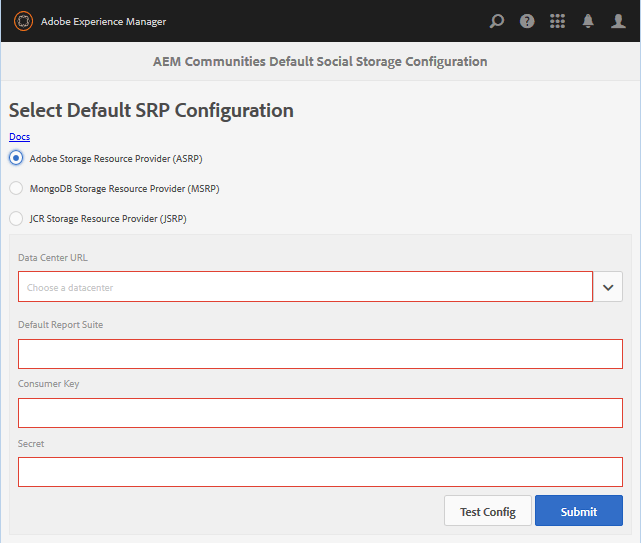

# ASRP: proveedor de recursos de almacenamiento de Adobe {#asrp-adobe-storage-resource-provider}

## Acerca de ASRP {#about-asrp}

Cuando AEM Communities está configurado para utilizar ASRP como almacén común, el contenido generado por el usuario (UGC) es accesible desde todas las instancias de autor y publicación sin necesidad de sincronización ni replicación.

Vea también [Características de las opciones de SRP](/help/communities/working-with-srp.md#characteristics-of-srp-options) y [Topologías recomendadas](/help/communities/topologies.md).

## Requisitos {#requirements}

Se requiere una licencia adicional para el uso de ASRP.

Para configurar el sitio de AEM Communities para que utilice ASRP para UGC, póngase en contacto con el representante de su cuenta para lo siguiente:

* URL del centro de datos (dirección del extremo ASRP)
* Clave de consumidor
* Clave secreta
* ID del grupo de informes

Las claves secreta y de consumidor se comparten en todos los grupos de informes de una empresa. Hay un grupo de informes por inquilino.

## Configuración {#configuration}

### Seleccionar ASRP {#select-asrp}

La [consola de configuración de almacenamiento](/help/communities/srp-config.md) permite seleccionar la configuración de almacenamiento predeterminada, que identifica qué implementación de SRP utilizar.

**En la instancia de autor de AEM:**

* En la navegación global, vaya a **[!UICONTROL Herramientas > Comunidades > Configuración de almacenamiento]** y seleccione **[!UICONTROL Proveedor de recursos de almacenamiento de Adobe (ASRP)]**.

La siguiente información proviene del proceso de aprovisionamiento:

* **URL del centro de datos**: desplegable para seleccionar el centro de datos de producción identificado por el representante de la cuenta.
* **Grupo de informes predeterminado**: escriba el nombre del grupo de informes predeterminado.
* **Clave de consumidor**: Escriba la clave de consumidor.
* **Secreto**: escriba el secreto.
* Seleccione **Enviar**.

Prepare las instancias de publicación:

* [Replicar la clave criptográfica](#replicate-the-crypto-key)
* [Replicar la configuración](#publishing-the-configuration)

Después de enviar la configuración, pruebe la conexión:

* Seleccione **Configuración de prueba**.

  Para cada instancia de autor y publicación, pruebe la conexión con el centro de datos desde la consola Configuración de almacenamiento.

* Asegúrese de que las direcciones URL del sitio para los datos de perfil se puedan enrutar desde el centro de datos [externalizando vínculos](#externalize-links).

### Replicar la clave criptográfica {#replicate-the-crypto-key}

La clave del consumidor y la clave secreta están cifradas. Para que las claves se cifren/descifren correctamente, la clave principal de criptografía de Granite debe ser la misma en todas las instancias de AEM.

Siga las instrucciones en [Replicar la clave criptográfica](/help/communities/deploy-communities.md#replicate-the-crypto-key).

### Externalizar vínculos {#externalize-links}

Para obtener los vínculos correctos de perfil e imagen de perfil, asegúrese de [Configurar correctamente el externalizador de vínculos](/help/sites-developing/externalizer.md).

Asegúrese de establecer que los dominios sean direcciones URL enrutables desde la dirección URL del centro de datos (extremo ASRP).

### Sincronización de tiempo {#time-synchronization}

Para que la autenticación con el extremo ASRP se realice correctamente, las máquinas que ejecutan su AEM Communities alojado deben estar sincronizadas con la hora, como con el [Protocolo de tiempo de red (NTP)](https://www.ntp.org/).

### Publicación de la configuración {#publishing-the-configuration}

ASRP debe identificarse como el almacén común en todas las instancias de autor y publicación.

Para que la configuración idéntica esté disponible en el entorno de publicación:

En la instancia de autor de AEM:

* Vaya del menú principal a **[!UICONTROL Herramientas]** > **[!UICONTROL Implementación]** > **[!UICONTROL Replicación]**
* Seleccionar **Activar árbol**
* **Ruta de inicio**: busque `/conf/global/settings/communities/srpc/`
* Anular la selección de **Solo modificadas**
* Seleccionar **Activar**

## Actualización desde AEM 6.0 {#upgrading-from-aem}

>[!CAUTION]
>
>Si habilita ASRP en un sitio de comunidad publicado, cualquier UGC almacenado en [JCR](/help/communities/jsrp.md) ya no será visible, ya que no habrá sincronización de datos entre el almacenamiento local y el almacenamiento en la nube.

**`AEM Communities Extension`** se había introducido anteriormente en las comunidades sociales de AEM 6.0 como servicio en la nube. En las comunidades de AEM 6.1 no es necesaria ninguna configuración de nube; simplemente seleccione ASRP en la [consola de configuración de almacenamiento](/help/communities/srp-config.md).

Debido a la nueva estructura de almacenamiento, es necesario seguir las instrucciones de [actualización](/help/communities/upgrade.md#adobe-cloud-storage) al actualizar de comunidades sociales a comunidades.

## Administración de datos de usuario {#managing-user-data}

Para obtener información sobre *usuarios*, *perfiles de usuario* y *grupos de usuarios* que se especifican con frecuencia en el entorno de publicación, visite

* [Sincronización de usuarios](/help/communities/sync.md)
* [Administración de usuarios y grupos de usuarios](/help/communities/users.md)

## Resolución de problemas {#troubleshooting}

### UGC desaparece tras la actualización {#ugc-disappears-after-upgrade}

Si actualiza desde un sitio existente de la comunidad social de AEM 6.0, asegúrese de seguir las [instrucciones de actualización](/help/communities/upgrade.md#adobe-cloud-storage); de lo contrario, parece que se perderá el UGC.

### Errores de autenticación {#authentication-errors}

Si se reciben errores de autenticación en la dirección URL del centro de datos y el error.log de AEM contiene mensajes sobre marcas de tiempo antiguas, compruebe que se esté realizando la sincronización horaria.

Use una herramienta como el [Protocolo de tiempo de red (NTP)](https://www.ntp.org/) para sincronizar la hora de todos los servidores de publicación y creación de AEM.

### El contenido nuevo no aparece en las búsquedas {#new-content-does-not-appear-in-searches}

La infraestructura de almacenamiento en la nube de Adobe usa *una eventual coherencia* para lograr sus objetivos de escalado y rendimiento. Por este motivo, el nuevo contenido no está disponible de forma inmediata y tarda varios segundos en aparecer en los resultados de búsqueda.

Mientras se supervisa el intervalo que afecta a la coherencia final, póngase en contacto con el representante de la cuenta si el nuevo contenido tarda más de unos segundos en aparecer en las búsquedas.

### UGC no visible en ASRP {#ugc-not-visible-in-asrp}

Asegúrese de que ASRP se ha configurado para ser el proveedor predeterminado comprobando la configuración de la opción de almacenamiento. De forma predeterminada, el proveedor de recursos de almacenamiento es JSRP, no ASRP.

En todas las instancias de autor y publicación de AEM, vuelva a la consola Configuración de almacenamiento o compruebe el repositorio de AEM.

En JCR, si [/conf/global/settings/communities](https://localhost:4502/crx/de/index.jsp#/etc/socialconfig/):

* No contiene un nodo [srpc](https://localhost:4502/crx/de/index.jsp#/conf/global/settings/communities/srp), lo que significa que el proveedor de almacenamiento es JSRP.
* Si el nodo srpc existe y contiene el nodo [defaultconfiguration](https://localhost:4502/crx/de/index.jsp#/conf/global/settings/communities/srp/defaultconfiguration), las propiedades de defaultconfiguration definen ASRP como el proveedor predeterminado.
