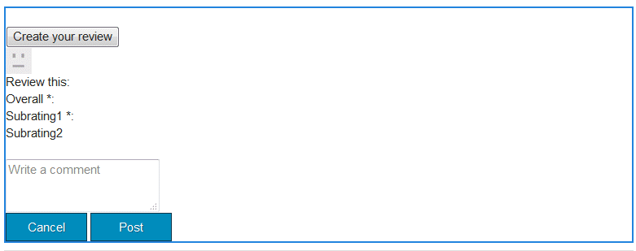

# Clientlibs para componentes de Communities {#clientlibs-for-communities-components}

## Introducción {#introduction}

En esta sección de la documentación se describe cómo agregar bibliotecas del lado del cliente (clientlibs) a una página para componentes de Communities.

Para obtener información básica, visite :

* [Uso de ](/help/sites-developing/clientlibs.md) bibliotecas del lado del cliente, que proporcionan detalles de uso, así como herramientas de depuración
* [Clientlibs para ](/help/communities/client-customize.md#clientlibs) SCF, que proporciona información útil al personalizar componentes de SCF

## Por qué se requieren Clientlibs {#why-clientlibs-are-required}

Las bibliotecas de clientes son necesarias para el correcto funcionamiento (JavaScript) y el estilo (CSS) de un componente.

Cuando existe una [función de comunidad](/help/communities/functions.md) para una función, todos los componentes y configuraciones necesarios, incluidos los clientlibs necesarios, estarán presentes en el sitio de la comunidad. Solo si los componentes adicionales van a estar disponibles para los autores, se necesitarán añadir clientlibs adicionales.

Cuando faltan los clientlibs requeridos, [añadir un componente Communities a una página](/help/communities/author-communities.md) podría provocar errores de javascript y un aspecto inesperado.

### Ejemplo : Revistas colocadas sin Clientlibs {#example-placed-reviews-without-clientlibs}

### Ejemplo : Revisiones colocadas con Clientlibs {#example-placed-reviews-with-clientlibs}

## Identificación de Clientlibs Requeridos {#identifying-required-clientlibs}

La información de funciones esenciales para los desarrolladores identifica los clientlibs necesarios.

Además, desde una instancia de AEM, al navegar por la [Community Components Guide](/help/communities/components-guide.md) se proporciona acceso a una lista de categorías clientlib necesarias para un componente.

Por ejemplo, en la parte superior de la [página Revisiones](https://localhost:4502/content/community-components/en/reviews.html), los clientlibs requeridos que aparecen listados son

* cq.ckeditor
* cq.social.hbs.reviews

## Adición de Clientlibs Necesarios {#adding-required-clientlibs}

Cuando se desee añadir un componente Comunidades a una página, será necesario agregar las clientlibs necesarias para el componente si no está presente.

Utilice [CRXDE|Lite](#using-crxde-lite) para modificar una lista de clientlibslist existente para una página del sitio de la comunidad.

Para agregar una clientlib para un sitio de la comunidad usando [CRXDE Lite](/help/sites-developing/developing-with-crxde-lite.md):

* Vaya a [https://&lt;server>:&lt;port>/crx/de](https://localhost:4502/crx/de).
* Busque el nodo `clientlibslist` para la página en la que desea añadir el componente:

   * `/content/sites/sample/en/page/jcr:content/clientlibslist`

* Con el nodo `clientlibslist` seleccionado:

   * Busque la propiedad String[] `scg:requiredClientLibs`.
   * Seleccione su `Value` para acceder al cuadro de diálogo de matriz de cadenas.

      * Desplácese hacia abajo si es necesario.
      * Seleccione + para introducir una nueva biblioteca de cliente.

         * Repita el proceso para agregar más bibliotecas de cliente.

         * Seleccione **OK**.
   * Seleccione **Guardar todo**.

>[!NOTE]
>
>Si el sitio no es un sitio de la comunidad, es necesario descubrir la existencia o ubicación de las bibliotecas de cliente que se utilizan para el sitio.

Utilizando el ejemplo [Introducción a AEM Communities](/help/communities/getting-started.md), donde `site-name` es *comprometer*, así es como aparecería la lista clientliblist si agregara el componente de revisiones:

