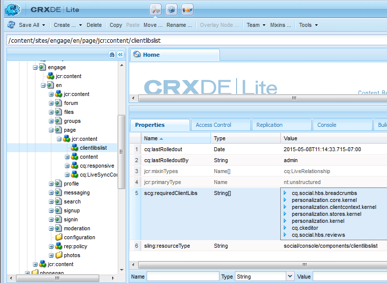

# Componentes de Clientlibs para Communities {#clientlibs-for-communities-components}

## Introducción {#introduction}

En esta sección de la documentación se describe cómo agregar bibliotecas del lado del cliente (clientlibs) a una página para componentes de Communities.

Para obtener información básica, consulte lo siguiente:

* [Usar bibliotecas del cliente](/help/sites-developing/clientlibs.md) que proporciona detalles de uso y herramientas de depuración
* [Clientlibs para SCF](/help/communities/client-customize.md#clientlibs) que proporciona información útil al personalizar componentes SCF

## Por qué se requieren Clientlibs {#why-clientlibs-are-required}

Las bibliotecas de cliente son necesarias para el funcionamiento (JavaScript) y el estilo (CSS) adecuados de un componente.

Cuando existe una [función de comunidad](/help/communities/functions.md) para una característica, todos los componentes y configuraciones necesarios, incluidos los clientlibs requeridos, están presentes en el sitio de la comunidad. Solo si los autores deben tener disponibles componentes adicionales, se deben agregar clientlibs adicionales.

Cuando faltan los clientlibs necesarios, [agregar un componente de Communities a una página](/help/communities/author-communities.md) podría provocar errores de JavaScript y una aparición inesperada.

### Ejemplo : Revisiones colocadas sin Clientlibs {#example-placed-reviews-without-clientlibs}

### Ejemplo : Revisiones colocadas con Clientlibs {#example-placed-reviews-with-clientlibs}

## Identificación De Clientlibs Requeridos {#identifying-required-clientlibs}

La información sobre funciones esenciales para los desarrolladores de identifica los clientlibs necesarios.

AEM Además, desde una instancia de, si navega hasta la [Guía de componentes de la comunidad](/help/communities/components-guide.md), obtendrá acceso a una lista de categorías clientlib necesarias para un componente.

Por ejemplo, en la parte superior de la [página de revisiones](https://localhost:4502/content/community-components/en/reviews.html), los clientlibs requeridos son

* cq.ckeditor
* cq.social.hbs.reviews

## Añadir Clientlibs Requeridos {#adding-required-clientlibs}

Si desea agregar un componente de Communities a una página, es necesario agregar los clientlibs necesarios para el componente si no están presentes.

Use [CRXDE|Lite](#using-crxde-lite) para modificar una lista de clientlibs existente para una página de sitio de la comunidad.

Para agregar una clientlib para un sitio de la comunidad usando [CRXDE Lite](/help/sites-developing/developing-with-crxde-lite.md):

* Vaya a [https://&lt;server>:&lt;port>/crx/de](https://localhost:4502/crx/de).
* Busque el nodo `clientlibslist` para la página en la que desea agregar el componente:

   * `/content/sites/sample/en/page/jcr:content/clientlibslist`

* Con el nodo `clientlibslist` seleccionado:

   * Busque la propiedad `scg:requiredClientLibs` String[].
   * Seleccione su `Value` para poder acceder al cuadro de diálogo Matriz de cadenas.

      * Desplácese hacia abajo si es necesario.
      * Seleccione + para introducir una nueva biblioteca de cliente.

         * Repita el proceso para agregar más bibliotecas de cliente.

         * Seleccione **Aceptar**.

   * Seleccione **Guardar todo**.

>[!NOTE]
>
>Si el sitio no es un sitio de la comunidad, se debe descubrir la existencia o la ubicación de las bibliotecas de cliente que se utilizan para el sitio.

En el ejemplo de [Introducción a AEM Communities](/help/communities/getting-started.md), donde `site-name` es *Engage*, la clientliblist aparecería de esta forma si agregara el componente Revisiones:

