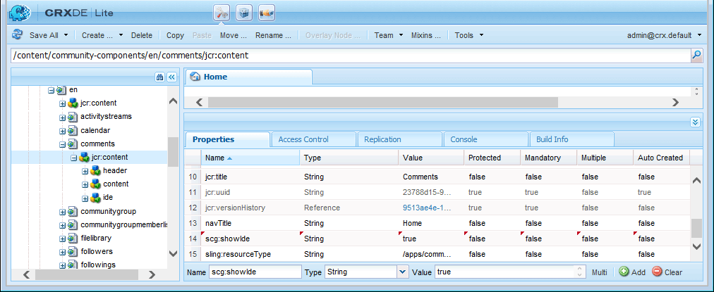

# Guía de componentes de comunidad  {#community-components-guide}

La guía de componentes de comunidad es una herramienta de desarrollo interactiva para el [marco de componentes sociales (SCF)](scf.md). Proporciona una lista de los componentes de AEM Communities disponibles o de las funciones más complejas creadas con varios componentes.

Junto con la información básica de cada componente, la guía permite experimentar con el funcionamiento de los componentes y funciones de SCF y de cómo se pueden configurar o personalizar.

Para obtener información acerca de los aspectos básicos de desarrollo relacionados con cada componente, consulte [Funciones y elementos esenciales](essentials.md).

## Introducción {#getting-started}

La guía está pensada para utilizarse en instalaciones de desarrollo de instancias de autor (localhost:4502) y publicación (localhost:4503).

Para acceder al sitio de componentes de comunidad, vaya a

* [https://&lt;server>:&lt;port>/content/community-components/en.html](http://localhost:4502/content/community-components/en.html)

Las interacciones con los componentes de Comunidades variarán según:

* El servidor (autor o publicación).
* Indica si el visitante del sitio ha iniciado sesión o no.
* Si ha iniciado sesión, los privilegios asignados al miembro.
* Indica si el SRP predeterminado, [JSRP](jsrp.md), está en uso o no.

Al crear, para entrar en el modo de edición, inserte `editor.html` o `cf#` como el primer segmento de ruta después del nombre del servidor:

* IU estándar:

   [https://&lt;server>:&lt;port>/editor.html/content/community-components/en.html](http://localhost:4502/editor.html/content/community-components/en.html)

* IU clásica:

   [https://&lt;server>:&lt;port>/cf#/content/community-components/en.html](http://localhost:4502/cf#/content/community-components/en.html)

>[!NOTE]
>
>En el modo de edición, los vínculos de una página no están activos.
>
>Para desplazarse a una página de componentes, seleccione primero el modo de Previsualización para activar los vínculos.
>
>Con la página de componentes mostrada en el navegador, vuelva al modo de edición para abrir el cuadro de diálogo de edición del componente.
>
>Para obtener información general sobre la creación, consulte la [guía rápida de creación de páginas](../../help/sites-authoring/qg-page-authoring.md).
>
>Si no está familiarizado con AEM, vista la documentación sobre [administración básica](../../help/sites-authoring/basic-handling.md).

### Página principal {#home-page}

La guía proporciona una lista de los componentes SCF disponibles para la previsualización y creación de prototipos en el lado izquierdo de la página.

Guía de componentes tal como se ve en una instancia de autor en el modo de edición:

## Páginas de componentes {#component-pages}

Seleccione un componente de la lista a lo largo del lado izquierdo de la página.

Se muestra el cuerpo principal de la guía:

1. Título: Nombre del componente seleccionado
1. [Bibliotecas](#client-side-libraries) del lado del cliente: Lista de una o varias categorías requeridas
1. [Incluible](scf.md#add-or-include-a-communities-component): Si el componente se puede incluir dinámicamente, el estado se puede alternar en el modo de edición de autor:

   * Si se agrega, el texto mostrado es: &quot;Este componente se incluye mediante su nodo par.&quot;
   * Si se incluye, el texto mostrado es: &quot;Este componente se incluye dinámicamente.&quot;
   * Si no se puede incluir, no se muestra ningún texto

1. Componente o función de muestra: una instancia activa del componente o la función. Si un componente se modifica con los cambios realizados en las plantillas, CSS y datos proporcionados en la sección de fichas.

>[!NOTE]
>
>Después de realizar una selección desde el lado izquierdo, el componente aparecerá debajo, en lugar de al lado, de la lista de componentes cuando la ventana del navegador sea demasiado estrecha.

### Interacciones de autor {#author-interactions}

Al utilizar la guía en una instancia de autor, es posible configurar un componente abriendo su cuadro de diálogo. La información para desarrolladores se proporciona en la sección [Componentes y características esenciales](essentials.md) de la documentación, mientras que la configuración del cuadro de diálogo se describe en la sección [Componentes de comunidades](author-communities.md) para autores.

Para la guía Componentes de comunidad, algunos ajustes del cuadro de diálogo de componentes se superponen con el estado de alternancia [Incluible](scf.md#add-or-include-a-communities-component). Para alternar entre el uso del recurso existente o un recurso incluido dinámicamente, en el modo de edición seleccione el componente y el texto inclusible y haga clic con el doble para abrir el cuadro de diálogo de edición:

En la ficha **Plantillas**:

* **Incluir el componente secundario con sling:include**

   Si no se selecciona, la Guía de componentes utilizará el recurso existente en el repositorio (un nodo jcr que es un nodo secundario de un nodo par).

   * el texto mostrado es: &quot;Este componente se incluye mediante su nodo par.&quot;

   Si se selecciona, la Guía de componentes utilizará sling para incluir dinámicamente un componente del resourceType del nodo secundario (recurso no existente).

   * el texto mostrado es: &quot;Este componente se incluye dinámicamente.&quot;

   El valor predeterminado no está marcado.

### Interacciones de publicación {#publish-interactions}

Cuando se utiliza la guía en una instancia de publicación, es posible experimentar los componentes y las funciones como un visitante del sitio (no ha iniciado sesión) y como miembros con varios privilegios al iniciar sesión.

>[!NOTE]
>
>Tenga en cuenta que, si el SRP se deja como predeterminado [JSRP](jsrp.md), el UGC especificado en la instancia de publicación solo será visible en la publicación y *no* estará visible desde la consola [moderación](moderate-ugc.md) en la instancia de autor.

## Bibliotecas de cliente {#client-side-libraries}

Las bibliotecas del lado del cliente (clientlibs) enumeradas para cada componente son aquellas *requeridas* a las que se hace referencia cuando el componente se coloca en una página. Los clientlibs proporcionan un medio para administrar y optimizar la descarga de Javascript y CSS que se utiliza para procesar el componente en el navegador.

Para obtener más información, visite [Clientlibs for Communities Components](clientlibs.md).

## Suplantación {#impersonation}

En la instancia de autor, donde uno de ellos suele haber iniciado sesión como administrador o desarrollador, para experimentar el componente que ha iniciado sesión como otro usuario, utilice el cuadro de texto situado a la izquierda del botón **[!UICONTROL Suplantar]** para escribir el nombre de usuario o seleccionar en la lista desplegable y, a continuación, haga clic en el botón. Haga clic en Revertir para cerrar sesión y finalizar la suplantación.

La instancia de publicación no necesita suplantar. Utilice el vínculo Inicio de sesión/Cierre de sesión para hacerse pasar por varios usuarios, como los [usuarios de demostración](tutorials.md#demo-users).

## Personalización {#customization}

Cuando está activado, cada componente SCF está disponible para crear prototipos de posibles personalizaciones mediante la modificación temporal de la plantilla del componente, la CSS y los datos.

### Activación de la personalización {#enabling-customization}

>[!NOTE]
>
>**Esta herramienta es de solo** lectura. Ninguna de las ediciones realizadas en plantillas, CSS o datos se guarda en el repositorio.

Para experimentar rápidamente con las personalizaciones, la propiedad `scg:showIde`debe agregarse al nodo JCR de contenido de la página de componentes y establecerse en true.

El uso del componente comentarios como ejemplo, en la instancia de creación o publicación, ha iniciado sesión con privilegios de administrador:

1. Vaya a [CRXDE Lite](../../help/sites-developing/developing-with-crxde-lite.md)

   Por ejemplo: [http://localhost:4503/crx/de](http://localhost:4503/crx/de)

1. Seleccione el nodo `jcr:content` del componente

   Por ejemplo, `/content/community-components/en/comments/jcr:content`

1. Añadir una propiedad

   * **Nombre** `scg:showIde`
   * **Tipo** `String`
   * **Valor** `true`

1. Seleccione **[!UICONTROL Guardar todo]**
1. Volver a cargar la página Comentarios en la guía

   [http://localhost:4503/content/community-components/en/comments.html](http://localhost:4503/content/community-components/en/comments.html)

1. Observe que ahora hay 3 fichas para Plantillas, CSS y Datos.

### Ficha Plantillas {#templates-tab}

Seleccione la ficha Plantillas para ver las plantillas asociadas al componente.

El Editor de plantillas permite compilar y aplicar ediciones locales a la instancia de componente de muestra en la parte superior de la página sin afectar al componente en el repositorio.

La ejecución de la compilación en ediciones locales resaltará cualquier error colocando un punto en el medianil y marcando el texto en rojo.

### Ficha CSS {#css-tab}

Seleccione la ficha CSS para ver la CSS asociada al componente.

Si un componente es una composición de varios componentes, es posible que algunos CSS se incluyan en uno de los demás componentes.

El Editor de CSS permite modificar y aplicar el CSS a la instancia de componente de ejemplo en la parte superior de la página.

Se puede seleccionar una regla para resaltar las partes del DOM usando esa regla haciendo clic en junto a la regla en el medianil.

### Ficha Datos {#data-tab}

Seleccione la ficha Datos para mostrar los datos del extremo .social.json. Estos datos son editables y se aplican a la instancia de componente de ejemplo.

Los errores de sintaxis pueden marcarse en el medianil y resaltarse en el editor.
