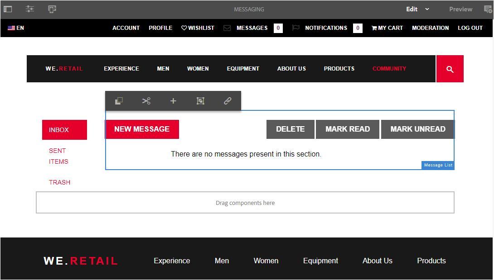
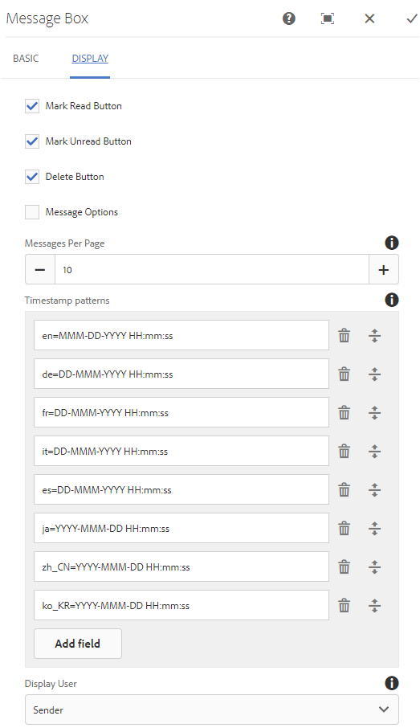

# Función de mensajería {#messaging-feature}

Además de las interacciones públicamente visibles que se producen en los foros y comentarios, la función de mensajería de AEM Communities permite a los miembros de la comunidad interactuar entre sí de forma más privada.

Esta función se puede incluir cuando [sitio de la comunidad](/help/communities/overview.md#communitiessites) se crea.

La función de mensajería permite:

**A** - enviar un mensaje a uno o varios miembros de la comunidad

**B** - enviar mensajes directos en [de forma masiva a los grupos de miembros de la comunidad](/help/communities/messaging.md#group-messaging)

**C** - enviar un mensaje con archivos adjuntos

**D** - reenviar un mensaje

**E** - responder a un mensaje

**F** - eliminar un mensaje

**G** - restaurar un mensaje eliminado

Para habilitar y modificar la función de mensajería, consulte:

* [Configurar mensajería](/help/communities/messaging.md) para administradores
* [Elementos básicos de mensajería](/help/communities/essentials-messaging.md) para desarrolladores

>[!NOTE]
>
>No se puede añadir `Compose Message, Message, or Message List` componentes (encontrados en `Communities`grupo de componentes) a una página en modo de edición de autor.

## Configuración de componentes de mensajería {#configure-messaging-components}

Cuando la mensajería está habilitada para un sitio de comunidad, se configura sin necesidad de ninguna configuración adicional. La información se proporciona si es necesario cambiar la configuración predeterminada.

### Configurar lista de mensajes (cuadro de mensaje) {#configure-message-list-message-box}

Para modificar la configuración de la lista de mensajes para **Bandeja de entrada**, **Elementos enviados** y **Papelera** páginas de la función de mensajería, abra el sitio en [modo de edición de autor](/help/communities/sites-console.md#authoring-site-content).

1. En `Preview` seleccione **Mensajes** para abrir la página de mensajería principal. A continuación, seleccione **Bandeja de entrada**, **Elementos enviados** o **Papelera** para configurar el componente de esa lista de mensajes.

1. En `Edit` seleccione el componente en la página.
1. Para acceder al cuadro de diálogo de configuración, cancele la herencia seleccionando la opción `link` icono.
Una vez cancelada la herencia, es posible seleccionar el icono de configuración para abrir el cuadro de diálogo de configuración.

1. Una vez completada la configuración, es necesario restaurar la herencia seleccionando la opción `broken link` icono.

#### Ficha Básico {#basic-tab}

* **Selector de servicio**

   (*Requerido*) Establezca este valor en el valor de la propiedad . **`serviceSelector.name`** de la variable [Servicio de operaciones de mensajería de AEM Communities](/help/communities/messaging.md#messaging-operations-service).

* **Componer página**

   (*Requerido*) La página que se abrirá cuando un miembro haga clic en la variable **`Reply`** botón. La página de destino debe contener la variable **Componer mensaje** formulario.

* **Responder/Ver como medio**

   Si se selecciona, la URL de respuesta y la URL de vista hacen referencia a un recurso; de lo contrario, los datos se pasan como parámetros de consulta en la URL.

* **Formulario de visualización de perfil**

   El formulario de perfil que se utiliza para mostrar el perfil de los remitentes.

* **Carpeta de papelera**

   Si se selecciona, este componente Lista de mensajes solo muestra los mensajes marcados como eliminados (papelera).

* **Rutas de carpeta**

   (*Requerido*) Referencia a los valores configurados para **inbox.path.name** y **sentiitems.path.name** en el [Servicio de operaciones de mensajería de AEM Communities](/help/communities/messaging.md#messaging-operations-service). Al configurar un `Inbox`, agregue una entrada con el valor de **inbox.path.name**. Al configurar un `Outbox`, agregue una entrada con el valor de **sentiitems.path.name**. Al configurar para `Trash`, agregue dos entradas con ambos valores.

#### Ficha Mostrar {#display-tab}

* **Marcar como botón de lectura**

   Si se selecciona, muestra una `Read`que permite marcar un mensaje como leído.

* **Marcar botón no leído**

   Si se selecciona, muestra una `Mark Unread` que permite marcar un mensaje como leído.

* **Botón Eliminar**

   Si se selecciona, muestra una `Delete` que permite marcar un mensaje como leído. Duplicará la funcionalidad de eliminación si **`Message Options`** también está marcado.

* **Opciones de mensaje**

   Si está marcado, muestra **`Reply`**, **`Reply All`**, **`Forward`** y **`Delete`** botones que permiten enviar o eliminar un mensaje. Duplicará la funcionalidad de eliminación si **`Delete Button`** también está marcado.

* **Mensajes por página**

   El número especificado es el número máximo de mensajes mostrados por página en un esquema de paginación. Si no se especifica ningún número (se deja en blanco), todos los mensajes se muestran y no hay paginación.

* **Patrones de marca de hora**

   Proporcione patrones de marca de hora para uno o más idiomas. El valor predeterminado es para en, de, fr, it, es, ja, zh_CN, ko_KR.

* **Mostrar usuario**

   Elija una de las opciones siguientes: **`Sender`** o **`Recipients`** para determinar si desea mostrar el remitente o los destinatarios.

### Configurar mensaje de composición {#configure-compose-message}

Para modificar la configuración de la página de mensaje de composición, abra el sitio en [modo de edición de autor](/help/communities/sites-console.md#authoring-site-content).

* En `Preview` seleccione **Mensajes** para abrir la página de mensajería principal. A continuación, seleccione el botón Nuevo mensaje para abrir el `Compose Message` página.

* En `Edit` seleccione el componente principal de la página que contiene el cuerpo del mensaje.
* Para acceder al cuadro de diálogo de configuración, cancele la herencia seleccionando la opción `link` icono.
Una vez cancelada la herencia, es posible seleccionar el icono de configuración para abrir el cuadro de diálogo de configuración.

* Una vez completada la configuración, es necesario restaurar la herencia seleccionando la opción `broken link` icono.

#### Ficha Básico {#basic-tab-1}

* **Dirección URL de redireccionamiento**

   Introduzca la dirección URL de la página que se muestra después de enviar el mensaje. Por ejemplo, `../messaging.html`.

* **URL de cancelación**

   Introduzca la dirección URL de la página mostrada si el remitente cancela el mensaje. Por ejemplo, `../messaging.html`.

* **Longitud máxima del asunto del mensaje**

   El número máximo de caracteres permitidos en el campo Asunto. Por ejemplo, 500. El valor predeterminado no es límite.

* **Longitud máxima del cuerpo del mensaje**

   El número máximo de caracteres permitidos en el campo Contenido . Por ejemplo, 10 000. El valor predeterminado no es límite.

* **Selector de servicio**

   (*Requerido*) Establezca este valor en el valor de la propiedad . **`serviceSelector.name`** de la variable [Servicio de operaciones de mensajería de AEM Communities](/help/communities/messaging.md#messaging-operations-service).

#### Ficha Mostrar {#display-tab-1}

* **Mostrar campo de asunto**

   Si está marcado, muestre la variable `Subject` y permiten añadir un asunto al mensaje. El valor predeterminado no está seleccionado.

* **Etiqueta del asunto**

   Escriba el texto que se mostrará junto al `Subject` campo . El valor predeterminado es `Subject`.

* **Mostrar el campo Adjuntar archivo**

   Si está marcado, muestre la variable `Attachment` y permiten agregar archivos adjuntos al mensaje. El valor predeterminado no está seleccionado.

* **Etiqueta de archivo adjunto**

   Escriba el texto que se mostrará junto al `Attachment` campo . El valor predeterminado es **`Attach File`**.

* **Mostrar campo de contenido**

   Si está marcado, muestre la variable `Content` y habilite la adición de un cuerpo de mensaje. El valor predeterminado no está seleccionado.

* **Etiqueta de contenido**

   Escriba el texto que se mostrará junto al `Content` campo . El valor predeterminado es **`Body`**.

* **Con editor de texto enriquecido**

   Si se selecciona, indica el uso de un cuadro de texto de contenido personalizado con su propio editor de texto enriquecido. El valor predeterminado no está seleccionado.

* **Patrones de marca de hora**

   Proporcione patrones de marca de hora para uno o más idiomas. El valor predeterminado es para en, de, fr, it, es, ja, zh_CN, ko_KR.
