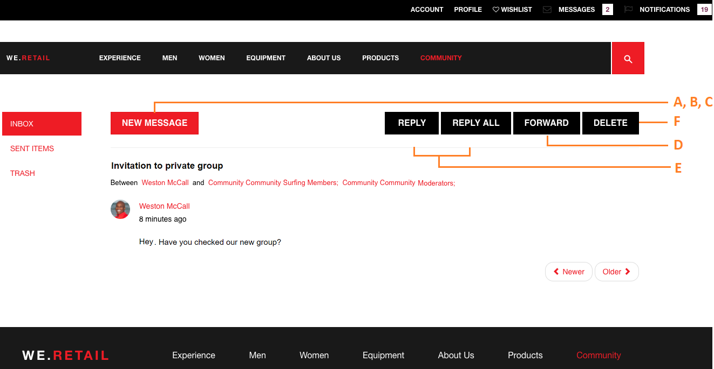

# Función de mensajería {#messaging-feature}

Además de las interacciones públicamente visibles que se producen en los foros y comentarios, la función de mensajería de Comunidades AEM permite a los miembros de la comunidad interactuar entre sí de forma más privada.

Esta función se puede incluir cuando se crea un sitio [de](/help/communities/overview.md#communitiessites) comunidad.

La función de mensajería permite:

**A** - enviar un mensaje a uno o más miembros **B** de la comunidad - enviar mensajes directos [masivamente a los grupos](/help/communities/messaging.md#group-messaging)miembros de la comunidad **C** - enviar un mensaje con anexos **D** - enviar un mensaje ************ E- enviar una respuesta a un mensaje- F- eliminar un mensajeG- restaurar un mensaje eliminado

 

Para habilitar y modificar la función de mensajería, consulte:

* [Configuración de la mensajería](/help/communities/messaging.md) para administradores
* [Esenciales](/help/communities/essentials-messaging.md) de mensajería para desarrolladores

>[!NOTE]
>
>No se pueden agregar `Compose Message, Message, or Message List` componentes (que se encuentran en el grupo de `Communities`componentes) a una página en modo de edición de autor.

## Configuración de componentes de mensajería {#configure-messaging-components}

Cuando se habilita la mensajería para un sitio de comunidad, se configura sin necesidad de ninguna configuración adicional. La información se proporciona si es necesario cambiar la configuración predeterminada.

### Configurar lista de mensajes (cuadro de mensaje) {#configure-message-list-message-box}

Para modificar la configuración de la lista de mensajes para las páginas **Bandeja de entrada**, Elementos **** enviados y **Papelera** de la función de mensajería, abra el sitio en modo [de edición de](/help/communities/sites-console.md#authoring-site-content)autor.

1. En `Preview`modo, seleccione el vínculo **Mensajes** para abrir la página de mensajes principal. A continuación, seleccione **Bandeja de entrada**, Elementos **enviados** o **Papelera** para configurar el componente para esa lista de mensajes.

1. En `Edit` modo, seleccione el componente en la página.
1. Para acceder al cuadro de diálogo de configuración, seleccione el `link`icono para cancelar la herencia.
Una vez cancelada la herencia, es posible seleccionar el icono de configuración para abrir el cuadro de diálogo de configuración.

1. Una vez completada la configuración, es necesario restaurar la herencia seleccionando el `broken link` icono .

#### Basic tab {#basic-tab}

* **Selector de servicio**

   (*Necesario*) Establezca este valor en el valor de la propiedad **`serviceSelector.name`** del servicio de operaciones de mensajería de comunidades de [AEM](/help/communities/messaging.md#messaging-operations-service).

* **Componer página**

   (*Requerido*) La página que se abrirá cuando un miembro haga clic en el **`Reply`** botón. La página de destino debe contener el formulario **Redactar mensaje** .

* **Responder/Ver como medio**

   Si se selecciona, la URL de respuesta y la URL de vista harán referencia a un recurso; de lo contrario, los datos se pasarán como parámetros de consulta en la URL.

* **Formulario de visualización de perfil**

   Formulario de perfil que se va a utilizar para mostrar el perfil de los remitentes.

* **Carpeta Papelera**

   Si se selecciona, este componente Lista de mensajes muestra solo los mensajes marcados como eliminados (papelera).

* **Rutas de carpeta**

   (*Necesario*) Hacer referencia a los valores establecidos para **inbox.path.name** y **sentitems.path.name** en el servicio [de operaciones de mensajería de las comunidades de](/help/communities/messaging.md#messaging-operations-service)AEM. Al configurar para un `Inbox`, agregue una entrada usando el valor de **inbox.path.name**. Al configurar para un `Outbox`, agregue una entrada usando el valor de **sentitómesis.path.name**. Al configurar para `Trash`, agregue dos entradas con ambos valores.

#### Ficha Mostrar {#display-tab}

* **Marcar botón de lectura**

   Si se selecciona, muestra un `Read`botón que permite marcar un mensaje como leído.

* **Botón Marcar no leído**

   Si se selecciona, muestra un `Mark Unread` botón que permite marcar un mensaje como leído.

* **Botón Eliminar**

   Si se selecciona, muestra un `Delete`botón que permite marcar un mensaje como leído. Se duplicará la funcionalidad de eliminación si también **`Message Options`** está marcada.

* **Opciones de mensaje**

   Si se selecciona, muestra **`Reply`**, **`Reply All`****`Forward`** y **`Delete`** botones que permiten que un mensaje se vuelva a enviar o se elimine. Se duplicará la funcionalidad de eliminación si también **`Delete Button`** está marcada.

* **Mensajes por página**

   El número especificado es el número máximo de mensajes que se muestran por página en un esquema de paginación. Si no se especifica ningún número (se deja en blanco), se muestran todos los mensajes y no hay paginación.

* **Patrones de marca de hora**

   Proporcione patrones de marca de hora para uno o más idiomas. El valor predeterminado es en, de, fr, it, es, ja, zh_CN, ko_KR.

* **Mostrar usuario**

   Elija **`Sender`** o **`Recipients`** para determinar si desea mostrar el remitente o los destinatarios.

### Configurar mensaje de composición {#configure-compose-message}

Para modificar la configuración de la página de mensaje de composición, abra el sitio en modo [de edición de](/help/communities/sites-console.md#authoring-site-content)autor.

* En `Preview` modo, seleccione el vínculo **Mensajes** para abrir la página de mensajes principal. A continuación, seleccione el botón Nuevo mensaje para abrir la `Compose Message` página.

* En `Edit` modo, seleccione el componente principal en la página que contiene el cuerpo del mensaje.
* Para acceder al cuadro de diálogo de configuración, seleccione el icono para cancelar la herencia `link` .
Una vez cancelada la herencia, es posible seleccionar el icono de configuración para abrir el cuadro de diálogo de configuración.

* Una vez completada la configuración, es necesario restaurar la herencia seleccionando el `broken link` icono .

#### Basic tab {#basic-tab-1}

* **Dirección URL de redireccionamiento**

   Introduzca la dirección URL de la página que se muestra después de enviar el mensaje. Por ejemplo, `../messaging.html`.

* **URL de cancelación**

   Introduzca la dirección URL de la página mostrada si el remitente cancela el mensaje. Por ejemplo, `../messaging.html`.

* **Longitud máxima del asunto del mensaje**

   El número máximo de caracteres permitidos en el campo Asunto. Por ejemplo, 500. El valor predeterminado no es límite.

* **Longitud máxima del cuerpo del mensaje**

   El número máximo de caracteres permitidos en el campo Contenido. Por ejemplo, 10000. El valor predeterminado no es límite.

* **Selector de servicio**

   (*Necesario*) Establezca este valor en el valor de la propiedad **`serviceSelector.name`** del servicio de operaciones de mensajería de comunidades de [AEM](/help/communities/messaging.md#messaging-operations-service).

#### Ficha Mostrar {#display-tab-1}

* **Mostrar campo de asunto**

   Si se selecciona, muestre el `Subject` campo y habilite la adición de un asunto al mensaje. El valor predeterminado no está marcado.

* **Etiqueta de asunto**

   Introduzca el texto que desea mostrar junto al `Subject` campo. El valor predeterminado es `Subject`.

* **Mostrar el campo Adjuntar archivo**

   Si se selecciona, muestre el `Attachment` campo y habilite la adición de archivos adjuntos al mensaje. El valor predeterminado no está marcado.

* **Etiqueta de archivo adjunto**

   Introduzca el texto que desea mostrar junto al `Attachment` campo. El valor predeterminado es **`Attach File`**.

* **Mostrar campo de contenido**

   Si se selecciona, muestre el `Content` campo y habilite la adición de un cuerpo de mensaje. El valor predeterminado no está marcado.

* **Etiqueta de contenido**

   Introduzca el texto que desea mostrar junto al `Content` campo. El valor predeterminado es **`Body`**.

* **Con editor de texto enriquecido**

   Si se selecciona, indica el uso de un cuadro de texto de contenido personalizado con su propio editor de texto enriquecido. El valor predeterminado no está marcado.

* **Patrones de marca de hora**

   Proporcione patrones de marca de hora para uno o más idiomas. El valor predeterminado es en, de, fr, it, es, ja, zh_CN, ko_KR.

