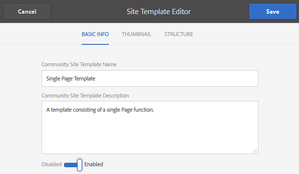

# Crear una página de muestra {#create-a-sample-page}

A partir de AEM comunidades 6.1, la forma más fácil de crear una página de muestra es crear un sitio de comunidad simple, que consiste simplemente en una función de página.

Esto incluirá un componente parsys para que pueda [habilitar componentes para la creación](basics.md#accessing-communities-components).

Otra opción para explorar los componentes de muestra es utilizar las funciones presentadas en la [Guía de componentes de comunidad](components-guide.md).

## Crear un sitio de comunidad {#create-a-community-site}

Esto es muy similar a crear un nuevo sitio descrito en [Introducción a AEM Communities](getting-started.md).

La diferencia principal es que este tutorial creará una nueva plantilla de sitio de comunidad que sólo contiene la [función de página](functions.md#page-function) para crear un sitio de comunidad simple sin otras características (que no sean las características precableadas básicas de todos los sitios de la comunidad).

### Crear nueva plantilla de sitio {#create-new-site-template}

Para empezar, cree una plantilla de [sitio de comunidad](sites.md) sencilla.

Desde la navegación global en una instancia de autor, seleccione **[!UICONTROL Herramientas]** > **[!UICONTROL Comunidades]** > **[!UICONTROL Plantillas de sitio]**.

* Seleccione `Create button`
* INFORMACIÓN BÁSICA

   * `Name`:: Plantilla de página única
   * `Description`:: Una plantilla que consta de una sola función de página.
   * Seleccione `Enabled`

* ESTRUCTURA

   * Arrastre una función `Page` al Generador de plantillas
   * Para Detalles de la función de configuración, introduzca

      * `Title`:: Página única
      * `URL`: page

* Seleccione **`Save`** para la configuración
* Seleccione **`Save`** para la plantilla de sitio

### Crear nuevo sitio de comunidad {#create-new-community-site}

Ahora cree un nuevo sitio de comunidad basado en la plantilla de sitio simple.

Después de crear la plantilla de sitio, en la navegación global seleccione **[!UICONTROL Comunidades > Sitios]**.

* Seleccionar icono **`Create`**

* Paso `1 - Site Template`

   * `Title`:: Sitio de comunidad simple
   * `Description`:: Un sitio de comunidad que consiste en una sola página para la experimentación.
   * `Community Site Root: (leave blank)`
   * `Community Site Base Language: English`
   * `Name`:: muestra

      * url = http://localhost:4502/content/sites/sample

      * `Template`:: elegir  `Single Page Template`

      

* Seleccione `Next`
* Paso `2 - Design`

   * Seleccionar cualquier diseño

* Seleccione `Next`
* Seleccione `Next`

   (Acepte todos los ajustes predeterminados)

* Seleccione `Create`

   

## Publicar el sitio {#publish-the-site}

En la [consola de sitios de comunidad](sites-console.md), seleccione el icono de publicación para publicar el sitio, de forma predeterminada en http://localhost:4503.

## Abrir el sitio al autor en modo de edición {#open-the-site-on-author-in-edit-mode}

Seleccione el icono del sitio abierto para la vista del sitio en modo de edición.

La dirección URL será [http://localhost:4502/editor.html/content/sites/sample/en.html](http://localhost:4502/editor.html/content/sites/sample/en.html)

En la página de inicio simple es posible ver lo que se precablea a través de las funciones y plantillas de la comunidad, y jugar con la adición y configuración de componentes de la comunidad.

## Sitio de vista en la publicación {#view-site-on-publish}

Después de publicar la página, abra la página en la [instancia de publicación](http://localhost:4503/content/sites/sample/en.html) para experimentar con las funciones como un visitante anónimo del sitio, un miembro con sesión iniciada o un administrador. El vínculo Administración visible en el entorno de creación no aparecerá en el entorno de publicación a menos que un administrador inicie sesión.
