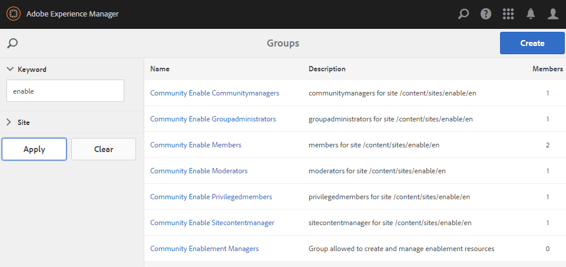
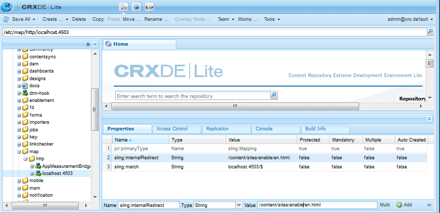

# Crear un nuevo sitio de comunidad{#author-a-new-community-site}

## Crear un sitio de la comunidad {#create-a-community-site}

Utilice la instancia de autor para crear un sitio de la comunidad. En la instancia de autor de AEM:

1. Iniciar sesión con privilegios de administrador.
1. En la navegación global, vaya a **[!UICONTROL Communities]** > **[!UICONTROL Sites]**.

La consola Sitios de Communities proporciona un asistente para guiar a uno a través de los pasos para crear un sitio de comunidad. Es posible pasar a la sección `Next` paso o `Back` Vaya al paso anterior antes de comprometer el sitio en el paso final.

Para empezar a crear un nuevo sitio de la comunidad:

* Seleccione el `Create` botón.

### Paso 1: Plantilla del sitio {#step-site-template}

En el [Paso Plantilla del sitio](/help/communities/sites-console.md#step2013asitetemplate), introduzca un título, una descripción, el nombre de la URL y seleccione una plantilla de sitio de comunidad, por ejemplo:

* **Título del sitio de la comunidad**: `Getting Started Tutorial`
* **Descripción del sitio de la comunidad**: `A site for engaging with the community.`
* **Raíz del sitio de comunidad**: (dejar en blanco para la raíz predeterminada) `/content/sites`)
* **Configuraciones de nube**: (déjelo en blanco si no se especifica ninguna configuración de nube) proporcione la ruta a las configuraciones de nube especificadas.
* **Idioma base del sitio de la comunidad**: (no tocar para un solo idioma: inglés) utilice la lista desplegable para elegir uno *o más* idiomas base de los idiomas disponibles: alemán, italiano, francés, japonés, español, portugués (Brasil), chino (tradicional) y chino (simplificado). Se creará un sitio de comunidad para cada idioma agregado y existirá dentro de la misma carpeta del sitio según la práctica recomendada descrita en [Traducción de contenido para sitios multilingües](/help/sites-administering/translation.md). La página raíz de cada sitio contendrá una página secundaria denominada por el código de idioma de uno de los idiomas seleccionados, como &quot;en&quot; para inglés o &quot;fr&quot; para francés.

* **Nombre del sitio de comunidad**: participar

   * Compruebe el nombre, ya que no se cambia fácilmente después de crear el sitio
   * La dirección URL inicial se mostrará debajo del nombre del sitio de la comunidad
   * Para una URL válida, añada un código de idioma base + &quot;.html&quot;
   * *Por ejemplo*, https://localhost:4502/content/sites/ `engage/en.html`

* **Plantilla**: tire hacia abajo para elegir `Reference Site`

* Seleccione **Siguiente**.

### Paso 2: Diseño {#step-design}

El paso Diseño se presenta en dos secciones para seleccionar el tema y el titular de la marca:

#### TEMA DEL SITIO DE LA COMUNIDAD {#community-site-theme}

Seleccione el estilo que desee aplicar a la plantilla. Cuando se selecciona, la temática se superpone con una marca de verificación.

#### MARCA DEL SITIO DE LA COMUNIDAD {#community-site-branding}

(Opcional) Cargue una imagen de titular para mostrarla en las páginas del sitio. El banner está anclado al borde izquierdo del explorador, entre el encabezado del sitio de la comunidad y los vínculos de navegación. La altura del titular se recorta a 120 píxeles. No se cambia el tamaño del titular para ajustarse a la anchura del explorador y a la altura de 120 píxeles.

Seleccione **Siguiente**.

### Paso 3: Configuración {#step-settings}

En el paso Configuración, antes de seleccionar `Next`, tenga en cuenta que hay siete secciones que proporcionan acceso a configuraciones que implican administración de usuarios, etiquetado, moderación, administración de grupos, análisis y traducción.

#### Administración de usuarios {#user-management}

Marcar todas las casillas de verificación para [Administración de usuarios](/help/communities/sites-console.md#user-management)

* Para permitir que los visitantes del sitio se registren automáticamente
* Para permitir que los visitantes del sitio vean el sitio sin iniciar sesión
* Para permitir que los miembros envíen y reciban mensajes de otros miembros de la comunidad
* Para permitir el inicio de sesión con Facebook en lugar de registrar y crear un perfil
* Para permitir el inicio de sesión con Twitter en lugar de registrar y crear un perfil

>[!NOTE]
>
>Para un entorno de producción, es necesario crear aplicaciones personalizadas de Facebook y Twitter. Consulte [Inicio de sesión social con Facebook y Twitter](/help/communities/social-login.md).

#### ETIQUETADO {#tagging}

AEM Las etiquetas que se pueden aplicar al contenido de la comunidad se controlan seleccionando áreas de nombres definidas previamente mediante la opción de nombre de la comunidad de nombres de [Consola de etiquetado](/help/sites-administering/tags.md#tagging-console) (como el [Área de nombres del tutorial](/help/communities/setup.md#create-tutorial-tags)).

Encontrar áreas de nombres es fácil mediante la búsqueda de escritura anticipada. Por ejemplo,

* Tipo `tut`
* Seleccionar `Tutorial`

#### ROLES {#roles}

[Funciones de miembro de comunidad](/help/communities/users.md) se asignan mediante la configuración de la sección Roles.

Para permitir que un miembro de la comunidad (o grupo de miembros) experimente el sitio como administrador de la comunidad, use la búsqueda de escritura anticipada y seleccione el nombre del miembro o grupo en las opciones de la lista desplegable.

Por ejemplo,

* Tipo `q`
* Seleccione a Quinn Harper

>[!NOTE]
>
>[Servicio de túnel](https://helpx.adobe.com/experience-manager/6-3/help/communities/deploy-communities.html#tunnel-service-on-author) permite la selección de miembros y grupos que solo existen en el entorno de publicación.

#### MODERACIÓN {#moderation}

Acepte la configuración global predeterminada para [moderador](/help/communities/sites-console.md#moderation) contenido generado por el usuario (UGC).

#### ANALYTICS {#analytics}

Si Adobe Analytics tiene licencia y se han configurado un servicio y una estructura en la nube de Analytics, es posible habilitar Analytics y seleccionar la estructura.

Consulte [Configuración de Analytics para funciones de Communities](/help/communities/analytics.md).

#### TRADUCCIÓN {#translation}

El [Configuración de traducción](/help/communities/sites-console.md#translation) especifique el idioma base del sitio, así como si se puede traducir o no UGC y a qué idioma, si es así.

* Marque **Permitir traducción automática**
* Deje seleccionados los idiomas predeterminados para la traducción mediante el servicio de traducción automática predeterminado
* Dejar el proveedor de traducción y la configuración predeterminados
* No es necesario un almacén global porque no hay copias de idioma
* Seleccionar **Traducir toda la página**
* Dejar la opción de persistencia predeterminada

### Paso 4: Crear sitio de comunidades {#step-create-communities-site}

Seleccione **Crear.**

Cuando el proceso termina, la carpeta del nuevo sitio se muestra en la consola Comunidades - Sitios.

## Publicar el sitio de la comunidad {#publish-the-community-site}

El sitio creado debe administrarse desde la consola Comunidades - Sitios, la misma consola desde la que se pueden crear nuevos sitios.

Después de seleccionar la carpeta del sitio de la comunidad para abrirlo, pase el ratón sobre el icono del sitio de modo que aparezcan cuatro iconos de acción:

Al seleccionar el cuarto icono de elipses (Más acciones), aparecerán las opciones Exportar sitio y Eliminar sitio.

De izquierda a derecha son:

* **Abrir sitio**

   Seleccione el icono de lápiz para abrir el sitio de la comunidad en el modo de edición de autor, para agregar o configurar componentes de página

* **Editar sitio**

   Seleccione el icono de propiedades para abrir el sitio de la comunidad y modificar las propiedades, como el título o cambiar el tema

* **Publicar sitio**

   Seleccione el icono del mundo para publicar el sitio de la comunidad (por ejemplo, si el servidor de publicación se está ejecutando en el equipo local y, a continuación, en localhost:4503 de forma predeterminada)

* **Exportar sitio**

   Seleccione el icono de exportación para crear un paquete del sitio de la comunidad almacenado en [administrador de paquetes](/help/sites-administering/package-manager.md) y descargado.
Tenga en cuenta que UGC no se incluye en el paquete del sitio.

* **Eliminar sitio**

   Seleccione el icono de eliminación para eliminar el sitio de la comunidad desde **[!UICONTROL Communities > Consola de sitios]**. Esta acción elimina todos los elementos asociados con el sitio, como UGC, grupos de usuarios, recursos y registros de bases de datos.

>[!NOTE]
>
>Si no utiliza el puerto predeterminado 4503 para la instancia de publicación, edite el agente de replicación predeterminado para establecer el número de puerto en el valor correcto.
>
>En la instancia de autor, en el menú principal:
>
>1. Vaya a **[!UICONTROL Herramientas]** > **[!UICONTROL Operaciones]** > **[!UICONTROL Replicación]** menú.
>1. Seleccionar **[!UICONTROL Agentes en el autor]**.
>1. Seleccionar **[!UICONTROL Agente predeterminado (publicar)]**.
>1. Junto a **[!UICONTROL Configuración]**, seleccione **[!UICONTROL Editar]**.
>1. En el cuadro de diálogo emergente de Configuración de agente, seleccione **[!UICONTROL Transporte]** pestaña.
>1. En URI, cambie el número de puerto 4503 por el número de puerto deseado. Por ejemplo, para utilizar el puerto 6103: https://localhost:6103/bin/receive?sling:authRequestLogin=1
>1. Seleccionar **[!UICONTROL OK]**.
>1. (Opcional) Seleccione **[!UICONTROL Borrar]** o **[!UICONTROL Forzar reintento]** para restablecer la cola de replicación.

### Seleccionar publicación {#select-publish}

Después de asegurarse de que el servidor de publicación se está ejecutando, seleccione el icono del mundo para publicar el sitio de la comunidad.

Cuando el sitio de la comunidad se ha publicado correctamente, aparece brevemente el mensaje &quot;Sitio publicado&quot;.

### Nuevos grupos de usuarios de la comunidad {#new-community-user-groups}

Junto con el nuevo sitio de la comunidad, se crean nuevos grupos de usuarios que tienen los permisos adecuados establecidos para diversas funciones administrativas. Para obtener más información, visite [Grupos de usuarios para sitios de la comunidad](/help/communities/users.md#usergroupsforcommunitysites).

Para este nuevo sitio de comunidad, dado el nombre de sitio &quot;participar&quot; en el paso 1, los cuatro nuevos grupos de usuarios pueden verse desde el [Consola de grupos](/help/communities/members.md) (navegación global: Communities, Grupos):

* Community Engage Administradores de la comunidad
* Administradores del grupo de participación de comunidad
* Miembros de Community Engage
* Moderadores de Community Engage
* Miembros privilegiados de Community Engage
* Administrador de contenido del sitio Community Engage

Tenga en cuenta que [Aaron McDonald](/help/communities/tutorials.md#demo-users) es miembro de

* Community Engage Administradores de la comunidad
* Moderadores de Community Engage
* Miembros de participación de la comunidad (indirectamente como miembro del grupo de moderadores)

#### https://localhost:4503/content/sites/engage/en.html {#http-localhost-content-sites-engage-en-html}

## Configurar para error de autenticación {#configure-for-authentication-error}

Una vez configurado el sitio y enviado para la publicación, [configurar asignación de inicio de sesión](/help/communities/sites-console.md#configure-for-authentication-error) ( `Adobe Granite Login Selector Authentication Handler`) en la instancia de publicación. La ventaja es que cuando las credenciales de inicio de sesión no se introducen correctamente, el error de autenticación vuelve a mostrar la página de inicio de sesión del sitio de la comunidad con un mensaje de error.

Añadir un `Login Page Mapping` as

* `/content/sites/engage/en/signin:/content/sites/engage/en`

## Pasos opcionales {#optional-steps}

### Cambiar la página principal predeterminada {#change-the-default-home-page}

Al trabajar con el sitio de publicación con fines de demostración, puede resultar útil cambiar la página principal predeterminada al nuevo sitio.

Para ello, debe utilizar [CRXDE](https://localhost:4503/crx/de) Lite para editar [asignación de recursos](/help/sites-deploying/resource-mapping.md) en la publicación.

Para empezar:

1. En una instancia de publicación, inicie sesión con privilegios de administrador.
1. Navegar a [https://localhost:4503/crx/de](https://localhost:4503/crx/de).
1. En el explorador del proyecto, expanda `/etc/map.`
1. Seleccione el `http` nodo:

   * Seleccionar **Crear nodo:**

      * **Nombre** localhost.4503 (do *no* usar &#39;:&#39;)

      * **Tipo** [sling:Asignar](https://sling.apache.org/documentation/the-sling-engine/mappings-for-resource-resolution.html)

1. Con recién creado `localhost.4503` nodo seleccionado:

   * Añadir propiedades:

   * **Nombre** sling:coincidencia
      * **Tipo** Cadena
      * **Valor** localhost.4503/$ (debe finalizar con &#39;$&#39; char)
   * Añadir propiedades:

      * **Nombre** sling:internalRedirect
      * **Tipo** Cadena
      * **Valor** /content/sites/engage/en.html

1. Seleccionar **Guardar todo.**
1. (Opcional) Elimine el historial de exploración.
1. Vaya a https://localhost:4503/.

   * Llegada a https://localhost:4503/content/sites/engage/en.html

>[!NOTE]
>
>Para deshabilitarla, simplemente agregue el prefijo `sling:match` valor de propiedad con una &quot;x&quot; - `xlocalhost.4503/$` - y **Guardar todo**.

#### Solución de problemas: Error al guardar el mapa {#troubleshooting-error-saving-map}

Si no puede guardar los cambios, asegúrese de que el nombre del nodo es `localhost.4503`, con un separador de &quot;puntos&quot;, y no `localhost:4503` con un separador de &quot;dos puntos&quot;, como `localhost`no es un prefijo de espacio de nombres válido.

#### Solución de problemas: error al redirigir {#troubleshooting-fail-to-redirect}

El &#39;**$**&#39; al final de la expresión regular `sling:match`cadena es crucial, por lo que solo exactamente `https://localhost:4503/` se asigna; de lo contrario, el valor de redirección se antepone a cualquier ruta que pueda existir después del server:port en la dirección URL. AEM Por lo tanto, cuando el usuario intenta redirigir a la página de inicio de sesión, se produce un error.

### Modificación del sitio {#modify-the-site}

Una vez creado el sitio, los autores pueden utilizar la variable [Icono Abrir sitio](/help/communities/sites-console.md#authoring-site-content) AEM para realizar actividades de creación estándar de la.

Además, los administradores pueden utilizar la variable [Icono Editar sitio](/help/communities/sites-console.md#modifying-site-properties) para modificar las propiedades del sitio, como el título.

Después de realizar cualquier modificación, recuerde lo siguiente **Guardar** y volver a **Publish** el sitio.

>[!NOTE]
>
>AEM Si no está familiarizado con el uso de la, consulte la documentación de en [manipulación básica](/help/sites-authoring/basic-handling.md) y una [guía rápida para la creación de páginas](/help/sites-authoring/qg-page-authoring.md).
