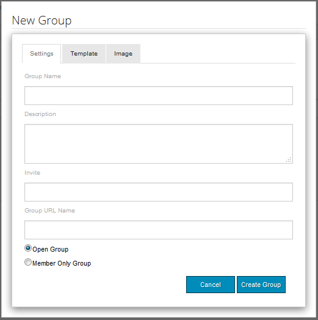

# Grupos de la comunidad {#community-groups}

La función de grupos de comunidad es la capacidad de los usuarios autorizados (miembros de la comunidad y autores) desde los entornos de publicación y creación para crear dinámicamente una subcomunidad dentro de un sitio de comunidad.

Esta capacidad está presente cuando la variable [Función de grupos](/help/communities/functions.md#groups-function) está presente en la variable [sitio de la comunidad](/help/communities/sites-console.md) estructura.

A [plantilla de grupo de la comunidad](/help/communities/tools-groups.md) proporciona el diseño de la página de grupo de comunidad cuando se crea un grupo de comunidad de forma dinámica.

Se seleccionan una o más plantillas de grupo para la función de grupos cuando la función se agrega a la estructura de un sitio de la comunidad o a una plantilla de sitio de la comunidad. Esta lista de plantillas de grupo se presenta al miembro o autor que crea dinámicamente un nuevo grupo desde el sitio de la comunidad.

## Creación de un nuevo grupo {#creating-a-new-group}

La capacidad de crear un nuevo grupo de comunidad depende de la existencia de un sitio de comunidad que incluya la función de grupos, como uno creado a partir del [Plantilla del sitio de referencia](/help/communities/sites.md).

Los ejemplos siguientes utilizan el sitio de comunidad creado a partir de la variable `Reference Site Template` tal como se describe en la sección [Introducción a AEM Communities](/help/communities/getting-started.md) tutorial.

Esta es la página que se carga al publicar cuando la variable **Grupos** elemento de menú seleccionado:

Al seleccionar la variable **Nuevo grupo** , se abre un cuadro de diálogo de edición.

En el **Configuración** , proporcione las funciones básicas del grupo:

* **Nombre del grupo**

   Título del grupo que se mostrará en el sitio de la comunidad. Evite utilizar caracteres de subrayado (_) y palabras clave como recursos y configuración en el nombre del grupo.

* **Descripción**

   Descripción del grupo que se mostrará en el sitio de la comunidad.

* **Invitar**

   Una lista de miembros a los que invitar para unirse al grupo. La búsqueda de tipo por adelantado proporcionará sugerencias de los miembros de la comunidad a los que invitar.

* **Nombre de URL del grupo**

   Nombre de la página de grupo que forma parte de la dirección URL.

* **Abrir grupo**

   Selección `Open Group` indica que cualquier visitante anónimo del sitio puede ver el contenido y deseleccionará `Member Only Group`.

* **Grupo de solo miembros**

   Selección `Member Only Group` indica que solo los miembros del grupo pueden ver el contenido y anulará la selección `Open Group`.

En el **Plantilla** es la capacidad de seleccionar de la lista de plantillas de grupo de la comunidad que se especificaron cuando la función de grupos se incluyó en la estructura del sitio de la comunidad o en una plantilla de sitio de la comunidad.

En el **Imagen** es la capacidad de cargar una imagen para mostrarla en el grupo en la página Grupos del sitio de la comunidad. La hoja de estilo predeterminada cambiará el tamaño de la imagen a 170 x 90 píxeles.

Seleccione la **Crear grupo** , las páginas del grupo se crean en función de la plantilla elegida, y se crea un grupo de usuarios para la pertenencia, y la página Grupos se actualiza para mostrar la nueva subcomunidad.

Por ejemplo, la página Grupos con una nueva subcomunidad titulada &quot;Grupo de enfoque&quot;, para la que se cargó una imagen en miniatura, aparecerá de la siguiente manera (aún con sesión iniciada como administrador de grupo de la comunidad):

Al seleccionar la variable `Focus Group` el vínculo abrirá la página Grupo de enfoque en el explorador, que tiene un aspecto inicial basado en la plantilla elegida, e incluye un submenú debajo del menú del sitio de la comunidad principal:

### Componente de lista de miembros del grupo de la comunidad {#community-group-member-list-component}

La variable `Community Group Member List` está diseñado para ser utilizado por desarrolladores de plantillas de grupo.

### Información adicional {#additional-information}

Puede encontrar más información en la [Community Group Essentials](/help/communities/essentials-groups.md) para desarrolladores.

Para obtener más información relacionada con los grupos de la comunidad, visite [Administración de usuarios y grupos de usuarios](/help/communities/users.md).
