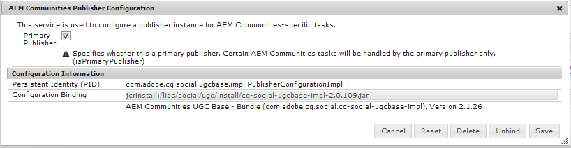

# Implementación de comunidades {#deploying-communities}

## Requisitos previos {#prerequisites}

* [AEM Plataforma de.5](/help/sites-deploying/deploy.md)

* Licencia de AEM Communities

* Licencias opcionales para:

   * [Funciones de Adobe Analytics para comunidades](/help/communities/analytics.md)
   * [MongoDB para MSRP](/help/communities/msrp.md)
   * [Adobe Cloud para ASRP](/help/communities/asrp.md)

## Lista de comprobación de instalación {#installation-checklist}

**Para el [AEM plataforma de](/help/sites-deploying/deploy.md#what-is-aem)**

* Instalar más reciente [AEM Actualizaciones de.5](#aem64updates)

* Si no utiliza los puertos predeterminados (4502, 4503), [configurar agentes de replicación](#replication-agents-on-author)
* [Replicar la clave criptográfica](#replicate-the-crypto-key)
* Si apoyamos la globalización, [configuración de la traducción automática](/help/sites-administering/translation.md)
(se proporciona la configuración de muestra para el desarrollo)

**Para el [Capacidad de Communities](/help/communities/overview.md)**

* Si se implementa un [publicar conjunto de servidores](/help/sites-deploying/recommended-deploys.md#tarmk-farm), [identificar el editor principal](#primary-publisher)

* [Habilitar el servicio de túnel](#tunnel-service-on-author)
* [Habilitar inicio de sesión social](/help/communities/social-login.md#adobe-granite-oauth-authentication-handler)
* [Configuración de Adobe Analytics](/help/communities/analytics.md)
* Configure un [servicio de correo electrónico predeterminado](/help/communities/email.md)
* Identificar la opción para [almacenamiento UGC compartido](/help/communities/working-with-srp.md) (**SRP**)

   * Si MongoDB SRP [(MSRP)](/help/communities/msrp.md)

      * [Instalación y configuración de MongoDB](/help/communities/msrp.md#mongodb-configuration)
      * [Configurar Solr](/help/communities/solr.md)
      * [Seleccionar MSRP](/help/communities/srp-config.md)
   * Si la base de datos relacional SRP [(DSRP)](/help/communities/dsrp.md)

      * [Instalar el controlador JDBC para MySQL](#jdbc-driver-for-mysql)
      * [Instalar y configurar MySQL para DSRP](/help/communities/dsrp-mysql.md)
      * [Configurar Solr](/help/communities/solr.md)
      * [Seleccionar DSRP](/help/communities/srp-config.md)
   * Si Adobe SRP [(ASRP)](/help/communities/asrp.md)

      * Póngase en contacto con su representante de cuentas para el aprovisionamiento
      * [Seleccionar ASRP](/help/communities/srp-config.md)
   * Si JCR SRP [(JSRP)](/help/communities/jsrp.md)

      * No es una tienda UGC compartida:

         * UGC nunca se replica
         * AEM UGC solo visible en la instancia o el clúster en el que se ha introducido, o en el que se ha producido un error en la configuración de usuario

         * El valor predeterminado es JSRP
   Para el **[característica de habilitación](/help/communities/overview.md#enablement-community)**

   * [Instalación y configuración de FFmpeg](/help/communities/ffmpeg.md)
   * [Instalar el controlador JDBC para MySQL](#jdbc-driver-for-mysql)
   * [Instalación de AEM Communities SCORM-Engine](#scorm-package)
   * [Instalar y configurar MySQL para la habilitación](/help/communities/mysql.md)


## Últimas versiones {#latest-releases}

AEM.5 Communities GA incluye el paquete Communities. AEM Para obtener más información sobre las actualizaciones de 6.5 [Communities](/help/release-notes/release-notes.md#experiencemanagercommunities), consulte [AEM Notas de la versión de 6.5](/help/release-notes/release-notes.md#communities-release-notes.html).

### AEM Actualizaciones de.5 {#aem-updates}

AEM AEM A partir de la versión 6.4, las actualizaciones de las comunidades se entregarán como parte de los paquetes de correcciones acumulativas y paquetes de servicio de la aplicación de, que se incluyen en la versión de.

AEM Para obtener las últimas actualizaciones de la versión 6.5 de la, consulte [Paquetes de correcciones acumulativas y paquetes de servicio de Adobe Experience Manager 6.4](https://helpx.adobe.com/es/experience-manager/aem-releases-updates.html).

### Historial de versiones {#version-history}

AEM Al igual que en la versión 6.4 de y posteriores, las funciones y revisiones de AEM Communities forman parte de los paquetes de correcciones acumulativos y los paquetes de servicio de AEM Communities. Por lo tanto, no hay paquetes de funciones independientes.

### Controlador JDBC para MySQL {#jdbc-driver-for-mysql}

Dos funciones de Communities utilizan una base de datos MySQL:

* Para [habilitación](/help/communities/enablement.md): grabando actividades y alumnos de SCORM
* Para [DSRP](/help/communities/dsrp.md): almacenamiento del contenido generado por el usuario (UGC)

El conector MySQL debe obtenerse e instalarse por separado.

Los pasos necesarios son:

1. Descargue el archivo ZIP desde [https://dev.mysql.com/downloads/connector/j/](https://dev.mysql.com/downloads/connector/j/)

   * La versión debe ser >= 5.1.38

1. Extraer mysql-connector-java-&lt;version>-bin.jar (paquete) del archivo
1. Utilice la consola web para instalar e iniciar el paquete:

   * Por ejemplo, https://localhost:4502/system/console/bundles
   * Seleccione **`Install/Update`**
   * Examinar... para seleccionar el paquete extraído del archivo ZIP descargado
   * Compruebe que *Controlador JDBC de oracle Corporation para MySQLcom.mysql.jdbc* está activo y, si no es así, inícielo (o compruebe los registros)

1. Si realiza la instalación en una implementación existente después de configurar JDBC, vuelva a enlazar JDBC al nuevo conector volviendo a guardar la configuración de JDBC desde la consola web :
   * Por ejemplo, https://localhost:4502/system/console/configMgr
   * Localizar `Day Commons JDBC Connections Pool` configuración
   * Seleccionar para abrir
   * Seleccione `Save`

1. Repita los pasos 3 y 4 en todas las instancias de autor y publicación

Encontrará más información sobre la instalación de paquetes en la [Consola web](/help/sites-deploying/web-console.md) página.

#### Ejemplo : Paquete de conector MySQL instalado {#example-installed-mysql-connector-bundle}


### Paquete SCORM {#scorm-package}

El Modelo de referencia de objetos de contenido compartido (SCORM) es un conjunto de estándares y especificaciones para el aprendizaje electrónico. SCORM también define cómo se puede empaquetar el contenido en un archivo ZIP transferible.

El motor SCORM de AEM Communities es necesario para [habilitación](/help/communities/overview.md#enablement-community) función. AEM Paquetes Scorm compatibles con comunidades de 6.5:

* [cq-social-scorm-package, versión 2.3.7](https://experience.adobe.com/#/downloads/content/software-distribution/en/aem.html?package=%2Fcontent%2Fsoftware-distribution%2Fen%2Fdetails.html%2Fcontent%2Fdam%2Faem%2Fpublic%2Fadobe%2Fpackages%2Fcq640%2Fsocial%2Fscorm%2Fcq-social-scorm-2017-pkg) que incluye el [SCORM 2017.1](https://rusticisoftware.com/blog/scorm-engine-2017-released/) motor.

**Para instalar un paquete SCORM**

1. Instale el [cq-social-scorm-package, versión 2.3.7](https://experience.adobe.com/#/downloads/content/software-distribution/en/aem.html?package=%2Fcontent%2Fsoftware-distribution%2Fen%2Fdetails.html%2Fcontent%2Fdam%2Faem%2Fpublic%2Fadobe%2Fpackages%2Fcq640%2Fsocial%2Fscorm%2Fcq-social-scorm-2017-pkg)  en Uso compartido de paquetes.
1. Descargar `/libs/social/config/scorm/database_scormengine_data.sql` de la instancia cq y ejecútela en mysql server para crear un esquema scormEngineDB actualizado.
1. Añadir `/content/communities/scorm/RecordResults` en la propiedad Rutas excluidas (Excluded Paths) en el filtro CSRF de `https://<hostname>:<port>/system/console/configMgr` en editores.


#### Registro SCORM {#scorm-logging}

Como está instalado, toda la actividad de habilitación se registra de forma detallada en la consola del sistema.

Si lo desea, el nivel de registro se puede establecer en WARN para `RusticiSoftware.*` paquete.

Para trabajar con registros, consulte [Trabajar con registros de auditoría y archivos de registro](/help/sites-deploying/monitoring-and-maintaining.md#working-with-audit-records-and-log-files).

### AEM MLS avanzado de {#aem-advanced-mls}

Para que la colección SRP (MSRP o DSRP) admita la búsqueda multilingüe avanzada (MLS), se requieren nuevos complementos de Solr, además de un esquema personalizado y una configuración de Solr. Todos los elementos necesarios se empaquetan en un archivo zip descargable.

La descarga avanzada de MLS (también conocida como &#39;phasetwo&#39;) está disponible en el repositorio de Adobe :

* AEM-SOLR-MLS-phasettwo

   Para obtener el paquete Advanced MLS, consulte [AEM MLS avanzado de](deploy-communities.md#aem-advanced-mls) en la sección implementar de la documentación.

   * Versión 1.2.40, 6 de abril de 2016
   * AEM Descargar-SOLR-MLS-phasetwo-1.2.40.zip

Para obtener más información e información de instalación, visite [Configuración de Solr](/help/communities/solr.md) para SRP.

### Acerca de los vínculos de Package Share {#about-links-to-package-share}

**Paquetes visibles en Adobe AEM Cloud**

AEM Los vínculos a paquetes de esta página no requieren la ejecución de instancias de, ya que son para compartir paquetes en los que no se requiere la ejecución de las instancias de `adobeaemcloud.com`. Mientras que los paquetes son visibles, la variable `Install` para instalar los paquetes en un sitio alojado en el Adobe. AEM Si tiene intención de realizar la instalación en una instancia local de, seleccione `Install` dará como resultado un error.

**AEM Cómo realizar la instalación en una instancia de local**

Para instalar los paquetes visibles en `adobeaemcloud.com` AEM en una instancia de local, el paquete debe descargarse primero en un disco local:

* Seleccione el **Assets** pestaña
* Seleccionar **descargar en disco**

AEM En la instancia local de, utilice el administrador de paquetes (por ejemplo, ) [https://localhost:4502/crx/packmgr/](https://localhost:4502/crx/packmgr/)AEM ), para cargar en el repositorio local de paquetes de.

AEM También puede acceder al paquete utilizando el uso compartido de paquetes desde la instancia local de la aplicación (por ejemplo, ). [https://localhost:4502/crx/packageshare/](https://localhost:4502/crx/packageshare/)), el `Download` AEM se descargará en el repositorio de paquetes de la instancia de la instancia de la instancia local de.

AEM Una vez que esté en el repositorio de paquetes de la instancia de la instancia local de, utilice el administrador de paquetes para instalar el paquete.

Para obtener más información, visite [Cómo trabajar con paquetes](/help/sites-administering/package-manager.md#package-share).

## Implementaciones recomendadas {#recommended-deployments}

En AEM Communities, se utiliza un almacén común para almacenar contenido generado por el usuario (UGC) y, a menudo, se denomina [proveedor de recursos de almacenamiento (SRP)](/help/communities/working-with-srp.md). La implementación recomendada se centra en elegir una opción de SRP para el almacén común.

El almacén común admite la moderación y el análisis de UGC en el entorno de publicación, a la vez que elimina la necesidad de [réplica](/help/communities/sync.md) de UGC.

* [Almacenamiento de contenido de comunidad](/help/communities/working-with-srp.md) AEM : analiza las opciones de almacenamiento de SRP para comunidades de

* [Topologías recomendadas](/help/communities/topologies.md) : analiza la topología que se utilizará según el caso de uso y la opción de SRP

## Actualización {#upgrading}

AEM AEM Al actualizar a la plataforma de 6.5 desde versiones anteriores de, es importante leer lo siguiente [AEM Actualización a 6.5](/help/sites-deploying/upgrade.md).

Además de actualizar la plataforma, lea [Actualización a AEM Communities 6.5](/help/communities/upgrade.md) para obtener más información sobre los cambios de Communities.

## Configuraciones {#configurations}

### Editor principal {#primary-publisher}

Cuando la implementación elegida es una [publicar conjunto de servidores](/help/communities/topologies.md#tarmk-publish-farm)AEM , entonces una instancia de publicación de debe identificarse como **`primary publisher`** para actividades que no deberían producirse en todas las instancias, como las funciones que dependen de **notificaciones** o **Adobe Analytics**.

De forma predeterminada, la variable `AEM Communities Publisher Configuration` La configuración de OSGi se configura con **`Primary Publisher`** casilla de verificación activada, de modo que todas las instancias de publicación de un conjunto de servidores de publicación se identificarían automáticamente como principales.

Por lo tanto, es necesario **editar la configuración en todas las instancias de publicación secundarias** para desmarcar **`Primary Publisher`** casilla de verificación



Para todas las demás instancias de publicación (secundarias) de un conjunto de servidores de publicación:

* Iniciar sesión con privilegios de administrador
* Acceda a la [consola web](/help/sites-deploying/configuring-osgi.md)

   * Por ejemplo, [https://localhost:4503/system/console/configMgr](https://localhost:4503/system/console/configMgr)

* Busque el `AEM Communities Publisher Configuration`
* Seleccione el icono de edición
* Desmarque la **Editor principal** caja
* Seleccione **Guardar**

### Agentes de replicación en Autor {#replication-agents-on-author}

La replicación se utiliza para el contenido del sitio creado en el entorno de publicación, como los grupos de la comunidad, así como para administrar miembros y grupos de miembros desde el entorno de creación mediante [servicio túnel](#tunnel-service-on-author).

Para el editor principal, asegúrese de que [Configuración del agente de replicación](/help/sites-deploying/replication.md) identifica correctamente el servidor de publicación y el usuario autorizado. El usuario autorizado predeterminado, `admin,` ya tiene los permisos adecuados (es miembro de `Communities Administrators`).

Para que otros usuarios tengan los permisos adecuados, deben agregarse como miembros a `administrators` grupo de usuarios (también miembro de `Communities Administrators`).

Hay dos agentes de replicación en el entorno de creación que necesitan que la configuración de transporte esté correctamente configurada.

* Acceso a la consola de replicación en el autor

   * En la navegación global, vaya a **[!UICONTROL Herramientas]** > **[!UICONTROL Implementación]** > **[!UICONTROL Replicación]** > **[!UICONTROL Agentes en el autor]**

* Siga el mismo procedimiento para ambos agentes:

   * **Agente predeterminado (publicar)**
   * **Agente de replicación inversa (publicación inversa)**

      1. Seleccione el agente
      1. Seleccionar **editar**
      1. Seleccione el **Transporte** pestaña
      1. Si no es puerto `4503`, edite el **URI** para especificar el puerto correcto

      1. Si no es usuario `admin`, edite el **Usuario** y **Contraseña** para especificar un miembro del `administrators` grupo de usuarios

Las siguientes imágenes muestran los resultados de cambiar el puerto de 4503 a 6103 por:

#### Agente predeterminado (publicar) {#default-agent-publish}


#### Agente de replicación inversa (publicación inversa) {#reverse-replication-agent-publish-reverse}


### Servicio de túnel de autor {#tunnel-service-on-author}

Cuando se utiliza el entorno de creación para lo siguiente: [crear sitios](/help/communities/sites-console.md), [modificar propiedades del sitio](/help/communities/sites-console.md#modifying-site-properties) o [administrar miembros de la comunidad](/help/communities/members.md), es necesario acceder a los miembros (usuarios) registrados en el entorno de publicación, no a los usuarios registrados en el autor.

El servicio de túnel proporciona este acceso mediante el agente de replicación en el autor.

Para habilitar el servicio de túnel:

* Inicie sesión con privilegios administrativos en la instancia de autor.
* Si el publicador no es localhost:4503 o el usuario de transporte no lo es `admin`, entonces [configuración del agente de replicación](#replication-agents-on-author)

* Acceda a la [Consola web](/help/sites-deploying/configuring-osgi.md)

   * Por ejemplo, [https://localhost:4502/system/console/configMgr](https://localhost:4502/system/console/configMgr)

* Busque el `AEM Communities Publish Tunnel Service`
* Seleccione el icono de edición
* Compruebe la **habilitar** caja
* Seleccione **Guardar**

   

### Replicar la clave criptográfica {#replicate-the-crypto-key}

Existen dos funciones de AEM Communities AEM que requieren que todas las instancias de servidor de la utilicen las mismas claves de cifrado. Estos son [Analytics](/help/communities/analytics.md) y [ASRP](/help/communities/asrp.md).

AEM A partir de la versión 6.3, el material clave se almacena en el sistema de archivos y ya no en el repositorio.

Para copiar el material clave del autor a todas las demás instancias, es necesario:

* AEM Acceda a la instancia de, normalmente una instancia de autor, que contiene el material clave que desea copiar

   * Busque el `com.adobe.granite.crypto.file` paquete en el sistema de archivos local, por ejemplo,

      * `<author-aem-install-dir>/crx-quickstart/launchpad/felix/bundle21`
      * El `bundle.info` identificará el paquete
   * Vaya a la carpeta de datos, por ejemplo,

      * `<author-aem-install-dir>/crx-quickstart/launchpad/felix/bundle21/data`

      * Copie los archivos hmac y del nodo principal


* AEM Para cada instancia de destino de la

   * Vaya a la carpeta de datos, por ejemplo,

      * `<publish-aem-install-dir>/crx-quickstart/launchpad/felix/bundle21/data`
   * Pegue los 2 archivos copiados anteriormente
   * Es necesario lo siguiente [actualice el paquete Granite Crypto](#refresh-the-granite-crypto-bundle) AEM si la instancia de destino de la se está ejecutando


>[!CAUTION]
>
>Si ya se ha configurado otra característica de seguridad basada en las claves criptográficas, la replicación de las claves criptográficas podría dañar la configuración. Para obtener ayuda, [contactar con atención al cliente](https://helpx.adobe.com/es/marketing-cloud/contact-support.html).

#### Replicación del repositorio {#repository-replication}

AEM AEM Si se almacena el material clave en el repositorio, como en el caso de la versión 6.2 y anteriores, se puede conservar especificando la siguiente propiedad del sistema al iniciar cada instancia por primera vez (lo que crea el repositorio inicial):

* `-Dcom.adobe.granite.crypto.file.disable=true`

>[!NOTE]
>
>Es importante verificar que la variable [agente de replicación en el autor](#replication-agents-on-author) está configurado correctamente.

Con el material de clave almacenado en el repositorio, la manera de replicar la clave criptográfica desde el autor a otras instancias es la siguiente:

Uso de [CRXDE Lite](/help/sites-developing/developing-with-crxde-lite.md):

* Navegar a [https://&lt;server>:&lt;port>/crx/de](https://localhost:4502/crx/de)
* Seleccione `/etc/key`
* Abrir `Replication` pestaña
* Seleccione `Replicate`

* [Actualizar el paquete de Granite Crypto](#refresh-the-granite-crypto-bundle)

   

#### Actualizar el paquete de cifrado de Granite {#refresh-the-granite-crypto-bundle}

* En cada instancia de publicación, acceda al [Consola web](/help/sites-deploying/configuring-osgi.md)

   * Por ejemplo, [https://&lt;server>:&lt;port>/system/console/bundles](https://localhost:4503/system/console/bundles)

* Localizar `Adobe Granite Crypto Support` paquete (com.adobe.granite.crypto)
* Seleccionar **Actualizar**

   

* Después de un momento, un **Correcto** El cuadro de diálogo debería aparecer:
   `Operation completed successfully.`

### Servidor HTTP Apache {#apache-http-server}

Si utiliza el servidor HTTP de Apache, asegúrese de utilizar el nombre de servidor correcto para todas las entradas relevantes.

En particular, tenga cuidado de utilizar el nombre de servidor correcto, no `localhost`, en el `RedirectMatch`.

#### muestra de httpd.conf {#httpd-conf-sample}

```shell
<IfModule alias_module>
     # XAMPP does not have a favicon; this prevents any 404 errors which may arise.
     Redirect 404 /favicon.ico
     <Location /favicon.ico>
         ErrorDocument 404 "No favicon"
     </Location>

    # Return from "Sign Out" generates response header directing you to "/", generating a 404 error
    # The RedirectMatch resolves it correctly when modified for the target Community Site :
    RedirectMatch ^/$ https://[server name]/content/sites/engage/en.html
 ...
 </IfModule>
```

### Dispatcher {#dispatcher}

Si utiliza Dispatcher, consulte:

* AEM [Dispatcher](https://helpx.adobe.com/es/experience-manager/dispatcher/using/dispatcher.html) documentación
* [Instalación de Dispatcher](https://helpx.adobe.com/experience-manager/dispatcher/using/dispatcher-install.html)
* [Configurar Dispatcher para comunidades](/help/communities/dispatcher.md)
* [Problemas conocidos](/help/communities/troubleshooting.md#dispatcher-refetch-fails)

## Documentación de comunidades relacionadas {#related-communities-documentation}

* Visita [Administración de sitios de Communities](/help/communities/administer-landing.md) para obtener más información sobre cómo crear un sitio de la comunidad, configurar las plantillas de sitio de la comunidad, moderar el contenido de la comunidad, administrar miembros y configurar la mensajería.

* Visita [Desarrollo de comunidades](/help/communities/communities.md) para obtener más información sobre el marco de trabajo de componentes sociales (SCF) y personalizar los componentes y las funciones de las Comunidades.

* Visita [Componentes de comunidades de creación](/help/communities/author-communities.md) para aprender a crear y configurar componentes de Communities.
