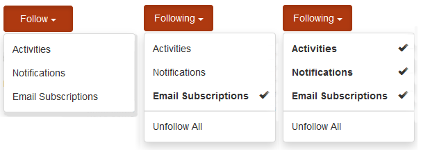

# Crear un nuevo sitio de comunidad para habilitarlo {#author-a-new-community-site-for-enablement}

## Crear sitio de comunidad {#create-community-site}

[La creación](/help/communities/sites-console.md) de sitios de comunidad emplea un asistente que lo guía a través de los pasos para crear un sitio de comunidad. Es posible avanzar al paso `Next` o `Back` al paso anterior antes de comprometer el sitio en el paso final.

Para empezar a crear un nuevo sitio de comunidad:

Uso de la instancia de [autor](https://localhost:4502/)

* Inicio de sesión con privilegios de administrador
* Vaya a Comunidades de control **[UIC > Sitios]**

* Seleccione **Crear**

### Paso 1: Plantilla de sitio {#step-site-template}

En el paso Plantilla **de** sitio, escriba un título, una descripción, el nombre de la dirección URL y seleccione una plantilla de sitio de comunidad, por ejemplo:

* **Título del sitio de la comunidad**: `Enablement Tutorial`

* **Descripción del sitio de la comunidad**: `A site for enabling the community to learn.`

* **Raíz** del sitio de la comunidad: (dejar en blanco para la raíz predeterminada `/content/sites`)

* **Configuraciones** de nube: (deje en blanco si no se especifica ninguna configuración de nube) proporcione la ruta a las configuraciones de nube especificadas.
* **Idioma** base del sitio de la comunidad: (dejar intacto para un solo idioma: Inglés) utilice la lista desplegable para elegir uno *o más* idiomas básicos de los disponibles: alemán, italiano, francés, japonés, español, portugués (Brasil), chino (tradicional) y chino (simplificado). Se creará un sitio de comunidad para cada idioma agregado y existirá dentro de la misma carpeta de sitio siguiendo las optimizaciones descritas en [Traducir contenido para sitios](/help/sites-administering/translation.md)multilingües. La página raíz de cada sitio contendrá una página secundaria con el nombre del código de idioma de uno de los idiomas seleccionados, como &quot;en&quot; para inglés o &quot;fr&quot; para francés.

* **Nombre del sitio de la comunidad**: `enable`

   * La dirección URL inicial se mostrará debajo del nombre del sitio de la comunidad
   * Para una dirección URL válida, anexe un código de idioma base + &quot;.html&quot;
      *Por ejemplo*, https://localhost:4502/content/sites/ `enable/en.html`

* **Plantilla** de sitio de referencia: desplegable para elegir `Reference Structured Learning Site Template`

Seleccione **Siguiente**

### Paso 2: Diseño {#step-design}

El paso Diseño se presenta en dos secciones para seleccionar el tema y la pancarta de marca:

#### COMMUNITY SITE THEME {#community-site-theme}

Seleccione el estilo que desee aplicar a la plantilla. Cuando se selecciona, el tema se superpone con una marca de verificación.

#### COMMUNITY SITE BRANDING {#community-site-branding}

(opcional) Cargue una imagen de pancarta para mostrarla en las páginas del sitio. La pancarta se fija en el borde izquierdo del explorador, entre el encabezado del sitio de la comunidad y el menú (vínculos de navegación). La altura de la pancarta se recorta a 120 píxeles. No se puede cambiar el tamaño del letrero para que se ajuste al ancho del navegador y a la altura de 120 píxeles.

 

Seleccione **Siguiente**.

### Paso 3: Configuración {#step-settings}

En el paso Configuración, antes de seleccionar `Next`, fíjese en que hay siete secciones que proporcionan acceso a configuraciones que incluyen administración de usuarios, etiquetado, funciones, moderación, análisis, traducción y habilitación.

#### USER MANAGEMENT {#user-management}

Se recomienda que las comunidades [de](/help/communities/overview.md#enablement-community) habilitación sean privadas.

Un sitio de comunidad es privado cuando se deniega el acceso a los visitantes anónimos del sitio, es posible que no se registre por sí mismo y que no utilice el inicio de sesión en redes sociales.

Asegúrese de que la mayoría de las casillas de verificación no están seleccionadas para Administración [de usuarios](/help/communities/sites-console.md#user-management) :

* NO permitir que los visitantes del sitio se automatriculen
* NO permitir que los visitantes anónimos del sitio vean el sitio
* Opcional si se permite o no la mensajería entre los miembros de la comunidad
* NO permitir el inicio de sesión con Facebook
* NO permitir el inicio de sesión con Twitter

#### TAGGING {#tagging}

Las etiquetas que se pueden aplicar al contenido de la comunidad se controlan seleccionando los espacios de nombres de AEM definidos previamente mediante la Consola [de](/help/sites-administering/tags.md#tagging-console) etiquetado (como el espacio de nombres [Tutorial](/help/communities/enablement-setup.md#create-tutorial-tags)).

Además, si se seleccionan Espacios de nombres de etiquetas para el sitio de la comunidad, se limita la selección presentada al definir los catálogos y los recursos de habilitación. Consulte [Etiquetado de recursos](/help/communities/tag-resources.md) de habilitación para obtener información importante.

La búsqueda de espacios de nombres es sencilla mediante la búsqueda por tipo. Por ejemplo,

* Tipo `tut`
* Seleccione `Tutorial`

### ROLES {#roles}

[Las funciones](/help/communities/users.md) de miembro de la comunidad se asignan mediante la configuración de la sección Roles.

Para permitir que un miembro de la comunidad (o grupo de miembros) experimente el sitio como administrador de la comunidad, utilice la búsqueda de tipo por adelantado y seleccione el nombre del miembro o grupo en las opciones de la lista desplegable.

Por ejemplo,

* Tipo `q`
* Seleccionar [Cuinn Harper](/help/communities/enablement-setup.md#publishcreateenablementmembers)

>[!NOTE]
>
>[El servicio](/help/communities/deploy-communities.md#tunnel-service-on-author) de túnel permite seleccionar miembros y grupos que solo existen en el entorno de publicación.

#### MODERATION {#moderation}

Acepte la configuración global predeterminada para [moderar](/help/communities/sites-console.md#moderation) el contenido generado por el usuario (UGC).

#### ANALYTICS {#analytics}

En la lista desplegable, seleccione el marco de servicios en la nube de Analytics configurado para este sitio de comunidad.

La selección que se ve en la captura de pantalla, `Communities`es el ejemplo de marco de la documentación de [configuración.](/help/communities/analytics.md#aem-analytics-framework-configuration)

#### TRANSLATION {#translation}

La configuración [de](/help/communities/sites-console.md#translation) traducción especifica si se puede traducir o no UGC y en qué idioma, en caso afirmativo.

* Comprobar **Permitir traducción automática**
* Usar la configuración predeterminada

#### ENABLEMENT {#enablement}

Para una comunidad de habilitación, es necesario identificar uno o varios administradores de habilitación de la comunidad.

* **Administradores** de habilitación (obligatorios) Los miembros del `Community Enablement Managers` grupo están disponibles para ser seleccionados para administrar este sitio de comunidad.

   * Tipo `s`
   * Seleccione `Sirius Nilson`

* **ID** de organización de Marketing Cloud (opcional) El ID de una cuenta de Adobe Analytics que es necesario para incluir [Video Heartbeat Analytics](/help/communities/analytics.md#video-heartbeat-analytics) en los informes de habilitación.

Seleccione **Siguiente**.

### Paso 4: Crear sitio de comunidad {#step-create-community-site}

Seleccione **Crear.**

Cuando se completa el proceso, la carpeta del nuevo sitio se muestra en la consola Comunidades > Sitios.

### Publicar el nuevo sitio de comunidad {#publish-the-new-community-site}

El sitio creado debe administrarse desde la consola Comunidades - Sitios, la misma consola desde la que se pueden crear nuevos sitios.

Después de seleccionar la carpeta del sitio de la comunidad, coloque el puntero sobre el icono del sitio para que aparezcan cuatro iconos de acción:

Al seleccionar el icono de elipses (icono Más acciones), aparecen las opciones Exportar sitio y Eliminar sitio.

De izquierda a derecha están :

* **Abrir sitio**

   Seleccione el icono del lápiz para abrir el sitio de la comunidad en modo de edición de autor, para agregar o configurar componentes de página

* **Editar sitio**

   Seleccione el icono de propiedades para abrir el sitio de la comunidad y modificar las propiedades, como el título o cambiar el tema

* **Publicar sitio**

   Seleccione el icono mundial para publicar el sitio de comunidad (en localhost:4503 de forma predeterminada)

* **Exportar sitio**

   Seleccione el icono de exportación para crear un paquete del sitio de la comunidad que se almacene en el administrador [de](/help/sites-administering/package-manager.md) paquetes y se descargue.
Tenga en cuenta que UGC no se incluye en el paquete del sitio.

* **Eliminar sitio**

   Para eliminar el sitio de comunidad, seleccione el icono Eliminar sitio que aparece al pasar el ratón sobre el sitio en la Consola de sitio de comunidades. Esta acción elimina todos los elementos asociados con el sitio, como UGC, grupos de usuarios, recursos y registros de bases de datos.

#### Seleccione Publicar {#select-publish}

Seleccione el icono del mundo para publicar el sitio de la comunidad.

Habrá una indicación de que el sitio fue publicado.

## Usuarios y grupos de usuarios de la comunidad {#community-users-user-groups}

### Aviso a nuevos grupos de usuarios de la comunidad {#notice-new-community-user-groups}

Junto con el nuevo sitio de comunidad, se crean nuevos grupos de usuarios que tienen los permisos adecuados establecidos para diversas funciones administrativas. Para obtener más información, visite Grupos [de usuarios para sitios](/help/communities/users.md#usergroupsforcommunitysites)de la comunidad.

Para este nuevo sitio de comunidad, dado el nombre del sitio &quot;habilitar&quot; en el paso 1, los nuevos grupos de usuarios que existen en el entorno de publicación pueden verse desde la consola [Miembros y grupos de](/help/communities/members.md#groups-console) comunidades:

### Asignar miembros a un grupo de miembros de habilitación de comunidad {#assign-members-to-community-enable-members-group}

En el autor, con el servicio de túnel habilitado, es posible asignar los [usuarios creados durante la configuración](/help/communities/enablement-setup.md#publishcreateenablementmembers) inicial al grupo Miembros de la comunidad para el sitio de la comunidad recién creado.

Mediante la consola Grupos de la comunidad, los miembros se pueden agregar de forma individual o mediante la pertenencia a un grupo.

En este ejemplo, el grupo `Community Ski Class` se agrega como miembro del grupo `Community Enable Members` y como miembro `Quinn Harper`.

* Vaya a la consola **Comunidades y grupos**
* Seleccionar grupo de miembros de activación *de comunidad*
* Escriba &#39;ski&#39; en el cuadro de búsqueda **Agregar miembros al grupo**
* Seleccionar clase *de esquí de* comunidad (grupo de alumnos)
* Escriba &#39;quinn&#39; en el cuadro de búsqueda
* Seleccionar *Quinn Harper* (contacto de recursos de habilitación)

* Seleccione **Guardar**

## Configuraciones al publicar {#configurations-on-publish}

`https://localhost:4503/content/sites/enable/en.html {#http-localhost-content-sites-enable-en-html}`

### Error de configuración para autenticación {#configure-for-authentication-error}

Una vez que un sitio se ha configurado y se ha insertado para publicar, [configure la asignación](/help/communities/sites-console.md#configure-for-authentication-error) de inicio de sesión ( `Adobe Granite Login Selector Authentication Handler`) en la instancia de publicación. La ventaja es que cuando las credenciales de inicio de sesión no se especifican correctamente, el error de autenticación volverá a mostrar la página de inicio de sesión del sitio de la comunidad con un mensaje de error.

Agregar un `Login Page Mapping` como

* `/content/sites/enable/en/signin:/content/sites/enable/en`

### (Opcional) Cambiar la página principal predeterminada {#optional-change-the-default-home-page}

Al trabajar con el sitio de publicación con fines de demostración, puede resultar útil cambiar la página principal predeterminada al nuevo sitio.

Para ello, es necesario utilizar [CRX|DE](https://localhost:4503/crx/de) Lite para editar la tabla de asignación [de](/help/sites-deploying/resource-mapping.md) recursos al realizar la publicación.

Para empezar

1. Al realizar la publicación, acceda a CRXDE e inicie sesión con privilegios de administrador

   * Por ejemplo, vaya a [https://localhost:4503/crx/de](https://localhost:4503/crx/de) e inicie sesión con `admin/admin`

1. En el navegador del proyecto, expanda `/etc/map`
1. Seleccione el `http` nodo

   * Seleccione **Crear nodo**

      * **Nombre** localhost.4503

         ( *no utilice* &#39;:&#39;)

      * **Type** [sling:Mapping](https://sling.apache.org/documentation/the-sling-engine/mappings-for-resource-resolution.html)

1. Con el nodo recién creado `localhost.4503` seleccionado

   * Agregar propiedad

      * **Nombre** sling:match
      * **Cadena de tipo**
      * **Valor** localhost.4503/$
   (debe terminar con &#39;$&#39; char)

   * Agregar propiedad

      * **Nombre** sling:internalRedirect
      * **Cadena de tipo**
      * **Valor** /content/sites/enable/en.html

1. Seleccione **Guardar todo**
1. (Opcional) Eliminar el historial de exploración
1. Vaya a https://localhost:4503/

   * Llegar a https://localhost:4503/content/sites/enable/en.html

>[!NOTE]
>
>Para deshabilitar, simplemente anteponga el valor de la `sling:match` propiedad con una &#39;x&#39; - `xlocalhost.4503/$` - y **Guardar todo**.

#### Resolución de problemas: Error al guardar el mapa {#troubleshooting-error-saving-map}

Si no se pueden guardar los cambios, asegúrese de que el nombre del nodo sea `localhost.4503`, con un separador &#39;punto&#39; y no `localhost:4503` con un separador &#39;dos puntos&#39;, ya que no `localhost` es un prefijo de espacio de nombres válido.

#### Resolución de problemas: Error al redirigir {#troubleshooting-fail-to-redirect}

El valor &#39;**$**&#39; al final de la `sling:match`cadena de expresión regular es crucial, por lo que solo `https://localhost:4503/` se asigna exactamente, de lo contrario el valor de redireccionamiento se antepone a cualquier ruta que pueda existir después de server:port en la dirección URL. Por lo tanto, cuando AEM intenta redireccionar a la página de inicio de sesión, se produce un error.

## Modificación del sitio de comunidad {#modifying-the-community-site}

Una vez creado el sitio por primera vez, los autores pueden utilizar el icono  Abrir sitio para realizar actividades de creación de AEM estándar.

Además, los administradores pueden utilizar el icono  Editar sitio para modificar las propiedades del sitio, como el título.

Después de realizar cualquier modificación, recuerde **guardar** y volver a **publicar** el sitio.

>[!NOTE]
>
>Si no está familiarizado con AEM, consulte la documentación sobre la gestión  básica y una guía [rápida para crear páginas](/help/sites-authoring/qg-page-authoring.md).

### Agregar un catálogo {#add-a-catalog}

La plantilla de sitio de comunidad elegida para este sitio de comunidad debe contener la función de catálogo.

Si no es así, la función de catálogo se puede añadir fácilmente. Esto permitiría a otros miembros de la comunidad, no asignados a recursos de habilitación o a una ruta de aprendizaje, seleccionar recursos de habilitación de un catálogo.

Si la estructura del sitio ya contiene la función de catálogo, se puede cambiar su Título.

Para modificar la estructura del sitio, vaya a la consola **Comunidades, Sitios** , abra la `enable` carpeta y seleccione el icono **Editar sitio** para acceder a las propiedades de `Enablement Tutorial`.

Seleccione el panel ESTRUCTURA para añadir un catálogo o modificar uno existente:

* **Título**: `Ski Catalog`

* **URL**: `catalog`

* **Seleccionar todos los espacios** de nombres: dejar como predeterminado.
* select **Save**

Utilice el icono Posición para mover la función Catálogo a la segunda posición, después de Asignaciones.

Seleccione **Guardar** en la esquina superior derecha para guardar los cambios en el sitio de comunidad.

A continuación, vuelva a **publicar** el sitio.

