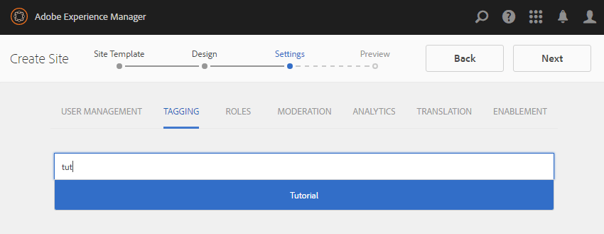

# Crear un nuevo sitio de comunidad para su habilitación {#author-a-new-community-site-for-enablement}

## Crear sitio de comunidad {#create-community-site}

[Creación del sitio de comunidad](/help/communities/sites-console.md) emplea un asistente que le guía en los pasos para crear un sitio de la comunidad. Es posible pasar a la sección `Next` paso o `Back` Vaya al paso anterior antes de comprometer el sitio en el paso final.

Para empezar a crear un nuevo sitio de la comunidad:

Uso del [instancia de autor](https://localhost:4502/)

* Inicie sesión con privilegios de administrador y vaya a **[!UICONTROL Communities]** > **[!UICONTROL Sites]**.

* Seleccione **Crear**.

### Paso 1: Plantilla del sitio {#step-site-template}

En el **Plantilla del sitio** , introduzca un título, una descripción, el nombre de la URL y seleccione una plantilla de sitio de comunidad, por ejemplo:

* **Título del sitio de la comunidad**: `Enablement Tutorial`.

* **Descripción del sitio de la comunidad**: `A site for enabling the community to learn.`

* **Raíz del sitio de comunidad**: (dejar en blanco para la raíz predeterminada) `/content/sites`)

* **Configuraciones de nube**: (déjelo en blanco si no se especifica ninguna configuración de nube) proporcione la ruta a las configuraciones de nube especificadas.
* **Idioma base del sitio de la comunidad**: (no tocar para un solo idioma: inglés) utilice la lista desplegable para elegir uno *o más* idiomas base de los idiomas disponibles: alemán, italiano, francés, japonés, español, portugués (Brasil), chino (tradicional) y chino (simplificado). Se creará un sitio de comunidad para cada idioma agregado y existirá dentro de la misma carpeta del sitio según la práctica recomendada descrita en [Traducción de contenido para sitios multilingües](/help/sites-administering/translation.md). La página raíz de cada sitio contendrá una página secundaria denominada por el código de idioma de uno de los idiomas seleccionados, como &quot;en&quot; para inglés o &quot;fr&quot; para francés.

* **Nombre del sitio de la comunidad**: `enable`

   * La dirección URL inicial se mostrará debajo del nombre del sitio de la comunidad
   * Para una URL válida, añada un código de idioma base + &quot;.html&quot;
      *Por ejemplo*, https://localhost:4502/content/sites/ `enable/en.html`

* **Plantilla del sitio de referencia**: tire hacia abajo para elegir `Reference Structured Learning Site Template`

Seleccione **Siguiente**.

### Paso 2: Diseño {#step-design}

El paso Diseño se presenta en dos secciones para seleccionar el tema y el titular de la marca:

#### TEMA DEL SITIO DE LA COMUNIDAD {#community-site-theme}

Seleccione el estilo que desee aplicar a la plantilla. Cuando se selecciona, la temática se superpone con una marca de verificación.

#### MARCA DEL SITIO DE LA COMUNIDAD {#community-site-branding}

(Opcional) Cargue una imagen de titular para mostrarla en las páginas del sitio. El banner está anclado al borde izquierdo del navegador, entre el encabezado y el menú del sitio de la comunidad (vínculos de navegación). La altura del titular se recorta a 120 píxeles. No se cambia el tamaño del titular para ajustarse a la anchura del explorador y a la altura de 120 píxeles.

Seleccione **Siguiente**.

### Paso 3: Configuración {#step-settings}

En el paso Configuración, antes de seleccionar `Next`, observe que hay siete secciones que proporcionan acceso a configuraciones que implican administración de usuarios, etiquetado, funciones, moderación, análisis, traducción y habilitación.

#### USER MANAGEMENT {#user-management}

Se recomienda que [comunidades de habilitación](/help/communities/overview.md#enablement-community) ser privado.

Un sitio de la comunidad es privado cuando se deniega el acceso a los visitantes anónimos del sitio, no se puede registrar automáticamente y no puede utilizar el inicio de sesión social.

Asegúrese de que la mayoría de las casillas de verificación no estén seleccionadas para [Administración de usuarios](/help/communities/sites-console.md#user-management) :

* NO permitir que los visitantes del sitio se registren automáticamente.
* NO permitir que visitantes anónimos del sitio vean el sitio.
* Opcional: permitir o no la mensajería entre los miembros de la comunidad.
* NO permitir el inicio de sesión con Facebook.
* NO permitir el inicio de sesión con Twitter.

#### ETIQUETADO {#tagging}

AEM Las etiquetas que se pueden aplicar al contenido de la comunidad se controlan seleccionando áreas de nombres definidas previamente mediante la opción de nombre de la comunidad de nombres de [Consola de etiquetado](/help/sites-administering/tags.md#tagging-console) (como el [Área de nombres del tutorial](/help/communities/enablement-setup.md#create-tutorial-tags)).

Además, la selección de Áreas de nombres de etiquetas para el sitio de la comunidad limita la selección presentada al definir catálogos y recursos de habilitación. Consulte [Recursos de habilitación de etiquetas](/help/communities/tag-resources.md) para obtener información importante.

Encontrar áreas de nombres es fácil mediante la búsqueda de escritura anticipada. Por ejemplo,

* Tipo `tut`
* Seleccione `Tutorial`

### ROLES {#roles}

[Funciones de miembro de comunidad](/help/communities/users.md) se asignan mediante la configuración de la sección Roles.

Para permitir que un miembro de la comunidad (o grupo de miembros) experimente el sitio como administrador de la comunidad, use la búsqueda de escritura anticipada y seleccione el nombre del miembro o grupo en las opciones de la lista desplegable.

Por ejemplo,

* Tipo `q`
* Seleccionar [Quinn Harper](/help/communities/enablement-setup.md#publishcreateenablementmembers)

>[!NOTE]
>
>[Servicio de túnel](/help/communities/deploy-communities.md#tunnel-service-on-author) permite la selección de miembros y grupos que solo existen en el entorno de publicación.

#### MODERACIÓN {#moderation}

Acepte la configuración global predeterminada para [moderador](/help/communities/sites-console.md#moderation) contenido generado por el usuario (UGC).

#### ANALYTICS {#analytics}

En la lista desplegable, seleccione el marco de Analytics Cloud Service configurado para este sitio de la comunidad.

La selección vista en la captura de pantalla, `Communities`, es el ejemplo de marco de trabajo de [documentación de configuración.](/help/communities/analytics.md#aem-analytics-framework-configuration)

#### TRADUCCIÓN {#translation}

El [Configuración de traducción](/help/communities/sites-console.md#translation) Especifique si se puede traducir o no UGC y a qué idioma, en caso afirmativo.

* Marque **Permitir traducción automática**
* Usar la configuración predeterminada

#### ACTIVACIÓN {#enablement}

Para una comunidad de habilitación, es necesario identificar uno o más administradores de habilitación de la comunidad.

* **Administradores de habilitación**
(obligatorio) Miembros del 
`Community Enablement Managers` grupos están disponibles para seleccionarse para administrar este sitio de la comunidad.

   * Tipo `s`
   * Seleccione `Sirius Nilson`

* **ID de organización de Marketing Cloud**
(opcional) El ID de una cuenta de Adobe Analytics que es necesario al incluir [Video Heartbeat Analytics](/help/communities/analytics.md#video-heartbeat-analytics) en los informes de habilitación.

Seleccione **Siguiente**.

### Paso 4: Crear sitio de la comunidad {#step-create-community-site}

Seleccione **Crear.**

Cuando el proceso termina, la carpeta del nuevo sitio se muestra en la consola Communities > Sitios.

### Publicar el nuevo sitio de la comunidad {#publish-the-new-community-site}

El sitio creado debe administrarse desde la consola Comunidades - Sitios, la misma consola desde la que se pueden crear nuevos sitios.

Después de seleccionar la carpeta del sitio de la comunidad, pase el ratón sobre el icono del sitio para que aparezcan cuatro iconos de acción:

Al seleccionar el icono de puntos suspensivos (icono Más acciones), aparecen las opciones Exportar sitio y Eliminar sitio.

De izquierda a derecha son:

* **Abrir sitio**

   Seleccione el icono de lápiz para abrir el sitio de la comunidad en el modo de edición de autor, para agregar o configurar componentes de página.

* **Editar sitio**

   Seleccione el icono de propiedades para abrir el sitio de la comunidad y modificar las propiedades, como el título o cambiar el tema.

* **Publicar sitio**

   Seleccione el icono del mundo para publicar el sitio de la comunidad (en localhost:4503 de forma predeterminada).

* **Exportar sitio**

   Seleccione el icono de exportación para crear un paquete del sitio de la comunidad almacenado en [administrador de paquetes](/help/sites-administering/package-manager.md) y descargado.
Tenga en cuenta que UGC no se incluye en el paquete del sitio.

* **Eliminar sitio**

   Para eliminar el sitio de la comunidad, seleccione el icono Eliminar sitio que aparece al pasar el ratón por encima del sitio en la Consola del sitio de Communities. Esta acción elimina todos los elementos asociados con el sitio, como UGC, grupos de usuarios, recursos y registros de bases de datos.

   

#### Seleccione Publicar {#select-publish}

Seleccione el icono del mundo para publicar el sitio de la comunidad.

Habrá una indicación de que el sitio se publicó.

## Usuarios y grupos de usuarios de la comunidad {#community-users-user-groups}

### Observe los nuevos grupos de usuarios de la comunidad {#notice-new-community-user-groups}

Junto con el nuevo sitio de la comunidad, se crean nuevos grupos de usuarios que tienen los permisos adecuados establecidos para diversas funciones administrativas. Para obtener más información, visite [Grupos de usuarios para sitios de la comunidad](/help/communities/users.md#usergroupsforcommunitysites).

Para este nuevo sitio de comunidad, dado el nombre de sitio &quot;habilitar&quot; en el paso 1, los nuevos grupos de usuarios que existen en el entorno de publicación pueden verse desde el [Consola Miembros y grupos de Communities](/help/communities/members.md#groups-console):

### Asignar miembros a la comunidad Habilitar grupo de miembros {#assign-members-to-community-enable-members-group}

En autor, con el servicio de túnel habilitado, es posible asignar el [usuarios creados durante la Configuración inicial](/help/communities/enablement-setup.md#publishcreateenablementmembers) al grupo Miembros de la comunidad para el sitio de la comunidad recién creado.

Mediante la consola Grupos de la comunidad, los miembros se pueden agregar individualmente o mediante la pertenencia a un grupo.

En este ejemplo, el grupo `Community Ski Class` se agrega como miembro del grupo `Community Enable Members` así como miembro `Quinn Harper`.

* Vaya a **Comunidades, grupos** consolar
* Seleccionar *Habilitar miembros de la comunidad* grupo
* Introduzca &quot;ski&quot; en **Añadir miembros al grupo** cuadro de búsqueda
* Seleccionar *Clase de esquí comunitario* (grupo de alumnos)
* Introduce &#39;quinn&#39; en el cuadro de búsqueda
* Seleccionar *Quinn Harper* (contacto de recurso de habilitación)

* Seleccione **Guardar**

## Configuraciones en publicación {#configurations-on-publish}

`https://localhost:4503/content/sites/enable/en.html {#http-localhost-content-sites-enable-en-html}`

### Configurar para error de autenticación {#configure-for-authentication-error}

Una vez configurado el sitio y enviado para la publicación, [configurar asignación de inicio de sesión](/help/communities/sites-console.md#configure-for-authentication-error) ( `Adobe Granite Login Selector Authentication Handler`) en la instancia de publicación. La ventaja es que cuando las credenciales de inicio de sesión no se introducen correctamente, el error de autenticación vuelve a mostrar la página de inicio de sesión del sitio de la comunidad con un mensaje de error.

Añadir un `Login Page Mapping` como:

* `/content/sites/enable/en/signin:/content/sites/enable/en`

### (Opcional) Cambiar la página principal predeterminada {#optional-change-the-default-home-page}

Al trabajar con el sitio de publicación con fines de demostración, puede resultar útil cambiar la página principal predeterminada al nuevo sitio.

Para ello, debe utilizar [CRX|DE](https://localhost:4503/crx/de) Lite para editar [asignación de recursos](/help/sites-deploying/resource-mapping.md) en la publicación.

Para empezar:

1. Al publicar, acceda a CRXDE e inicie sesión con privilegios de administrador

   * Por ejemplo, vaya a [https://localhost:4503/crx/de](https://localhost:4503/crx/de) e inicie sesión con `admin/admin`

1. En el explorador del proyecto, expanda `/etc/map`
1. Seleccione el `http` nodo

   * Seleccionar **Crear nodo**

      * **Nombre** localhost.4503

         (do *no* usar &#39;:&#39;)

      * **Tipo** [sling:Asignar](https://sling.apache.org/documentation/the-sling-engine/mappings-for-resource-resolution.html)

1. Con recién creado `localhost.4503` nodo seleccionado

   * Añadir propiedades

      * **Nombre** sling:coincidencia
      * **Tipo** Cadena
      * **Valor** localhost.4503/$

   (debe finalizar con &#39;$$&#39; char)

   * Añadir propiedades

      * **Nombre** sling:internalRedirect
      * **Tipo** Cadena
      * **Valor** /content/sites/enable/en.html

1. Seleccionar **Guardar todo**
1. (Opcional) Eliminar el historial de exploración
1. Vaya a https://localhost:4503/

   * Llegada a https://localhost:4503/content/sites/enable/en.html

>[!NOTE]
>
>Para deshabilitarla, simplemente anteponga la variable `sling:match` valor de propiedad con una &quot;x&quot; - `xlocalhost.4503/$` - y **Guardar todo**.

#### Solución de problemas: Error al guardar el mapa {#troubleshooting-error-saving-map}

Si no puede guardar los cambios, asegúrese de que el nombre del nodo sea `localhost.4503`, con un separador de &quot;puntos&quot;, y no `localhost:4503` con un separador de &quot;dos puntos&quot;, como `localhost` no es un prefijo de espacio de nombres válido.

#### Solución de problemas: error al redirigir {#troubleshooting-fail-to-redirect}

El &#39;**$**&#39; al final de la expresión regular `sling:match` cadena es crucial, por lo que solo exactamente `https://localhost:4503/` está asignado; de lo contrario, el valor de redirección se antepone a cualquier ruta que pueda existir después del server:port en la dirección URL. AEM Por lo tanto, cuando el usuario intenta redirigir a la página de inicio de sesión, se produce un error.

## Modificación del sitio de la comunidad {#modifying-the-community-site}

Una vez creado el sitio, los autores pueden utilizar la variable [Icono Abrir sitio](/help/communities/sites-console.md#authoring-site-content) AEM para realizar actividades de creación estándar de la.

Además, los administradores pueden utilizar la variable [Icono Editar sitio](/help/communities/sites-console.md#modifying-site-properties) para modificar las propiedades del sitio, como el título.

Después de realizar cualquier modificación, recuerde lo siguiente **Guardar** y volver a **Publish** el sitio.

>[!NOTE]
>
>AEM Si no está familiarizado con el uso de la, consulte la documentación de en [manipulación básica](/help/sites-authoring/basic-handling.md) y una [guía rápida para la creación de páginas](/help/sites-authoring/qg-page-authoring.md).

### Añadir un catálogo {#add-a-catalog}

La plantilla del sitio de la comunidad elegida para este sitio de la comunidad debe contener la función de catálogo.

Si no es así, se puede añadir fácilmente la función de catálogo. Esto permitiría a otros miembros de la comunidad, no asignados a recursos de habilitación o a una ruta de aprendizaje, seleccionar recursos de habilitación de un catálogo.

Si la estructura del sitio ya contiene la función de catálogo, se puede cambiar su Título.

Para modificar la estructura del sitio, vaya a **[!UICONTROL Communities]** > **[!UICONTROL Sites]** consola, abra la `enable` y seleccione la carpeta **Editar sitio** para acceder a las propiedades de `Enablement Tutorial`.

Seleccione el panel ESTRUCTURA para añadir un catálogo o modificar uno existente

* **Título**: `Ski Catalog`

* **URL**: `catalog`

* **Seleccionar todas las áreas de nombres**: dejar como predeterminado.

* Seleccione **Guardar**.

Utilice el icono Posición para mover la función Catálogo a la segunda posición, después de Asignaciones.

Seleccionar **Guardar** en la esquina superior derecha para guardar los cambios en el sitio de la comunidad.

A continuación, vuelva a **Publish** el sitio.
