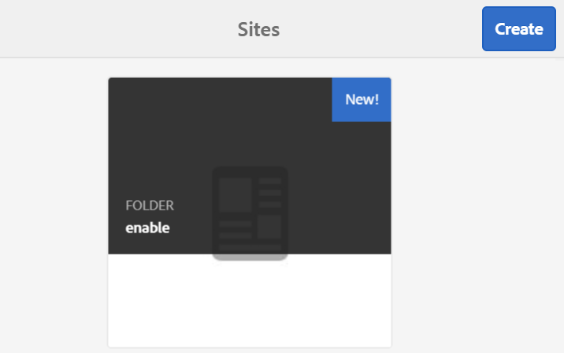

# Creación de un nuevo sitio de la comunidad para su habilitación {#author-a-new-community-site-for-enablement}

## Crear sitio de comunidad {#create-community-site}

[Creación de sitios de comunidad](/help/communities/sites-console.md) emplea un asistente que le guía a través de los pasos para crear un sitio de comunidad. Es posible pasar a la `Next` paso o `Back` hasta el paso anterior antes de comprometer el sitio en el paso final.

Para empezar a crear un nuevo sitio de comunidad:

Al usar la variable [instancia de autor](https://localhost:4502/)

* Inicie sesión con privilegios de administrador y vaya a **[!UICONTROL Comunidades]** > **[!UICONTROL Sitios]**.

* Seleccione **Crear**.

### Paso 1 : Plantilla del sitio {#step-site-template}

En el **Plantilla del sitio** , introduzca un título, una descripción, el nombre de la URL y seleccione una plantilla de sitio de la comunidad, por ejemplo:

* **Título del sitio de la comunidad**: `Enablement Tutorial`.

* **Descripción del sitio de la comunidad**: `A site for enabling the community to learn.`

* **Raíz del sitio de la comunidad**: (deje en blanco para la raíz predeterminada `/content/sites`)

* **Configuraciones de nube**: (deje en blanco si no se especifica ninguna configuración de nube) proporcione la ruta a las configuraciones de nube especificadas.
* **Idioma de base del sitio de la comunidad**: (deje intacto para el idioma único: Inglés) utilice la lista desplegable para elegir una *o más* idiomas básicos de los idiomas disponibles: alemán, italiano, francés, japonés, español, portugués (Brasil), chino (tradicional) y chino (simplificado). Se creará un sitio de comunidad para cada idioma agregado y existirá en la misma carpeta de sitio siguiendo las prácticas recomendadas descritas en [Traducción de contenido para sitios multilingües](/help/sites-administering/translation.md). La página raíz de cada sitio contendrá una página secundaria denominada por el código de idioma de uno de los idiomas seleccionados, como &quot;en&quot; para inglés o &quot;fr&quot; para francés.

* **Nombre del sitio de la comunidad**: `enable`

   * La dirección URL inicial se muestra debajo del nombre del sitio de la comunidad
   * Para una URL válida, añada un código de idioma base + &quot;.html&quot;
      *Por ejemplo*, https://localhost:4502/content/sites/ `enable/en.html`

* **Plantilla del sitio de referencia**: menú desplegable para elegir `Reference Structured Learning Site Template`

Seleccione **Siguiente**.

### Paso 2 : Diseño {#step-design}

El paso Diseño se presenta en dos secciones para seleccionar el tema y el titular de la marca:

#### TEMA DEL SITIO DE LA COMUNIDAD {#community-site-theme}

Seleccione el estilo que desee aplicar a la plantilla. Cuando se selecciona, el tema se superpone con una marca de verificación.

#### MARCA DE SITIOS DE LA COMUNIDAD {#community-site-branding}

(Opcional) Cargue una imagen de banner para mostrarla en las páginas del sitio. El banner se fija en el borde izquierdo del explorador, entre el encabezado del sitio de la comunidad y el menú (vínculos de navegación). La altura del banner se recorta a 120 píxeles. No se puede cambiar el tamaño del banner para ajustarlo a la anchura del navegador y a la altura de 120 píxeles.

Seleccione **Siguiente**.

### Paso 3 : Configuración {#step-settings}

En el paso Configuración , antes de seleccionar `Next`, tenga en cuenta que hay siete secciones que proporcionan acceso a configuraciones que involucran administración de usuarios, etiquetado, funciones, moderación, análisis, traducción y habilitación.

#### ADMINISTRACIÓN DE USUARIOS {#user-management}

Se recomienda que [comunidades de habilitación](/help/communities/overview.md#enablement-community) ser privado.

Un sitio de la comunidad es privado cuando se deniega el acceso a visitantes anónimos del sitio, es posible que no se registre por sí mismo y que no utilice el inicio de sesión en redes sociales.

Asegúrese de que la mayoría de las casillas de verificación no estén seleccionadas para [Administración de usuarios](/help/communities/sites-console.md#user-management) :

* NO permitir que los visitantes del sitio se autoregresen.
* NO permitir que los visitantes anónimos del sitio vean el sitio.
* Opcional si permite o no la mensajería entre los miembros de la comunidad.
* NO permita el inicio de sesión con Facebook.
* NO permita el inicio de sesión con Twitter.

#### ETIQUETADO {#tagging}

Las etiquetas que se pueden aplicar al contenido de la comunidad se controlan seleccionando AEM áreas de nombres previamente definidas a través del [Consola de etiquetado](/help/sites-administering/tags.md#tagging-console) (como el [Área de nombres del tutorial](/help/communities/enablement-setup.md#create-tutorial-tags)).

Además, la selección de Áreas de nombres de etiquetas para el sitio de la comunidad limita la selección presentada al definir catálogos y recursos de habilitación. Consulte [Etiquetado de recursos de habilitación](/help/communities/tag-resources.md) para obtener información importante.

La búsqueda de áreas de nombres es sencilla mediante la búsqueda por tipo. Por ejemplo,

* Tipo `tut`
* Seleccione `Tutorial`

### FUNCIONES {#roles}

[Funciones de miembro de la comunidad](/help/communities/users.md) se asignan mediante la configuración de la sección Funciones .

Para permitir que un miembro de la comunidad (o grupo de miembros) experimente el sitio como administrador de la comunidad, utilice la búsqueda por adelantado y seleccione el nombre del miembro o grupo en las opciones de la lista desplegable.

Por ejemplo,

* Tipo `q`
* Select [Quinn Harper](/help/communities/enablement-setup.md#publishcreateenablementmembers)

>[!NOTE]
>
>[Servicio de túnel](/help/communities/deploy-communities.md#tunnel-service-on-author) permite seleccionar miembros y grupos que solo existen en el entorno de publicación.

#### MODERACIÓN {#moderation}

Acepte la configuración global predeterminada para [moderación](/help/communities/sites-console.md#moderation) contenido generado por el usuario (UGC).

#### ANALYTICS {#analytics}

En la lista desplegable, seleccione el marco de servicios de nube de Analytics configurado para este sitio de comunidad.

La selección vista en la captura de pantalla, `Communities`, es el ejemplo del marco de trabajo de [documentación de configuración.](/help/communities/analytics.md#aem-analytics-framework-configuration)

#### TRADUCCIÓN {#translation}

La variable [Configuración de traducción](/help/communities/sites-console.md#translation) especificar si se puede traducir o no UGC y en qué idioma, en caso afirmativo.

* Marque **Permitir traducción automática**
* Usar la configuración predeterminada

#### HABILITACIÓN {#enablement}

Para una comunidad de habilitación, es necesario identificar uno o más administradores de habilitación de la comunidad.

* **Administradores de habilitación**
(requerido) Miembros del 
`Community Enablement Managers` para administrar este sitio de la comunidad.

   * Tipo `s`
   * Seleccione `Sirius Nilson`

* **ID de organización de Marketing Cloud**
(opcional) El ID de una cuenta de Adobe Analytics que es necesario para [Video Heartbeat Analytics](/help/communities/analytics.md#video-heartbeat-analytics) en los informes de habilitación.

Seleccione **Siguiente**.

### Paso 4 : Crear sitio de la comunidad {#step-create-community-site}

Seleccione **Crear.**

Cuando el proceso termina, la carpeta del nuevo sitio se muestra en la consola Comunidades > Sitios .

### Publicar el nuevo sitio de la comunidad {#publish-the-new-community-site}

El sitio creado debe administrarse desde la consola Comunidades - Sitios , la misma consola desde la que se pueden crear sitios nuevos.

Después de seleccionar la carpeta del sitio de la comunidad, pase el ratón sobre el icono del sitio para que aparezcan cuatro iconos de acción:

Al seleccionar el icono de elipses (icono Más acciones ), aparecen las opciones Exportar sitio y Eliminar sitio .

De izquierda a derecha se encuentran:

* **Abrir sitio**

   Seleccione el icono de lápiz para abrir el sitio de la comunidad en modo de edición de autor, añadir o configurar componentes de página.

* **Editar sitio**

   Seleccione el icono de propiedades para abrir el sitio de la comunidad y modificar sus propiedades, como el título, o para cambiar el tema.

* **Publicar sitio**

   Seleccione el icono del mundo para publicar el sitio de la comunidad (a localhost:4503 de forma predeterminada).

* **Exportar sitio**

   Seleccione el icono de exportación para crear un paquete del sitio de la comunidad que esté almacenado en [gestor de paquetes](/help/sites-administering/package-manager.md) y descargado.
Tenga en cuenta que UGC no se incluye en el paquete del sitio.

* **Eliminar sitio**

   Para eliminar el sitio de la comunidad, seleccione el icono Eliminar sitio que aparece al pasar el ratón por encima del sitio en la Consola de sitio de Communities. Esta acción elimina todos los elementos asociados con el sitio, como UGC, grupos de usuarios, activos y registros de base de datos.

   

#### Seleccione Publicar {#select-publish}

Seleccione el icono del mundo para publicar el sitio de la comunidad.

Habrá una indicación de que el sitio se publicó.

## Usuarios y grupos de usuarios de la comunidad {#community-users-user-groups}

### Aviso sobre nuevos grupos de usuarios de la comunidad {#notice-new-community-user-groups}

Junto con el nuevo sitio de la comunidad, se crean nuevos grupos de usuarios que tienen los permisos adecuados establecidos para diversas funciones administrativas. Para obtener más información, visite [Grupos de usuarios para sitios de la comunidad](/help/communities/users.md#usergroupsforcommunitysites).

Para este nuevo sitio de comunidad, dado el nombre de sitio &quot;habilitar&quot; en el paso 1, los nuevos grupos de usuarios que existen en el entorno de publicación pueden verse desde el [Consola Miembros y grupos de comunidades](/help/communities/members.md#groups-console):

### Asignar miembros a un grupo de miembros de habilitación de la comunidad {#assign-members-to-community-enable-members-group}

En el autor, con el servicio de túnel habilitado, es posible asignar la variable [usuarios creados durante la configuración inicial](/help/communities/enablement-setup.md#publishcreateenablementmembers) al grupo de miembros de la comunidad para el sitio de la comunidad recién creado.

Mediante la consola Grupos de la comunidad, los miembros se pueden agregar individualmente o mediante la pertenencia a un grupo.

En este ejemplo, el grupo `Community Ski Class` se añade como miembro del grupo `Community Enable Members` así como miembro `Quinn Harper`.

* Vaya a **Comunidades, grupos** consola
* Select *Comunidad Habilitar miembros* grupo
* Introducir &#39;ski&#39; en el **Agregar miembros al grupo** cuadro de búsqueda
* Select *Clase Community Ski* (grupo de estudiantes)
* Escriba &quot;quinn&quot; en el cuadro de búsqueda
* Select *Quinn Harper* (habilitar contacto de recursos)

* Seleccione **Guardar**

## Configuraciones en Publicación {#configurations-on-publish}

`https://localhost:4503/content/sites/enable/en.html {#http-localhost-content-sites-enable-en-html}`

### Configurar para error de autenticación {#configure-for-authentication-error}

Una vez configurado un sitio y presionado para publicarlo, [configurar asignación de inicio de sesión](/help/communities/sites-console.md#configure-for-authentication-error) ( `Adobe Granite Login Selector Authentication Handler`) en la instancia de publicación. La ventaja es que cuando las credenciales de inicio de sesión no se especifican correctamente, el error de autenticación vuelve a mostrar la página de inicio de sesión del sitio de la comunidad con un mensaje de error.

Agregue un `Login Page Mapping` como:

* `/content/sites/enable/en/signin:/content/sites/enable/en`

### (Opcional) Cambiar la página principal predeterminada {#optional-change-the-default-home-page}

Cuando se trabaja con el sitio de publicación con fines de demostración, puede ser útil cambiar la página principal predeterminada al nuevo sitio.

Para ello, es necesario utilizar [CRX|DE](https://localhost:4503/crx/de) Lite para editar el [asignación de recursos](/help/sites-deploying/resource-mapping.md) al publicar.

Para empezar:

1. En la publicación, acceda a CRXDE e inicie sesión con privilegios de administrador

   * Por ejemplo, vaya a [https://localhost:4503/crx/de](https://localhost:4503/crx/de) e inicie sesión con `admin/admin`

1. En el explorador del proyecto, expanda `/etc/map`
1. Seleccione el `http` node

   * Select **Crear nodo**

      * **Nombre** localhost.4503

         (do *not* use &#39;:&#39;)

      * **Tipo** [sling:Asignación](https://sling.apache.org/documentation/the-sling-engine/mappings-for-resource-resolution.html)

1. Con `localhost.4503` nodo seleccionado

   * Agregar propiedad

      * **Nombre** sling:match
      * **Tipo** Cadena
      * **Valor** localhost.4503/$

   (debe terminar con &#39;$&#39; char)

   * Agregar propiedad

      * **Nombre** sling:internalRedirect
      * **Tipo** Cadena
      * **Valor** /content/sites/enable/en.html

1. Select **Guardar todo**
1. (Opcional) Eliminar el historial de navegación
1. Vaya a https://localhost:4503/

   * Llegue a https://localhost:4503/content/sites/enable/en.html

>[!NOTE]
>
>Para desactivarlo, simplemente anteponga el `sling:match` valor de propiedad con una &quot;x&quot; - `xlocalhost.4503/$` - y **Guardar todo**.

#### Solución de problemas: Error al guardar el mapa {#troubleshooting-error-saving-map}

Si no puede guardar los cambios, asegúrese de que el nombre del nodo sea `localhost.4503`, con un separador de &quot;puntos&quot;, y no `localhost:4503` con un separador de &quot;dos puntos&quot;, como `localhost` no es un prefijo de espacio de nombres válido.

#### Solución de problemas: No se puede redirigir {#troubleshooting-fail-to-redirect}

El **$**&#39; al final de la expresión regular `sling:match` es crucial, por lo que solo `https://localhost:4503/` está asignado, de lo contrario el valor de redireccionamiento se antepone a cualquier ruta que pueda existir después de server:port en la dirección URL. Por lo tanto, cuando AEM intenta redirigir a la página de inicio de sesión, falla.

## Modificación del sitio de la comunidad {#modifying-the-community-site}

Una vez creado el sitio por primera vez, los autores pueden usar la variable [Icono Abrir sitio](/help/communities/sites-console.md#authoring-site-content) para realizar actividades de creación de AEM estándar.

Además, los administradores pueden usar la variable [Icono Editar sitio](/help/communities/sites-console.md#modifying-site-properties) para modificar las propiedades del sitio, como el título.

Después de cualquier modificación, recuerde **Guardar** y re-**Publicación** el sitio.

>[!NOTE]
>
>Si no está familiarizado con AEM, consulte la documentación de [tratamiento básico](/help/sites-authoring/basic-handling.md) y [guía rápida para la creación de páginas](/help/sites-authoring/qg-page-authoring.md).

### Agregar un catálogo {#add-a-catalog}

La plantilla de sitio de la comunidad elegida para este sitio de la comunidad debe contener la función de catálogo.

Si no es así, la función de catálogo se puede añadir fácilmente. Esto permitiría a otros miembros de la comunidad, no asignados a recursos de habilitación o a una ruta de aprendizaje, seleccionar recursos de habilitación de un catálogo.

Si la estructura del sitio ya contiene la función de catálogo, se puede cambiar su Título.

Para modificar la estructura del sitio, vaya a **[!UICONTROL Comunidades]** > **[!UICONTROL Sitios]** consola, abra la `enable` y seleccione **Editar sitio** para acceder a las propiedades de `Enablement Tutorial`.

Seleccione el panel ESTRUCTURA para añadir un catálogo o modificar un catálogo existente :

* **Título**: `Ski Catalog`

* **URL**: `catalog`

* **Seleccionar todos los espacios de nombres**: deje como predeterminado.

* Seleccione **Guardar**.

Utilice el icono Posición para mover la función Catálogo a la segunda posición, después de Asignaciones.

Select **Guardar** en la esquina superior derecha para guardar los cambios en el sitio de la comunidad.

Luego re-**Publicación** el sitio.
