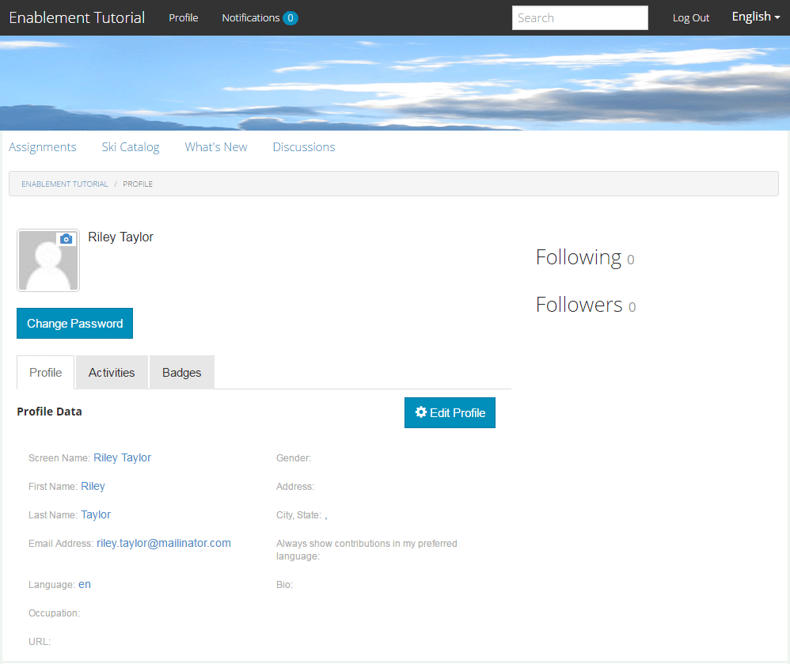

# Experimente el sitio publicado {#experience-the-published-site}

**[⇐ Crear y asignar recursos de habilitación](resource.md)**

## Examinar el nuevo sitio al publicar {#browse-to-new-site-on-publish}

Ahora que se han publicado el sitio de la comunidad recién creado y sus recursos de habilitación y ruta de aprendizaje, es posible experimentar el sitio Tutorial de habilitación.

Comience por navegar hasta la URL mostrada al crear el sitio, pero en el servidor de publicación, por ejemplo,

* URL del autor = [http://localhost:4502/content/sites/enable/en.html](http://localhost:4502/content/sites/enable/en.html)
* URL de publicación = [http://localhost:4503/content/sites/enable/en.html](http://localhost:4503/content/sites/enable/en.html)

Si la variable [se estableció la página principal predeterminada](enablement-create-site.md#changethedefaulthomepage), luego simplemente navegando a [http://localhost:4503/](http://localhost:4503/) debería iniciar el sitio.

Al llegar por primera vez al sitio publicado, el visitante del sitio no suele haber iniciado sesión y es anónimo.

**http://localhost:4503/content/sites/enable/en.html**

## Visitante anónimo del sitio {#anonymous-site-visitor}

Al visitante anónimo del sitio se le presenta inmediatamente la página de inicio de sesión de este sitio de comunidad de habilitación privada. Tenga en cuenta que no hay opción de registrarse automáticamente ni de iniciar sesión con Facebook o Twitter.

Observe que esta página de inicio muestra cuatro elementos de menú: `Assignments, Ski Catalog, What's New` y `Discussions`, pero no se puede alcanzar ninguno sin iniciar sesión.

>[!NOTE]
>
>Es posible conceder acceso anónimo a un sitio de habilitación sin permitir que los visitantes del sitio se registren automáticamente.
>
>Si un recurso de habilitación está establecido en `show in catalog` y `allow anonymous access`Sin embargo, los visitantes anónimos del sitio podrán ver los recursos en el catálogo.

### Impedir el acceso anónimo en JCR {#prevent-anonymous-access-on-jcr}

Sin embargo, una limitación conocida expone el contenido del sitio de la comunidad a visitantes anónimos a través del contenido jcr y json **[!UICONTROL permitir acceso anónimo]** está deshabilitado para el contenido del sitio. Sin embargo, este comportamiento se puede controlar mediante las restricciones de Sling como solución alternativa.

Para proteger el contenido del sitio de su comunidad del acceso de usuarios anónimos a través del contenido jcr y json , siga estos pasos:

1. AEM En la instancia de autor de la, vaya a https://&lt;host>:&lt;port>/editor.html/content/site/&lt;sitename>.html.

   >[!NOTE]
   >
   >No vaya al sitio localizado.

1. Ir a **[!UICONTROL Propiedades de página]**.

   

1. Ir a **[!UICONTROL Avanzadas]** pestaña.
1. Activar **[!UICONTROL Requisito de autenticación]**.

   

1. Añada la ruta de la página de inicio de sesión. Por ejemplo, `/content/......./GetStarted`.
1. Publique la página.

## Miembro inscrito {#enrolled-member}

Esta experiencia depende de los usuarios de `Riley Taylor` y `Sidney Croft` ser [created](enablement-setup.md#publishcreateenablementmembers) y [asignado](resource.md#settings) a la *Clases de esquí* ruta de aprendizaje a través de su pertenencia al *Clase de esquí comunitario* grupo.

Inicie sesión con

* `Username: riley`
* `Password: password`

Si el perfil de usuario no se creó mediante el registro automático, la primera vez que un miembro inicia sesión se muestra la página Perfil para que pueda verificarlo y modificarlo según sea necesario.

La próxima vez que el miembro inicie sesión, se mostrará la página de inicio, identificada por el primer elemento de menú.

### Asignaciones {#assignments}

En la página Asignaciones se muestran al miembro todas las rutas de aprendizaje y los recursos de habilitación asignados específicamente a él.

Cada asignación proporciona información básica sobre lo siguiente:

* El tipo de asignación
* Si se trata de una nueva asignación
* El nombre
* Detalles relevantes para el tipo de asignación
* Contacto, experto y autor de la asignación (si se proporciona)

El tipo de Asignación se indica mediante un icono en la esquina superior izquierda de la tarjeta. La imagen de una carretera es para una ruta de aprendizaje con el número de recursos de habilitación incluidos.

Seleccionar *Clases de esquí* mostrará los dos recursos de habilitación a los que hace referencia la ruta de aprendizaje.

Seleccionar *Lección de esquí 1* abrirá la página de detalles del recurso de habilitación.

Desde la página de detalles, el miembro puede aprender, [clasificar](rating.md) la lección y añada [comentarios](comments.md). Cualquier actividad de miembro se reflejará en la sección Novedades del sitio.

Las interacciones con el recurso de habilitación se anotarán en la sección Informe accesible en el entorno de creación.

### Catálogo de esquí {#ski-catalog}

La página Catálogo de esquí es el catálogo de recursos de habilitación etiquetados con etiquetas de `Tutorial` namespace. Los dos *Lección de esquí* Los recursos de están etiquetados con `Skiing` etiqueta, de modo que si alguna etiqueta que no sea `All` o `Tutorial: Sports / Skiing` está seleccionado, no se muestra nada.

Cuando a un miembro no se le han asignado recursos de habilitación, ya sea directamente o a través de una ruta de aprendizaje, es posible interactuar con recursos de habilitación ubicados dentro de un catálogo y proporcionar comentarios a través de comentarios y clasificaciones.

### Discusiones {#discussions}

Además de calificar y comentar los recursos de habilitación ([cuando está habilitado](enablement-create-site.md#step33asettings)), la plantilla del sitio de la comunidad desde la que `Enablement Tutorial` se ha creado incluye el [función de foro](functions.md#forum-function) (el título es `Discussions)`.

Seleccione el `Discussions`vincular y publicar un tema.

Cierre la sesión e inicie sesión como Sidney Croft (sidney / contraseña) y responda a la pregunta, así como siga el tema.

Tenga en cuenta que, además de la moderación en línea, hay opciones para compartir el tema en los medios sociales o para enviarlo por correo electrónico.

### Novedades {#what-s-new}

El `What's New` elemento de menú es el título dado a [función de flujo de actividad](functions.md#activity-stream-function) en la estructura de este sitio de la comunidad.

Aún con la sesión iniciada como Sidney, seleccione la `What's New` para mostrar la actividad.

## Miembro de comunidad de confianza {#trusted-community-member}

Esta experiencia da por hecho ` [Quinn Harper](enablement-setup.md#publishcreateenablementmembers)` se le asignaron las funciones de [moderador](enablement-create-site.md#moderation) y [contacto de recursos](resource.md#settings).

Inicie sesión con

* `Username: quinn`
* `Password: password`

Una vez que haya iniciado sesión, observe que hay un nuevo elemento de menú, `Administration`, que aparece porque el miembro ha recibido la función de moderador.

La página de inicio se identifica con el primer elemento de menú, Asignaciones. Quinn es el moderador y el contacto del recurso de habilitación y no se ha inscrito en ningún recurso de habilitación ni en ninguna ruta de aprendizaje, por lo que no hay nada que mostrar.

### Administración {#administration}

Lo que hay es actividad de los dos alumnos, `Riley Taylor` y `Sidney Croft`. Al seleccionar la variable `Administration` para acceder a la consola de moderación, Quinn puede utilizar el [consola de moderación masiva](moderation.md) para moderar sus publicaciones.

Al seleccionar el icono del panel lateral, se alternan y abren los filtros utilizados para buscar contenido de la comunidad.

Al pasar el ratón por encima de una tarjeta de comentario, se muestran acciones de moderación.

## Informes sobre autor {#reports-on-author}

Existen dos formas de acceder a la creación de informes sobre los alumnos y los recursos de habilitación.

En Autor, vaya a **Comunidades, [Consola Recursos](resources.md)**, donde se administran los recursos de habilitación y después de seleccionar un sitio de comunidad, es posible generar informes para

* Todos los recursos de habilitación y rutas de aprendizaje
* Un recurso de habilitación o una ruta de aprendizaje específicos

Vaya a **Comunidades, [Consola Informes](reports.md)** y generar informes de acuerdo con:

* Asignaciones a recursos de habilitación y rutas de aprendizaje
* Publica en un sitio de la comunidad durante un período específico
* Vistas (visitas al sitio) de un sitio de la comunidad durante un período específico

* Las publicaciones y las vistas pueden estar vinculadas a todo el contenido o a un contenido específico:

   * Foro
   * Tema de foro
   * P y R
   * Pregunta de P y R
   * Blog
   * Artículo de blog
   * Calendario
   * Evento de calendario

### Consola de recursos {#resources-console}

Con un poco de actividad e interacción con los recursos en la publicación, vale la pena echar un vistazo a la visualización de los informes del autor.

* En autor, inicie sesión con privilegios administrativos.
* Vaya del menú principal a **[!UICONTROL Communities]** > **[!UICONTROL Recursos]**.
* Seleccione el `Enablement Tutorial` sitio.
* Seleccione el `Report` para obtener un resumen de todos los recursos.
* Seleccione un recurso y, a continuación, el `Report` para un informe sobre ese recurso.

Tenga en cuenta que es probable que sea demasiado pronto para mostrar los datos de Adobe Analytics, que puede tardar entre 1 y 12 horas en aparecer. Sin embargo, los informes básicos de SCORM ya están disponibles.

#### Informe de recursos de lecciones de esquí {#ski-lessons-resource-report}

#### Informe de usuario de lecciones de esquí {#ski-lessons-user-report}

* Seleccionar **[!UICONTROL Comunidades > Recursos]**

* Abrir tarjeta `Enablement Tutorial`
* Abrir tarjeta `Ski Lessons`
* Seleccione `Report > User Report`

### Consola Informes {#reports-console}

La consola Informes permite generar informes sobre

* **Asignaciones** para cualquier sitio de la comunidad de habilitación
* **Vistas** para cualquier sitio de la comunidad
* **Publicaciones** para cualquier sitio de la comunidad

Para informes sobre asignaciones:

* En autor, inicie sesión con privilegios administrativos.
* Vaya a **[!UICONTROL Communities]** > **[!UICONTROL Informes]** > **[!UICONTROL Informe de asignaciones]**.
* Seleccione una **[!UICONTROL Sitio]** en el menú desplegable (seleccione `Enablement Tutorial`).

* Seleccionar **[!UICONTROL Grupo]** (seleccione `Community Ski Class`)

* Seleccione un **[!UICONTROL Asignación]** (seleccione `Ski Lessons`)

* Seleccionar **[!UICONTROL Generar]**

Para informes sobre vistas:

* En autor, inicie sesión con privilegios administrativos.
* Vaya a **[!UICONTROL Communities]** > **[!UICONTROL Informes]** > **[!UICONTROL Informe de vistas]**.
* Seleccione una **Sitio** en el menú desplegable (seleccione `Enablement Tutorial`).

* Seleccionar **[!UICONTROL Tipo de contenido]** (seleccione `all`).

* Seleccione una **[!UICONTROL intervalo de fecha]** (seleccione `Last 7 days`).

* Seleccionar **[!UICONTROL Generar]**.

**[⇐ Crear y asignar recursos de habilitación](resource.md)**
