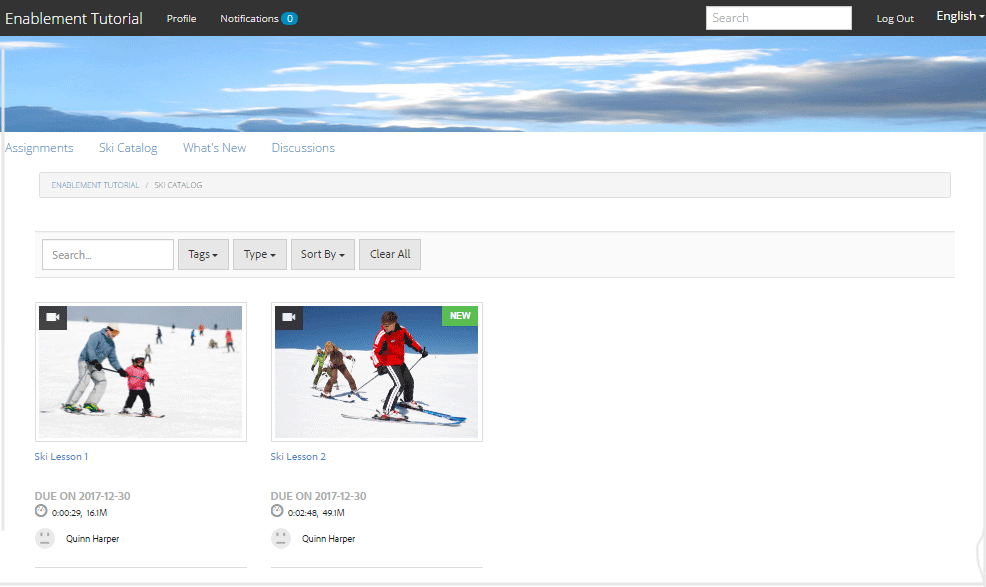

# Experimente el sitio publicado {#experience-the-published-site}

**[⇐ Crear y asignar recursos de habilitación](resource.md)**

## Buscar nuevo sitio en la publicación {#browse-to-new-site-on-publish}

Ahora que el sitio de la comunidad recién creado y sus recursos de habilitación y ruta de aprendizaje han sido publicados, es posible experimentar el sitio de Tutorial de Habilitación.

Comience navegando hasta la dirección URL que se muestra al crear el sitio, pero en el servidor de publicación, p. ej.

* URL de autor = [http://localhost:4502/content/sites/enable/en.html](http://localhost:4502/content/sites/enable/en.html)
* Publicar URL = [http://localhost:4503/content/sites/enable/en.html](http://localhost:4503/content/sites/enable/en.html)

Si la [página de inicio predeterminada se configuró](enablement-create-site.md#changethedefaulthomepage), simplemente navegando a [http://localhost:4503/](http://localhost:4503/) debe iniciar el sitio.

Al llegar por primera vez al sitio publicado, el visitante del sitio no suele haber iniciado sesión y sería anónimo.

**http://localhost:4503/content/sites/enable/en.html**

## Visitante del sitio anónimo {#anonymous-site-visitor}

Un visitante anónimo del sitio se presenta inmediatamente con la página de inicio de sesión de este sitio de comunidad de habilitación privada. Tenga en cuenta que no hay opción de registrarse por sí mismo ni de iniciar sesión en Facebook o Twitter.

Observe que esta página de inicio muestra cuatro elementos de menú: `Assignments, Ski Catalog, What's New` y `Discussions`, pero no se puede llegar a ninguno sin iniciar sesión.

>[!NOTE]
>
>Es posible otorgar acceso anónimo a un sitio de habilitación sin permitir que los visitantes del sitio se autoricen.
>
>Si un recurso de habilitación se establece en `show in catalog` y `allow anonymous access`, será posible que visitantes anónimos del sitio realicen vistas en los recursos del catálogo.

### Impedir el acceso anónimo a JCR {#prevent-anonymous-access-on-jcr}

Una limitación conocida expone el contenido del sitio de la comunidad a visitantes anónimos a través del contenido jcr y json, aunque **[!UICONTROL permitir acceso anónimo]** está deshabilitado para el contenido del sitio. Sin embargo, este comportamiento se puede controlar mediante restricciones de Sling como solución alternativa.

Para proteger el contenido del sitio de la comunidad del acceso de usuarios anónimos a través del contenido jcr y json, siga estos pasos:

1. En AEM instancia de autor, vaya a https://&lt;host>:&lt;puerto>/editor.html/content/site/&lt;nombre de sitio>.html.

   >[!NOTE]
   >
   >No vaya al sitio localizado.

1. Vaya a **[!UICONTROL Propiedades de la página]**.

   

1. Vaya a la ficha **[!UICONTROL Avanzado]**.
1. Habilite **[!UICONTROL Requisito de autenticación]**.

   

1. Añada la ruta de la página de inicio de sesión. Por ejemplo, `/content/......./GetStarted`.
1. Publique la página.

## Miembro inscrito {#enrolled-member}

Esta experiencia depende de que los usuarios `Riley Taylor` y `Sidney Croft` se [creen](enablement-setup.md#publishcreateenablementmembers) y [asignen](resource.md#settings) a la ruta de aprendizaje *Ski Lessons* mediante su pertenencia al grupo *Community Ski Class*.

Iniciar sesión con

* `Username: riley`
* `Password: password`

Si el perfil de usuario no se creó mediante el registro propio, la primera vez que un miembro inicia sesión, se muestra su página de Perfil para que pueda verificarla y modificarla según sea necesario.

La próxima vez que el miembro inicie sesión, se mostrará la página de inicio, identificada por el primer elemento de menú.

### Asignaciones {#assignments}

La página Asignaciones es donde se muestra al miembro todas las rutas de aprendizaje y todos los recursos de habilitación asignados específicamente a ellos.

Cada asignación proporciona información básica sobre:

* El tipo de asignación
* Si es una nueva asignación
* El nombre
* Detalles pertinentes para el tipo de cesión
* Contacto de asignación, experto y autor (si se proporciona)

El tipo de asignación se indica con un icono en la esquina superior izquierda de la tarjeta. La imagen de una carretera es para un camino de aprendizaje con el número de recursos de habilitación incluidos.

Al seleccionar *Clases de esquí* se mostrarán los dos recursos de habilitación a los que hace referencia la ruta de aprendizaje.

Al seleccionar *Ski Lesson 1* se abrirá la página de detalles del recurso de habilitación.

Desde la página de detalles, el miembro puede aprender [clasificar](rating.md) la lección y agregar [comentarios](comments.md). Cualquier actividad de miembro se verá reflejada en la sección Novedades del sitio.

Las interacciones con el recurso de habilitación se anotarán en la sección Informe accesible en el entorno del autor.

### Catálogo de esquí {#ski-catalog}

La página Catálogo de esquí es el catálogo de recursos de habilitación etiquetados con etiquetas de la Área de nombres `Tutorial`. Los dos *recursos de la lección de esquí* están etiquetados con la etiqueta `Skiing`, de manera que si se selecciona cualquier etiqueta que no sea `All` o `Tutorial: Sports / Skiing`, no se muestra nada.

Cuando a un miembro no se le han asignado recursos de habilitación, ya sea directamente o a través de una ruta de aprendizaje, es posible interactuar con los recursos de habilitación ubicados dentro de un catálogo y proporcionar comentarios a través de comentarios y clasificaciones.

### Discusiones {#discussions}

Además de valorar y comentar los recursos de habilitación ([cuando se habilita](enablement-create-site.md#step33asettings)), la plantilla de sitio de comunidad desde la que se creó `Enablement Tutorial` incluye la [función de foro](functions.md#forum-function) (el título es `Discussions)`.

Seleccione el vínculo `Discussions`y anuncie un tema.

Cierre la sesión e inicie sesión como Sidney Croft (cliente/contraseña) y responda a la pregunta, así como siga el tema.

Observe que, además de moderación en línea, hay opciones para compartir el tema en medios sociales o para enviarlo por correo electrónico.

### Novedades {#what-s-new}

El elemento de menú `What's New` es el título dado a la función [de flujo de actividad](functions.md#activity-stream-function) en la estructura de este sitio de comunidad.

Todavía ha iniciado sesión como Sidney, seleccione el vínculo `What's New` para mostrar la actividad.

## Miembro de la comunidad de confianza {#trusted-community-member}

Esta experiencia supone que ` [Quinn Harper](enablement-setup.md#publishcreateenablementmembers)` se asignaron las funciones de [moderador](enablement-create-site.md#moderation) y [contacto de recursos](resource.md#settings).

Iniciar sesión con

* `Username: quinn`
* `Password: password`

Una vez iniciada la sesión, observe que hay un nuevo elemento de menú, `Administration`, que aparece porque al miembro se le dio la función de moderador.

La página de inicio se identifica mediante el primer elemento de menú, Asignaciones. Quinn es el contacto de recursos de moderador y habilitación y no se ha matriculado en ningún recurso de habilitación o ruta de aprendizaje, por lo que no hay nada que mostrar.

### Administración {#administration}

Lo que hay es la actividad de los dos alumnos, `Riley Taylor` y `Sidney Croft`. Al seleccionar el vínculo `Administration` para acceder a la Consola de moderación, Quinn puede utilizar la [consola de moderación masiva](moderation.md) para moderar sus publicaciones.

Al seleccionar el icono del panel lateral, se abren los filtros utilizados para buscar contenido de la comunidad.

Al pasar el ratón por encima de una tarjeta de comentarios se muestran las acciones de moderación.

## Informes sobre el autor {#reports-on-author}

Existen dos formas de acceder al sistema de informes de los alumnos y a los recursos de activación.

En el autor, navegue a la **Consola de [Recursos](resources.md)**, donde se administran los recursos de habilitación, y después de seleccionar un sitio de comunidad, se pueden generar informes para

* Todos los recursos de habilitación y rutas de aprendizaje
* Un recurso de habilitación específico o una ruta de aprendizaje

Vaya a la consola **Communities, [Informes](reports.md)** y genere informes de acuerdo con:

* Asignaciones a recursos de habilitación y rutas de aprendizaje
* Anuncios en un sitio de comunidad durante un período específico
* Vistas (visitas al sitio) de un sitio de la comunidad durante un período específico

* Los anuncios y vistas pueden estar en todo el contenido o en contenido específico:

   * Foro
   * Tema de foro
   * P y R
   * Pregunta de P y R
   * Blog
   * Artículo de blog
   * Calendario
   * Evento de calendario

### Consola de recursos {#resources-console}

Con un poco de actividad e interacción con los recursos al publicar, vale la pena ver los informes sobre el autor.

* Al crear, inicie sesión con privilegios administrativos.
* Vaya del menú principal a **[!UICONTROL Comunidades]** > **[!UICONTROL Recursos]**.
* Seleccione el sitio `Enablement Tutorial`.
* Seleccione el icono `Report` para obtener un resumen de todos los recursos.
* Seleccione un recurso y, a continuación, el icono `Report` para un informe sobre ese recurso.

Tenga en cuenta que es muy probable que se muestren datos de Adobe Analytics, que pueden tardar de 1 a 12 horas en aparecer. Sin embargo, el sistema de informes SCORM básico ya está disponible.

#### Informe de recursos de lecciones de esquí {#ski-lessons-resource-report}

#### Informe del usuario de lecciones de esquí {#ski-lessons-user-report}

* Seleccione **[!UICONTROL Comunidades > Recursos]**

* Abrir tarjeta `Enablement Tutorial`
* Abrir tarjeta `Ski Lessons`
* Seleccione `Report > User Report`

### Consola de informes {#reports-console}

La consola Informes permite generar informes en

* **** Asignaciones para cualquier sitio de la comunidad de habilitación
* **** Vistas de cualquier sitio de la comunidad
* **** Publicaciones para cualquier sitio de comunidad

Para informes sobre asignaciones:

* Al crear, inicie sesión con privilegios administrativos.
* Vaya a **[!UICONTROL Comunidades]** > **[!UICONTROL Informes]** > **[!UICONTROL Informe Asignaciones]**.
* Seleccione un **[!UICONTROL Sitio]** en el menú desplegable (seleccione `Enablement Tutorial`).

* Seleccione **[!UICONTROL Grupo]** (seleccione `Community Ski Class`)

* Seleccione una **[!UICONTROL Asignación]** (seleccione `Ski Lessons`)

* Seleccione **[!UICONTROL Generar]**

Para informes sobre vistas:

* Al crear, inicie sesión con privilegios administrativos.
* Vaya a **[!UICONTROL Communities]** > **[!UICONTROL Reports]** > **[!UICONTROL Informe de Vistas]**.
* Seleccione un **Sitio** en el menú desplegable (seleccione `Enablement Tutorial`).

* Seleccione **[!UICONTROL Tipo de contenido]** (seleccione `all`).

* Seleccione un **[!UICONTROL intervalo de fechas]** (seleccione `Last 7 days`).

* Seleccione **[!UICONTROL Generar]**.

**[⇐ Crear y asignar recursos de habilitación](resource.md)**
