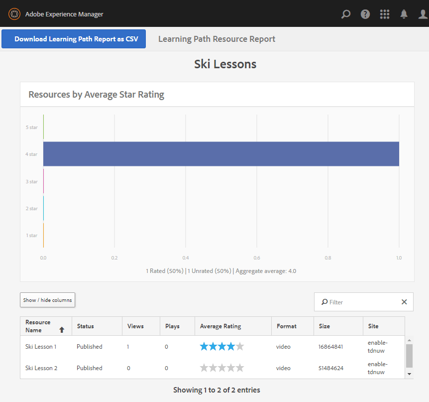

# Experiencia del sitio publicado {#experience-the-published-site}

**[⇐ Crear y asignar recursos de habilitación](resource.md)**

## Buscar nuevo sitio en la publicación {#browse-to-new-site-on-publish}

Ahora que el sitio de la comunidad recién creado y sus recursos de habilitación y ruta de aprendizaje han sido publicados, es posible experimentar el sitio Tutorial de Habilitación .

Para empezar, vaya a la dirección URL que se muestra al crear el sitio, pero en el servidor de publicación, por ejemplo

* URL del autor = [http://localhost:4502/content/sites/enable/en.html](http://localhost:4502/content/sites/enable/en.html)
* URL de publicación = [http://localhost:4503/content/sites/enable/en.html](http://localhost:4503/content/sites/enable/en.html)

Si la variable [se estableció la página principal predeterminada](enablement-create-site.md#changethedefaulthomepage), luego simplemente navegue hasta [http://localhost:4503/](http://localhost:4503/) debe iniciar el sitio.

Al llegar por primera vez al sitio publicado, el visitante del sitio no suele haber iniciado sesión y sería anónimo.

**http://localhost:4503/content/sites/enable/en.html**

## Visitante anónimo del sitio {#anonymous-site-visitor}

Un visitante anónimo del sitio se presenta inmediatamente con la página de inicio de sesión de este sitio de la comunidad de habilitación privada. Tenga en cuenta que no hay opción de registrarse por sí mismo ni de iniciar sesión con Facebook o Twitter.

Observe que esta página de inicio muestra cuatro elementos de menú: `Assignments, Ski Catalog, What's New` y `Discussions`, pero no se puede acceder a ninguno sin iniciar sesión.

>[!NOTE]
>
>Es posible conceder acceso anónimo a un sitio de habilitación sin permitir que los visitantes del sitio se registren por su cuenta.
>
>Si un recurso de habilitación está establecido en `show in catalog` y `allow anonymous access`, los visitantes anónimos del sitio podrán ver los recursos del catálogo.

### Impedir el acceso anónimo en JCR {#prevent-anonymous-access-on-jcr}

Una limitación conocida expone el contenido del sitio de la comunidad a visitantes anónimos a través del contenido jcr y json , aunque **[!UICONTROL permitir acceso anónimo]** está desactivado para el contenido del sitio. Sin embargo, este comportamiento se puede controlar mediante restricciones de Sling como solución.

Para proteger el contenido del sitio de la comunidad del acceso de usuarios anónimos a través del contenido jcr y json , siga estos pasos:

1. En AEM instancia de autor, vaya a https://&lt;host>:&lt;port>/editor.html/content/site/&lt;sitename>.html.

   >[!NOTE]
   >
   >No vaya al sitio localizado.

1. Vaya a **[!UICONTROL Propiedades de página]**.

   

1. Vaya a **[!UICONTROL Avanzadas]** pestaña .
1. Habilitar **[!UICONTROL Requisito de autenticación]**.

   

1. Añada la ruta de la página de inicio de sesión. Por ejemplo, `/content/......./GetStarted`.
1. Publique la página.

## Miembro inscrito {#enrolled-member}

Esta experiencia depende de los usuarios `Riley Taylor` y `Sidney Croft` being [created](enablement-setup.md#publishcreateenablementmembers) y [asignado](resource.md#settings) a *Lecciones de esquí* ruta de aprendizaje a través de su pertenencia a la *Clase Community Ski* grupo.

Inicie sesión con

* `Username: riley`
* `Password: password`

Si el perfil de usuario no se creó mediante el registro propio, la primera vez que un miembro inicia sesión, se muestra la página Perfil para que pueda verificarse y modificarse según sea necesario.

La próxima vez que el miembro inicie sesión, se mostrará la página principal, identificada por el primer elemento de menú.

### Asignaciones {#assignments}

La página Asignaciones es donde se muestra al miembro todas las rutas de aprendizaje y los recursos de habilitación asignados específicamente a ellos.

Cada asignación proporciona información básica sobre:

* Tipo de asignación
* Si es una nueva asignación
* El nombre
* Detalles pertinentes para el tipo de asignación
* Contacto de asignación, experto y autor (si se proporciona)

El tipo de Asignación se indica con un icono en la esquina superior izquierda de la tarjeta. La imagen de una carretera es para una ruta de aprendizaje con el número de recursos de habilitación incluidos.

Selección *Lecciones de esquí* mostrará los dos recursos de habilitación a los que hace referencia la ruta de aprendizaje.

Selección *Lección de esquí 1* abrirá la página de detalles del recurso de habilitación.

Desde la página de detalles, el miembro puede aprender, [rate](rating.md) la lección y añada [comentarios](comments.md). Cualquier actividad de miembro se reflejará en la sección Novedades del sitio.

Las interacciones con el recurso de habilitación se anotarán en la sección Informe accesible en el entorno de creación.

### Catálogo de Ski {#ski-catalog}

La página Catálogo de Esquí es el catálogo de recursos de habilitación etiquetados con etiquetas de la variable `Tutorial` espacio de nombres. Los dos *Lección de esquí* los recursos se etiquetan con la variable `Skiing` , de forma que si hay etiquetas que no sean `All` o `Tutorial: Sports / Skiing` está seleccionado, no se muestra nada.

Cuando a un miembro no se le han asignado recursos de habilitación, ya sea directamente o a través de una ruta de aprendizaje, es posible interactuar con recursos de habilitación ubicados dentro de un catálogo y proporcionar comentarios a través de comentarios y clasificaciones.

### Discusiones {#discussions}

Además de valorar y comentar los recursos de habilitación ([cuando esté activado](enablement-create-site.md#step33asettings)), la plantilla del sitio de la comunidad desde la que `Enablement Tutorial` se creó, incluye la variable [función del foro](functions.md#forum-function) (el título es `Discussions)`.

Seleccione el `Discussions`vincular y publicar un tema.

Cierre la sesión e inicie sesión como Sidney Croft (recorrido/contraseña) y responda a la pregunta, así como siga el tema.

Tenga en cuenta que, además de la moderación en línea, hay opciones para compartir el tema en medios sociales o para enviarlo por correo electrónico.

### Novedades {#what-s-new}

La variable `What's New` elemento de menú es el título, dado que el [función de flujo de actividad](functions.md#activity-stream-function) en la estructura de este sitio de la comunidad.

Aún ha iniciado sesión como Sidney, seleccione la `What's New` para mostrar la actividad.

## Miembro de la comunidad de confianza {#trusted-community-member}

Esta experiencia supone ` [Quinn Harper](enablement-setup.md#publishcreateenablementmembers)` se le asignaron las funciones de [moderador](enablement-create-site.md#moderation) y [contacto de recursos](resource.md#settings).

Inicie sesión con

* `Username: quinn`
* `Password: password`

Una vez que haya iniciado sesión, observe que hay un nuevo elemento de menú, `Administration`, que aparece porque al miembro se le dio la función de moderador.

La página principal se identifica mediante el primer elemento de menú, Asignaciones. Quinn es el contacto del recurso de moderación y habilitación y no se ha inscrito en ningún recurso de habilitación o ruta de aprendizaje, por lo que no hay nada que mostrar.

### Administración {#administration}

Lo que hay, es la actividad de los dos estudiantes, `Riley Taylor` y `Sidney Croft`. Seleccione la `Administration` vínculo para acceder a la consola de moderación, Quinn puede utilizar el [consola de moderación masiva](moderation.md) para moderar sus publicaciones.

Al seleccionar el icono del panel lateral, se pueden abrir los filtros utilizados para buscar contenido de la comunidad.

Al pasar el ratón por encima de una tarjeta de comentarios, se muestran las acciones de moderación.

## Informes sobre el autor {#reports-on-author}

Existen dos maneras de acceder a los informes sobre los estudiantes y a los recursos de habilitación.

En el autor, vaya a la **Comunidades, [Consola de recursos](resources.md)**, donde se administran los recursos de habilitación y después de seleccionar un sitio de comunidad, es posible generar informes para

* Todos los recursos de habilitación y rutas de aprendizaje
* Un recurso de habilitación específico o una ruta de aprendizaje

Vaya a la **Comunidades, [Consola de informes](reports.md)** y generar informes según:

* Asignaciones a recursos de habilitación y rutas de aprendizaje
* Anuncios en un sitio de la comunidad durante un período específico
* Vistas (visitas al sitio) de un sitio de la comunidad durante un período específico

* Los anuncios y las vistas pueden estar en todo el contenido o en contenido específico:

   * Foro
   * Tema de foro
   * P y R
   * Pregunta de P y R
   * Blog
   * Artículo de blog
   * Calendario
   * Evento de calendario

### Consola Recursos {#resources-console}

Con un poco de actividad e interacción con los recursos al publicar, vale la pena ver los informes del autor.

* En autor, inicie sesión con privilegios administrativos.
* Vaya del menú principal a **[!UICONTROL Comunidades]** > **[!UICONTROL Recursos]**.
* Seleccione el `Enablement Tutorial` sitio.
* Seleccione el `Report` para ver un resumen de todos los recursos.
* Seleccione un recurso y, a continuación, el `Report` para un informe sobre ese recurso.

Tenga en cuenta que es probable que sea demasiado pronto para mostrar datos de Adobe Analytics, que pueden tardar entre 1 y 12 horas en aparecer. Sin embargo, los informes básicos de SCORM ya están disponibles.

#### Informe de recursos de lecciones de esquí {#ski-lessons-resource-report}

#### Informe de usuario de lecciones de esquí {#ski-lessons-user-report}

* Select **[!UICONTROL Comunidades > Recursos]**

* Abrir tarjeta `Enablement Tutorial`
* Abrir tarjeta `Ski Lessons`
* Seleccione `Report > User Report`

### Consola Informes {#reports-console}

La consola Informes permite generar informes en

* **Asignaciones** para cualquier sitio de comunidad de habilitación
* **Vistas** para cualquier sitio de la comunidad
* **Anuncios** para cualquier sitio de la comunidad

Para informes sobre asignaciones:

* En autor, inicie sesión con privilegios administrativos.
* Vaya a **[!UICONTROL Comunidades]** > **[!UICONTROL Informes]** > **[!UICONTROL Informe de asignaciones]**.
* Seleccione un **[!UICONTROL Sitio]** en el menú desplegable (seleccione `Enablement Tutorial`).

* Select **[!UICONTROL Grupo]** (seleccione `Community Ski Class`)

* Seleccione un **[!UICONTROL Asignación]** (seleccione `Ski Lessons`)

* Select **[!UICONTROL Generar]**

Para informes sobre vistas:

* En autor, inicie sesión con privilegios administrativos.
* Vaya a **[!UICONTROL Comunidades]** > **[!UICONTROL Informes]** > **[!UICONTROL Informe de vistas]**.
* Seleccione un **Sitio** en el menú desplegable (seleccione `Enablement Tutorial`).

* Select **[!UICONTROL Tipo de contenido]** (seleccione `all`).

* Seleccione un **[!UICONTROL intervalo de fechas]** (seleccione `Last 7 days`).

* Select **[!UICONTROL Generar]**.

**[⇐ Crear y asignar recursos de habilitación](resource.md)**
