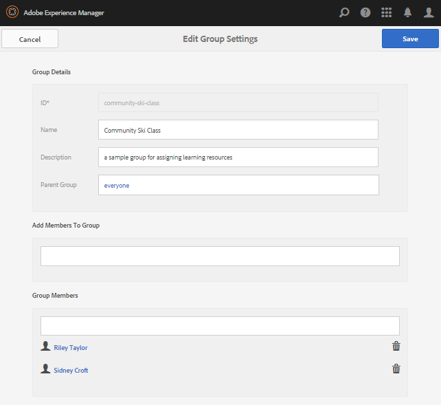

# Configuración inicial para la habilitación  {#initial-setup-for-enablement}

## Iniciar instancias de autor y publicación {#start-author-and-publish-instances}

Para fines de desarrollo y demostración, será necesario ejecutar una instancia de autor y otra de publicación.

AEM Seguir los pasos básicos [Primeros pasos](../../help/sites-deploying/deploy.md#getting-started) instrucciones que resultarán en

* Entorno de creación en [localhost:4502](http://localhost:4502/)
* Entorno de publicación en [localhost:4503](http://localhost:4503/)

Para AEM Communities,

* El entorno de creación es para:

   * Desarrollo de sitios, plantillas, componentes, recursos de habilitación y rutas de aprendizaje.
   * Asignación de miembros y grupos de miembros a recursos de habilitación y rutas de aprendizaje.
   * Generar informes sobre asignaciones, vistas y entradas.
   * Tareas administrativas y de configuración.

* El entorno de publicación es para:

   * Aprendizaje/formación basado en temas administrados por el administrador de habilitación.
   * Comentarios y calificación de recursos de habilitación y rutas de aprendizaje.
   * Póngase en contacto con los contactos de recursos.

>[!NOTE]
>
>AEM Si no está familiarizado con el uso de la, consulte la documentación de en [manipulación básica](../../help/sites-authoring/basic-handling.md) y una [guía rápida para la creación de páginas](../../help/sites-authoring/qg-page-authoring.md).

## Instalar la última versión de Communities {#install-latest-communities-release}

Este tutorial crea un [sitio de la comunidad de habilitación](overview.md#enablement-community). Para asegurarse de que está instalado el paquete de funciones más reciente, visite:

* [Últimas versiones](deploy-communities.md#latest-releases)

Para un tutorial que crea un [sitio de la comunidad de participación](overview.md#engagement-community), visite [Introducción a AEM Communities](getting-started.md).

## Configurar funciones de habilitación {#configure-enablement-features}

Para seguir este tutorial, es necesario instalar y [configurar habilitación](enablement.md), que requiere productos de terceros, como MySQL y FFmpeg.

## Configurar Analytics {#configure-analytics}

Cuándo [Adobe Analytics está configurado para el sitio de la comunidad](analytics.md), encontrará más información disponible en la [informes](reports.md) generado en recursos de habilitación y rutas de aprendizaje asignados a miembros de la comunidad (alumnos).

## Configurar correo electrónico para notificaciones {#configure-email-for-notifications}

La función de notificaciones, disponible de forma predeterminada para todos los sitios creados con `Communities Sites` La consola de, proporciona un canal de correo electrónico para las notificaciones.

Lo que es necesario es que el correo electrónico se configure correctamente para el sitio.

Consulte [Configurar correo electrónico](email.md).

## Activación del servicio de túnel {#enable-the-tunnel-service}

Al crear un sitio de comunidad en el entorno de creación, el servicio de túnel permite crear y administrar usuarios y grupos de usuarios registrados en el entorno de publicación (miembros), asignar funciones a miembros de la comunidad de confianza y asignar contenido a alumnos.

Para obtener más información, consulte [Administración de usuarios y grupos de usuarios](users.md).

Para obtener instrucciones sencillas sobre cómo habilitar el servicio de túnel, consulte [Servicio de túnel](deploy-communities.md#tunnel-service-on-author).

## Creación de etiquetas de tutorial {#create-tutorial-tags}

Cree etiquetas para utilizarlas en los tutoriales de participación y habilitación, utilizando el área de nombres de etiquetas de `Tutorial`.

Utilice el [Consola de etiquetado](../../help/sites-administering/tags.md#tagging-console) para crear las etiquetas siguientes:

* `Tutorial: Sports / Baseball`
* `Tutorial: Sports / Gymnastics`
* `Tutorial: Sports / Skiing`
* `Tutorial: Arts / Visual`
* `Tutorial: Arts / Auditory`
* `Tutorial: Arts / History`

A continuación, siga las instrucciones para:

1. [Definición de los permisos de etiquetas](../../help/sites-administering/tags.md#setting-tag-permissions)
1. [Publicación de las etiquetas](../../help/sites-administering/tags.md#publishing-tags)

Paquete de muestra de etiquetas creado para los Tutorials de introducción de AEM Communities

[Obtener archivo](assets/communities_tutorialtags-10.zip)

## Crear miembros y grupos de habilitación {#create-enablement-members-and-groups}

Para un sitio de comunidad de habilitación, los visitantes del sitio no deben poder [registrarse automáticamente ni utilizar el inicio de sesión en redes sociales](sites-console.md#user-management).

En su lugar, con la variable [servicio túnel](#enable-the-tunnel-service) activada, la variable [Consola Miembros](members.md) se utiliza para registrar nuevos miembros en el entorno de publicación.

En este tutorial, se crean tres miembros en el entorno de publicación. Dos miembros se convertirán en miembros de un grupo de usuarios asignado a una ruta de aprendizaje, mientras que el tercer miembro se convertirá en un contacto de recursos de habilitación.

Se crea un cuarto usuario en el entorno de creación y se le asignan las funciones de Administrador de comunidades y Administrador de habilitación de comunidades.

>[!NOTE]
>
>Estos miembros se crean antes de la creación del *Tutorial de habilitación* sitio de la comunidad.
>
>Si se crearan posteriormente, se podrían agregar como miembros del *Habilitación Grupo de miembros del tutorial* durante la creación del miembro.
>
>En su lugar, más tarde, lo serán [asignado al grupo de miembros](enablement-create-site.md#assignuserstocommunityenablemembersgroup).

### Riley Taylor - Inscrito {#riley-taylor-enrollee}

[Crear un miembro](members.md#create-new-member) que se añadirán a un grupo de alumnos: el grupo Community Ski Class.

* **ID**: riley
* **Correo electrónico**: riley.taylor@mailinator.com
* **Contraseña**: password
* **Confirmar contraseña**: contraseña
* **Nombre**: Riley
* **Apellidos**: Taylor

### Sidney Croft - Inscripción {#sidney-croft-enrollee}

[Crear un segundo miembro](members.md#create-new-member) que se agregarán al grupo Clase de esquí de la comunidad.

* **ID**: sidney
* **Correo electrónico**: sidney.croft@mailinator.com
* **Contraseña**: password
* **Confirmar contraseña**: contraseña
* **Nombre**: Sidney
* **Apellidos**: Croft

### Quinn Harper - Moderador y contacto de recursos de habilitación {#quinn-harper-enablement-resource-contact-and-moderator}

[Crear un miembro](members.md#create-new-member) que se agregarán al grupo de miembros del sitio de la comunidad una vez que se haya creado el sitio. Esta pertenencia permitirá asignar el miembro como la habilitación [Contacto de medios](resources.md#settings) cuando se crea un recurso de habilitación para el sitio.

* **ID**: quinn
* **Correo electrónico**: quinn.harper@mailinator.com
* **Contraseña**: password
* **Confirmar contraseña**: contraseña
* **Nombre**: Quinn
* **Apellidos**: Harper

### Añadir un grupo de usuarios: clase de esquí de la comunidad {#add-a-user-group-community-ski-class}

[Agregar un nuevo grupo](members.md#create-new-group) Clase de esquí comunitaria.

* **ID**: community-ski-class
* **Nombre**: Clase de esquí comunitario
* **Descripción**: un grupo de ejemplo para asignar recursos de habilitación
* **Añadir miembros al grupo** &#39;agregar&#39;:

   * arroyuelo
   * sidney

* Seleccione **[!UICONTROL Guardar]**

### Propiedades de la clase de esquí comunitario {#community-ski-class-properties}

>[!NOTE]
>
>Durante la creación del sitio de la comunidad, los miembros y grupos existentes pueden agregarse al grupo de miembros del sitio de la comunidad.

## Función de administrador de comunidad {#community-administrator-role}

Los miembros del grupo Administradores de la comunidad pueden crear sitios de la comunidad, administrar sitios, administrar miembros (pueden prohibir miembros de la comunidad) y moderar contenido.

### Crear usuario {#create-user}

Crear un usuario en *autor*, a quien se asigna la función de administrador de la comunidad:

* En la instancia de autor

   * Por ejemplo, [http://localhost:4502/](http://localhost:4503/)

* Iniciar sesión con privilegios de administrador

   * Por ejemplo, nombre de usuario &#39;admin&#39; / contraseña &#39;admin&#39;

* En la consola principal, vaya a **[!UICONTROL Herramientas]** > **[!UICONTROL Operaciones]** > **[!UICONTROL Seguridad]** > **[!UICONTROL Usuarios]**.
* Desde el **[!UICONTROL Editar]** menú, seleccione **[!UICONTROL Añadir usuario]**.

* En el `Create New User` diálogo entrar:

   * **ID&amp;ast;**: sirio
   * **Dirección de correo electrónico**: sirius.nilson@mailinator.com
   * **Contraseña&amp;ast;**: contraseña
   * **Confirmar contraseña&amp;ast;**: contraseña
   * **Nombre**: Sirio
   * **Apellidos&amp;ast;**: Nilson

### Asignar Sirius al grupo de administradores de la comunidad {#assign-sirius-to-community-administrators-group}

Desplácese hacia abajo hasta `Add User to Groups`:

* Escriba &quot;C&quot; para buscar

   * Seleccione `Community Administrators`
   * Seleccione `Community Enablement Managers`

* Seleccione **[!UICONTROL Guardar]**

