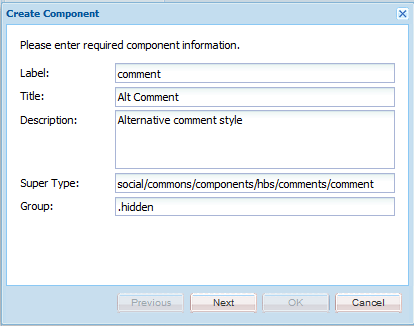

# Crear los componentes {#create-the-components}

El ejemplo de ampliación de componentes utiliza el sistema de comentarios, que en realidad está compuesto por dos componentes

* Comentarios: el sistema de comentarios que incluye el componente que se coloca en una página.
* Comentario: componente que captura una instancia de un comentario publicado.

Ambos componentes deben implementarse, especialmente si se personaliza el aspecto de un comentario publicado.

>[!NOTE]
>
>Solo se permite un sistema de comentarios por página del sitio.
>
>Muchas funciones de Comunidades ya incluyen un sistema de comentarios cuyo resourceType puede modificarse para hacer referencia al sistema de comentarios ampliado.

## Crear el componente Comentarios {#create-the-comments-component}

Estas direcciones especifican un valor **Grupo** distinto de `.hidden` para que el componente esté disponible desde el navegador de componentes (barra de tareas).

La eliminación del archivo JSP creado automáticamente se debe a que se utilizará el archivo HBS predeterminado.

1. Vaya a **CRXDE|Lite** ([http://localhost:4502/crx/de/index.jsp](http://localhost:4502/crx/de/index.jsp))

1. Cree una ubicación para las aplicaciones personalizadas:

   * Seleccione el nodo `/apps`

      * **Crear** carpeta con el nombre  **[!UICONTROL personalizado]**
   * Seleccione el nodo `/apps/custom`

      * **Crear** componentes con nombre de  **[!UICONTROL carpeta]**


1. Seleccione el nodo `/apps/custom/components`

   * **[!UICONTROL Crear > Componente...]**

      * **Etiqueta**:  *comentarios*
      * **Título**:  *Comentarios de Alt*
      * **Descripción**:  *Estilo de comentarios alternativos*
      * **Super Tipo**:  *social/commons/components/hbs/comments*
      * **Grupo**:  *Personalizado*
   * Seleccione **[!UICONTROL Siguiente]**
   * Seleccione **[!UICONTROL Siguiente]**
   * Seleccione **[!UICONTROL Siguiente]**
   * Seleccione **[!UICONTROL Aceptar]**


1. Expanda el nodo recién creado: `/apps/custom/components/comments`
1. Seleccione **[!UICONTROL Guardar todo]**
1. Haga clic con el botón derecho `comments.jsp`
1. Seleccione **[!UICONTROL Eliminar]**
1. Seleccione **[!UICONTROL Guardar todo]**


### Crear el componente de comentario secundario {#create-the-child-comment-component}

Estas direcciones establecen **Grupo** como `.hidden` ya que sólo el componente principal debe incluirse en una página.

La eliminación del archivo JSP creado automáticamente se debe a que se utilizará el archivo HBS predeterminado.

1. Navegue al nodo `/apps/custom/components/comments`
1. Haga clic con el botón secundario en el nodo

   * Seleccione **[!UICONTROL Crear]** > **[!UICONTROL Componente...]**

      * **Etiqueta**:  *comment*
      * **Título**:  *Comentario alternativo*
      * **Descripción**:  *Estilo de comentario alternativo*
      * **Super Tipo**:  *social/commons/components/hbs/comments/comment*
      * **Agrupar**: `*.hidden*`
   * Seleccione **[!UICONTROL Siguiente]**
   * Seleccione **[!UICONTROL Siguiente]**
   * Seleccione **[!UICONTROL Siguiente]**
   * Seleccione **[!UICONTROL Aceptar]**


1. Expanda el nodo recién creado: `/apps/custom/components/comments/comment`
1. Seleccione **[!UICONTROL Guardar todo]**
1. Haga clic con el botón derecho `comment.jsp`
1. Seleccione **[!UICONTROL Eliminar]**
1. Seleccione **[!UICONTROL Guardar todo]**




### Copiar y modificar los scripts HBS predeterminados {#copy-and-modify-the-default-hbs-scripts}

Usando [CRXDE Lite](../../help/sites-developing/developing-with-crxde-lite.md):

* Copiar `comments.hbs`

   * Desde [/libs/social/commons/components/hbs/comments](http://localhost:4502/crx/de/index.jsp#/libs/social/commons/components/hbs/comments)
   * Para [/apps/custom/components/comments](http://localhost:4502/crx/de/index.jsp#/apps/custom/components/comments)

* Editar `comments.hbs` en:

   * Cambie el valor del atributo `data-scf-component` (~línea 20):

      * De `social/commons/components/hbs/comments`
      * A `/apps/custom/components/comments`
   * Modifique para incluir el componente de comentario personalizado (~línea 75):

      * Reemplazar `{{include this resourceType='social/commons/components/hbs/comments/comment'}}`
      * Mediante una de las opciones siguientes `{{include this resourceType='/apps/custom/components/comments/comment'}}`


* Copiar `comment.hbs`

   * De [/libs/social/commons/components/hbs/comments/comment](http://localhost:4502/crx/de/index.jsp#/libs/social/commons/components/hbs/comments/comment)
   * Para [/apps/custom/components/comments/comment](http://localhost:4502/crx/de/index.jsp#/apps/custom/components/comments/comment)

* Editar `comment.hbs` en:

   * Cambiar el valor del atributo data-scf-component (~ línea 19)

      * De `social/commons/components/hbs/comments/comment`
      * A `/apps/custom/components/comments/comment`

* Seleccionar nodo `/apps/custom`
* Seleccione **[!UICONTROL Guardar todo]**

## Crear una carpeta de biblioteca de clientes {#create-a-client-library-folder}

Para evitar tener que incluir explícitamente esta biblioteca de cliente, se podría utilizar el valor de categorías para la clientlib del sistema de comentarios predeterminado ( `cq.social.author.hbs.comments`), pero entonces esta clientlib también se incluiría para todas las instancias del componente predeterminado.

Usando [CRXDE Lite](../../help/sites-developing/developing-with-crxde-lite.md):

* Seleccionar nodo `/apps/custom/components/comments`
* Seleccione **[!UICONTROL Crear nodo]**

   * **Nombre**: `clientlibs`
   * **Tipo**: `cq:ClientLibraryFolder`
   * Añada a la ficha **[!UICONTROL Propiedades]**:

      * **** `categories` **** `String` **NameTypeValue** `cq.social.author.hbs.comments` `Multi`
      * **** `dependencies` **** `String` **NameTypeValue** `cq.social.scf` `Multi`

* Seleccione **[!UICONTROL Guardar todo]**
* Con el nodo `/apps/custom/components/comments/clientlib`s seleccionado, cree 3 archivos:

   * **Nombre**: `css.txt`
   * **Nombre**: `js.txt`
   * **Nombre**: custom comentsystem.js

* Escriba &#39;customcomment system.js&#39; como contenido de `js.txt`
* Seleccione **[!UICONTROL Guardar todo]**


## Registrar el modelo y la Vista SCF {#register-the-scf-model-view}

Al ampliar (anular) un componente SCF, resourceType es diferente (al superponer se utiliza el mecanismo de búsqueda relativo que busca `/apps` antes de `/libs` para que resourceType siga siendo el mismo). Por este motivo, es necesario escribir JavaScript (en la biblioteca del cliente) para registrar el modelo y la vista JS de SCF para resourceType personalizado.

Escriba el siguiente texto como contenido de `customcommentsystem.js`:

### customcomment system.js {#customcommentsystem-js}

```xml
(function($CQ, _, Backbone, SCF) {
    "use strict";

    var CustomComment = SCF.Components["social/commons/components/hbs/comments/comment"].Model;
    var CustomCommentView = SCF.Components["social/commons/components/hbs/comments/comment"].View;

    var CustomCommentSystem = SCF.Components["social/commons/components/hbs/comments"].Model;
    var CustomCommentSystemView = SCF.Components["social/commons/components/hbs/comments"].View;

    SCF.registerComponent('/apps/custom/components/comments/comment', CustomComment, CustomCommentView);
    SCF.registerComponent('/apps/custom/components/comments', CustomCommentSystem, CustomCommentSystemView);

})($CQ, _, Backbone, SCF);
```

* Seleccione **[!UICONTROL Guardar todo]**

## Publicar la aplicación {#publish-the-app}

Para experimentar el componente extendido en el entorno de publicación, es necesario replicar el componente personalizado.

Una manera de hacerlo es:

* Desde la navegación global,

   * Seleccione **[!UICONTROL Herramientas]** > **[!UICONTROL Implementación]** > **[!UICONTROL Replicación]**
   * Seleccione **[!UICONTROL Activar árbol]**
   * Establezca `Start Path` en `/apps/custom`
   * Desmarcar **[!UICONTROL Sólo modificado]**
   * Seleccione el botón **[!UICONTROL Activar]**

