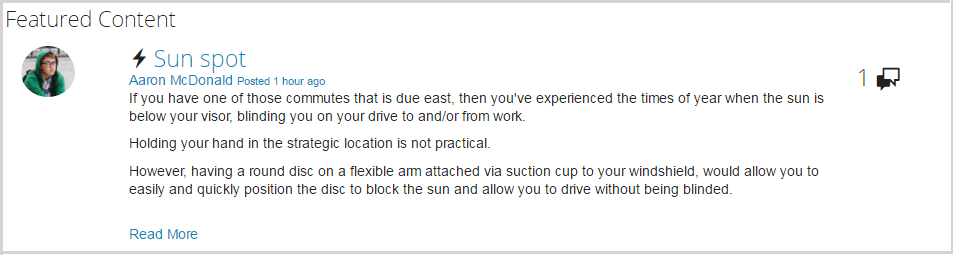

# Función de contenido destacado {#featured-content-feature}

## Introducción {#introduction}

La función de contenido destacado proporciona un área para los visitantes del sitio que han iniciado sesión (miembros de la comunidad) en el entorno de publicación para resaltar el contenido para:

* [Blogs](blog-feature.md)
* [Calendarios](calendar.md)
* [Foros](forum.md)
* [Ideas](ideation-feature.md)
* [P y R](working-with-qna.md)

Una vez que el contenido se marca como destacado, se muestra dentro de este componente, que puede colocarse en páginas de aterrizaje específicas o áreas que captan fácilmente la atención de los miembros de la comunidad.

La capacidad de presentar contenido puede estar permitida o no permitida por componente.

Esta sección de la documentación describe:

* Adición de contenido destacado a un sitio de la comunidad.
* Ajustes de configuración para `Featured Content` componente.

## Adición de contenido destacado a una página {#adding-featured-content-to-a-page}

Para agregar un `Featured Content` a una página en modo de autor, utilice el navegador de componentes para localizar

* `Communities / Featured Content`

y arrástrela a su lugar en una página en la que debería aparecer el contenido destacado.

Para obtener la información necesaria, visite [Conceptos básicos de los componentes de Communities](basics.md).

Cuando la variable [bibliotecas requeridas del lado del cliente](essentials-featured.md#essentials-for-client-side) se incluyen, así es como se muestra la variable `Featured Content` aparecerá el componente:

## Configuración del contenido destacado {#configuring-featured-content}

Seleccione la colocación `Featured Content` para acceder y seleccionar el componente `Configure` que abre el cuadro de diálogo de edición.

### Ficha Configuración {#settings-tab}

En el **[!UICONTROL Configuración]** , identifique el contenido a la función:

* **[!UICONTROL Nombre para mostrar]**

   Título de la lista de contenido destacado. Por ejemplo `Featured Questions` o `Featured Ideas`. El valor predeterminado es `Featured Content` si se deja vacío.

* **[!UICONTROL Ubicación del contenido destacado]**

   *(Obligatorio)* Vaya a la página que contenga el contenido que puede ser una característica (los componentes de esa página deben configurarse para permitir contenido destacado). Por ejemplo, `/content/sites/engage/en/forum`.

* **[!UICONTROL Límite de visualización]**

   El número máximo de contenido destacado que se va a mostrar. El valor predeterminado es 5.

## Experiencia del visitante del sitio {#site-visitor-experience}

La capacidad de marcar el contenido como contenido destacado requiere privilegios de moderador.

Cuando un moderador visualiza el contenido publicado, tiene acceso a los indicadores de moderación en contexto, que incluyen el nuevo `Feature` indicador.

Una vez marcada como función, el indicador de moderación se convierte en `Unfeature`.

La página que contiene la variable `Featured Content` , ahora incluirá esta publicación.

`Read More` es un vínculo al anuncio real.

## Información adicional {#additional-information}

Puede encontrar más información en la [Contenido destacado](essentials-featured.md) para desarrolladores.

Para marcar el contenido como aparece, consulte [Moderación del contenido generado por el usuario](moderate-ugc.md).
