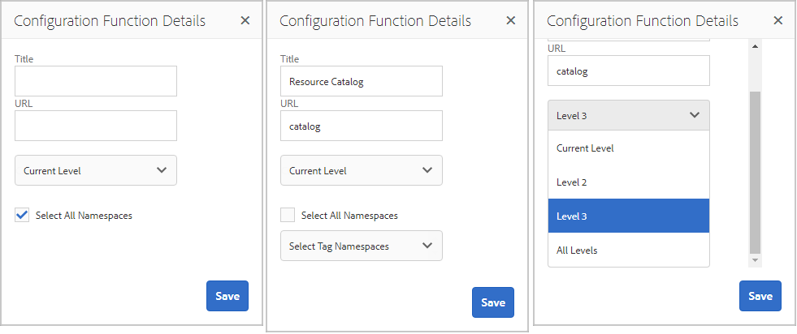

# Funciones de comunidad{#community-functions}

El tipo de características que se esperan de una experiencia de comunidad son bien conocidas. Las funciones de la comunidad están disponibles como funciones de la comunidad. Fundamentalmente, son una o más páginas preprogramadas para implementar una función de comunidad que requiere más que simplemente agregar un componente a una página en modo de autor. Son los componentes básicos utilizados para definir la estructura de una plantilla [de sitio de](/help/communities/sites.md) comunidad desde la cual se [crean](/help/communities/sites-console.md)los sitios de la comunidad.

Una vez creado un sitio de comunidad, se puede agregar contenido a las páginas resultantes mediante el modo [de creación estándar](/help/sites-authoring/editing-content.md)AEM. Hay varias funciones de la comunidad disponibles, como se ve en la consola de funciones de la comunidad.

>[!NOTE]
>
>Las consolas para la creación de sitios [de](/help/communities/sites-console.md)comunidad, plantillas [de sitio de](/help/communities/sites.md)comunidad, plantillas [de grupo de](/help/communities/tools-groups.md)comunidad y funciones [de](/help/communities/functions.md) comunidad solo se pueden usar en el entorno de creación.

## Consola de funciones de comunidad {#community-functions-console}

Para llegar a la consola de funciones de comunidad en el entorno de creación:

* Vaya a **[!UICONTROL Herramientas]** > **[!UICONTROL Comunidades]** > Funciones **[!UICONTROL de comunidad]**.

## Funciones prediseñadas {#pre-built-functions}

A continuación se ofrece una breve descripción de las funciones que se ofrecen con AEM Communities. Cada función incluye una o más páginas AEM que contienen componentes de Comunidades conectados en una función que se incorpora fácilmente a una plantilla [de sitio de](/help/communities/sites.md)comunidad.

Una plantilla de sitio de comunidad proporciona la estructura de un sitio de comunidad, incluyendo inicio de sesión, perfiles de usuario, notificaciones, mensajes, menú del sitio, búsqueda, tema y características de marca.

### Configuración de título y dirección URL {#title-and-url-settings}

**Título** y **dirección URL** son propiedades comunes a todas las funciones de la comunidad.

Cuando se agrega una función de comunidad a una plantilla de sitio de comunidad o se agrega al [modificar](/help/communities/sites-console.md#modifying-site-properties) la estructura de un sitio de comunidad, se abre el cuadro de diálogo de la función para que se puedan configurar el Título y la dirección URL.

#### Detalles de la función de configuración {#configuration-function-details}

* **Título**

   (*Obligatorio*) Texto que aparece en el menú de funciones del sitio

* **URL**

   (*Requerido*) El nombre utilizado para generar el URI. El nombre debe ajustarse a las convenciones [de](/help/sites-developing/naming-conventions.md) nomenclatura impuestas por AEM y JCR.

Por ejemplo, si utiliza el sitio creado a partir del tutorial [Introducción](/help/communities/getting-started.md) , si

* Título = Página Web
* URL = página

A continuación, la dirección URL de la página es https://localhost:4503/content/sites/engage/en/page.html

y el vínculo de menú de la página aparece como:

### Función Secuencia de actividades {#activity-stream-function}

La función de flujo de actividad es una página con un componente [de flujo de](/help/communities/activities.md) Actividad con todas las vistas seleccionadas (todas las actividades, actividades de usuario y siguientes). Consulte también [Actividad Stream Essentials](/help/communities/essentials-activities.md) para desarrolladores.

Cuando se agrega a una plantilla, se abre el siguiente cuadro de diálogo:

#### Detalles de la función de configuración {#configuration-function-details-1}

* [Configuración de título y dirección URL](#title-and-url-settings)

* **Mostrar vista de “Mis actividades”**

   Si se selecciona, la página Actividades incluye una ficha que filtros actividades basadas en las generadas dentro de la comunidad por el miembro actual. Predeterminado está seleccionado.

* **Mostrar vista de “todas las actividades”**

   Si se selecciona, la página Actividades incluye una ficha que incluye todas las actividades generadas dentro de la comunidad a la que tiene acceso el miembro actual. Predeterminado está seleccionado.

* **Mostrar vista de “Últimas noticias”**

   Si se selecciona, las páginas de Actividades incluyen una ficha que filtros actividades en función de las que sigue el miembro actual. Predeterminado está seleccionado.

### Función Asignaciones {#assignments-function}

La función de asignaciones es la función básica que define un sitio de [comunidad para la habilitación](/help/communities/overview.md#enablement-community). Permite asignar recursos de habilitación a los miembros de la comunidad. Consulte también [Assignments Essentials](/help/communities/essentials-assignments.md) para desarrolladores.

Esta función está disponible como función del complemento de [habilitación](/help/communities/enablement.md). El complemento de habilitación requiere licencias adicionales para su uso en un entorno de producción.

Cuando se agrega a una plantilla, la única configuración es para el [título y la configuración](#title-and-url-settings)de URL.

### Función Blog {#blog-function}

La función de blog es una página con un componente  Blog configurado para etiquetado, carga de archivos, seguimiento, miembros para autoedición, votación y moderación. Consulte también [Blog Essentials](/help/communities/blog-developer-basics.md) para desarrolladores.

Cuando se agrega a una plantilla, se abre el siguiente cuadro de diálogo:

* [Configuración de título y dirección URL](#title-and-url-settings)

* **Permitir miembros privilegiados**

   Si se selecciona, el blog solo permite que los miembros privilegiados creen artículos permitiendo la selección de un grupo [de miembros](/help/communities/users.md#privileged-members-group)privilegiados. Si no se selecciona, todos los miembros de la comunidad pueden crear. El valor predeterminado no está seleccionado.

* **Permitir cargas de archivos**

   Si se selecciona, el blog incluye la posibilidad de que los miembros carguen archivos. Predeterminado está seleccionado.

* **Permitir respuestas de debate**

   Si no se selecciona, el blog permite respuestas (comentarios) a un artículo, pero no se permiten respuestas a los comentarios. Predeterminado está seleccionado.

* **Permitir contenido destacado**

   Si se selecciona, el blog se identifica como contenido destacado. Predeterminado está seleccionado.

### Función Calendario {#calendar-function}

La función de calendario es una página con un componente  Calendario configurado para permitir el etiquetado. Consulte también [Calendar Essentials](/help/communities/calendar-basics-for-developers.md) para desarrolladores.

Cuando se agrega a una plantilla, se abre el siguiente cuadro de diálogo:

* [Configuración de título y dirección URL](#title-and-url-settings)

* **Permitir fijación**

   Si se selecciona, el foro permite que las respuestas al tema se fijen al principio de la lista de comentarios. Predeterminado está seleccionado.

* **Permitir miembros privilegiados**

   Si se selecciona, el blog solo permite que los miembros privilegiados creen artículos permitiendo la selección de un grupo [de miembros](/help/communities/users.md#privileged-members-group)privilegiados. Si no se selecciona, todos los miembros de la comunidad pueden crear. El valor predeterminado no está seleccionado.

* **Permitir cargas de archivos**

   Si se selecciona, el blog incluye la posibilidad de que los miembros carguen archivos. Predeterminado está seleccionado.

* **Permitir respuestas de debate**

   Si no se selecciona, el blog permite respuestas (comentarios) a un artículo, pero no se permiten respuestas a los comentarios. Predeterminado está seleccionado.

* **Permitir contenido destacado**

   Si se selecciona, su contenido se identifica como contenido destacado. Predeterminado está seleccionado.

### Función Catálogo {#catalog-function}

La función de catálogo permite a los miembros de la comunidad  habilitar la exploración de recursos de habilitación que no están asignados a ellos. Consulte Recursos [de habilitación de](/help/communities/tag-resources.md) etiquetado y Elementos esenciales [de catálogo](/help/communities/catalog-developer-essentials.md) para desarrolladores.

Todos los recursos de habilitación y las rutas de aprendizaje del sitio de la comunidad muestran en todos los catálogos si su propiedad, ` [Show in Catalog](/help/communities/resources.md)`, está establecida en true. Para incluir explícitamente recursos y rutas de aprendizaje, es necesario aplicar un [prefiltro](/help/communities/catalog-developer-essentials.md#pre-filters) al catálogo.

Cuando se agrega a una plantilla, la configuración permite especificar las Áreas de nombres de etiquetas utilizadas para configurar el filtro de etiquetas presentado en los visitantes del sitio:

* [Configuración de título y dirección URL](#title-and-url-settings)

* **Seleccionar todos los espacios de nombres**

   Las Áreas de nombres de etiquetas seleccionadas definen las etiquetas que pueden seleccionar los visitantes para filtrar la lista de los recursos de activación enumerados en el catálogo.
Si se selecciona, están disponibles todas las Áreas de nombres de etiquetas permitidas para el sitio de la comunidad.
Si no se selecciona, es posible seleccionar una o varias Áreas de nombres permitidas para el sitio de la comunidad.
Predeterminado está seleccionado.

### Función de contenido destacado {#featured-content-function}

La función de contenido destacado es una página con un componente [Contenido](/help/communities/featured.md) destacado configurado para permitir que se agreguen y eliminen comentarios.

La capacidad de presentar contenido puede estar permitida o no permitida por componente (consulte Función de blog, Función de calendario, Función [de](#forum-function)foro, Función [de](#ideation-function)ideas y Función QnA).

Cuando se agrega a una plantilla, la única configuración es para el [título y la configuración](#title-and-url-settings)de URL.

### Función Biblioteca del archivo {#file-library-function}

La función de biblioteca de archivos es una página con un componente [Biblioteca de](/help/communities/file-library.md) archivos configurado para permitir que se agreguen y eliminen comentarios.

Cuando se agrega a una plantilla, la única configuración es para el [título y la configuración](#title-and-url-settings)de URL.

### Función Foro {#forum-function}

La función de foro es una página con un componente [de](/help/communities/forum.md) foro configurado para etiquetado, carga de archivos, seguimiento, miembros para autoedición, votación y moderación.

Cuando se agrega a una plantilla, se abre el siguiente cuadro de diálogo:

#### Detalles de la función de configuración {#configuration-function-details-2}

* [Configuración de título y dirección URL](#title-and-url-settings)

* **Permitir fijación**

   Si se selecciona, el foro permite que las respuestas al tema se fijen al principio de la lista de comentarios. Predeterminado está seleccionado.

* **Permitir miembros privilegiados**

   Si se selecciona, el foro solo permite que los miembros con privilegios publiquen temas al permitir la selección de un grupo [de miembros con](/help/communities/users.md#privileged-members-group)privilegios. Si no se selecciona, todos los miembros de la comunidad pueden publicar. El valor predeterminado no está seleccionado.

* **Permitir cargas de archivos**

   Si se selecciona, el foro incluye la posibilidad de que los miembros carguen archivos. Predeterminado está seleccionado.

* **Permitir respuestas de debate**

   Si no se selecciona, el foro permite comentarios sobre un tema, pero no se permiten las respuestas a esos comentarios. Predeterminado está seleccionado.

* **Permitir contenido destacado**

   Si se selecciona, el contenido del componente se identifica como contenido destacado. Predeterminado está seleccionado.

### Función Grupos {#groups-function}

>[!CAUTION]
>
>La función de grupos *no debe* ser la *primera ni la única* función de la estructura de un sitio o de una plantilla de sitio de comunidad.
>
>Cualquier otra función, como la función [de](#page-function)página, debe incluirse y enumerarse en primer lugar.

La función de grupos permite a los miembros de la comunidad crear subcomunidades dentro del sitio de la comunidad en el entorno de publicación.

Según la [configuración](/help/communities/sites-console.md#groupmanagement) cuando la función Grupos se incluya en una plantilla [de sitio de](/help/communities/sites.md)comunidad, los grupos pueden ser públicos o privados y se pueden configurar una o varias plantillas de grupo de comunidad para proporcionar una selección de plantillas cuando se cree realmente el grupo de comunidad (por ejemplo, desde el entorno de publicación). Una plantilla [de grupo de](/help/communities/tools-groups.md) comunidad especifica qué funciones de comunidades se crean para las páginas de grupo, como los foros y los calendarios.

Cuando se crea un grupo de comunidad, se crea dinámicamente un grupo de miembros para el nuevo grupo, al que se pueden asignar o unir miembros. Para obtener más información, consulte [Administración de usuarios y grupos](/help/communities/users.md)de usuarios.

A partir del paquete de [funciones 1](/help/communities/deploy-communities.md#latestfeaturepack)de Comunidades, los grupos de comunidades se crean en el entorno de creación mediante la consola [Grupos de sitios de](/help/communities/groups.md)comunidades y se pueden crear en el entorno de publicación cuando están activados.

Cuando se agrega a una plantilla, se abre el siguiente cuadro de diálogo:

* [Configuración de título y dirección URL](#title-and-url-settings)

* **Seleccione las plantillas de grupo**

   Una lista desplegable que permite seleccionar una o varias plantillas de grupo habilitadas desde las que el futuro creador de un nuevo grupo de comunidad (en el entorno de publicación) puede elegir.

* **Permitir miembros privilegiados**

   Si se selecciona, el foro solo permite que los miembros con privilegios publiquen temas al permitir la selección de un grupo [de seguridad de miembros](/help/communities/users.md#privileged-members-group)privilegiados. Si no se selecciona, todos los miembros de la comunidad pueden publicar. El valor predeterminado no está seleccionado.

* **Permitir la creación de publicación**

   Si se selecciona, los miembros de la comunidad autorizados pueden crear un grupo en el entorno de publicación. Si no se selecciona, los nuevos grupos (subcomunidades) solo se pueden crear en el entorno de creación desde la consola Grupos de sitios de comunidades.
Predeterminado está seleccionado.

### Función ideación {#ideation-function}

La función de ideación es una página con un componente Ideación.

Cuando se agrega a una plantilla, se abre el siguiente cuadro de diálogo, que especifica los nombres predeterminados de Título y URL, así como la configuración de visualización predeterminada de la plantilla:

* [Configuración de título y dirección URL](#title-and-url-settings)

* **Permitir miembros privilegiados**

   Si se selecciona, el foro solo permite que los miembros con privilegios publiquen temas al permitir la selección de un grupo [de seguridad de miembros](/help/communities/users.md#privileged-members-group)privilegiados. Si no se selecciona, todos los miembros de la comunidad pueden publicar. El valor predeterminado no está seleccionado.

* **Permitir cargas de archivos**

   Si se selecciona, la idea incluye la posibilidad de que los miembros carguen archivos. Predeterminado está seleccionado.

* **Permitir respuestas de debate**

   Si no se selecciona, la idea permite responder (comentarios) a un tema, pero no se permiten las respuestas a los comentarios. Predeterminado está seleccionado.

* **Permitir contenido destacado**

   Si se selecciona, su contenido se identifica como contenido destacado. Predeterminado está seleccionado.

### Función de la tabla de clasificación {#leaderboard-function}

La función de tabla de clasificación es una página con un componente [de](/help/communities/enabling-leaderboard.md)tabla de clasificación.

**NOTA**: El componente Mesa de liderazgo necesita más configuración *después* de crear un sitio de comunidad a partir de una plantilla de comunidad que incluya la función Mesa de liderazgo. Especifique las [reglas](/help/communities/enabling-leaderboard.md#rules-tab)del componente Leaderboard, que dependen de la configuración de [puntuación y distintivos](/help/communities/implementing-scoring.md) para el sitio de la comunidad.

Cuando se agrega a una plantilla, se abre el siguiente cuadro de diálogo, que especifica los nombres predeterminados de Título y URL, así como la configuración de visualización predeterminada de la plantilla:

* [Configuración de título y dirección URL](#title-and-url-settings)

* **Mostrar distintivo**

   Si se selecciona, se incluye una columna para los iconos de distintivo en la tabla de clasificación.
El valor predeterminado no está seleccionado.

* **Mostrar nombre del distintivo**

   Si se selecciona, se incluye una columna para el nombre del distintivo en la tabla de clasificación.
El valor predeterminado no está seleccionado.

* **Mostrar avatar**

   Si se selecciona, la imagen de avatar del miembro se incluye en la tabla de clasificación, junto al vínculo de nombre del perfil del miembro.
El valor predeterminado no está seleccionado.

### Función Página {#page-function}

La función de página agrega una página en blanco al sitio de la comunidad que está conectada a las características del sitio de la comunidad: inicio de sesión, menú, notificaciones, mensajes, temas y marca. El contenido se agrega a la página mediante el modo [de creación de AEM](/help/sites-authoring/editing-content.md)estándar.

Cuando se agrega a una plantilla, la única configuración es para el [título y la configuración](#title-and-url-settings)de URL.

### Función Preguntas y respuestas {#qna-function}

La función QnA es una página con un componente  QnA configurado para el etiquetado, la carga de archivos, el seguimiento y los miembros que se editan, votan y moderan por sí mismos.

Cuando se agrega a una plantilla, la configuración permite la restricción a los miembros privilegiados:

* [Configuración de título y dirección URL](#title-and-url-settings)

* **Permitir fijación**

   Si se selecciona, el foro permite que las respuestas al tema se fijen al principio de la lista de comentarios. Predeterminado está seleccionado.

* **Permitir miembros privilegiados**

   Si se selecciona, el foro QnA solo permite que los miembros privilegiados publiquen preguntas permitiendo la selección de un grupo [de miembros](/help/communities/users.md#privileged-members-group)privilegiados. Si no se selecciona, todos los miembros de la comunidad pueden publicar. El valor predeterminado no está seleccionado.

* **Permitir cargas de archivos**

   Si se selecciona, el foro QnA incluye la posibilidad de que los miembros carguen archivos. Predeterminado está seleccionado.

* **Permitir respuestas de debate**

   Si no se selecciona, el foro QnA permite comentarios (respuestas) a una pregunta publicada, pero no se permiten respuestas a las respuestas. Predeterminado está seleccionado.

* **Permitir contenido destacado**

   Si se selecciona, su contenido se identifica como contenido destacado. Predeterminado está seleccionado.

## Crear función de la comunidad {#create-community-function}

La capacidad de crear una función de comunidad se alcanza seleccionando el icono `Create Community Function` situado en la parte superior de la consola Funciones de comunidad. Se pueden crear varias funciones basadas en el mismo modelo de AEM y, a continuación, personalizarlas de forma única abriéndolas en el modo de edición de autor.

### Nombre de función de la comunidad {#community-function-name}

En el panel Nombre de función de comunidad, se configuran un nombre, una descripción y si la función está habilitada o deshabilitada:

* **Nombre de función de la comunidad**

   El nombre de la función que se utiliza para mostrar y almacenamiento.

* **Descripción de la función de la comunidad**

   La descripción de la función para mostrar.

* **Deshabilitado/Habilitado**

   Un conmutador que controla si se puede hacer referencia a la función.

### Modelo AEM {#aem-blueprint}

En el `AEM Blueprint` panel, es posible seleccionar el modelo que es la implementación subyacente de la función de comunidad.

La función de comunidad es un minisitio que incluye una o más páginas, preprogramadas para su inclusión en un sitio de la comunidad, incluyendo inicio de sesión, perfiles de usuario, notificaciones, mensajes, menú del sitio, búsqueda, tema y características de marca. Una vez creada la función, es posible [abrirla](#open-community-function) en modo de edición de autor y personalizar la configuración de la página o del componente.

Dado que la función de comunidad se implementa como una [Live Copy](/help/sites-administering/msm.md#live-copies) de un [modelo](/help/sites-administering/msm-livecopy.md#creatingablueprint), es posible implementar los cambios realizados en una función que afecta a todas las páginas del sitio de la comunidad creadas a partir de la plantilla [del sitio de la](/help/communities/sites.md) comunidad o la plantilla [del grupo de](/help/communities/tools-groups.md) comunidad que incluye la función. También es posible desasociar una página de su modelo principal para realizar modificaciones a nivel de página.

Consulte también Administrador [de varios sitios](/help/sites-administering/msm.md).

### Miniatura    {#thumbnail}

En el panel Miniatura, se puede cargar una imagen para mostrarla en la consola [Funciones de la](#community-functions-console)comunidad.

## Abrir función de la comunidad {#open-community-function}

Seleccione el `Open Community Function` icono para entrar en el modo de edición de autor para crear el contenido de la página y modificar la configuración de los componentes de la función.

### Configurar componentes {#configuring-components}

Una función de comunidad se implementa como Live Copy de un modelo de AEM, cuyos detalles se documentan en [Multi Site Manager](/help/sites-administering/msm.md).

Es posible no sólo crear contenido de página, sino también configurar componentes.

Si configura un componente en una página de un sitio de comunidad creado, puede que sea necesario cancelar la [herencia](/help/sites-administering/msm-livecopy.md#changing-live-copy-content) para configurar el componente. La herencia debe restablecerse cuando se complete la configuración.

Para obtener más información sobre la configuración, visite [Communities Components](/help/communities/author-communities.md) para autores.

## Editar función de la comunidad {#edit-community-function}

Seleccione el `Edit Community Function` icono para editar las propiedades de la función utilizando los mismos paneles que [crear una función](#create-community-function)de comunidad, incluida la habilitación o desactivación de la función.
