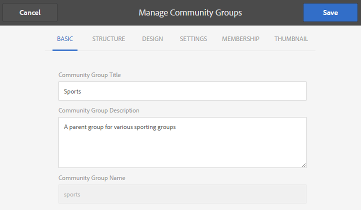

# Consola de grupos de la comunidad {#community-groups-console}

La consola Grupos proporciona acceso para crear grupos de comunidad cuando la [estructura de plantillas](/help/communities/sites-console.md#step1) de un sitio de comunidad incluye la función [grupos](/help/communities/functions.md#groups-function).

* AEM Communities admite el anidamiento de grupos dentro de otros grupos. El anidamiento de grupos es posible cuando la [estructura del nuevo grupo](/help/communities/tools-groups.md) contiene la función de grupos.
* Solo para el entorno de creación, existe un asistente de creación de grupos similar al asistente de creación de sitios.
* Tanto si los miembros pueden crear grupos en el entorno de publicación como si no, se puede configurar al agregar una función Grupos a una estructura de sitio de comunidad o de grupo de comunidad.

De las tres plantillas de grupo que se incluyen, solo la plantilla `Reference Group` incluye una función de grupos en su estructura.

Las diferentes facetas de los grupos comunitarios son:

* **Creación**: se puede crear un nuevo grupo en la instancia de autor y, opcionalmente, en la instancia de publicación.
* **Control**: el grupo puede ser abierto o secreto.
* **Anidado**: el grupo puede contener cero o más grupos.

<!-- This is a 404 on helpx. Update or remove.
>[!NOTE]
>
>Community groups, created in the publish environment before the [existence of the Community Groups console](/help/communities/version-history.md#featurepack1fp1), is not listed in the Community Groups console, and thus, are not modifiable using the console.
-->

>[!NOTE]
>
>Esta consola de grupos, a la que solo se puede acceder desde la consola Sitios de comunidades, no se debe confundir con la consola de grupos [para administrar los grupos de miembros.](/help/communities/members.md)
>
>Los grupos de miembros son grupos de usuarios registrados en el entorno de publicación a los que se accede desde el entorno de creación mediante el [servicio de túnel](/help/communities/deploy-communities.md#tunnel-service-on-author).

## Creación de grupos {#group-creation}

Para acceder a la consola de grupos:

* En Autor, inicie sesión con privilegios de administrador.
* Desde la navegación global: **[!UICONTROL Comunidades]** > **[!UICONTROL Sitios]**.
* Seleccione una carpeta existente del sitio de la comunidad para poder abrirla.
* Seleccione una instancia de un sitio de la comunidad dentro de la carpeta.

   * La estructura del sitio de la comunidad debe incluir una función de grupos.
   * Estas capturas de pantalla son del tutorial de Introducción después de [crear grupos en la publicación](/help/communities/published-site.md).

  

* Seleccione la carpeta **Grupos** para poder abrirla.

  Cuando se abren, se muestran todos los grupos existentes, ya se hayan creado en Author o Publish.

  Desde esta consola de grupos, es posible crear nuevos grupos.

  

* Seleccione el botón **Crear grupo**.

### Paso 1: Plantilla del grupo de la comunidad {#step-community-group-template}

* **Título del grupo de la comunidad**

  Título para mostrar del grupo.
El título aparece en el sitio publicado para el grupo.

* **Descripción del grupo de la comunidad**

  Una descripción del grupo.

* **Raíz de grupo de comunidad**

  Ruta de acceso raíz del grupo.
La raíz predeterminada es el sitio principal, pero la raíz se puede mover a cualquier ubicación del sitio web. No se recomienda cambiarlo.

* Menú **Idiomas de grupo de comunidad adicionales disponibles**

  Utilice la lista desplegable para seleccionar los idiomas de grupo de la comunidad disponibles. El menú muestra todos los idiomas en los que se crea el sitio de la comunidad principal. Los usuarios pueden seleccionar entre estos idiomas para crear grupos en varias configuraciones regionales en este solo paso. El mismo grupo se crea en varios idiomas especificados en la consola Grupos de los sitios de la comunidad correspondientes.

* **Nombre del grupo de la comunidad**

  Nombre de la página raíz del grupo que aparece en la dirección URL. Evite utilizar caracteres de subrayado (_) y palabras clave como recursos y configuración en el nombre del grupo.

   * Compruebe el nombre, ya que no se cambia fácilmente después de crear el grupo.
   * La dirección URL base se muestra debajo de `Community Group Name`.
   * Para una URL válida, añada &quot;.html&quot;
     *por ejemplo*, `https://localhost:4502/content/sites/mysight/en/mygroup.html`.

* Menú **Plantilla de grupo de la comunidad**

  Utilice la lista desplegable para elegir una [plantilla de grupo de comunidad](/help/communities/tools.md) disponible.

### Paso 2: Diseño {#step-design}

### TEMA DEL GRUPO DE LA COMUNIDAD {#community-group-theme}

El marco de trabajo utiliza `Twitter Bootstrap` para llevar un diseño flexible y adaptable al sitio. Se puede seleccionar una de las muchas temáticas de Bootstrap precargadas para aplicar estilo a la plantilla de grupo de comunidad seleccionada, o se puede cargar una temática de Bootstrap.

Cuando se selecciona, la temática se superpone con una marca de verificación azul opaca.

Es posible seleccionar un tema que difiera del tema del sitio principal.

Una vez publicado el sitio de la comunidad, es posible [editar las propiedades](#modifyinggroupproperties) y seleccionar un tema diferente.

### MARCA DE GRUPO DE COMUNIDAD {#community-group-branding}

La marca del sitio de comunidad es una imagen que se muestra como encabezado en la parte superior de cada página. Es posible mostrar un banner para el grupo que difiera de otras páginas del sitio.

El tamaño de la imagen debe ser igual de ancho que la visualización esperada de la página en el explorador y 120 píxeles de alto.

Al crear o seleccionar una imagen, tenga en cuenta lo siguiente:

* La altura de la imagen se recorta a 120 píxeles medidos desde el borde superior de la imagen
* La imagen se fija al borde izquierdo de la ventana del explorador
* No se cambia el tamaño de la imagen, de modo que cuando el ancho de la imagen es:

   * Menor que el ancho del explorador, la imagen se repite horizontalmente.
   * Mayor que el ancho del explorador, la imagen aparece recortada.

### Paso 3: Configuración {#step-settings}

**MODERACIÓN**

**Moderadores del grupo de la comunidad**

De forma predeterminada, se hereda la lista de moderadores del sitio de la comunidad principal.

Es posible añadir moderadores específicamente al grupo. Busque miembros (del entorno de publicación) para agregarlos como moderadores

**Administradores de grupo**

De forma predeterminada, el administrador del sitio de la comunidad principal también es el administrador de los grupos.

Sin embargo, es posible asignar administradores de grupo independientes. Los administradores de grupo pueden administrar su grupo (por ejemplo, G1) y crear un subgrupo anidado en G1. Además, pueden asignar distintos administradores al subgrupo.

Un usuario U1, por lo tanto, puede ser un administrador en un grupo G1 y un usuario regular en su grupo anidado G2.

**PERTENENCIA**

La configuración de pertenencia permite seleccionar una de las tres formas de proteger un grupo de la comunidad.

* **Suscripción opcional**

  Si se selecciona, el grupo de comunidad es un grupo público. Los miembros del sitio pueden participar en el grupo y publicar sin unirse explícitamente al grupo. La opción predeterminada está seleccionada.

* **Suscripción requerida**

  Si se selecciona, el grupo de comunidad es un grupo abierto. Los miembros del sitio de la comunidad pueden ver el contenido del grupo, pero deben unirse al grupo para publicar contenido. Los miembros se unen seleccionando el botón `Join` en el entorno de publicación. No se ha seleccionado la opción predeterminada.

* **Suscripción restringida**

  Si se selecciona, el grupo de comunidad es un grupo secreto. Se debe invitar explícitamente a los miembros de la comunidad. Los miembros invitados se introducen en el cuadro de búsqueda. Los miembros se pueden agregar más adelante mediante las consolas [Miembros y grupos](/help/communities/members.md) del entorno de creación. No se ha seleccionado la opción predeterminada.

**MINIATURA**

La miniatura es una imagen que se muestra para el grupo en Autor y Publicación.

El tamaño óptimo para una imagen de grupo es de 170 x 90 píxeles en un formato de imagen compatible (como JPG o PNG).

Si no se añade ninguna imagen, se muestra una imagen predeterminada.

### Paso 4: Crear un grupo {#step-create-group}

Si es necesario hacer algún ajuste, usa el botón **Atrás** para hacerlo.

Una vez que **Create** se selecciona e inicia, el proceso de creación del grupo no se puede interrumpir.

Cuando el proceso termina, la tarjeta del nuevo sitio (grupo) de la subcomunidad se muestra en la consola Grupos de sitios de Communities, desde donde los autores pueden agregar contenido de página o los administradores pueden modificar las propiedades del sitio.

>[!NOTE]
>
>El grupo se creará en todos los idiomas, tal como se especifica en [Paso 1: Plantilla de grupo de comunidad](/help/communities/groups.md#step-community-group-template) en Idiomas de grupo de comunidad adicionales disponibles, en la consola de grupos de comunidad de los sitios de comunidad respectivos.

## Contenido del grupo de autores {#author-group-content}

AEM El contenido de la página de un grupo se puede crear con las mismas herramientas que cualquier otra página de la. Para abrir el grupo para su creación, seleccione el icono Abrir sitio que aparece al pasar el ratón por encima de la tarjeta del grupo.

## Modificar propiedades del grupo {#modify-group-properties}

Las propiedades de un sitio de subcomunidad existente, especificadas durante el proceso de creación del grupo de comunidad, se pueden modificar seleccionando el icono Editar sitio que aparece al pasar el ratón por encima de la tarjeta de grupo:

Los detalles de las siguientes propiedades coinciden con las descripciones proporcionadas en la sección [Creación de grupos](#group-creation). Cualquier grupo anidado se puede modificar, independientemente de si se crea en el entorno de publicación o en el entorno de creación.

### Modificar básico {#modify-basic}

El panel BÁSICO permite modificar

* Título del grupo de la comunidad
* Descripción del grupo de la comunidad

No se puede modificar el nombre del grupo de la comunidad.

Elegir una plantilla de grupo de comunidad diferente no tendría ningún efecto en un sitio de grupo de comunidad existente, ya que no queda ninguna conexión entre las plantillas y los sitios.

En su lugar, se puede modificar la [ESTRUCTURA](#modify-structure) de la subcomunidad.

### Modificar estructura {#modify-structure}

El panel ESTRUCTURA permite modificar la estructura creada inicialmente a partir de la plantilla de grupo de comunidad seleccionada al crear el sitio de subcomunidad desde el entorno de creación o publicación. Desde el panel, es posible:

* Arrastre y suelte [funciones de la comunidad](/help/communities/functions.md) adicionales en la estructura del sitio.
* En una instancia de una función de comunidad en la estructura del sitio:

   * **`Gear icon`**
Edite la configuración, incluidos el título para mostrar, la dirección URL y los [grupos de miembros privilegiados](/help/communities/users.md#privilegedmembersgroups).

   * **`Trashcan icon`**
Quitar (eliminar) funciones de la estructura del sitio.

   * **`Grid icon`**
Modifique el orden de las funciones tal como se muestran en la barra de navegación de nivel superior del sitio.

>[!CAUTION]
>
>Aunque el título para mostrar se puede cambiar sin efectos secundarios, no se recomienda editar el nombre de la URL de una función de la comunidad que pertenece a un sitio de la comunidad.
>
>Por ejemplo, al cambiar el nombre de la URL no se mueve el UGC existente, por lo que tiene el efecto de &quot;perder&quot; UGC.

>[!CAUTION]
>
>La función de grupos debe *no* ser la función *primero ni la única* en la estructura del sitio.
>
>Cualquier otra función, como [page function](/help/communities/functions.md#page-function), debe incluirse y enumerarse primero.

**Ejemplo: Agregar una función de calendario a una estructura de subcomunidad (grupo)**

### Modificar diseño {#modify-design}

El panel DISEÑO permite modificar la temática:

* [Tema del grupo de la comunidad](#community-group-theme)
* [Marca del grupo de la comunidad](#community-group-branding)

   * Desplácese hasta la parte inferior del panel para poder cambiar la imagen de marca.

### Modificar configuración {#modify-settings}

El panel CONFIGURACIÓN permite agregar [moderadores](#moderation) de la comunidad.

### Modificar pertenencia {#modify-membership}

El panel [PERTENENCIA](#membership) es meramente informativo. No es posible modificar el tipo de pertenencia a un grupo establecido, ya sea opcional, obligatoria o restringida.

### Modificar miniatura {#modify-thumbnail}

El panel [MINIATURA](#thumbnail) permite cargar una imagen para representar el grupo de la comunidad para los visitantes del sitio en el entorno de Publish y en la consola de grupos del sitio de comunidades en el entorno de creación.

## Publish el grupo {#publish-the-group}

Después de crear o modificar un grupo de comunidad, es posible publicarlo (activarlo) seleccionando el icono `Publish Site`.

Una vez que el grupo se haya publicado correctamente, aparecerá el siguiente mensaje:

>[!CAUTION]
>
>El sitio de la comunidad principal y los grupos principales ya deberían haberse publicado.
>
>El sitio de la comunidad y los grupos anidados deben publicarse de arriba hacia abajo.

## Eliminar el grupo {#delete-the-group}

Elimine un grupo desde la consola de grupos de la comunidad seleccionando el icono Eliminar grupo, que aparece al pasar el ratón sobre el grupo.

Esto elimina todos los elementos asociados con el grupo; por ejemplo, todo el contenido del grupo se elimina de forma permanente y las pertenencias de los usuarios se eliminan del sistema.
