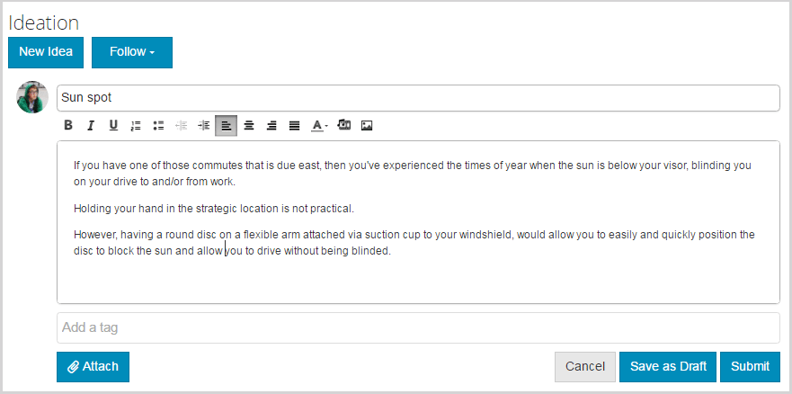

# Característica de ideación {#ideation-feature}

## Introducción {#introduction}

La función de ideación proporciona un área para los visitantes del sitio con sesión iniciada (miembros de la comunidad) en el entorno de publicación para:

* Cree ideas para compartir con la comunidad.
* Vista y comentarios sobre ideas.
* Sigue una idea.
* Votar sobre una idea.

Esta sección de la documentación describe:

* Añadir la función de ideación en un sitio AEM.
* Configuración del componente Ideación.

### Añadir una idea en una página {#adding-a-ideation-to-a-page}

Para agregar un componente `Ideation` a una página en modo de autor, utilice el navegador de componentes para localizar

* `Communities / Ideation`

y arrástrelo a su lugar en una página donde debería aparecer la idea.

Para obtener la información necesaria, visite [Conceptos básicos de los componentes de comunidades](/help/communities/basics.md).

Cuando se incluyen las [bibliotecas requeridas del lado del cliente](/help/communities/ideation.md#essentials-for-client-side), así es como aparecerá el componente `Ideation`:

### Configuración de una idea {#configuring-an-ideation}

Seleccione el componente `Ideation` colocado para acceder y seleccione el icono `Configure` que abre el cuadro de diálogo de edición.

#### Ficha Configuración {#settings-tab}

En la ficha **[!UICONTROL Configuración]**, especifique la configuración de las ideas y los comentarios:

* **Permitir la miniatura del archivo adjunto**
* **Tamaño máximo de la miniatura del archivo adjunto**
* **Tamaño mínimo de la imagen de la miniatura**
* **Tamaño máximo de la miniatura**
* **Permitir miembros privilegiados**
* **Miembros privilegiados permitidos**
* **Bloquee el contenido que haya creado el usuario en el modo de edición de autor**
* **Título de ideación**

* Título que se muestra para la idea. El valor predeterminado es `Ideation`.
* **Descripción de ideación**

   Descripción que se muestra como un subtítulo para la idea. El valor predeterminado no es una descripción.

* **Temas por página**

   Define el número de ideas/publicaciones que se muestran por página. El valor predeterminado es 10.

* **Moderado**

   Si se selecciona, la publicación de ideas y comentarios debe aprobarse antes de que aparezcan en un sitio de publicación. El valor predeterminado no está marcado.

* **Cerrado**

   Si se selecciona, el foro de ideas está cerrado a nuevas ideas y comentarios. El valor predeterminado no está marcado.

* **Editor de texto enriquecido**

   Si se selecciona, las ideas y los comentarios pueden introducirse con marcas. El valor predeterminado no está marcado.

* **Permitir etiquetado**

   Si está activada, permita que los miembros agreguen etiquetas a su anuncio (consulte la ficha **[!UICONTROL Campo de etiqueta]**). El valor predeterminado no está marcado.

* **Permitir cargas de archivos**

   Si está activada, permita que los archivos adjuntos se agreguen a la idea o comentario. El valor predeterminado no está marcado.

* **Tamaño máximo de archivo**

   Solo es pertinente si se comprueba `Allow File Uploads`. Este campo limitará el tamaño (en bytes) de un archivo cargado. El valor predeterminado es 104857600 (10 Mb).

* **Tipos de archivo permitidos**

   Solo es pertinente si se comprueba `Allow File Uploads`. Lista separada por comas de extensiones de archivo con el separador &quot;punto&quot;. Por ejemplo: .jpg, .jpeg, .png, .doc, .docx, .pdf. Si se especifica algún tipo de archivo, no se permitirá cargar los no especificados. El valor predeterminado no se especifica de forma que se permitan todos los tipos de archivo.

* **Tamaño máximo de archivo de imagen adjunto**

   Solo es relevante si está activada la opción Permitir cargas de archivos. Número máximo de bytes que puede tener un archivo de imagen cargado. El valor predeterminado es 2097152 (2 Mb).

* **Permitir respuestas**

   Si está activada, permita respuestas a los comentarios publicados en la idea. El valor predeterminado no está marcado.

* **Habilitar la votación**

   Si se selecciona, permita votar los comentarios de una idea. El valor predeterminado no está marcado.

* **Permitir que los usuarios eliminen comentarios y temas**

   Si se selecciona, permita que los miembros eliminen los comentarios e ideas que han publicado. El valor predeterminado no está marcado.

* **Permitir seguimiento**

   Si está activada, incluya la siguiente función para anuncios de ideas, que permite que los miembros reciban [notificaciones](/help/communities/notifications.md) de anuncios nuevos. El valor predeterminado no está marcado.

* **Permitir suscripciones por correo electrónico**

   Si se selecciona, permita que se notifique a los miembros de los nuevos anuncios por correo electrónico ([suscripción](/help/communities/subscriptions.md)). Requiere que `Allow Following` se compruebe y [se configure el correo electrónico](/help/communities/email.md). El valor predeterminado no está marcado.

* **Habilitar la votación**

   Si se selecciona, permita votar los comentarios de una idea. El valor predeterminado no está marcado.

* **Mostrar insignias**

   Si está marcado, muestre [distintivos](/help/communities/implementing-scoring.md) obtenidos y asignados con la idea de un miembro. El valor predeterminado no está marcado.

* **No obtener respuestas en la página de listado**

* **Permitir contenido destacado**

   Si se selecciona, la idea se puede identificar como [contenido destacado](/help/communities/featured.md). El valor predeterminado no está marcado.

* **Habilitar la mención**
* **Menciones máximas**
* **Patrón de menciones en la interfaz de usuario**

#### Ficha Moderación del usuario {#user-moderation-tab}

En la ficha **[!UICONTROL Moderación del usuario]**, especifique cómo se administran las ideas y los comentarios publicados (contenido generado por el usuario). Para obtener más información, consulte [Moderación del contenido generado por el usuario](/help/communities/moderate-ugc.md).

* **Denegar entradas**

   Si se selecciona, los moderadores miembros de confianza podrán denegar las publicaciones e impedir que aparezcan en el foro público. El valor predeterminado no está marcado.

* **Cerrar/abrir de nuevo los temas**

   Si se selecciona, los moderadores de miembros de confianza pueden cerrar un tema para realizar más ediciones y comentarios, y también pueden volver a abrir un tema. El valor predeterminado no está marcado.

* **Marcar entradas**

   Si se selecciona, permita que los miembros marquen los temas o comentarios de otros como inapropiados. El valor predeterminado no está marcado.

* **Lista de motivos de indicación**

   Si se selecciona, permita que los miembros elijan, desde una lista desplegable, el motivo por el que marcan un tema o comentario como inapropiado. El valor predeterminado no está marcado.

* **Motivo de indicación personalizado**

   Si se selecciona, permita que los miembros especifiquen su propio motivo para marcar un tema o comentario como inapropiado. El valor predeterminado no está marcado.

* **Umbral de moderación**

   Escriba el número de veces que los miembros deben marcar un tema o comentario antes de que se notifique a los moderadores. El valor predeterminado es 1 ( una vez).

* **Límite de indicación**

   Introduzca el número de veces que se debe marcar un tema o comentario antes de ocultarlo en la vista pública. Si se establece en -1, el tema o comentario marcado nunca se oculta en la vista pública. De lo contrario, este número debe ser bueno o igual al umbral de moderación. El valor predeterminado es 5.

#### Ficha Campo de etiqueta {#tag-field-tab}

En la ficha **[!UICONTROL Campo de etiqueta]**, las etiquetas que se pueden aplicar, si se permiten en la ficha **[!UICONTROL Configuración]**, están limitadas según las Áreas de nombres elegidas.

* **Espacios de nombres permitidos**

   Relevante si `Allow Tagging` está marcado en la ficha **[!UICONTROL Configuración]**. Las etiquetas que se pueden aplicar están limitadas a las que se encuentran dentro de las categorías de Área de nombres seleccionadas. La lista de Áreas de nombres incluye &quot;Etiquetas estándar&quot; (la Área de nombres predeterminada) y &quot;Incluir todas las etiquetas&quot;. El valor predeterminado no está marcado, lo que significa que se permiten todas las Áreas de nombres.

* **Límite de sugerencias**

   Escriba el número de etiquetas que se mostrarán como una sugerencia para el miembro que se publica en el foro. Un valor de **-1** significa que no hay límite. El valor predeterminado es 0.

#### Ficha Ordenar configuración {#sort-settings-tab}

En la ficha **[!UICONTROL Ordenar configuración]**, especifique cómo se ordenan los comentarios publicados cuando se muestran.

* **Ordenar por**

   Marque todas las selecciones de clasificación permitidas: `Newest, Oldest, Last Updated, Most Viewed, Most Active, Most Followed and Most Liked`. El valor predeterminado es `Newest, Oldest, Last Updated`.

* **Establecer como predeterminado**

   Despliegue para seleccionar una de las opciones de ordenación seleccionadas para que aparezcan como predeterminadas. El valor predeterminado es `Newest`.

* **Seleccione las opciones de hora para la clasificación de Analytics**

   Despliegue para seleccionar uno de `All, Last 24 Hours, Last 7 Days, Last 30 Days`. El valor predeterminado es `All`.

## Experiencia de Visitante del sitio {#site-visitor-experience}

### Creación de ideas {#creating-idea}

Al igual que con todas las características de las Comunidades, si no se ha iniciado sesión, un visitante del sitio solo puede leer ideas y vista otras opiniones (a través de comentarios y votaciones/preferencias).

Una vez que haya iniciado sesión, un miembro puede crear una nueva idea.

Antes de enviar la idea, es posible que el miembro guarde un borrador.

Al seleccionar el botón `Save as Draft`, se guarda un borrador.

Cuando visualice borradores guardados en la ficha `My Drafts`, seleccione `Read More` para volver a entrar en el modo de edición:

#### Proporcionar comentarios {#providing-feedback}

Una vez publicada la idea, otros miembros pueden iniciar sesión, abrir la idea ( `Read More`) y darle gusto, agregando así al recuento de votos, y hacer comentarios.

### Información adicional {#additional-information}

Puede encontrar más información en la página [Ideation Essentials](/help/communities/ideation.md) para desarrolladores.

Para obtener información sobre la moderación de los temas y comentarios publicados, consulte [Moderación del contenido generado por el usuario](/help/communities/moderate-ugc.md).

Para etiquetar temas y comentarios publicados, consulte [Etiquetado de contenido generado por el usuario](/help/communities/tag-ugc.md).
