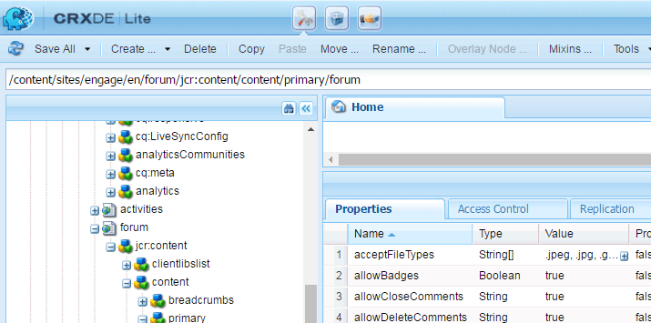

# Puntuación y distintivos de comunidades {#communities-scoring-and-badges}

## Información general {#overview}

La función de puntuación e insignias de AEM Communities permite identificar y recompensar a los miembros de la comunidad.

Los principales aspectos de la puntuación y las insignias son:

* [Asignar distintivos](#assign-and-revoke-badges) para identificar el papel de un miembro en la comunidad.

* [Concesión básica de distintivos](#enable-scoring) a los miembros para fomentar su participación (cantidad de contenido creado).

* [Concesión avanzada de distintivos](/help/communities/advanced.md) para identificar a los miembros como expertos (calidad del contenido creada).

**Nota** que la concesión de insignias es [no está habilitado de forma predeterminada](/help/communities/implementing-scoring.md#main-pars-text-237875536).

>[!CAUTION]
>
>La estructura de implementación visible en CRXDE Lite está sujeta a cambios una vez que la interfaz de usuario esté disponible.

## Insignias {#badges}

Las insignias se colocan bajo el nombre de un miembro para indicar su rol o su posición en la comunidad. Las insignias pueden mostrarse como una imagen o como un nombre. Cuando se muestra como una imagen, el nombre se incluye como texto alternativo para fines de accesibilidad.

De forma predeterminada, los distintivos se encuentran en el repositorio en las siguientes ubicaciones:

* `/libs/settings/community/badging/images`

Si se almacenan en una ubicación diferente, todos deben poder acceder a ellas.

Las insignias se diferencian en UGC si se asignaron o se obtuvieron según las reglas. Actualmente, las insignias asignadas aparecen como texto y las insignias obtenidas aparecen como una imagen.

### IU de administración de distintivos {#badge-management-ui}

Las Comunidades [Consola Insignias](/help/communities/badges.md) permite añadir insignias personalizadas que se pueden mostrar para un miembro cuando se obtiene (se otorga) o cuando asume una función específica en la comunidad (se asigna).

### Insignias asignadas {#assigned-badges}

Un administrador asigna las insignias basadas en funciones a los miembros de la comunidad en función de su función en la comunidad.

Las insignias asignadas (y las otorgadas) se almacenan en el [SRP](/help/communities/srp.md) y no son accesibles directamente. Hasta que haya una GUI disponible, el único medio para asignar distintivos basados en roles es hacerlo con código o cURL. Para obtener instrucciones sobre cURL, consulte la sección titulada [Asignar y revocar distintivos](#assign-and-revoke-badges).

En la versión se incluyen tres distintivos basados en funciones:

* **moderador**
  `/libs/settings/community/badging/images/moderator/jcr:content/moderator.png`

* **administrador de grupo**
  `/libs/settings/community/badging/images/group-manager/jcr:content/group-manager.png`

* **miembro privilegiado**
  `/libs/settings/community/badging/images/privileged-member/jcr:content/privileged-member.png`

  

### Insignias premiadas {#awarded-badges}

El servicio de puntuación otorga insignias basadas en recompensas a los miembros de la comunidad según las reglas aplicadas a su actividad en la comunidad.

Para que las insignias aparezcan como recompensa por la actividad, hay dos cosas que deben suceder:

* El distintivo debe ser [activado](#enableforcomponent) para el componente de función.
* Las reglas de puntuación e insignias deben ser [aplicado](#applytopage) a la página (o antecesor) en la que se coloca el componente.

En la versión se incluyen tres insignias basadas en recompensas:

* **oro**
  `/libs/settings/community/badging/images/gold-badge/jcr:content/gold.png`

* **plata**
  `/libs/settings/community/badging/images/silver-badge/jcr:content/silver.png`

* **bronce**
  `/libs/settings/community/badging/images/bronze-badge/jcr:content/bronze.png`

  

>[!NOTE]
>
>Las reglas de puntuación pueden configurarse para asignar puntos negativos a las publicaciones marcadas como inadecuadas y, por lo tanto, afectar al valor de la puntuación. Sin embargo, una vez que se obtiene un distintivo, no se eliminará automáticamente debido a la reducción de puntos de puntuación o a cambios en las reglas de puntuación.
>
>Las insignias otorgadas pueden ser revocadas de la misma manera que las insignias asignadas. Consulte la [Asignar y revocar distintivos](#assign-and-revoke-badges) sección. Las futuras mejoras incluirán una interfaz de usuario para administrar las insignias de los miembros.

### Distintivos personalizados {#custom-badges}

Los distintivos personalizados se pueden instalar utilizando [Consola Insignias](/help/communities/badges.md) y asignadas o especificadas en las reglas de identificación.

Cuando se instalan desde la consola Distintivos, los distintivos personalizados se replican automáticamente en el entorno de publicación.

## Habilitar puntuación {#enable-scoring}

La puntuación no está habilitada de forma predeterminada. Los pasos básicos para configurar y habilitar la puntuación y la concesión de insignias son:

* Identificar reglas para obtener puntos ([reglas de puntuación](#scoring-rules)).
* Para los puntos acumulados por reglas de puntuación, asigne [distintivos](#badges) ([reglas de identificación](#badging-rules)).

* [Aplicar las reglas de puntuación y de identificación a un sitio de la comunidad](#apply-rules-to-content).
* [Habilitar distintivo para las funciones de la comunidad](#enable-badges-for-component).

Consulte la [Prueba rápida](#quick-test) para habilitar la puntuación para un sitio de la comunidad mediante las reglas predeterminadas de puntuación e insignias en foros y comentarios.

### Aplicar reglas al contenido {#apply-rules-to-content}

Para habilitar la puntuación y los distintivos, agregue las propiedades `scoringRules` y `badgingRules` a cualquier nodo del árbol de contenido del sitio.

Si el sitio ya se ha publicado, después de aplicar todas las reglas y habilitar los componentes, vuelva a publicar el sitio.

Las reglas que se aplican a un componente con distintivo habilitado son las del nodo actual o su antecesor.

Si el nodo es del tipo `cq:Page` (recomendado) y, a continuación, utilizando CRXDE|Lite, añada las propiedades a su `jcr:content` nodo.

| **Propiedad** | **Tipo** | **Descripción** |
|---|---|---|
| badgingRules | Cadena | una lista de matriz de [reglas de identificación](#badging-rules) |
| scoringRules | Cadena | una lista de matriz de [reglas de puntuación](#scoring-rules) |

>[!NOTE]
>
>Si una regla de puntuación parece no tener ningún efecto en la concesión de insignias, asegúrese de que la propiedad scoringRules de la regla de puntuación no haya bloqueado la regla de puntuación. Consulte la sección titulada [Reglas de distintivos](#badging-rules).

### Habilitar insignias para el componente {#enable-badges-for-component}

Las reglas de puntuación y marcado solo están en vigor para instancias de componentes que han habilitado el distintivo al editar la configuración del componente en [modo de creación](/help/communities/author-communities.md).

Una propiedad booleana, `allowBadges`, activa/desactiva la visualización de distintivos para una instancia de componente. Se puede configurar en el [cuadro de diálogo de edición de componentes](/help/communities/author-communities.md) para componentes de foro, control de calidad y comentarios a través de una casilla de verificación denominada **Mostrar distintivos**.

#### Ejemplo : allowBadges para la instancia del componente Foro {#example-allowbadges-for-forum-component-instance}


>[!NOTE]
>
>Cualquier componente se puede superponer para mostrar insignias con el código HBS que se encuentra en foros, controles de calidad y comentarios como ejemplo.

## Reglas de puntuación {#scoring-rules}

Las reglas de puntuación son la base de la puntuación para la concesión de insignias.

Cada regla de puntuación es una lista de una o más subreglas. Las reglas de puntuación se aplican al contenido del sitio de la comunidad para identificar las reglas que se aplican cuando se habilitan las insignias.

Las reglas de puntuación se heredan, pero no son aditivas. Por ejemplo:

* Si la página 2 contiene la regla de puntuación2 y su página antecesora, la página 1 contiene la regla de puntuación1.
* Una acción en un componente de página 2 invoca rule1 y rule2.
* Si ambas reglas contienen subreglas aplicables para el mismo `topic/verb`:

   * Solo la subregla de rule2 afecta a la puntuación.
   * No se añaden las puntuaciones de ambas subreglas.

Cuando hay más de una regla de puntuación, las puntuaciones se mantienen por separado para cada regla.

Las reglas de puntuación son nodos de tipo `cq:Page` con propiedades en su `jcr:content` que especifican la lista de subreglas que la definen.

Las puntuaciones se almacenan en SRP.

>[!NOTE]
>
>Práctica recomendada: asigne un nombre único a cada regla de puntuación.
>
>Los nombres de las reglas de puntuación deben ser únicos a nivel global; no deben terminar con el mismo nombre.
>
>Un ejemplo de lo que *no* para hacer:
>
>/libs/settings/community/scoring/rules/site1/forums-scoring
>/libs/settings/community/scoring/rules/site2/forums-scoring

### Subreglas de puntuación {#scoring-sub-rules}

Las subreglas de puntuación contienen las propiedades que detallan los valores para participar en la comunidad.

Cada subregla de puntuación identifica:

* ¿Qué actividades se rastrean?
* ¿Qué función específica de la comunidad está involucrada?
* ¿Cuántos puntos se otorgan?

De forma predeterminada, los puntos se otorgan al miembro que realiza la acción a menos que la subregla especifique que el propietario del contenido recibe los puntos ( `forOwner`).

Cada subregla puede incluirse en una o más reglas de puntuación.

El nombre de la subregla suele seguir el patrón de uso de una *sujeto*, *objeto*, y *verbo*. Por ejemplo:

* member-comment-create
* miembro-recibir-voto

Las subreglas son nodos de tipo `cq:Page` con propiedades en su `jcr:content`que especifican el [verbos y temas](#topics-and-verbs) .

<table>
 <tbody>
  <tr>
   <th>Propiedad</th>
   <th>Tipo</th>
   <th> Valor  Descripción</th>
  </tr>
  <tr>
   <td><i><code>VERB</code></i></td>
   <td>Largo</td>
   <td>
    <ul>
     <li>obligatorio; el verbo corresponde a una acción de evento</li>
     <li>debe haber al menos una propiedad de verbo</li>
     <li>el verbo debe escribirse en MAYÚSCULAS</li>
     <li>puede haber varias propiedades de verbo, pero no hay duplicados</li>
     <li>el valor es la puntuación que se aplicará a este evento</li>
     <li>el valor puede ser positivo o negativo</li>
     <li>una lista de verbos admitidos en la versión se encuentra en <a href="#topics-and-verbs">Temas y verbos</a> sección</li>
    </ul> </td>
  </tr>
  <tr>
   <td><code>topics</code></td>
   <td>Cadena</td>
   <td>
    <ul>
     <li>opcional; restringe la subregla a los componentes de la comunidad identificados por los temas de evento</li>
     <li>si se especifica : el valor es una cadena de varios valores de temas de eventos</li>
     <li>una lista de temas de la versión se encuentra en <a href="#topics-and-verbs">Temas y verbos</a> sección</li>
     <li>El valor predeterminado es aplicar a todos los temas asociados con los verbos</li>
    </ul> </td>
  </tr>
  <tr>
   <td><code>forOwner</code></td>
   <td>Booleano</td>
   <td>
    <ul>
     <li>opcional; no es relevante cuando el miembro actúa sobre el contenido que posee</li>
     <li>si es true, aplicar puntuación al propietario del contenido sobre el que se actúa</li>
     <li>si es false, aplicar puntuación al miembro que realiza una acción</li>
     <li>el valor predeterminado es false</li>
    </ul> </td>
  </tr>
  <tr>
   <td><code>scoringType</code></td>
   <td>Cadena</td>
   <td>
    <ul>
     <li>opcional; identifica el motor de puntuación</li>
     <li>si es "básico", especifica el motor de puntuación en función de la cantidad.
      <ul>
       <li>incluido en la versión</li>
      </ul> </li>
     <li>si es "avanzado", especifica el motor de puntuación en función de la calidad y la cantidad.
      <ul>
       <li>requiere un <a href="/help/communities/advanced.md">paquete extra</a></li>
      </ul> </li>
     <li>el valor predeterminado es "básico"</li>
    </ul> </td>
  </tr>
 </tbody>
</table>

### Reglas y subreglas de puntuación incluidas {#included-scoring-rules-and-sub-rules}

Esta versión incluye dos reglas de puntuación para [Función Foro](/help/communities/functions.md#forum-function) (una para los componentes Foro y Comentarios de la función Foro ):

1. /libs/settings/community/scoring/rules/comments-scoring

   * subRules[] = /libs/settings/community/scoring/rules/sub-rules/member-comment-create /libs/settings/community/scoring/rules/sub-rules/member-receive-vote /libs/settings/community/scoring/rules/sub-rules/member-given-vote /libs/settings/community/scoring/rules/sub-rules/member-is-moderated

1. /libs/settings/community/scoring/rules/forums-scoring

   * subRules[] = /libs/settings/community/scoring/rules/sub-rules/member-forum-create /libs/settings/community/scoring/rules/sub-rules/member-receive-vote /libs/settings/community/scoring/rules/sub-rules/member-given-vote /libs/settings/community/scoring/rules/sub-rules/member-is-moderated

**Notas:**

* Ambos `rules` y `sub-rules` Los nodos son de tipo cq:Page.

* `subRules` es un atributo de tipo cadena[] en la regla de `jcr:content` nodo.

* `sub-rules` pueden compartirse entre varias reglas de puntuación.
* `rules` debe estar en una ubicación de repositorio con permiso de lectura para todos.

   * Los nombres de las reglas deben ser únicos independientemente de la ubicación.

### Activar reglas de puntuación personalizadas {#activating-custom-scoring-rules}

Los cambios o adiciones realizados en las reglas de puntuación o subreglas en el entorno de creación deben instalarse en la publicación.

## Reglas de distintivos {#badging-rules}

Las reglas de distintivos vinculan las reglas de puntuación a los distintivos especificando lo siguiente:

* Regla de puntuación
* Puntuación necesaria para conseguir una insignia específica

Las reglas de identificación son nodos de tipo `cq:Page` con propiedades en su `jcr:content` que correlacionan las reglas de puntuación con puntuaciones e insignias.

Las reglas para el distintivo consisten en una `thresholds` propiedad que es una lista ordenada de puntuaciones asignadas a insignias. Las puntuaciones deben ordenarse en un valor creciente. Por ejemplo:

* `1|/libs/settings/community/badging/images/bronze-badge/jcr:content/bronze.png`

   * Se otorga una insignia de bronce por ganar un punto.

* `60|/libs/settings/community/badging/images/silver-badge/jcr:content/silver.png`

   * Se otorga una insignia de plata cuando se han acumulado 60 puntos.

* `80|/libs/settings/community/badging/images/gold-badge/jcr:content/gold.png`

   * Se otorga una insignia de oro cuando se han acumulado 80 puntos.

Las reglas de distintivos están emparejadas con las reglas de puntuación, que determinan cómo se acumulan los puntos. Consulte la sección titulada [Aplicar reglas al contenido](#apply-rules-to-content).

El `scoringRules` La propiedad de en una regla de distintivo simplemente restringe qué reglas de puntuación se pueden emparejar con esa regla de distintivo en particular.

>[!NOTE]
>
>AEM Práctica recomendada: crear imágenes de distintivo exclusivas de cada sitio de.


<table>
 <tbody>
  <tr>
   <th>Propiedad</th>
   <th>Tipo</th>
   <th>Valor  Descripción</th>
  </tr>
  <tr>
   <td>umbrales</td>
   <td>Cadena</td>
   <td><em>(obligatorio)</em> Una cadena de varios valores con el formato 'número|ruta'
    <ul>
     <li>number = score</li>
     <li>| = gráfico de línea vertical (U+007C)</li>
     <li>ruta = ruta completa al recurso de imagen de distintivo</li>
    </ul> Las cadenas deben ordenarse de modo que los números aumenten de valor y no aparezca ningún espacio en blanco entre el número y la ruta.<br /> Ejemplo de entrada :<br /> <code>80|/libs/settings/community/badging/images/gold-badge/jcr:content/gold.png</code></td>
  </tr>
  <tr>
   <td>badgingType</td>
   <td>Cadena</td>
   <td><em>(opcional)</em> Identifica el motor de puntuación como "básico" o "avanzado". Si desea utilizar el motor de puntuación avanzada, consulte <a href="/help/communities/advanced.md">Puntuación avanzada y distintivos</a>. El valor predeterminado es "básico".</td>
  </tr>
  <tr>
   <td>scoringRules</td>
   <td>Cadena</td>
   <td>(<em>opcional</em>) Una cadena de varios valores para restringir la regla de identificación a los eventos de puntuación identificados por las reglas de puntuación</td>
  </tr>
 </tbody>
</table>

### Reglas de distintivos incluidas {#included-badging-rules}

En la versión se incluyen dos reglas de identificación que corresponden a las siguientes [Reglas de puntuación de foros y comentarios](#includedscoringrules).

* `/libs/settings/community/badging/rules/comments-badging`

* `/libs/settings/community/badging/rules/forums-badging`

**Notas:**

* `rules` Los nodos son de tipo cq:Page.
* `rules` debe estar en una ubicación de repositorio con permiso de lectura para todos.

   * Los nombres de las reglas deben ser únicos independientemente de la ubicación.

### Activar reglas de distintivos personalizadas {#activating-custom-badging-rules}

Los cambios o adiciones realizados en las reglas de distintivo o en las imágenes en el entorno de creación deben instalarse en la publicación.

## Asignar y revocar distintivos {#assign-and-revoke-badges}

Las insignias se pueden asignar a los miembros mediante el [consola de miembros](/help/communities/members.md#badges-tab) o mediante programación utilizando comandos cURL.

Los siguientes comandos cURL muestran lo necesario para una solicitud HTTP para asignar y revocar insignias. El formato básico es:

cURL -i -X POST -H *encabezado* -u *firma* -F *operación* -F *distintivo* *member-profile-url*

*encabezado* = Encabezado personalizado &quot;Accept:application/json&quot; para pasarlo al servidor (obligatorio)

*firma* = administrator-id:contraseña por ejemplo, admin:admin

*operación* = &quot;:operation=social:assignBadge&quot; O &quot;:operation=social:deleteBadge&quot;

*distintivo* = &quot;badgeContentPath=*badge-image-file*&quot;

*badge-image-file* = la ubicación del archivo de imagen de distintivo en el repositorio, por ejemplo, /libs/settings/community/badging/images/moderator/jcr:content/moderator.png

*member-profile-url* = el punto final del perfil del miembro al publicar, por ejemplo, https://&lt;server>:&lt;port>/home/users/community/riley/profile.social.json

>[!NOTE]
>
>El *member-profile-url*:
>
>* Puede hacer referencia a una instancia de autor si [Servicio de túnel](/help/communities/users.md#tunnel-service) está activada.
>* Puede ser un nombre oscuro y aleatorio, consulte [Lista de comprobación de seguridad](/help/sites-administering/security-checklist.md#verify-that-you-are-not-disclosing-personally-identifiable-information-in-the-users-home-path) con respecto al ID autorizado.

### Por ejemplo: {#examples}

#### Asignar un distintivo de moderador {#assign-a-moderator-badge}

```shell
curl -i -X POST -H "Accept:application/json" -u admin:admin -F ":operation=social:assignBadge" -F "badgeContentPath=/libs/settings/community/badging/images/moderator/jcr:content/moderator.png" /home/users/community/updcs9DndLEI74DB9zsB/profile.social.json
```

#### Revocar una insignia de plata asignada {#revoke-an-assigned-silver-badge}

```shell
curl -i -X POST -H "Accept:application/json" -u admin:admin -F ":operation=social:deleteBadge" -F "badgeContentPath=/libs/settings/community/badging/images/silver/jcr:content/silver.png" /home/users/community/updcs9DndLEI74DB9zsB/profile.social.json
```

>[!NOTE]
>
>El uso de cURL para asignar y revocar insignias funciona para cualquier imagen de insignia, pero cuando se asigna en lugar de ganarse, se marcan como insignias asignadas y se gestionan en consecuencia.

## Puntuación e insignias para componentes personalizados {#scoring-and-badges-for-custom-components}

Las reglas de puntuación e identificación se pueden crear para componentes personalizados asociando los temas de evento creados para el componente con verbos.

## Temas y verbos {#topics-and-verbs}

Cuando los miembros interactúan con las características de las comunidades, se envían eventos que pueden almacenar en déclencheur a los oyentes asincrónicos, como notificaciones y puntuación.

La instancia SocialEvent de un componente registra los eventos como `actions` que se producen para una `topic`. SocialEvent incluye un método para devolver un `verb` asociado con la acción. Hay un *n-1* relación entre `actions` y `verbs`.

Para los componentes de comunidades entregados, las siguientes tablas describen los siguientes `verbs` definido para cada `topic` disponible para su uso en [subreglas de puntuación](#scoring-sub-rules).

>[!NOTE]
>
>Una nueva propiedad booleana, `allowBadges`, activa/desactiva la visualización de distintivos para una instancia de componente. Se puede configurar en [cuadros de diálogo de edición de componentes](/help/communities/author-communities.md) mediante una casilla de verificación etiquetada como **Mostrar distintivos**.

**[Componente de calendario](/help/communities/calendar.md)**
SocialEvent `topic`= com/adobe/cq/social/calendar

| **Verbo** | **Descripción** |
|---|---|
| POST | el miembro crea un evento de calendario |
| AÑADIR | comentarios de miembros sobre un evento de calendario |
| ACTUALIZAR | el evento o comentario del calendario del miembro se ha editado |
| ELIMINAR | se elimina el evento o comentario del calendario del miembro |

**[Componente Comentarios](/help/communities/comments.md)**
SocialEvent `topic`= com/adobe/cq/social/comment

| **Verbo** | **Descripción** |
|---|---|
| POST | el miembro crea un comentario |
| AÑADIR | el miembro responde al comentario |
| ACTUALIZAR | el comentario del miembro se ha editado |
| ELIMINAR | se ha eliminado el comentario del miembro |

**[Componente Biblioteca de archivos](/help/communities/file-library.md)**
SocialEvent `topic`= com/adobe/cq/social/fileLibrary

| **Verbo** | **Descripción** |
|---|---|
| POST | el miembro crea una carpeta |
| ADJUNTAR | el miembro carga un archivo |
| ACTUALIZAR | el miembro actualiza una carpeta o archivo |
| ELIMINAR | el miembro elimina una carpeta o archivo |

**[Componente de foro](/help/communities/forum.md)**
SocialEvent `topic`= com/adobe/cq/social/forum

| **Verbo** | **Descripción** |
|---|---|
| POST | miembro crea tema de foro |
| AÑADIR | miembro responde al tema del foro |
| ACTUALIZAR | se edita el tema del foro o la respuesta del miembro |
| ELIMINAR | se elimina el tema o la respuesta del foro del miembro |

**[Componente de diario](/help/communities/blog-feature.md)**
SocialEvent `topic`= com/adobe/cq/social/journal

| **Verbo** | **Descripción** |
|---|---|
| POST | el miembro crea un artículo de blog |
| AÑADIR | comentarios de los miembros sobre un artículo de blog |
| ACTUALIZAR | se edita el artículo o comentario del blog del miembro |
| ELIMINAR | se elimina el artículo o comentario del blog del miembro |

**[Componente de control de calidad](/help/communities/working-with-qna.md)**
SocialEvent `topic` = com/adobe/cq/social/qna

| **Verbo** | **Descripción** |
|---|---|
| POST | el miembro crea una pregunta de control de calidad |
| AÑADIR | el miembro crea una respuesta de control de calidad |
| ACTUALIZAR | se ha editado la pregunta o respuesta de control de calidad del miembro |
| SELECT | la respuesta del miembro está seleccionada |
| DESELECCIONAR | la respuesta del miembro está desactivada |
| ELIMINAR | se elimina la pregunta o respuesta de control de calidad del miembro |

**[Componente de críticas](/help/communities/reviews.md)**
SocialEvent `topic`= com/adobe/cq/social/review

| **Verbo** | **Descripción** |
|---|---|
| POST | el miembro crea una revisión |
| ACTUALIZAR | se ha editado la revisión del miembro |
| ELIMINAR | se ha eliminado la revisión del miembro |

**[Componente de clasificación](/help/communities/rating.md)**
SocialEvent `topic`= com/adobe/cq/social/tally/rating

| **Verbo** | **Descripción** |
|---|---|
| AÑADIR CLASIFICACIÓN | el contenido del miembro ha subido de categoría |
| ELIMINAR CLASIFICACIÓN | el contenido del miembro no se ha valorado correctamente |

**[Componente de votación](/help/communities/voting.md)**
SocialEvent `topic`= com/adobe/cq/social/tally/votación

| **Verbo** | **Descripción** |
|---|---|
| AGREGAR VOTO | el contenido del miembro se ha votado arriba |
| ELIMINAR VOTO | el contenido del miembro ha sido rechazado |

**Componentes con moderación habilitada**
SocialEvent `topic`= com/adobe/cq/social/moderation

| **Verbo** | **Descripción** |
|---|---|
| DENEGAR | se ha denegado el contenido del miembro |
| MARCAR COMO INAPROPIADO | el contenido del miembro está marcado |
| NO MARCAR COMO INAPROPIADO | el contenido del miembro no está marcado |
| ACEPTAR | el moderador aprueba el contenido del miembro |
| CERRAR | el miembro cierra el comentario a las ediciones y respuestas |
| ABRIR | miembro reabre comentario |

### Eventos de componentes personalizados {#custom-component-events}

Para un componente personalizado, se crea una instancia de un SocialEvent para registrar los eventos del componente como `actions` que se producen para una `topic`.

Para admitir la puntuación, SocialEvent debe anular el método `getVerb()` para que un adecuado `verb` se devuelve para cada `action`. El `verb` devuelto por una acción puede ser uno de uso común (como `POST`) o uno especializado para el componente (como `ADD RATING`). Hay un *n-1* relación entre `actions` y `verbs`.

## Solución de problemas {#troubleshooting}

### Las insignias no aparecen {#badges-are-not-appearing}

Si se han aplicado reglas de puntuación e insignias al contenido del sitio web, pero no se otorgan insignias para ninguna actividad, asegúrese de que las insignias se hayan habilitado para la instancia de ese componente.

Consulte [Habilitar insignias para el componente](#enable-badges-for-component).

### La regla de puntuación no tiene efecto {#scoring-rule-has-no-effect}

Si se han aplicado reglas de puntuación y de distintivo al contenido del sitio web y se otorgan insignias para algunas acciones, pero no para otras, compruebe que la regla de distintivo no haya restringido las reglas de puntuación a las que se aplica.

Consulte la `scoringRules` propiedad de [Reglas de distintivos](#badging-rules).

### Error con distinción de mayúsculas y minúsculas {#case-sensitive-typo}

La mayoría de las propiedades y valores, especialmente los verbos, distinguen entre mayúsculas y minúsculas. Los verbos deben estar en MAYÚSCULAS cuando se utilizan en una subregla de puntuación.

Si la función no funciona como se espera, asegúrese de que los datos se hayan introducido correctamente.

## Prueba rápida {#quick-test}

Es posible probar rápidamente la puntuación y el distintivo con la variable [Tutorial de introducción](/help/communities/getting-started.md) (participación) sitio :

* Acceder al CRXDE Lite en autor.
* Vaya a la página base:

   * /content/sites/engage/en/jcr:content

* Agregue la propiedad badgingRules:

   * **Nombre**: `badgingRules`
   * **Tipo**: `String`
   * Seleccionar **Múltiple**
   * Seleccionar **Añadir**
   * Entrar `/libs/settings/community/badging/rules/forums-badging`
   * Seleccione lo siguiente **+**
   * Entrar `/libs/settings/community/badging/rules/comments-badging`
   * Seleccionar **OK**

* Agregue la propiedad scoringRules:

   * **Nombre**: `scoringRules`
   * **Tipo**: `String`
   * Seleccionar **Múltiple**
   * Seleccionar **Añadir**
   * Entrar `/libs/settings/community/scoring/rules/forums-scoring`
   * Seleccione lo siguiente **+**
   * Entrar `/libs/settings/community/scoring/rules/comments-scoring`
   * Seleccionar **OK**

* Seleccionar **Guardar todo**.


A continuación, asegúrese de que los componentes foro y comentarios permiten que se muestren insignias:

* Otra vez con el CRXDE Lite.
* Navegación al componente del foro

   * `/content/sites/engage/en/forum/jcr:content/content/primary/forum`

* Agregue la propiedad booleana allowBadges, si es necesario, y asegúrese de que sea verdadera.

   * **Nombre**: `allowBadges`
   * **Tipo**: `Boolean`
   * **Valor**: `true`



Siguiente, [volver a publicar](/help/communities/sites-console.md#publishing-the-site) el sitio de la comunidad.

Finalmente,

* Vaya al componente en la instancia de publicación.
* Inicie sesión como miembro de la comunidad (por ejemplo, weston.mccall@dodgit.com / contraseña).
* Publicar un nuevo tema de foro.
* Se debe actualizar la página para que se muestre el distintivo.

   * Cierre la sesión e inicie sesión como otro miembro de la comunidad (por ejemplo: aaron.mcdonald@mailinator.com/password).

* Seleccione el foro.

Esto debería otorgarle al miembro de la comunidad una insignia de bronce visible con su entrada en el foro debido a que el primer umbral de la regla de insignias en los foros es una puntuación de 1.


## Información adicional {#additional-information}

Puede encontrar más información en la [Elementos esenciales de puntuación e insignias](/help/communities/configure-scoring.md) para desarrolladores.

Para obtener información sobre el motor de puntuación avanzada, consulte [Puntuación avanzada y distintivos](/help/communities/advanced.md).

La tabla de posiciones configurable [componente](/help/communities/enabling-leaderboard.md) y [función](/help/communities/functions.md#leaderboard-function) simplifica la presentación de los miembros y sus puntuaciones en un sitio de la comunidad.
